# P9：【敲重点】科班应届简历指导 - 马士兵小鱼 - BV1oP411Q73J

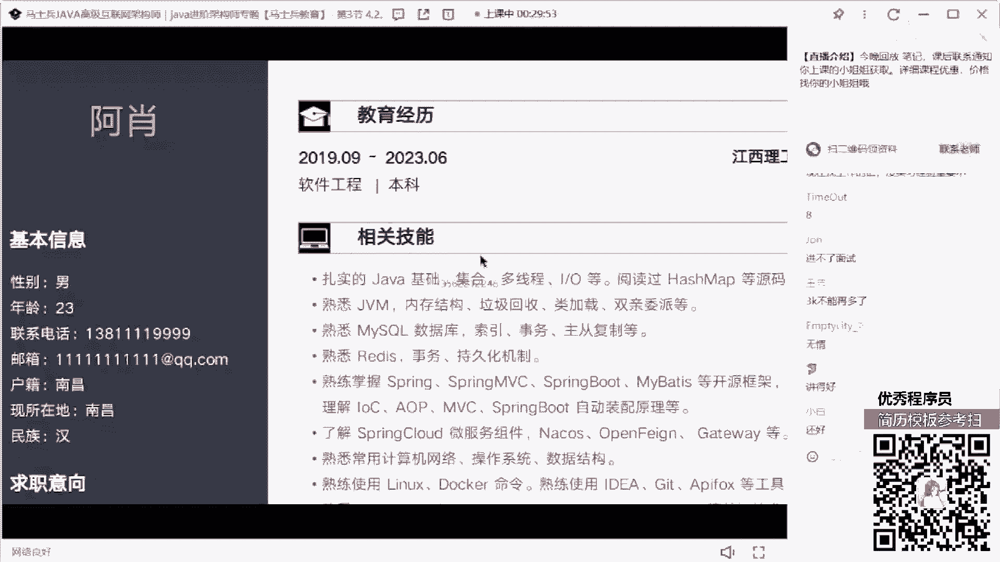

来看这个同学，这个同学在吗，算法来扣个，一来还好是吧。

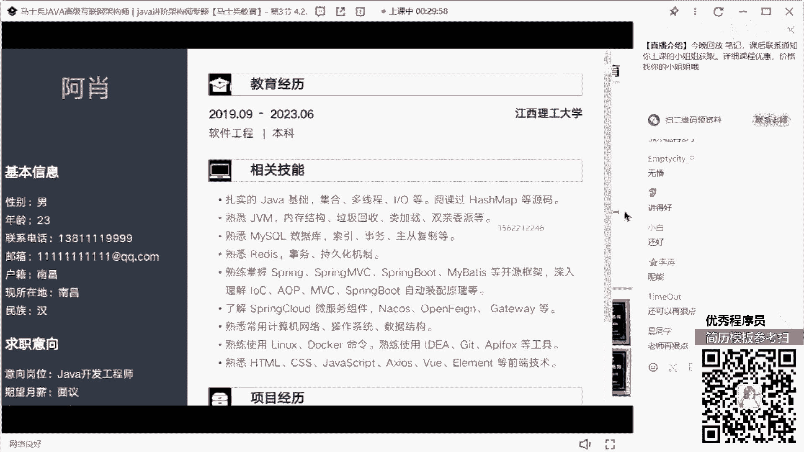

在吗，在的阿七同学太轻了，那么最好知道是谁啊，呃阿消ler是吧，来看这个同学他的技能情况，23年毕业，应届毕业生，今年6月份大学毕业。

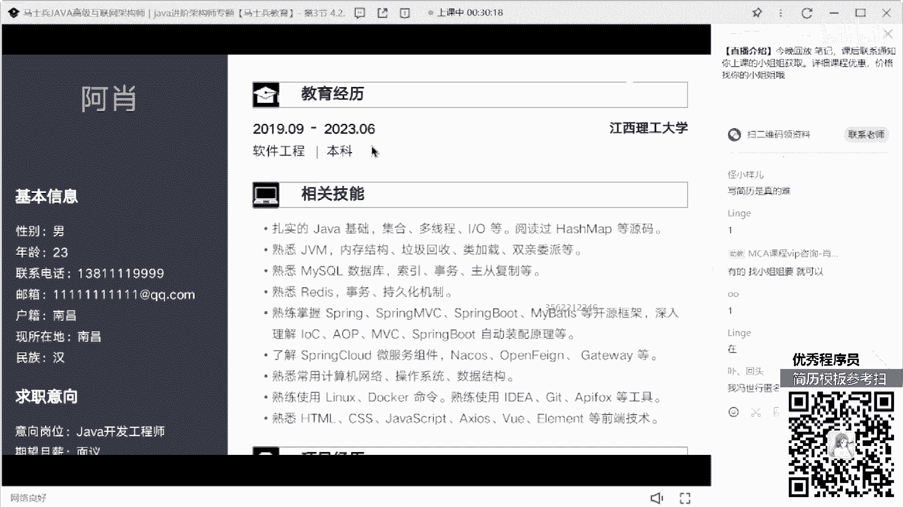

然后呢技能有java基础的，hash map的，jvm的，mysql，redis，spring boot的spring out，然后另一次docker前端，这些技术项目经理在线交易平台。

然后技术架构是这些，主要职责是这些，然后将将理论坛是一个网上交流平台，什么之类的啊。

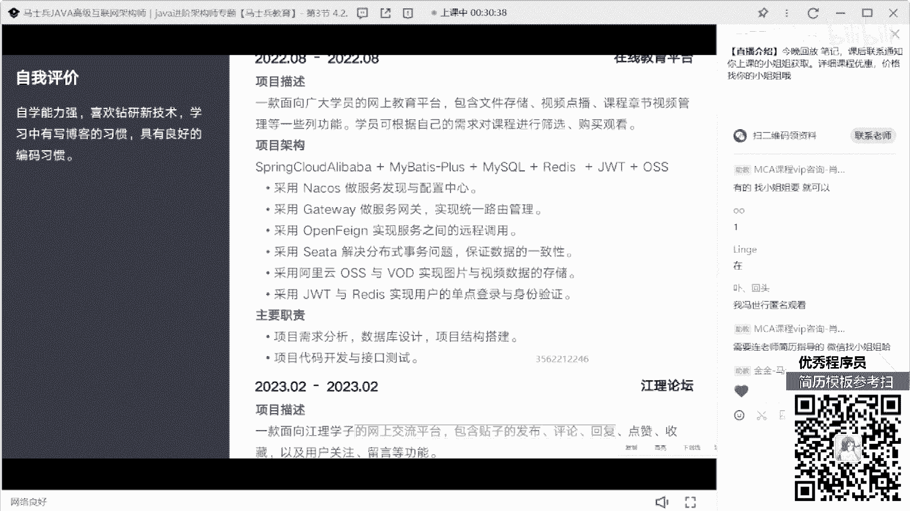

通过的，通过的技术有bot by vue pass element，自我评价咨询能力强，先说一下他作为一个应届毕生，他会收到面试邀请吗，如果你们是面试官，你们会给他面试邀请吗，对啊。

这个解释里面有什么问题啊，听好了，从目前你所展示的这些技术站上来看的话，其实比很多应届毕业生要强的多，要强得多好吧，但是这里面依然有很多对应的一些短板的描述，没有加进来，大家把会打在公屏上里面。

要是语塞我，我我也没说不会啊，对不对，我说了这个技能描述，从这块来看的话，可能还不错，可能还不错，但是这里面缺少一些技能描述，比如第一个并发编程没有加进去，第二个q相关的技术没有加进去好吧。

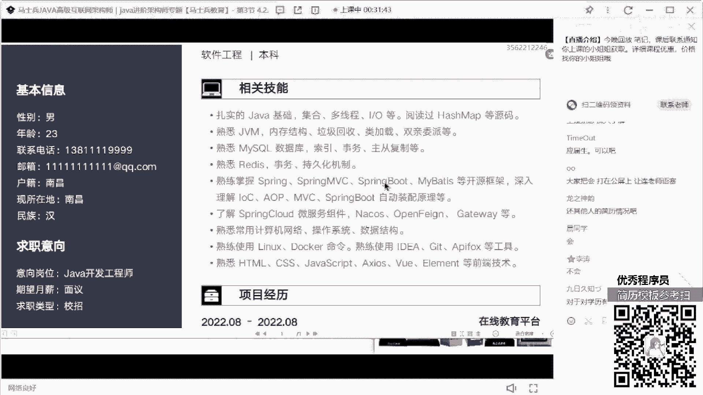

然后我希望大家所有人注意一件事，不要在简历的技能描述里面出现一个东西，叫了解，因为了解等同于不会听懂了吗，所以不要加了解这东西没有意义，然后你要突出什么东西，你现在大学生这块东西重点突出好吧，祭祖了。

网络了，操机操作系统了对吧，这个东西可以做点突出，数据结构单独拿出来写，包括你对于算法方面的储备，单独拿出来做一个描述好吧，那么紧紧跟着在你的项目里面，要把你上面涉及到的所有的技术。

或者尽可能多的技术要把它给覆盖掉，这写了一个在线教育平台，你的时间是2022年8月到2022年8月，这是怎么完成的，一天一个月一个月搞定一个网上交易平台，就如果你们在大学期间。

没有正儿八经的一个实习经历，或没有正儿八经的一个工作经历好吧，但其实没关系，其实没关系，你可以把它说成你在你们学校的教研室了，老师组织的叫你你你是什么烟，研究室里面可以做这个项目，但时间周期好。

要把它给排好，同时你要详细的去解释清楚，里面到底包含什么内容，懂我意思吗，这项目告诉大家是一个在线教育平台，那在教学平台里面应该包含什么东西，第一个直播内容，第二个录播内容，第二个第三个课程展示。

学员管理，这个东西可以写，你是不是可以加上这个在教育平台已经属，包装成你在教研室给外部齐用的，你们老师接的私人的项目，这项目目前已经在用了，找一个小型的这种教育平台，把它给写上去，是不是可以啊。

包括你们能不能加一些数据量，目前满足多少人同时在线观看视频，再讲平方嘛，就可能实际上这个项目还没开始投产，没开始上线，但是你们在一开始构建这个项目的时候，里面其实已经准备了这样的一些预处理工作。

它可以扛住这个东西，那如果扛不住怎么办，动态库作容是不是可以这东西加一下，但作为应届生的时候，老师老师应届毕业生物又不写到这个程度吗，有还是那句话，你要展示自己的优势和价值，这是这个项目。

然后下面这个职责写太少了，需求分析，数据库设计代码。

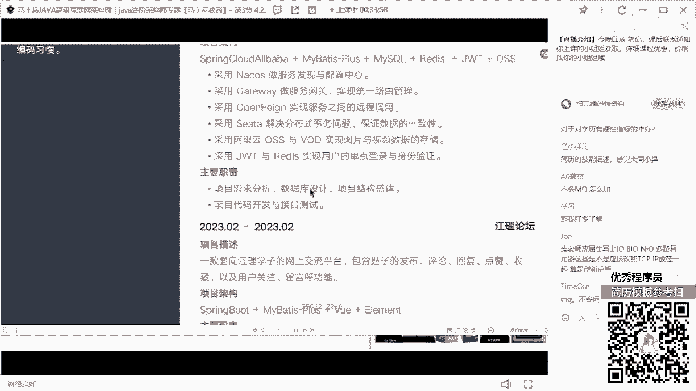

代码重构，然后呢，什么项目代码开发和接口测试，你写跟没写一样。

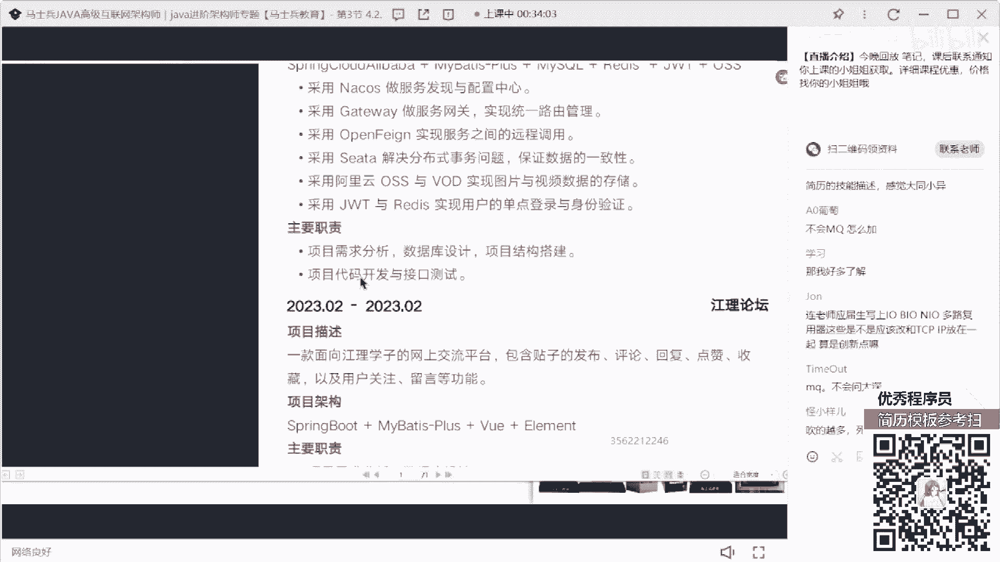

你要写的是我用什么技术实现了什么样的功能，遇到了什么样的问题，怎么解决的，懂我意思吗，好吧，下面项目也是一样的，这项目说白了，就类似于是你们学校里面的一个课题小作业，和类似于一个毕设的一个东西。

那这个其实含金量就不是那么高了啊，最好再加两个，哪怕是找了一个开源项目，你最好能够写进去，突出一下你自己的项目的实际开发能力，和你实际的这种编码的能力，怪小燕说，吹的越多，死的越惨，是你不吹。

连面试机会都没有，你是七，你是选择在面试中被捶死，还是选择连面试机会都没有，你自己挑就很多，一直抬杠，老师这块我能写精通吗，技能我能写精通吗，我简里面写那么多问道，我答不上来怎么办。

我觉得大家很多人都想错了，为什么你连面试机会都没有，你啥都会没有，面试机会，你告诉我，你学会会会那东西干啥，就是你要记住，在你本人的技术知识的储备之上，适当的去夸大一些东西，适当的去包装一些东西。

让你能够更多地被别人看到你的价值和能力，先把面试机会拿到了，拿到面试机会，这种大盘没过，最起码说我面试了，我知道我自己哪有基础短板，我应该如何进行查漏补缺，我最起码涨了面试经验，你天天照实写。

写的非常朴实无华，写的非常诚诚恳，非常认真，你们要面试机会对你的成长在什么地方，懂我意思吗，所以这东西啊，我希望大家能认可我这个说法，我不会坑你们，坑你们没对，我没有意义，我不会坑，大家懂吗。

你按照我这个方向去做啊，可能你内心可能大学刚毕业学生，你可能内心不太能接受这个东西，但是为了生活，你必须要给我接受，人该低头的时候就要低头，老师我就想到手写，我就不想包装。

我就想说这个实际的你等着没工作吧，懂我意思吗，市场要求是这样的，你必须这么干，我还是那句话，你打不过别人，你就服从，听懂了吗，要不然你就干别人，要不然你改变市场，你要有这个本事，你去做去，没这个本事。

我踏踏实实，企业可喜欢看什么，企业要求什么，我们就会什么，这才是对的，好，希望大家想明白这个事儿，收起你们那些所谓所谓的说直接点很多，但可能会有很多应届生的同学，收起你们那些可怜的自尊心。

收起你们的内心的正直，收集这些东西，因为这些东西对你找工作，对于你的生活而言没有任何的加持和意义好吧，所以我说了，刚刚说的东西进入这块儿再做一个风好吧。

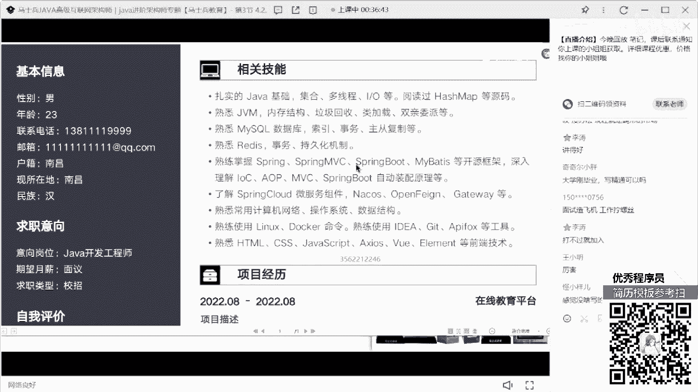

然后呢项目经历这块再好好写一下，感觉没啥写的怎么办，当你感觉自己没什么东西可以写的时候，就说明你本身的技术储备，你的项目都有了问题，你应该先想的是，我把我的技术和我的项目经验补充起来，再想找工作。

而不是在我什么都没有的时候，我想着说我要怎么写，其实什么都没有，水也可以写，你能不能扛得住，你要能扛得住，你就这么干好吧，那这个自我评价就没意义了好吧，我问一下咱们有多少同学是应届毕业生，给老师扣个一。

这我要给大家说明一件事，说明一件什么事，就是咱们有很多应届毕业生啊，我刚刚说了，对于很多在职的同学而言，他可以在自我评价这块，突出一下自己的行业背景，行业背景，自己技术经验，自己在项目中遇到的一些问题。

自己提出的解决方案之类的东西，好吧，都都是这样的情况对，但是对应届毕业生而言，老师我没有真实的工作经验，那我这块我应该怎么去描述我的自我评价呢，其实非常简单，作为应届生，你要展示的是什么。

是你自己本人的技术沉淀和你自己的技术储备，好吧，那句话怎么写，举个例子，比如说对技术有深有深有有热情，深入研究过，研究过什么样的技术对吧，对什么技术有深入的理解。

然后在linux上面有多少题目的一个储备量对吧，我之前自己做过哪些科研的项目，在项目中获得了什么样的一个成长对吧，自己私下里看过哪些核心的技术类的书籍，包括自己看过哪些github的项目。

我自己做了哪些博客的积累和沉淀，这样东西是可以写的，就是你所有要展示的东西一定不是虚的，而是可量化，可被面试升官所提问的东西，因为你只要把你会的东西给面试官展示出来，他才知道怎么去问，你能理解意思吗。

毕业生同学能能能能听明白了吗，好吧。

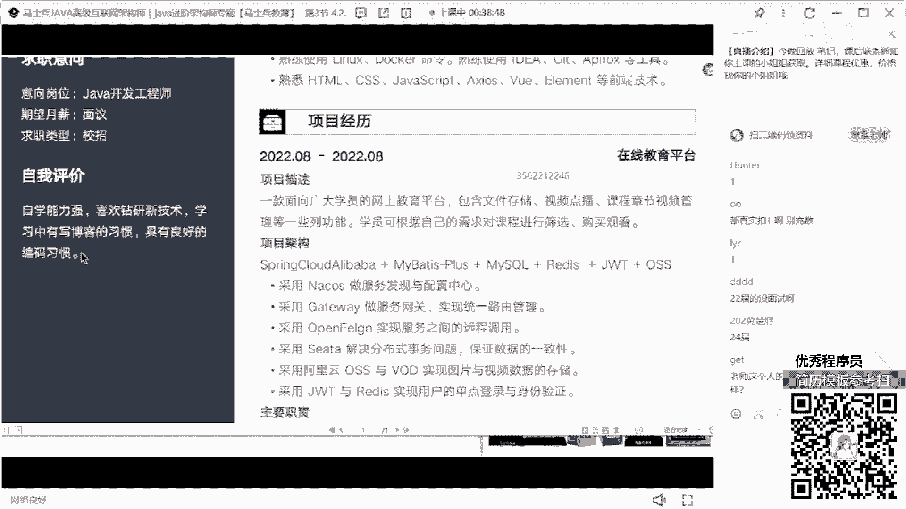

他这个同学写的技术站对于应届生而言，其实已经很不错了，真的很不错，因为很多学生可能都不太敢写这东西，像gbm什么内存结构了，垃圾回收类加载声音尾带可能可能会不敢写，包括mysql什么事务所啊。

主从复制可能都不太好，不太写，不不不太敢写，但他敢写出来，我觉得已经不错了，就这些同学啊，面试机会我觉得肯定会有。

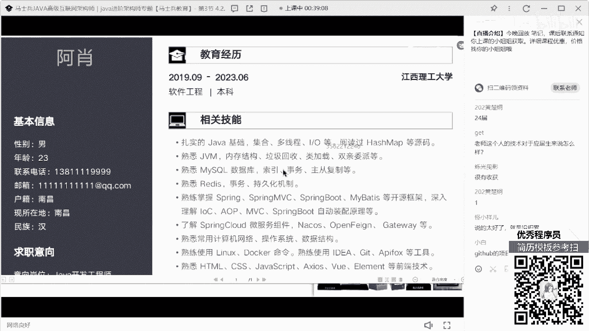

肯定会有，但是面试的时候你能达到什么样的一个程度。

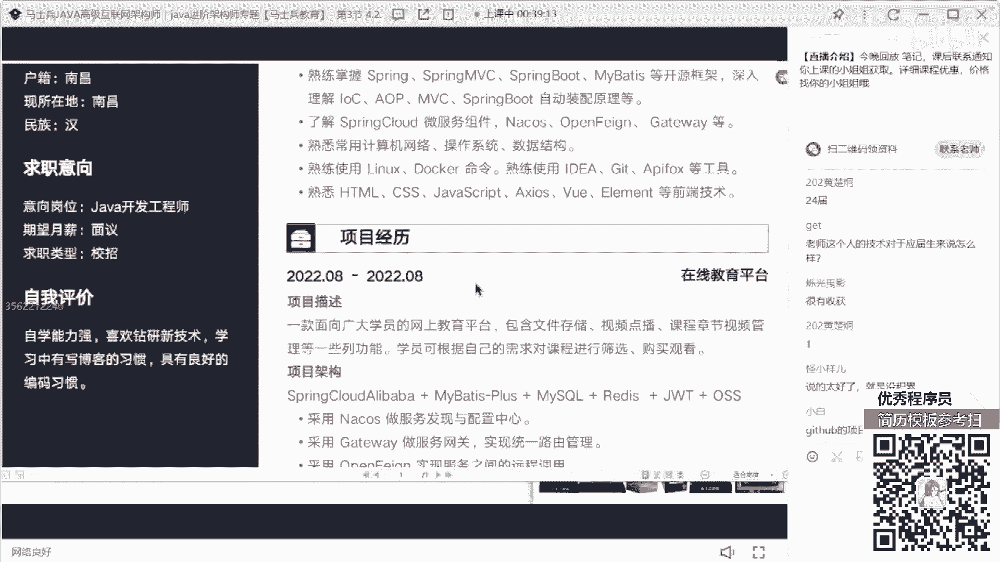

就看你自己技术上的储备了，懂我意思吗，好给大家上面也算吗，我还以为不算，你在大学里面，当你没有那种实际的环境的时候，你可以说我在教研室里面跟老师做了两个项目，但是除此之外，我自己私下里面还做过很多项目。

看过很多科研的项目不就可以了吗，对不对，这下面说技术上怎么分类，技术上不需要分类。

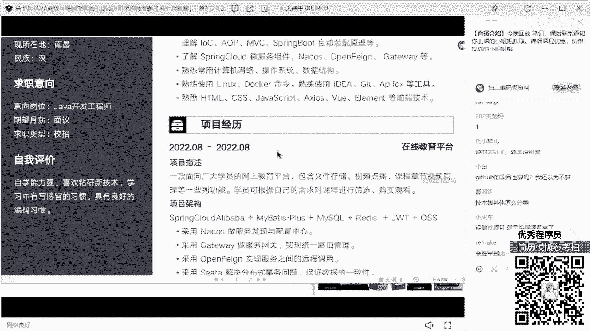

我很讨，首先大家在这块加上什么前端技能，什么后端技能啊，什么运维技能分的很清楚，没必要没必要好吧，就是12345678 90挨个罗列出来，把你的技术宽度和你的深度。

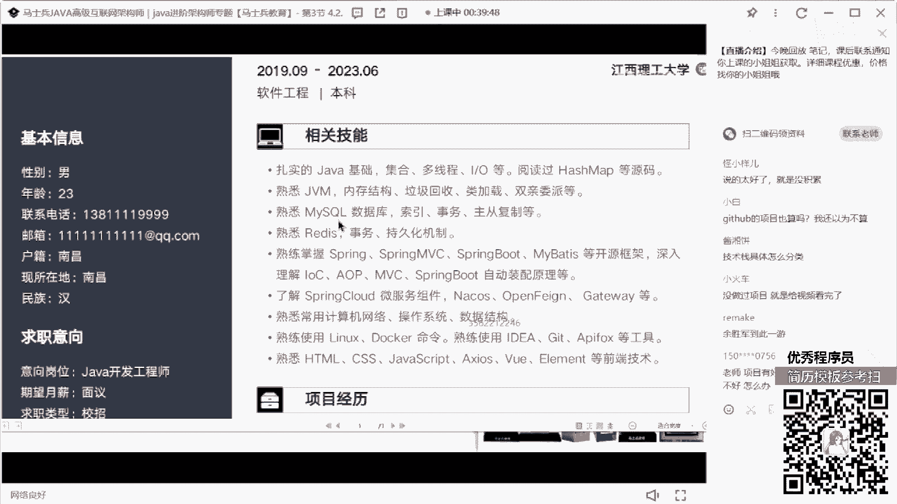

本来展示清楚就够了好吧，这个同学我刚刚告诉你同学的建议了。

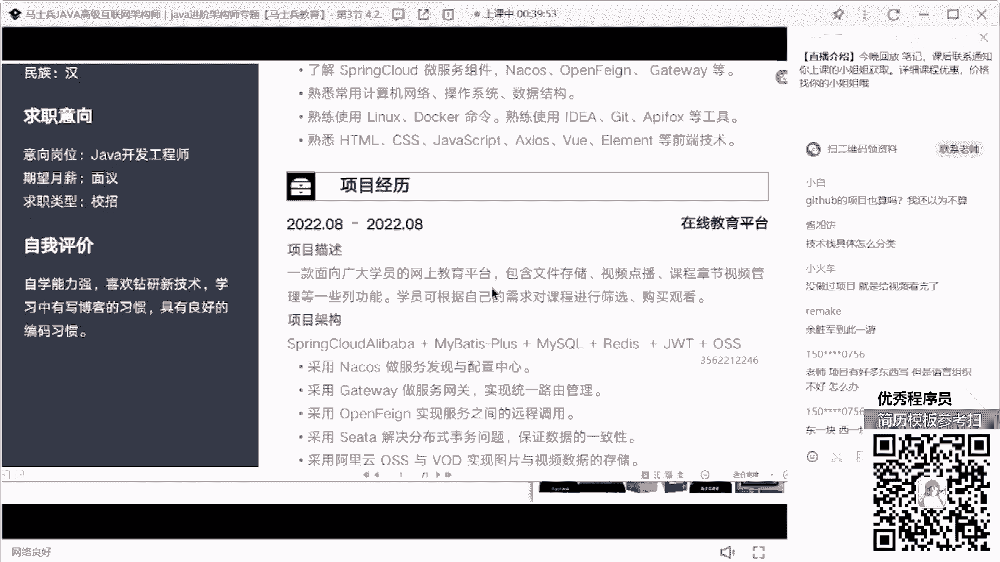

去改一下好吧，老师项目有好东西有好东西写，但是语言组织不好怎么办，语言组织不好，你就想如果你想给别人解释清楚这些项目的话，你会从什么地方来描述，其实你在描述的过程就是你写的过程。

什么样的方式叫总分的方式，然后你可以把你的项目做一个最基本的拆分，拆分成什么，拆分成一个思维导图，按照思维导图的方式来进行描述好吧，lcc说项目管理技能可以需要写吗，需要如果你真的把你带过团队。

有这种项目把控的能力好吧，人员管理的能力可以在你的个人评价里面加，今天网络不是应该单独写一行吗，你可以拆分啊，如果你有这个能力的话，你还有什么a p p p p p s了，什么三次握三次握手，四次分手。

这样的东西你敢写的话，你就写嘛。

