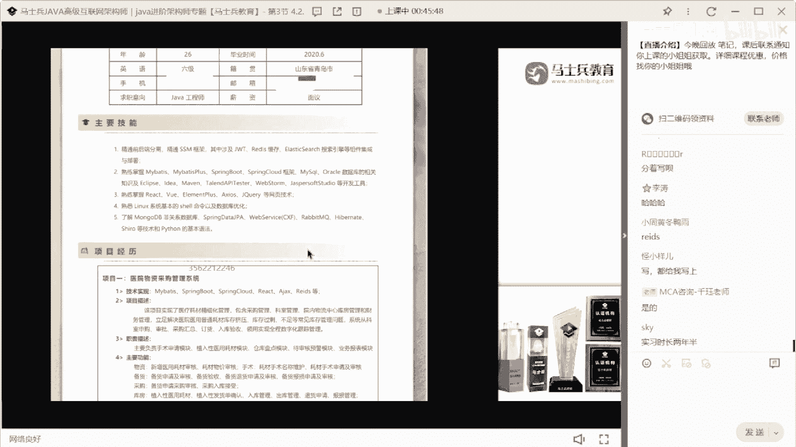
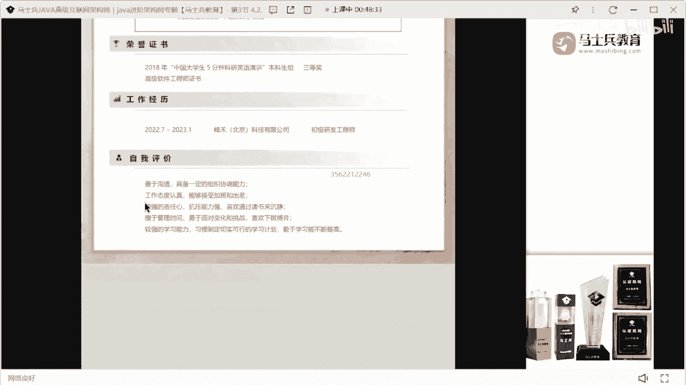

# 什么样的程序员简历一看就没戏？当代互联网HR最喜欢的简历套路有哪些？马士兵告诉你普通程序员写简历千万别太老实！ - P10：一坤年Java经验女生简历指导 - 马士兵小鱼 - BV1oP411Q73J

大家看这个同学们请退散吧，这个这个这这这这这应该是个姑娘的简历，这小姑娘在吗，在要扣个一来，听好了，你解决问题，第一个把这个花里胡哨的模板给干掉，把这个花里胡哨的模板给干掉好吧。

这个花花哨的模板没必要没必要，第二个节日里面不要加这种表格，这种表格的可读性非常差，你该对齐的对齐就行了，没必要去加这个表格，信息，表格完全没必要好吧，第二个主要技能，你几年经验啊。

这是b22020 年6月份，前2年半的工作经验，技能精通前后端分离，ssm框架，jwt redis es就这几个东西，你是怎么你是怎么关联到一块的，看完全没必要关系到一起好吧。

然后下面又写了一个bis my basic plus，spring boot，spring cloud，还有把mysql oracle写一块了，然后又把这些开发工具写一块了，然后下面又写了前端技能。

又写了linux和shell，又写了model bb，然后又加了这些东西，还加了python，就这个东西啊，首先不管你真实工作经验是多少，最起码说你现在的这个简历里面。

看起来你的经历应该是2年2年半的时间，那么你这些技能我还是那句话，你们要对应的技术站的细节，好好去描述一下，该归类的归类，不该归类就不归类，而我现在建议是什么，不要去归类。

每一个技术站都可以单独拿出来写，s s m可以写g w d可以写，redis，可以写e s可以写，对不对，mysql可以写哪个技术不能拿出来单单单独写一下，你把它撑宽了，没关系的。

你整个一页a4 纸全部都是技能，你不是很牛逼吗，懂这意思吧。

好吧，来再说他的项目经理，医院物资采购管理系统就是个cl的项目，项目实现了什么东西，然后呢此时的描述，然后主要功能，然后供应商发货系统就是这东西，然后平台管理系统就是这三个项目，大家怎么样。

说白了这就是一个基础的开发工程师，就是做c i d速度，c l d他就是单体项目，没有什么含金量，也没有什么额外的价值，好吧，容易证书不说了，这是它的所在的公司，实际上有半年多的半年的开发经验。

是在北京是吧，那咱来预测一下你的薪水，大家觉得这个简历薪值多少钱啊，呃各位曾老师不用给我发简历了，我们收集到简历我能改完就不错了，今天晚上28份简历，我都觉得时间都改不完，所以不用再给我发新的了。

发新的我也不会不会再改了，好吧，k 10 k，目测啊这个小姐姐的薪水应该在八到十之间，不会超过12，能给到10k我觉得不错了，绝对不会超过12，11左右，我觉得10k左右差不多了啊。

但是我觉得应该是八到十之间，你们你们不要觉得北京就给的钱很多，真不是这样的，好吧，所以要改什么东西，第一个该写的技能要写的把它展示出来，第二个项目，如果你们实物应该有，这个绝对给不了实物。

绝对给不了实物，我说了技能这块该怎么写怎么写，第二个这个项目，如果你们公司里面做的项目都是这样的，就是后台管理项目啊，后台管理的一个系统完，那么注意你要着手去准备一些微服务的项目了，就是微服务项目。

现在是一个必备项目，小姐说了5。5k，小姐说5。5k好吧，就是如果你现在公司里面的项目，都是这样的项目的话，你要想办法去接触，或者说着手找一些其他的项目补进去了，最起码说微服务相关的基础上要展示出来。

你这个地方虽然写到了微服务，比如这块写个spring cover的，但是这些项目，说白了他哪些地方可以用到spring coud，他其实根本不涉及到这种服务的拆分，什么之类东西，我觉得暂时涉及不到。

暂时就不到啊，所以我觉得你要第一想办法找项目，第二把你的技术站要好好储备一下，就是你现在对于自己的技术体系，可能还不是很清楚，所以你的技能才会形成这个样子，如果你对你自己的技术体系很自信的话。

其实你的技术不应该写成这样，ok好吧，自我评价不说了吧。

