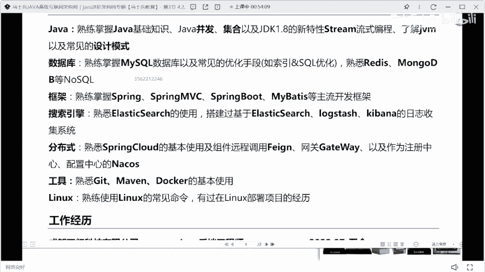
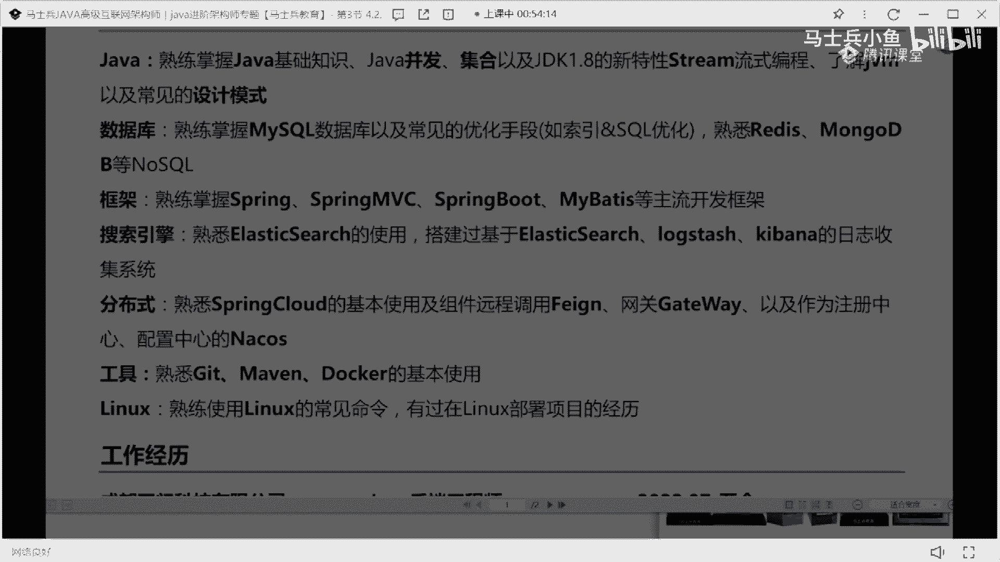
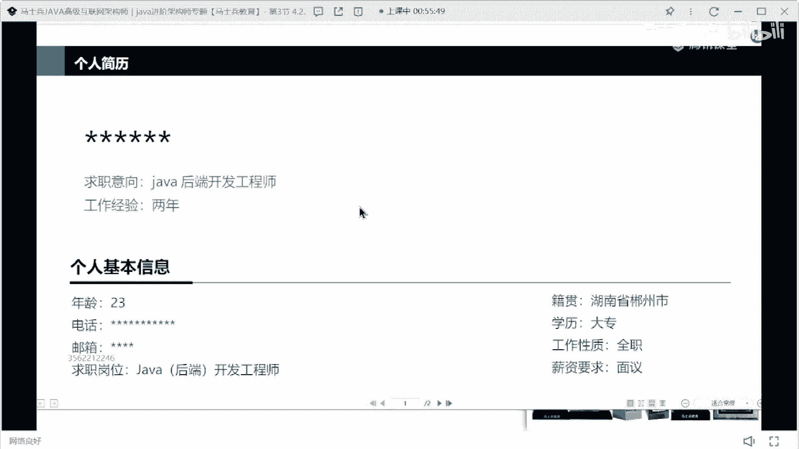

# 什么样的程序员简历一看就没戏？当代互联网HR最喜欢的简历套路有哪些？马士兵告诉你普通程序员写简历千万别太老实！ - P11：成都8k简历指导与建议 - 马士兵小鱼 - BV1oP411Q73J

来下一个呃这个小哥哥来看一下啊，这是我说的一个问题啊，朋友们，就是技能这块儿，我不希望给大家，大家自己去加这个分类，没必要，你就把你所有的技能12345，罗列出来就够了。

没必要去给他加这个加这个加这个分类是吧，然后找个mysql redis mongodb合到一块了，s s m，e l k平台，spring cloud，这个这个技能，202也是半年半年的工作经验。

指标管理系统嗯，那是增大互动平台，我说一下这个问题啊，第一个就很多同学一直觉得老师我不会写技能，有啥不会写的，这条技能，如果这条让你们写，你们你们会怎么写，大家注意啊，如果你是一个非应届生。

你已经有正儿八经的工作经验了，你的技能是不可不需要这么去写的，不需要写这么散，你知道吗，你可以怎么写，这东西，主要工作经验比较多了，再写一个精通人星空，或者写一个熟悉java，对不对。

然后说了多年开发经验，具备良好的编码习惯，并熟练使用，设计模式就够了就够了好吧，你现在是也有过建筑，不需要不需要把它这样搞了是吧，第二个比如说mysql mysql怎么写，你这样写吗。

东西mysql对mysql的事务索引做等相关实现原理，有深入理解，并参与过线上，项目的优化工作能这么写吗，能懂这意思吗，把你的技术深度和你的技术细节展示一下，这块你挑你自己会的东西写吗。

然后后面给别人埋个伏笔，埋什么伏笔，我做过sql优化，那这个这个东西列到这块的意义在什么地方，就是引导面试官去问你做过哪些sql优化，那么你是有机会和有能力，提前把这些sql优化的案例准备好了。

准备好明白吗，所以好好改改你们写的方式，你说你会ssm，有人bot这开发框架有啥意义啊，你后面可以加一个东西吗，这再加个啥，这个这个地方加一个什么东西能看出来，你你能凸显你的技术深深度啊。

这块加上的同学也就是技术准度，就加一句话就行，并阅读过核心源码懂吗，引导他去问你源码，你说老师我没票源码怎么办，能不能看看ioc的源码，能不能看看循环依赖的源码，能不能看看自动装配的源码。

能不能看看spring boot启动流程的源码，这四个问题能不能背下来，问到你其他的东西，你说老师不好意思，你为什么不好意思，这块没接触过我，我说的看过腾讯版，就是这四块，这四块你看你有没有想问的。

能不能这样说，牛皮吹破了，不吹你就这么写，不吹你就这么写，好不好，不吹你就这么写，你就写成你会这些框架就完事了，圆不了能怎么办，我就写了，我阅读过核心源码，问到了我就是不会能怎么办，会怎么样，会怎么样。

你告诉我，不就是不过吗，不就是面试不要你吗，对不对，所以你你你先去想办法拿到面试机会再说嘛，好不好，老怕被打击，收起你的玻璃心，老怕被打击，被打击了怎么办，被打击被打击了吗，你回来哭一场。

我我我在黑窝里面好好哭一场，还能怎么样好吧，刚刚我看一个同学说了一句话，说我去了之后干不了活怎么办，谁说来着，谁说一个去了干不了活怎么办，你先去了再说，先别担心能不能干活。

这就跟什么一样，这些同学问的。

写了不会去公司咋整，不会能怎么办，最起码你能感受一下面试吧，最起码你能知道面试官看完你的简历之后，他对哪些点比较感兴趣吧，对不对，最起码你涨了一次面试经验，你没有什么损失吗，好吧记住话不多说了啊。

然后工作经历这块呃，这可以这可以这么写，没问题，然后这个项目也是我说的，就这个项目写的有点简单了，这个指标管理系统它就是一个后台管理项目，这个也你说要包装，其实也没啥可包装的，然后这个增大互动平台。

然后里面包含什么体检，体检了政策的事项，什么之类的，这块最好可以说一下，包装一下你们这个平台大概有多大，然后呢你们大概有多少，每天有多少个访问量，然后目前积累的vip用户，或者说呃客户用户大概有多少。

最好加一加数据量描述，然后这里面有很重要的点，一定记住啊，不要去给我加这样的东西，面试你的是技术面试官，他对于自己的技术体系有自己的认知和了解，你不需要告诉他这是前端的技能。

你也不需要告诉他这是后端的技能，你也不需要告诉他这是什么技能，不需要分类，把基础名词罗列一下就ok了，好吧，然后职责描述这块一定记住，一定要分条写，12345678，把它展示清楚，懂了吗，把它展示清楚。

不要写成一个段落，写一个段落之后，我很难从里面挖掘到重要点和核心点，好吧来错了啊，都说了，我看肩膀能不能筛选出来。

