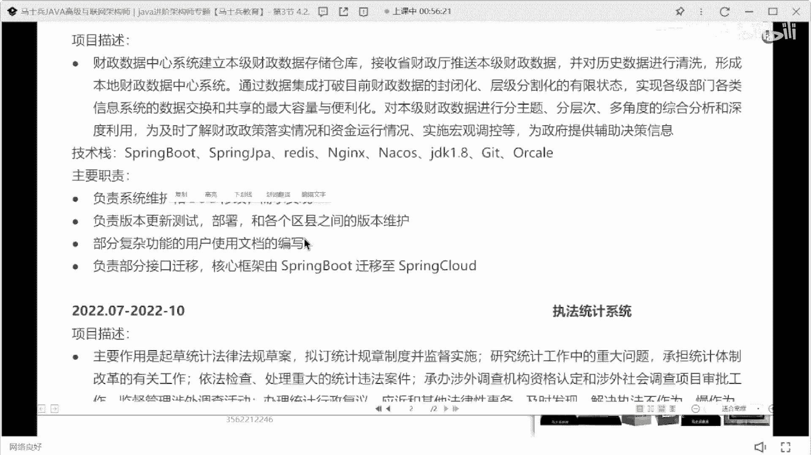

# 什么样的程序员简历一看就没戏？当代互联网HR最喜欢的简历套路有哪些？马士兵告诉你普通程序员写简历千万别太老实！ - P12：专科学习一年半Java经验简历指导 - 马士兵小鱼 - BV1oP411Q73J

呃看这个同学了吧，10万搞起。

10万我觉得一般的项目都扛不住，10万这样的一个东西啊。

23岁大专的一个学历。

长按技能描述。

这是2121年11月份。

22年1年1年1年半的经验，财政数据中心执法统计系统。

合同管理系统没了，来这个项目。

这个简历给给给多少钱啊，值多少钱啊。

大家这钱值多少钱，8k。

大概也就是十10k左右，10k左右这个区间呃，这个同学你记住了，有一个很重要的点是什么，你现在学历是学历。

学历大专大专的学历不是很占优势，所以呢这个地方不要有这大张学历，不要在这展示下面，单独放一个模块展示展示学历好吧。

一线城市，二线城市给不到，二线城市给不到他，这个地方虽然写的会有一些问题，但是最基本的技术的宽度还是展示清楚了好吧，但是在描写的时候，在描述的时候，像这个postman什么swagger idea。

get maven，这东西没必要放这么前面，大家一定记住啊，你们在写技能的时候，写技能的时候有侧重点的写，你想让面试官重点问的技术往上放，非重点问的技术往下沉，像这些东西。

什么postman swagger的什么idea maven，这样东西分成到最下面，包括前端技术写到最下面好吧，然后把你这些什么mysql对吧。

什么spring框架相关smoloud情况的engines redis对吧，然后开到nginx的东西。

把它往上写，马上写啊，分清楚重点在什么地方。

那他那个描述也是一样的，他其实说白了只是为了把基础名词做的罗列。

其实也没有突出对应的技术深度，和你自己的一个基础价值对吧。

然后呢工作经验1年多的这个时间，下面项目经理这个项目这块财政数据中心。

我不知道这项目是真实的还是假像，这种财政数据中心也好，还是执法统计系统也好。

它其实里面是可以展示具体的数据量的，就我大家发现了，我在讲项目的时候，一直给大家强调数据量这个东西，为什么要给大家强调数据量的东西，因为人啊对这种大段的这种文字的东西，是很难一眼挖掘到它的重心所在的。

但是你在你的文字描述里面，突然加了一些数字或者可量化的一些东西，展示的时候，人能一眼看到，那么这些点同样也是面试官比较感兴趣，或者说能比较喜欢问的点，那么你可以根据你写的这些数据量。

去给大家介绍一下你们项目的架构，你们项目的项目的数据沉淀，你们项目的存储的解决方案，明白吗，就这东西是涉及到这个引导的，一个最基本的过程，必须要有这样的东西，没有这样的东西是不合适的。

就这东西你该加要加上，所以每个项目下来如果能加的话，最好把可量化的东西给它加上，第二个就是负责这个职责，直到这块写的，我说实话他写的并不好，为什么系统维护bug修改实现需求，大家都这么干吗。

然后负责什么版本维护，负责什么文档编写，负责什么迁移，就这块写什么东西，我也给大家说，实则在描述的时候要分两部分，叫虚实结合，第一部分是虚的东西，第二部分是实的东西，什么叫虚的东西，什么叫湿的东西。

所谓的虚就是我们说的什么需求分析啦，什么数据库设计的，什么项目进度，监控了什么代码review了，就这样虚度该写写好吧，那实东西是什么，用什么技术实现什么功能，遇到什么问题怎么解决的，这东西要写下来。

可以是一个功能模块，可以是一个小的业务点，但是你要突出你的价值所在，因为你在简历里面写这样的东西是为了什么，是为了让面试官感兴趣，他可以有东西可以去问，这才是最主要的，要你写的这么朴实无华。

面试官可能没啥可问的，ok那你这个项目里面只得到基本写都一样。

这肯定不合适好吧，每个项目应该会有所区分。

也有所区分。

