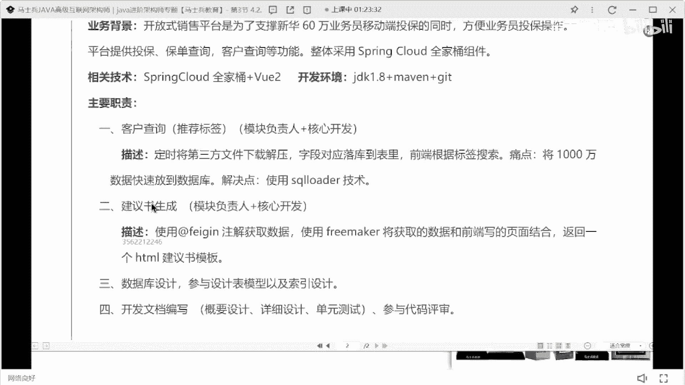
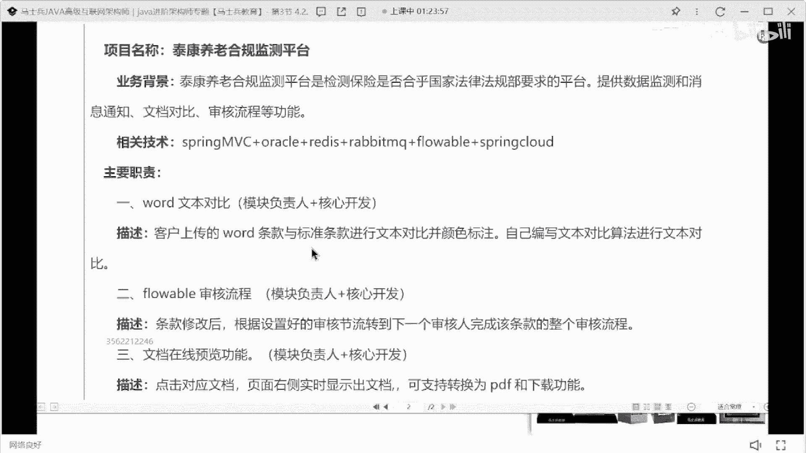

# 什么样的程序员简历一看就没戏？当代互联网HR最喜欢的简历套路有哪些？马士兵告诉你普通程序员写简历千万别太老实！ - P15：3年Java经验女生简历指导 - 马士兵小鱼 - BV1oP411Q73J

行了来下一个，来这个萌萌妹子来看这姑娘的。

这姑娘在吗，在什么追逐记忆来看好了这位同学简历，第一个同学们所有人以后都记住了，从你大学毕业，不管你大啊，这样不管你大学有没有毕业，大学里面展示的所有的课程没必要写，听懂了吗。

大学里面学的所有课不需要写，因为这些课对于企业的认知而言几乎等于零，他不需要写，他不需要写，写了之后也没有什么实际的意义和价值啊，所以是不需要写的东西的，来让大家看一下技能。

20年毕业正式的工作经验多少啊。

2022年在中科软外包，我现在差不多是2年多3年的一个工作经验了。

3年的工作经验，这样的技术明显是不足以支撑的，而且这里面有个很大的问题，12345687呢，去哪儿去了，对吧，然后这里面虽然写了七条，这个这个其实没啥用，是不是，这意思就相当于展示技能，只有这些。

那只是把这些技术名词做这些罗列的话，那说白了他怎么能撑得过你3年的经验呢，撑不起来吗，还是我说的那句话嘛，就大家所有人都是这样的技术罗列，那你的优势在什么地方，别人凭什么让你去面试，懂我意思吗。

完了这句话，在技能技能这块，所有人技能在一定都会好好描述，那么既然好好描述了，你就要想办法去展示出你的技术深度。

和你的技术细节，这个自我评价就很虚了，不写了不看了好吧，做评价写到最后，如果你的自我评价很优秀。

往前提不优秀，往后放技能特长没必要，他没有啥加持的点，对找工作而言没有什么加持的点好吧。

项目这是一个销售平台，60万业务员投保方面，业务员投保写的简单了，就这本身是一个保险的销售平台，那么你就可以把你们保险，目前有的保险的数据量是加上，同时可以把每天啊并发操作数据量加上。

可以把这个整体的数据量扩大一点吗，你60万业务员啊，1/10的人每天入一份保险就6万，这数学还是可以写的好吧，然后呢相关技术不要这么写，有人考虑全家桶加v e r不要这样写。

把你视频中的每一个技术点一二罗都罗列清楚。

动画分割罗列清楚，开发环境也没必要好吧，主要职责客户查询建议书生成数据库设计。

开发文档编写，我还是那句话叫用什么技术实现什么功能，遇到什么问题怎么解决呢，以这样的方式来进行描述啊，一定方式来描述监测平台一样基本一样的。

基本一样的好吧，这俩项目吗。

这个这个这叫叫叫什么来着，非洲记同学呃。

你现在差不多将近2年的工作经验，两个项目有点少了。

因为你这个项目它不是一个非常大型的项目，不是非常大型的项目，所以你可能要写三个，才能支撑得起这2年的经验，ok好好听课。

别捣乱好吧，他是20年开始参加工作的。

这2年的经验，两个项目有点少，这项目就这种项目没必要开发1年吧。

没必要真的1年没没没没必要开发1年，我看完，反正我看完一点描述。

我觉得很简单，它不需要1年的开发周期，好像描述项目背景。

我刚说了，按照我刚说的方式去做修改和调整，修改和调整呃。

刚刚有人问老师外包经验要写，你如果只有外包经历的话，你你你只能写，你不写怎么办嘞，那怎么办呢，这小姐姐。

你现在多少钱，薪水多少，你现在薪是多少。

13 13是吧，有期望薪水吗，有期望薪水吗，这个姓氏给的可客观啊，15人得有点野心，从13k涨到15k，同学们，大家一定记住一件事，朋友们，我我我我要我再说明一件事啊，你们在跳槽，在选择薪水涨幅的时候。

我希望在原薪水的基础之上，至少涨到50%左右，如果你只是想涨2k的话，你这个跳槽是不值当的，因为你的跳槽会带来你履历上的变更，这种履历的断层，那么这种断层是为了拿到更高的薪水，而不是拿两个k球票，懂吗。

所以下一次找工作咱不多说啊，咱不多说啊，最起码你拿个18涨5000块钱，最起码懂我意思吗，让你涨2000块钱，真的没必要，2000块钱你跳槽意义不大，真是意义不大，所以我希望大家在定目标的时候也定的低。

一别太高，b2 也别太低啊，你们的心理预期不应该是不应该是这样啊，所以呢你的薪水涨幅的空间要把它给控制好，那同样的要掌握这个空间，你肯定是要把你的技术好好去储备和沉淀一下，好判断这种原理什么之类的东西。

好好去思考琢磨一下，好把技术准备好，项目好好美化一下。

