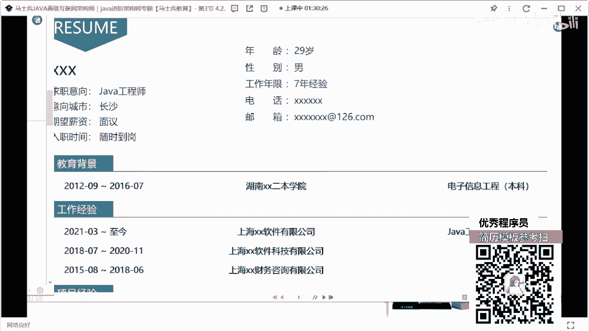
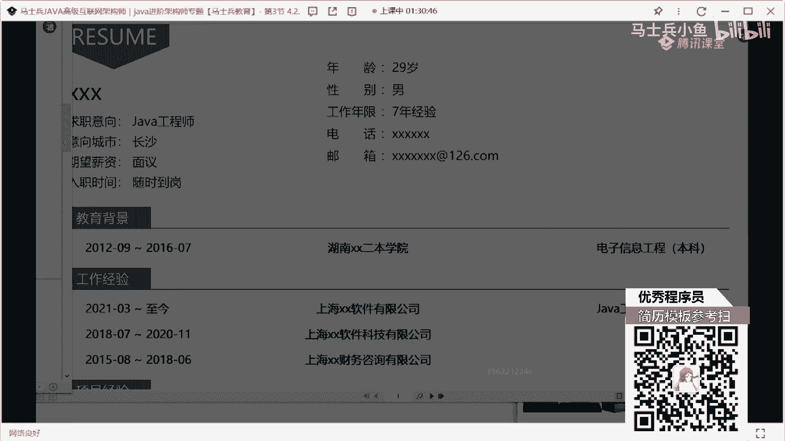
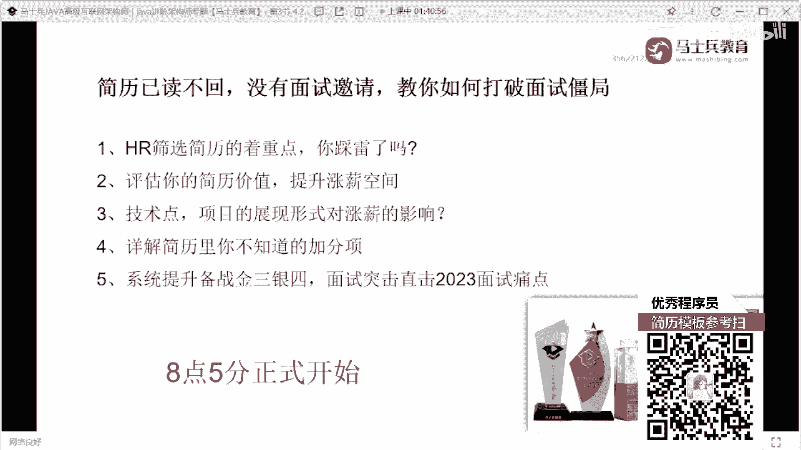

# 什么样的程序员简历一看就没戏？当代互联网HR最喜欢的简历套路有哪些？马士兵告诉你普通程序员写简历千万别太老实！ - P16：29岁7年Java经验简历指导与建议 - 马士兵小鱼 - BV1oP411Q73J

那个我看了评论区，还有人说想改简历啊，这个咱们现在简历也改不过来了，所以这个没办法了，好吧，看看时间吧，这个简历不能不能看了，不看了好不好，来看这个同学的，大多数人压工资，降薪能涨起这份满意。

当然写好的另说，我觉得大家就是怎么说呢，大家可能被最近的市场给打击到了，所以很多人选择去接受这种匠心，我觉得在你的技术储备没问题，没有问题的情况下，没必要去呃，降降薪没必要降薪，工作好找吗，不好找。

但是我觉得没必要去降薪，你要有自己的技术的傲气，和自己技术的坚持所在，投了半月简历就一家面试，你要分析你投个半月，只有一家面试的问题在什么地方，因为我们只有找到问题之后才能解决问题。

你们只是告诉我说我半年半个月只有一家面试，你你没有发现的问题啊，为啥发现只有一家面试，对不对，来这个同学在吗，都是一路不回，你需不需要，我给你展示几个最近找到工作同学的案例啊，你需要吗，我真的觉得。

但我我承认啊，现在面试的机会确实少，我承认这件事情，这是客观的市场情况，但是不代表没有机会，你懂吗，不代表没有机会，你看清楚好吗，这同学这是这是这是这个这个是微信聊天记录，我给你看聊天记录，你好。

这玩意太简单了，上周我去深圳现场面试，问了一个多小时，问了个什么东西，念完之后，周末催着赶上去，又有新工作了，不至于失业，这是2023年3月7号的，这位同学，2023年3月4号，平安租赁契约所。

还有销金还是金融，这个钱涨了10k是跟我说的，你懂我意思吗，不是没有机会明白吗，机会少是对的，但不代表说你一定一点机会都没有，你说一点机会都没有，这事有点扯淡了，这段是看本科怎么着研究研研研究生。

等我一下啊，我给你看一下，然后打开简历了，我给你看一下他的他的还是没写学历，他觉得应该是本科还没写，我看看怎么能打，怎么能打个码，看一下，其他的技能描述，就刚刚那个拿到三高分的同学，记得描述。

有多少人敢这么写明白吗，我再一看那项目怎么写的好吧。

你看这个这个这个这个这个项目怎么能，给他打个码截图就打个码就行的信息暴露了。

他写的项目，他接项目，就是你们，不说了好吧，就你们总觉得我在吹牛或者怎么样的，谁说这个没人要了，我说这个人拿了三个offer好吧，涨十涨了10k，所以啊我希望大家正确的去看待市场，正确看待市场好吧。

没看清就把人看清，刚刚我点开这个简历的时候，是在微信聊天记录里面点开的，这个学生拿了三个offer，我刚刚点开的是我刚点开的是这个简历，好吧，他是拿了三个公司的offer，涨了涨了10k。

涨了10k的薪水，好，来我们现在该点点了好吧，所以我说了呀，呃市场差是差，但是不代表一点机会都没有，所以我希望所有小伙伴能够，正确去看待这些东西，还是那句话，你现在没有面试机会，没有面试邀请。

大概率的问题其实就是出在你自己的简历上面，你要把你的简历好好去润色，好好去修改，找到你的问题所在好不好，别老抱怨这个抱怨那个，说白了他刚才说老师写了一堆精通，你敢写吗，我每次在讲技能剪一首。

我让他写精通，很多人就上来怼我老师，我写精通会被问到死的是啊，你可能会被问到死啊，你答不上来啊，你技术储备不够，你可不答不上来吗，但是你从来没有想过，你不敢写精通，有多少人敢写精通，你想过这事儿吗。

你懂你能懂我意思吗，你跟别人同时去竞聘一个岗位了，别人写都精通，你现在都不敢写，是不是这意思，阿白现在简历都不看，为啥你别人不看你简历了，为什么别人不能不看见不看见你啊。

你在boss里面上来跟别人打招呼打招呼，打完招呼之后就拿，就把那个默认话术一发，别人叫李，你看你的简历凭什么呀，我问一下有多少人用boss直没投简历，有多少人一对吧。

你上来在boss之内上发一个默认话术给别人，给h2 h2 ，要点开你的简历，挨个看一下，凭什么呀，就我举个例子，大街上过来十个美女，你过来之后，你就给别人说美女加个微信啊，别人就一定要加你是吗。

你讲不讲道理啊，你在刚开始跟别人产生互动沟通的时候，你就没有吸引到别人，别人就要看你的东西去，凭啥你讲不讲理，好吧不说了好吧，一说这个我就生气，就是我每次给大家说这东西时候，很多人就一堆人出来。

就是死抬杠抬死杠，你好好描述一下自己，你夸夸自己，你相信了，你把他房本车钥匙往那一扔，很明显就就就就那啥嘛，看这个7年经验，2947年经验作为背景二本，然后经历15年，3年2年，然后这是1年2年。

营销中台，营销系统动态项目是啥意思，退税醒，这是我说的朋友们讲大专吗，我不知道有没有大专学历的同学不注意啊，这个技能我再我再挨个说一下，第一个这个技能课程我说了，不要做分类，做分类没有意义啊。

你就把你所有展示的技术要显示出来，这里面写的gb m写的对话编程，这是啥，linux系统写的spring boot，spring cloud，mysql n这个词e卡不卡，洛克的q docker没了。

就这个东西啊，我希望所有同学还是那句话，把你的技能特长，把你的技术描述，如果充满了好不好，什么叫充满了，能写多少写多少，能多写就多写，能多写的地方不要去少写，懂吗，你少写了没没意义，然后再说项目这块。

像你做这种营销中台，你要让他第一个像背景，像背景去好好写写，你这个项目没有之前是什么样的问题，有了这个项目之后，它解决了什么问题，它里面包含哪些核心功能，做了什么，自定义化，自定义化的营销。

怎么做到这种精确精确定位的，每天做到这种营销的方案是多少对吧，对应的数据量是怎么做的，你要好好写一下这东西，项目结构就没必要写了，把相机都没没必要写什么网格服务，营销服，这不就是模块吗，没必要写。

值得描述，好好写一下，我说了虚实结合啊，用什么技术实现什么功能，遇到什么问题怎么解决的，把这个东西好好描述一下，就是项目是可以聊的，有的聊，但是你的写法看起来没啥聊的，第二项目也是也是一模一样的。

所以你的项目描述方式是肯定要好好改一下的，你的数据量该凸显要凸显，该凸显凸显你们的中台服务怎么搭建的好，到底做的是业务中台，数据中台还是什么中台，把这中台好好介绍一下好吧，别的没啥。

然后呢大家一定注意写个简历的时候，我注意相信大家一件事，第一个上来之后先写个人情况，个人情况写个情况之后，第二个紧跟着描述技术，描述完技术之后，描述你的项目，描述完项目之后再说你的什么工作经验好吧。

什么教育背景对吧，什么自我评价在写这些东西，就是照目前来看，你现在写的这些项目和技能不太支撑的，你现在的青年经验，企业经验，你在你的项目描述也好，还是在你的这种自我评价里面也好。

最好能加上一些架构设计的能力啊，如果没有架构性能力，把你对应的技术的原理和底层的实现，也要好好进行一个描述，要不然真的不行，要不然真的不行好吧，大张枯死有多少大专学历啊，大专学历可以给他扣个。

一来有多少是大专学历，大哥你听好了啊，大专学历这个事儿对于你现在这个阶段而言，它已经成为一个定局了，你可以记住啊，你可以去学学历提升，但是现在来说啊，你的当然现在已经是一个板上钉钉的事了。

那对于已经是板上钉钉，并且没办法改变的事情，你有必要去纠结吗，我也承认，现在市场有很多公司看到你是大专，就没有面试机会了，你想一件事，如果你是大专学历的话，你能不能争取到更多的面试机会。

就我经常有朋友说，你们投完简历之后，别说话，不理你们，你们就猜是不是我学的有问题，你猜完，如果是你的学习都有问题，你做过哪些努力啊，投完简历了，你觉得你的技能描述，项目描述都没问题，但是没什么表情。

你觉得可能就是我的大专学历的问题，你做过哪些争取啊，你做过争取吗，横州的面试官不理你，你比面试官还高，还不理我，我还不理他，都这种心态，这哪行啊，机会是要靠自己去争取的，什么叫靠自己争取，别人不理你。

对不对，你感觉是因为大专，对不对，你能不能这样再给他说一句话，你说没事儿，我看到您读完我的消息，看我的简历，但是呢后续没有给我产生沟通，我觉得你可能是比较介意，我简历中的大专班的学历，其实从我工作以来。

我已经意识到我大专学历的缺陷和短板了，所以呢我已经在进行这种专升本的这种提升，好已经在考学历了，当然我意识到我的大专学历是烈士之后，其实我这么多年的工作经验，一直支撑着我。

说不停的提升我的技术和我的项目能力，所以虽然我的学历比较差，但是我并不认为我的技术实力，就比很多本科甚至研究生要差，我希望您能给到我们的面试机会，我不会让您失望，您可以让面试官考核一下。

我看我的技术储备到底什么到底是什么样子，我也希望您不要因为学历而去歧视我的经历，或者我对应的工作经验，你们能不能加上这样一句话，他不回你就不回你吗，你不回你没什么损失吧，万一回来呢，我告诉大家。

这东西很多同学去试了，他真的有人会回，而且回的人很多hr都会说，确实是因为您的学历好，公司有这样的要求，所以我没办法，反正有人这样说，那行吧，我来约您面试一下，就这个就是按公司要求的。

如果人家公司就明确要求就不要发专，那没办法，我不要，我不去了，明白吗，那如果别人让你去呢，万一有能播到一个机会呢，是不是理太卑微了，画面画面是吗，画面你就别这么干，那太卑微了，等你吃不上饭的时候。

你就不觉得卑微了，等你连续三个月，五个月，六个月找到工作的时候，你就不觉得卑微了。

