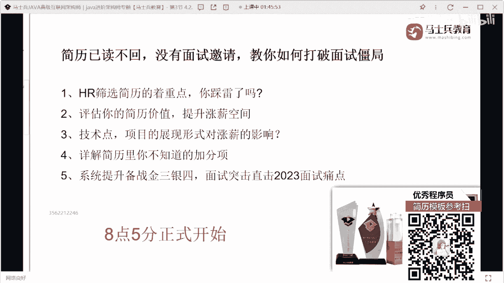
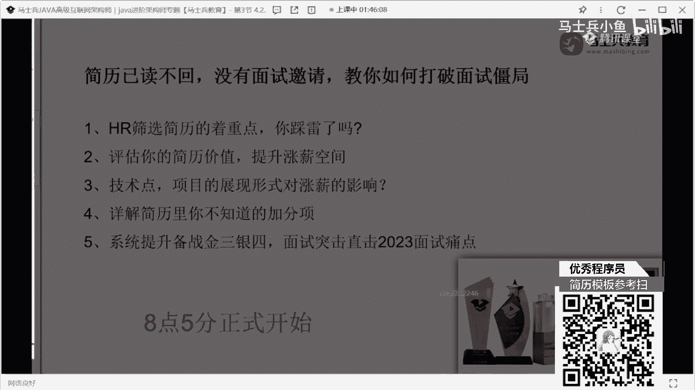
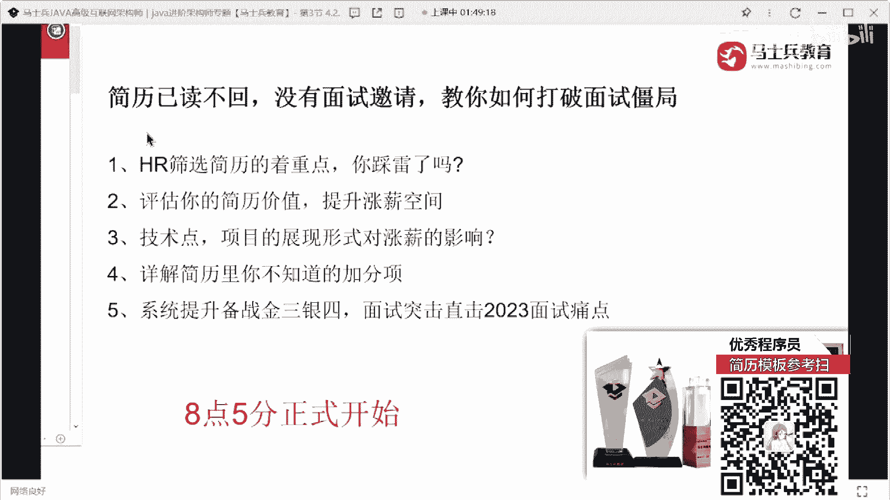

# 什么样的程序员简历一看就没戏？当代互联网HR最喜欢的简历套路有哪些？马士兵告诉你普通程序员写简历千万别太老实！ - P17：西安4年Java简历指导与建议【附优秀模板】 - 马士兵小鱼 - BV1oP411Q73J

来下一个陈泽希同学在吗，我说了，收起你们的自尊心，收起你们的面子，明白吗，把你们的玻璃心给我收起来，都啥时候了，还在乎面子，你面子的说难听点，一文不值，我不为五斗米而折，腰行别折千万别折，您千万别折。

别扯了好吧，啥时候了啊，想明白好不好，来看这同学28岁，4年功能做经验，你看看这个哼，就这个编号我都笑了，123678 90 11 12 234十10 11，这都啥玩意儿，这什么东西，这都。

把这个分类把这个分类给去掉，好不好，这个编号12345，顺着顺下来，明白吗，剩下的ok，基本的知识宽度啊，肯定是都有了，你看这个这个这个这个这个，这个这个这个描述啊。

第一个他做的是什么电用电信息的采集系统，对吧，然后二点的什么建设工作，相当于你做了项目的升级，能不能把你做的这种项目的升级和改造，突出一下，然后职责描述我说了12345，能不能说清楚啊。

怎么写写写写明白，咋去项目一项目四，那就好吧，明天项目吧智慧工作平台，这个行间距啊稍微调整一下，好吧，我那句话，该加编号的地方加编号，k这来的项目名称再也没有编号了，你这下面知道加编号。

上面就不知道加编号，你这咋凑的这份简历啊，还有项目二，项目三，太乱了好吧，太乱了太乱了，记住了，项目描述好好去写一下，我说了，通过三四行的文字描述，解释清楚这个项目是干嘛的，好不好，然后呢。

这个项目它有什么样的价值，它解决了什么样的问题，有哪些核心的功能点，它对应的数据量是什么样子的，好好写写行不行，值得描述，该写的写，没啥可说的，自我凭啥不说了，好吧，请坐请高筒，讲这么多了啊。

我们中间稍微休息一下，我给大家看一个电东西，这是一个同学写的关于技术的描述，你们敢这么写吗，看到了吗，啊把技术能不能这样写一下，就我说的你可以罗列的技术有很多，你真的不会没啥写。

你先把你的技能战给我撑满了再说行不行，好吧，这技术这一块项目这块怎么写，项目上怎么写，项目其实可以写的很简单，也可以写的很复杂，项目这块来写的时候，我说了，第一个叫项目描述，第二个叫技术架构。

第三个叫职责描述，我希望你把这三块给我分清楚，展示清楚，展示明白，就内容你可以写的差一点，我说老师我不会描述，我们可以写的差一点，这个没关系，这个没关系，但是最起码看起来条理清晰吧，对不对。

我给你看一个好吧，这位同学写的项目能这样写吗，下面告诉你，这是个saas平台，好提供这种私人定制的服务，下面告诉你技术，这里写，下面告诉我用我怎么做的，不是很清楚很明了吗，对不对，包括有同学可以写一些。

你找一下嘛。

打个码吧。

你这样写的东西吗，对吧，日货多少多少实例数据量多少，节点多少是吧，之则12345技术站这么多好吧，有的写了不是没得写，就看你想怎么写啊，你好好好好琢磨一下，你有同学问老师，我的项目到底写几个呀。

我问个问题啊，你的简历里面写多少项目，一个简历里面写多少项目，啊，大家记住啊，不管你的经验是多少，多少年，项目的个数没有明显的限制，我能不能就写一个项目，能不能，我给你写一个项目吗。

可以所以就是你项目多了，他不一定好，但是你的项目写出来之后，让别人看到之后，就觉得你太他妈牛逼了，你要有这种感觉，明白吗，给大家看一个项目好吧，这是一个同学写的项目，他就写了一个项目，别的都没写。

上面是技术描述，不说了，好吧，这个大家不敢写，我们看看侄子的描述怎么写的好吧，这么看太大了，来这哥们写的值得描述，我放这儿就没有人敢写了，核心模块技术评审架构设计，架构规划设计技术选型。

系统重构性能优化，工科技术难题，构建什么，什么系统的系统架构，参与什么文化评审什么之类的东西，参与什么整体方案的沟通，几个什么系统架构难题参与什么，重构过了高并发动机缓存架构设计和开发。

高新高并发秒杀系统架构设计，开发网关集群，中间件，服务层数据库，这边全部调优这些东西的调优方案，高性能自研网关的架构设计和开发，分布式实时数据同步中间件的设计和设计，开发灰度发布的方案设计可以改造。

他就写了一个这哥们儿，不是我，我记不清楚了，不是70万年薪，是80万年薪，谁规定一定要写三个了，谁规定一定要写四个了，没人这么规定，就是你写完的东西，第一要让别人感兴趣，第二要展示出你的价值。

我一直跟大家说，我说简历里面的每一个字，每一段话它都是有意义的，而不是为了凑空间，不是为了凑字数，我一直说我简直要琢磨琢磨琢磨琢磨琢磨，不是你从这抄一个，从那抄一个简历就完成了。

你那东西是对自己的不负责任，好吧。

