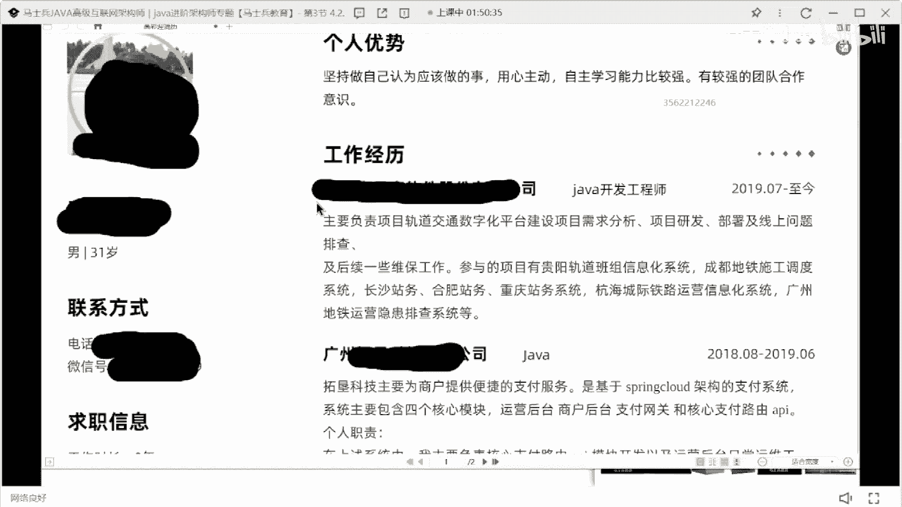
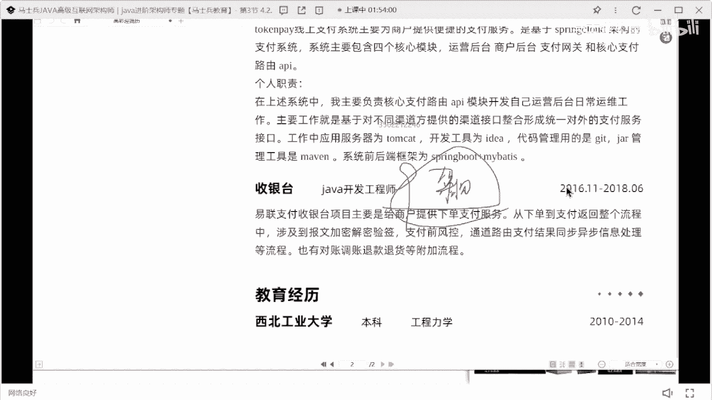
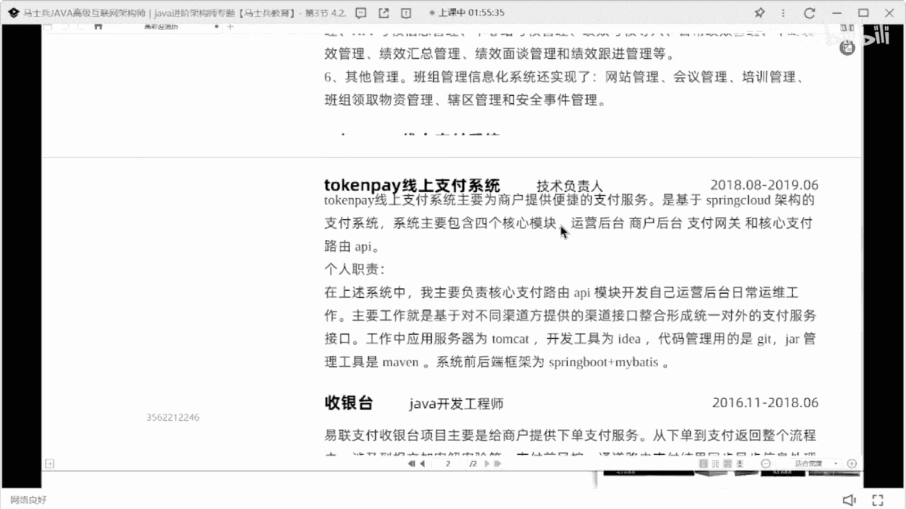

# 什么样的程序员简历一看就没戏？当代互联网HR最喜欢的简历套路有哪些？马士兵告诉你普通程序员写简历千万别太老实！ - P18：31岁9年经验25k简历指导 - 马士兵小鱼 - BV1oP411Q73J

来彩音到你了，别准备抄了，你抄吧。

来彩英同学在吗，让我看你说话了，是你的，是这是你的简历吧。

来看这个跟我们的简历啊。

31岁呃，9年经验，9年的工作经验，第一个记住简历里面不要写范围，薪资不要写范围，你写个20~25，意味着你最低接受度是20 20，我疯了，我给你25，可能给最低了吗，所以要不然写面议。

要不然写准确数值。

但是一定不要写范围好吧，第二个你一上来展示的是你的工作履历。

说实话工作经验这东西啊，没必要在追上来的时候开始展示好吧。

这个没满招聘一个范围呢哈面议都写不了。

你自己写的附件简历，为什么写不了，写不了准确值啊，招聘网上有模板，必须写范围，没问题，你自己简历里面是不是得写这个准确值，或者写编译，你要看的也是看看什么，看你的附件简历吗，而不是看你的微简历吗。

来第一个个人优势，第占优势，海燕这这叫这叫优势吗，不叫好吧，第二个公共经历2年。

1年还是3年。

这个挺好好吧，然后项目经理贵阳轨道班组信息化系统。

你看啊，你看你这个信息化系统啊，看起来写的内容很多，就是你告诉我，我怎么样能够在你这么多的文字描述里面，一眼看到你想表达的核心重点在哪，你想突出啥，你写了这么多字，像没有什么技术实现的。

有什么让你引以为傲的点，有什么你值得非常突出和夸张的点有吗，没有做了3年的项目，写完之后看起来内容好像很多啊，但是没啥问题，我也不知道问你啥，我看完这东西我都不知道问，就根本不知道你啥。

ok那再来一个线上支付系统也是一样的，基于spring架构的支付系统，你现在工作这么多年了，还还基于呢，还基于呢大学生才学基于什么技术的，什么什么东西，好好写一下，你既然是一个在线的支付系统。

每天的支付交易量是多少啊，能不能突出一下你们的并发的峰值是多少啊，能不能突出一下，对不对，你的职责到底做了什么事儿，你看你的职责写的东西，什么api模块开发运营后台维护工作，我行对外的支付接口。

然后还还还tom cat idea，git什么maven bot加my medic，这写了个啥，就你这个这个这个这个写法，我咋能看出来你项目的价值和你做的突出贡献，收银台就这个就更简单了。

就你这三项目用了用了三写的方式，你现在心是多少啊。

采用线性性是多少，17你想拿多少钱啊，你想凭这份简历拿多少钱，就已经记住了，而且还有一个最大的问题是啥。

你整个的简历里面没有任何一丢丢一奈奈。

关于技术的描述，就是你整个的技术的宽度和深度什么样子，我根本不知道懂吗。

你项目里面我能看到是什么。

这有个spring cloud，项目里面没有看到任何跟spring cloud相关的描述点，你到底有没有没福微博，你怎么设计的，我根本不知道，9年的经验，按道理说应该做过一些架构设计了。

你的架构设计能力没有看出来，明白吗。

所以如果你想拿到20家甚至更高的薪水的话，简历是一定要改。

当然这个简历改，肯定是需要依托于你自己的技术水平。

你不用说我后来转行的，你你可以转行没问题，但是你的经验里面在进行写的时候。

在进行写的时候，你看看你这就不要写9年，你这显示是不是从16年开始参加工作，1年到现在也7年时间了，也7年了，明白吗，17年时间了，这简历在播放，有人回报没有，你投过吗。

那个采用我觉得简直没人没人回复了，有如果有回复，有人来帮被外包，也有建议，甲方公司应该不会不会不会让你去面试，很多人找你啊，行行行，你当我刚说的话都放屁好吧，我错了，你当我说话时候放屁。

这里有很多人去找你。

是我的认知有问题了吗。

我知道学历很好，我我知道我知道学历很好，天天几十个，行行行，我我祝你我祝你成功好不好，我祝你我祝你成功啊，我祝你早日拿到，高兴我我我我我孤陋寡闻了，我孤陋寡闻了，是这个学这个这个学校是很好。

然后呢这些人有一天几天每天几十个。

就这个简单啊，如果现在每天都都有几十个，我，我我戒烟两周跟你说，切不说了好吧。

看下一个啊，不说了好吧，我孤陋寡闻了好吧。

我认我认知错了。