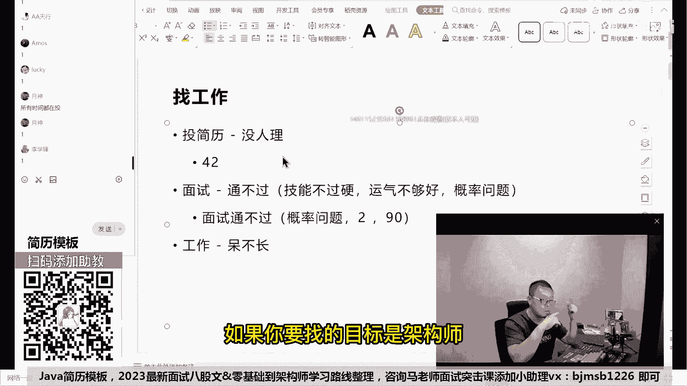
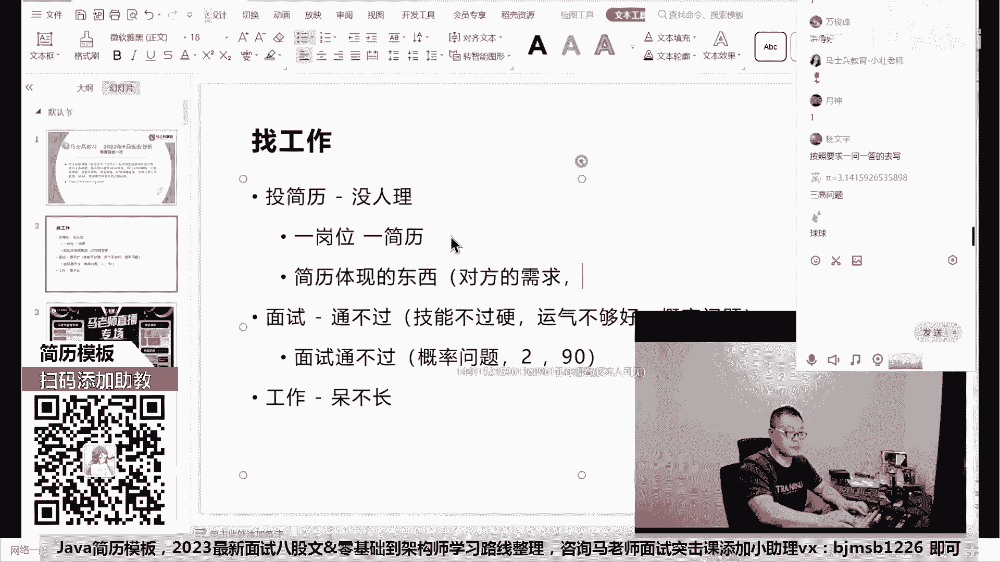
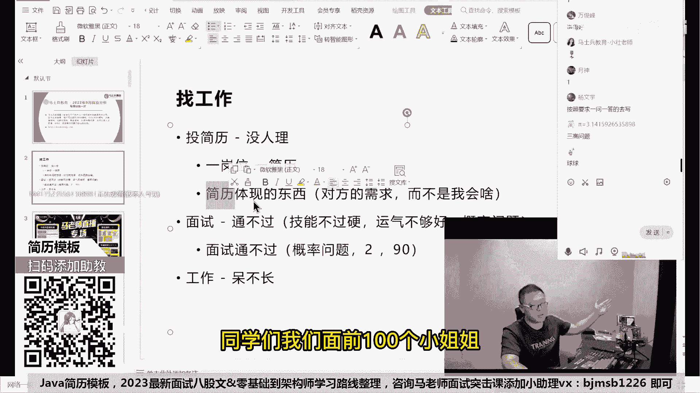
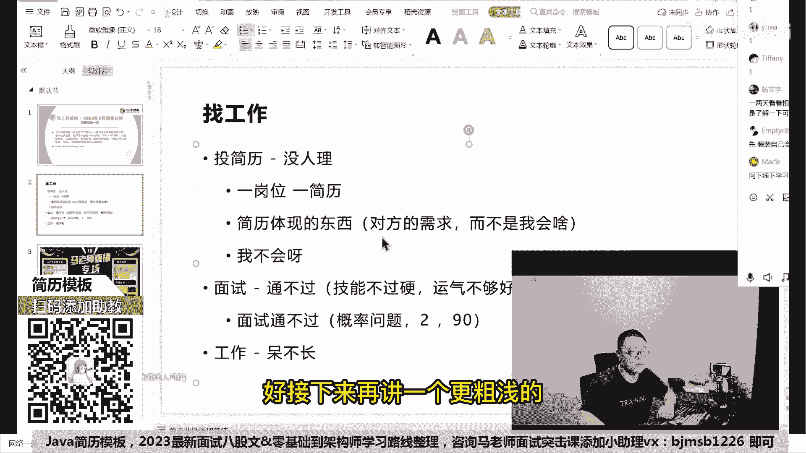
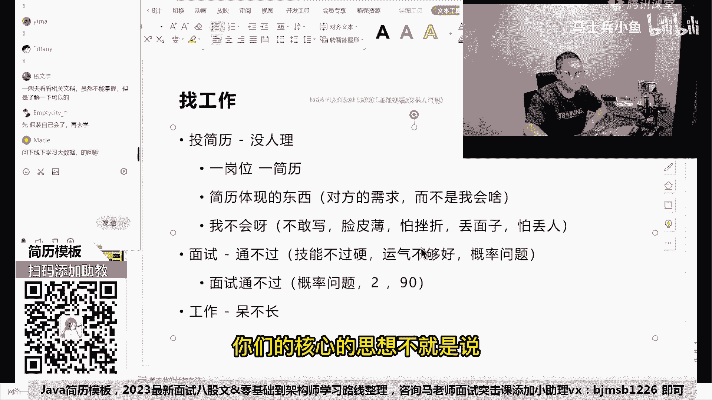
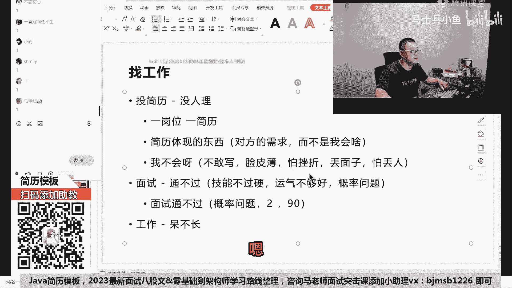

# 什么样的程序员简历一看就没戏？当代互联网HR最喜欢的简历套路有哪些？马士兵告诉你普通程序员写简历千万别太老实！ - P1：程序员海投简历HR已读不回如何破局？ - 马士兵小鱼 - BV1oP411Q73J

好大家听我说，虽然说啊投简历是一定一定技巧啊，比方比方说啊，你举个举个例子，你是在早上八九点钟投，还是说是晚上投，是海投还是怎么样投这些技巧呢，我在我们VIP课里都有教，但是呢这个不是最核心的一个点呃。

比方说我再教你一个小技巧。

我给你讲讲，你说一份简历，有有有的人是这样的，就一份简历打天下。

兄弟们，有没有人这样，我给你，我给你举个举个最简单例子。

有哥们儿42岁了，找到我老师，我下一步想去找什么样是什么样的工作，我说你把简历给我发过来给我看看，他简历大概是这样的。

项目经很丰富，然后呃技术占了一半，管理占了一半。

我给他的建议非常的简单，就是你一定要打那个有有针对性的仗。

如果你要找的目标是架构师。

只写技术，不写管理，如果你的目标是带头人。

Team leader，项目项目经理，多写管理，少写技术好。

这点大家能听懂吗，就是当你的目标是多多种岗位。

你都可以去cover的时候，分开写，这都是小技巧。

最牛逼的分开写的技术，我教大家叫做一岗位简历。

一对一，你好。

我简历我这么说，不知道能不能理解，这样我我我打开照片网站吧，打开招聘网站好，我就打开这个招聘北京站，然后我们就随便搜一个这样吧，搜一个你打开这个啊，随便打开就第一个好的。

听我说啊，大家注意看呃，我不知道有多少同学，有人细致的去读过。

人家这些招聘网站的需求的啊，呃因为这里面呢有很多同学他的习惯是。

我写了一份简历，这份简历上写着我会啥。

我叫我叫什么，我几岁了，我会啥ABCD夸夸夸往上一写，然后呢看着简历哎，这这边再找我等人发出去耍，听我说那种的成功率是最低的，成功率最高的是我下面讲的这种，就是你你你你看上这个了，对不对。

你打开来看看看人家要什么好的岗位。

职责是要求SARS的，那首先第一点你想一下。

你想一下，如果我的简历上体现出SARS来，是不是会更有优势，那这样大家能听懂吗，给各位老师扣个一，所以说你要看人家专门需要的是什么，你看啊，人家看的是SARS的，对业务快速了解，技术上保持一定的前瞻性。

如果你能了解一些前瞻性的技术，会不会有优势，比如说云原生大数据是大量数据的处理，AI的入门等等。

你琢磨琢磨会不会优势。

只能说三到5年，反正无所谓，你投的时候，这个你可以忽略掉，你，哪怕就只有零到3年。

我水平够了，我就可以投啊，你放心还是有机会好，你看看人家看重的IO反应多线程啊，并发的知识，对不对，JVM的调优的经验，Space rainbow，my bad is a pc好，Mysql。

Redis，eh base等等，好高并发多线程分布式系统合理嗯，加技术架构啊，这这个有点强，强调架构的，对不对。

寻访的时候重点强调spring SQL是数据接口，多线程是否数量，看到了吗，人都给你说的非常清楚，如果你当看到你这份简历，这个东西的一个需求的时候，你的简历上该体现什么。

心里有数了吗，有谱没有，做一个非常粗浅的道理，叫做你写你的简历啊，这是这是最理想的以岗为简历，当然有同学可能跟跟跟我抬杠说老师。

那我以岗位简历肯定是太太太累了嘛。

确实有点累，如果你一件事情想要效果好。

然后还不累，你觉得这他他本身就矛盾，本身你要干一件事情就得把它干细了。

效果才会更好，这个确实有点累。

那么至少你要干一件事情呢，就是通过我刚才讲的那个你要你要理解一点。

就是你的简历体现是什么，你简历体现的东西是什么东西呢。

对方的需求这个很重要。

就是人家厂子要什么就业单位要什么。

而不是我会啥，你知道有同学。

尤其是那个应届生，同学们写简历，我会打乒乓球，我会UI。

我会PHOTOSHOP写一堆，人家要求的是java的后端好，我跟那写c#，写Python写一堆，你要有意义吗。

同学们，我们面前100个小姐姐。

我每一个小姐姐都提出了自己的明确的需求嗯。

有小姐姐1米75以上，有乔小姐姐1米8零以上，你非得跟简历上写。

我身高1米58，我就问你有没有人会去找你面试。

所以我们讲的第一条原则叫做，你写简历体验的东西叫对方的需求。

你这份简历是个广告企业，就是你的客户。

你的客户想要什么，你要在广告里体现什么，包括说我想说啥。

你别你们你们那个那个厂子必须听我的。

那这块能理解到位的，给老师扣个一。

当然我讲完这个东西，马上就会有人跟我抬杠。

郭老师，我不会呀，对吧。

这这一堆我一个都不会。

那我咋写啊，不会能不能学，就算我长期掌握不了，我短期能不能冲刺一下，比如说我现在我只会SSM，对不对。

我什么这个什么什么高并发呀，什么分布式啊，我啥都不会，但是我可不可以短期冲刺去囫囵吞枣，大致了解一下好了，这就回到概率问题了，只要你有一部分的冲刺，哪怕你冲刺两个小时，做一个粗浅的了解。

你的概率会不会提升，好好自己想一下这件事儿，好接下来再讲一个更粗浅的兄弟们。

前面100位小姐姐要求1米75以上。

1米8零以上，体重多少多少斤，你1米58。

体重300斤，但是你现在要的是一个什么东西啊。

兄弟们是不是一个相亲的机会啊。

这是不是你们所担心的，前面一大堆漂亮的小姐姐。

然后呢，人家要求挺高，我一看我明显明显不行啊，这玩意儿扎牙不行不行。

我还是自己在家焦虑吧，躺着吧，那个焦虑一下，多多舒服呀，跟别人出去喝顿闷酒，整天在家里看点焦虑焦虑，你们的核心的思想不就是说脸皮特别薄。

怕挫折，丢面子，怕丢人，是不是这样的好。

我想问你，你现在是1米58，然后你在简历上啊，你在跟小姐姐的这个信上讲。

我是1米7吧，可可不可以可以吗，那你写1米78身高吧，身这个身高1米78，然后体重80kg。

诶，小姐姐是不是会给你一个相亲的机会，面试的机会我们就有了，那这会儿能听明白，老师扣一就这块我要求你的你的第一步啊。

简历了一件事情，解决了什么东西叫面试机会。

你就给我记住，只要你有面试机会，你这个概率就一定比没有要强得多。

而且他跟具体的这种相亲还不太一样，因为五八在实际当中你不可能长成1米78，但是即便这样。

你只要见到小姐姐，你就非常你就有一定的概率啊。

哪怕1%，你跟他好好讲，好好沟通是吧，好好聊，你们有一定的概率会成功的，但是你见不着他永远成功不了，这个能理解吧，但是我们实践当中技术的技术不是这么回事。

技术你现在是1米58，但是你通过一段时间的恶补。

你完全可以补到1米7，1米72，1米73，1米74，再垫点增高鞋垫，你就是1米78了，所以不会敢不敢写，解决这个问题，先我讲完这个请大家呢对自己说不会的东西。

我如果真啊你你的前提是啊。

你你投你的简历没人理你，那么你就要考虑到，现在你不会的东西也要往上写，这怎么还在这儿跟我这儿要不到面试机会呢，我现在不就教你怎么样才能要到面试机会吗，那这会儿能听能听明白，老师扣个一。

就是你怎么样要到面试机会，还还还听不懂哦，刚刚进来，先慢慢听好吧，现在我们解决了就是要到面试机会的这个问题，这个东西也适合什么东西，也适合那些想提升的提高性能忽悠嗯。

你赢了啊。

你以后一定不要忽悠啊，做一个乖乖的好孩子啊。

嗯来各位同学，嗯在这儿那个我我我，我有看你忽悠这个词，那我就有点感触比较深啊，你像有的人那个研究生的自述啊。

或者是你去做任何的这种面试，考研的面试，以及那个呃有一些大学的这种自主招生之后，他有一个面试环节嗯。

那你要尽力的表现你自己啊。

那个那个东西你认为是忽悠吗，所有的人你在不管你在工作中学习之中。

你最终还是要把你自己的东西给大家秀出来。

那都叫忽悠吗，你如果那人认为那叫都叫忽悠。

那就算了啊，我大家听我说呃，现在呢我们解决了第一个问题，就是说我们怎么样去呃拿到一个机会，这个东西记住记住，这个东西还有它非也也适合于所有的高端保。

而且高越是高端的等，对这个的依赖度越高。

那个有不少同学找到老师说。

老师啊，我现在已经是年薪50万，老师，我想拿到年薪80万。

那这时候我该怎么办，我教他就很简单，你先给我写一份年薪80万的简历，先给我写出来。

老师帮你判断值80万，然后照着这份简历。

你什么地方有短板恶补握补的差不多了，拿一定的概率去外面拼就行了，这样大家能听懂吗，因为有很多人他其实不敢去拼，他自己没有信心。

最核心的是他怕丢面子，怕丢人，他不敢去拼。

呃所有的人，我建议你们把你们的自尊心看得。

不要看的那么重要，年轻人的自尊心一文不值，我可以这么跟你说，但是年轻人的脸皮反而是最薄的，你们好好想一下。

在你们20多岁，20多年到40多年的成长的过程之中。

你们所谓的自尊心对给你们带来过什么没有，有的时候你拉下脸来去追一下你们班的班花，没准儿那个机会就是你的了，就算不是你的，你也尝试过了，你尝试过了，你就不会后悔啊，你不会想说，哎呀，当年我要是尝试一下。

没准半块就是我，因为你怕挫折，怕被人拒好。

我们翻过的时候来说找工作，你说你找工作，你写了一份简历，你去了，然后没练过你，你你的损失是什么，兄弟们，我想问你。

假如说你你你到了一个一个一个一个企业这里，然后有一个面试官啊，上来噼里啪啦把你DISS了一顿好，你的损失是什么，你的损失啊很简单，没有什么，就是有一个面试官觉得你很差，而且呢你们是第一次遇见，以后。

在这辈子遇不上，但是你的收获是什么呀，你的收获是增加了一次很不错的面试经验。

你会知道对方会问你哪方面的问题，哪方面的问题我没答好。

而且如果你要愿意找到我，把你的面试录音发给我们。

老师还会给你给你进行分析，这叫面试的陪跑，是咱们冲刺里面的一部分服务。

只有收获啊，只有收获。

没有任何损失，这点大家能听懂吗，所以我建议大家大胆去试，没有问题吧。

你不会也可以写，写了之后拿到机会，你就算没有任何的冲刺去补这些技术，你可以去试，试完了，哪怕在今天问你的三个问题。

A b c，你把ABC下来背过了，你再去试下一件，很有可能问的还是ABC。

这块大概能听明白的，老师扣个一小北说大厂半年不能灭这个稿。

现在我讲的是找一份工作是特别差的。

如果你想大厂，我会提前告诉你。

你该准备到什么程度再去大厂，是这样的，你原来你用2%的概率去拼。

还是用50%的概率去拼，还是用90%的概率去拼，嗯老师告诉你学到什么程度。

你可以到90%的概率听懂了吗。

但是我前提是你不要把你自尊心太太看太强，脸皮稍微厚点。

我希望大家后面的整个人生的过程中。

都能做到这一点，有工作的机会去争取，有好的带头的机会去争取。

有有喜欢的姑娘去争取，去表白。

不就是把这个悲剧嘛，对不对，最严重的后果就是被拒。

你不会被抓进去了，不OK了吗，我们解决这个问题好吧。

呃所以这个时候你再投出去简历去，如果再没人理。

那就说明整个就业市场全完的，百分之百分之100的一片黑。

到目前为止远远离这个情况还远着呢，不可能好吧，国家最近的刺激政策一大堆呃减税的，然后呃那个那个那个呃呃专项债了是吧。

然后那个呃汇率贬值，利率利于出口，出口行业的等等一大堆啊，我就不信下载文人招聘，如果没人招聘，为什么我们这边还有一大堆的同学们跟着就业，还涨薪啊，去争取去争取，去争取就有机会，哪怕1%的机会，你试一下。

有可能得到。

你不是永远得不到，这里就要求你要做好什么样的心理准备啊，被拒我要原来我是八次能找到一份工作。

现在我要是有可能我要是20次，我要做好这方面准备，比如说你的心情淡一点。

再淡一点，做出那种平淡的，不影响自己心情的正常的一个努力，一个争取就行了，看淡结果，注重过程，好吧。

