# 什么样的程序员简历一看就没戏？当代互联网HR最喜欢的简历套路有哪些？马士兵告诉你普通程序员写简历千万别太老实！ - P20：科班应届简历指导 - 马士兵小鱼 - BV1oP411Q73J

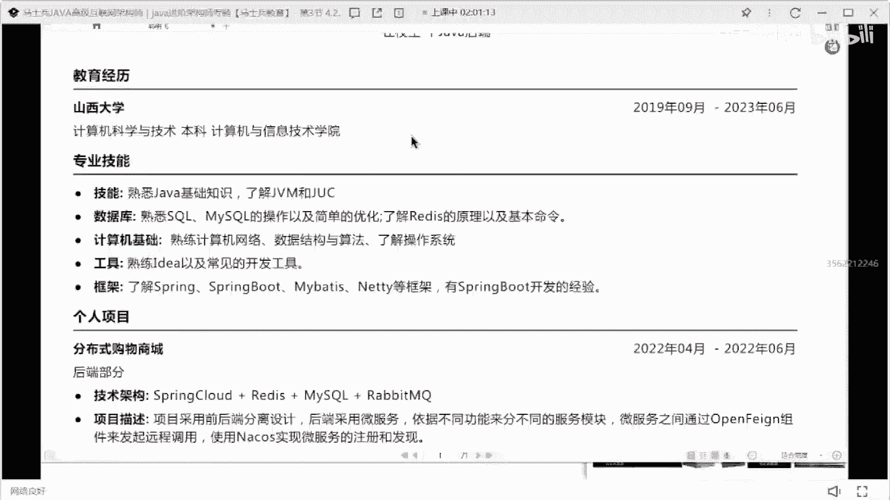

南明飞4年的，超过4年的经验还没毕业啊，应届毕业生现在在吗，这周有一个项目和我一样，你俩是不是同一家公司的超a g v mj u c，了解不要写了解这个啊。

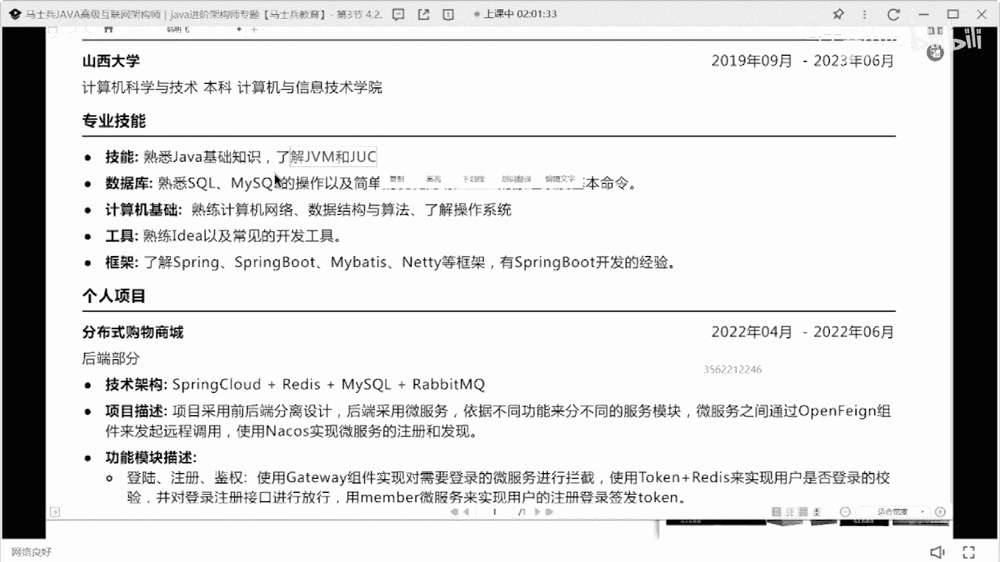

作为一个应届毕业生，很明显你的这个简历写的有点有点有点差了，好吧，你看你下面这写的spring coud，上面有没有spring coud对吧，然后就把你就一定要记住啊。

把你上面写的这个经历和下列线经历，一定要就是你的这个技术站，和你项目里面用到的技术站一定要匹配得上，一定要匹配得上。

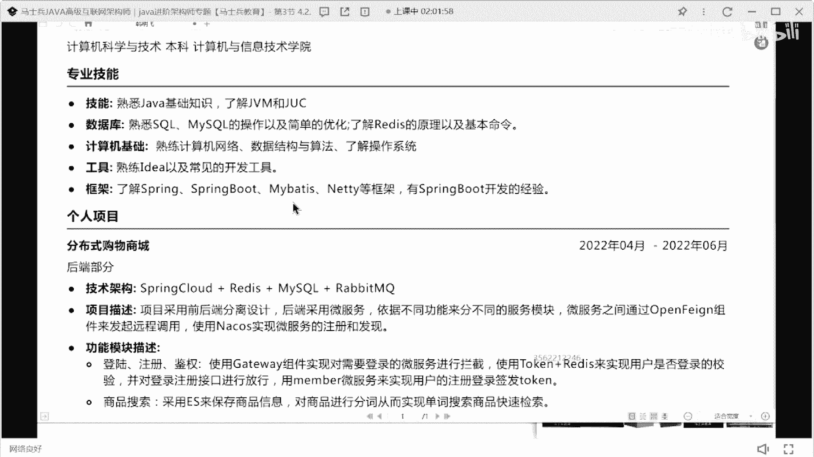

分布式购物商城nt聊天室和rpc调用，这个可以算是一个项目。

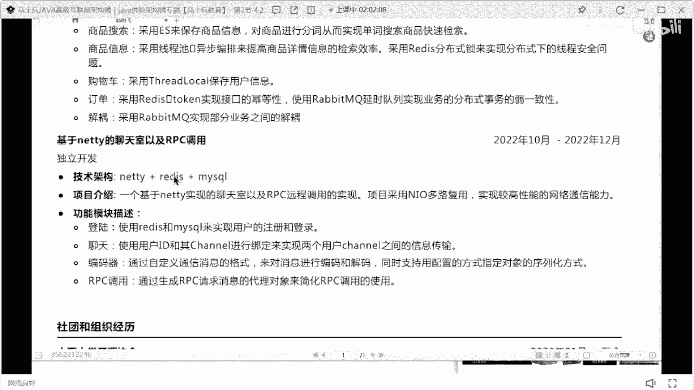

但是上面这个项目，如果你想写这种商城网站的话，这个写的有点有点简单了，有点简单了，就是商城项目啊，很多人说老师我刚培训出来，我商城是不能写一写商城就录上。

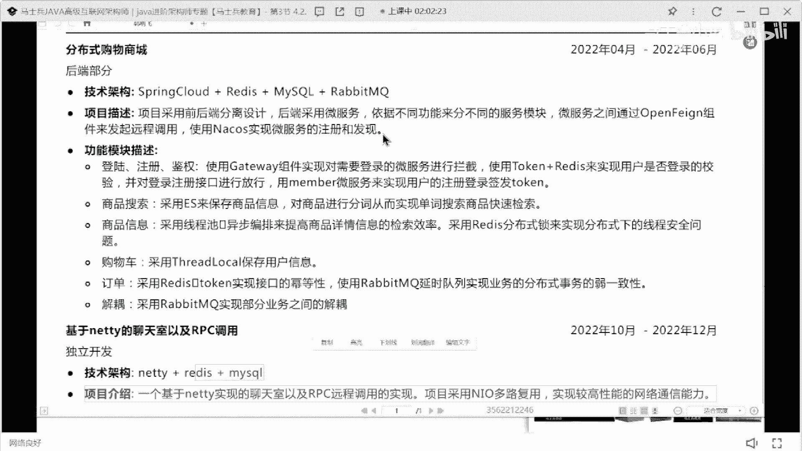

其实不是这样的，是因为大部分的商城介绍是什么，比如说商品模块。

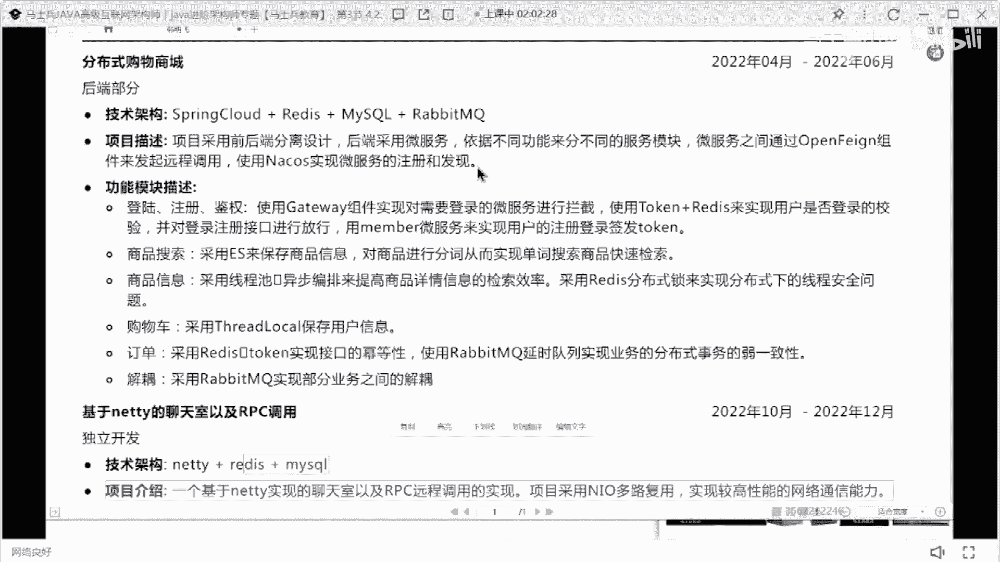

订单模块就完事了，其实你可以把商城项目描述的很高大上，描述的很高大上，可以加一些其他额外的功能模块进去，这样的话别人能知道你这是一个真实项目，但对于应届毕业生而言好吧。

最好能够自己把这个项目去做一个部署，有一个可可供外网访问的呃地址。

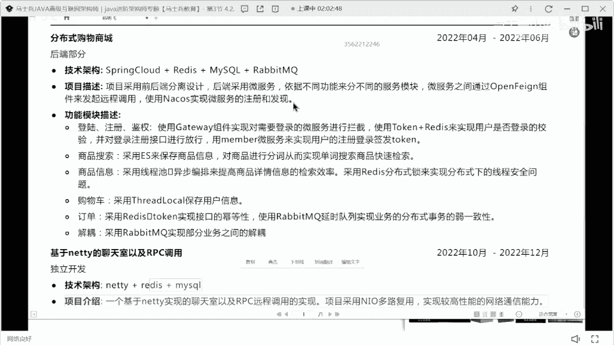

在别人能够看到你对应的项目，然后你对应的技术站要做一个详细的呃描述。

就这个项目到底是怎么做的，把项目描述什么样子的，你们做这个项目的意义在什么地方，一定要去写一下，这明显就是自己自己拿自己拿来练练手玩的吗，练手玩的，然后如果说非要匹配一个经历的话，我建议你匹配一个什么。

匹配一个实习的经历，因为现在很多大学的老师。

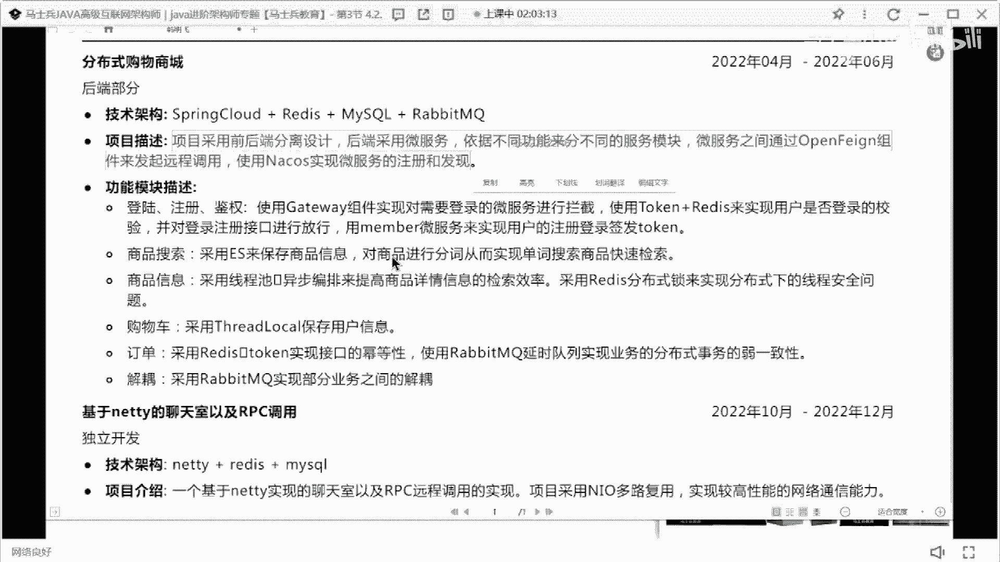

在外部是有自己的合作合作公司的，或者自己有公司，你可以把那个经理包装成你们大学老师教研室。

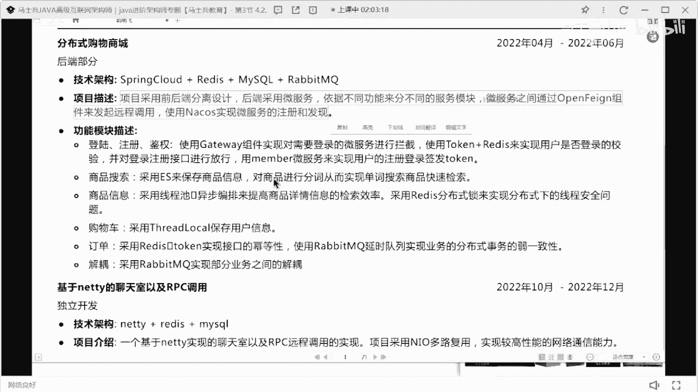

一个公司承接公司里面的实习或者项目，用的明白意思吧，编造一个真实的一个，这样的话可能更加容易一点。

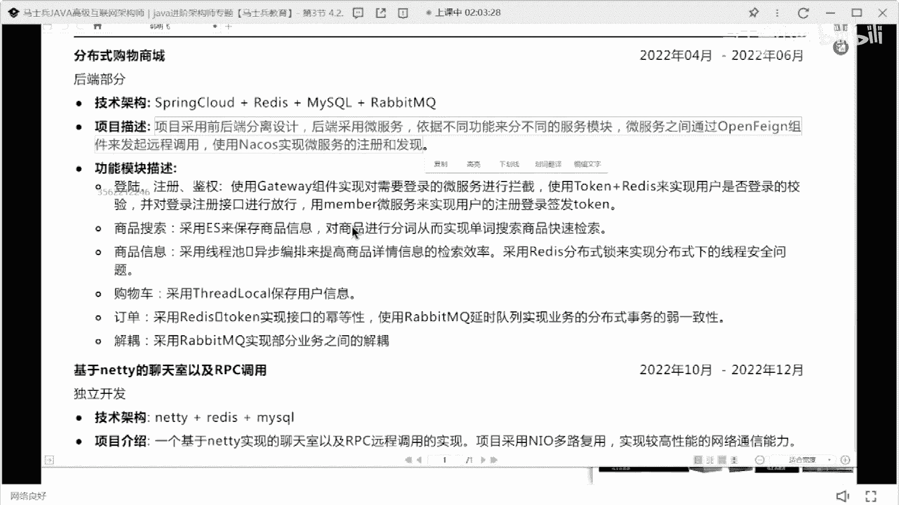

然后把对应的技术实现写清楚就ok了，好但是你上面那个技术描述很明显是有问题的。

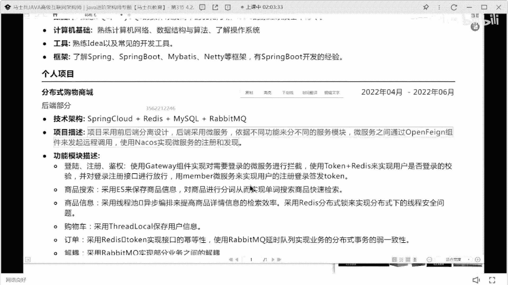

好吧，这技术描述要好好去修改一下，好好去认识一下好项目。

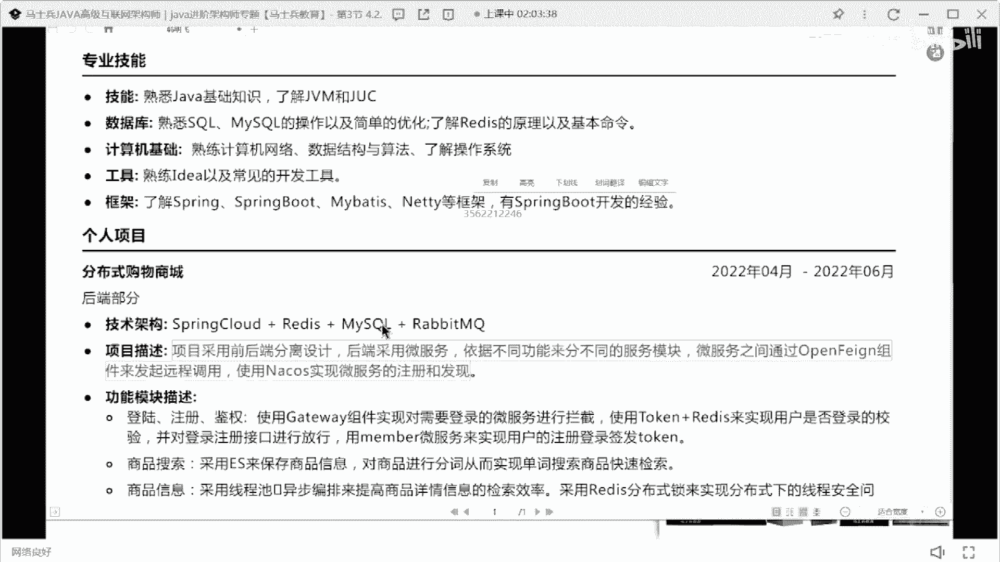

这块换个项目吧，要非要写的话，就把这个项目好好去去去改改，ok。