# 什么样的程序员简历一看就没戏？当代互联网HR最喜欢的简历套路有哪些？马士兵告诉你普通程序员写简历千万别太老实！ - P21：本科科班3年Java经验简历指导 - 马士兵小鱼 - BV1oP411Q73J

我们快点说了啊，时间不够了，俩小时了，都嗯看这个同学19年毕业。

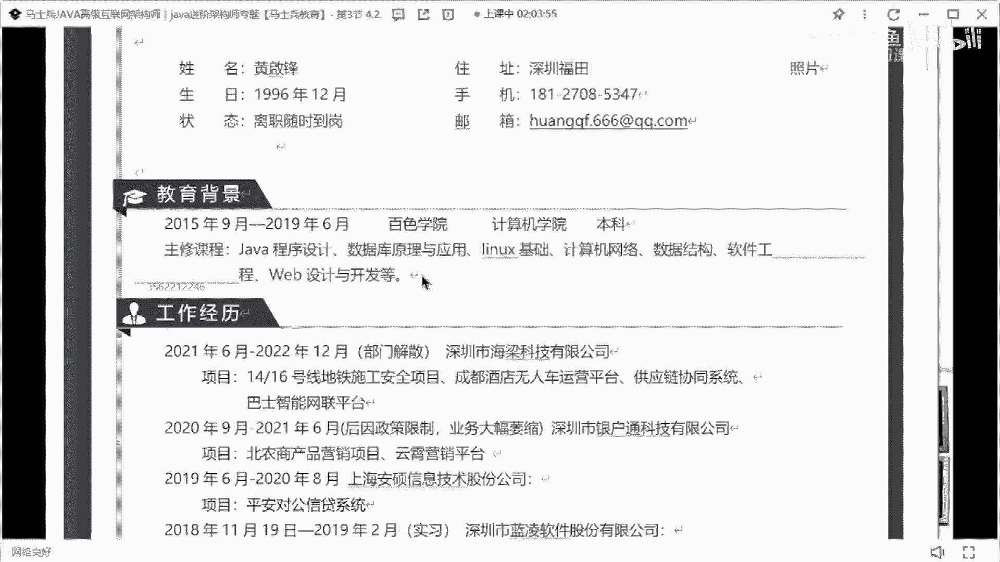

我说了啊，这个大学的这个课程不需要写v100 色学院来。

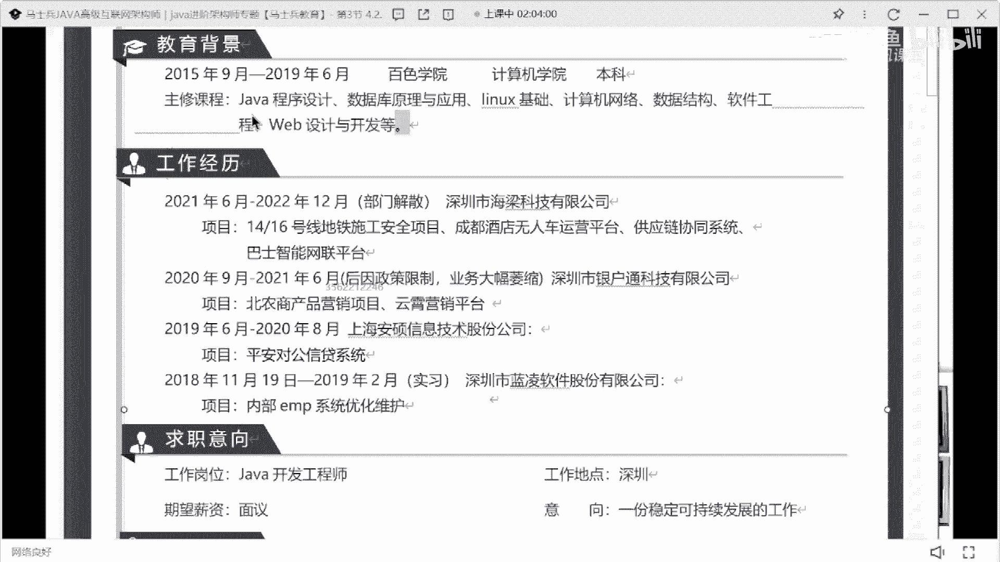

我去过你们学校工作经历，实习1年，1年半，这同学啊，我不知道你在不在啊，呃你需要好好的去注意一下，你的工作履历和背景的，你需要好好注意一下你的，你看你咋写的啊，政策业务缩水，部门解散，就这种东西啊。

可能都是跟你没关系的因素，但是不要突出，不要突出，干倒两家，是这意思，就是看你的描述的话，你你把两个公司干倒了，懂我意思吧，就不要写这些东西，这就工作这些只需要写什么，写时间写时间，写完时间之后。

然后写公司名称。

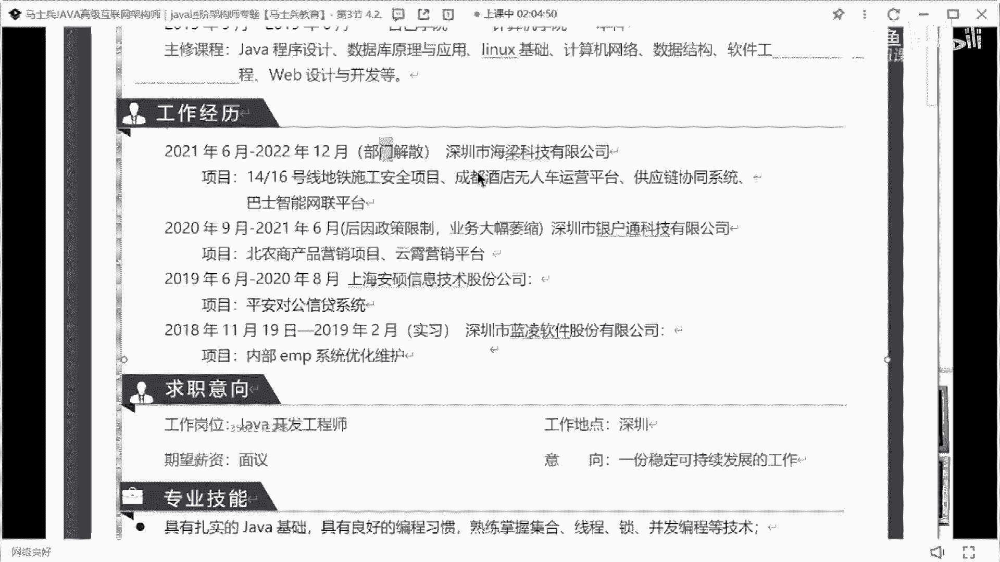

然后写上你的职位就ok了，臆想一份稳定可持续发展的工作，别这么邪，别别学这玩意儿好吧，什么叫稳定，什么叫可持续发展，就是这些东西，这是这啥啊，这些的。

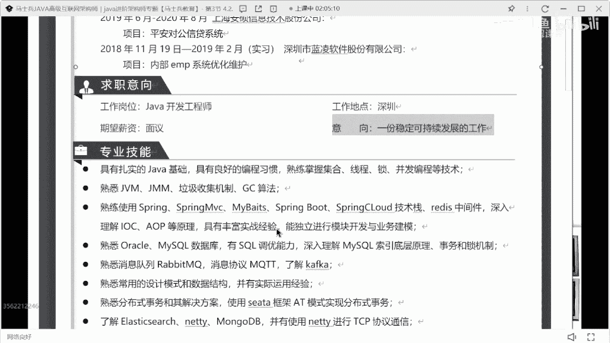

技术站，啥玩意，儿，这都是，release，二比q红塔c塔把所有的了解啊。

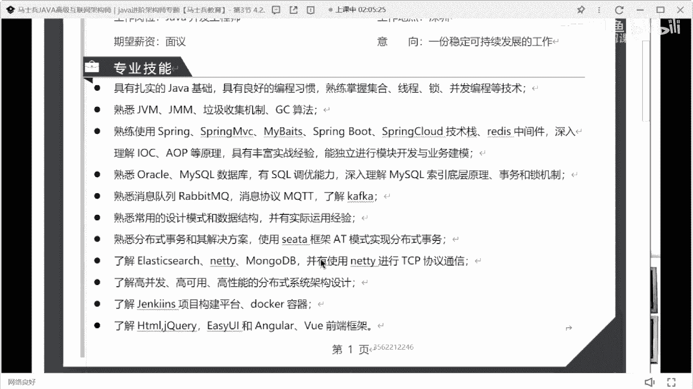

不过换成这个熟悉或者熟练。

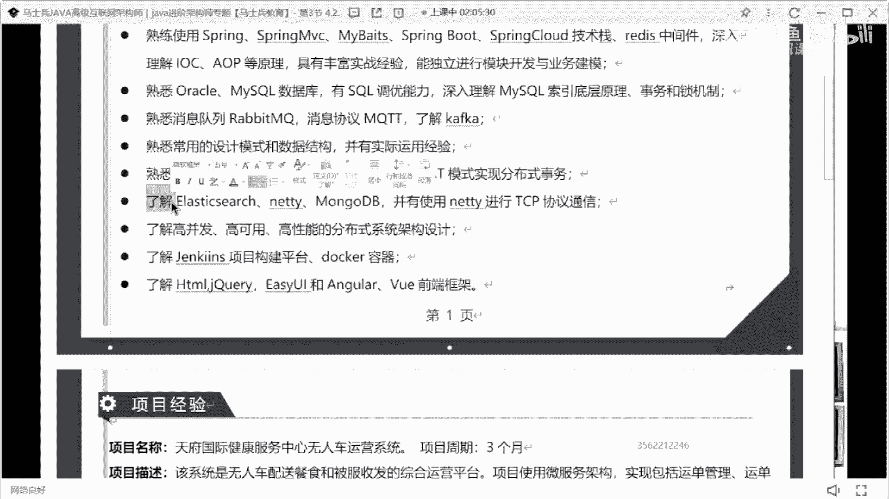

项目这个周期啊，三四个月就别想好不好，34月就别想啊，这是一个无人餐配送和被被俘收发的运营平台，如果是一个运营平台的话，你们每天的运营数据是多少，车辆管理的数据是多少，然后监控的数据量是多少。

怎么做这种数据的，可就是存储的，能不能写一下。

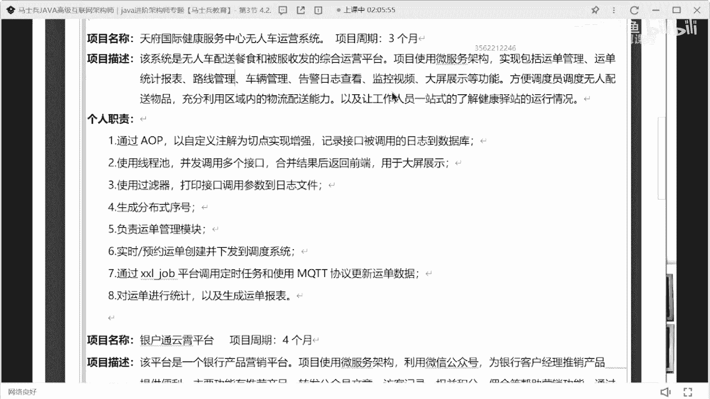

反正向我们描述的，我还向我描述稍微有点问题啊，职责还行吧，就这个职责啊，大家写职责的时候要注意一件事，就是写这个文字描述的时候，不要吝惜你的文字，我说了，你的这一行的描述，最好能占到1/2或者3/4行。

就不要只写五六个字，这几个字就结束了，这个不太好，所以说分布式训练序号使用什么样的技术，生成分布式id，满足什么样的需求，我们这样写，换一个更好的描述方式。

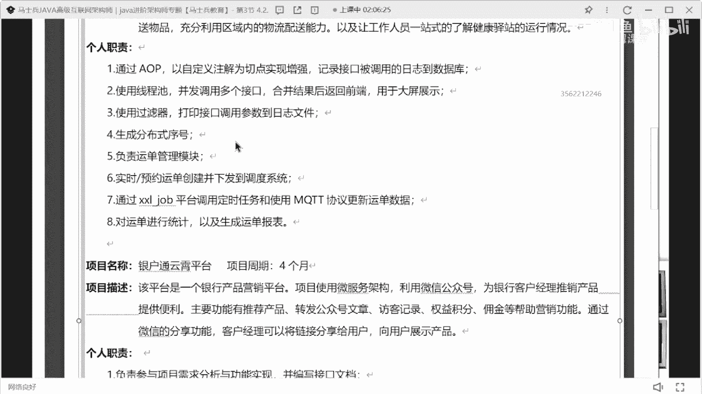

好吧。

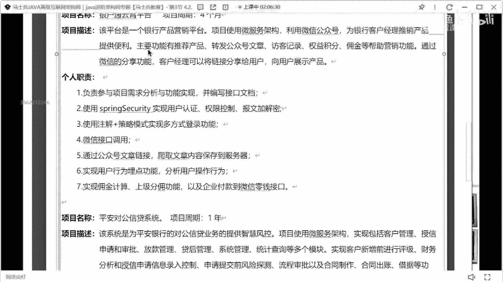

像这一样的您互通营销平台。

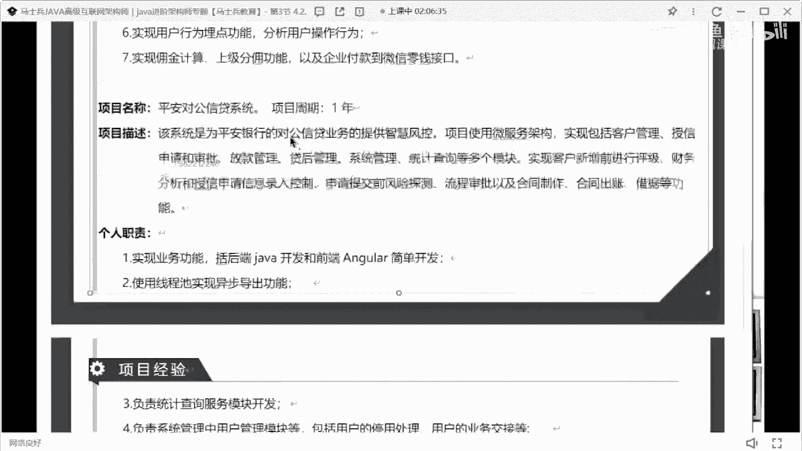

平安对公信贷系统就是记住啊，把你的项目这个描述这块好好改改。

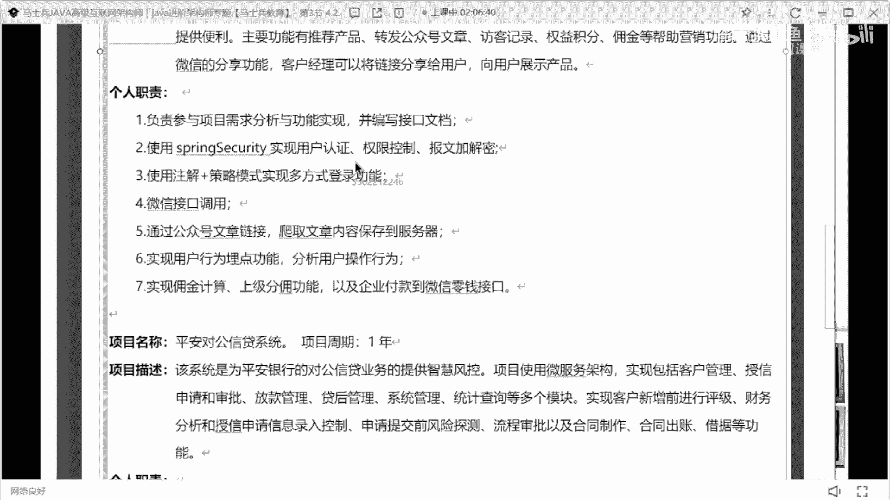

就是还是项目描述的问题值得吧，写的也很高吧。

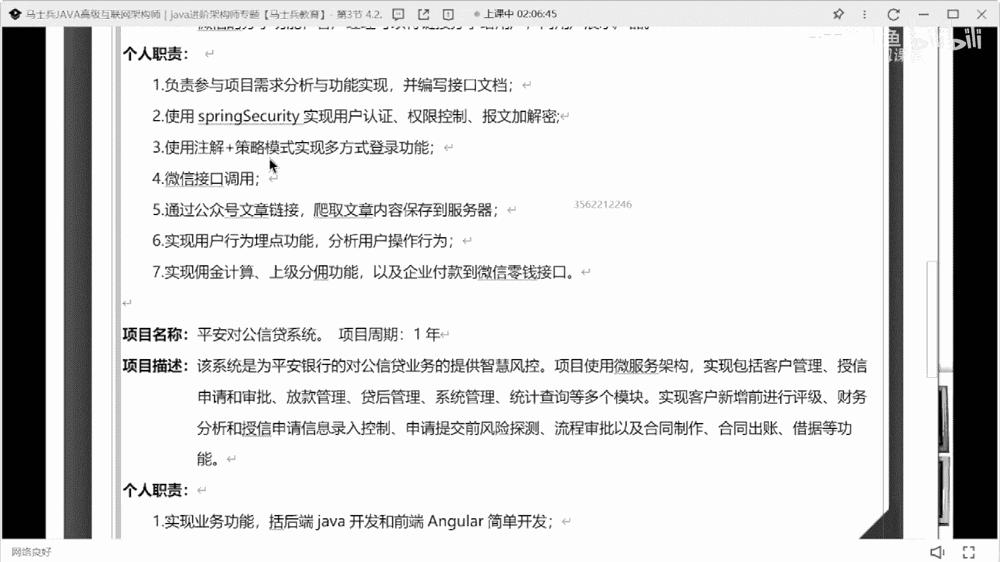

勉强的速度过去还行好吧。

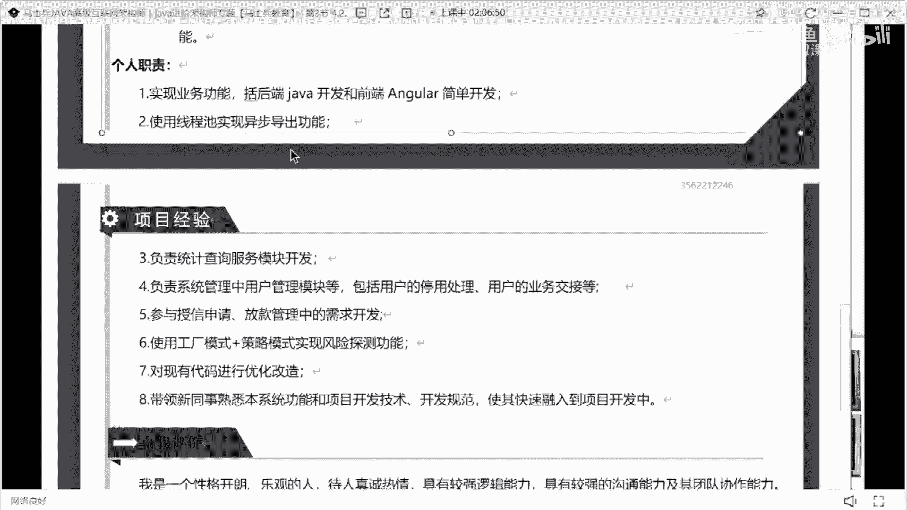

这个这个没必要了好吧，这个没必要了。

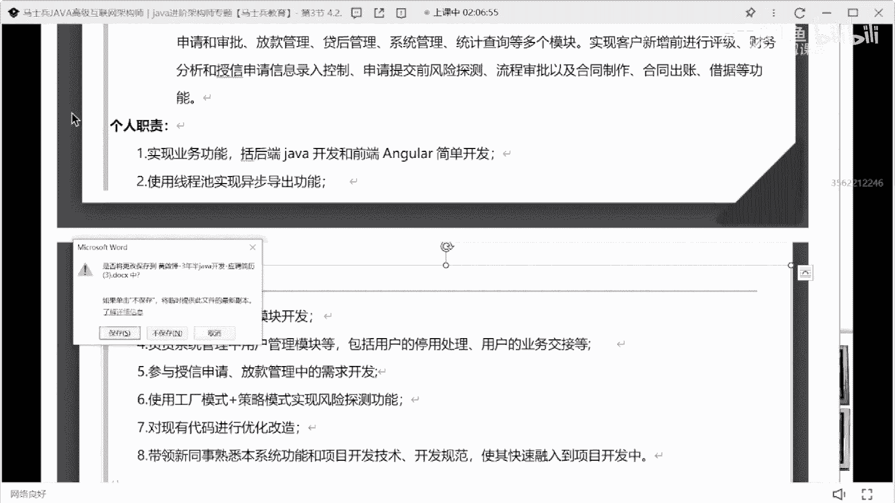

我们来看下一个。

