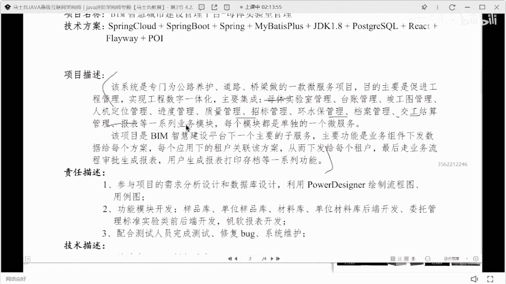
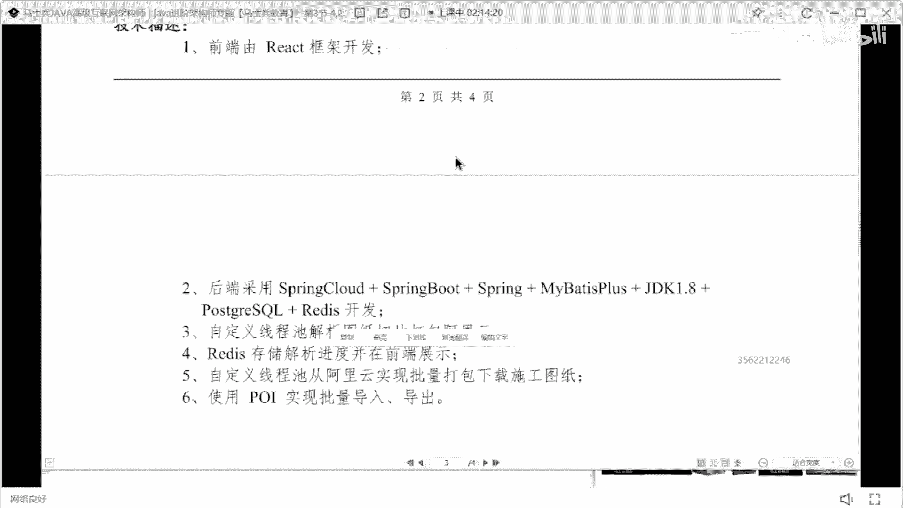

# 什么样的程序员简历一看就没戏？当代互联网HR最喜欢的简历套路有哪些？马士兵告诉你普通程序员写简历千万别太老实！ - P23：29岁6年Java简历指导与建议 - 马士兵小鱼 - BV1oP411Q73J

看到谁的了，来看这个前同学。

29岁jav，哎你看这个你看这个技能描述啊。

这个技能描述看着很舒服。

他注意啊，这个看着很舒服啊，把技术站这块写的都很好。

据内容可以不看，但这个基础上写的很舒服好吧。

然后20年至今3年3年诶，挺好，工作地理也很好。

智慧城市母体实验室，关于室实验室。

能不能记住啊，这这这这这谁的简历啊，这不是在吗在吗，扣个一来，jeffer记住啊。

你的技能描述没问题，下面这块要好好改一下了，这个留白这个留白不要有。

没必要留留留留白好吧，那项目描述这个写的有点有点有点草率了啊，这个项目这个项目描述写的有点草率了，像当时我还是一句话介绍孙鲁德是干嘛就行了，没必要把这些基本的模块都展示一下。

这金毛都长出来没有没有什么实际的意义，然后突出一下你的实验室每天做什么工作。

然后里面有哪些可以展示数据量，把这东西好好的去描述一下。

然后职责描述和技术描述能不能合并一下，技术描述只需要把技术名词罗列清楚就行了。

就像你下面那块写的一样，然后侄子描述我刚说的，用什么技术实现什么功能，把做了怎样的一个工作，突出贡献，解决哪些问题，按照这样的方式来写，竣工图管理。

哦你这是做了一个大型的智慧城市的项目，里面分了n多个子系统是吧。

就是你这个项目啊，就是技能写的很好，但是项目这块呢明明是多个子系统，明明是一个很大的项目。

多个子系统，但是你这个子系统呢描述起来，让别人看起来好像没有那么大屏。

或者没有那么有价值，把你的项目要好好去改改，然后这有一个你看这个这个6年开发经验，然后呢就基础热情这个地方要注意啊，6年开发经验，突出一下自己做过哪些架构设计，做过哪些技术啊。

技术方案和技术解决方案的提供哇，这技术有沉淀，这个没问题，我给大家看一个例子啊，就这个东西该怎么去写，我找一找啊，来找一个。

你看这同学写的东西啊，他这么写的是5年账号开发经验对吧，3年大型项目，大型系统架构设计，建3年以上团队管理经验，分布式高并发高可用大数据量，然后呢系统架构设计研发经验，正负责注册用户多少实力平台研发。

然后呢扎实的功底，对什么技术有深入研究，这样写出来的自我评价是比较舒服的，是比较舒服的，ok就可以参照这样的，这样放着写，我只是提供这样的一个样式，不是让你说一定要按照这个数据上写。

就这个样式，就这个模板，你可以套套套用到你当前的新项目里面。

你要怎么去改，懂我意思吗，我不是让你们照抄。

你可能没有这样的项目经理，明白吗，你可能没有这样想，但是你要去写一些东西出来。

