# 什么样的程序员简历一看就没戏？当代互联网HR最喜欢的简历套路有哪些？马士兵告诉你普通程序员写简历千万别太老实！ - P24：一年半Java经验简历指导【切忌频繁跳槽】 - 马士兵小鱼 - BV1oP411Q73J

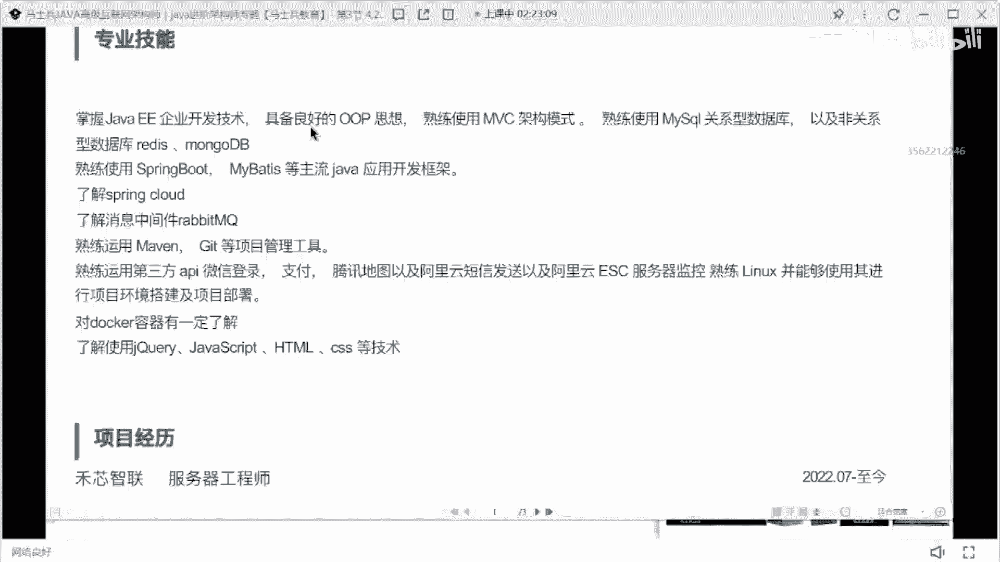

e这个java ee这个东西不要写好吧，原来呢分java s e，java和java m e这个东西已经属于一个横，很很老旧的一个说法，现在已经没人这么说了，ok。

嗯这也是只是把你所对应的基础做了一个描述。

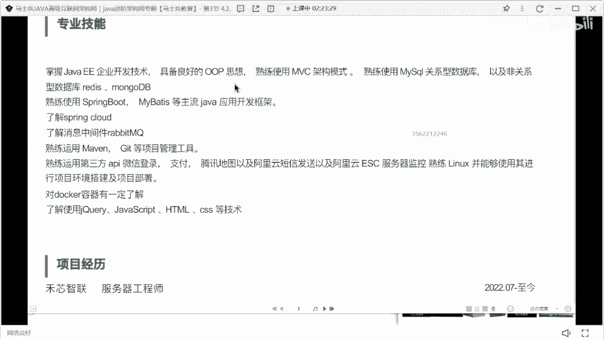

所以简单的单词罗列就像那个单词本一样，只是做罗列，这个技能肯定不行。

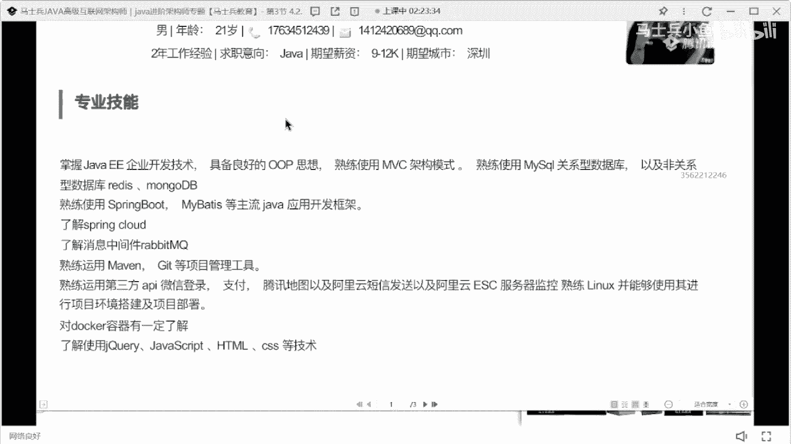

多多少年工作经验，2年经验，这个技术不行啊，好好改项目。

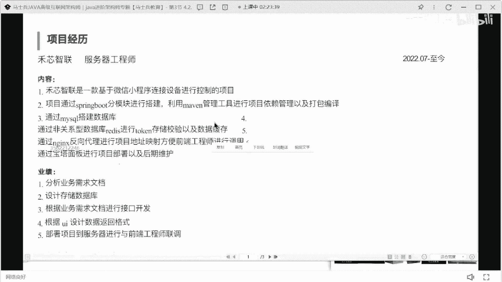

就这个这这这这咋整啊，这这个排版的问题吗，项目一定要先介绍清楚项目是干嘛的，然后再介绍什么项目，用到什么技术，再介绍你在里面负责什么东西，这要分清楚。

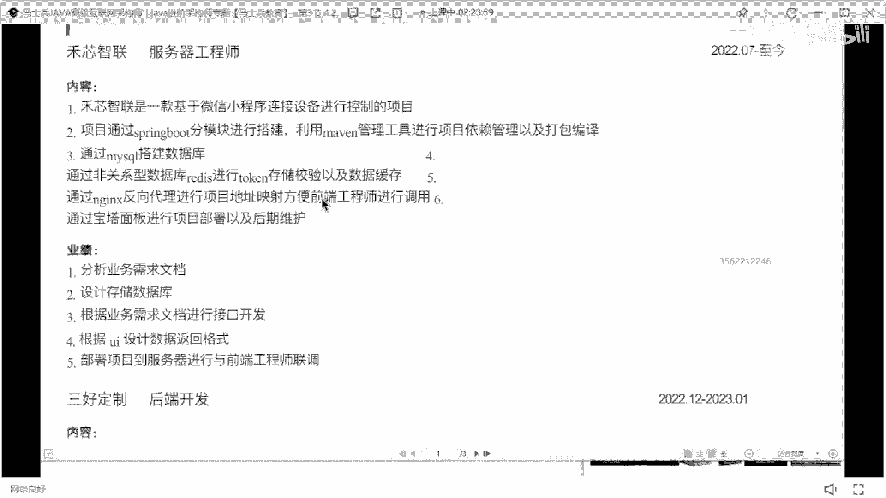

这项目写的太太太那啥了。

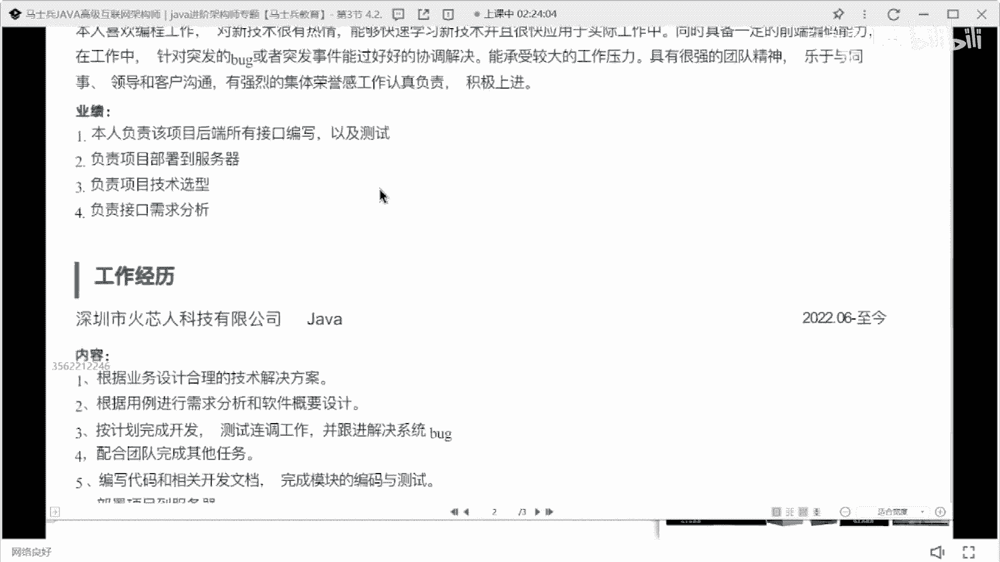

寄生在吗。

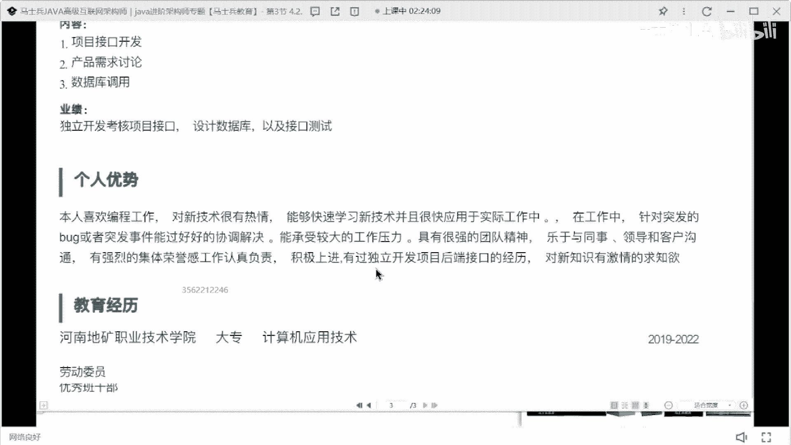

这是五个月的工作经验。

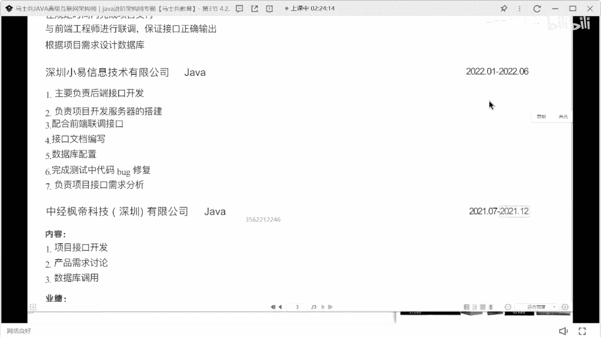

半年的工作经验，哎哟我天哪半年这同学在吗。

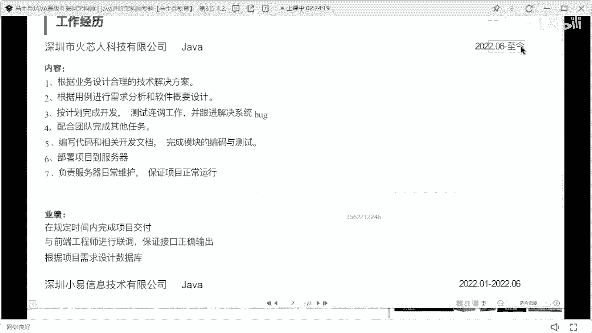

这同学是哪个资源老师的学生，是哪个老师的学生，一定记住啊，这个这个尊老师，这个金老师听好了，下去之后跟这个学生好好去说一下，让他不要跳槽了，听懂了吗，他再这么跳下去的话，他他以后就整个就废了。

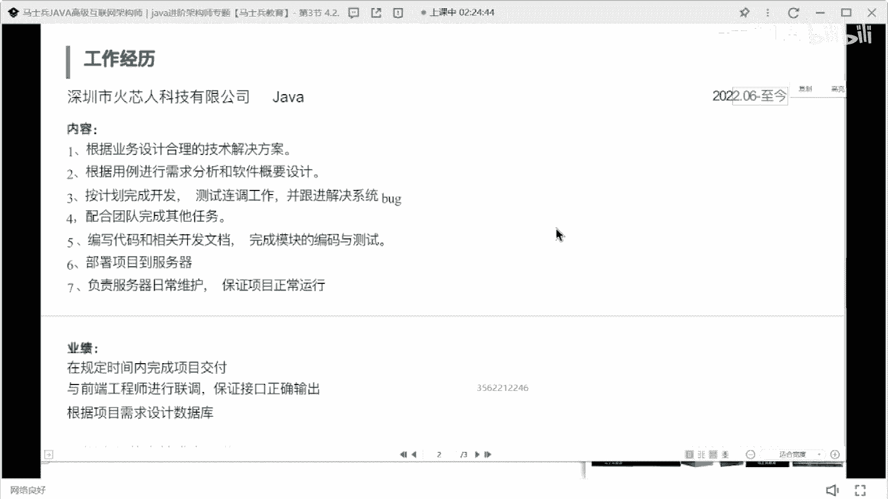

他现在基本上是半年一次教程，每份工作都是半年左右。

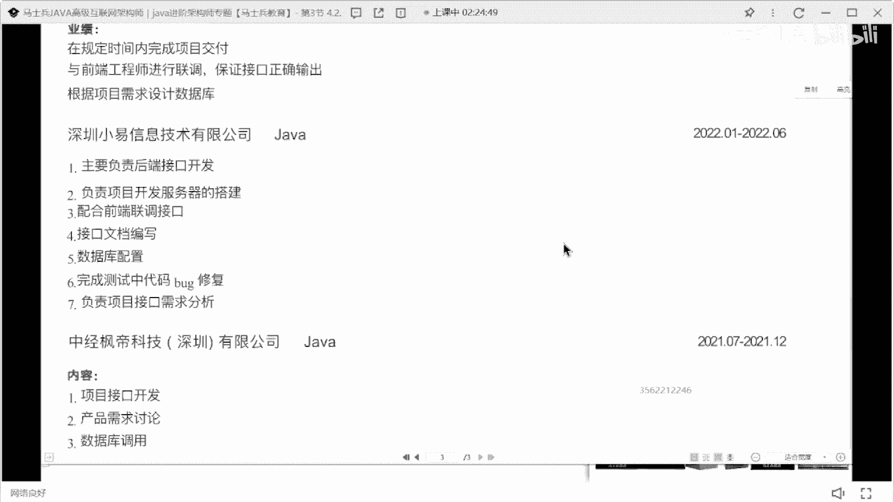

这个经历如果再这么搞下去的，以后一定废了，明白吗，大家现在在公司里面的时候，你除了注重你的技术，提升你的项目的能力之外，你一定要注意你的履历，以后，公司可能会越来越在乎你的工作履历。

因为他在乎的是你的稳定性，就这种这种玩法搞下去，真的没得玩了，就没玩了是吧，就跳槽，你想拿工作的钱可以，但是你不能为了这这这点钱一点钱，你你把履历都花成这样，肯定不行，再跳就废了，这这这这这真能再跳了。

好吧。

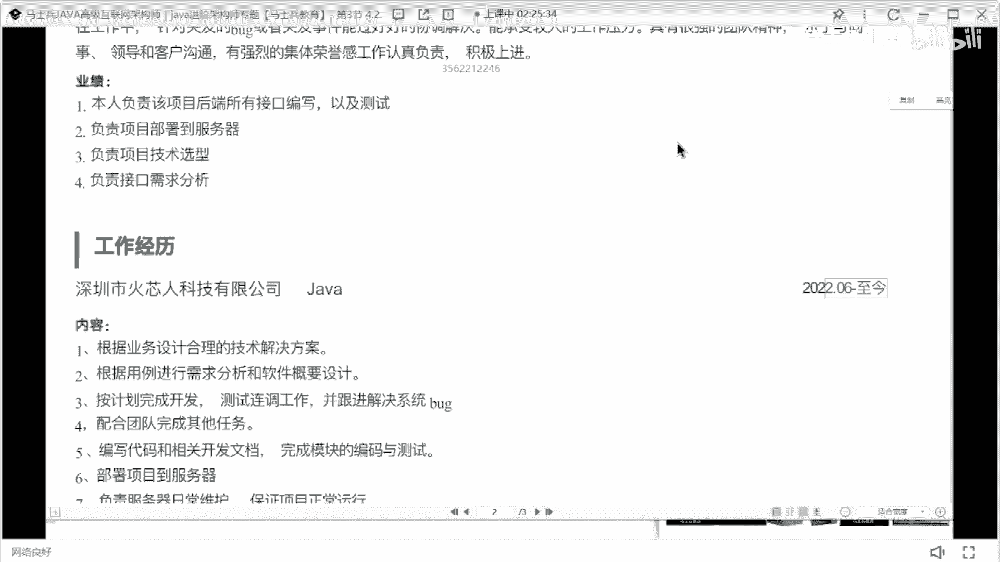

