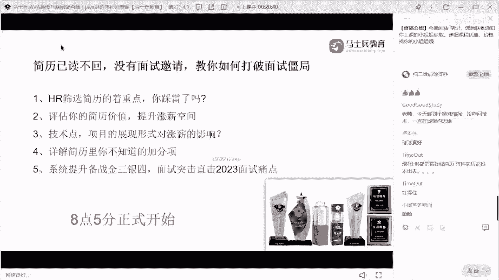
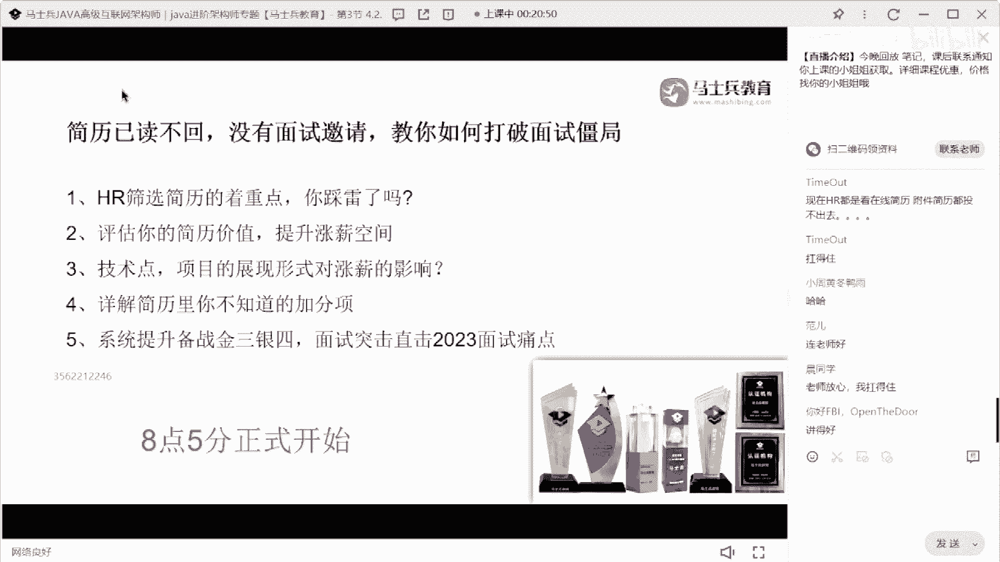
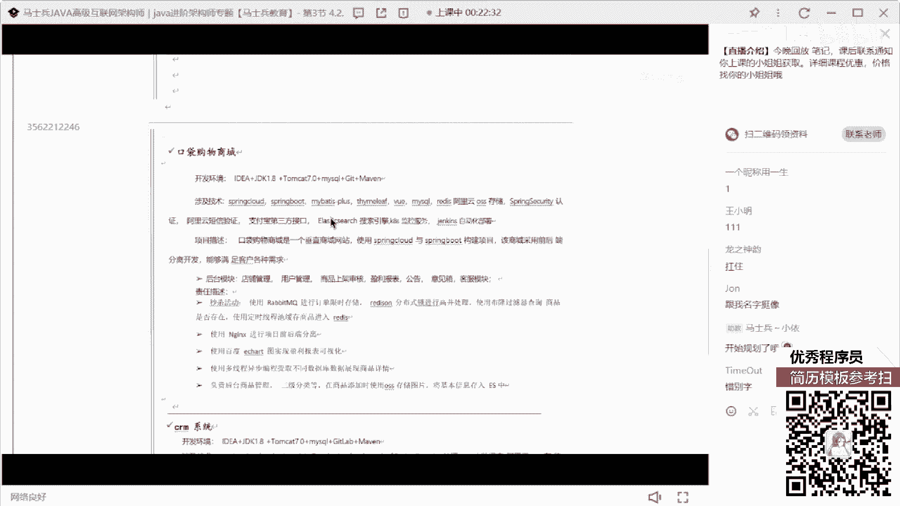
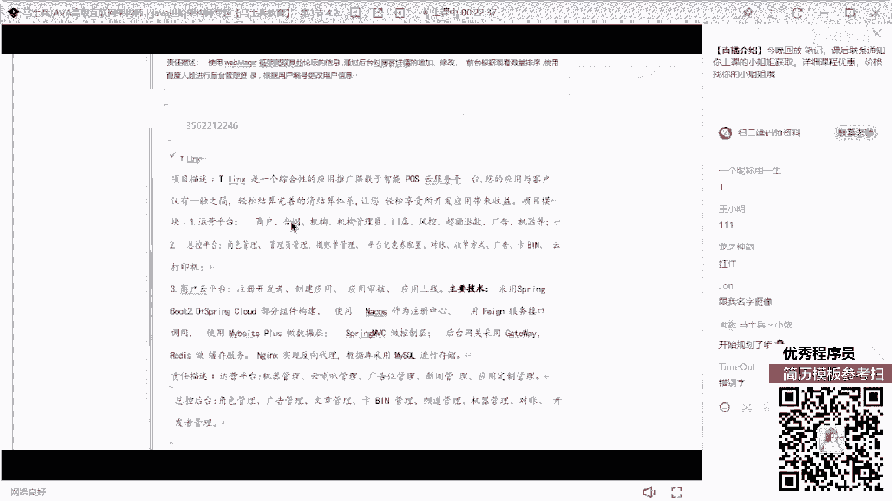
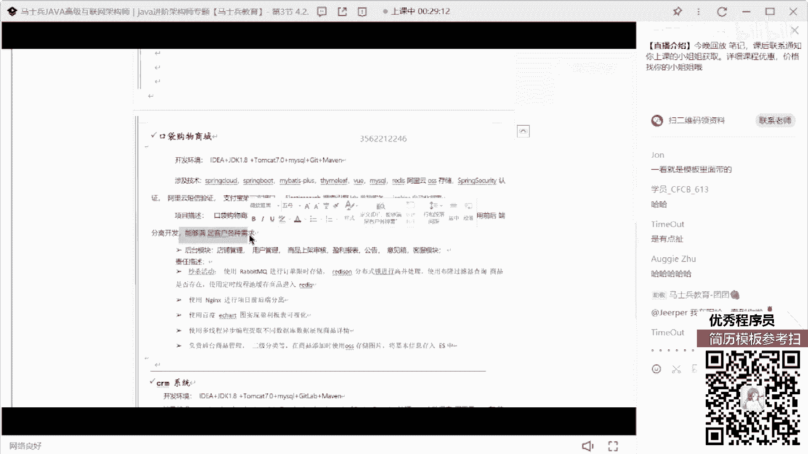
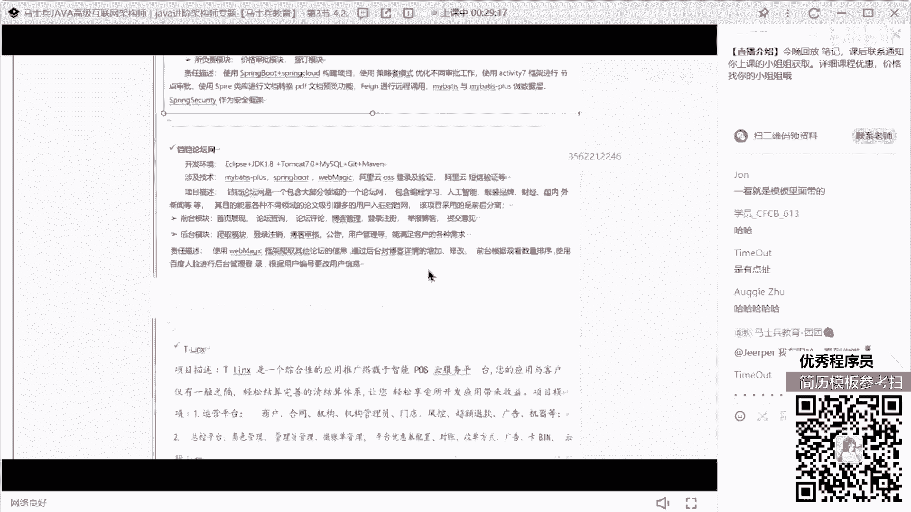
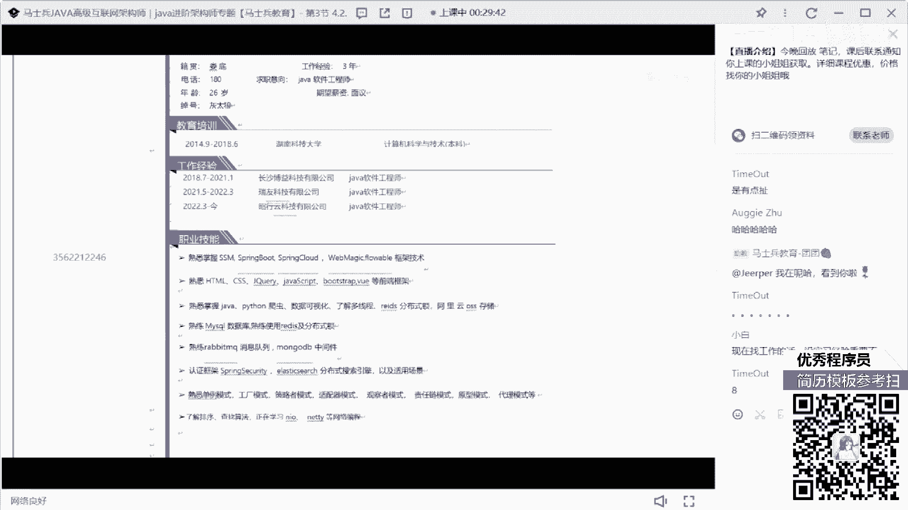
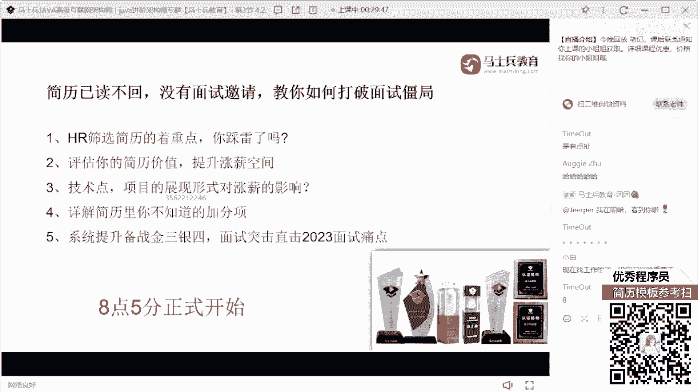
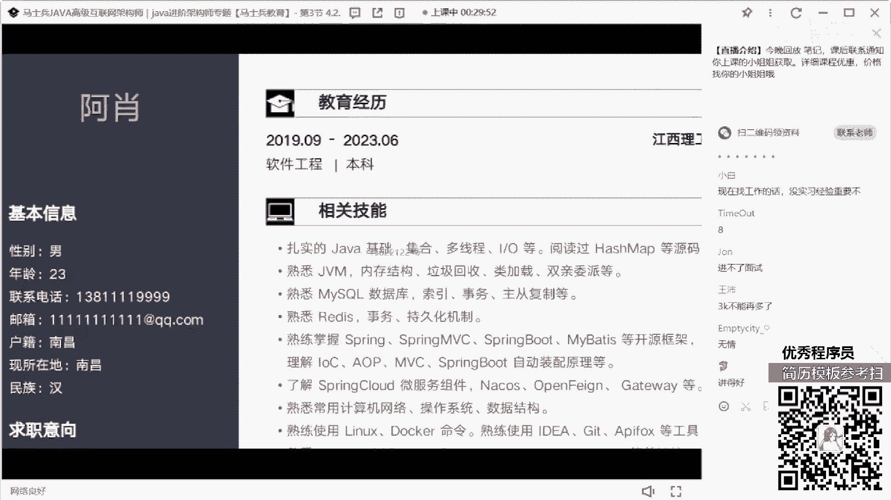

# 什么样的程序员简历一看就没戏？当代互联网HR最喜欢的简历套路有哪些？马士兵告诉你普通程序员写简历千万别太老实！ - P8：【反面教材】4年Java经验简历指导 - 马士兵小鱼 - BV1oP411Q73J

行了8。5分了呃，我们正式开始上课啊，来能听到我声音，同学我们随便扣个数字，我们开始进入到简历的讲解环节。

大概先整体溜一下吧，然后先展示的是你的教育培训，然后是你的工作经历，过经历的话就是3年，然后这是不到1年，这个又不到1年，将近1年的时间，然后技能spring s m，spring。

spring coud，web magic fable，前端的技术，爬虫的技术，redis，看到了吗，看这东西了吗，这就是我说的，就这种东西一旦出现这个问题了，你下面写的再好，我都不会看了。

一定要避免出现这种问题好吧，rob m q mongodb，spring security e s，然后设计模式，然后正在学习n i o和nt相关的内容，然后个人介绍是性格温和，为人诚实活泼开朗。

然后项目经验，后台运维管理系统，然后下面有一个红博招聘系统，下面还有一个口袋购物商城。

一个crm系统，一个担当论坛网。

那个大家这是谁的简历啊，这个同学小伙伴勇于站出来，这是谁的，那个那同学在吗，在的话扣个一来，这谁能找到工作吗，你们说，就这种简历我告诉大家，我看完之后，你百分之百没有面试机会了。

不管你是不是刚培训出来的，你都没有面试机会，为什么我刚刚说的问题，它里面基本上都出现了，第一个错别字，第二这个看一下这个字体的整体的大小样式，字体的格式，你再看看项目，这个项目的项目更精彩。

咱先不看你项目里面内容写的是啥，就这个字体这个字体，这个字体这个字体下面这块就这种东西，你说你把这样的简历投给我之后，你觉得我的第一反馈是什么，不说内容，第一反馈就是你一定没有认真琢磨你的简历。

你看你的这个字体大小，前面的字体，后面的字体就我我我都不用考察你的技术，就知道你这个小伙伴在写这份简历的时候，最起码你不认真，最起码你的态度有问题，你给我看这样的东西，在我看来，你浪费我时间。

明白这意思吗，所以就这种问题啊，朋友们一定记住，一定要避免，就这种问题一定不能出现，一旦出现这样的问题，真的很严重很严重，就我如果看到这样的简历，我告诉你，哪怕我们的hr告诉我让你面试，你看下简历。

他如果收到这样的简历，他哪怕来到公司了，我也不会让他去面试，懂我意思吗，所以他现在出现问题，我希望大家所有人共勉，不要再出现这样的问题了，ok是第一个点，紧跟着我再来说它里面内容描述。

第一个关于技术传的描述，他现在工作3年了，正常情况下3年经验的一个小伙伴，他应该处于一个中级左右的水平，但是大家看一下他现在所描述的这些技术站，可以支撑他3年的经验吗，不够买。

首先我们作为一个后台开发工程师，其他东西没必要，这个东西写的跟没写一样，对不对，第二个像这个东西写的写的也没写一样，比如说你有用的就中间那几条，然后你把很多不应该归到一起的，不应该归到类的地方归类的。

he despring boot spring cloud，你放在一块，这俩东西有必要跟框架放在一起吗，但写的java写的爬虫，写的数据可视化，又写了多线程，写的redis，写分布式锁也写了o s s。

你这些东西我不知道你是怎么往一块合并的，我们在技能合并的时候可以合并，但是有相同类型的同类技术可以合并，非同类技术有必要合并吗，没必要吧，所以怎么办，把这里面你所掌握的每一个技术站。

能不能都单独拿出来做一个最基础的罗列，展示一下你个人的技术深度，就很多人其实不太注重这个技能这块描述，都说哎老师反正所有人都这么写，我也这么写就行了，那如果你这么写的话，我就问一个问题。

你这里面的技术你敢接得起我的问吗，因为你没有突出任何东西，比如release，我随便问你，我问你底层的io模型，我问你它里面的系统调用，我问你他哨兵机制，持交换方式，数据类型，底层数据结构。

我是不是随便问，我想问啥问啥吧，那如果让面试官想问啥问啥的话，你告诉我你目前的技术站能cover这些东西吗，很明显不能吗，对的，所以技术站描述肯定有问题的，怎么写，我说了。

把你所掌握的每一个技术站单独拿出来，把每一个细节就罗列清楚啊，啪啪啪展示清楚一排啊，这是你整个的技术体系，先给别人展示出来，我具备这样的知识宽度深度，你来问，但最起码宽度我先给你展示出来。

你写成这样东西，我觉得不合适好吧，这是第一个第二个自我介绍，这我不知道这个这个地方加一个自我介绍，愿意用意在什么地方，你如果想交同学就自我评价，想夸自己叫自我评价，但是你夸这东西性格温和，为人诚实。

活泼开朗，对编码有兴趣，在编写代码方面很仔细，你这句话纯粹就是扯淡，你简历写成这个吊样子，你说你很仔细，别扯了，懂我意思吗，这样的东西是没有意义的，写的跟没写是一模一样的，很占空间，那应该写什么东西。

突出你的行业背景和你自己的技术经验，记一下自己夸什么，不是夸你的性格，很推上，就是啊，我是活泼开朗啊，团队什么责任感强是吧，这一沟通这种东西，在面试过程中是很难评判出来的，那你要说什么东西。

我做过什么什么什么项目的一些加工设计，我之前做过什么什么行业的项目，我提供出过哪些技术解决方案，我接触的项目的数据量是多大的，我对什么技术有深入的研究好吧，我自己总结过哪些博客和论坛。

做过哪项的技术沉淀，这你写出来吧，你要写点你具备而别人不太具备的东西，这才是你的加分项和优势，都这么写着就考个啥，没啥可考的好吧，项目这一块，第一个环境开发环境一般不写没意义好吧。

你写个什么i d r j d k的东西，大家都这么用，无所谓，基础描设计技术可以写好，把你项目中用到的所有技术一个一个逻辑清楚，这个问题，项目描述，该项目是给运维人员管理项目，以及运营人员考勤，你看啊。

该项目是一个给运维人员管理项目，以及运维人员考勤，有问题，操作工单给领导审批的系统通顺吗，来告诉我里面是个模块，有这个模块你要突出的是什么，是没有这个项目之前遇到了什么问题，你通过这个项目解决了什么问。

题，里面包含了什么样的核心功能，每天提供的工单的数据量是多少，展示一些可量化的东西给别人看，让别人能够对你的项目稍微改，那么一丢丢的兴趣，这才是重点和核心，把这个模模块没必要罗列。

想罗列哪几个重心的地方，重要的地方罗列不是把所有明罗列出来，自然描述就更不用说了啊，什么人员工管理什么，什么信什么信息管理什么，这个模块，那个模块在我看来也没多大意好，突出不了有价值，应该怎么写。

用什么技术实现什么功能好吧，下面项目也是一模一样的，基本上都是一句话，平安外包项目的一个标品项目对吧，这是一个什么垂直的一个商城网站，要满足客户的需要，对不对。

下面又是一个统一的管理平台，就你这样写这个项目啊。

他百分之百的概率是不会有面试机会的，一定不会有，所以一定要好好调整这些东西，明白吗，这些同学我不知道你在不在直播间啊，在直播间同学，我希望所有同学能够共勉，像这个简历有值值值多少钱啊。

我们我们就不说值多少钱了，好不好，我们就不说值多少钱了，因为我觉得这东西可能连这个简历，可能连面试机会都没有好吧。

我我我我说得狠吗，不狠吧。

