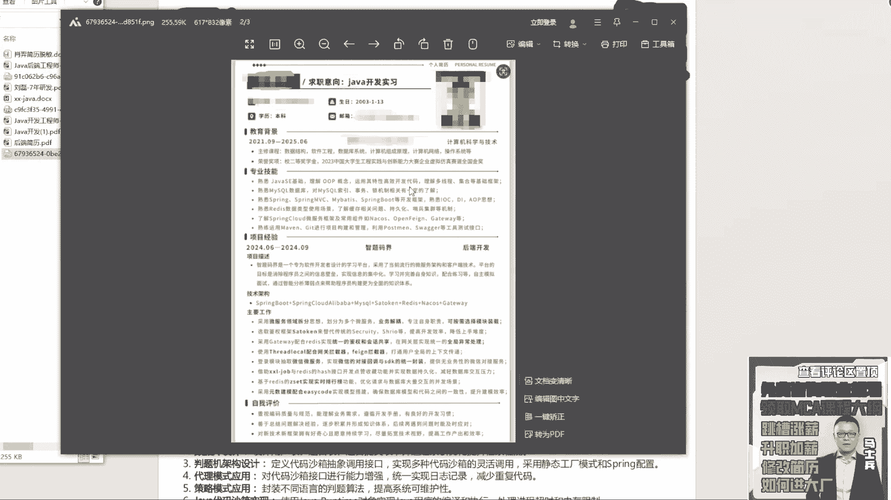
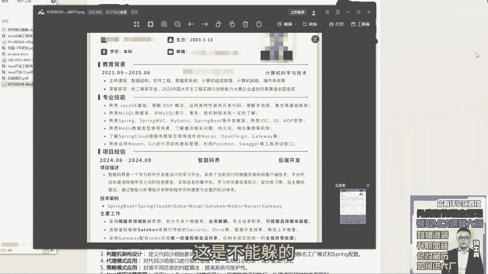

# 程序员简历指导！专治找不到工作，马士兵教育连鹏举老师，手把手教你写简历！ - P10：10.【程序员简历指导】大学在读，明年毕业，技能不够 - 计算机底层原理 - BV1ZnDsYAE7D

来下一个，之前有个hr说专业技能没有工作经历重要，说看起来都是专业复制的，所以专业技能工作经历，项目经理应该怎么排序，先写专业技能，然后是你的项目经理，然后是你的工作经历，这个顺序啊，先展示技能。

再展示项目，再展示工作经历啊，老师我们部门的项目都是维护，同一个在扩展和维护3年计算5年同一个项目，这种不会有多项目经理扩展怎么跑，第一个把你现在的项目先准备好，第二个自己去找两个项目前行去啊。

自己去找两个项目写进去，扩展进去啊，跟你们当前的行业，或者跟你们当前的公司的业务背景相关的，可以写进去，好吧嗯，软考有必要考吗，如果你要做落户，你要有必要考的，如果你只是单纯为了找工作呃，意义不大好吧。

意义不大，来这位同学在吗，在的话来扣一来，啊是与光同城的是吧。

来看一下他的啊，03年的本科也是明年毕业啊，还是那句话，这个这个这个就不写了好吧，课程不写了，技能JAVISE，MYSQL框架，Redis，Spring cloud，就是有你就写上吧，如果你有一些证书。

你就写上吧，那玩意也不是什么减分项，对不对，他不会减分的，有你就写好吧，呃首先从这个技能描述上来说，与光同尘呃，少了点东西好吧，该就是哪怕hr觉得说这块东西都是复制粘贴的，你该写东西也要写。

该加东西也要加啊，这是不能躲的。

躲不过去的好，这一定要注意了啊，所以技能这块，你看你这个简历和这个同学这块的技能描述。

比较起来显然就单薄一点，所以该展示的技能战要要要要展示。

这个不能不能省，第二个叫智智提马介，这是一个软件开发者开发的平台，流行的微服务架构平台，消除信息成员信息壁垒，微服务组件，微服务拆分业务解耦呃，Start token。

建立spring security框架，安全的网关的SLOCAL的呃，业务点没问题，业务点没问题，项目也有的聊，但是还是那句话，他要套壳，他要套壳，他要套到一个实习经里面。

你在你的简历里面没有写到任何实习经历，相关的东西，把你的项目经验变成你在某个公司，参与实习过程中所做的开发好，下面写的业务点是没问题的，优点没问题的，然后再加一个项目，作为一个大学生而言，找工作的时候。

一个项目略显单薄，至少两个项目，如果你有能力准准备两个微服务项目的话，当然很好，如果你没有能力准备两个微服务项目，你就写一个微服务项目，一个单体项目，但至少你要写两个项目，一个项目是不够的，明白了吗。

与光同尘，而写的内容是没没什么可说的，这OK没问题啊，但是要套壳加一个实习经历，大家注意啊，咱们有很多那个我说一下，现在大学生还有多少，大学生在的同学扣了个扣个，一来欢迎在的扣个一，就小莫一个人。

啧我说件事，同学们听好了听好了，很多同学一直在纠结一件事，老师我到底要不要找实习工作，我不知道你们有没有这个困惑啊，我先说明一下实习的情况，现在很多公司并不招实习生，哪怕有很多hr。

他可能挂着实习的岗位，但他并不招聘，因为现在正式岗的招聘都很难，更不要说实习生，所以大家不要倾向于说我一定要找实习，你有没有真实的实习经历，一点都不重要好吧，但是你在写简历的时候，你要编一个实习经历。

实习经历他是没有办法去做背调和调查的，除非你进大厂，就如果你不进大厂去实习，他是没有过各各各种各样的这种被调的情况的，所以不用考虑它真假，但是你一定要在简历里面突出，你有实习的经历好吧。

然后对于实习这块，如果你能够拿到大厂的实习，该去去，如果你只能拿到小小公司的实习，不要去纯粹浪费时间，对于你本身找工作而言，而对于你那个秋招而言，或校招而言，一点意义和价值都没有。

因为你进去之后也是打杂好吧，那个东西对你成长是没有帮助的，与其去公司里面做打杂的实习，不如把你的时间精力放在你的技术储备上面去，所以把这想明白好吧，但是无论你真是否有真实的实习经验。

简历里面是定要编一份实习经历的啊，怎么编也非常简单，怎么编也非常简单，你去你在在你所在的那个城市，就你大学所在那个城市啊，先定位到城市，比如说你在青岛，比如说你在广州，比如你在深圳，比如在北京。

比在上海任何一个城市都行，无所谓好吧，在这城市里面先定位到城市，第二个上企查查天眼查好吧，找一个公司啊，搜企业名字，它的行业属性是什么样子的，找这样的公司，然后把你的经历写到那家公司里面去。

不用担心背调，不用担心被调，没有人去对实习生做背调不重要，明白了，我说了，如果你在大厂里面做实习的话，你写了可能会做背调，但是不是大厂的话不会做背调，所以不用担心这些事情，但实习经历是一定要有的好吧。

应届得报一个实习吗，任何大学期间，你在以代以，就是以一个应届生或者在校生的身份，找工作的时候，实习经历是一样，有的好吧，假的也要写，不写是不行的，好吧，就是你要告诉别人，我具备真实的开发能力。

这个很重要好吧。

