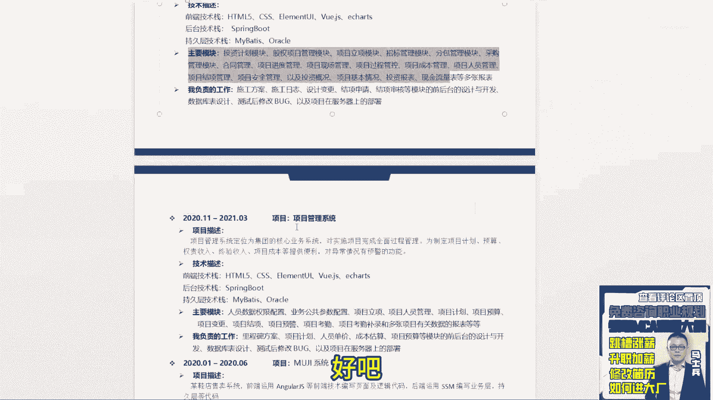
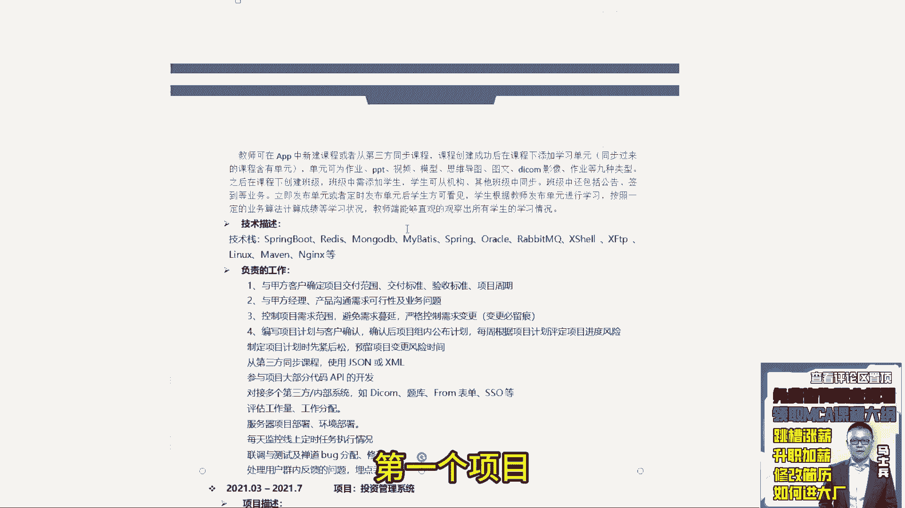

# 程序员简历指导！专治找不到工作，马士兵教育连鹏举老师，手把手教你写简历！ - P11：11.【程序员简历指导】一本，5年经验 - 计算机底层原理 - BV1ZnDsYAE7D

来再看还有两个，刚又有两个同学啊，再来看一下啊，这万同学在吗，还在吗，刚刚我看你一直在说啊，万同学，在是吧em，来看一下啊，对对对对对，这个tender needs总结的很好。

我来看这个同学他的呃，还是那句话，同学们，你看你这同学Emo看你写的这个技能描述啊，你现在工作5年时间啊，这条这条意义不大，我说了，如果想写往后放，放到后面去好吧。

然后呢框架的这里面的MYSQLREDISMONGODB，如果想写单独拿出来做描述，你这两条其实是描述的都是数据库相关的东西，那既然描述都是数据库相关的，那就合到一条写，不要把它分开写好吧。

微服务eureka和R泵，现在啊已经记住一件事，现在spring cloud这个体系里面问的更多的是阿里巴巴，不是奈飞那套，不是奈飞那套，所以呢你如果想描述微服务，最好描述是NUOSCINO。

意思这样组件，而不是eureka这东西啊，因为他可能过时了，或者说现在问的很应用的很少了，好吧，呃LINUX按这个往后放好吧，呃svn git maven，这个这个都不要了好吧，这个不要了。

就是你该详细写的没详细写，不该详细写的都详细写了好吧，像ROBMQ卡不卡，这两个中间线为什么要跟docker放在一块，没必要好吧，中间件是一个必备技能点，所以你要单独拿出来做描述。

所以技能这块你要好好去做一个总结和梳理。

OK这是第一个第二个工作经历。

工作经历在写的时候啊，工作经在写的时候呃，后面这个全站没必要写了好吧，就是你在写所有的这种怎么说，就是项目这块的时候，你先找开发工作，所有岗位都是java开发工程师，如果想做区分。

最开始的时候18年初级开发工程师好吧，然后后面就是高级开发工程师，听明白了吧，咱不要写什么产品，不要写什么项目经理，不要写这东西，不要写软件开发工程师，就是java开发工程师，定位聚聚焦。

好好这这东西呃，然后整体项目啊，这个技能描这个写的时候没必要整体加粗是吧。

不用不用不用加粗啊，来往下看，下一个教学助手SPOC嗯，这项目你项目描述你写这么多，我在一眼看过去的时候，你告诉我，我能够从这里面挖掘到什么有用信息吗，挖掘不到这个字体也要改好吧，字体我就不说了啊。

就这Y1眼看不到重点的需求点，所以这个要简写，还是那句话，3~4行简单的描述一下就够了。

OK然后这个技术站这么多，然后负责工作，你看你写的东西，第一个虚的，第二个虚的，第三个虚的，第四个虚的，第五个虚的，这几个算是业务点，哪儿就是它没有具体的业务点，你你告诉我，我去问啥，我就问你。

怎么去制定，这个这个这个这个这个这个这个项目进度的，怎么把控项目进度的，那你怎么同步课程的，怎么对接内部内内部系统的，不行啊，没啥聊的好吧，没啥聊的，所以这东西你得改，值得值得，这块写的有点有点差。

有点差好吧，下一个你看你上面那个格式是这样的。

你这加个编号多好，就我说了，大家考虑一下，考虑一下hr的感受好不好，就你们要考虑一下别人在看你简历的时候，感受这个写的感受不太好好吧。

下面也是一样的，你像上面这块还知道一行写一条，下面就没了。

下面都合到一块了，主要模块是不需要罗列的，没用没用好吧。

项目管理系统嘶母鸡母鸡系统呃。

还是那句话，同学听好了，Emo呃，第一个项目呃。

目前看起来我没没没详细看啊，目前看起来没觉得有太多可聊的业务点。

后面两个项目就基本上，后面几个项目，基本上都是基本的增删改查系统了。

所以这项目你得好好在润色一下，我觉得这个项目写上去可能这么说。

不太有面试机会吧，应该没啥感兴趣的点。

这得好好改改好吧，自我评价不说了，对这个都都这么写的。

一会告诉你怎么写好吧。