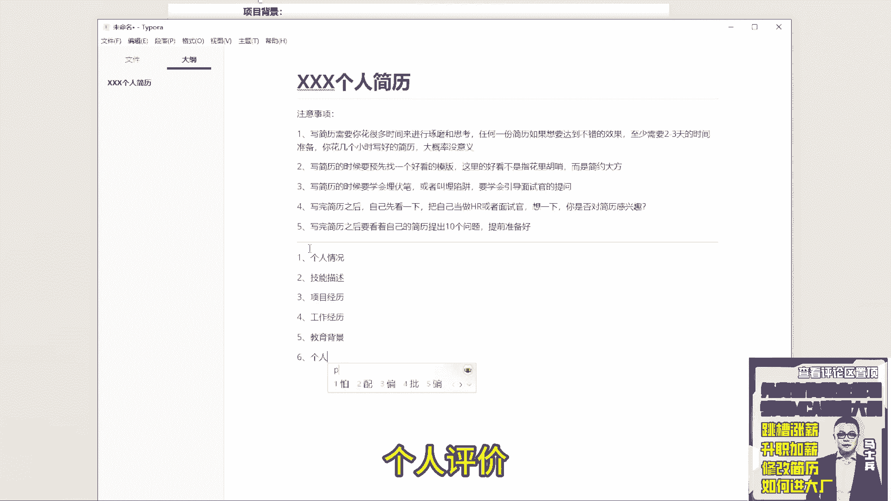
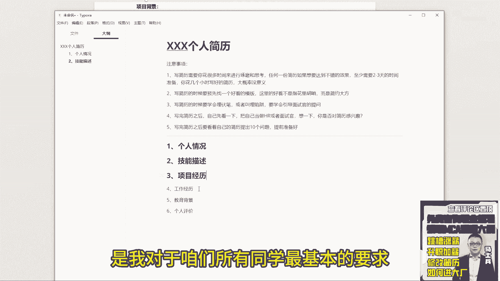
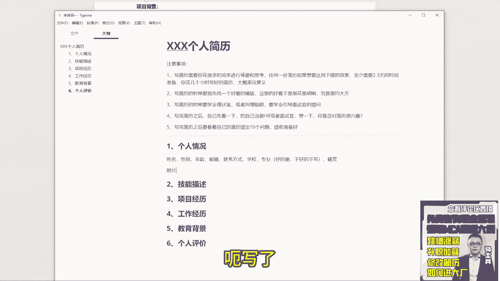
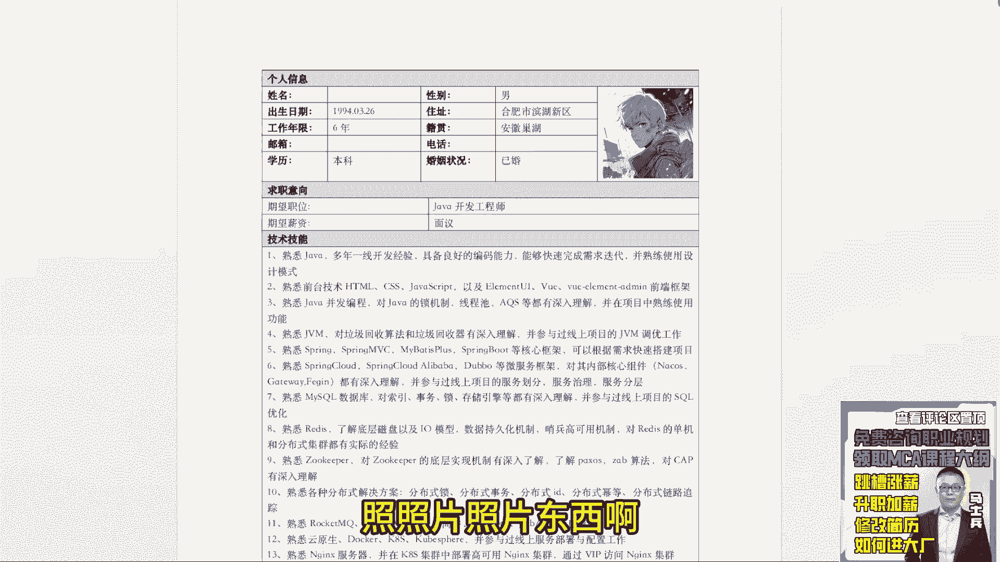
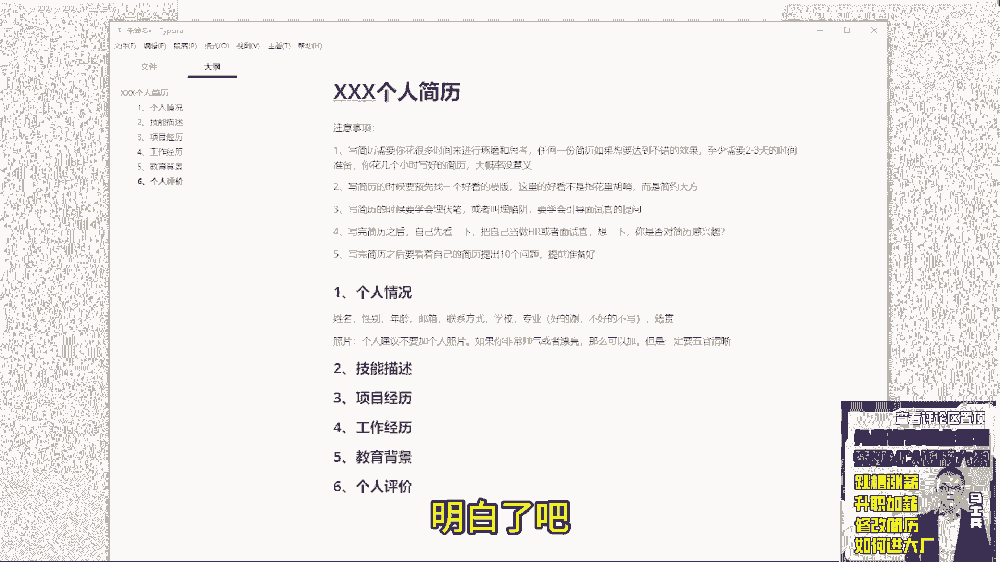

# 程序员简历指导！专治找不到工作，马士兵教育连鹏举老师，手把手教你写简历！ - P14：14.简历个人情况怎么写？ - 计算机底层原理 - BV1ZnDsYAE7D

下面我们开始来说简历到底怎么写，简历中简历要包含以下几个模块，第一个个人情况，第二个技能描述，第三个项目经理，第四个工作经历，第五个交易被背景，第六个个人评价。

这六个模块是我对于咱们所有同学，最基本的要求。

除了这六个模块，你想加别的模块，你再加，但是这六个模块缺一不可啊，这个东西必须要有，无论你是大学生还是你是在职的，还是已经工作的，都要有，好吧，大学生你的工作经历就变成你的实习经历了。

这东西是一定要有的，应该有的好吧，那好了，下面我们来说一下个人情况应该怎么去写，写的方式啊非常简单，姓名性别对吧，然后呢年龄邮箱联系方式对吧，就这些基本东西就行了好吧，然后呢还有一个东西是什么呢。

叫学校学历这两个东西啊，学校专业两个东西，这两东西啊好的写不好的不写，如果你98521的，该写写，如果你不是9851，要不写好吧，项目经理放在工作经前面对，先展示技能，再展示项目，最后是你的工作经历。

工作经历只是来梳理你个人履历的，他没必要前置，因为有很多同学你的跳槽是非常非常频繁的，如果你直接写到最前面可能会有问题，所以放到项目的后面，OK就这个东西，然后呢这块我的建议是什么呢。

我建议大家加一个东西，小极管习惯什么意思啊，大家绝大部分人找工作的时候，可能选择在一线城市或者二线城市，跟你的家乡可能很远，所以呢在面试的时候有可能会碰到你的老乡啊，搏一个概率，搏一个运气，仅此而已。

但你写的东西没什么损失，不写呃，可能遇到了他不知道，就跟我的跟咱们同学聊天一样，每次有同学报名，我一看哎，你是河北北方学院的，你是河北邯郸的，我就非常亲切，明白吗，这种情怀大家应该是可以理解的。

明白意思吧，所以相当适当的博一些好感吧，或者博一些第一印象，就这块东西，OK然后呢下面还有一个有争议的东西啊，就是照片，呃刚刚看的简历里面啊，有一个同学吧，呃写了有一个同学有这这同学好写了吧。

对他他删照片了，其他同学都没写照照片照片东西啊。

呃有的老师建议加，有的老师不建议加好吧，我先说个人意见，个人建议不要加个人照片，明白吧，呃为什么不加啊，我说一下我的一个不能说一个习惯吧，就我之前经历，就是我经历过的事情，比如你去大大街上走着。

你走在大街上的时候，突然有一个人，突然有一个人迎迎面走过，你也不认识他，从来没见过这个人，从来没见过这个人，有没有这种感觉，莫名的很讨厌一个人，你们没有这种经历吗，迎面走过的人你也没见过，从来没见过。

没有任何交流，但是你就讨厌他，不知道你们有没有啊，反正我是有这种经历的，所以当你贴完照片之后，有时候可能别人也就看你不太舒服，不太爽，可能都不愿意面试，所以我是不建议加的，不建议加的好吧，然后呢。

如果你非常帅气或者漂亮，女孩子漂亮男孩子帅气好吧，那么可以加，但是一定要五官清晰，这很重要，之前有的同学好吧，戴戴口罩拍个照片放上去了，你干啥，你戴口罩让别人看，还不让别人看，有同学拍了个侧颜照。

这都太搞笑了，有的同学拍的那种远景照片，就是在某一个风景下面，比如瀑布，比如说夕阳对吧，离他他自己拉的很远，看人显得很小，这种照片都不要啊，一定要清晰的照清楚你的五官，明白吧，这么玄乎不是玄乎啊。

就是每个人跟每个人都是有磁场的，大家知道吧，有时候你跟某个人磁场可能不太相符，他可能就比较比较比较比较讨厌对吧，这只是个人个人的感觉，好吧，你们非要加就加，没关系，也不是什么大事啊。

只是我把个人的一个意见给大家写出来，仅此而已，明白了吧好吧。

就这块儿好了。