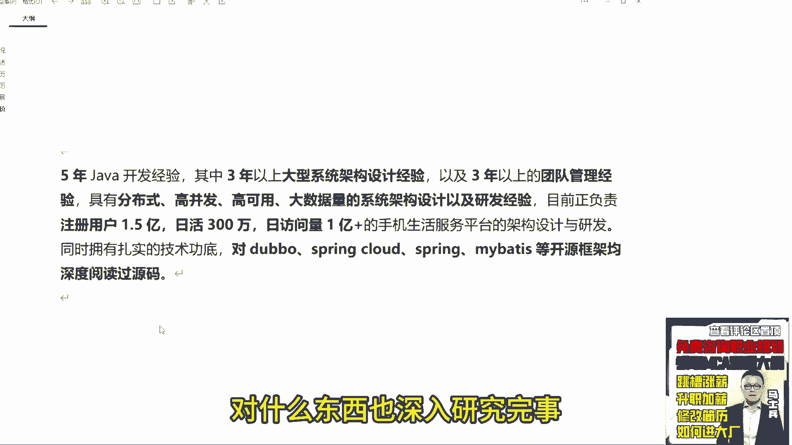
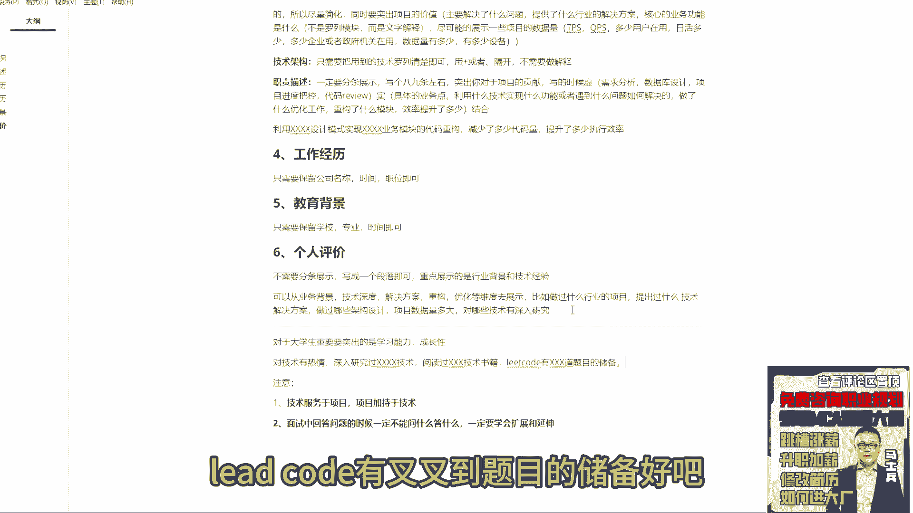

# 程序员简历指导！专治找不到工作，马士兵教育连鹏举老师，手把手教你写简历！ - P17：17.工作经历、教育背景、个人评价怎么写？ - 计算机底层原理 - BV1ZnDsYAE7D

来下一个工作经历怎么写。

只需要保留公司名称时间职位即可好吧。

教学背景只需要保留学校专业时间即可。

别的都不需要写，都不需要写好，所以这两块就是让hr看的没别的意思啊。

知道你的学历是什么学历，知道你的履历什么履历就完事了好吧，下一个个人评价。

他是在他描述的是他成为一个架构师，要做的事情。

架构师要做的事情好吧，再一个个人评价这个模块就比较重要了好吧。

来说一下这个模块怎么写，不需要分条展示，写成一个段落即可。

重点展示的是行业背景和技术经验。

好吧，怎么聊，可以，从什么业务背景，技术深度，解决方案重构优化等维度去展示。

比如做过什么行业的项目。

提出过什么技术解决方案，做过哪些架构设计，对不对，然后呢，项目数据量，多大对吧，对哪些技术有深入研究，是不是可以这么写，对吧，来呀，我给你看一个。

这东西啊展示的很多了，5年java开发经验，其中3年大自行系统架构设计经验，3年以上团队管理经验，分布式高并发。

高可用大数据，一样的系统架构设计以及研发经验，正负责注册用户1。5亿，日活300万，日访问量1亿的手机生活服务平台的架构设计。

研发好吧，拥有扎实的技术功底，对什么东西有什么研究。

完事是不是可以这么写，但这个数据量啊，你们可以自己适当缩小。

没必要写成这么大，他这个写的时候啊也吹牛逼了，没这么大，他也是夸大了。

但是他的技术能cover住就OK了，你们也要参照这样的方式写，这东西比你写什么沟通能力强。

责任心强，什么热爱加班好多了吧。

是不是这意思好吧，来来没项目经验，大学生没项目经验的来扣一，我告诉你大学生没项目经验怎么写，没项目经验的，如果你之前如果你之前就是年龄比较大，你需要转行，你也要编项目经验，这个没办法啊。

大学生我告诉你怎么写。

大学生要展示是什么，一定记住，大学生考验的是你的学习能力和成长性。

好吧，所以对于你这烟有点贫烧脑的。

我跟你讲这东西我都没有提前准备，我都是想到哪，我讲到哪，听明白了吗，能能懂我意思吗，所以我就说一句话，之前我后面五句话我已经准备好了，所以我上完这节课我很累。

你知道吧，来对大学生重点要突出的是什么东西，学学习能力，成长性除这东西，所以怎么展示对技术有热情对吧，深入研究过叉叉叉技术，阅读过叉叉叉技术。

书籍对吧，然后呢lead code有叉叉到题目的储备好吧。

做过叉叉，项目并获得什么，成长对吧，私下会怎么储备技术对吧。

然后看过哪些GITHUB的项目。

做过哪些博客的积累和沉淀。

可以这样写吧，就是所有东西突出的就是你的学习性，你的成长性要突出，这个东西能理解吗，同学们来大学生明白了吗，所以不同的阶段要突出的内容是不一样的，不同的阶段，不同的年龄，不同的层次。

面试官对于你的要求也是不一样的，所以你要投其所好。

好了这几个模块我就说这么多吧。

来有收获的同学给老师扣波六，好不好，这这这这今天晚上讲的真干货了。

纯干了很干了吧，你们今天晚上来算赚到了。

没整没没给你们整一点虚的啊。

哎来聊完这东西之后。

