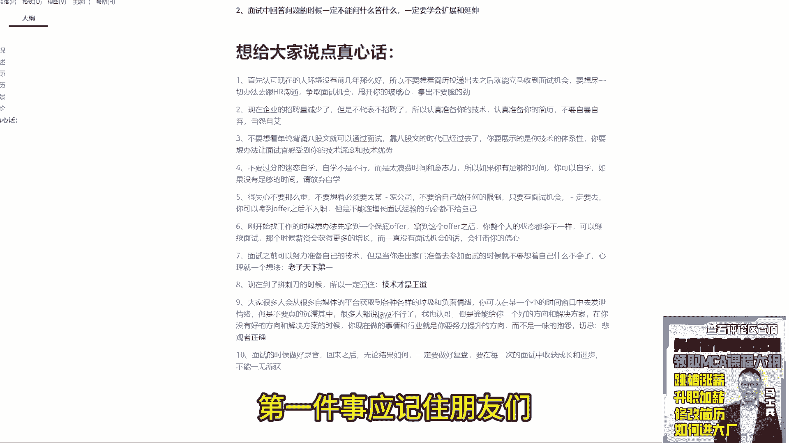
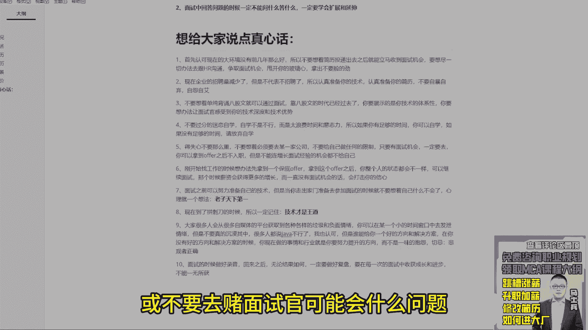
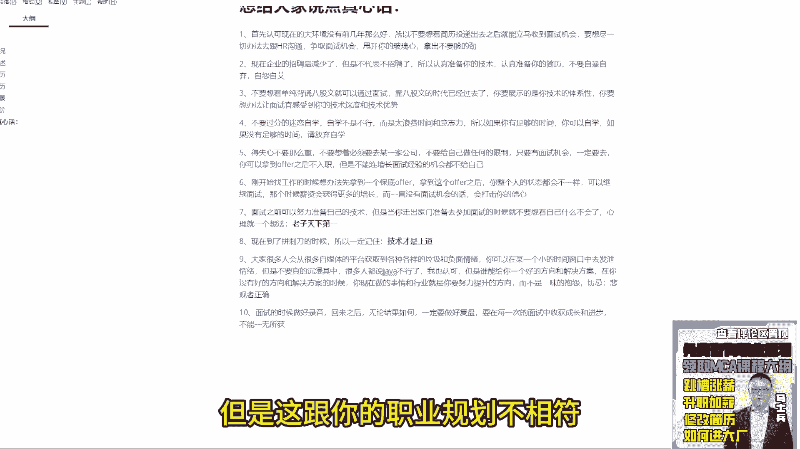

# 程序员简历指导！专治找不到工作，马士兵教育连鹏举老师，手把手教你写简历！ - P18：18.给大家的建议 - 计算机底层原理 - BV1ZnDsYAE7D

想给大家说点真心话，说什么真心话来，第一条，首先认可现在的大环境没有前几年那么那么好，所以不要想着简历投递，出去之后就能立马收到面试机会，要想进，一切办法去，跟hr沟通，争取面试机会。

前几年你不用去投递，把简历开放出来，一堆人联系你，但是不好意思，那个时代过去了，明白了吗，所以你要想办法争取面试机会，这是第一点好吧，甩开你的玻璃心好吧，拿出不要脸的劲儿，懂我意思吧。

这是第一个来第二个点，现在企业的招聘量减少了，但是不代表不招聘了，能懂吗，所以认真准备你的技术，认真准备你的简历，不要自暴自弃，自怨自艾，明白吗好吧，这是第二个要给大家说的，第三个。

不要想着单纯背诵八股文就可以通过面试好吧，call8股文的时代已经过去了，你要展示的是你技术的体系性，你要想办法让面试官感受到，你的技术深度和技术优势，明白了吧啊这个很重要好吧。

第四个不要过分的迷恋自学，自学不是不行，而是太浪费时间和意志力，所以如果你有足够的时间，你可以自学，如果没有足够的时间，请放弃自学好吧，当然你要不要选择我们是你自己的事好吧，真心话，OK呃那个一方通行。

一会我来给你回答好吧，第五个第五个得实心，不要那么重得知心不要那么重好吧，不要想着，必须要去某一家公司，不要给自己做任何的限制，只要有面试机会，一定要去，你可以拿到offer之后不入职。

但是不能连增长面试经验的机会都不给，自己第六个，刚开始找工作的时候，想办法先拿到一个保底offer，拿到这个offer之后，你整个人的状态都会不一样，下次可以继续面试，那个时候，薪资会获得更多的增长啊。

而一直没有面试，机会的话会打击你的信心，所以先拿到一个保底offer，明白了吗，好吧，这一定要记住第七个，面试的时候，怎么说，面试之前可以努力准备自己的技术，但是当你走出家门，准备去参加面试的时候。

就不要想着自己什么，不会了好吧，心里就一个想法，老子天下第一，明白吗，这个很重要啊，面试的时候要表现出你的信心，如果你自己没有信心，那么面试官自然就会怀疑你自己本身的，技术上的一个储备，明白了吧好吧。

所以这一定要注意好吧，第八个，现在到了拼刺刀的时候，所以一定记住技术才是文道，第九个大家，很多人，会从很多自媒体的平台，获取到各种各样的垃圾和负面情绪，你可以在某一个小的时间窗口中，去发泄情绪。

但是不要真的沉浸其中，很多人都说java不行了，我也认可，但是谁能给你一个好的方向，和解决方案，在你没有好的方向和解决方案的时候，你现在做的事情和行业，就是你要努力提升的方向，而不是一味的。

抱怨明白了吗，切记一件事，悲观者，正确大家能理解，第九条是我想给大家说的，你从知乎也好，B站也好，抖音也好，各种平台你一定能收到各种各样反馈，java不行啦，完蛋啦，垮了对，是确实难，确实垮了。

来你告诉我哪个好，但凡有个行业能现在立马赚2万块钱，我都不带拦你的，你赶紧去，能给出你吗，谁能给出你这样的方向，没有，所以那些所谓的博主给你传导的信息是什么，他要获取认可，但是认可没有意义，重点是什么。

你要去找到你的解决方案，明白吗，所以希望大家能够做好这件事情，好吧，来第十个面试的时候做好录音，回来之后，无论结果如何，一定要做好复盘，要在每一次的面试中收获成长和进步，不能，面试不能一无所获。

明白了吧好了，这是我要给大家说的一些真心话，跟报课无关，报不报课，你们自己去选择好吧，来现在下面回答大家问题，一方通行这边有个小问题，希望老师的回答，每个企业用的项目技术站可能有差别。

是全写在一份简历上，还是要区分开，然后做为多份简历，然后投的话投地比较好的，比如军工类，关注国产数据库之类的这些东西，其他的可能需要主流框架列，这要怎么选择，第一件事已经记住了。

同学们，任何人不要去猜测或不要去赌，面试官可能会什么问题。

你要想办法去尽可能的补全自己的技术体系，和补全自己的技术站，当然如果你遇到自己特别心仪的公司，特别想去的公司，你可以针对于这家公司去专门准备，准备一份简历，这是没有问题的，但没有这问题的。

但是真的没必要，为每一家公司都单独准备一份简历，大可不必，还是那句话，面试考核的一定是通用性的东西，比如说华为OD，比如说很多大厂的专门外包，还有很多自研的框架，你把那些框架写到简历里面。

别人认可度不高，更多还是开源类东西问的更多一些，所以你要知道现在方向是什么主流的，该写的写啊，比如说你想投军工类的，它特殊有它确实有一些特殊的技术要求，你可以写上去，没问题，明白吗。

但是你的就跟我上面写的这些技术站一样，第一步先保证宽宽，完了之后才是深，先保证这件事情一方通行，能理解了吗，所以某些特殊岗位可以针对性写，但是没必要每一个都针对性写，那个会浪费你很多精力，大可不必好吧。

潜水自我介绍讲什么，每次感觉自我介绍很寡淡，同学们自我介绍，咱们聊一下自我介绍要讲几分钟，你们告诉我自我介绍要讲几分钟，5分钟还有吗，3分钟记住一件事，同学们自我介绍的环节是非常非常之重要的。

因为这里面其实面试的环节是一个什么环节，是一个博弈的环节，相当于你跟面试官在争取主动权的问题，所以在刚开始自我介绍的时候，一定要讲的非常非常的详尽，尽可能的去占用面试官的时间，这个时间干嘛呢。

第一你要做详尽的自我介绍，第二你要想办法，让面试官对你所表述的内容去感兴趣，第三你要让面试官有足够的时间，去阅读你的简历，大部分的面试官是不会提前看你的简历的，明白了吗，所以怎么去聊很简单。

第一先介绍个人情况，第二介绍介绍自己的那个那个工作经历，第三介绍自己的项目经理，第四介绍自己的技术储备等，把这四个方面都介绍完了之后，拿一个你准备让面试官重点聊了项目，开始聊聊什么，聊项目。

重点是用来干嘛的，它的核心价值是什么，核心功能是什么，它的技术架构是什么，整体的项目功能有哪些模块，你在项目中重点负责什么模块，你在开发过程中遇到什么问题，你是如何解决的，明白了吗。

把这些点都要给面试官说道，如果你把这些点都准备好了，聊个35分钟绝对没问题，这是一个最基本的要求，如果大家的表达能力非常有限，告诉你怎么办，提前写好一个逐字稿，明白了吗，写完逐字稿之后。

找你的身边的朋友，老师同学帮你去润色你的逐字稿，要想办法让你的逐字稿能够吸引面试官注意力，这个我可以给大家举个例子，这是我们对很多VIP同学的一个要求，有同学如果但凡表达出来。

说哎我的这个表达有问题的时候，我们会要求同学们干一件事，我给你看一个东西好吧，呃来往下看，这是一个同学，他做的自我介绍，但最开始的时候他写的第一个版本，他做的自我介绍，干什么事，做什么东西是他罗列的。

这东西太粗狂了，然后我们给他做改版，这是给大家他改的第二版的内容，怎么去做描述，怎么做更细粒度划分，你脑海里面能不能做这样的思维导图，后面又给他改，第三版，改成这个样子，明确细分好对应的内容。

你要不要做这样的东西，要不要想办法做这样东西，就这样的东西我罗列清楚之后，你觉得聊个35分钟有没有问题，有问题吗，同学们，唉能能能能对比出来区别吗，能对比出来区别吗，这是他最开始自己写的啊。

一大段描描描述好吧，不太刺激好了，稍微改改，告诉他方向是什么，稍微改一下，细化一下，细化完之后还不刺激好了，又告诉你怎么改，改成这样能理解吗，我不知道这东西大家能理解多少，好吧，就是每个同学按道理说。

你们其实要做这样，要要做这样的事情对吧，所以很多同学这有一个认知老师，我自学就可以，你自学真行吗，很多时候你的自学插在什么地方，插在你的认知上，你的认知达不到的时候，你根本想不到你要做这方面的储备。

但是我们知道我会告诉你怎么去做，哎呀老师我报名数不一样吗，你们给我一堆视频课，我去看就行了，不是这样的，最重要的是什么，是在这个环节里面，这个过程里面老师能给你提供什么样的帮助，你想一件事。

从你自从有认知，有记事儿，有记忆以来，你学什么东西是不需要老师的，不可能，但你们就坚定自己能自学啊，行吧，你就自学吧，我也不说啥，这个这个就是自自我的选择了，对不对。

这个同学他在真的他拿到offer好吧，他的这有文这个这个有有大纲吗，我看这个这个有没有大纲啊，这次怎么展大纲啊，阅读模式不是诶，怎么显示大纲，批注工具哎大纲，你看一下他做了什么事情，自我介绍怎么说的。

离职怎么说的，什么时候离职，原因原因是什么，技术方面做什么样的储备，怕什么坚，下面每个技术点怎么去聊的，能看到吗，他一个文档写的62页，每个点怎么去准备，你们能想明白这个事吗，这个东西你说没人带你。

你真的能搞定吗，很纠结，想学老师，我大四双非一本，先不学算法和大数据可以吗，大数据可以先不学算法，必须得学，你现在大学生算法对于现在大学生而言，它是一个必备技术点，大数据你可以先扔一扔。

但是算法你是必须要搞的，明白了吗，就单门架构，如果你想报名的话，单门架构加算法是必备的，这东西躲不开，明白了吧，l vs就是如果你大学生我的建议啊，如果你就是我给大家说一下，如果你大学生。

我建议你们想学习的时候，尽可能征得父母的认可很重要，因为这事儿你父母要支持你，你学的时候会怎么说，义无反顾的冲进去好吧，但是可能有些父母，大家有些的家长可能对这个行业不了解，或者觉得培训机构都是骗子。

或者收收这么多的学费，可能会有这样的一些问题，但你要想办法去解决你父母这方面问题，如果你认定这东西是你要之后从事的岗位，从事的方向，你就要想办法说服你的父母，一定要获得父母的认可。

不要想着自己我省省点吃的，省点吃的钱，省点喝的钱，省点生活费，我要学这东西最好不要啊，这个是说心里话好吧，我想要项目，可惜你们没有单程，我们项目是不单卖的，为什么，因为项目的很多东西。

是需要前置的知识点支撑的，就我刚刚给大家展示这个东西，讲这个项目的时候，这里面所涉及到业务点，它是需要前面技术支撑的，并不是说我随随便便，我就可以把项目学完之后就搞定了，你要有技术储备才能聊项目。

还是那句话叫技术服务于项目，项目加加持与技术，他们两个缺一不可，你不能只学项目，你要学技术，你要学建项目，有两个东西结合到一块学，这才最最主要的好吧，罗兹空窗期时间比较长，怎么说比较好。

em梦你的空窗期有多长，公差距有多长，能说一下吗，四个月告诉你一个解决方案呃，你现在如果你现在是准备立马找工作，还是打算说我储备一段时间再找工作，是立马找还是储备，到时间再找你，给我方案复习半个月。

找你，现在半个月先干一件事，非常简单，明天找个医院蹲个点儿，去哪儿蹲点儿，去医院的骨科蹲点，蹲点完之后找一个面相看起来比较随和的人，拍一下别人的ct，拍一下别人的病例，拍一下别人的东西。

然后找个会PS的人，把那东西改成你自己的，把时间改一下，就说自己因为意外情况骨折了三个月，所以现在休息好了，马上要开始找工作了，休养了四个月，明白吗，可以这么干哈，好，但这东西不是咒你啊。

这东西还是那句话，大家在找这种空装机理由的时候，一定要找不可抗力因素，一定要找不可抗力因素，不，无私分享给你们，所以我一直给大家说一句话，你们一定要清楚的认知老师或者马师，平静的老师能给你的是什么。

一定不是说讲一套课，你去学吧啊老连讲了MYSQL，老年讲过源码，你去学吧，不是这个东西，第一你要学技术，第二我要树立你的认知，我要告诉你很多对应的解决方案，我一直给大家说一句话。

就是我们提供的不单单是什么，是一套视频，更多给你提供什么，是整个程序员职业生涯的解决方案，我们是一家服务型的企业，所以你要明确的知道你需要说什么，家人生病了，回家陪两个月可以，但是你要能拿出对应的证明。

听完了吗，你要拿出对应的证明说明清楚这件事情，这东西可以在跟hr沟通之前大大方方的去承认，没关系的，懂我意思吧，好吧，没做过的事情被调怎么办，手可摘星辰，你做你指的没做过的事情，指的是哪些方面。

只是哪个东西，哪个东西，项目我还是那句话，项目的真实情况，你项目的具体的解决方案没有人查到，你也不用担心这件事情根本查不到，还是那句话，你能把业务流程，你能把项目的具体解决，解决方案能自圆其说就够了。

你不用担心一件事，说哎这这东西他他他他怎么搞，他他他他他查了我怎么办，我还是那句话，你在公司里面一个项目做了半年，做了一年，你都不可能对项目中的每一个细节都了解，凭什么面试官会足够了解，不可能。

但是你面试表达的时候不能有太大的bug，这是要做的，就是你要能自圆其说，我一直强调一个词叫自圆其说很重要，好吧，嘶你们我我给大家说一下，这就是你们，你们老想让我回答这个离职原因，这东西啊我不说了好吧。

因为这东西给VIP用的，我这个给你们说，我觉得太难受了，那个潜水算了算了算了，说了好吧，我我告诉你怎么做，很简单，你潜水你先确认离职证明里面写的是个人原因，离职还是协商离职，先确认这件事。

先确认这件事情是自愿离职还是协商离职，潜水，好了，直接告诉他合同，你不说不提任何跟合同到期相关的事，不提这个事，就告诉他自己为什么离职，公司因为业务架构的调整，所以要让你去做Python。

但是这跟你的职业规划不相符。

所以我要离职。