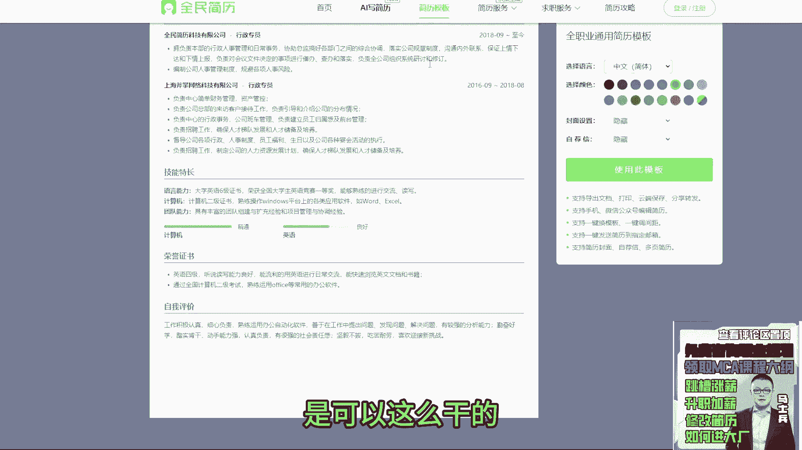

# 程序员简历指导！专治找不到工作，马士兵教育连鹏举老师，手把手教你写简历！ - P2：2.【程序员简历指导】简历模版选择，项目经验该如何写？ - 计算机底层原理 - BV1ZnDsYAE7D

来看第二个肖易消息来了是吧，来萧逸扣个一来嗯，额先说我先听好消息，为什么要等你来再跟你聊这个东西，咱别的东西你的内容写成什么样子，咱都不聊，不说内容的事，单看你简历里面的排版，文字的描述。

行间距这些东西，你觉得hr会让你去面试吗，你看下你这个字体啊，从上面这该对齐的，没对齐，我不知道是不是因为我这个打开软件的问题啊，还是你删格式的问题导致没对齐，这个不说了，第二个这块字体大小是这样的。

下面到项目，这之后是这样的，然后你的项目呢也没有做一个详细的描述，比如说你这个mom标准化产品研发是干嘛的，它到底有什么样的一个作用和价值，你负责的核心功能和对应的核心模块，到底是什么东西。

你到底做了什么样的技术功能实现，不知道第二个项目也是一样的，就是你看你这个行间距这块的行间距，段路之间距离和这块东西，就看到这个东西的时候，给人的感受是很难受的，我之前讲简历的时候也说过。

这个像这个对齐的问题，就你你你如果是你，如果是按照这样的方式去写的话，哪怕你的内容写的再好，我可能都不会让你面试，有说老师这我就刚那个宇光同学说，老师这是纯word打的吧。

对你可以是纯word手敲没问题，但是最基本的格式啊，行间距字大小这东西必须要一致，因为这个东西最基本展示的是什么，是你的态度问题，大家应该知道，在你面试之前，你还没有见过面试官，没有见过hr的情况下。

这个简历是你的门面，如果你简历的门面写成这个样子，别人大概对你的印象会相对于不是很好，那么他自然而然不会约你去做一些面试，所以你先把你简历东西调整好，就最起码版式内容我们可以在后面慢慢修改，慢慢润色。

没关系，最起码整体的格式你得给我保持统一，明白了吗，找个设计软件的简介修改一下，不需要你自己就套用一个简历模板就行了，现在网上有很多简历模板，你们随便拿出来一个就行。

比如说举个例子啊，就很多人一直问我老师，我们到底要什么样的简历模板，简历模板记住好看大方简约就可，没必要弄得花里胡哨，你就随便搜一个简历，我百度搜的直接搜个简历，啥也没搜，你打开这有一堆的简历模板。

随便点开一个就这样的模板都可以啊，它可以改颜色什么之类，你可以自己拿过来偷拿过来改啊。

没问题的，只要把内容做的填充就行了，像这样的模板都行，都没问题，是可以这么干的。

所以你要想办法去做这样的一个修改，最起码先把简历的样式先调整好，明白意思吧，这东西要注意啊，这是第一点，第二点记得描述，我刚刚在看的时候啊，看了一下你个人的从业经验啊，按照你下面展示的逻这个技术。

就这个逻辑技术这个工作经验来说，你是16年一六年参加工作的，到目前为止8年时间了，8年时间，你至少对标的职位应该是高开，至少是高开，那如果高开的话，你想想你下面写的这个技术站。

你能不能支撑得起你这8年的高开的经验，或者8年的开扎开发经验，肯定是不足以支撑的，因为最基本的技术宽度都没有，虽然你写了一些精通，但是基本的宽度没有，也就是说我们要先保证基本的技术宽度之后。

然后再去追求某些技术点的技术深度，所以这块你是要详细描述一下的，而且写这东西的时候尽量详细写一下，比如你这样写了精通常见垃圾回收算法，垃圾回收器和JVM调优，换一个描述方式。

比如说精通JVM对常用的对吧，垃圾回收算法，垃圾回收器，等都有深入研究，这是你的原原来意思对吧，并，参与过线上项目的JVM优化工作，你这样写出来，是比你原来刚开始写的东西要好一些。

而这个地方你加一个编号，稍微加一下嗯，怎么回事啊，加一个编号，他给人看起来感觉是会不一样的，他会，明白吗，它会有更显得更更整齐一些啊，就大家一定记住啊，你在写简历的时候，你要把你的身份转换成一个hr。

或者转换成一个面试官，你就想别人看到你的简历之后，别人想不想看，如果你自己看完自己的简历都不想看，那别人大概率看完你的简历之后也不想看，所以你得学会换位思考，你不能说哎我就稀里糊涂写，写完之后拉倒了。

剩下的事情交给面试官或交给hr，这种思维方式是有问题的，一定不能这么想哦，所以这块你需要做一些相对应的呃调整，这块一定要注意了，好吧嗯，来接着往下说，这是技能描述这块东西啊，下面是你的项目。

项目描述的时候呢，这个项目基本上都要重新改了啊，这个时间不重要，项目名称也不重要，重点是什么开发语言，数据库开发平台，这几样东西没用哇，你就想要技术实现技术实现，在写的时候把你项目中用到的所有的技术站。

所有的技术站好吧，都展示清楚，都展示清楚，而重点是我的工作改成职责描述啊，改职责描述这块写的时候一定要分条写多写，把你在当前项目里面涉及到的所有的业务，技术站，或者涉及到所有的业务点，一条一条逻辑清楚。

能解，能表达技术解决方案的，都要详细写，这块不写是不行的，就这块你要写个八九条，九条到十条没问题，尽可能多的去撑满你的技术描述，因为这个基础描述它很重要，它是能够吸引H2。

或者吸引面试官的一个很重要的点，如果说这个东西你写完之后，面试官看完一点感觉都没有，一点感受都没有，说明他对你的项目是没兴趣的，那你们在面试的时候可能涉及到一个问题，就是我没啥可聊的。

这个问题会显得很尴尬，所以在职责描述这块一定要详细去做描述好吧，这叫主要下面所有的项目都是一个道理，都是一个道理，OK一般同学说有一个小问题，就是这个简历写的如此详细的情况下，万一对吧。

就是上面写的是精通，然后他追着这个问题死问怎么办，问就问呗，就大家一定要记住啊，之前我们在聊这个，就是之前我在讲简历的时候啊，就针对于这个精通和熟悉这个东西，跟同学们辩论了无数次。

很多同学一直有一个认知，说老师如果我写了精通了，面试官如果一直揪着这个点往下问我，我该怎么办，问就问呗，你要记住一件事，你现在当下这个阶段最主要的事情是什么，是先要获取到面试机会。

当你获取到面试机会之后，下一步才是考虑说我在面试过程中，能不能通过面试官的考核，能不能过这次面试，你要把那灯分为两步走，明白吗，你不能说你现在面试计划还没有呢，你就想着哎呀，万一我到公司干不了活咋办呀。

万一面试官分，万一公司分给我的任务解决不了怎么办啊，不要想这个东西一步一步来好吧，况且就算你写了精通，面试官真的把你问到死，你真的答不上来又能怎么样，你最差的结果是什么，是你这次面试通过不了。

你面试通过不了，你最起码面试了，对不对，那这样的话，最起码你获取了一次成功的面试经验，而如果你不这么去写的话，有可能你连面试机会都没有，你连面试经验的积累都没有，而且就算面试官吊打你了对吧，嘲讽你了。

最起码你知道了哦，原来我对于这个技术点还有很多的技术短板，需要我自己去做技术的补充，最起码能整出来这这件事情吧，明白这意思吗，所以不要怕写精通，况且你怎么就一定认为面试官的技术战，就一定比你强呢。

你是通过什么来判断出来，面试你的人就比你技术很牛逼，你通过什么意义来判断出来的，现在有很多面试官，我告诉大家，水的不得了，明白吗，别看他们考你的时候问的问题很高大上，你反问他解决方案的时候。

很多人都答不上来，你信吗，所以别怕明白吗，别怕好吧，你先干了再说，如果你总是自己吓唬自己，别面试了，趁早回家养老去，明白吗，所以这事儿我希望每个同学能够想明白，把你的逻辑思路想清楚啊，咱们干这个行业的。

不管你其实你不管是找工作也好，什么也好，你你别你别老想你，别老想着说我，我搞搞不定，之前写过精通设计模式，让面试高得多少，K调查你了，这对不对，你是不是意识到你对于设计模式这个模块。

或者这个这个技术点有自己技术点的欠缺，你回来之后，有没有把设计模式这东西重点补充一下，有没有想过如何来应用我们的设计模式，并且并且好吧，能够顺利的去呃，把面试官给挥过去，有没有想过这事有没有做过总结。

只要你有这样总结，那意味着你这场面试就有收获的，有收获就好好吧，欧阳巧说，我现在是面试官，学一下，如果申请你出去好比欧阳巧，你出去这个课不适合你好吧，咱是帮同学们解决问题的，你过来好吗。

我怎么我学一下怎么筛选简历，你后面一看到这个简历之后，完了都是连老师讲的，后面万一遇到我讲了这个格式之后对吧，你看到是这样格式的同学就知道是咱们对吧，认识的朋友对吧，一起听过课，所以呢稍微放松点。

要要求好吧，好了，不多说啊对嘛，一顿恶补嘛，那补上来之后，技术占全面不就OK了嘛，对不对，好了，接着往下聊，但项目他项项目说完了啊，然后下面这块这个四级认证，还有这个这个东西想写写不想写拉倒呃。

坦白说我觉得意义价值并不大好吧，然后自我评价这个自我评价写的跟没写一样，为什么说写的跟没写一样，良好的人生态度和价值观，肯吃苦，时间换价值设计模式，有毒的建造，然后呢良好的沟通学习，团队协作能力。

这玩意写的跟没写啥有啥区别，你告诉我在面试中，我怎么感受到你的人生态度和价值观，我怎么感受到你肯吃苦，没毛用，明白吗，就这块写的是什么行业杯，行业背景和技术经验。

一定要突出跟开发技能相关的一些很重要的点，怎么写，一会给大家讲好吧，WX2L说有点怂，有点怂的原因是什么，咱们有很多同学在现在的面试过程中，我最就是听到最频繁的一句话是什么，老师我好虚。

来觉得自己面试虚的同学给老师扣一，有人面试虚吗，对吧，甚至有很多同学他比如我们的VIP，还经常干一件事，每次面试前我反问一下老师，你觉得你看下这个公司的最低要求，你觉得我能过吗。

这玩意儿不是说我说你能过你就能过，我说你不能过，你就不能过，不是这样的，明白吗，更重要的点是什么东西，你自己的技术沉淀和你自己的技术储备，他会给到你自信，而不是我能给你自信，当然我去你在找我问的时候。

我一定告诉你，哎，凭你学的这些课，凭你做技术储备，你通过这个面试很简单，三八随啊对吧，很简单，但是还是那句话，我说了，你最多吃个定心丸，本质上还在于你自己本身底气的支撑，这个很重要。

所以你要把这事想明白好吧，平时八股背的一套一套的，面试说不出来，这说明你平时只是背了，并没有自己做一些总结和阐述，你没办法按照自己学学到的东西，把他有条理有逻辑性的展示出来，这个很重要，就一定要记住啊。

现在单纯靠背是蒙不过去面试官的，明白吗，还有八股，八股问的频率少了，不但不代表没有八股好吧，现在不是面试场景的八股转化过来的，没实习经验怎么办，编嘛有很多同学都是培训出来的，难道他没工作经验。

他就不活了，编码你只要真实的做过一个项目，能把各种的业务逻辑关系，业务流程说清楚，并且把对应的技术解决方案能先说清楚就OK了，你不要考虑一件事啊，咱们有很多同学，特别是没有工作经验的同学。

面试的时候经常会犯一个问题，什么问题呢，他自己知道我没有面试经验，我是编的，所以在面试的时候经常会遇到一个问题，就是面试官根据你的表述，一旦提出了一个质疑，提出了一个疑问，完了完了完了完了。

面试完之后发现我是假的呀，我的妈呀，我慌得不得了，完了完了完了，不要一种心态，面试官根据你的表述提出质疑，是一个很正常的事情，他就是干这事的，他提出质疑，你只要坚定你所说的就完事了，明白吗。

你记住一件事，一个项目你真实做过，你都不一定能够把项目中的每，一个细节都了解得很清楚，凭什么，你觉得面试官单纯看完你的项目的简历描述呃，简历里面项目描述看完，你听完你自己的语言表达之后。

他就会对这个项目的流程做到百分之百的熟悉，百分之百熟练，他做不到，他最多就是根据你的描述，根据他的经验储备来反思，有没有可能出这问题，仅此而已，而且他提出的质疑有可能是对的，有可能是错的。

正常去交流回复就OK了，别怂，你们老是怕这个，老是怕那个，你这么怕下去，别别聊了，明白了吗，好吧嘶你们这个题这个问题有点多啊，呃一个人间半个酬薪资怎么谈，华为开奖了，是是到hr面了是吗。

半个筹人间半个仇你，你你是华为开奖了吗，是中奖了吗，他上次还在发华为啥时候问我，啥时候华为开奖啊，那个刘炳说不问八股问啥了，感觉都是那额，其实问的东西啊，还是那么多，技术宽度没有太多的变化。

更多是技术深度好吧，尤其在实际工作中没有用到过的，但面试必须像这种问题时，我们应该从哪方面补，要自己去思考，要想你所学到的所有技术，在什么样的场景里面会进行应用，然后如果让你去用的话。

你应该从哪些方方面去进行描述，这东西你只有平常自己做准备才行好吧，好高并发这边没有自由升级，自由化对，还没开，但是有其他的，那就这样吧，现在如果说你呃看你面的什么公司啊。

这个你你可以找咨询老师详细了解一下啊，详细了解一下就一定记住啊，如果你找的是实习的话，大概的薪资范围是100~400每天啊，如果你找正式岗的话，看你公司的规模和它对应的薪水区间，是什么样子的好吧。

现在面试，现在面试吗，呃看公司吧，有的公司接受，有的公司不接受，这个要看实际情况，好吧好了，我们接下来改简历啊。

这个消息我就说这么多好吧。