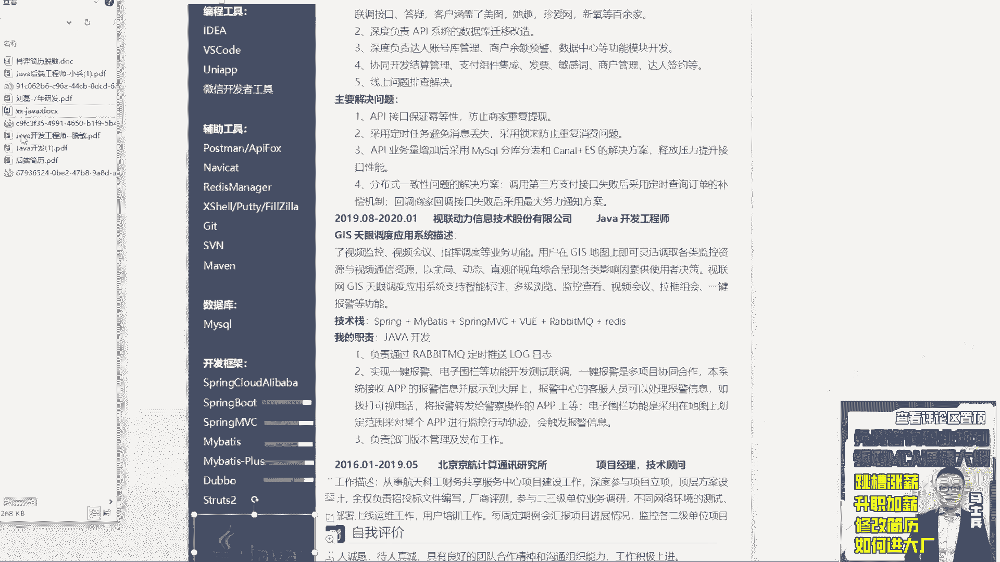
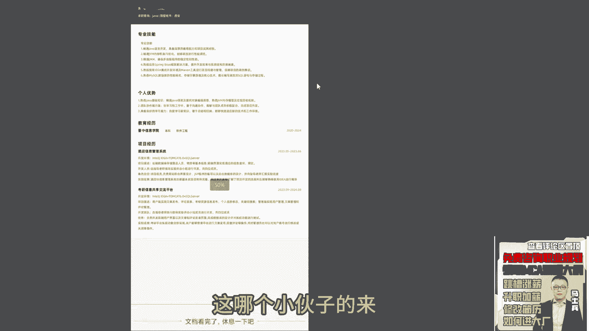
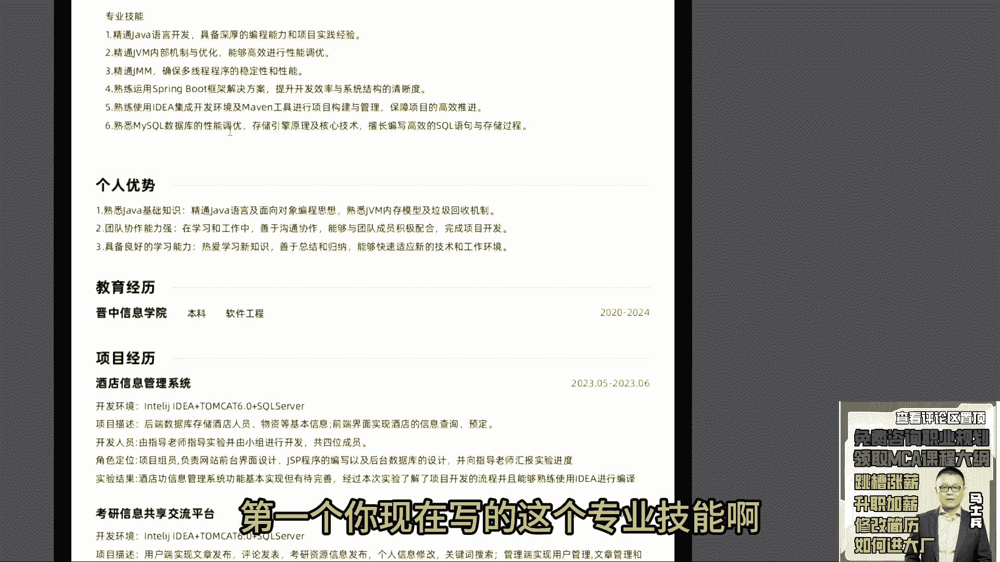
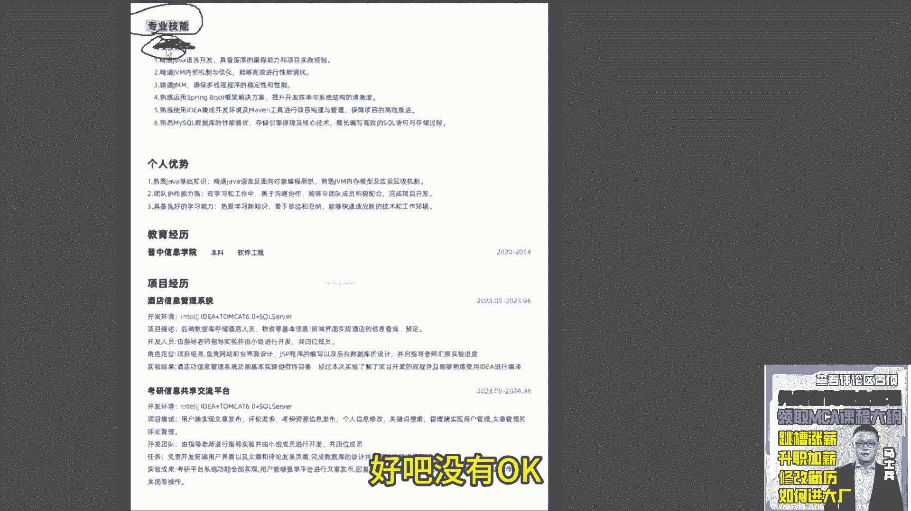
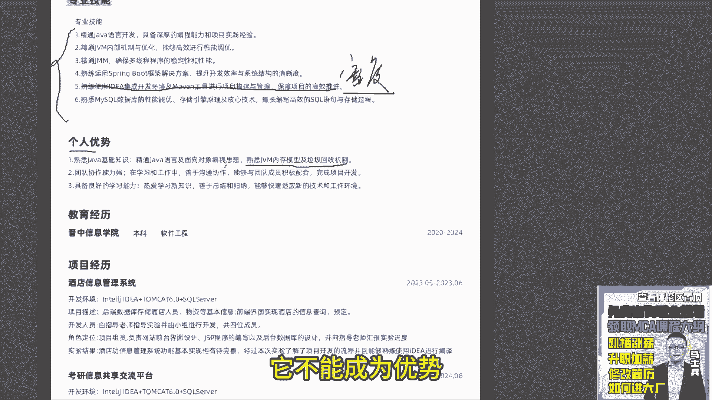
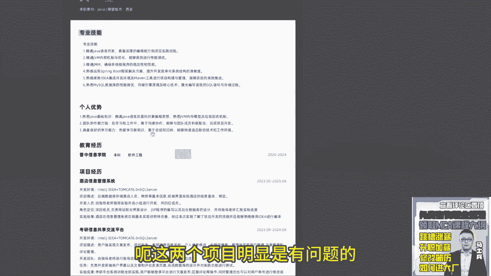
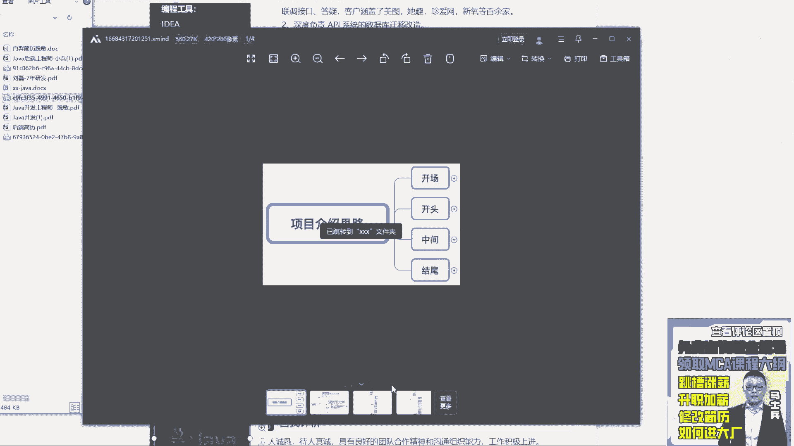
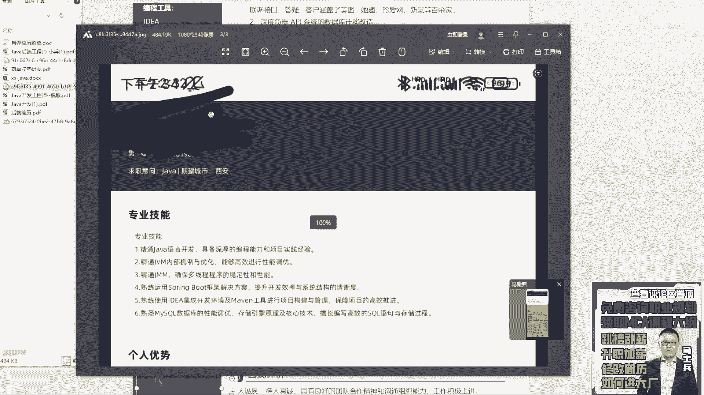
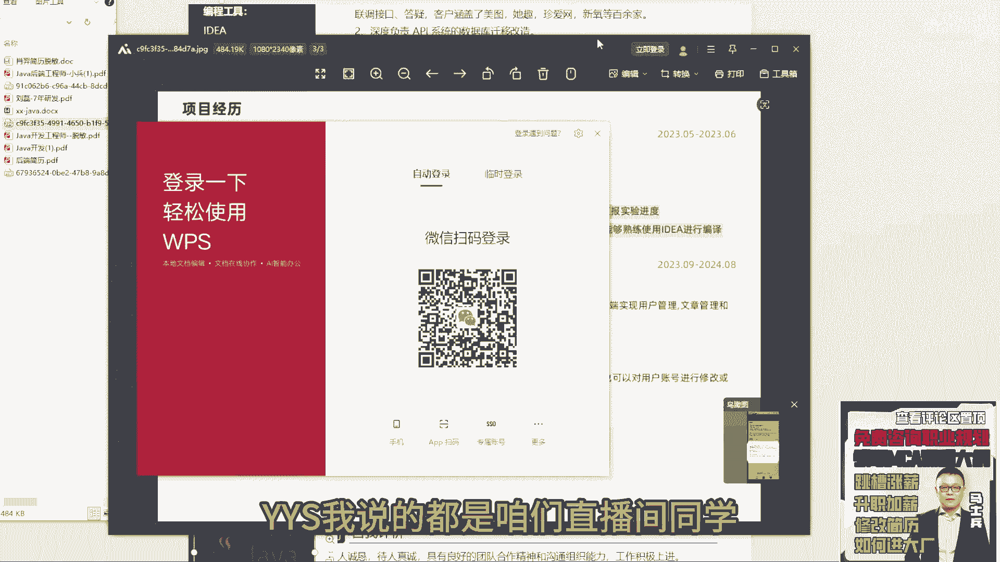
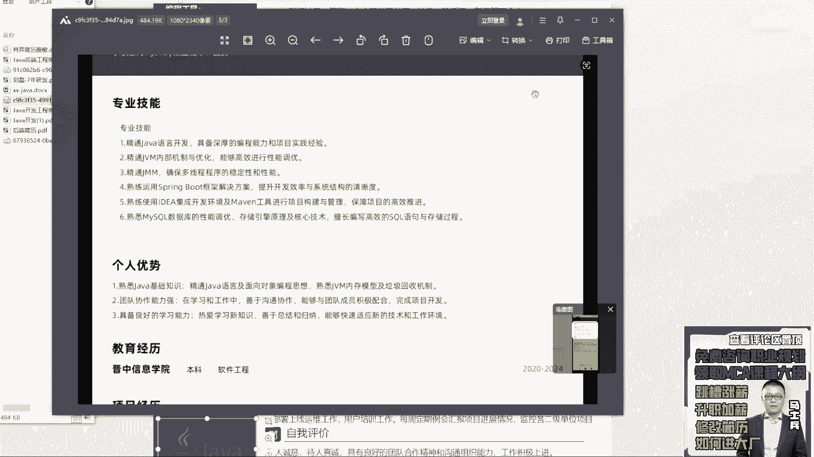

# 程序员简历指导！专治找不到工作，马士兵教育连鹏举老师，手把手教你写简历！ - P6：6.【程序员简历指导】本科今年刚毕业，简历指导 - 计算机底层原理 - BV1ZnDsYAE7D

来下一个咳咳，这哪个小伙子的，还在的话。

扣个一来，今年刚毕业的赛马的同学，哎这谁的OYS是吧，来宝贝听好了，同学听好了呃，先说第一个，你是今年毕业的，我不知道你现在有工作，经有找到工作了没有，呃，如果有工作呃，不要现在先不要想着换工作好吧。

呃因为你你有工作吗，OYS现在工作没没有是吧，是在找工作吗，还是什么状态说一下嗯，不说不说算了，那个没有是吧，没有的话，就我就说一下啊，呃第一个你现在写的这个专业技能啊。

这上面有个专，就是看就你这啊有个专业技能了，又来个专业技能重复了，删掉好吧没用。

OK第二个就是你的技能描述宽度是不够的，就以你现在的技术站，这六条写的这个技术站来说，你的宽度是不够的，你是不足以支撑现在找工作的，最起码最简单的微服务的东西你是没有的。

现在微服务啊它不是一个加分技能项，它是一个必备技能点，任何同学在进行找工作的时候，进行找工作的时候，微服务都是必写的，所以你的技术短板就短板有问题，所以这块基础你要好好补一下哦，要补充什么东西。

比如最开始的java基java基础东西，要描述JVM的并发编程的MYSQL，REDIS对吧，然后MQ的微服务的分布式的，最起码这几个基本东西你得把它补全啊，你现在写东西还是过于简单啊。

这五条里面第五条是没用，这六条里面第五条是没用的，你这属于开发工具，任何一个开发人人员而言，工具这是必备技能项，它不是一个技能点啊，所以这东西是没用的，所以你得补你的技术宽度好吧，第二个个人优势。

你这写了熟悉JVM垃圾回收机制，这东西不能叫优势，什么叫优势，优势表示说你具备而别人不具备的能力叫优势，但是你现在罗列的东西它不能称之为优势好。

所以这要注意了，OK然后再说你下面的项目吧，呃这两个项目明显是有问题的啊。

有啥问题呢，嗯嗯哎不能拖吗，能拖，我先说一下这两个项目嗯。

哎什么情况，等一下啊。

文帅有什么问题啊，这个酒店信息管理系统和这个考研信息共享，交流平台，咳咳直观扫上去，这不是一个真实的企业开发环境里面的项目，这东西啊最多能够称之为，最多能够称之为你在大学里面所做的，一些课题研究。

所以它并不代表你具备真实的，并不代表具备真实的行业经验，和你具体的开发能力，明白吗，所以这两个项目写是不行的，如果你要写项目，最好找一些现在比较火的，一些互联网平台的项目去写一下。

可以去github com里面多多找一下，这两个项目写完之后，一点意义和价值都没有，听明白了吗，我不是打击你啊，YYS我说的都是咱们直播间同学。

很多同学啊，你们能听到我说的都是实话，就是以你现在这样的一个简历的水平，去找工作的话，基本上是没有面试的，还是那句话，我作为一个企业，不管你什么时候毕业，我评判的标准很简单。

你到公司之后能不能给我创造价值，能不能给我带来营收，但是从你的描述来描述内容来看，我看不到这个东西，所以我觉得啊如果你想进入这行业，你得好好学一下了，第一补充技术的宽度，第二补充技术的深度。

第三踏踏实实的找两个项目去写一下，这两个项目在写的时候，第一个可以写一个单体项目，除了这一个单体项目之外，你最少要写一个微服务的项目，有两个项目去做支撑，因为你只有有了这几个项目之后，你才能够好吧。

有面试机会，咱先不说你面试过，不过最起码说你有了面试机会，但如果按照像你现在这样写的方式的话，你百分之百是没有面试机会的，明白了吧，所以这事我希望能想明白，我不是为了打击你，而是给你真实的指路。

真实的指路好吧嗯所以你自己来评估啊，自己来评估这个这个大大家直播间同学认可吧，我说的没问题啊，不是我是你你你你不要抵触去，你不要觉得说你老师你是一个培训机构老师，你在故意打击我，让我报名学习。

跟这没关系，就是这个东西真的很难好吧，我不不多说了啊，都说你们就开始说引导你买课啊什么之类的，这就是实际情况，就是你看像刚刚展示几个同学的简历，他们那些同学写成那样都不一定有面试机会。

你写成这样肯定是没有面试机会的，所以你要想明白一件事，就第一你没有经验，第二你的技术储备有问题，那公司招你是干嘛的，所以你要想办法去弥补你这方面的劣势，找到自己的痛点，然后去补充，补充完了之后再找工作。

这样更合适一些，好吧嗯行了。

