# 程序员简历指导！专治找不到工作，马士兵教育连鹏举老师，手把手教你写简历！ - P7：7.【程序员简历指导】合肥已婚6年工作经验 - 计算机底层原理 - BV1ZnDsYAE7D

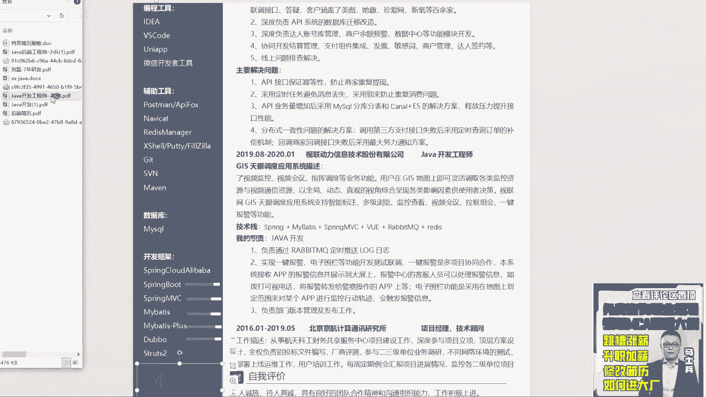

呃六时代变了，哈哈哈是呃实在不变就麻烦了好吧，时代变才是才是对的，其实现在啊我说一个大言不惭的话啊，现在这个行业很难，对不对，大家都在骂市场，骂环境，骂骂行情，呃，我我我我坦白说一句话。

我觉得这个现在这个状态其实是一个好的状态，呃为什么他在让这个行业洗牌，淘汰掉很多人，呃慢慢这个行业会处于回归到正轨里面，前几年的时候这个行业不太正常，好吧，不多说了，来一方东西，说6年了，十多项目。

多写点，主要展示给详解一个简单解解，有啊这边老师会专门去改简历的啊，不知道怎么写，一会教你怎么写啊，一会讲完这些简历之后，我会给大家讲怎么写怎么写简历好吧，来看这同学这同在吗，在的话来扣一来嗯。

MR王哎，呃首先第一点啊，同学听好了呃，先把简历模板换了，呃，我个人啊，我不知道大家大家什么感受啊，我个人是非常排斥这种带框框的简历模板的，因为我看到这些简历模板的时候，我感觉很很难受。

所以我建议啊你第一件事，无论内容怎么样，先把你的简历模板给换了，不要不要去那个什么，就是用这种带框框的，这第一个第二个唉。

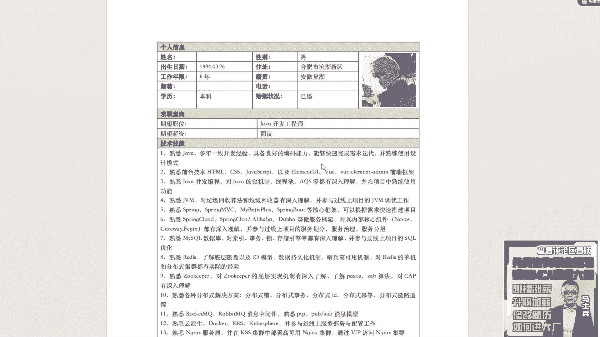

这玩意你你看过我之前讲的写的讲的简历课吗，这个第二条往下放好吧，前端东西不是你找后端工作的重重点技能，往后扔，往后扔，你你这个基本上看过我讲的，你之前一定看过我讲简历课啊。

因为你这写东西基本上跟我给我讲课，讲的东西一样。

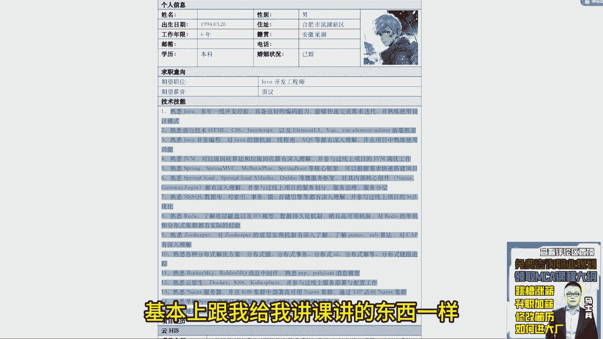

好吧哼呃需要前端也往后放，需要前端也往后放，就重点先突出你后端的技能，然后可以再加上前端的技能。

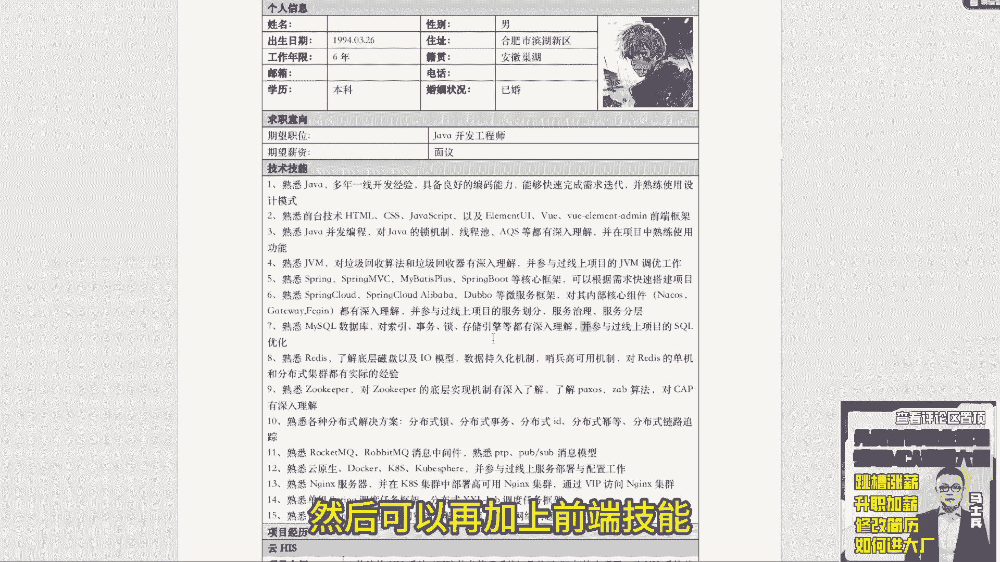

这没问题的，好吧嗯，第二个来看一下项目啊。

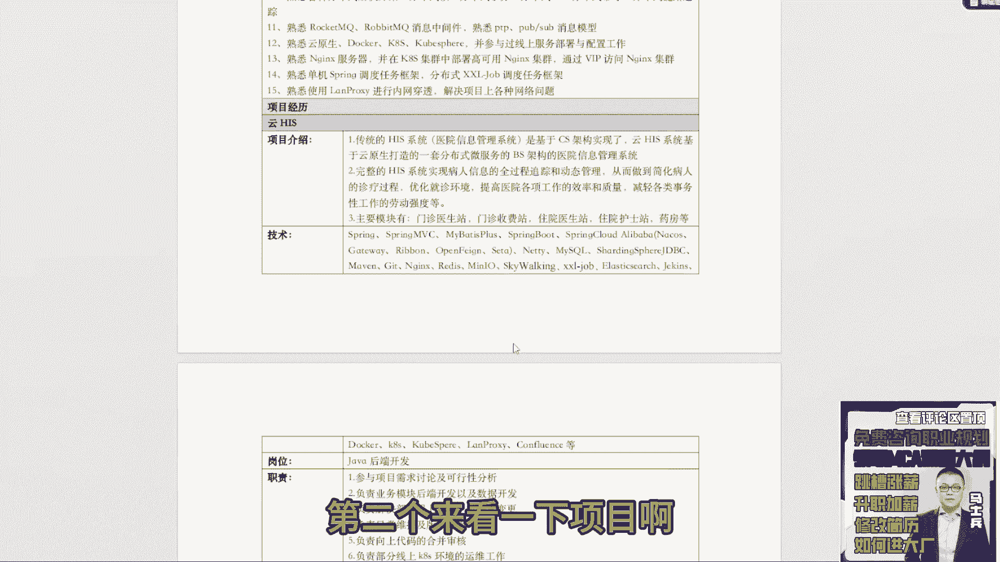

云hit，然后传统的hits系统完整的什么东西，主要模块你看这项目介绍，你就没就是项目项项，项目介绍这块，你就没没没没没好好听我讲的东西啊，项目介绍这块还是那句话，不要分点写，这个没必要。

你就写个三四行文字就行了，重点告诉别人干嘛的，就是这东西它是解决什么问题，所以像你写的东西，明显是相当于做了一套重构嘛对吧，原来是基于cs架构实现的，现在基于BBS架构，就是你可以把原来的呃。

比如说单体项目改成微服务架构的，这都没问题，就是你可以把你的项目改成一个重构的项目，然后这个重构项目重点实现了什么业务点，做了哪方面的重构，这东西是可以重点描述的好吧。

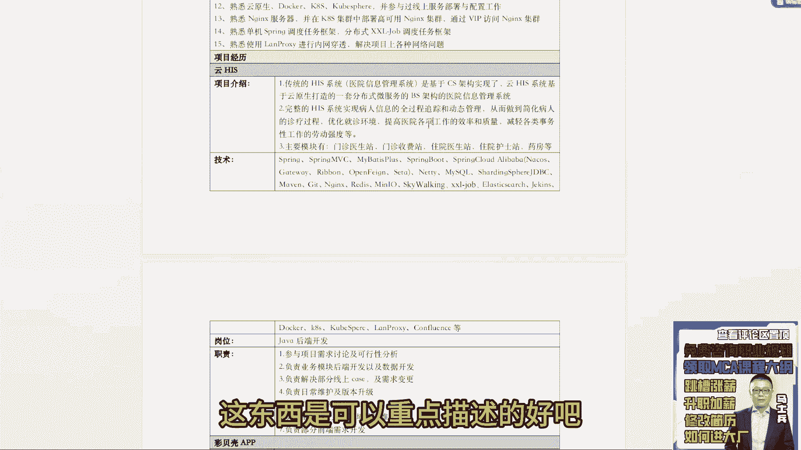

然后职责这块写就很虚了，比如说第一个需求分析可行性，然后呢负责后端开发以及数据开发，然后需求变更升级，然后呢代码合并，这个单是向上的合并审核，然后运维的工作，然后前端的需求开发，你告诉我。

当我看到这样描述的时候，我能问你啥，就如果你是个面试官，你看到这样的描述之后，你会问什么，你能挖掘到什么点去提问，有吗，如果你是面试官，你会提问什么东西，我看完之后，说实话我没啥可问的。

因为它没有业务点，没有解决方案，明白吗，就没有让我感兴趣的东西，你感兴趣吗，与光同尘，你感兴趣吗，养牛人你感兴趣吗，能懂我意思吧，所以大家需要做的事情是。

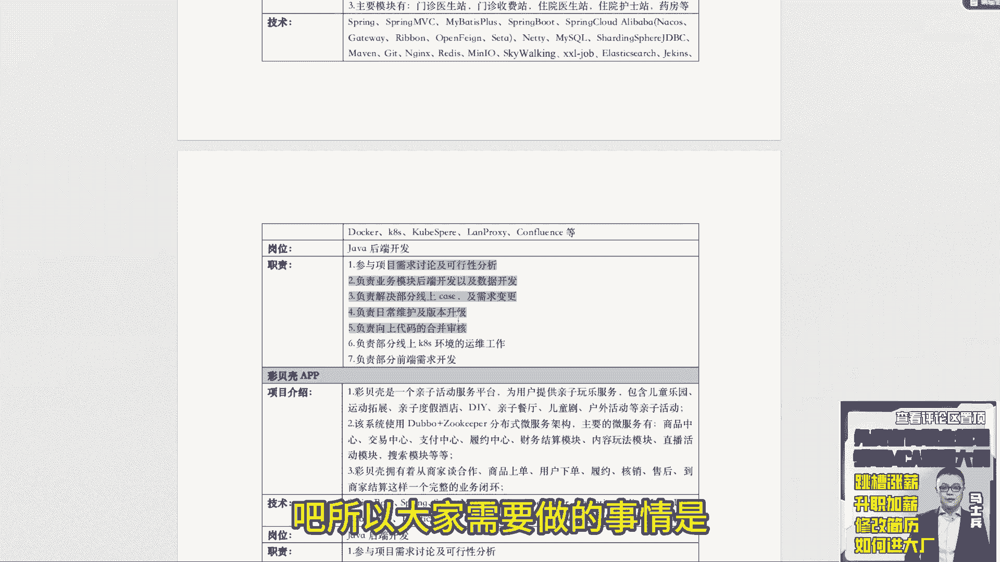

先把这个东西一定要好好写好吧，这个东西是有问题的，OK这是第一个，然后下面这个彩贝壳啊，亲子服务平台，嘿嘿怎么怎么做维护的，这没意义好吧，没野啊，然后下面你下面已经做了技术站的描述了。

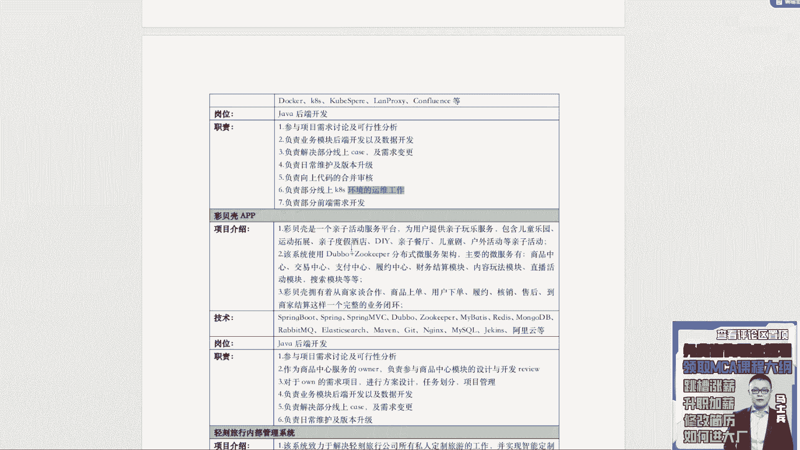

这块就不要写，使用double加足黑本分布式微服务架构什么之类的。

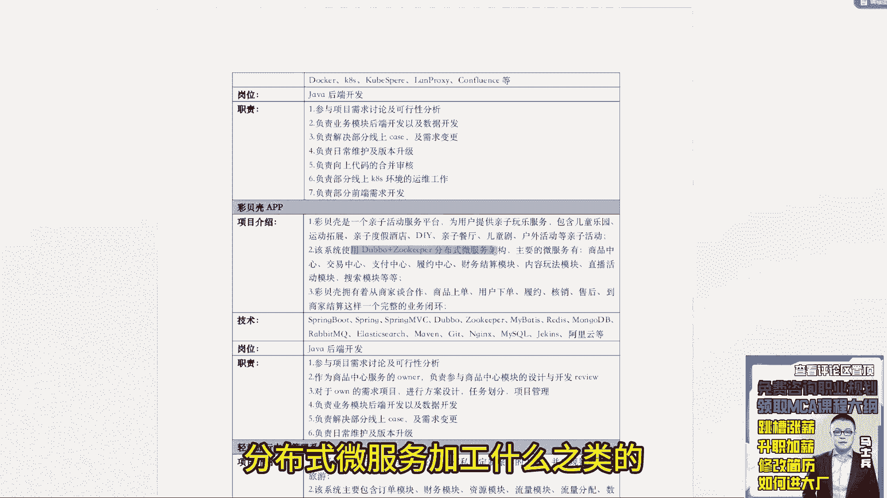

这就没必要写了，好吧嗯，一个道理，你这个项目职责基本上都都有问题好吧。

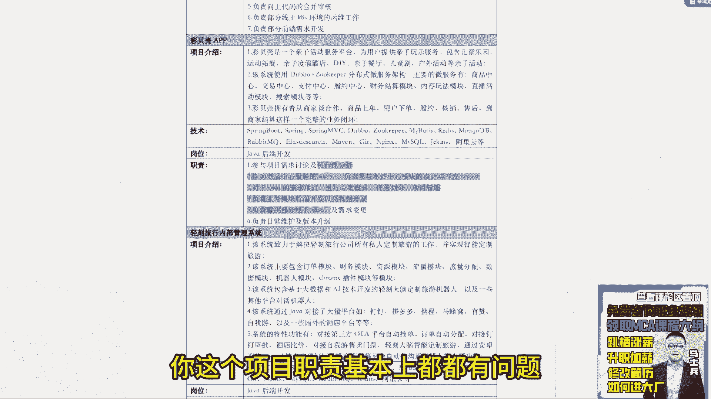

项目介绍，项目职责。

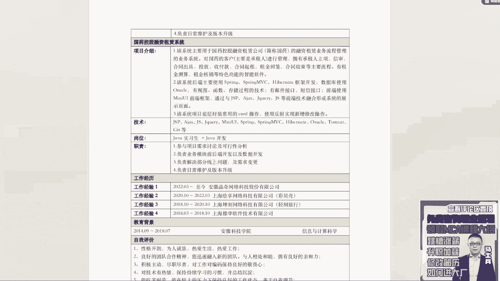

其实你这几个项目啊有很多点是可以聊的，但是你写的东西没得聊了。

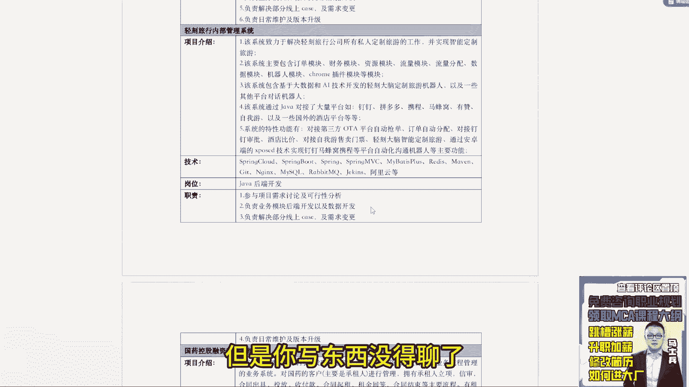

有人会一直好奇说老师我我写了这么多，我到底写什么东西，一会我给你举例子好吧，一会我给你举例子。

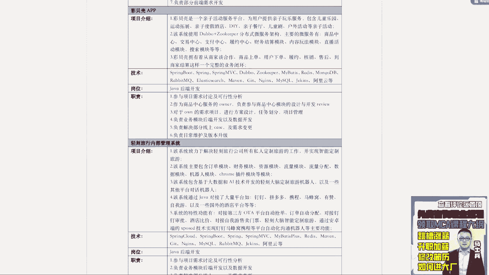

这个业务职责这块到底要怎么去写，一会给你举例子好吧，就是你这个项目职责这块一定要好好改好吧。

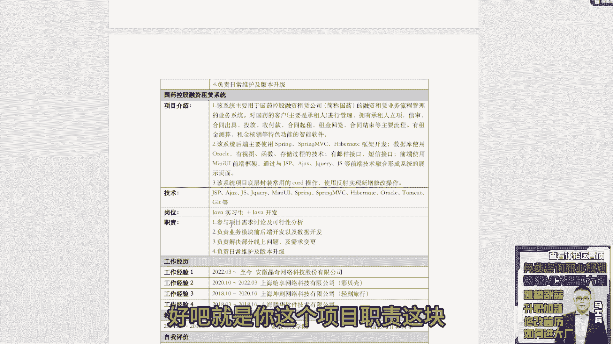

王同学miss，王一定要改好吧，你这个这个这个不行呃。

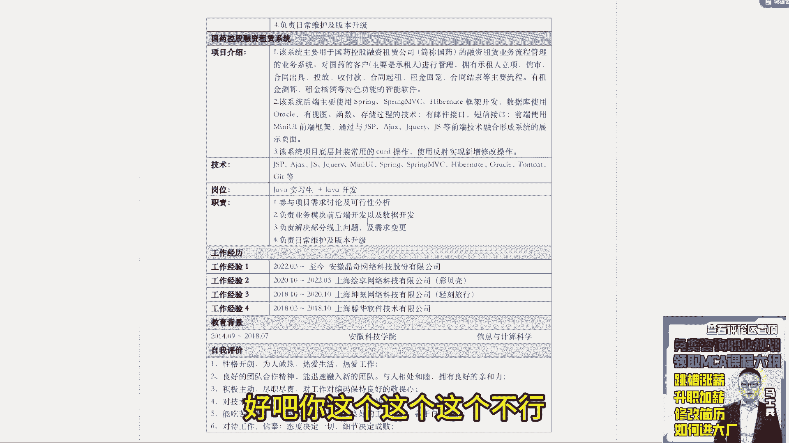

自我评价没用好吧，这个写的太太太太虚了，别的就没啥了。

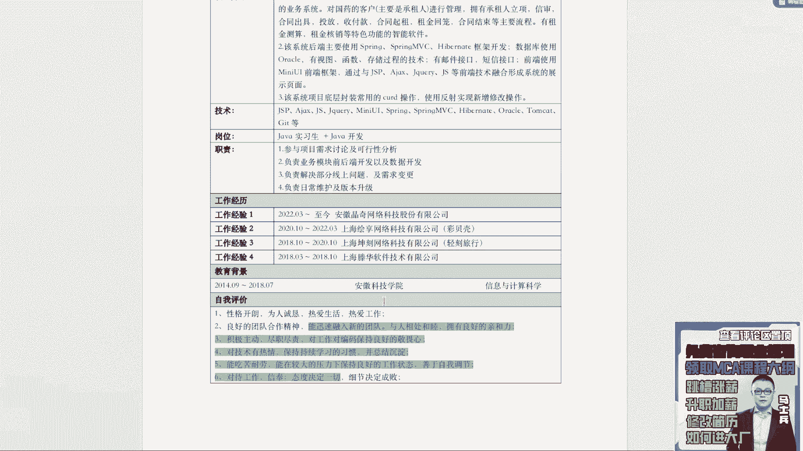

星际星际专业信息与计算科学没问题。

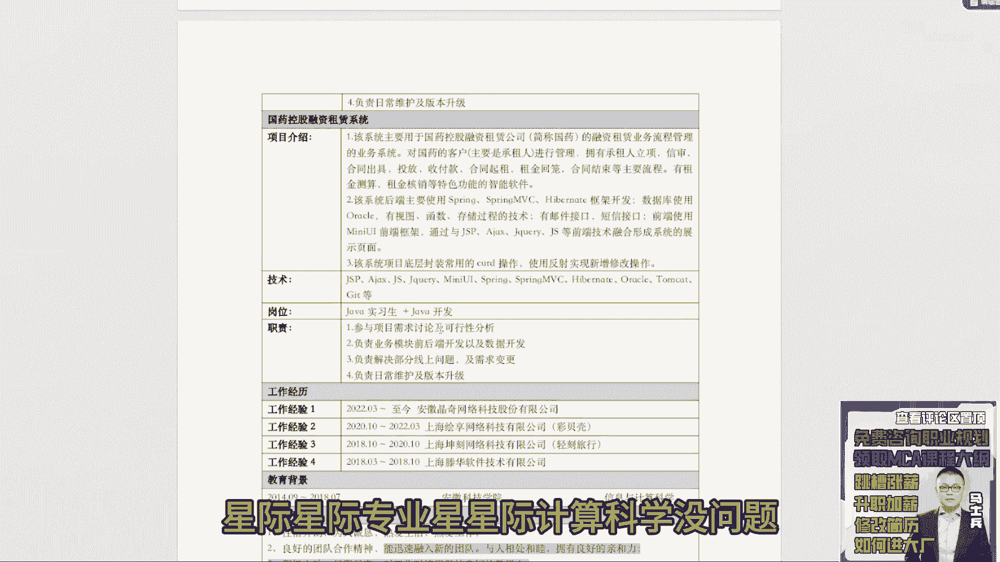

那你这个描述要是主重点项目改了改项目了。