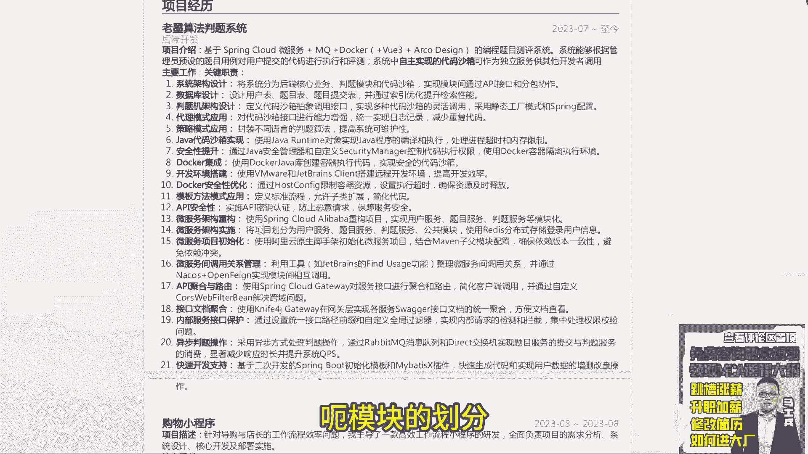
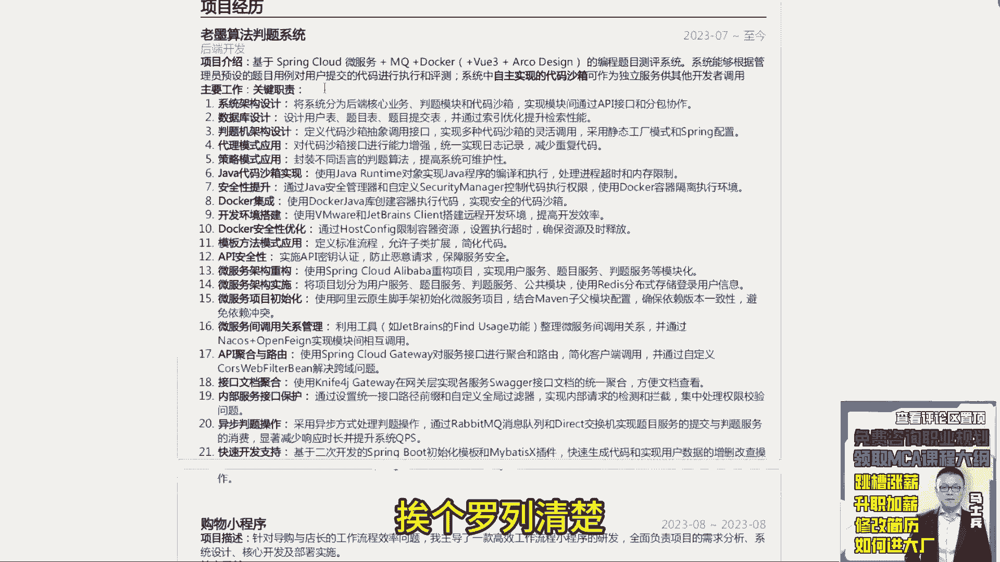

# 程序员简历指导！专治找不到工作，马士兵教育连鹏举老师，手把手教你写简历！ - P9：9.【程序员简历指导】大学在读，明年毕业 - 计算机底层原理 - BV1ZnDsYAE7D

来下一个啊，今天在吗，明年毕业大学生嗯，小莫呃，双非大学呃。

还是那句话，这个这个不不要好吧，课程不要呃，java基础SSM，然后MYSQL，然后设计模式robm q spring cloud呃，基本的技术宽度应该有了REDIS有吗，没看到REDIS啊。

REDIS要加一下，然后分布式的解决方案要加一下，就是你你这个东西写的时候啊，像你上面上面这个点呃，熟悉sm spring boot开发框架。

然后能使用mybatis plus和MYBATIS叉自动生成代码，这个属于基本的一个怎么说业务操作吧，他不应不应该算成一个技能点，这个这个这样写不太好不太好好吧，包括下面的这个分布式登录。

然后操作异步化API接口服务设计，他都不俗，他都不属于专业的技能点上面的描述，所以这个描述方式要稍微改改。

就这个嗯，老墨算法判题系统。

听好同学，小莫叫你小莫啊，你这写老墨，老墨就老墨吧，老墨听好了，第一个项目介绍，不要写基于这种基因的描述，你在嗯你在你在学校里面写毕设的时候，或完成课题研究的时候，你写是基于spring boot的。

什么什么开发，基于什么spring cloud什么的开发可以这么写，但生产环境里面项目没人这么干，没什么干，就如果你要写项目，你要想办法把当前这个项目变成一个企业，真实在实战的一个项目，明白吗。

比如说像这个地方，你写了一个判题系统，其实现在判定系统，它是一个企业的生产环境里面项目，因为我媳妇是数学老师嘛，像他们学校的学生考完试之后，他经常在手机里面去进行批阅改卷子，这是很正常的一个操作。

那所以你是可以把这个操作，变成一个真实的企业开发环境里面项目，不要叫老墨算法，什么判定系统，就改成一个正儿八经的判定系统啊，做哪个在哪个公司里面做开发实践的，没问题的，比如作业帮啊，还有一个什么软。

那个软件叫什么，看手机有没有啊，啧哦我手机上没有了，就他之前有一个专门的呃，它不算不算离D扣的，就专门的判题系统，就它里面可以直接给分对吧，然后可以直接去统计分数，就相当于把卷子扫描上去之后。

它会有直接卷子的样子，然后你直接判题，类似这样的东西，所以他是一个真实的企业级的一个项目背景，那你在描述的时候，就要把它把它改成一个企业级的一个东西，而不是说你自己自研的啊，这东西没有什么实际的价值。

把它套一个壳，换一个背景来进行一个描述，明白了吧，然后在写这个关键职责的时候呃，写得过于多了过于多了啊，你从里面挖掘几个，或者找几个相对于比较不错的点，或者说有能聊的点去把它展示出来。

比如第一个你说系统架构设计呃，这块你对于作为一个大学生而言，可能暂时还涉及不到架构师设计，那这块的话，像第一个用到设计模式的东西可以聊，第二个通过数据库的优化东西可以去聊，第三个这个沙箱设计。

这个可以聊，第四个安全性是这个呃，这个security manager来进行控制权限，这个是没问题的，然后下面还有什么呃模块的划分。

这个是可以聊的，还有服务调用之间也是可以聊的对吧。

包括像那个路由，路由路那个网，网关的一些设计也是可以聊的对吧，异步操作也是可以聊的，所以这里面你可以从里面挖掘8~9个，9~10个，这样业务点写出来。

没必要按照每个地点都这么写，都这么写啊，所以这个地方要稍微精简一下，精简一下，OK这是第一个，第二个，这个就更那个啥了，就是以你的检验来说啊。

第一项目留着套一个壳，这是第一点，第二点再准备一个单体的项目写进去。

基本上够使了，基本上够使了，那么你在面试过程中重点聊了，也是当前这样一个判定系统，所以这东西你要好好去改改，好好去润色一下好吧。

写的时候第一个项目描述，第二个技术架构，把当前项目中涉及到的所有技术组件，挨个罗列清楚。

改一下当前文件的一个格式好吧，下面荣誉呃，建模参与奖，蓝桥杯呃，这个大学生在写这个奖项的时候啊，呃市级别以上的可以写，市级别以下的就不要写了，没意义好吧，十几倍以上的可以写，十几倍以下的就不要写了。

V1好吧，就这个呃实习经历没问题，这个这个不写了好吧，呃第一个实习经历可以把他这个时间延长一点，标识也只实习两个月，你可以把你大你25年毕业嘛，24年属于大三嘛，大三期间到现在为止，一直在学校实习。

可以把这东西时间延长，不要说只实习两个月，并不是说我一定只有暑假或者寒假，才能进行实习对吧，学校里面没课了，学校鼓励你出去实习的时候，你就都可以实习，明白意思吧，所以这时间要延长一点。

把这个时间延长完了之后呢。

把你的项目好好填充进去，这样是OK的啊，最起码从你的额项目来说，有很多业务点，你在你的技能描述里面并没有突出出来，所以这这块要好好改改，OK有啥技术能刷新简历吗，他想提升下学习的含金量。

呃作为在职的同学而言。

没有什么特别含金量高的证书，好吧，呃在校生的话就是你参加了算法大赛啦，呃建模大赛啦，像这样的东西是可以写可以写的好吧嗯行额。

其实你这个作为一个本科生来说啊，能写成这样挺好的挺好哇。

