# 系列 1：P11：马士兵深入浅出java虚拟机①GC垃圾回收预习_GC入门 - 马士兵官方号 - BV1mu411r78p

好了今天呢我们讲garbage collector和gc tune的前置内容，所谓的前置就是我后面正式开课的时候，我一般就不会再讲这些比较比较简单，比较基础的内容了啊。

在我们的vip课程里头可能就会直接讲非常非常给力的干货的内容，就不再讲这个非常基础的内容了，好看这里整个的这个内容的量应该说是比较大啊，我先给大家介绍一下整体的课程的内容。

这个整体课程内容你了解了之后呢，虚拟机的基础的概念，还有呢class文件结构啊，内存加载的过程，运行时的内存结构，什么垃圾垃圾怎么产生回收算法对应的逻辑结构对象分配垃圾回收器。

呃然后重点呢是调优的一个实战，关于调优实战呢，这里面内容也会比较多，在这儿呢我就不一一的给大家念完了，嗯。

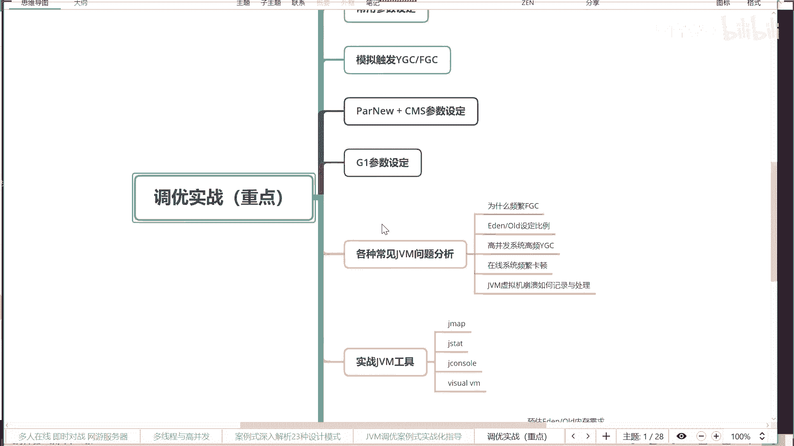

总而言之呢，听完今天的课，你至少能够大致理解到底什么是garbage collector啊。

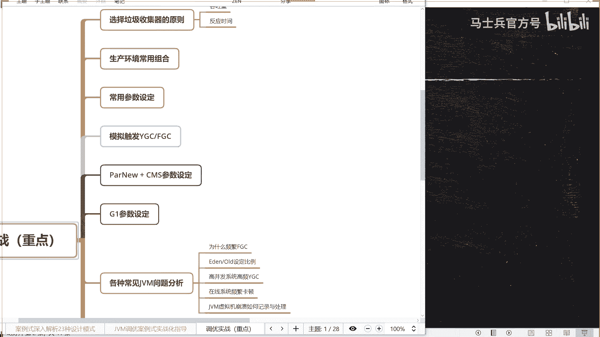

到底又是什么，一个入门级的内容，好了，我们开始一步一步来，首先我们聊呢到底什么是垃圾，到底什么是垃圾呢，关于这个问题，我要做一个简单解释，在如果你写过c和c加加的话。

那么在c和c加加里面需要手动回收内存的使用的，就是因为内存分配了一块区域之后，要手动进行回收，它还有多少同学是写过c和c加加c或者c加加的，有没有，有的同学是写过c或者c加加的。

那么写过c或者c加加的同学来，你能有一个反馈好吧，你来，嗯你比如说，你写过c或者c加加的同学，c语言里面申请内存是怎么申请的呀，呃memory allocation，对吧嗯没错好。

那释放这个内存呢free，对不对好，那c加加呢，六释放这个内存呢，delete好，我们聊到java，java申请内存，所谓的申请内存就是你做了一个指令之后呢，它会在在内存里面分配一块区域来给你用，是吧。

释放内存呢没有这样没有对应的释放内存的这块的问题，那好java是怎么释放内存的，java要自动回收，自动内存回收，那有同学会说呃，老师这个自动内存回收有什么好处吗，很简单，编程上简单，系统不容易出错。

为什么会系统不容易出错，为什么呀，y，因为如果你手动释放内存，会产生经常可能会产生的两类现象，容易出两种类型的错误，哪两种啊，同学们告诉我一下，第一种，忘了回收，第二种呢多次回收，好了。

那有同学可能会说老师这个忘记回收是什么意思，就是你用完了之后，你忘了忘了把它回收掉，你掉了new了，忘了掉，delete了，掉了memory allocation，忘了掉free了。

ok这个内存就是内存泄露，内存泄漏就多了，内存就整个溢出了，所以它会出现这种问题，那多次回收呢，多次回收就出的问题就更大了，多回周会出什么问题，你已经把这块内存给释放掉了，结果你不小心又释放了一次。

手工又delete一下，因为你这个delete呢在你写代码里头很可能会被封装在各种各样的if else switch，各种各样的条件语句里面，说不定就执行了两次，本来第一次呢你回收完了。

然后人家往里头装着自己有用的数据了，结果你第二次来了，光机又给人回收了一次，直接把人家数据给干掉了好了，这要多次回收，所以容易出这容易出这种问题，但是java里面是什么样的呢。

java里面是自动内存回收，自动内存回收就需要呃，这里面呢会有各种各样的这种机制来保证它自动内存回收的一个效率，可以这么说啊，呃java的这个调优呢，就jvm的这个调优。

主要就是集中在我们的垃圾回收机制的一个选择和参数设置上好了，那我们来聊呢，到底什么是，一个一个来聊啊，第一个呢我们先了解呢到底什么是垃圾，到底什么才是垃圾呢，在java里面很简单，如果有一个引用。

没有任何有一个对象啊，有呃没有任何的引用指向它了，好这个对象所占的内存就是垃圾，从这个图上来讲，我们在站空间里有一个变量new出来一个对象，这个对象里面有成员变量指向了另外一个对象。

那当我们比如说这个成员变量把它设为空，把它设成空值，now，直把这个成员变量的设置为空之后，就表示他不再指向任何引对象了哈，那这个对象就被我们称之为垃圾，当然这个呢呃只是一个一个对象的情况下啊。

这个对象就被称之为垃圾，那么还有一种情况是什么呢，还有一种情况是就是好多个对象啊，他互相之间的，有引用，互相之间有引用，但是呢没有任何的其他的引用指向这个循环的对象。

至少呢没有从我们的占空间里有任何引用，指向这三个循环引用的对象号，这叫做一堆垃圾，ok好了，所以这个就是呃垃圾的一个概念，就是没有任何应用指向的对象或者一堆对象，那好，明白了我们垃圾的概念之后呢。

下面我们来聊到底怎么样找到这个垃圾，我给大家呢做好笔记，到底什么是垃圾呢，好我们现在就可以下这个定义了啊，到底什么是垃圾呢，没有任何引用，指向的一个对象或者多个对象，这个多个对象之间呢是循环。

这些个就叫做垃圾，那怎么样才能定位这个垃圾啊，也就是说怎么才能找到这个垃圾啊，同学们两种算法啊，第一种算法呢叫reference count，引用计数，这个很容易理解，就是在我们这个对象上呢。

专门记录一个数字到底有多少个引用指向了它，比如说现在有三个引用指向这个对象，那肯定不是一个垃圾，好，这里就记住一个三，当我们有一个去掉一个应用之后，它就变一下去一个应用之后变一下去一个应用之后变一下。

什么时候变成零了，表示这个对象成为垃圾了，好这个呢叫做reference count，叫引用计数，两种方式，第一种引用技术，但是呢引用计数呢有个小小的问题，引用技术不能解决什么情况。

你比如说三个对象互相循环引用，但是没有任何其他的引用指向这里面的对象好，这个时候呢叫做三个垃圾，这三个垃圾每一个引用技术都是一，他也是一，他是一，他也是一，可是很不幸的是，你这一堆全是垃圾。

如果用引用计数的话，这种方式来找垃圾的话，这块就找不到了，就会发生什么呢，内存泄漏诶，所以，我们真真正正在hospital里面，就是在java虚拟机里面是采用什么样的方式来寻找垃圾呢。

是采用这样的方式叫做rude searching，叫更可达算法，或者叫嗯跟搜索算法说的都是一回事儿，那么这里到底是指的什么意思呢，就是我们首先通过程序找到一些跟对象，通过跟对象找到它相连接的一些对象。

这些不是垃圾，剩下那些全是垃圾，好这个是什么意思，我先给大家做好笔记，再给大家来解释，引用技术不能解决循环引用的问题，所以呢我们通常使用的叫做根可达算法，那那什么跟可达算法跟可达算法的意思是。

当我们一个程序运行起来以后，一个main方法运行起来，在main方法里面，我们说object o等于new object，那好那么你可以想象一下这个new object是在我们main方法里运行。

所以它一定是有用的，一定不是垃圾，因此根对象指的是什么呢，各位项指的是我们现在正在跑的这个县城站里面的局部变量，就是没方法里面这个局部变量，以及我们从class引进的class文件里面的这些静态变量。

还有一些常量池和jni指针引用到的那些个变量，请大家记住这个概念叫根对小，那有同学可能会说了，老师这概念我用锯子这么细吗，你如果不想进互联网，一线一线互联网大厂，就不用记那么细。

反正有人是在面试的时候被问到过的，我们也用java language specification，就是java虚拟机规范里面的话，他是这么说的，他说which instances are rts。

到底哪些个，对象是跟对象呢，局部就是那个本地方法栈里面的呃，ron constant用到的这类里面的常量池指向的那些对象，以及steady references in method area。

static method，static references in methoda，静态的变量指向那些对象，还有呢class就是你把一个一个class漏到内存，那些class的对象，它一定不是垃圾。

好这些的引用跟对象里面指向的这些个对象，再加上这些对象里面他的成员变量啊，指向的其他对象，再加上其他对象成员变量指向的其他对象好，这些全都不是垃圾，那么除此之外呢，像这种的，像这种的，通过根儿找不着的。

全是垃圾啊，这叫做根可达算法，好关于这个算法有没有同学有疑问的，不知道我说清楚没有，没问题，同学呢给老师扣一，计数法不是说不能用计数法，也有一些处理循环引用的一些方法，并不是说不能用python。

他现在用到的垃圾回收器应该就是基础法，就是reference count，但是java的hosport并不是这个方法，hosport本身它的运行效率要比要比python要高好多好多。

其中应该都有它的虚拟机的这种垃圾回收算法的功劳，我们说好，hosport垃圾回收算法肯定是要比python要稍微先进一些，好了，当我们能够定位垃圾之后呢，我们就需要对它进行回收了。

那常见的来就会说算法有哪些个呢，好看这里，常见的垃圾回收算吗，有这三种，第一种呢叫mark sweep，叫标记清除啊，第二种呢叫copy，第三种呢叫mark compact，叫标记压缩，基本就这三种。

我们一轮用脚都非常简单，一带而过mark sweep标记之后进行清除，诶，那个意思就是我找着那个不是垃圾的那部分，然后就是找到那些垃圾把它给清了，就这么简单，然后内存里面嗯。

灰色的这些个呢都是我们正常的一个对象，绿色这些个呢是没有使用的，那么黑色这些是垃圾部分，那找到这些垃圾之后呢，就把它擦掉，把它给给他一个标记，说这块呢你可以用了，标记成绿色的就ok了。

这个叫做max v标记清除好了，同学们，这是标记清除算法，这个算法呢非常的简单，找出垃圾，把它标记成为非垃圾区域搞定，那你告诉我这个算法有些什么样的问题，没有有没有什么样的问题啊，给点反馈来。

我给大家做笔记，你们给我反馈，标记清除算法，队友位置不连续，没错，产生碎片，第二种呢叫ging，叫拷贝算法啊，好我们来看拷贝算法是一个什么样的东西，拷贝算法呢也非常简单，就是你呢假如有这么大块的内存。

然后我把这块内存咔嚓分成两半，分成两半，我只用其中的一半，当我们需要进行内存回收的时候，我们就找到这些个使用的这一半里头那些个存活对象，找到了之后，就是挨着盘的，往另外一半拷贝。

不是拷过来拷过来拷过来拷过来，然后你考完之后呢，大概就是这么样的一个情况了，等你拷拷贝完成之后呢，把上面那块区域咔嚓全部都给它清除掉，往下面这块区域分配，什么时候需要回收的时候。

再把下面那块咔嚓copy回去，拷贝来拷贝去，拷贝来拷贝去啊，这个叫做拷贝算法，也很容易理解这拷贝算法的优势在哪里呢，它没有碎片，拷贝算法是没有碎片的，对不对，但是它的缺点在哪，来告诉我一下。

拷贝算盘呢是没有碎片，但是浪费空间对它没有碎片，而且效率比较高，并且呢是连续的啊，还很容易做好，后面的内存的分配很好，不过很不幸的是，它太浪费空间了，你别放了多少内存，你得准备两份是吧。

你计算一下你的系统需要五个g内存，可是你不幸的是，你得至少买个十个g浪费粘掉，所以这两种算法都要跟他缺点，那么第三种呢，第三种叫做标记压缩，叫mark compact。

my contact的意思是说一个内存里面分配的这些对象之后，我们需要进行回收的时候，怎么回收呢，这样来回收诶，就是我呢把这块内存已经标记为是一个垃圾了，然后我会把后面的这些个存活对象拷贝到这里来。

然后把后面对象的拷贝到这里来，在做标记和清除的过程之中，同时做了一次压缩，做了一次整理，做整理之后有什么好处呢，把这些个有用的对象全部都放一块空白的区域，全部都连一起，后面再申请一些个大的内存。

申请联系内存的时候容易找着地儿好，这叫做标记压缩，这个标记压缩算法肯定是最好的，又没有浪费空间，然后又让内存进行连续是吧，同学们就该联合，肯定100%是最好的，但是很不幸的是呢，这个算法它的效率偏低。

这个算法的效率是比较低的，和另外的两个算法相比，它的效率会比较低，为什么要你们想一下，为什么效率会比较低，效率表决的原因在哪里，比方说拷贝比和copy比，效率比较低的原因在哪里呢，标记压缩，没有碎片。

效率便宜，嗯首先就是你找垃圾这块所有的这三个算法呢，就是所有的算法都是一样的效率，重点呢是你找到这些垃圾之后呢，怎么进行整理的过程，呃，对于拷贝来说，他只要内存的拷贝，它速度是非常非常快的。

它就是一个线性地址的一个拷贝，他的效率非常高，但是对压缩来讲可就没那么容易了，压缩为什么没那么容易呢，很简单，因为你任何一块内存在进行移动的时候，如果是多线程都得要进行相同同步，如果是单线程。

那你单性能的效率本来就低，所以任何一块挪动都要进行相同幕布，它的效率肯定会更加低一些啊，好了，这是三种算法啊，我们再稍微录一下常见的垃圾和垃圾回收算法三种，第一种呢叫标记清除，第二种叫拷贝。

第三种叫标记压缩，这三种算法各自有各自的优点，各自有各自的缺点，在实际当中怎么使用呢，实际当中的用法是，看我们具体的各种垃圾回收，垃圾回收器啊到底是怎么运用的，在jvm里面呢，目前的站在垃圾回收的角度。

目前的这种内存的模型有两大类吧，可以说啊这个jdk嗯1。1。8和1。9是一个分界点，今天呢我们主要讲的是生产环境里头经常用的最多的，目前生产环境用的比较多的，1。8用的比较多，还有的是1。6，1。7。

用后面的更更更高一些的呢，好像还比较少啊，高版本的还比较少，所以呢我们现在要讲的话，也主要是指的这个这个只能主要是以这1。1。1。8的版本为主，好吧，那好，在1。8以前的很多个垃圾回收器看来呢。

他会把这vm呢分成很多很多不同的或者叫不同的区域啊，我们今天讲的内容是以1。8为准啊，有明显区别和1。1，有一明显和1。7有区别的呢，我会给大家讲一讲1。7的内容，好那么再强调一下啊。

需要你你你你你需要嗯要一下老师这个文档的同学啊，你可以找一下我们的小刘老师好吧，没有加小九老师微信的，后面进来的同学，你加他一下，扫他一下啊，十秒钟b勾满10 四。

下面呢我们就开始聊jvm内存的分带模型，好看这里这个内存的分带模型，主要是把内存区域呢分成这么两个代吧，两代，第一个呢叫新生代，第二个呢叫老年代，当然1。7的版本，还有一个年代叫什么呢。

叫permanent，叫永久代，permanent，generation，为大家呢写在笔记里啊，我们说dm的分类模型，首先第一点需要强调的是，在，部分垃圾回收器啊，使用的模型哎，有的人会说。

为什么部分篮球回收器使用的模型对没错，在这外面这种模模型里面呢，如果我们使用的是比较新的垃圾回收器，比如说g1 ，比如说z g c，比如说shando啊，它里面是不再分，不再区分年轻代和老年代了，好吧。

在一些比较传统的垃圾回收器啊，使用的时候，它是要把jvm的内存多内存啊分成各种各样的年代模型，部分垃圾回收器使用的模型好一会我们讲垃圾回收器的时候，会告诉大家哪些垃圾回收器使用这样的分类模型。

那放大模型里面呢，一般的情况下呢，比如说在这个这个一般一一般是分成这么一个年代，第一个叫新生代，我们叫它new或者叫药啊都可以，还有一个老年代，你叫他old或者叫tenure都可以。

那么还有一个呢叫做1。7，叫什么呢，叫永久代，给1。7啊，那么1。8呢叫做圆圆空间，原数据的空间，原数据啊，metast，这是1。8，英文那叫min space，呃有我不知道有没有同学了解这两个的区别。

就是永久的1。7和1。8的元数据区，他们俩有什么区别，同学们按照分类模型的话，有没有同学知道的给我点反馈，有没有，首先这2年的都是干嘛的呀，永久带和原数据，都是装什么内容的呀，装，class。

各种各样的class对象的，就是我们把硬盘上的那些class漏到内存的时候，装到哪里抓哪里呢，装到了，永久弹或者原数据里面，就看你使用的是哪个版本装class对象的是吧，那么这两个的区别主要是什么呢。

零九代啊，只可以指定大小，可以指定大小限制，然后这个限制到最后就会成为你的整个系统的一个限制，你比方说你指定了500兆，当我们使用了动态代理之后。

它可能会动态的给你添加好多好多的各种各样的class文件，class类类文件进来，这个时候你很可能会发生什么呢，永久代的一个内存溢出，指定大小限制，它是必须指定大小限制，应该说，但是原数据区呢。

圆柱与区是可以设也可以不设无上限，可以设置也可以不设置，就是你可以设置一个最小的，你可以不设内最大的，它是没有上限的，什么时候这这那那内存爆了，位置就是你可以充分的利用啊，你说有多少内存。

这块呢只是受限于，物理内存啊啊这是永久的和原数据区的一个区别，当然它还有一些很细节的区别啊，你比如说原来的这种呃字符串常量，这是很很很细节的一个区别了，像这种了解就行了，不知道呢关系也不大，一般也没有。

面试官问你这么细的东西，像1。7里面字符串常量是存在哪的呀，是存在永久代的perfect area，但是呢1。8之后在哪儿呢，它不会存在原数据区域，它要在堆里，这个小事情啊就不管它了好了。

这两块内容呢比较简单，我们不多说它，主要我们来聊这个新生代和老年代，低学历人士说声音是断断续续的，那么其他人呢，诶同学们，正常正常是吧啊，没有问题是吧嗯，好那刚才有朋友问我说这个方法去meca好听。

我说method area，呃我我我读那个java language specification，就是java虚拟机规范的时候，method area是一个逻辑概念，按照那本书的解释。

message a是一个逻辑概念，它在1。7上对应的就是permanenting area，就是永久代，在1。8上对应的呢就是原数据，这是一个逻辑概念好吧，它并不是一个真正物理的物物理上的分区啊。

这我我就不不带大家打开那本书读了啊，所以mega你在1。70就简单认为就是永久带就行了，然后呢在1。8上他就认为它是原数据区就ok了，呃概念这个东西呢是人们发明出来，为了更好的理解问题用的。

所以大家理解就好，不一定非得咬文嚼字的，每一个都得抠清楚，没有这个必要，那个华同学问永久代和元数据区是属于堆里面的，不属于呃，这么说啊，永久代在永久代属于1。7元数据区呢。

实际上是不再受对内存的一个管理合同，就知道虚拟机呢都不去管他，谁去管呢，整个操作系统受限于操作系统就行了啊，有什么大动，看这里下面的是堆内存的一个逻辑分区，堆内存的更详细的一个逻辑分区。

就是我们把刚才我们讲的永久代和原税区给他扔一边儿，那个呢就是专门装class各种class class类的对象，以及那些个一些部分的那种常量池的内容呢，啊呃把那个呢先扔一边，我们先来看看运行时的时候。

运行的时候，程序运行的时候需要用到的这个堆内存的一个逻辑分区，好在多内存里面，但是这里跟站是没有关系的，我主要讲的是堆的堆的内存，在堆内存里面呢分成我们刚才说了，分成新生代和老年代是吧，new和old。

这两个呢在新生代里面呢，我们先说结论啊，一会儿再来说他为什么在新生代里面呢，我们又分了两类区域，三个区域一个叫一点，一个叫survivor，survivor有两块，默认的一个比例是什么呢。

叫新生代比老年代一比三一点，比上survivor是八比一比一的一个关系，这几个区域都是干什么使的，听我说了解这几个区域干什么使的呢，你就需要知道一个对象产生的过程，当我们一new new一个对象。

这个对象在哪里进行内存分配，默认呢会去找一点区，会在这里面找区域，假如这个力量特别大，这一点区撑不开怎么办，直接进入老年代，好了，那有同学可能会说了，老师这个伊甸区和为什么里面还要分两个sweb区啊。

我们先把笔记给大家记好，新生代老年代，那么新生代等于什么呀，一点去加上两个，sliver去，他为什么要有两个survivor区，主要的原因是有利于内存的一个回收，也就是垃圾的回收，为什么要绕这两个区呢。

都你们想一下啊，这个进行垃圾回收，刚才我们分析了有好多个算法是吧，新生代有一个特点，新生代的特点是什么呢，一旦进行垃圾回收之后，一般的新生代的垃圾回收，y young年轻代码年轻代的一个回收之后。

它的特点是进行一次yg c的回收之后，大多数的对象会被回收，好什么意思啊，就是那个这个新生代理的内容，我们new出一个对象来的一个for循环里，每每每进行一次循环都要new一个对象，那就是一堆对象。

当然这对对象除了这个for循环，那可能可能没有人再引用它了，所以这类对象在一次ydc之后，这个对象里全是垃圾，我们可以这么说，就是说在没这个区域里面产生的这些对象呢，多数情况下会被回收。

百分之八九十的对象在进行垃圾回收的时候会被回收掉，那么大家想一下，用什么样的算法会更合适呢，我们前面学过的三种算法，哪种算法更合适呢，好听，我说在这里呢hosport呢设计上呢设计了survivor区。

这个算法会更合适，因为它使用的是拷贝算法，效率是非常的高，他是怎么做的呢，就是你先往一点区里面分配对象，分配了十个，然后一次回收之后回收到了九个，剩下的一个有用的对象，找到了之后。

注意我直接把它扔到survivor去，我不在这里做任何操作，我直接把它扔到survivor去，我是扔到这儿了，那用到这之后就说我们把剩余的这些所有的对象啊，活着的对象全都扔不到survivor区里面。

直接扔过来，扔过来之后呢，我整个区域咔嚓全部标记可以了，都能用了，所以这个效率非常的高，他不需要在本区域里面做什么压缩，做什么标记清除，都不需要，他只需要把这些火热对象康熙往这边一拷拷贝。

我们说过内存的拷贝的速度是相当快，相当快的好，这是第一次进行y dc之后啊，不知道说清楚没有，有的同学看看有没有同学有疑问的啊，y0 c之后，大多数定向会被回收，活着的对象，进入s1 s0 嘛。

进入s0 叫survier 0，活着真相进入s0 ，这是第一次y dc，那么在下一次y dc，再次y d c注意这次外dc的时候，除了呃我我们中间的这个伊甸区又有一些新的对象之外是吧。

然后s s0 这个区域里头也有好多好多上次回收过来的这些个是吧，好这次呢这两个区域的内容全都拷贝到s一里面，全都拷过来，这这里面可能回收了几个，拷过来拷过来拷过来拷过来好，然后这两块区域全部干掉。

全清空，全部回收，o这样呢在这次回收之后呢，我们就只有一个区域里面，这个对象有用了，谁呢，就是s一这个区域，再次外地生活，这个对象，加上s0 区的进入到哪里去呢，进入到s一区。

然后再次呢我相信后面的过程你应该拿大腿响应能能想出来了，再次a d c呢火热对象是一定区的，有一部分再加上s一的，有一部分放哪去啊，s0 里面好的，来回来回来回来去来回来去，年龄足够进入哪去。

进入old区，老年代好了，同学们什么意思，就是有一个对象呢，他这个存活的年龄特别高，这个被回收一次，它长长一岁，被回收一次，涨一岁，然后开机开机开机开机开机开机复印了很多螺丝，这哥们老是都被回收。

我们就认为这哥们是一个顽固分子，干脆啊，我不要这么频繁的老去回收它了，我把它放到一个不是那么频繁的会被回收的区域，哪个区域呢，o的区域放到这里来，好这个过程不知道说清楚没有，有没有同学有疑问的。

有问题同学你直接提，没问题，问题给老师扣一，所以它内部的设计是这么设计的，同学们，那么你们想想看他为什么这么设计呢，它这么设计的前提是什么呀，这设计的一个前提就是说我们确确信一点区里面分配的这些对象。

一次进行回收之后，百分之八九十会被回收，它设计成默认的八比一比一的比例是为什么呢，就是智智力他们差不多也就是10%左右的对象会被回收，啊sorry，不是被会被回收，而是说90%的会被回收。

只剩10%的对象存活，这一个vivo其实够使了，就假如我们自己的设计的程序里面，这个new的对象都不会被回收，那拷贝来拷贝去了肯定就会成问题了，好那那有同学可能会说，老师这拷贝过来的时候，他成不开了。

怎么办，成不开了，直接进入老年代，s区，装不下，那就是老年代，总而言之，老年代就是那个兜底了，好吧，就前面这些个操作全干不下去的时候，直接扔给老年代，好，那有同学很多说老师这什么叫年龄足够啊。

这个年龄足够呢，他细节还比较多呃，在用一些比较古老的垃圾手机，垃圾回收器的时候，这个年龄是15岁，但是如果你用的是cm的话，这个年龄是六岁，所以他还不是很一样。

所以这个事儿呢我们你得看你具体用的哪种垃圾回收器啊，这一会儿再说好吧，那有同学会说，那老师那个老年代都装不下了呢，好老年代，老年代满了怎么办呀。

老年代满了之后会触发一次f g c f g c l通常称之为叫负dc，老年代满了啊，是装food c，当然这个老年代是装什么的呀，装那些顽固分子啊，嗯既然我们聊到这一步了，对于这种垃圾分类的这些个算法。

垃圾回收算法来说，jc ti呃，我们这里假设的是分类算法啊，generation的算法分成各种干净的一个算法，这个j c tan是在调什么呢，我们的目标是一般尽量减少，f d c。

这是我们调优的一个目标，什么意思呢，我们我不知道在座的同学，你们的线上的服务器到底是一个什么样的配置，同学你们线上的服务器到底是什么样的一个配置呀，哈哈哈。

大多数的可能四核8g算是很普通的一个服务器是吧，16g对差不多吧，就类似于这样的一些个这这这样一些配置，那么大家你你你分析一下啊，假如说你在这里面给老年代分配了你16g内存，给老娘呢分配了八个g。

给他分配了九个g，给他分配了三个g好了，同学们，我们要进行一次full dc负dc是什么意思呢，就整个的对内存的一次回收12个g，12个g里面进行各种各样的算法的计算好。

这个效率实际上是非常非常非常慢的，所以这时候会产生什么叫s t w就stop the world停顿现象，你的内存越大，你停顿的时间就会越长，所以我们一般的尽量的不要让它产生f g c。

f g c的算法也比较复杂，它会找到了之后进行mark compact进行压缩，这个压缩算法也比较慢，所以产生y j c是这个避免不了的，但是yg c的效率比较高，因为它拷贝。

但是我们尽量的不要让你的系统产生f g c，当然完全不产生的可能性呢也不也不太大，就是你的频率越低越好，关于这个目标，大家大家不知道大家是不是能理解啊。

四点钟的补偿说close方法不也有试验释放资源的用法吗，你问的这个方法，你问的这些东西呢，其实那个你应该是完全没有理解或者sorry，应该说没有完全理解java本身的一个概念好吧，close是释放资源。

不是释放内存两回事啊，for dc少major dc就要多了，同学们澄清几个概念，minor gc，y d c，major gc，负离子一个概念好吧，有的人可能总不能不释放吧，假如你的系统运行的很完整。

很完美啊，那么你多数的情况下呢，你for循环里面产生对象，一次回收就直接给他干掉了，有很少的或者基本上没有对象会进入到我们的老年代，我们老年代会这个对象进来的特别少。

这是你整个系统运行的一个比较完美的情况，这不是废话吗，都得释放，你外地c不也是释放吗，就算是慢，你时间长了，7x24小时，365天不间断的运行的情况下，这个old区也会装满的，old区装满了之后会进。

行一次复dc进行释放，但是我是说尽量减少减少这个冲击，fdc，音乐产生一次没问题，这是能接受的，对不对，所以你看什么样的频率，你看你实际当中的这个业务场景啊，有的场景呢是一个月上一次很好，非常能接受。

有的场景可能是一天才上一次，我就能接受一个小时，上一次我也能接受等等，看具体的业务场景，总而言之，我们调的目标是什么，是尽量的减少好吧，不是说他们不不这东西不能避免，但是尽量减少。

有狗哥外地森有s t w呢，s t w吗，嗯你这个是前面听过这么多次课，还问这种问题，属于是非常的业余了啊，他到底有没有s t w，听我说就所有的垃有没有s t要看垃圾回收器。

按照垃圾回收的这个目前这个拷贝的算法来讲，他一定也会有s w，但是呢听我说就是有些垃圾回收器会把这个s t w呢进行更好的优化，s t w这个现象在自动垃圾回收这个区。

这个这个这个这个这个技术区域里头是少不了的，好吧，你是避免不了的，不可能没有啊，他只是尽量的把这个时间减少而已，好你们问的问题很多人其实都牵扯到后面内容了，我们现在讲后面内容好吧，关于前面我讲过的内容。

这一部分有没有同学有问题的，只问这部分，因为你们现在提的问题，只不过你是还没有了解后面部分内容而已，了解了之后，你不再会提这个问题了啊，别送别，能不能做总结，这不还没讲完吗，讲完吗，再做总结吗。

他的面问为啥不过滤第一步直接进，第二步什么意思，没理解你的意思，说清楚啊，装不下的时候，装不下的，放到老年代还是s区的，都放到老年代装不下的，这拿大腿想一想也不会把所有的全中往年带去吗，肯定是装不下的。

扔往前带啊，你把那两个桶里倒豆子，倒不下的扔，扔到那个大库房里去是吧，好不说了啊，我们来看这个常见的垃圾回收器来，好我们来看这个常见的垃圾回收器，那垃圾回收算法呢只是垃圾回收器用到的一些算法。

在目前到现在这jdk的13为止，就这十种好，这个图请来背锅的，啥也别说，你把它背过，你是不是截个截个屏吧，好不好，好看这里啊，这个垃圾回rog就是垃圾算法的垃圾回收算法的一个组合，应用在不同的年代里头。

好听我说上面这部分叫做呃新生代，下面这部分叫老年代，比如说下面这些算法是用在老年代的上面，这些算法是用在呃新生代的，跨在中间的是不再分老年的黑新生代了，整个区域不再分了。

好目前我们在线上运营的运行的系统，多数的情况下都是集中在这块区域，线上运行的系统里头，还很少有人在用这部分啊，至于后面这两个呢就用的更少了，absent是这里可以做debug的时候用的。

这个就是他自己做内部做测试的时候用的一个呃，什么事都没干，只是用来调试jdk的，所以呢这个我们一般不用你了解也好，不了解也不了解也没什么关系啊，它叫absent，所以你如果是在目前2019年。

你的重点的调优是掌握这部分内容好吧，当然我们课程里头呢所有内容都会涉及到，因为将来也许在不久的将来，大多数人都会针对于g一来进行调优了，也不再不再针对于原来这种分类方法了，那么如果是这么用的话呢。

其实你的调优的压力要减少很多，因为g一和z d c的，它它的内存模型要比现在这种分类模型要简单的多，好了，今天呢我们主要只能谈分类模型好吧，那分类模型有哪些呢，第一种呢叫呃serial，第二种呢叫pu。

第三种叫parallel scavenge，那么还有一个叫concurrent mark sweep，serial old，serial parallel old，所以其实你仔细看的话呢。

就是说这个parallel并行的，parallel，并行的serial呃，串行的串行的，其实这两个呢你可以看成是呃同样的种类，只不过应用在不同的区域上好吧，同样的种类应用在不同的区域上呃。

最早的这个只有最早的这个这个这个组合呢是这两种啊，serial加上serial old是这两种组合，就jdk最开始的时候就这两种，所谓的serial是什么意思，所谓的parallel又是什么意思啊。

认真听，这是在只要虚拟机规范里头啊，就hospital的说明里头对他的各种各样的垃圾回收器的一个说法，我这里给摘抄了下来，seo是什么呢，他说stop the world copy collector。

which uses a single regic thread，stop the world，那意思就是本来你的程序正常运行的这个蓝色的线，表示我们的程序正常运行好，运行到一定程度之后。

我的外区域满了或者一点区满了，满了满了怎么办呀，满了就要触发ygc嘛，触发y d c在y d c这时候怎么做呢，甭管什么dc，触发dc的时候怎么做呢，stop the world，停下所有的用户线程。

停下来，垃圾回收线程上场，回收完垃圾之后，程序继续运行，运行内存图又满了又满了，怎么办，停下垃圾回收上场就这么循环着来啊，不知道大家能不能理解了，当然到某一个程度，它触发的是负dc。

那如果是full dc，就看你在o的区里面用的是什么样的算法，在一样区里面用的什么算法，然后这两个算法一组合，整个执行完了之后，你的程序才能继续运行，所以在垃圾回收运行的时候。

我们的应用程序是没法运行的，这也是为什么有好多的java的程序跑一阵之后，诶，它就会产生停这个停顿现的卡顿，现象主要就在这儿，这个名词叫做stop the world s t w。

那这个叫serial好，关于cereal，看看同学们有什么有疑问的地方，常见的篮球路由器，dual serial它是用在哪个区的，年轻代的单线程的是吧，单线程垃圾回收，串行回收没错，卡顿是cpu卡顿。

哈哈，你你你你这个卡顿是cpu卡顿，cpu永远不卡顿，大哥他永远有活干好吧，就你这程序卡顿了吗，你现在跑的是一个java程序，那个java程序，你在这跑着跑着，你点点不动了，没有反应了，不就卡顿了吗。

好了别别别在这咬咬文嚼字的来，非得要整清楚这种概念，理解什么理解就行好吧，理解什么意思就行啊，串行回收没错，就是串行回收，serial，串行的意思好，这是siri的概念，好吧，好关于这个概念。

还有没有同学有疑问的，没问题，给老师扣一，我们来看parallel，parallel最早产生的是parallel scavenge，也是用于年轻代的啊，ps pal stage也是为年轻代的。

其实就是并行回收，并行回收，这图一看就明白，多个线程同时进行垃圾回收吗，并行回收它的效率显然要比单线程要高一些，好坦new又是什么意思呢，talon new。

it all the word coin collector，multiple gic threads，他和parallel govern的一个区别。

it from parlogin that it is enhancements，which makes usable with cm，好同学们，所以这个判定啊，你通过这句话就能理解pu是个什么概念呢。

就是它和cm s配合使用的，就这意思，看这里回过回过头来看这个图，这个图里面呢这一根一根的小红线，虚线的小红线不是白化的，就是每一种垃圾回收，两种垃圾回收之间是怎么组合，怎么配合的，哪种和哪种能够配合。

serial在和cms是能配合的好，pu和cms是能配合的，但是parallel coverage和cms是不能配合的，所以，为了配合cms在parallel parallel sc基础之上。

他设计了盘new parallel new啊，这个意思好吧好了，ps队形回收，那么肯定呢，配合cms的并行回收，这几个全都是年轻的啊，年轻带，年轻的，啊那个老年代的老年代的有哪些呢。

老年代的有这三种seo old片的old，我觉得这东西我都跟您解释了啊，serial old就是把这个serio的算法呢放在old区，还有呢parallel old。

好关于上面这五个有没有东西理解不了的，单线程的回收算法放在old区，单线多线程的回收算法放在old区啊，上面这五个有没有同学理解不了的，你提问如果没有什么问题给老师扣一啊，不能配合在一起用。

是否会报错了，你试试回城，你试试啊，没事我懒得试，不报错，就他告诉你这个不方便混合在一起使用，就别用了呗，你非得试试是吧，那你就试试啊，在这里呢，他为了提高效率，发明了一种特别复杂的算法。

就是concurrent max位置，好这个算法呢是用在old old区的老年代的，这个算法非常的复杂啊，我今天不打算解释它，嗯，等我们正式上vip课课的时候，专门来解释这个cm。

但这cms呢虽然它非常复杂，号称效率比较高等等，就cms呢它非常的复杂啊，这个它是concurrent，concurren的意思，它这个concurrent的主要表示的是什么呢。

在指的是在我进行垃圾回收的过程之中，我的应用程序也可以同时运行，是这意思，所谓的concurrent那个意思就是说啊我就没有，我就不需要stop the world了。

大的减轻了这个stop the world的现象啊，就是他的和呃在他的所有的阶段里头，有一部分的阶段是我们的垃圾回收器在运行，我们的应用程序也在运行，而其他的所有的那些都是应用程序运行的时候。

垃圾回收器没法运行，这是cm的一个意思，它本身算法呢非常的复杂，今天今天呢我并不打算解释它，你先记着就行了，解释cm我需要整整一节课的过程，好了，但是虽然cm呢看上去很先进。

并发的并发的垃圾回收和应用程序同时运行，降低st w的时间，这个时间呢它的官方说法是能降到200个毫秒以内，像原来的这些s d w，尤其是这种cereal年轻代的，加上co的这些要来一次复仇，dc的话。

长的可能会经过几个小时的回收，就几个小时一动不动，像到了concurrent max sweep的时候，他的号称的时间能够降到200ms之内，但是contra max sweet他的毛病也特别多。

不过呢他也是开成省前几后的这么一个这么一个垃圾回收器，在这垃圾回收器之后呢，诞生了后面的比较优秀的垃圾回收器啊，这些垃圾回收器是什么呢，第一garbage，garbage collector。

z d c叫zero copy呃，叫zero，它这个z指的是什么意思来着，这叫叫zzero zero stop，the world zero stop，就是零零停顿好，这个目标会达到多少呢。

十个毫秒以内，据他的测试好吧，十个毫秒啊啊，sorry，g一应该是十个毫秒，那么z d c呢据说是达到一个毫秒以内，那达到1ms以内什么概念，pk c加加了，就是他要跟c加加可以抢夺市场了。

非常非常的厉害，当然还有目前和他那个竞争的叫shen多啊，呃这两个z d c和shen doa其实是都处于一个实验实验过程之中，就是属于是实验期，最后是我们定z dc还是实验in door。

呃现在目前看j d k倾向于是定cdc的，也是这两个是二选一的一个关系，好用他的就不用它，用它就不用它了啊，谁能够，那么第十个呢叫excellent，这个我刚才解释过了，不多不多说了。

常见的ip由器呢就这么十种，我在vip课程里头，我给大家讲这个concur max weg e z d c神龙斗啊，这这部分内容，但是今天的我们解释不了这么多，大家先把这个结论给记着好吧。

现在其实我跟大家说一下，我们大多数的所谓的调优调的是哪部分呢，告诉你全是上面那个嗯嗯嗯画得更加的那个少一点，是这个加这个，呃为什么是一二和四五呢，原因是解释一下原因是什么呢，原因是1。

8默认的垃圾回收器，验完默默认来就没容器是什么呢，hello，sevenge，加上po，其实啊大多数的人就是在上线系统的时候，他们也不是非常的了解这个垃圾回收到底怎么调油之类的，用的全是默认的。

所谓默认的用的也就是这个多线程的年轻代，多线程的老年代啊，也也也也也也就这么来用了，他也没有用cms也更g一就更别提了，所以在这种情况下，大多数在进行调优的时候，是针对于这两个的调优，我讲到这里。

不知道大家能不能理解这个常见的垃圾回收，记过头来再看这个图，细节呢每一个解释起来每一个都比较多，但是呢我们先把这个图给记住，我们说学东西呢先把它体系化，然后再照这么个细节深入进去。

好这个图不知道大家能不能背过了，给大家十秒钟，你背过这张图好吧，今天的这篇文档需要的话，请你加小七老师啊，sorry，小九老师b勾码是004啊，好这个图背过哪几种，适用于年轻代的，哪几种是用于老年代的。

哪些是可以，他就不再分带了，没有老年代和年代之分了，记着这个图，好，我们继续啊，呃我们讲今天的最后一部分内容，今天我们最后一部分内容呢给大家讲一下呢。

你到你了解一下你生产环境这种你到底用的是什么垃圾回收器啊，我相信很多同学是不了解的，有多少同学是能够呃接触到你们生产环境之下的，这个这个这个这个呃运运维的这个环境的，有多少同学能接触到的。

你给老师扣个一，有没有，就是说你能不能在你的生产环境的机器上去运行自己的一些命令，l l啊，暗夜lucifer听的像三三十刘也啊，能看到不能改，能看到也可以啊，要陈奕瑶堂姐啊。

pk但是你们这个级别都是可以的啊，大多数的其实初级的成员是接触不到这个环境的，还是不跟你接触的好，如果你能接受的话，你们从今天开始不要去改，不要去改啊，没必要改好吧。

你们今天开始呢可以在上面执行一些命令，我来教你们怎么去了解你们现在这个生产环境运行的过程之中呢，它到底是怎么配置，怎么设置的，在这里呢我给了大家一个命令行的参考，你们自己呢去打开去看就行了。

呃说到这儿呢，我真的得吐槽一下oracle，oracle的这个文档的组织简直组织的像一滩屎一样啊，屎一样的屎一样的烂，就是你想找某些东西的这个某某某某某些内容啊，我跟你说费死劲了。

就是你想认为他应该在的位置，它全没有，那个用那个找12 13呃，这个11这些文档找不着的，没有的，练着练着就练到八去了，好吧，吐槽也没有办法啊，他现在还比较牛。

我看着我看看着我看着这个这个oracle啊，慢慢的会走向向散的这个程度了，一起有了散的那种感觉了，好不说他啊，那你说这边的一个命令的分类啊，这命令的分类在jvm里面，命令呢分成好几种，一种是标准命令。

是以杠开头的，呃，不是命令分类，对不起啊，是参数分类命令，参数分类，标准的参数，非标的参数，不稳定的参数，标准参数都是以杠开头的，举个例子吧，这里还是得举例子。

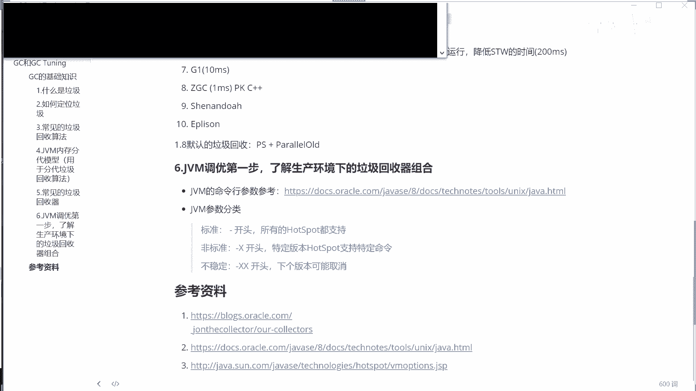

我打开一个命令行窗口啊，稍等一下拖过来，java conversion杠开头的标准命令，杠x开头的非标非标准选项，大写x。

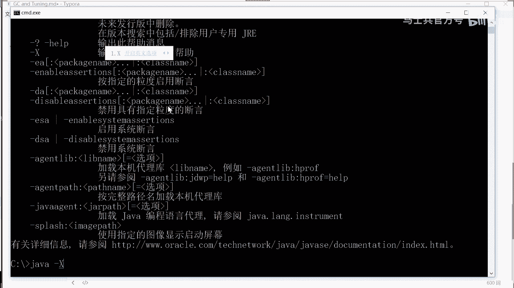

他会告诉你那些非标的到底有哪些。

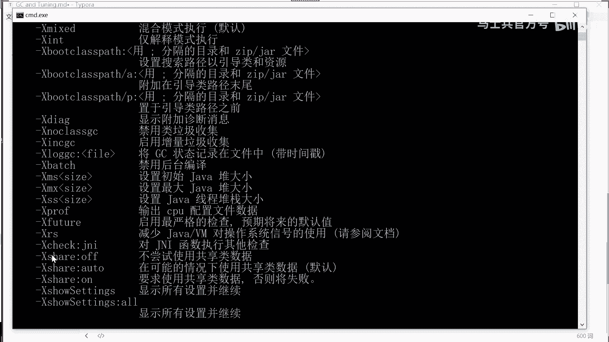

关键是你倒告诉我那些杠xx开头那些有哪些啊，没有你这你得自己去查，最关键是我还查不着，如果有谁能查着，你告诉我一声链接在哪好，这些以杠s s开头的这种多了去了好几百个，有办法能够输出。

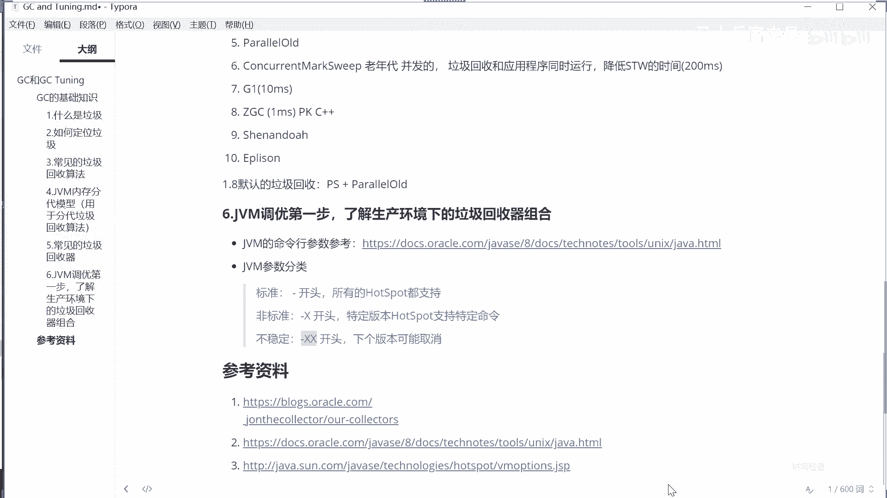

我告诉你怎么输出，常见的一些个这个输出办法吧。

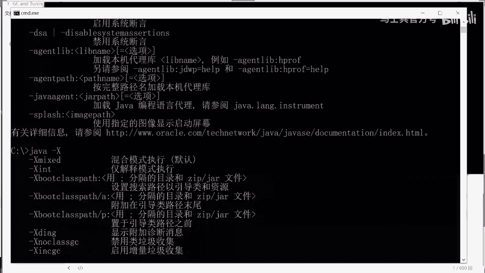

怎么输出，看这里，java杠xx冒号，记不住，找一下，用这个proflex final，看这里，应该是没有加上啊，print flags final回车有加号，我不知道你们看没看我的屏幕啊。

看看有多少这个翻，你往上翻的话就特别多，为了让大家看清楚，我是把黑屏的，就是命令行窗口的字体也扩大了啊。

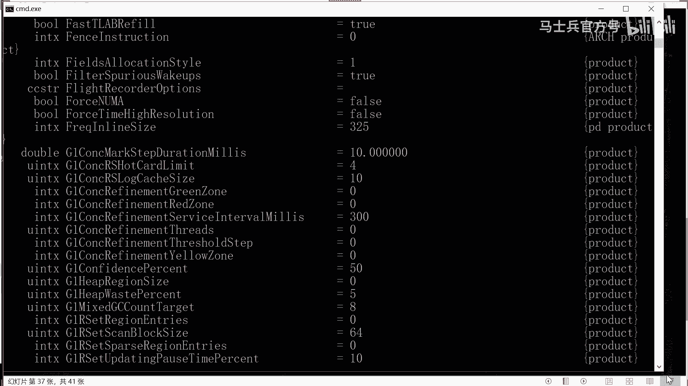

还有这么多，凡是你看到的这些都可以杠s和s开头来进行设置。

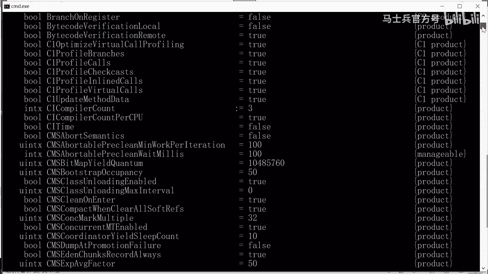

这些选项多了去了好几百个，un u m a啊，又又又又没有这种cpu和内存的插槽模式是吧，ug g y g c，你有没有用这个g y g c，那等于是false表示没有用等等等等。

也就是说你如果想用g e g c g y g c怎么怎么说呢。

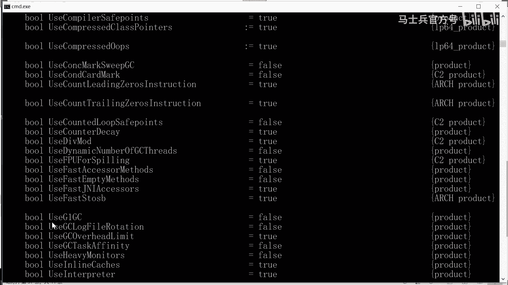

这样来说，举个例子啊。

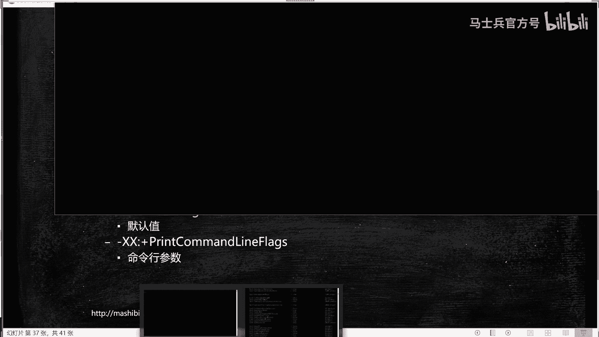

看这里这个杠，如果你想用g one dc怎么写，这样写，柚子第一dc好，这样的时候呢你就呃用的是你的这个，他有时候带加号，有时候不带加号啊，必须得用账号，就是你用的你就是g e g c了。

当然我这个程序呢由于本身没有主类没有运行啊，所以他输出了一些别的，这个很正常啊，呃我的意思就是说你可以用这么几个命令来知道你的系统呢。

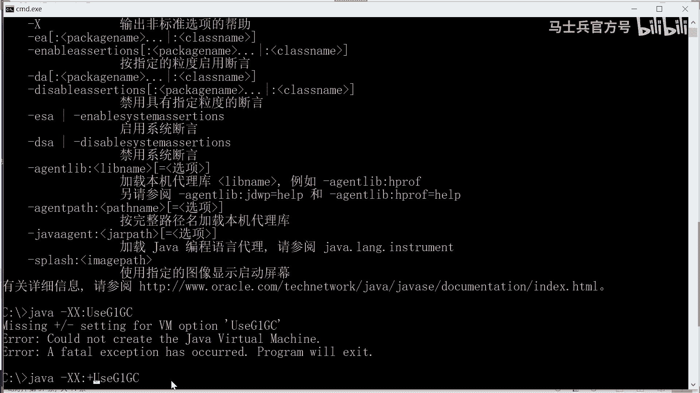

现在是采用的启动的时候呢，设置哪些参数，第一个呢是print flex final，就是把你最终的那些用的那些值，最终生效那些纸全给你打印出来，这里特别多，你想找里面的值的话。

在linux下用grap给它过滤一下，找出来你相应的那个值，print flexy initial，是说这些值的默认值是什么值好，还有一个经常使用的，大家把这个记住，今天呢大家把这个记住。

print common line flags，这个呢我给大家敲一下，敲到我们的笔记里常用的，杠xx，烤一下呗，他敲错了，主要是，林中森，prinly print print coconuflags。

那么这个用的是什么呢，这个指的是什么呢，这个呢指的是诶，当你你的这个系统里面运行的时候呢，它自带那些命令行参数，它启动的时候，那些命令行参数都给我打印出来，到底是什么，这是经常使用的。

所以如果你能接触到你生产环境的，你可以在这个生产环境里头执行这个命令，你放心，这个命令不会对你的环境造成什么影响，他只是来观察在你的生产环境里头，他们用了哪些个参数而已。

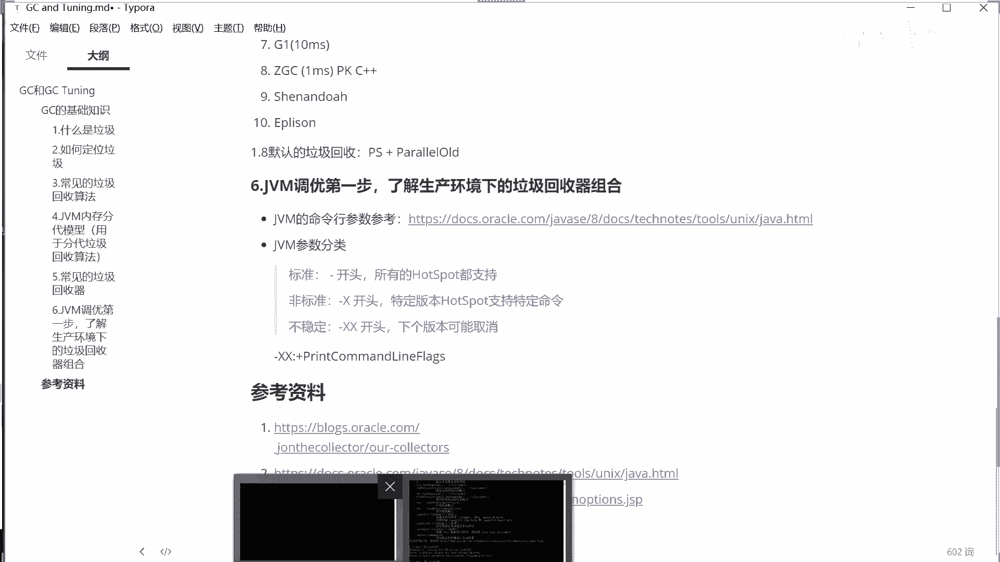

直接人家看看好吧，java杠x x，看这里，这是我的这个jav程序启动的时候，他又启动了哪些个命令行参数哪些呢，也没说heap size起始的时候，这个堆的大小是多少。

max heap size最大最大小是多少，command line flags，这是我自己带的这个了，压缩指针，压缩对象啊，对对象进行压缩。

use large pages in the visual allocation，大分页啊，use plogic，好，通过这里你就会知道作为这个系统里头，use parallel g c。

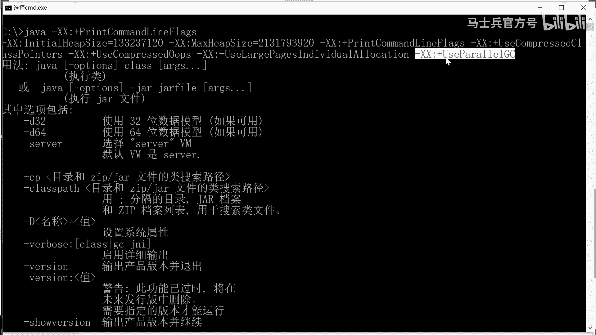

哈哈哈，use parallel dc指的又是什么呢。

它是parallel scavenge，加上parallel old，好，我的版本是什么呢，加了conversion，刚才可能有同学没看到1。8，所以1。8的版本默认的情况下。

他使用的是parallel c。

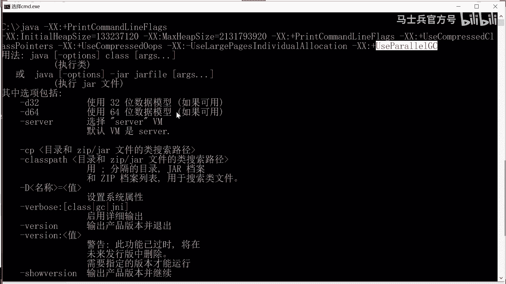

好了，能够接触到生产环境的同学，请你去执行这个命令好吧，还有一个给大家交出来叫print flex final，print flex final和print flex initial，这两个大家记下来。

最终参数值，默认参数值，好，今天呢我们的技术内容呢我们就讲到这里，好吧嗯后面我要介绍课程的话，我就不多做介绍了，简要介绍一下啊，两分钟绝对不超过120秒，这是目前呢我们在腾讯课堂上正在开的课程。

我们的课程呢叫做m加n可定制的，就是跟你的实际情况可以对你进行定制的这样一个课程，我觉得设计的还是很好的，是我牵头设计的，我个人认为还是很好的，以我这么多年来的教学经验，就是m个知识点加上n个项目。

我们的项目会滚动直播知识点，每年也会更新，这些报完一次性之后，只要我们活着，这个升级对你来说就是免费的，就是为大家的整体的这个技术生涯呢保驾护航，你在中间遇到任何问题的时候，老师都会来帮你解答。

像咱们的同学，然后隔一段时间就要基本上每天都要进行重启的这么一个过程啊，老师现在呢已经把它定位出来这个过程了，只不过呢就定位出来这个问题了，但是要解决这个问题的话呢，这是跟他们实际当中环境有关系。

像正在解决解决过程之中，像这样的一些实战的案例，其实对大家来说都是非常有帮助的，你写在简历里头呢也非常可信，嗯每一部分内容的量呢都其实都都都比较多，我在这就不一一解释了，如果对课程有兴趣的同学了。

希望大家加一下我们小九老师的微信，找他进行了解啊，荒唐老师，感谢老师，全程没说话，但是我全懂了，妈是吗，哇不说话都能全懂，你好牛啊，我把视频停一下啊，单机并发的百百百万级tps的，千万级的q p的。

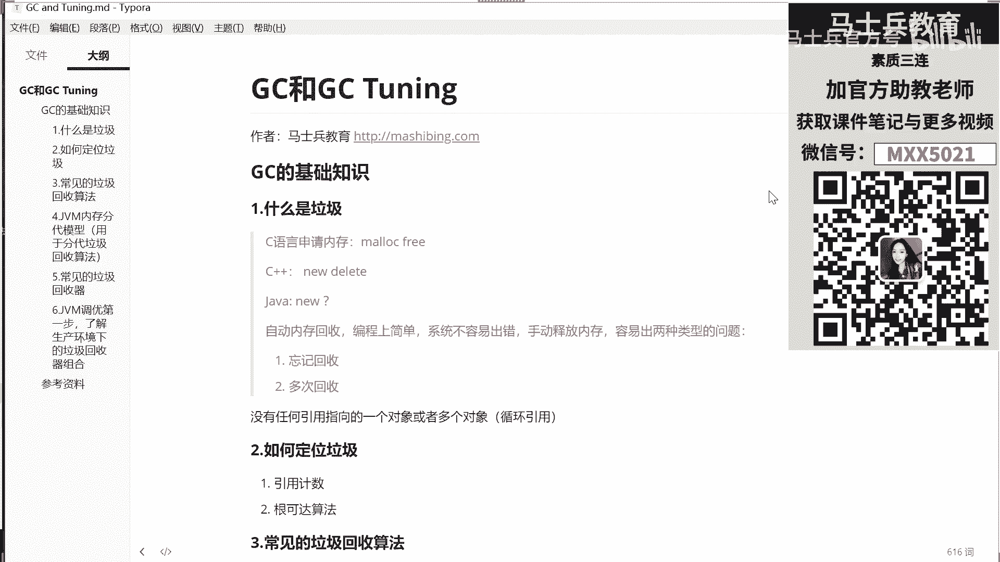