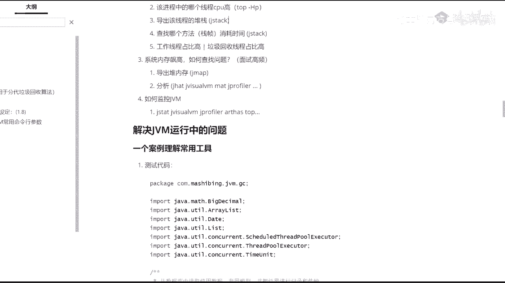
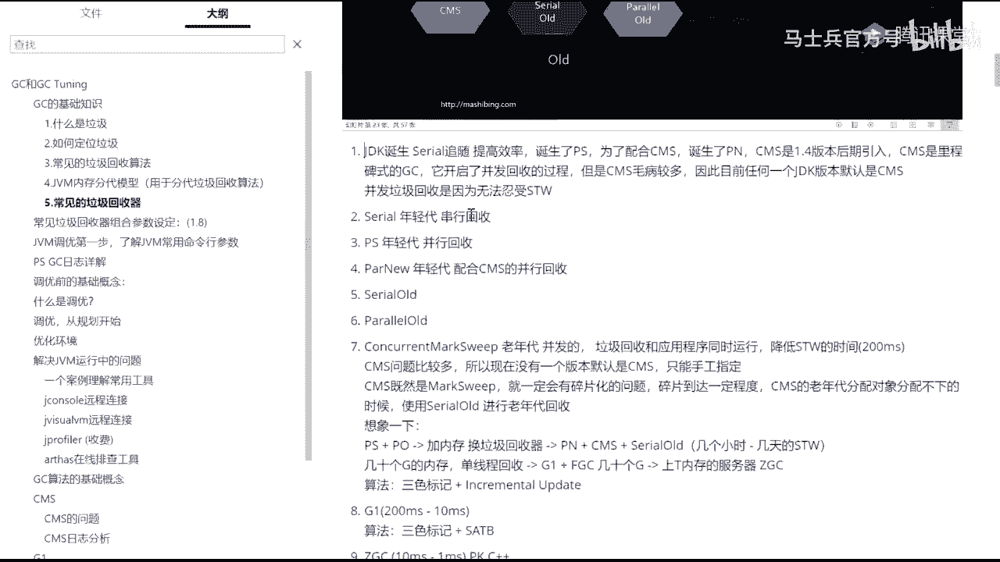
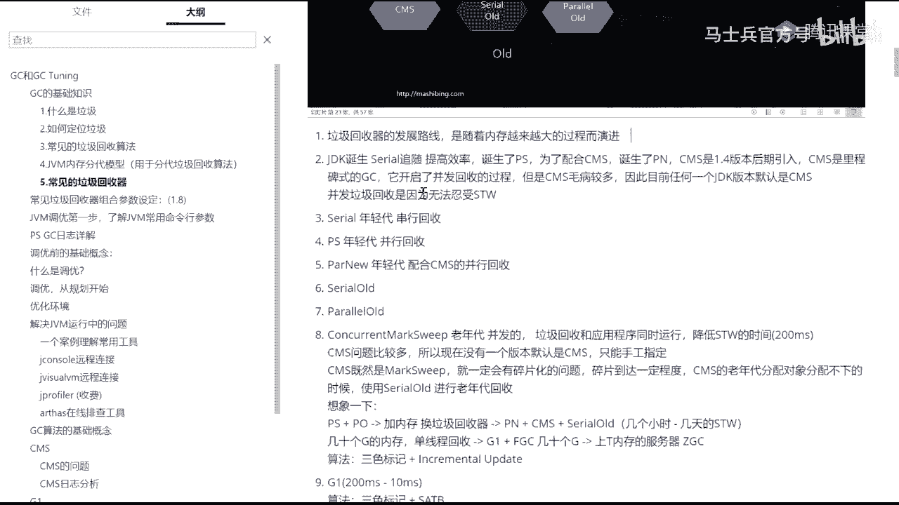
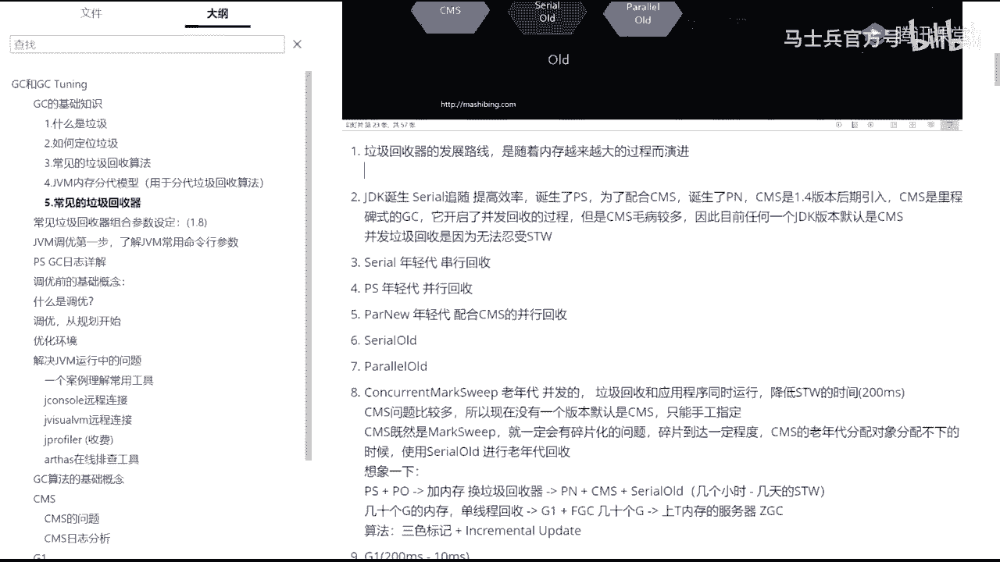

# 系列 1：P12：马士兵深入浅出java虚拟机②系统上线前预估系统的内存占用情况 - 马士兵官方号 - BV1mu411r78p

想想啊嗯，呃这个呢现在变得越来越重要的一个原因就是因为大厂总是考，总是考总是考，而且越考越细，越考越深，所以如果你的简历上能够把这句话写下来，写到你的简历上，熟悉常见的垃圾收集器。

具有实际gm调整调优的实战经验，原来你的简历如果值2万，就是超过2万了，之后往两两万以上，25000这个位置走的时候，你需要加很多东西，你从15000~2万啊，你只要能干活干得比较熟，就到了。

从2万~25000，这个这个5000块钱有好多好多东西你都需要加上啊，好吧，这一句话写上去就可以了，呃我们有我们原来有一份简历是写了五句话，拿到阿里的好多的面试通知啊，其中有一句话就是这个哈。

看我看这里啊，不废话，我们先说今呃，今天呢如果两个小时不够，我们就多讲点啊，没关系，gc gc什么意思叫垃圾回收，所以呢我并不是说在这给大家呢把jvm的从头到尾的概念那个太太宽，太大了，嗯不是那么讲的。

没有意义，让这块内存重新可用好，比如说我们占领有个引用，object o等于new object，new出来一个object，这个object里面有个成员变量又指向了另外一个，什么时候这个引用消失了。

这块就是垃圾啊，就是garbage，没有引用指向的对象就是垃圾，有过c和c加加代码经验呢，一说你就了解c和c加加需要手动回收垃圾，c呢要手动分配内存，要手动回收内存，下家呢需要自己new出来。

自己再delete掉，java呢没有这个概念，java就直接new就完了，new完了就不管了，那谁来帮他回收垃圾回收器，咱们讲的就是这个垃圾回收器的过程，好，我这个速度应该没问题吧，来没问题。

同学给老师扣一，现在很多新式的语言呢也都在引入自己的垃圾回收器啊，这个呃因为c和c加加写指针的时候，写的会非常非常的烦呃，所以当你不需要自己去手动手工管理内存的时候，你这个代码写下来效率会非常高。

不是运行效率高，而是开发效率高，好吧好看，这里，在这里呢第一步呢你怎么样，你你首先得定位这个垃圾，怎么样找到一个垃圾，就是这个对象到底他算垃圾，什么情况下算垃圾啊，你怎么把它找出来啊。

第一种方式呢叫做有两种啊，第一种方式叫reference count，叫引用基数，这事也很简单啊，你比如说现在有三个引用之前这个对象了，运行的过程中，这个已经没有了，这个已经没有了，这个已经没有了。

好这哥们肯定就是垃圾了，从三把这个三变成零的时候，这个就是垃圾，当然这种方式呢有一个显而易见的缺点，就是如果有三个对象，他们之间互相，持有引用。

但是又没有另外的引用指向他们任何其中一个a指向b b指向c，c指向a唉，这三个呢叫做一组垃圾，一堆垃圾，一圈垃圾，一家子全是垃圾，a b c好，那这个怎么办，每一个引用的技术都是111。

所以呢如果你通过引用计数方式，你是找不着哪些是垃圾的，所以这个在这儿用不了，那怎么办呢，jdk里面就hot sport里面用的是什么用的，这个算法叫root searching，叫跟搜索算法。

跟搜索算法是什么概念，跟搜索算法的概念就是哎我们写一个main方法，在方法里面有一些成员变量啊，sorry，有一些那，个局部变量我new出一个对象来，这就是我们的根对象，这个对象呢会产生一些引用。

指向新的对象，新的对象也可能会产生一些引用，又指向新的对象，那么在运行的过程之中，我只要找到main方法，找到这些根对象，顺着这些引用找脚，从根儿上开始，顺着着顺藤摸瓜摸摸摸。

凡是能摸到的这些全不是垃圾，凡是摸不着的那些全都是垃圾，这个叫做根可达算法，叫root thirty，这概念也很简单，是不是，来当然大厂面试不会给你面试这么简单的，大厂面试都是说哪些是根多讨厌你说他。

但这里面牵扯的东西比较多，只要讲得非常透彻的话呢，得需要把前面的所有的那个预备性的知识全都掌握住才行，呃，听一个大概就可以了。

这段话呢是来源于这边ms就是java java的virtual machine specification，就是java虚拟机的规范里头，他自己说的啊，到底到底哪些是根呢，哪些对象是根呢，有这么几个。

第一个呢是jdk jvm站里面的站里面还存活着的，那肯定就是根native methods stack，本地方法栈，如果调用了本地方法的话，run time constant pool放在。

你的运行时常量池里头的，你那个class运行时常量池的那部分的那些个引用指向的东西，那是根儿，static static reference in method area和class就是class。

这就别说了，你漏的漏的就内存那些class哦，那些是歌，steady reference，静态的那些引用，ok这些都是根，所以当然呃如果这块不熟的话，你就略过它好吧，因为今天呢重点呢也不是讲这些东西。

能让你的简历上把我刚才那句话给你写上，两天能让你的简历粗糙的涨个两三千块钱吧，细细的能能让你涨5000好吧，绝不夸张，以前有学生验证过啊，还真听嗯，当我们找着这个垃圾之后，我们要对它进行回收。

回收的时候有几种方式呢，回收的算法三种背过，别废话，直接背过就完了好吧，因为为什么大厂直接面认为你这东西就是应该你掌握了，没掌握，你跟大厂无缘，第一个mark sweep，第二个copy。

第三个呢叫mark compact，什么意思，一看就明白，标记清除，给这块标出来，标出来垃圾垃圾垃圾这些全是垃圾，直接把它清掉，清成可用的，就这么简单，这就叫mark sweet。

这maswift呢我我我我，我相信多位同学一看就能理解他有些毛病，什么毛病啊，会产生碎片吗，产生了这些个中间，这个中间也不连着，然后你要分配那个一个大对象的时候，你发现有可能也找不到空间了。

所以这就产生碎片，这个意思叫mark sweep，好看这里，但是mark wift算法比较简单啊，所以也并不是说不能用的，这三种算法没有优劣之分，记住这三种算法没有优劣，只有你选择哪种算法。

具体的选择要看情形好，第二种叫copy，copy很简单，把内存一分为二，只用一半，你们家俩房子，两个房间，一个房间你在里边玩儿，你妈妈进来给你回收垃圾的时候，咔叽把房间给你一分为二。

你这个死孩子只能在这边玩，等什么时候玩玩了，哎你跑到这边来玩了，我把这半边一下给清理了，有用的，凡是你产生的那些有用的，比方说你在那扔线团，把那些线条复制过来就可以了啊。

然后这边就可以全部的从头到尾的一下子清掉，这叫copy copy，我想一眼就能看出他的缺点，缺点就是内存浪费了好看，这里第三种呢叫mark compact，mk compact呢也是相当简单的一个算法。

就是我标记完了之后再对它进行一个压缩，这个是这个是什么意思啊，你注意看我们找到这是一个垃圾，但是呢我们我们不管垃圾，我们干嘛呢，我们其实呢是找这个后面的一些有用的对象好，这是有用的对象。

把这个有用的对象呢直接给这个垃圾覆盖掉，都挪到前面去，反正找到的都往前挪，你知道吧，把这些这有一个空档，哎我也把我把这个挪过来，把这个挪过来，就是挪来挪去，挪到挪到最后就形成了这样的一种感觉。

一边标记清完了之后，还进行了一个顺带的，顺手进行了一个压缩，这是最好的一种内存状态，这种内存状态特别利于新对象的分配，新对象来了之后，也只用往往后往后一挪，哎我就产生了产生新对象了。

再往回印度a又产生新对象了，这是最好的一种内存状态，当然这个算法一眼看上去也很简单，因为它和标记清除相比，和copy相比，它的效率肯定会偏低，为什么，因为你得挪对象，你得对对象产生移动。

对象产生移动是一个特别复杂的过程，都是在这块下功夫，啊这是标记清楚啊，三种算法相当简单，我在这里就不跟大家多废话了啊，可以吧，能接受同学给老师扣一来，大家先跟我的思路走，你们有一些眼前的问题先扔一边儿。

有的问题你可能听着听着就明白了，所以先扔一遍，好吧好，我们先不讲这个对象的什么产生到消亡这个过程啊，也不讲这个对象的分配过程，我们先来看什么呢，先来看这个这张图，请把这张图背过。

我前面讲的东西都是让你背过的，为什么，因为面试官就直接认为这东西你应该掌握啊，当然这张图呢很多面试官可能也掌握不了，你掌握住啊，你就可以直接第四面试官了，就前面讲的概念都特别需要，特别基本啊。

你必须得掌握，那么这张图是整个我们到目前为止，jdk至少到jdk 14为止，从jdk一点零到目前的14为止，所有的垃圾回收就这么多，垃圾回收器好，垃圾回收器是什么概念，垃圾回收器就是这是房间。

你在里边玩，你跟你朋友在里边玩，扔一些小线团，这些小线团呢有的a慢慢的中间线断了就变成垃圾了，你自己不回收，谁来回收你的妈妈，你的爷爷，你的奶奶，你的姥姥和他们来回收，他们来帮你回收这东西。

他们就是垃圾回收器，帮你清理房间的，在c和c加加语言里面，你得自，己清理扔了这个线团什么时候不用了，得自己把它清理掉好，现在不用了，因为有人帮专门帮你清理，谁来帮你清理他们。

他们的名字叫做garbage collectors，扫地机器，当然它有时候也做动词，简称的时候做动词叫garbage collect，嗯，垃圾回收。

垃圾回收呢整个从jdk一点零开始到现在发展了很多很多年，然后也诞生了各种各样的垃圾回收器，它的一个发展的路线是什么路线呢，请大家记得这个路线，给大家写写两笔笔记。

垃圾回收机的路线啊，发展路线是沿着什么发展呢，是沿着，随着内存数量内存越来越大，越大的过程啊，好演技，好在这儿呢我先给大家呢做一个总纲性的胶带，我们说学任何东西都是要按照先脉络后细节来学。

一定记得这一点。

小伙伴们，就学任何东西一定是先脉络后细节，而且充满了各种各样犄角旮旯的面试题，这么一个知识体系。

那么这时候怎么办，我们要来一个总纲，这个图就是我们的总纲，关于这个图呢，我会先进行大面上的一些个讲解，好嗯能接受这么学的，来给老师扣个一啊，一定要这么学啊，这个学法才是最正确的学分。

你千万不要说学东西呢，你自己先弄一个细节，先使劲抠进去那种那种学法学起来特别，累，而且还不容易学明白，就相当于你去看庐山，然后直接到庐山脚下的某一棵树，就开始研究蚂蚁窝了，你是在玩什么。

你肯定得先乘坐飞机观，看清楚整个庐山大的脉络啊，你要有这个这个胸怀明白吗，就学技术也要有一定的胸怀啊，嗯，随着内存的越来越大，另外呢它呢还有这样一个背景，就是从，这个说法都没了，从，从什么呢。

从分带算法演化到部分带上，终于从分类算法演化到了部分类算法呃，这些个，那么这些个垃圾回收呢，我一一的先给大家交代一遍啊，你认真听呃，从jdk一点零开始啊，先诞生的是serial的垃圾回收好。

那会的垃圾回收呢都是分带的，分带是什么意思呢，就是分为年轻代和老年代好，我们先说基本概念啊，看ppt，一会儿我再给你记笔记，笔记明天会发给大家的，不要着急，因为我每每讲一次，我都会往笔记里多记一些东西。

所以你们明天拿最新版本就可以了啊，好在这里啊，嗯我们先来聊这个分带的概念，就是目前到目前为止，jk呢就是hobt，说的是hobt，因为gt有好多种，我们主要说的是hobhouse。

到现在为止它一共有十种垃圾回收器，这个图请大家记住前面的这六种叫做分带好，第一叫做概念上分带物理上不分概念，分带物理部分带这么来理解。

那么z d c和shandollar全都不分带abcellent是另外一种比较特殊的了解，回收，一会讲你听这个和其他的都不搭界，因为他什么事都不干，就他不干，他垃圾回收的活，没有人帮你清理房间。

这哥们儿叫不起来啊，啥都不干活的人嗯，空气，首先呢我们先了解这个分带的概念，在jk诞生的早期，要分配一块内存的时候，会把整个的我们java的堆空间分成两个不同的年代。

这两个不同年代呢可能应该也听说过分成叫新生代，叫老年代，是这么一个概念，新生代是干什么使的呢，新生代你看吧，刚刚new出来的对象，然后都放在新生代里，然后经过了好多好多垃圾回收，垃圾好多好多次的扫房间。

好多好多次垃圾回收之后的那些特别顽固的对象，放到老年代，他有些别的称呼，比方说老年代也叫tenure，就tenure是终身的意思啊，老外的那种tenure，processor叫终身制的教授啊。

就是这个意思，终身反正就是比较老老家伙，所以一个叫新生代，一个叫老年代，那么为什么这么分，是因为呢在不同的年代里，可以采取不同的算法，对垃圾回收采用不同的算法，这样效率上是最高的。

对于年轻的采取copy算法复制，对于老年代采用mark compact或者mark sweep，这两个都有，很多那种y就是那种原理上的东西，我们暂时先不探讨，你先了解什么意思，这个老年这个年轻代呀。

呃为什么要用copy呢，是因为呢对于程序的一个总结，总结出来的，大多数的百分之八九十的对象叫做招生熄灭，招生熄灭诶，什么意思呢，就是这寿命都不太长，一个for循环里面扭了1万个对象，除了这for循环。

他马上就死了，因为他马上就成为垃圾了，那么像这样的东西，你想想看啊，在这里分分配了，在年轻代里头分配了一堆一堆一堆一堆一堆的对象啊，总而且呢一次垃圾回收之后会回收，其中的好多好多个好，在这种情况下。

那么最有效率的算法是什么样子的呢，最有效率算法其实是这样子的，看这里年轻的又分成三块，第一块呢叫伊甸区，一点伊甸园人类诞生的地方，所以这是我们新对象诞生的地方。

