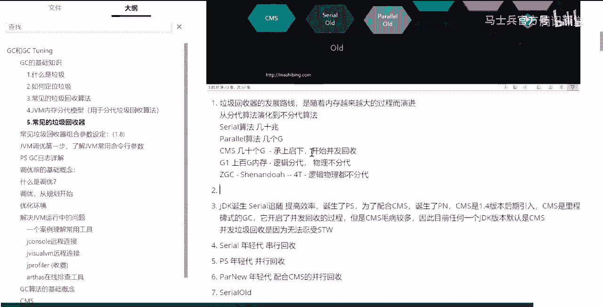

# 系列 1：P14：马士兵深入浅出java虚拟机④根据预估值设定JVM初始参数 - 马士兵官方号 - BV1mu411r78p

现在我满了，内存已经占满了，满了之后怎么办呀，我现在要进行垃圾回收了，垃圾回收怎么做，首先第一步找到最根儿上的垃圾，这些都是那根儿上的，这些都是根儿上的啊，通过引用根儿上的找到最根儿上的那批。

由于嘴跟上那批的数量特别小，所以这次的s t w时间不会太长，接下来下一步的标记过程是我的垃圾回收，一边在这里顺着找，哪些是垃圾，哪些不是垃圾，哪些是垃圾，哪些不是垃圾，与此同时。

你的工作线程还可以进行工作，刚才我们分析过，如果你正好把这个是垃圾的，你标出来了，准备把它清掉了，但是呢工作线程工作的过程之中，又有一个引用指向台了，这个东西呢就会产生产生问题，就会产生问题好。

那这个时候呢就在最终一步下一步的时候，再下一步的时候说，你这边先别干活呢，给我停止，先让我把那些个并发标记找出来，那些你又重新连上那些个垃圾，给我找我我我我再重新梳理一遍，从根儿上再输一遍，找着了。

这个为什么速度会比较快，这个速度比较快的原因主要是这种错误产生的特别少，所以他最后这步算起来，其实速度也会非常快，最慢的过程其实是这个过程，因为堆特别大。

到最后的话就几十个g生生t你在里边找各种各样的关系，他会特别麻烦，这是最耗时间的，他把最耗时间的这部分和我们的工作线程可以同时进行，这个时候就不会产生什么的，就不会产生那种长时间的s t w。

不会产生长时间sw，你的程序就一直会有响应，你点个鼠标下个订单，你的程序会一直有响应好最后一次重新标记之后，把那些有问题的东西做了个整理之后，重新标记为哦，这个已经不是垃圾了，重新把这个错误改过来。

改过来之后并发清理，最后把他最后把这个最终的已经原来的那些这部这批给清掉，sw是啥，刚才没听是吗，stop the world，初始标记的作用是初始标记是找到我们最根上的对象，gc root吗。

这些root不会变吗，他爱变不变，s t w同学们，什么意思啊，我不允许县城工作，我在标记的过程会出错吗，我就问你，数标记单选什么对三色标记算法，我跟你说，我现在讲最初最最最根本的这个脉络。

很多人都还没听清呢，一聊三色标记不就直接就聊晕了，第一次标记是垃圾还是非垃圾啊，你找着那个非垃圾，你不就找着那垃圾了吗，好先把大体的过程理清楚吧，好不好，gc root指向的不是垃圾。

我不知道你晕在哪啊，先别着急吧，好不好，来，先把大体的懂了，知道吗，大体懂了之后再扣细节，所以这个是cm啊，我再说一遍细节，这个东西你必须先把大概大的脉络懂了之后再抠，不然没法扣啊，看这里就是cms好。

所以你会发现来，这里有一个根上的脉络，从分带到部分带，从内存越来越大，为什么会内存越来越大呢，是因为什么呢，看这里啊，原来的你诞生了这个serial的时候，这是最早的serial算法。

seo算法一般来说像这种垃圾回收的时候，分带的这种算法的时候呃，这种年轻代的算法会和老年代其中的一个算法配合使用，比如说这里头比较比较浅的线，大家可能没看太清楚，给你画一下。

其实serial是可以和cms配合使用的，zero也可以和sio o的配合使用，但是没有连线的，它不能配合，你不能说serial和separtout不行，这是不行的。

他new和cm po和parallel old它是配合这个使用的好，大家听我说zero单线程，那你妈妈一个人清理清理过来没问题，但是随着内存越来越，大堆的空间越来越大，越来越大的时候。

你一个人还清理过来吗，也可以能清理过来，原来你家三个平方，你妈妈进来三下5÷2就给它清理掉了，虽然产生了s t w stop the world，所以客户那边是感受不到的，因为你速度特别快。

你这个垃圾回收线程就停止了，你的工作线程就开始工作了，所以客户那边感知不到好，接下来呢很不幸的是呢，你家房子变大了，内存变大了，巨大个一层楼，我就问你，当这层满了之后。

你妈妈一个人进来扫这个st tw时间是不是超长，所以内存变大之后，一根线程肯定不，够这时候呢肯定得多个线程，所以这就是为什么说它随着内存越来越大的过程而演进，一般来说。

如果非得说估计一下的cereal的算法大概就几兆到几十兆的内存，也就到这样了，再大就不行了已经，所以co现在已经见不着了，听懂了吧，那么parallel呢，看了其实现在呢工作的，呃还是有挺多在用的啊。

parallel算法，这个呢是一直到现在大概有个几个g吧，几个g左右的内存啊，都可以用，它，甚至多了的话，十几个g，20个g也也有人在用，这个也没有问题啊，嗯我一会给你讲个好玩的故事，他有的人用了就用。

完了之后实在清理不过来怎么办，重启服务器，你们看到那些游戏服务器里头，说不定说啊游戏服器正在维护之中，请五分钟之后再登录，干嘛呢，重启呢，以前有一个哥们儿，他们家那服务器好像有一bug，死活查不出来。

一直不停的会产生，到最后会把内存占满，死活，查不出来怎么办，哎过一段时间重启一次，过一段时间重启一次，就这么着玩了2年，好接下来继续，你们家内存又变大了，同学们，你们想想看，你们家内存又变大了。

你就算派100个县城过来，一一百个县城过来，我就问你，就算是你这种多线程，100个线程，你来清这个天文广场，你要清一遍，你得多长时间，太长时间了好吧，超长的一个时间先上，曾经有一个，案例呃。

他们的服务器在进行一次垃圾回收，就是一次fdc的时候，整体的垃圾回收，由于内存设的特别，由于内存比较大，对空间比较大，大概是花了四个小时，三四个小时，两三个小时啊，所以拍了两小时来说。

这个对于客户来说是不可忍受的，你跟他存钱，把钱存进去，就等着看数字增长的那边正在进行垃圾回收，你能受得了吗，所以，诞生了新的，cm cms，刚才我分析过了，垃圾回收线程可以和谁一起十个g啊。

垃圾回收线程配合谁家，同学们，南京回收县城可以和我们的工作线程一起工作，我们工作线程没有停，虽然是稍微慢了一些，被别人占了一些资源，但是没关系啊，我是及时有响应的呀。

哈哈所以这个是现在的很多很多调优的一个关键，调优的量的方向，第一个叫调吞吐量，第二条响应时间，其实大多数的在呃面试官问你的时候，多数的都是让你调响应时间，就是尽量的不要让这个s t w时间变得特别长。

你的系统要保持及时的响应，ok所以cms是一个承前启后的，承上启下的非常关键的这么一个篮球回周期，当然由于呢它是第一个好多的算法呢也不是特别的完善，所以呢，这cms呢居然在所有的jdk版本里头。

没有任何一个版本的jdk默认是cms，好了来我们再来看这个图，图呢还有一个关键点没有讲，你听啊，先别着急，看这里，还有同学说老师你还没有讲，肯定我还没有讲判定呢，判定是什么呢，唉往这儿看。

肯定肯定他说是is of the world coping collector with use multiple gic threads，读一下，跟那个我刚才讲的parallel scavenge。

简称p是一模一样的，of the word cing collector，which uses multipgc threads，这是新一代的垃圾回收并行垃圾回收new new，它为什么叫呃。

和和原来的p一样呢，是因为它本身就是ps，就是我们的parallel scavenge，它只不过是一种特殊的ps，他说it the first from paralleskyangta。

parallel skyin的区别是什么呢，is that it has been concements that it makes it usable with tm，看这里它有一些增强。

让他能够和cms一起工作，它可以组合cms，就这点区别，其他没有了，好同学们来看左边边这个图基本快讲完了啊，还有最后一个点，这半边就完了，常用的组合cereal和serial old，现在已经很少见了。

paralgavge和parallel，目前1。8版本默认的就是他，同学们，你们上线的时候要是没有指定任何垃圾回收器，就是这歌呀，在问你们做垃圾回收，简称ps加po，又称parallel。

pc这就是这个意思，好给你看一个命令，先给我java版本1。8，java杠x x，那为什么java执行的时候把他的common life flag变量和参数给我打印出来，看最后一项。

use parallel dc，默认的p s加po。

所以所谓的你们大多数人的调优就是对它进行调优，其实对它进行调优的一个最简单的办法，也许你换个垃圾回收器就直接搞定了，好我刚才讲完这几段来能get到同学老师扣一，好我们再来看一遍，它的组合常用。

他俩的组合也常用p6 加cm s他俩的组合也常用好吧，所以其他的虽然说可以组合，你比如说part of cavage和sero组合可以组合，但是极少用，因此你既唉就记这三种组合就可以了，但是你发现没有。

这里头居然还有一根细细的很危险的线，就在这儿，cms居然和c o o又连在了一起，这是为什么，我再说一遍，cm是一个承上启下的啊，继往开来的这么一个垃圾回收器，但是呢它是属于前浪啊。

背后被后浪拍死在沙滩上的那种前浪，因为cms有一个巨大的缺陷，cms叫concurrent mark sweet，好，你的老年代再打mark sweep，就是叫碎片化，懂吗，碎片化碎片化产生之后。

当我们新的内存不能从年轻代升级到老年代的时候，他干了一件什么事呢，他居然用一个县城把老年代从头清理到尾，我告诉你，我有，一个学生遇到过他的线上系统卡了两天，就是cms干的，因为他们内存超大。

然后呢又运行了很长一段时间之后，很长很长的一段时间里边的产生了一些泄漏，我自己不知道，最后内存全占满了，实在弄不进去了，这时候谁谁冒出来了，居然是serial old，你看吧，他还活着，他没有死。

他还在干活儿，但是很不幸的是呢，这哥们儿卡了两天时间，客户那边一点反应没有，服务器，有的服务器是不能断电的，是不能重启的，你懂吗，有的服务器是不能重启的，军方的有些服务器能能随便重启吗，你是在搞笑吗。

跟你说有的服务器是不能重启的吗，好，嗯我有学生拿他们那个说跟你说啊，就比较好玩的事情和垃圾回收体相关的，现在大多数有用的不就是他吗，对不对，少数人的调优的时候改成了他啊。

现在基本上就是这这两个这两个比较多呃，我现在一般都建议你至少一点半，这搞成g一了，没有问题的，其实嗯有一个做游戏的哥们，游戏的服务器，他们那服务器就是基本上每天晚上24 22214点还是下午。

就是我凌晨两三点钟啊，就发个通知，各位小伙伴是吧，各各各位各位各位各位将官啊，咱，们现在先暂停打斗啊，服务器呢五分钟之内开始维护，有没有见过，应该见过吧，12306有没有有没有用过。

每天晚上11点开始到凌晨的几点不让买票，有没有，维护知道吗，有很多时候我告诉你，你调优调的再牛逼都没有用，该维护还得维护，该重启还得重启，ok还有一个小伙伴他们是做那个测试的，测试的，有个工具叫ga。

这估计可能做测试的小伙伴都会都会比较熟啊，这个gr呢其实他bug还挺多的，嗯，他们的这个服务器全球他们公司在那个越南菲律宾都有分支，所有人都在用这个服务器也不能停。

然后这个服务器三天两头的就直接频繁的f g c，你知道吧，三秒钟一次，三秒钟一次，你想三秒钟一次，fdc 3秒受不了了，肯定受不了，他们原来的采用的方案重启，不停地重启，后来他把那个日志发给老师。

然后知道了，他大概得有前前后后一个月的时间啊，终于解决了，只不过他们采取的解决方案比较土，第一扩了内存，第二换了垃圾回收器，哈哈我跟你讲，找出代码的bug来，一会儿给你演示啊，好看，这里到现在为止。

这种分带式的分带模型的你大致应该了解了，来我们来大体聊一下g one是个什么东东，大体的这里面每一个拿出来讲三个小时，两三个小时都是很正常的一件事情，好吧，g one到底是个什么东东。

先给你讲一些大题的啊，尤其是牵扯到里边的一些算法的时候啊，而且呢这算法还还特别特别有好多人还特别特特特特别爱问。

这期的讨厌，好这边有个什么东西基本没有分带了，你发现没有，这叫做逻辑上可以分，在物理上已经不再分带了，g one可以支持什么，可以支持上百g内存，这个我得我得给大家记下来。

这one其实好像支持不了g one的话，100个亿我也100个g差不多了啊，这个号称史啊，这是上百g，那么，就让后面的cdc和仙人斗，这两个呢他们能支持，这里贼是支持四个t的山洞是值多少来着。

反正就是上t了上千g啊，嗯，杨英语为什么y d c采用的算法都是复制算法，可见你刚才没有认真听，我都讲过了，不要听，先听现在的，不要纠结于过去，你在流经过去的时候。

实际上已经损失了现在正在听课的精力和时间，现在也听不着了，先听现在的啊，呃从g one开始，g one也是一个承上启下的，也是一个特别牛叉的这么一个垃圾回收器，从另外开始呢，终于开启了一个什么时代呢。

叫做分区回收呃，分region它不叫分带了，叫分区分区回收，看这里啊，那这样呢它把内存分成一小块小块的，咱们原来不是分两个区吗，年轻的老年代啊没了就这俩区没了。

当然还有一个什么matter space啊，那那个那个今天的重点不是说他先不管好，所以这样来说呢，他就把内存直接分成了一小块一小块一小块的region变成region，我相信region这个概念呢。

很多同学应该都有把屋子分成一小格一小格了吗，你你我们回收的时候就先回收优先回收了一个小格，这两个小格吧，我先回收你一边在别的小哥玩儿，我先回说这俩小格呢就这意思分成一个个的region开始终于开始。

分块了，分区了，好这个呢效率就开始慢慢提高了，同学们，你们想象一下，在一个超级大的内存里头，有一对县城在这里不停地清理它，清理的时候并不是说我要stop the world，而是说我分成一小块。

一小块一小块的，我优先去清理那些垃圾最多的小块儿，什么叫g one gb，一直，垃圾优先，什么叫垃圾优先，优先清理垃圾最多的小块，所以它的名字叫g one，叫garbage first。

嗯知道思想听懂了的给老师扣一，好看来g one没有s t w，这是一个面试题，g one有没有sw，有今晚有没有复仇dc，有，好作为这句话来说，它呢分成了一小一小区，一小区的，然后这一小区里头。

他在这个小每一个小区在逻辑上可以成为a是年轻的呀，啊伊甸区啊，还是欧的区啊，还是survivor区，或者分配大对象，用的是manus巨大的这种这种区啊，所以它逻辑上每个区都可以成为不同的。

原来的那种年代，在物理上已经不再分带了，到了z理学之后，不仅从逻辑上，而且从物理上也不再分任何代了，就这些概念在cdc这里就没了就没有了，cdc到了之后，我们调优的时候，它的参数就非常少了。

g one的参数也就几十个，如果你用p s加p o的话，大概要几百个参数，你要调优的话，所以珍惜这段我们现在还可以展示自己水平比较牛逼的时代吧，这里面的概念就太太多了啊，我们先把还是那句话。

我们先把最脉络上的东西先把握住以后，我们再慢慢扣细节好，我们来继续聊，所以g one呢开始分区，你脑子里内存里头就不再分成两个带了，然后呢g one呢但是逻辑上还是分开的好，到了cdc之后。

c d c不管是逻辑上还是物理上，就再也没有分带的概念了，这一代一代的东西到此为止，那么什么叫山人多，大家听我说，其实不管是cdc还是山人多，都是来源于一个特别牛逼公司的，特别牛逼的jvm的。

特别牛逼的垃圾回收器，它的名字叫做c four，是a a rule，呃呃呃呃a rule，他怎么拼来着，你去查一下他的一个特别牛叉的这位m叫z听着名字就特别快in，他不用你进行任何的调优啊。

它的参数好像只有一个呃，然后呢，它能够非常智能的来帮你进行垃圾回收的管理，cc four号称对外是没有任何s t w的，ns t w的垃圾回收器，但是很不幸的是啊，as you对，但是很不幸的是。

这哥们儿呢是收费的，是商业的还贼贵，所以jdk 12 sorry，这个11啊开始开始主推cdc，就是跟人家学的，听懂了吧，就这意思，这个z d c呢是oracle自己官方推出的，和c four学的好。

red hat自己也推出了另外一款垃圾回收器，叫做shining doa，也是建立在建立在就是jvm的基础之上的啊，这样的一个垃圾回收机叫神仙多，但是它主要是跑在open jdk上了。

目前这两个其实都有机会叫做转正，就是合并到主干上，下一期的这种jdk的12jdk，13jdk 14，你要用哪个，哪个是主要的哎，shindo了，有机会cdc也有机会，当然cdc机会更大，为什么。

因为这是oracle的亲儿子，所以11开始是cdc到12呢，山都在12里是可以可以设置的，他两个呢本质上是差不多的，算法也差不多，他们两个是一个竞争关系好，不知道我说清楚没有。

答题的来get到同学给老师扣一对，生产环境大多数还是用的这个这个jdk 8，所以你在简历上写，我对jvm有个调优经验，你要敢说你是对z dc调优的，面试官，一个大嘴巴子就给你糊上了。

对jdk 14 cm s已经放弃了，这哥们已经放弃了，他完成了他的历史使命啊，可以到历史的垃圾堆里去了，当然如果想了解算法，必须得从cs开始了解起啊，我看这里还有一个，我没有说这哥们是谁。

这哥们叫excellent，这哥们儿是什么呢，这哥们儿叫做啥也不干的，这啥也不干的dc就是他啥也没干，什么也没干，干什么用呢，它有两个作用，第一个你的程序做测试用，看看你的垃圾的产生过程啥样的。

反正没有垃圾回收器来干扰你，你用它，第二个你确认你有一个程序根本不用垃圾回收就能结束你内，存直接分配，分配完了之后计算，计算完了之后就直接结束了，我根本不用去惊动垃圾回收器，用它absolu，好看这里。

给大家提几笔笔记。

嗯cmon啊，承上启下，开始并发回收，这个逻辑分带，物理不分带，这里c选的多逻辑物理，都不存在。

