# 【马士兵教育】MCA架构师课程 主讲老师：马士兵 - P15：马士兵深入浅出java虚拟机⑤根据日志解决实战问题 - 马士兵官方号 - BV1mu411r78p

啥也不敢，两种作用，第一个调试用，第二个确认不用减肥参与，就能干完活，这时候你可以你就可以用app了，好到现在为止，我觉得脉络上的东西大家是不是掌握了啊，这个脉络上的东西，来掌握同学老师勾引我们。

下面往深入一点点细节脉络，有了对面试呢好的细节，但是你记住了，我这两天练营呢叫做实战训练营，你要想听实战，我就跟你聊，实战之中会产生内存溢出，教你怎么去定位，怎么去把它揪出来，怎么去把它给干掉。

如果你要想听理论，那就全是理论了，所以我们还是实战啊，听完实战，有些理论你不懂，但是你简历上就可以写，我有实战经验了，听完理论，我估计你也记不住，好看，这里给大家多记两笔。

现在问的比较多的cms开始或者说分类算法，只要只要产生并发的时候，并发的算法从cm开始，它的算法是什么，先给大家几个名词，感兴趣的你好好去网上看看啊，三色标记对不对，它会把对象分成三种颜色，黑色的。

灰色的，白色的，黑的已经全标记完了，灰的自己标记完成员变量没标记完，孩子没标记完，白的还没标记的，三色标记算法用来干什么的，用来进行并发的时候，做并发标记用的不容易产生问题的三色标记。

三色标记里面会有产生漏标，就是我刚才所说的那种最严重的问题，就是我标完了之后，这哥们呢把它标成垃圾，但它它它又变成不是垃圾了，好这种是最严重的三色标记，要想他这个算法本身是一定会产生这种问题的。

为了避免这种问题，cms的他的干法，好c m s它的干法呢，首先第一个呢叫34标记，下面这段你一定听不懂啊，听我说你一定听不懂，我只是给你开拓一个你下一步可以去研究的东西，get到了吗。

你一定听不懂三色标记，三色标记会一定会产生错标，产生坐标之后，cm是怎么解决的，它的解决方案叫incremental，update叫增量更新，但是这个增量更新有问题。

因为在增量更新的过程之中也会产生错标大哥，所以呢，这也是为什么cm到最后一定要有一个remark的东西，好接下来，怎么把这个给挪这儿了，复制了一下啊，不小心，好，所以所以什么呢，所以第一。

所以g1 g一同样的也使用三色标记，但是它采用的算法是什么，它采用的算法叫做，ok g一的算法，g的算法叫什么呢，g一的算法叫做s a t b，哎呀牌不好，那什么了，还不好板了啊，很简单。

给大家写出来吧，好第一，第一的算法叫什么，也是三色标记，加上s a t b它就解决了这个incremental update，最后必须要进行remark这个过程，所以它效率上有所提高。

这叫natt at the beginning，好，接下来z dc是什么，c d c是最难以理解的一种算法，这种算法呢叫，color pointers，这种算法叫颜色指针，或者叫着色指针。

呃基本上不会有面试官跟你聊到这儿，因为市面上一点资料都没有，连国外的资料都没有，要想弄明白这个只有一个办法读hobo源码，很不幸的是老师读过，所以目前只有我能给你讲清楚，慢慢慢慢慢慢来吧好吧。

但是也别着急啊，因为这个东西没有人问啊，好吧，你随随便去网上找文章去，这颜色指针的也是特别复杂的一个东西，他是用c加加里面的指向java对象的那个64位的指针，其中的四位做出了一些个性的操作。

因为这里面还牵扯到操作系统的那种内存映射的问题，嗯现在呢问的面试官问的问题上呢，还目前还没有到这种水平，还到不了，所以呢你们你们先不用着急啊，另外呢如果说还要说的详细一点的话，其实这样的啊。

呃所有的分带算法，所有分带算法就除了他这种，这种的他们使用的用三次标记之外，还要加什么加写屏障，而这段呢是三次标记sb加写屏障，cdc是什么，cdc是color pointer加读屏障。

而shen dog是什么，shen door color pointer，加写屏障，好，算法里面最复杂的部分就是这些了，大家呢给大家拓展一点知识面儿，嗯你要是想学的时候呢，也可以去网上查一查好不好。

ok了咱们大体讲完理论上这个东西了，下面我们来进行调优的实战，但是大家听我说，直接实战吧，这些对面试没啥意义，你是在搞笑吗，实战才对，面试没啥意义，这些才是对面试最有意义的，你可能弄反了啊，好看这里。

我们现在来进行调优干调优的时候呢，必须指定你要调哪种垃圾回收器，我可以帮给你调g one，我也可以给你调他六cm，我也可以给你调p s加p o，所以咱们公开课上咱们的小伙伴们来讲。

大多数人的水平其实多数都没有进行过任何的垃圾回收器的替换，所以多数人用的还是什么呢，ps加po，所以我们先把最简单的调清楚，也只有你把这个能认识清楚之后，下一步你才能继续往下走，越往后会越容易。

这个是最难的，p s加po是最难的，听懂了吗，越往后是越容易的，我先来定义这个调优到底是什么概念，其实啊调休这个概念呢，很多人就就就就会理解的特别的不到位啊，这个调优这个概念呢其实。

大多数的这种面试的时候，总是问你什么om问题，那只是调优的概念之一，好吧，好看这里我们来聊这个调校的基础概念，听我说啊，这调的基础概念调优呢，其实啊那个就是大多数问面试的时候都问什么问题。

都问这个o o m多数都问这个om什么意思呢，叫out of memory，内存溢出，就是玩着玩着呢，我这个垃圾回收器呢，我觉得整个j vm呢我开始频繁的dc 3秒钟一次，三分钟一次啊。

fc频繁的f d c或者什么呢，或者直接就崩了，直接就崩溃，好崩溃，完了之后你的都崩溃完了，你这时候该怎么办，你去去里边怎么怎么怎么去找毛病，找问题啊，这种叫o o m，大家听懂我意思了吧。

那如果说从全面上来讲，到底什么时候调优呢，这也是调优的一部分，优化这般旅行环境，比如说他有时候特别慢，你觉得受不了他卡顿，你觉得受不了好这个呢其实人家没有死，也没有频繁m b c，但是呢他就算不频繁。

他也时不时的卡顿，时不时的就慢下来了，时不时内存就慢慢的变占占占用更多了，有一块内存老师释放不掉哈，这叫优化环境，这是调优的一部分，还有一个就是解决这个b运行中的各种问题，比如说oom。

这是最常见的问题，多数的面试多数人在网上说的条条指的就是这一块而已，当然我们今天实战就主要调这叫聊这块好吧。

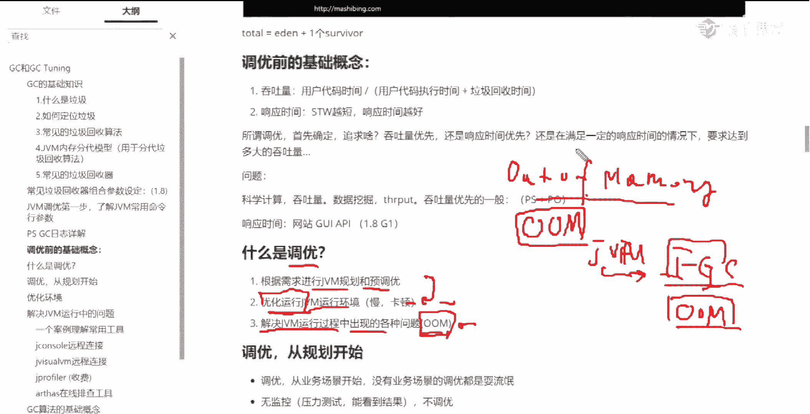

对说不定就是代码写的烂，我告诉你。

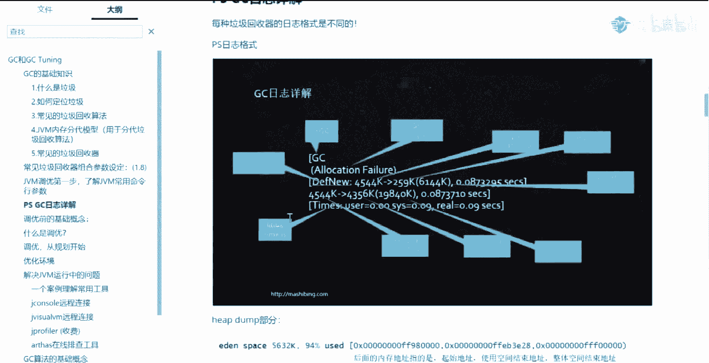

我今天我我我给你讲完，今天那个就今明两天我给你讲完，你的面试，你的简历上会写出来，有过实战调优经验，但是面试官一定会问你怎么产生的问题，我告诉你，你要是不贴近实战的那种，面试官一眼就能看出来啊。

写了个list的，有成员不断的往里往里装，也可以太土了太简单了好吧，我回头教你十种高级的老师给你准备了十种案例，知道吧，你随便挑啊，一定让你在面试官那过得去好看，这里我们一步步来，先针对ps加p。

这个题的第一步，我们先了解jvm的常用的命令行参数。

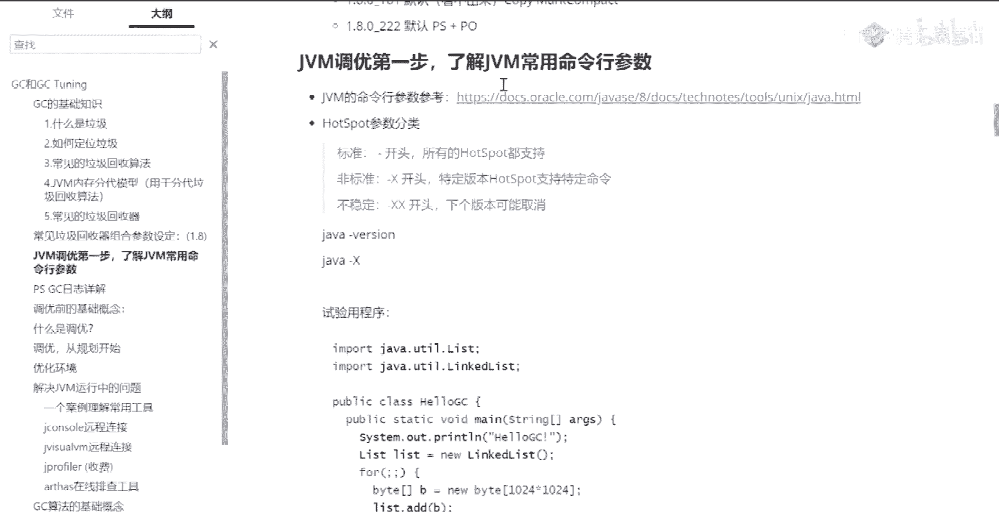

昨天说那个老师这版本常用名号参数还有什么可了解的。

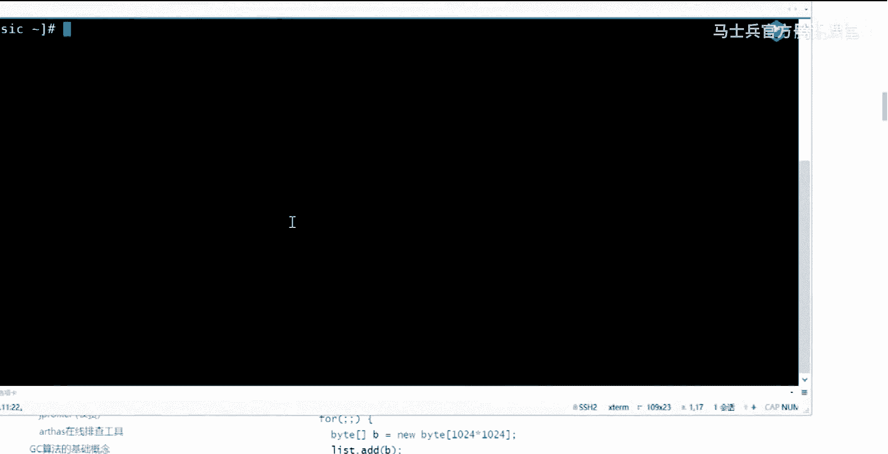

好，先注意啊，我这里环境全是linux，咱们后面聊调优，你不不要跟面试官聊，我是在windows下做调优，面试官直接大嘴巴子呼上去，你就可以撤了啊，mr demo，我是面试官，这十种我会记下来啊。

没关系，我们vip还有十种，一共有20种，哈哈哈，windows打了我这个还要我讲，有多少jdk是跑在windows上的，你告诉我，好看这里啊，我们先来聊呢。

就是这个我先先认识调优的这种最最基本的一个操作，你得认识java命令参数该怎么玩，我平时呢就是直接什么java t就直接开始执行了，但其实呢java有好多明狼参数，命令参数呢本身有好几种。

直接敲你会看出来以横杠开头的一堆参数，看到了吗，刚刚那个什么version啊，这些个说version啊，杠x等等，呃这些呢就全是这种叫做java的标准参数啊。

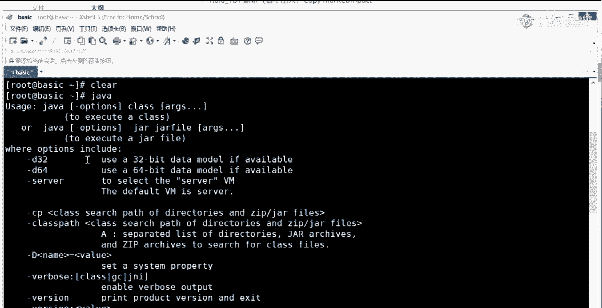

这些叫标准，这些哪个版本都有，哪个版本都能用，这叫标准参数。

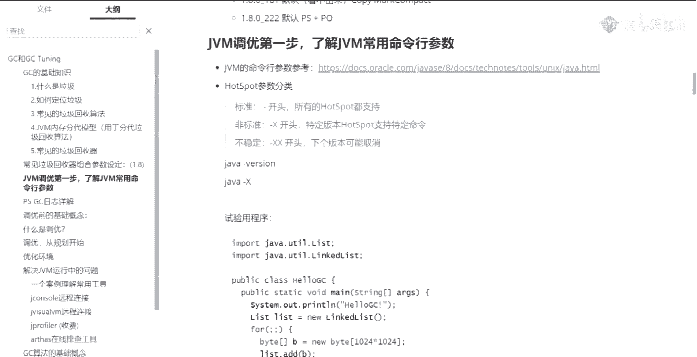

非常标准的好，还有一种参数把windows给干掉。

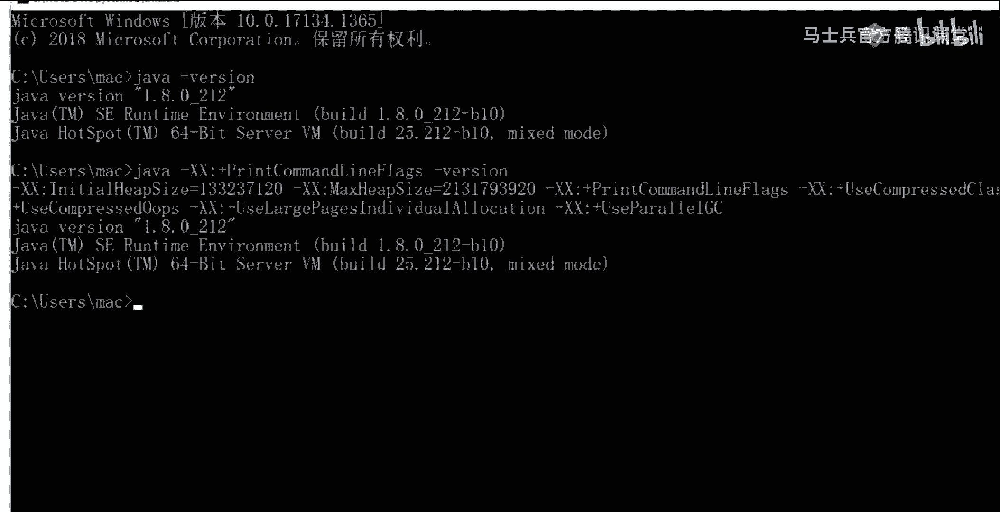

有点是点了，还有一种参数就是这个参数看到了吗，这个杠x杠x开头的叫print hon nonstandard options，你跳一下java杠x回车，你会看到一杠s开头的又一堆好。

这个参数叫做非标参数。

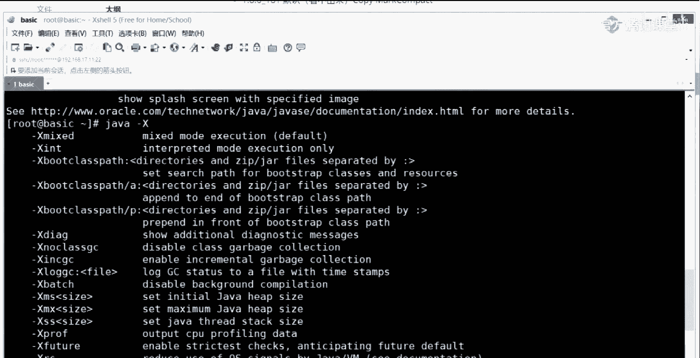

看这里特定版本hot bt支持的特定命令版本变了，这里面的x开头的命令有可能会变，所以这叫非标。

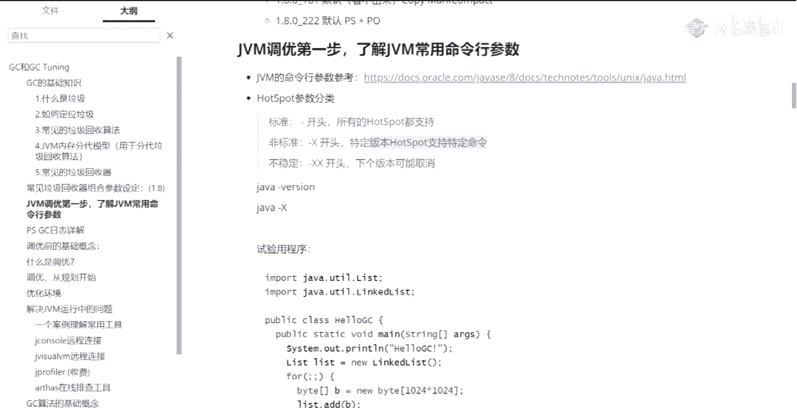

这个大概也有个几十个吧，像我在那个这个那个前面讲完的时候给大家讲过，这个就是mixed到底是优化的，还是说是那个那个纯纯纯解释的啊，当然还有纯编译的都可以，这两个参数这里面有几个参数呢。

我希望大家记一下，大概记一下就可以了，就这个参数这两个参数，这两个参数我觉得作为调优，或者说作为那个设定，你这边参数来讲，基本上是属于必用的，自己自己看一下，xs后面跟一个size。

x max跟一个size是什么意思呢，said initial java heap size啊，所以最初始的堆大小，maximum java heap size最大堆啊，刚开始的队最最和最大堆。

当然还有m x m n之类的，那就是说年轻代好看，这里。

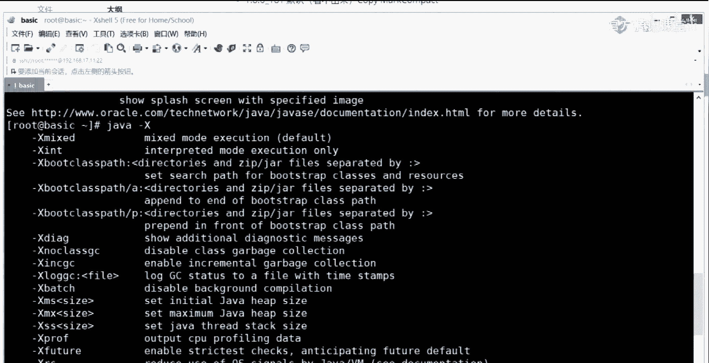

到现在为止，我们接触的参数前前后后，加起来就几十个吧，哎可是很不幸的是，我们大多数的调优都是要以杠xx开头的参数，太不行了啊，那么杠x x开头的参数到底有多少呢，不好意思。

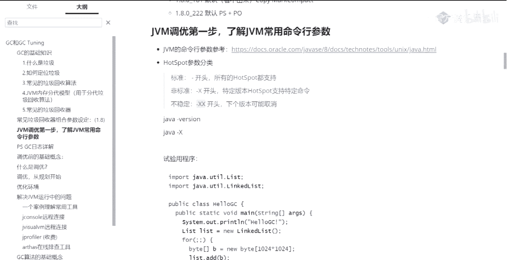

你找不着他有多少，你不知道他有多少，他没有。

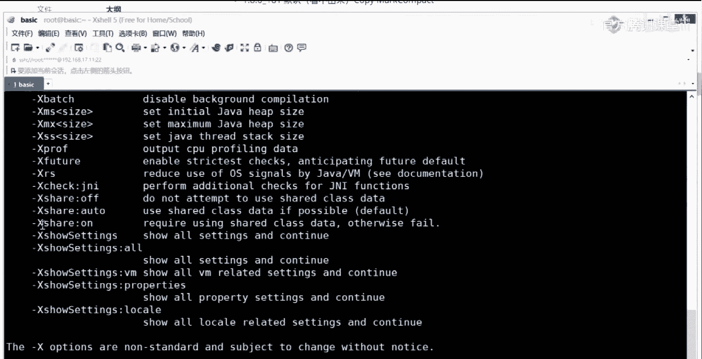

他没写出来，有同学说有没有一个列表给我，不好意思没有，i'm sorry，没有刘耀文档给我没有，你说oracle得多恶心，简直能他妈气死人，就当初找找这些文档，找这些命令，没有全的，没有，这两天参考。

这就这就算比较全的了，我给你自己去看就行了，但是也就讲了几十个而已，大家听我说有一个参数实际上是能够把所有的全打出来的，看这里这把，装x加上pflag规则comments好。

这个参数呢大家可以记一下这个参数呢叫print flags with comments，什么意思，with comments，解释把那些个所有参数打印出来，并且带着解释给打印出来，哇，有这个太爽了。

哎很不幸的是，只有第八组版本能用，所以同学们下一步要干嘛，唉自己去编译一个jdk，好不好，编一个jdk编译成debug版本，你就可以玩了，别着急，还有还有办法。

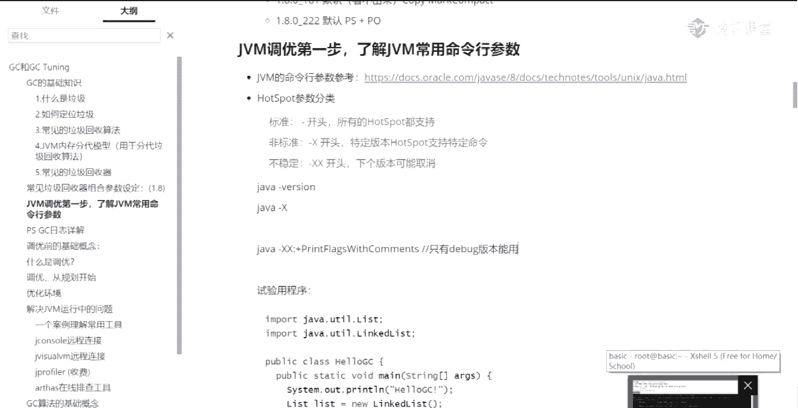

再看这里，标杆杠s s加上play tonline flex，这个不行，还有个办法叫什么呢，叫print，flags，then print flags，这两天睡得太晚了，脑脑筋有点不够，使对没错。

就是它啊，来print flags final，还有一个呢叫print flags initial，哎，这句话意思是什么呢，就是把所有参数都给打印出来，它的初始值是什么，就默认值是个什么。

而flex final指的是什么，就是你最终设完了整个整个你的虚拟机起来之后，那些个参数值到底是什么，来我们看看它到底有多少，变墨了，wc 3 l呃，也不多，700多个而已是吧，不算太多。

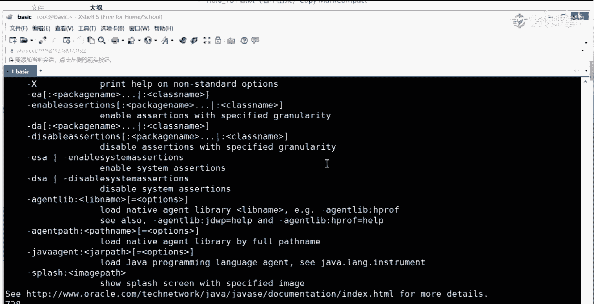

也就700多个唉，所以为什么这边调有比较值钱啊，大哥，哈这就别背了啊。

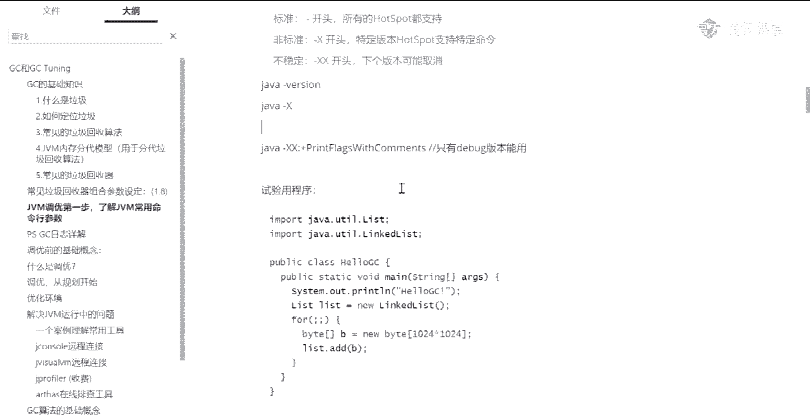

教你最常用的，因为在这个文档里头呢。

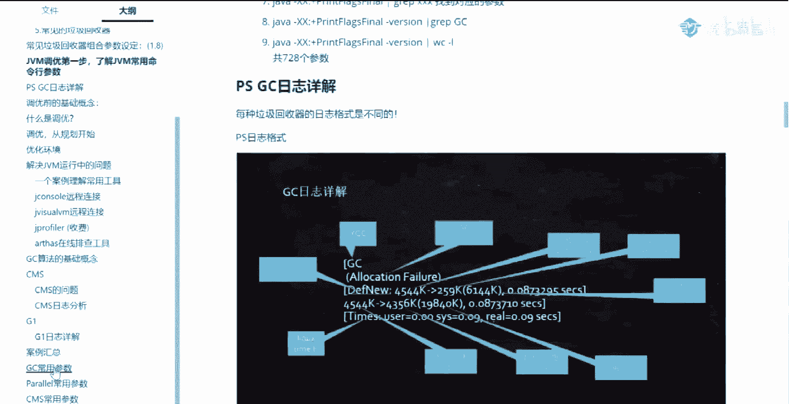

每一个常用的我都给你列出来了，看到了吗，就说两分钱值不值吧，谁都觉得吃的，那我下一步教大家使用常用的这种面料参数啊，我们直接用一个比较复杂一点的案例吧，这个案例还是太简单了啊，因为细节特别多。

我略过了很多呃，我们直奔主题而去好不好，如果时间够的话，我可以给大家讲一些什么三色标记这一类的，比较有可能比较常被考到的这些算法啊，这个明天看，明天时间好，大家看这里啊，呃在这里呢我们有一个代码。

我们是我们测试用的代码文档分享吗，分享啊，放心吧，当然分享了，老师分享的老师是特别喜欢分享的人，你没发现吗，各种都可以分享啊，这里你知道分享一个知识是学这个知识的最好的方式，好看这里啊。

我们来看这个小程序，这个小程序呢是模拟了实际当中的一个案例，这个案例呢你完全就可以写在你的简历上，跟面试官这么说，但这个案例相对复杂啊，可是我我就说越简单的案例，那那个面试官的肯定觉得越没劲。

所以你举案例一定要举得稍微复杂一些，这个案例你要好好消化一下的话，是可以做到的，好这个案例呢是什么呢，我们我们大致读一下这个代码，这个案例呢首先我说一下它的背景，这背景是什么呢，是有一个程序。

这个程序呢叫做风险控制的程序，风险评估，风险评估什么概念，比如说我们银行里头存了一堆人的信息，好这个人的信息，如果我贷给他10万块钱，我回回回不来的风险到底是多大，小额贷款。

还有这种金融这方面的这种的风险评估模型特别多，那呃对他电影会员工，当然这里面他个人的资料呢会非常非常多，我会把他的资料各种各样的都拿出来啊，比方说他是什么时候花过支付宝，什么时候还过支付宝。

花了多少钱啊，今年挣了多少钱，工资是多少啊，什么乱七八糟，各种各样的信息全有，然后呢在里面把数据拿出来，看看我能够给他贷10万，还是我能给他贷100万，还是我说我一分钱都不敢贷给他，因为他的信用太差了。

好了大家理解这个背景了吧，来get到这个背景的同学，老师可以下面我来解释这个程序是怎么写的啊，那我这种语怎么写的呢，这种语是这么写的，呃，比如说我就只考虑他的信用卡的信息，这个信用卡呢我就模拟了一下。

他的名字叫cut info，有同学可能在这里会抬杠，老师说，老师你给我们讲半天，全都是模拟的案例，来大哥，我就问你，我怎么样才能给你弄一个真实案例去，我告诉你真的弄不出来，别的我都可以给你弄一真实案例。

只有这个这种dc的模拟，我实在给你弄出真实案例来，为啥，其实你想想，如果说人家一个电商在那里运行了好长时间，然后才产生了一次这种o m，我怎么去把那个电商给你搭起来，然后再模拟给你跑个一个月。

两个月给你弄，弄出那个o m来，所以好多时候只能模拟，你只要听到这个魂儿知道吗，就听话，要听音儿，看东西，要看这个活儿，看这个根儿上的东西，你只要把这个理解了之后，回想你自己的做过的项目。

你完全可以把它套上去，一点问题没有，不在这种金融公司这么吹，明显假呀，这不是吹，你能不能把这里面的案例稍微换换呀，你就这么弱呀，大哥这学传统的教育都学死了，就得老师拎着你耳朵从头到尾给你灌进去。

你才能够接受是吗，看这里啊，这信用卡信息cadian f，比如说这是他花花的某个钱吧，big desigma price，然后呢名字年龄啊，这个生日等等，总而言之里代表的是他个人的一些信息。

当然这信息我再说一遍，实际上会非常复杂，根据这个信息，我会计算这哥们儿诶到底是能适合带多少钱，有没有风险，然后呢我们这个人开的金粉从哪里来的呢，肯定是从数据库里来。

所以呢我做了这样一个叫get get all card info，就拿到所有的cut info这样的一个信息，从数据库里头拿出来，放在一个list里面，ok我每次拿100条，我就拿了100条下来。

把这个东西放到这个list里，返回回去，别抬杠啊，不想听也可以待着，为什么要走呢，不想听哎，热热场嘛好看，这里下面我对这个模型对它进行匹配，叫model fit，看看是不是能对它进行进行匹配。

首先拿到这个list，我从数据库里拿出来一堆嘛，一堆模型拿到这个list，接下来for h每一个做循环一指的时候怎么干呢，我用一个lamba表达式，然后用一个线程池。

schedule with fixed delay，过一段来，过一段时间之后，每个人过一段时间之后再开始执行我这个方法m方法，m方法呢就是具体的来适适合呃，来匹配，来匹配我们整个这个这个这个程序的呃。

它它这个模型的这个过程啊，m方法，这个方法呢我们没写任何内容啊，因为这个匹配过程呢就没什么值得写的了，就可能匹配不匹配就行了，我们调这个方法就是每一个都拿出来，按照一个固定的时间往后delay一下。

然后就开始一个一个一个一个进行计算，接下来干了一件什么事儿呢，我在我的主方法里面，主程序里面我写了一个线程池，reer executor，呃，这个线程池里面的参数你要没学过的话，你肯定理解起来也费劲。

我就暂时不跟你解释了，很简单，就是50个线程的线程池，这是他的拒绝策略，就这意思啊，50个线程线程池开始运行，然后呢他就不停地从数据库里拿出一个list来，然后不停地进行model fit。

每隔100个毫秒拿100条出来干事，每100个每每隔100个毫秒拿一拿拿拿100 100条出来干事，就这么一个模型，这个程序呢看上去呢是没有什么问题的。

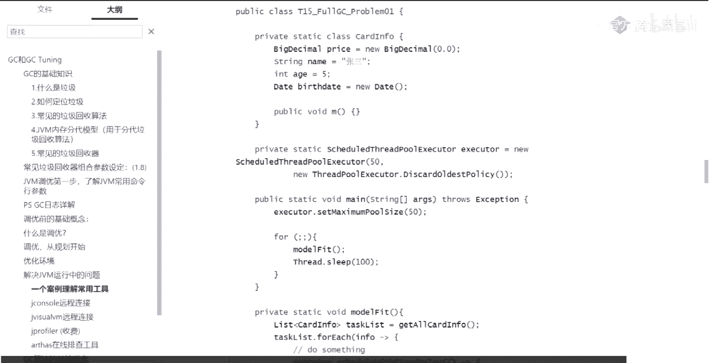

但是运行起来问题就大了，好你们不要给我带节奏啊，什么老师讲得快一些，慢一些的快，对你来说，你基础比较好，你就稍微照顾照顾基础不好呢，对不对，慢了也没有关系，你这人听上去总是总是会有收获啊。

当然这个bug呢我先不跟你说bug到底在什么地方嗯，回头你拿这个文档之后呢，你可以去查一查好不好，我们来执行一下，执行一下这个小程序。

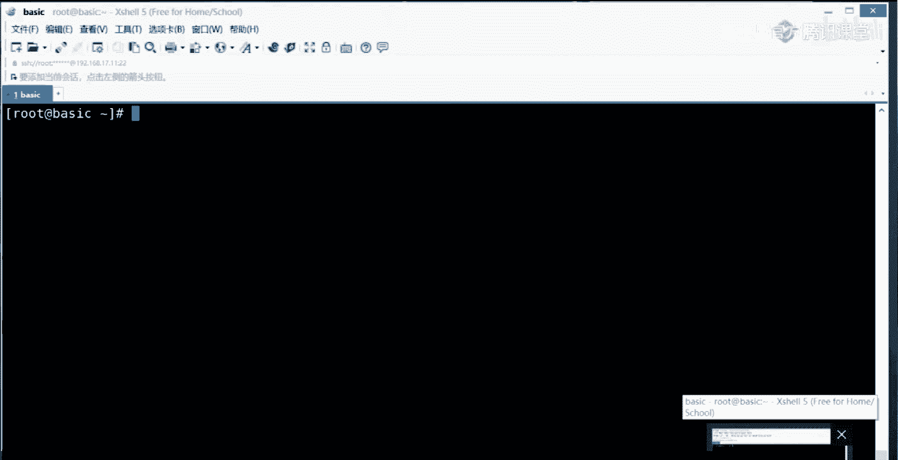

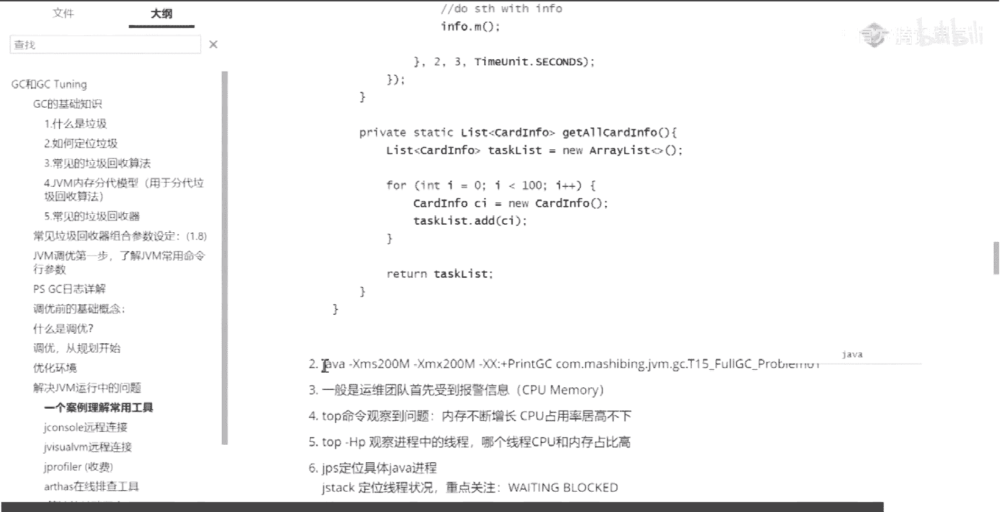

什么编译啊，乱七八糟的这种过程我都不给你演示，已经很给很给你省时间了啊，莫急好，大家看这里啊，为了让程序能够呃运行的时间稍微长一点，能够多演示一些命令，所以我把这个内存的调的比较大，还是200兆。

当然实际当中要比这大的多，如果你那么大的话，我估计你运行两天才能看见问题，所以他们必须得稍微调到200多小一点，跟x3 m s最小200兆，最大200兆，来同学们问问大家一个问题。

为什么最小和最大是一样的，为什么，这个大家能能理解到吗，能get到吗，唉避免没必要的扩容和收缩啊，你只说说扩容了，你一个最小的是这么小，一个最大堆事这么大，那么当你不断的在里边儿产生对象的时候。

pvm得不停的花资源来计算我下一步要扩多大呀，下一步扩多大呀，然后不用了之后呢，下一步缩到多少啊，下一步缩到多少啊，所以你如果确定这个程序就会用这么多内存，直接给它指定，这也是一个小小的优化方式吧。

好像xx叫print g c，print g c呢，这个参数比较简单，然后执行这个小程序回城，我再起个终端，好每天来看这个小程序，gc education failure，多少章到多少章啊。

花了多少毫秒，没有关系，一会儿我来给大家解释dc的日志，今天没有的话，明天给大家解释清楚啊，莫及，ok gc开始了，现在我们想象一下，开始闭上眼睛，开始你的想象，这个程序是你写的程序，闭上眼睛讲啊。

所有人都close your eyes，来在你的现在，在你脑子里开始浮现这样一个场景，你写了这么一个程序，把它放到了线上，然后运行了很长很长时间了，好，谁会发现这程序有问题谁呢，谁会发现程序有问题呢。

客户不我跟你说，客户只是会反馈比较慢，比较恶心哎，一定是运维同学们对报警系统对你们说的没有错，所以在你实际的工作环境之中，比较好的公司会配专门的预警系统，运维监控系统，监控系统会发现一些问题。

那么监控会发现什么问题呢，看这里我们来看它的问题出在哪，要带一个命令叫top，这个面料比较简单，就是列出来目前整个系统之中对于系统资源消耗比较高的前面的程序，当然网管的系统一堆一堆的。

不一定是这个命令产生，也有可能是报警产生的好你仔细看，我们有一个1239的这样一个java的程序，它是占了22%的cpu，11。4%的内存，有同学说不高啊墨迹，那我再提一个终端，格里尔一个简单的命令。

我估计大家应该都见到过gps，这个大家知道什么意思吗，就是列出来我们系统里头的那些个java的进程，有哪些个，它的进程号是1239，好看，这里就是他，所以对于网管来说，它会观察到时间长了。

它会观察到这么一个现象，什么现象呢，就是这哥们儿这个程序现在注意看啊，它是11。4的内存，再来执行一遍，还是内存的增长的有点慢啊，诶算你狠，还11。4，稍微等一小会儿哈，内存它就会不断的增长。

因为这时候还没有占满我们200兆还是挺大的，我跟你说这个小程序的bug特别恶心，这个小程序会引发什么样的情况呢，它会引发有可能啊，你看啊，现在已经变成13。7了，看到了吗，刚才是11。4，现在是13。

7，营长了，啊sleep太久了对啊，先不管那个是因为我内存设的也比较大，好这个小程序啊，他会把那个你平时看到的程序可能会产生的那些严重的后果，都会有可能在这个程序再产生。

他有可能会最后的结果是频繁fdc，知道吧，也有可能最后的结果是oom，而且这两个结果是不是固定的，不一定会产生那种这小程序还是比较恶心的啊，所以我是拿它来做典型好，你看到了这个内存呢在不断增长。

并且呢它不会回收，如果一个内存它占的比较大，但是它过一段时间之后就又少了，这个就没有关系，但是这个不是这个从11。4涨到13。7，知道吧，那好了，现在，你的网管就开始来找你了，o你闭上眼睛想啊。

一个美丽的网管走到你的面前，然后跟你说，哥们儿，你写那个有bug，然后啪一大嘴巴子给你抽醒了，你弄的这个内存都快占满了，什么情况，看现在是15。3了，你让他容忍他走下去的话，很快就是90%多99了啊。

好我就我就我们就不等到那时候了好吧，那这时候你就说啊，大哥网管都是大哥，对不对，来大哥，你能不能给我开放个权限，让我上去看一眼好看，网管这个时候说可以吗，如果是在一个特别牛的公司里头上了线的系统。

绝对不让你不让你上去，你放心吧，如果是这种情况，你就只能在你做做一个模拟环境，然后在那里不停的压测哈哈来模拟实际环境，看看会产生什么，这个我教大家啊，以后当然我们假设你能开始能够能够执行的单位。

或者你交往管，你来帮我执行好吧，也可以，所以现在比较牛叉的运维都是会jvm调优的，你懂吗，真的一点不夸张，比较牛叉的运维，jvm的调优，mysql的调优，各方面的tom cat调优他们都会好看，这里。

我们下一步呢说要定位出这个程序了，你已经知道这个序有问题了，那下一步你你怎么去进行定位呢。

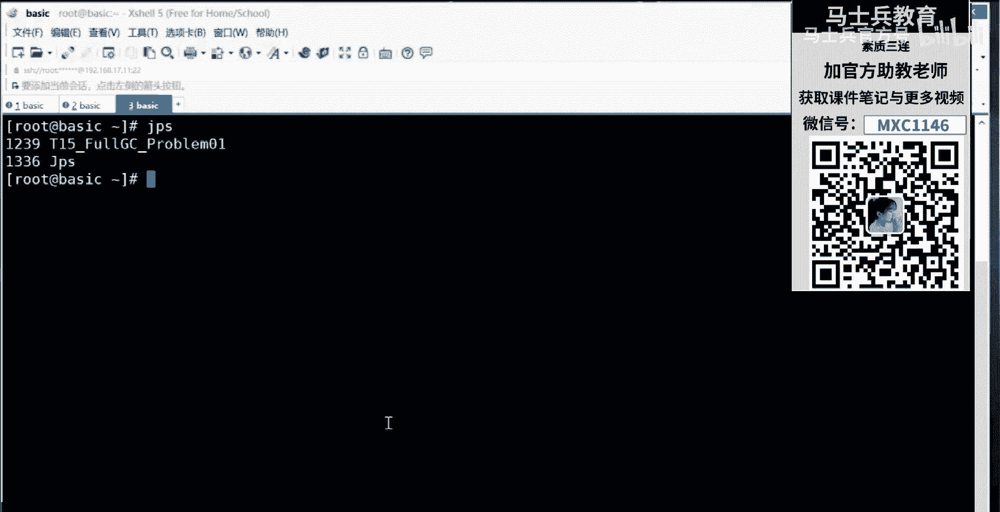

教大家几个比较常用的命令呃。

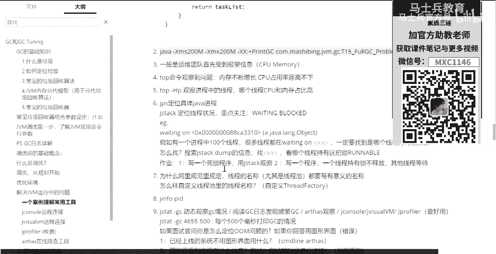

g p s我教过大家了啊，也不说了，我们来看这个这stg stack呢其实跟我们现在这个程序的关系并不大，但是我教给大家好，jdk是什么东东，this de的意思是打印线城站2239。

把这个进程里面的线程暂停打印出来，全打印出来了，我就不一一给你念了，这个js带的命令也是非常有用的，目前解决我们这个问题它没有用，但是它本身是非常有用的，你要理解这个jdk呢他干了些什么事。

这大概干了一些什么事呢，如果我们挑一段读一下的话，你就会发现了，这次大概干了这么件事，他说有这么一个见证，现在的名字叫pro 1 thread 33。

然后呢他就是自己内部的标号40priority优先级操作系统的优先级，tid nd waiting on condition，正在等待某一个条件，waiting on condition。

这个thread的状态是waiting，正在等待，因为我们有好多好多的县城，因为县城市里有50个，还记得吧，他正在进行等待，下面是这个县城里头呢，诶调用了哪几个方法，pk方法，这个方法，那个方法等等。

同学们，你们想想，看，来我我我我们动脑筋想一下啊，我来找一个比较标志性的行程，我来点克雷尔，嗯这是一个rable线程啊，这叫做attachlistener pthread，49啊，48等等，内线装好了。

最后面，这是我的main线程，看到了吗，我们的主线程它的呃state是time waiting，正在等着sliding，正在sleep，就是刚才我sleep的时候，正好把他这个新轮战给他抓下来了。

然后呢你看啊这个may may方法的调用了sleep方法，对不对，main调用了sleep，但是sleep如果再调别的，还会一层一层往上走，所以这个jdk干了一件什么事，大家我相信大家能get到了。

这次带的是把每一个线程揪出来，然后呢他会把这个每个县城里面哪个方法产生的这个县城，我这个县城正在执行哪个方法，这个方法又调用了哪个方法，又调用了哪个方法，目前这个线程的状态是什么。

是在waiting还是在干嘛，还是在running，还是在time的waiting，还有如果他正在waiting的话，它调用的是哪个方位上的，正在waiting object weight好。

他正在weight哪个锁，当object monitor正在位置在哪个锁上，这是那个锁的具体的编号0x是没有是什么，所以这代表有什么用，来同学们告诉我，当你看完了他的输出之后。

这back将来对你调什么样的问题会有用，能够猜得到吗，对检测思索对，没错啊，所以如果你的程序有可能会产生思索的时候，用什么来做jazz dk。

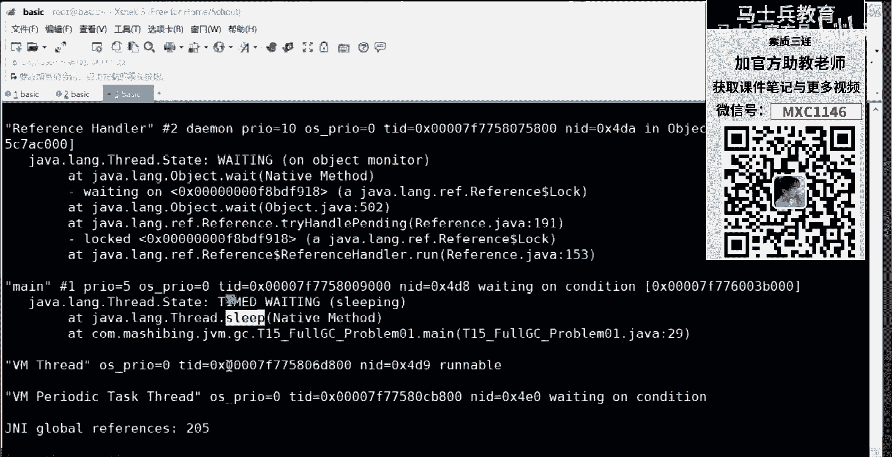

this deck，当然这个this deck呢对我们现在这个程序没什么用，我教大家而已啊，你要观察它正在哪个锁上产生的思索啊，这个锁呢是一个哪个哪个类的对象。

这个时候你就很容易定位出来你哪个程序是产生思索了，我也给你写了个例子，自己去读好吧，好这里也能再给大家扩展一个小小的知识点，大家读过阿里的规范吗，阿里的规范有一个华山版，最新的。

阿里的规范里头它有一个规定县城的名称，尤其是县城池里面的一些县城，要给他一个有意义的名称，都要写有意义的名称，当然这个你要是没学过老师的表演，程高并发你你也不知道怎么写，有一个名称。

因为你得定义three fk，这个我们先不管，就是在阿里的规范里头要求规定必须的，每一个县城都得给我写一个有意义的名字，你不能随便瞎叫，为什么能猜能猜得到啊，原因是什么。

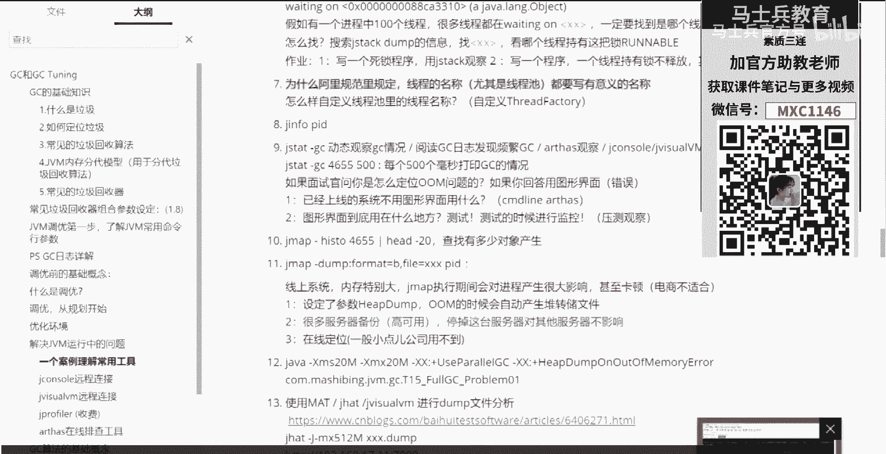

方便定位问题，你比如说这个县城，他名字叫p1 thread 1，他现在到底干嘛呢，我靠我不知道啊，案例产生的那种，这代产生像他那种都是是成百成百成百个线程，你从这县城里头要揪出来哪些个有问题的类似你好。

所以这个文档到时候去哪领，上网搜吧，这文档去哪去去哪找份文档，还得让老师教你啊，哦看这里。

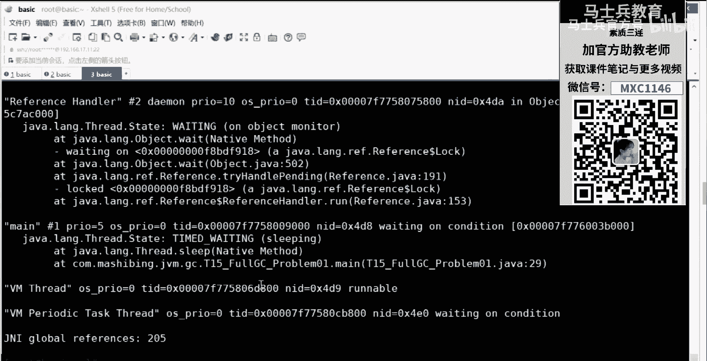

我用的就是这四个deck杠l g4 杠l可以搜索特定的思索情况，并不是所有的情况他都会嗯嗯弄出来，所以你最终呢该读还是要读啊，这个没有这个没有招好，就要带这个命令，我们再来看下一个命令。

这个命令叫这info。

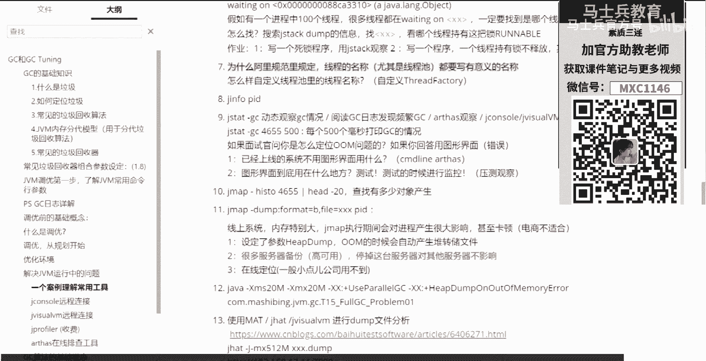

看这里这一份比较简单，这infer info呢就是你那个目前这个县城啊，这个这个这个java的进程就什么1239吧，好这个进程呢它的一些个虚拟机的一些信息，唉，你比如说你的这个线程。

它的run他们的名字啊，他是谁提供的呃，它的各种的class level class path啊，就这些这些信息，这是用java可以来做的啊，你读一下，你看看它的这些参数到底是怎么做的是吧。

年龄代表多少，老年代表多少等等，读这些参数的，这里面其实有两个特别好玩的参数，我要有时间弄啊，可以给大家讲一讲，这里面参数是不是跟cm是跟那个那个那个是没有关系的，跟那个垃圾回收有关系的啊。

这个也是面试第六比较恶心的问题，大家先记着吧，如果我忘了的话，找时间问我，我给你讲给你们听，就是这道面试题，这道面试题，为什么压缩指针超过32g会失效，这是一个特别恶心的，没问题啊，好看这里。

呃这个参数其实这个命令呢也就是读一读而已，没什么太大用处，我们继续看。

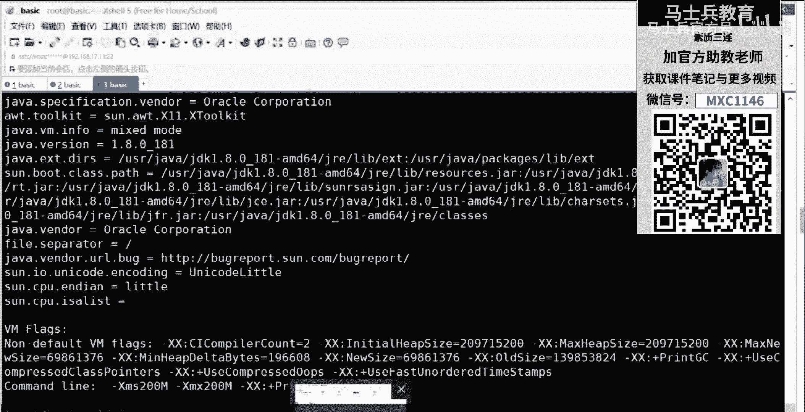

第三个情况，这个是特别有用的，如果你在没有更先进工具的时候。

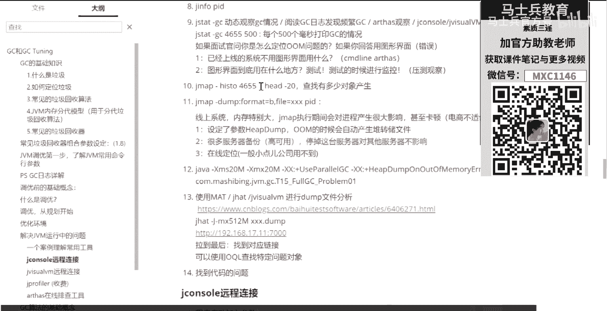

你用这个名字来干涉这state gdc j4 倍的杠，gc 1239就是他会干嘛呢，他会给你输出这些这些情况，老年代占了多少，被占用了多少，一定取掉了多少，survival，零占多少。

一占多少等等这些信息，只不过这些名字显示起来的让人读起来特别的不爽，可读性特别差，当然gt gtz呢它还有一个，参数是可以指定每隔多少毫秒，你给我输出一次，每隔多少毫秒输出一次。

这样的话呢你就更有意义了，大家记得有人没东西就行了。

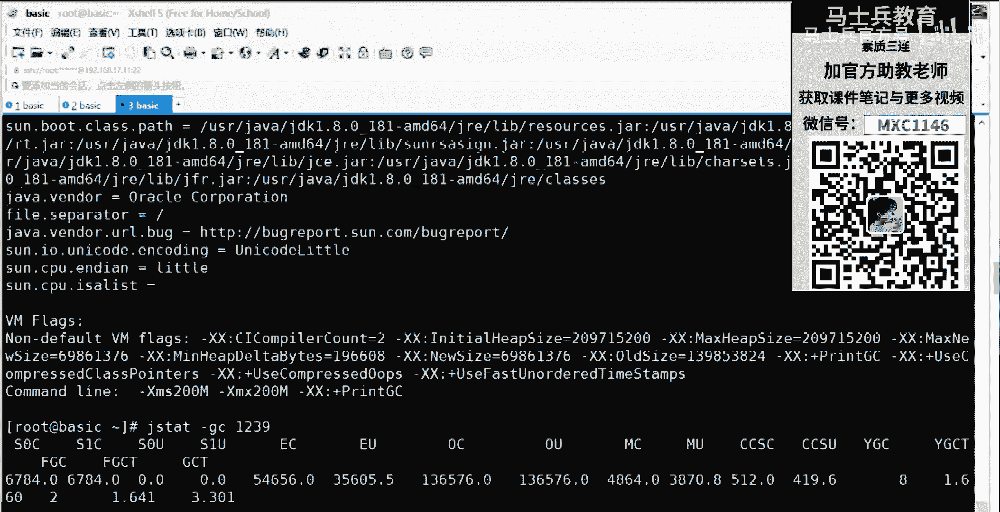

还有同学说java东西太复杂了，我想到现在你们觉得很复杂吗，真的觉得很复杂是吗，我告诉你，你去写那个就我家姑娘半天就能学会的，那个小孩们编程用的那个语言，那个不复杂，你知道吧，唉但是不值钱。

那个叫scratch，好看，这里还有一个命令叫j mag好，关于这个命令，我们明天再讲好吧。

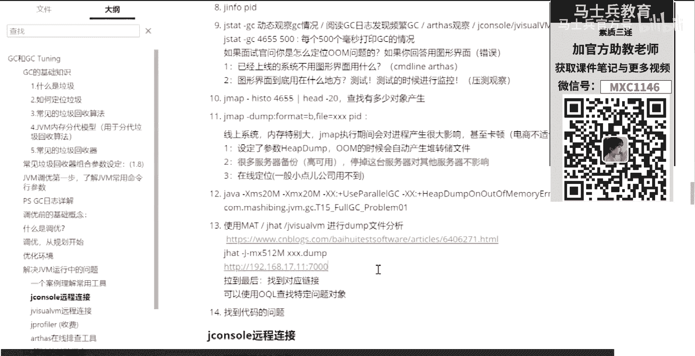

ok有同学说了，老师你讲了这么多命令，感觉都不是很友好啊，不是很友好的原因确实是他初始的这个命令行用起来相当的不友好，当然有同学这时候就会说，老师有没有图形化的东西，有没有来，同学们告诉我。

如果有什么要问你，你当时怎么调优的呀，你说你挂了一个图形界面，这个图形界面是什么呢，叫做j visual vm，有没有呢，当然有，有的是，一堆啊，我告诉你，我给你打开来看看。

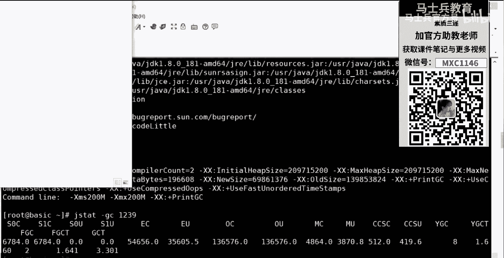

可，这东西呢我得给你抓住主线，千万别跑偏了，一跑偏东西就多了，主要是主线没有那么难看，这里这dk一点八，java自带的工具，这visuv m，比如说，我们要是监测我们某一个java进程啊，我把它。

本地的哦，我的我的那些家用进程都没都没起来啊，这个时候呢哎你就可以本地的进程，你就可以跟上去用这种图形化的来进行监视，看到了吗，哎堆战多少了，matter space占多少啊，cpu占了多少啊。

装了多少个class啦，整个整个县城进城的这种活动的总数了等等，现成的抽样，还有呢抽样器，我现在有多少个，我现在有多少个实例啊，什么东西有多少个实例啦等等，全都显示在这里，爽不爽可以吗。

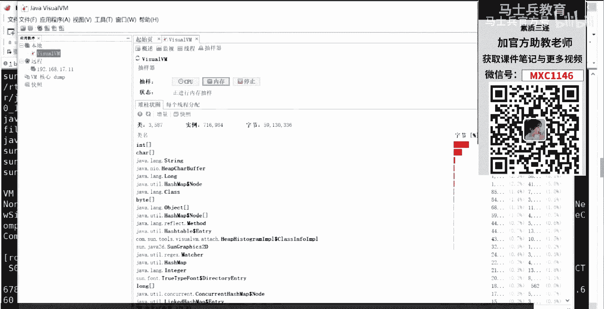

我要教你们这个可以吗，好你要跟面试官聊，说我用的图形界面调优，面试官一个大嘴巴子呼上去好吧，你见过你们家服务器有的有有在你们家服务器上装图形界面的吗，有没有，没有吧，哎我看有同学已经说了。

不是可以远程吗，没错这是你们的linux服务器，然后呢，京东的你为了远程进行对它进行监控，开了很多很多的端口和协议，以便我们的jvo vm能连上来，我问你多少个控制安全的网管，允许你这么干，有没有。

把端口给你打开，所以你跟面试官这么聊，面试官要是稍微理解一点就干就就干，你不专业，听懂了吗，这肯定不行，这是为什么我就教你命令行的原因哦，那有同学可能会说，老师我把它当p下来，你要说把它当不下来。

大嘴巴子准备好吧，直接就给你一大嘴巴子dump下来，你知道一个dump下来的文件有多大吗，大哥试过吗，你知道在你dump的时候是需要执行一个j map命令，你的整个程序要暂停的，知道吗。

一个实际的这样的一个dump文件，在那种性能稍微差一点的机上做分析，要花一天左右才能运行完，不告诉你，什么时候也可以dump，就只有一种情况，你们服务器崩了，只有这种情况下，你可以dump。

除了这种情况之外，你说我他正在运行呢，我给他当不出来，可以有这样的命令可以做到，但你不要跟面试官说，你是这么干的，难了难了啊，我告诉你，好看这里那里人怎么办呢，当然就是使用命令行，有同学可能会说。

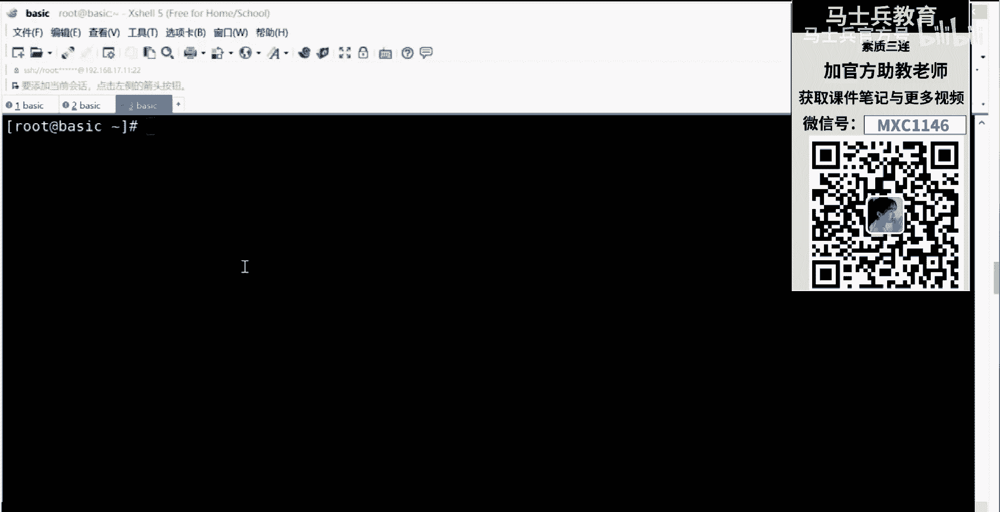

那老师这么一大堆的这种图形界面没有用吗，我在讲vip的时候也讲过这些图形界面。

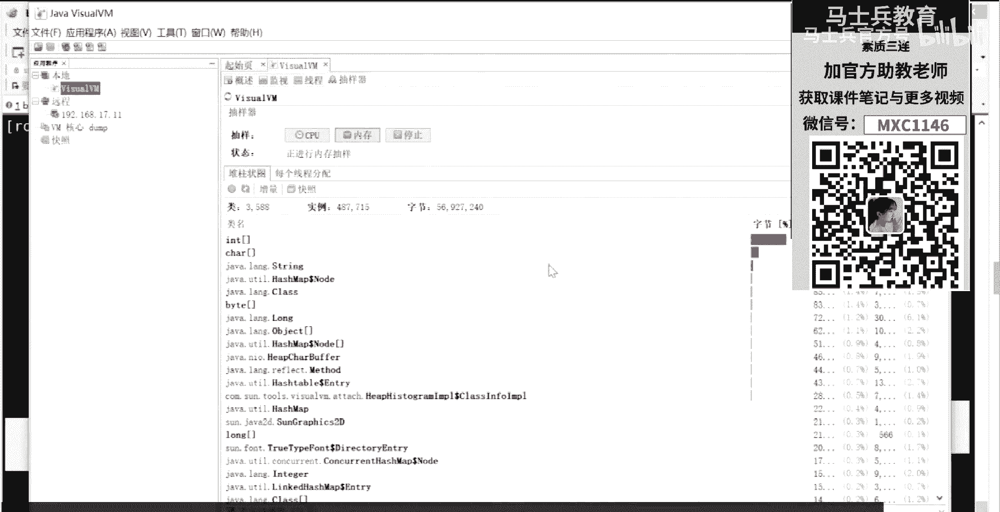

但是呢我告诉你这个这个不是说没有用，如果你说用过图形界面，用在什么地方，听我说在一种环境之下，就是上线之前的内测，比如说你游戏服务器放上去，在这里跑着，远程挂个界面，甚至在这里开个图形界面都没有关系。

你挂上他监控着它，这时候玩命给它做压测，看看它会会不会产生一些我们预料之中有可能会产生的一些问题，所以在压测上线之前的大量的压测好图形界面上没有问题，听懂了吧，那get到同学给老师扣一。

ok注意我接下来讲的东西很多都是真正实战之中的人们怎么用的啊，我告诉你网上很多讲的呢是那个理想化的，听懂了，非常理想化的，看这里这哥们已经开始复dc了，不停的复dc呃，我们先不管它呃，下面我们来看呢。

在实际当中我们用什么，实际当中呢，我推荐使用一个工具，这个工具呢刚才有小伙伴已经打印出来了啊，它为了博取我的注意力，我已经看到了这个工具叫arth好。

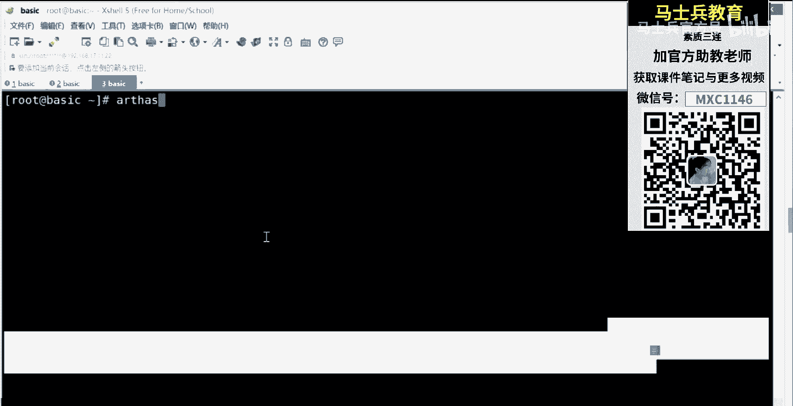

关于这个工具，我觉得我不想在这里跟你专门的聊他怎么安装这一类的。

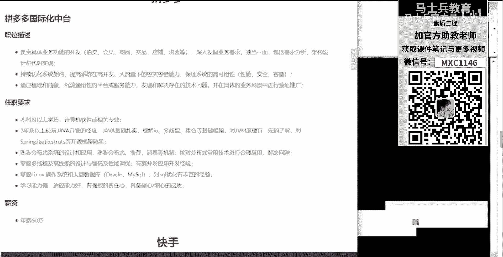

好不好，没意义，office。

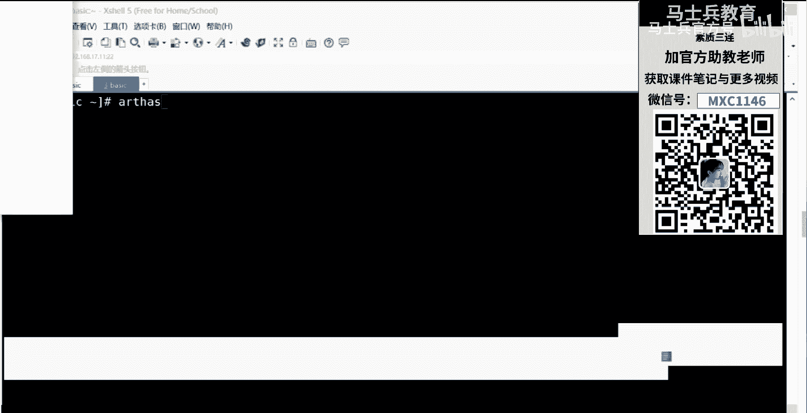

这是阿里的开源，阿里开源的一个工具，哎我去还防不了。

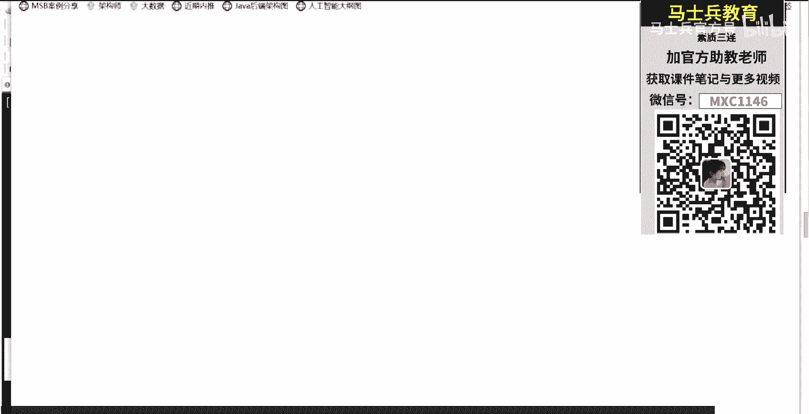

好这个我就不给你们看主主主界面了，显得有点慢，你们自己去搜office，这工具一旦扔之后，挺好用的，非常好用呃，也推荐大家使用那个阿里内部，他们也他们也用好吧，没有阿芬怎么办，运营不让装。

如果运维什么事都不让干，那你就只能用刚才我给你讲的特别土的命令来看，听懂了吗，那个都是java自带的，但是assets是可以装的，assets可以装，是为什么呢，你不用看任何的端口号。

你给我装一个程序就完了，哎那么dos安装运行下载，我不想跟你讲了，可以吧，哎可以的，同学给老师扣一下载安装，我不想讲了，ok，这个你还要老师讲的话，有点过分了就好了，那我看这里我都是都10。20了。

嗯我们把阿斯起个头，大家伙呢也可以自己装上，明天呢我再来讲详细的过程好不好，同学们，我先给大家起个头，这鸭子怎么怎么玩呢，我装好了之后呢，解压开，解压开之后呢，它是呃一个目录中不中，叫什么b3。

14版本a d a型b，然后呢我们怎么去运行它呢，这么来运行最简单的运行方式，java dj执行一个站文件，哪个文件呢，就是office不点炸，office，就等下，这是一个纯命令行的东西。

好ok他找到了一个java process，我们把它attach上去挂上去，这个是一它的编号，内部编号是一，所以我们敲个一早就挂上去了啊，try to attach，想attach上去不行。

我这程序是不是已经挂了，我怀疑，居然也太不上去了，啊已经out of memory了啊，sorry，这个挂不上去了，怎么着，我重新把它起来里先把这东西起来，我重新运行office，来挂上去。

好当你看到这个界面的时候，说明已经启动，并且挂到了你的java进程上，你看到了office目前正工作在1459这个进程上，好到现在为止，你可以用用office来干我刚才给你演示的那些命令行干的事儿了。

os呢除了具备那些命令行的所有的功能之外，当然除了一个命令行工具，就是这个g map，这个g map as是没有覆盖的，除了他之外，因此在af aths里面，大家用了一个工具就已经足够了。

以后就在它里面玩，所以你说你以后写到你简历上的时候，说我有过实战调优经验，拿什么调的，用它听懂了吧，呃今天呢已经10。20了，咱就不继续了，明天我们继续好吧，呃今天呢我留给大家一些大一的时间。

如果大家有什么问题呢，你都可以问好吧，随便问啊，这v的所有问题随便往王老师这招呼，老师长得像岳云鹏，我去，你能不能说我长得像，岳云鹏也太那什么了点儿，嗯嗯哈哈哈，开玩笑，岳云鹏就岳云鹏啊，啊别着急。

你们那我去好那个那个技术问题，技术问题慢慢聊啊，你别别刷，哎呦我的妈呀，别刷，现在老年代一比二一比三一比二，老师最近有出书，我们自己写的内部的那种呃，给学生们用的教材，除了这c多久一次正常。

这个不一定看你内存多大，还有你的应用的情况呃，有的什么一次都算正常，有的可能一小时一次都算不正常，看你内存多大吗，你你一个你一个你一个天文广场，这要是说你一小时就一次，你自己想想它正常吗，不可能啊。

一小时就以为它灌满了，他能正常吗，om怎么调u om了，那不叫调优，那叫调错，调错的过程，明天我讲给你听，我教给你怎么把它定位出来，能讲下安全点吧，杨怀大家别刷了，杨怀都已经刷过好多遍了。

杨淮是我们的vip中p，因为他是杨玉环的弟弟，名叫杨环，开玩笑开玩笑啊，呃诶哪去了，vip中心安全点cp，4号是什么概念呢，我先给你，我给你讲大体的概念，大体概念是什么概念呢，就是说你看啊。

这是我们的正常的工作线程，我们的业务逻辑线程，我们的业务逻辑要让它停下来，我们来我们垃圾工作线程才可以启动，对不对，在停这个现场的时候，二话不说，夸机所有的全从我cpu上给拿走了。

直接把我gc gc线程挪进来开始运行，不是那么回事儿，为什么呢，因为有的线程你比方说正对这个对象上锁呢，上了一半，你能让他停在这儿吗，不行所谓的safe point指的是什么呢。

指的是我们这个县城得停到一个合适的位置，他停下来的时候呢，不会对前后的一致性产生影响，这个叫c point，好吧，写屏障也是上锁嘛，这个写屏障注意就是说这位m里所提到的读写屏障。

和我们平时所说的wallet tel的那种内存上的那种内存屏障，是完全两个概念，这个读凭证写篇章的意思就是说什么呢，说的是当发现jvm在执行某一种操作的时候，我跟上去做一种背后的操作。

这个解释起来比较抽象，我给你举个例子，你就知道了，你比如说看这里，我们说一个复制算法，a对象指向了b对象，然后b对象所在的区域要被回收了，它被回收的时候，他怎么被回收到，它会把它复制到另外的区域里去。

不管是survivor是什么，把这个对象复制过去，那么同学们，你们想一下这个地儿的引用得跟着变，就是原来我这个地址值是指向这儿的，我最新的地址值得指向新的，好get到同学有点扣一，这个阶段听懂了吗。

好那指向新的是什么意思，注意这个过程对我们程序员的调用，我们乘务员正好要调用这个引用，怎么办呀，你这个引用在正正在变的怎么办呀，这个时候就是在他挪动了之后，相当于在内存里面写了个新东西。

然后这时候产生一个屏障，屏障的意思就是在他挪动了之后，我马上跟进跟进做一件什么事儿，把这块给你更新了，好，这块同步性的给你做个更新，就是任何一次的垃圾回收在挪动了对象之后，原来的引用里面的值得进行更新。

但是这个更新过程对我们用户是透明的，你是看不着的，你还可以直接访问这个引用，这个东西叫post right barrier，叫他写后的一个评论，等他写厚了之后，顺带的做一些jvm内部该做的一些操作。

这个叫凭证，这个叫post right barrier，叫完成完完事儿之后的写屏障，好这点get了是吧，为什么阿sir为什么屏蔽它，没有屏蔽他，只是没有实现这个功能啊。

现在在290废弃的原因cms毛病巨多，cm，我刚才也说过了，他一旦碎片化完蛋了之后，我告诉你一次垃圾回收就卡死你了，他用serial old的垃圾回收，你自己想想，整个服务器啥事都不能干。

其他县城全都给我看着，那什么时候都跟老太太扫完了，程序继续，哎你们别刷没刷没刷，g c a怎么判断，你这句句整个句都不通，重新来重新问，总文档的这些应该都有吧，嗯这个文档是公开课的文档。

能让你在简历上写上有一定的经验，能让你入个门呃，很多的细节的一篇文档也是装不下啊，我因为那个我给你讲一个g1 ，给你讲一个z d c的话，没两个小时基本够呛，拿不下来，十分钟啊，十分钟结束啊。

呃配合docker部署方式调30可以用这个吗，可以啊，你等会儿你也得占内存啊，你占内存它它它产生o o m他还还会会有问题吗，先生没有jdk，jdk依赖如何调整是几个意思，什么叫jdk依赖。

没听懂为什么压缩指针32g回事哦，对想给大家讲这个问题来着，首先首先首先你们知道什么叫压缩指针吗，先说这个大家知道吗，问题比较复杂，就问题讲完，估计今儿就可以下课了，这样，来看这里啊，咱们挑一个命令。

随便挑一个java杠x，嗯知道了，嗯flag the version就是交易命令之后呢，你会发现呢它有两个参数，看这里两三分是什么呢，网上很多文章把两个混在一起讲，我告诉你这两个不是一个事儿。

呃仔细读一下他的意思，这个press press这个单词啊，就是鸭的意思，它是一个词根，然后comm呢co是往里压，compress，comm是往里压的，意思是前缀，然后compressed。

你比方说还有什么啊，impress这个是往内压啊，111press，对外表达，其实它本质上就是一个词根啊，好像好像好像讲远了啊，sorry那个再说了，有机会再讲英语，我讲哪来的。

这个compressed叫往内压压缩压缩指针，画个画个图，当我们new一个对象的时候，new一个object new出来的时候，在内存之中，这个object分成四段，第一段叫mark word。

以及hash code叫mc word，这第一段占八个字节，第二段叫class pointer，这个class pointer是什么概念，class pointer的概念就是它会指向我所属的那个类。

你比如说我new出来的是t，它会体现我的t一点，class好，这个东西叫class pointers，好，这个是被压缩过的，本来正常的情况，一个64位的系统。

你想想看那大腿想想也应该知道它的指针长度一定是64位的，也就是八个字节，但是如果八个字节放在内存里的话，你的整个对象好名的呢多占了很多内存，因为你的内存呢唉也就那么小，四个字节装进去，它的寻址。

四个字节的寻址已经是四个机，其实多数情况下就够了好吧，所以所以呢好这个时候呢他就给你压缩了，这个指针是多少呢，是四个，是四个字节，是四字建，好下面这个呢是你的instant data。

就是你的那个那个那个那个成员变量装置装的部分啊，你里面有个成员变量啊什么的都装，这最后一个呢叫padding，叫对齐pin，对齐的意思是我们要对齐八字节，就是如果你整个对象不能够被八整除。

那么往往前对你，比如说你你到这，你这个对象是12个字节，不能没法整数，怎么办，加一个四变成16个字节，能够被八整除，这个叫做对齐，就是最后你这个对象大小一定是能够被八字节整除的，这是一个最基本的点。

八字节就是64位，因为你jvm的寄存器，你的机器的寄存器64位正好撞八个字节，所以特别合适，效率特别高，因此jvm读一个数据的时候，64位的要求八字节对齐，当然这里面有个参数。

你可以指定四字节还是16字节，随便你指定，但是默认八字节来get到这里的同学给老师扣一，那这个compressed class pointer指的就是把中间那个pointer那个指针给它压缩。

从八字节压到四字节，而后面这个compressed opp o p全称叫ordinary object pointers，普通对象指针，ordinary object pointers。

普通对象指针的意思就是说在你的成员变量里面，如果有一个引用，比方说spring name name等于一个字符串好，这个指针占多少，开启压缩的情况占四不，开压缩占八好，这是压缩这个压缩指针有一个限制。

这个压缩指针在你内存超过32g之后自动失效，同学们，如果你们有谁的机器真的有32g的内存，32g以上的，你们自己都有实验做什么实验呢，就是你啊我教你做这个实验，这个实验怎么做呢，我机器没有32g啊。

所以我没法给你做呃，这时间这么来做，你弄一个特别大个的list，把一堆对象装到这个list里，他永远都活着，一堆对象装进去，然后呢，你最后看一下这个list大概整体占了多少个内，占了多少的内存。

然后你设你的内存值超过32，你就堆内存超过32g，你看它占了多少，对内存不超过32g它占多少，我告诉你对内存不超32g，它经过压缩，这里面占的内存数如果是555 百兆，那么它超过32g之后。

这个可能变成750兆，你在不做任何参数指定的情况下，为什么，因为超了32g这个压缩指针自动失效了，他，到底是怎么实现，它到底为什么是32g失效啊，这个唉呀，唉复杂，尝试讲给你们听啊，最后一个题了。

讲完完事啊，今儿就到这儿，也就是说你你如果你的内存，你比方说原来你你干一件事，你们家内存32g啊，三三你们家内存20 24g，然后你觉得呢内存不够使了，你扩了一个36计。

结果你会发现呢同样的东西你多赚不了多少，因为超了32g那个压缩指针失效了，好为什么会是这样的呢，嗯是这样的啊，大家首先要理解一个指针，如果一个指针的长度压成32个字节，sorry 32位就是四个字节。

这是压缩之后它就四个字节，32位的指针来告诉我它能够寻找最大的数量是多少啊，二的32次方是四个g，四个g好，这点大家能理解吧，四个g对好，那么如果我用32位的指针。

也就是说我最多能支持的内存就是四个g多了，我支持不了了，那有同学说老师我靠，你照你这么说的话，你三你32级才不支持你这个32位指针，你压缩了32位指针，你这32位指针是怎么支持到32g的，很牛吧。

对啊怎么支持的呀，同学们，你们想想看，我是一个二的32次方，四个g的四个g的地址，但是你发现没有java的任何的对象啊，都是八字节对齐，八字节对齐啥概念，就是你这个你这个你这个对他来说呢。

你比方说01234567，你放心，这个222的这个位置一定不是个一定不是个对象的开头，你能理解吗，因为它不能被八整除，好刚才这句话能看看是不是该到了，就说我们比如有个地址，就是零个字节到七个字节这么多。

这个中间啊，我跟你说，这个字节绝对不是一个对象的开头，因为他是八字节对齐嘛，所以其实我这二转32分钟我可以用，我可以只得这个数呢，我可以零八哎，我跳着来自己看看是不是就变成32g了。

当然细节上它是补零的啊，它是补了三个零，好了好了，就到这里吧，好吧嗯，能盖到盖盖的都算了啊，这个gm知识面不是就支持的东西太多，这一时半会真说不完啊，咱们今天晚上就到这儿好吧，明天见，ok懵了。

懵了就算了啊，听懂听懂前面就行，明天咱们讲实战就就讲实战啊，算法一讲就讲蒙了，很容易很容易懵啊，明天实战实战很简单好吧，明天再见，拜拜，没关系啊，今儿听不懂的。

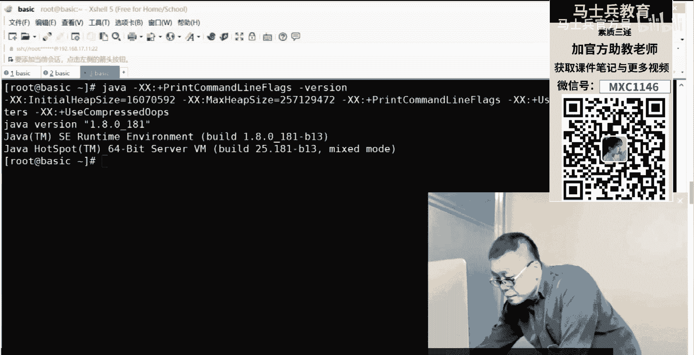