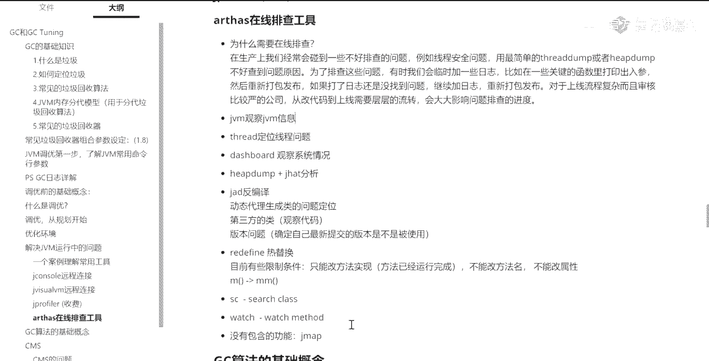
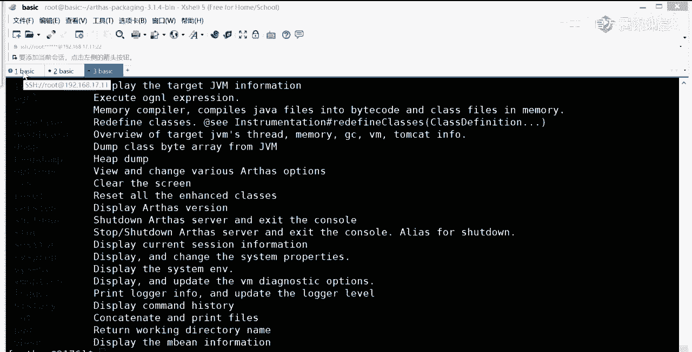
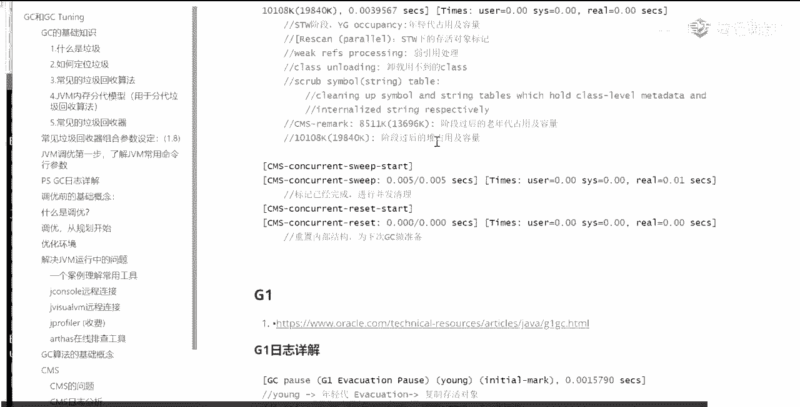

# 【马士兵教育】MCA架构师课程 主讲老师：马士兵 - P16：马士兵深入浅出java虚拟机⑥为什么一个百万级TPS系统会频繁GC？ - 马士兵官方号 - BV1mu411r78p

昨天讲的内容吧，好不好，简单回顾一下啊，我们稍微回顾一下，昨天呢我带大家呢主要是过了一遍这个东西，就是常见的垃圾回收器，垃圾回收器的一些常见组合诶，哪些呢是分带的，哪些是不分带的，哪些是逻辑上分。

在物理上不分带的，讲了这个东西嗯，然后呢我教了大家几个简单的命令来观察一下咱们这边的一些情况，观察一下dc的一些信息的给他列出来啊，交了那么几个简单的命令，然后昨天呢我运行了一个小程序。

这个小程序呢就是唉这个小程序，这个小程序呢是模拟了一个呃对于信用卡模型来做模型匹配，来做风险控制来呃做的这么一个小程序，了解小程序呢它本身是有些问题的，昨天呢呃大家伙也都看到了，然后在昨天结束之前呢。

我跟大家说过，我说呢呃在我们实际当中调优的时候呢，我们还有一个特别好用的工具，就是谁呢，阿里开源的这个arth呃，其实来教大家做操作这个事儿相对简单的多，呃我今天给大家讲完操作之后。

能让你的简历上能够大体写上有过jvm调优经验之后，看看能尝试给大家讲一点理论好吧，理论其实相对难好难好多呃，面试的时候问理论问的比较多，实际上你只要有个操作，那么别人问你的时候，你是做的什么操作呀。

什么情况下你做调优啊，这个东西能说得出来的时候，ok你这个简历唉就值钱了，今天他特别过分，我以前的学生啊，就是从做线上教育以来，学了我们课程的学生少着，大概学完课3~6月左右，少人能往上涨5000块钱。

今今天今天特别过分啊，今天有个学生只涨了2000，还好意思跟我说，太过分了，实在是太过分了吧，打破了我们一个记录，本来我们是原来的学生，差不多啊，每个月涨5000块钱，今天有一个只涨了2000。

但是他只报名，只报名了三天，哈哈哈，虽然他破了我们几个，我们还是很高兴的啊，好开玩笑啊，来看这里，那今天呢我主要给大家讲这个office的在线拍照工具。

ok回来回顾我们这个小程序怎么用啊，稍微回顾一下，我们首先呢把我们的利益程序跑起来，还是这个小程序让他跑起来，大家还记得吗，我们others怎么起来啊，就这个小程序呢，它有问题，昨天呢大家也看到了。

我们首先用top命令能观察出来它内存在不断增长，所以你的网管肯定会过来找你一个大耳刮子呼上来说，你这怎么回事，你赶紧给我调去好，你就给他调，你怎么调呢，哎你用几个命令来调。

当然昨天讲的那个几个命令都比较土，今天呢给大家也是java自带的，但它比较分散，比较土，用起来不方便，今天带大家呃用一个核武器，就是那个阿里开源的这个alice，首先所以啊这是这是原。

来我们需要需要调试的这个进程啊，需要调试的这个进程，他在这跑着，然后这个阿瑟斯怎么工作呢，阿瑟斯他自己也是个进程，他起来之后呢会attach到挂在上面去观察它里面的一些运行情况。

这里面呢是java自带的一个编程接口，叫jvm t i，如果你感兴趣可以去看一眼，就是others是拿什么写的，是这个接口叫jv m t i。

全称叫java virtumachine to interface，工具接口就是你可以为jvm写一些工具，通过这个gm ti来写的，就是就是拿这个写成的，我看这里，来不了，直接点了，这刚站。

呃os 5点站，挪一边去啊，好我们挂到这个进程上，这个进程是2176敲一，那么当你看到f4 这个界面的时候，ok你已经知道了啊，已经挂上去了，s命令有很多，我推荐大家呢，你直接到others的主页上。

就github那个主页上去看他的中文写的注释写的很详细很好，也不用去专门找找些书什么的，看，没必要，还有一个呢你就是用了一个help help，写的也不错，非常好呃，我一般就直接看help help。

它就会列出来，在下面呢你可以运行哪些个相应的与相应的这种命令，哪些命令都有这么多，还不key map s我就不一念了，特别多呃，我教大家几个好玩的，这个比较常用的，首先第一个呢叫dashboard。

dashboard仪表盘，仪表盘是什么意思，你敲回车的时候，你会发现诶出了一个用命令行模拟的图形界面，他每隔5000应该是每隔五秒钟刷新一次，如果没记错的话，当然这是可以指定的。

这里面给你显示的是什么内容呢，我想你一看就应该明白上面列出的是什么，最繁忙的县城有哪些这些现成的状态，它写成的名字，还有呢关于内存的一些信息，对诶占了百分之多少啊，一边去百分之多少。

survivor区多少，tenure的generation，昨天我讲过tenure的generation，就是o的区域，老年代占多少了，这个还有呢下面是一些运行时信息啊，操作系统的名字。

操作系统的version java version java home，这就这就不说了，好这个比较好玩儿，呃当然这个是看一个大体的情况，除了dashboard之外呢，就是dashboard。

你可以远程的去看它什么呢，哎去看动态的去观察它，看看这哥们儿老年代是不是不断的在增长啊，是不是老回收不了啊，堆的占用是不是不断在增长啊，去看这些，去看这些信息，还有哪个线程是最忙的，占了cpu占了多少。

这闲聊的名字是哪个，到底什么情况，他在干嘛，如果有人有线程不断的占占cpu诶，ok这个县城一定是有问题的，线程都占了百分之百了，查他怼的，ok这dashboard就干这个事的，来get到同学给老师扣一。

这个比较简单啊，不难，好我们再加help，然后呃在这个就是这java就是阿里的这个东西呢特别强大，他除了有一个命令没有弄完之外，其他的基本上全都全都全都完成了，好大家看这里啊，来我们再来。

我再来教大家另外一个命令，就看这个吧，jvm呃，display the target of information，大家还记得吗，昨天我教了大家一命令叫a fer，那我看出这位的相关信息。

阿里的这个gbm啊，这个命令其实比昨天我给大家教大家那个jinfer那个命令，它显示的更加的详细啊，他比那个要详细的多，呃，最好的是呢它能够显示出来，你到你现在到底用的是哪些个垃圾回收算法。

比garbage collectors，你现在用的是哪个copy market summary compact，ok你现在用的是拷贝，拷贝完了之后呢，是一个mark sweep。

再加上压缩所有有就是简单的说就是我们原来的ps加po，他的算法当然还有一些其他的信息啊，这个你自己去看就行了，这个不难，ok，啊没有clear跳，好我们说我下面我下面来教大家呢，教教他什么呢。

教大家怎么定位我们这个程序的问题啊，我们这个小程序一定是有问题的，当然他现在还没有显示出来，但是它有问题有什么问题呢，我现在教大家怎么定位，昨天大家观察这个小程序的时候。

你会发现他一会执行一段时间之后呢，对不对啊，这还得看一看，一会儿他我就一会儿等他频繁dc之后，我再来看他信息啊，你就了解了，我先教你别的命令吧，一会儿我们，回来看这个信息再看啊，呃教你一些别的命令啊。

你比如说，thread，这也是一个很有用的命令和，read的是把这个java进程里面所有的线程全给你拽出来，昨天我们讲过jdk，大家还记得吗，jdk是干嘛的，也是观察那些现成的信息的好。

阿里的这个thread和jdk的完成的功能一模一样，但是它用起来更好用一些，比方说我想观察16号这个线程，它的一堆栈的调用，并且呢thread 16 ok就可以了，你就会知道哦，这个16这个线程在干嘛。

他是在一个什么状态，它是在运行哪个方法，这个方法的标准站是什么，当然如果你一个程序里面现成非常多，你还可以进行过滤，thread说，may比方说may may may里面开的线程啊，全全都给他列出来。

ok全列出来，单位呢呃如果你像阿里的那个要求，每一个线程你都起了正确的名字的话，那么你就可以用名字来进行过滤，如果县城有谁是，比方说它是持有锁，产生了这种死锁的现象。

直接一个命令thread当b而我这是没有锁的啊，就是没有组没有会产没有产生死锁的线程，所以你杠b是看不见的，如果你产生死锁，你自己去写，你用它来挂上去的时候。

thday杠b就直接会把那个县城哪个县城搜索都给你找出来，thread呢还有一些其他的参数，任何一个命令后面调杠help回车，ok你就知道这个命令的用法，这个命令到底是什么意思。

他说display infer threstack，然后它有一些个examples，一些告诉你的用法，比方说gb gb是什么意思呢，find the threat。

who is holding a log that blocks，the most number of threads，一读就明白了是吧，find the threat，找到那个县城谁啊。

with holding log，他正在拿着一把锁，阻塞了其他人，阻塞了其他见证，它导致了思索，把这线条给我揪出来，fly刚毕a是不是用起来特别简单，感受到了没有在一个界面里面把所有的问题。

所有的问题全解决了，巴特的会影响被监控性进程的性能吗，必须得会，如果不影响他怎么去拿到那些信息呢，必须得会影响啊，好我们继续往下接受命令，等他等一会儿他要死机的时候，我们再来看他的信息，好吧。

再介绍几个啊，这里面的命令我就不完完全全的从头到尾已经介绍完了，这个就没意思了，呃我觉得多数人大多数的人应该更看外面的文档，看呃呃帮助的信息应该都能完成是吧，我觉得应该有啊。

参加过任何1年半年的工作的这些乘务员，这都不是问题，咱俩就再给大家介绍一命是什么呢，这个呢我倒是我这几个命令啊，我建议你可以了解一下这个命令还是挺好玩的呃。

第一个呢叫search classes loaded的百gb m s c c，什么也叫search class sc sc呢，当然他的命令的方式有特别多，你如果你直接求c的话，他就会把。

他就会把i c c它就会把所有的这种面，你它里边加载的这些类全都弄出来，当然你可以这么来写，扣两码是零诶，这是我们自己加载的那个类，你看到除了我们的主力之外呢，还有三个line的表达式是吧。

两两个栏目的表达式啊，两个内部类啊，一个是有名的内部类，一个是匿名内部类，ok，有人说了，老师你把这个类的名字找来，有什么有什么用吗，是因为呢它会下一个方法做准备，下一个方法叫什么呢。

下一方向sm sm别扭，这名字起的全称是什么，loaded by，这边去查什么查方法，找到那方法，你们俩那视频这样，如果是这样的话呢，它会把这个类下面的所有的方法全都给你列出来呃。

当然你要查那个main方法的话，你就可以直接按这样的格式来写com马视频j mj c啊，把这个麦给给给搞出来呃，只是查类名查方法，这个东西呢没什么意思，其实它最重要的是干嘛呢。

最重要有两个命令是跟在这两个命令之后面的，就是sc，你你有几百个类，我用sc把我关心的那个类找出来，这个是需求是经常有的，几百个类里头把这，个类给我找出来，这类里头有好多比较关键的方法。

忘了方法名叫什么了，搜完了之后主要是干嘛呢，一定是这个方法有bug或者有问题，我想观察他，你说对不对啊，同学们，这是肯定的，那下一步呢哎有几个观察的命令开始服dc了啊，这就快了，有几个观察的命令。

这几个命令值得大家拥有，你值得拥有呃，这几个命令是什么呢，第一个呢是trace，他说你看这里啊，他叫trace，the execution。

time of specified method invocation，这是什么意思啊，读一下你们理解trees，后面要跟参数的啊，如果你不知道它怎么用，很简单，敲help。

看他的examples就行了，你看啊，比方说它trees某一个类下面的is blank方法，看到了吧，这个trees是干嘛呢，这个trace是跟踪时间的。

看这里trace the execution time specifmethod of vacation，你指定一个方法的调用，它来跟踪这个执行时间，这个就是执行效率，你比方说你写了一个很关键的方法。

放上去之后，这个方法呢肯定会让用户不断的调用，不断的调用，不断的调用不调用，如果这是你的wea wea web application的话，那这个方法会不会用户不断调用，这个方法是一个很关键的方法。

要求它性能，比较高，但是你会发现这方法性能不到位怎么办，观察到位没到位啊，用这个trace直接跟他看他的方法执行了多长时间，但是我们这个小程序呢没有这种不断执行的方法啊，不停的执行。

又来一个来一个请求执行一次，来一个请求执行一次，所以这个呢目前用不到，但是在你们自己写的web application里头，一定有这样的方法，你比如说你写了一个什么service订单的service。

service里面有一个方法叫make an order是吧，设施给他成成交一个订单好，这个方法呢和数据库打交道，和硬盘打交道，和缓存打交道打交道完了之后也反馈回来，你可以跟踪这个方法的执行时间。

如果你发现他是执行时间特别长，一定有问题，有一次用这个东西跟他跟他跟晕了，真晕了，说明你不了解这，命令到底是怎么用的，这个很难吗，很简单，应该是好，讲，到这里能跟得上的同学给老师扣一来。

好那除了这个trace之外，trace很有用之外，还有一个跟踪方法也挺有用的，哪个哪个呢，知道的就简单对老师把这层窗户纸给捅破了啊，你就觉得没那么难了，有好多时候叫会诊，不难，难者不会给你捅破了。

你就觉得没那么难了，还有一个呢叫monitor，这个也挺好玩的，也挺有用的，你看一眼就是monitor method，execution，statistics，for example。

total success，fa count average，my favorite等等等等，这是干嘛的呢，它是跟踪这个方法的运行数据，这是什么意思，monitor，好简单说一下，这已经抄不进去了。

因为那边那个进程已经死掉了，呃这monitor是什么意思呢，monitor的意思是当你跟踪某一个方法的时候，这个方法是哪些值被传进去了，传进去的那些个参数值，哪些值被返回了，它的一个执行过程。

这些数据全都能给你跟踪起来，那这个对于你定位问题来说也特别特别的好玩儿是吧，也特别好用啊，spring调文章很深，你为什么要跟spring的方法呀，你不应该跟自己的方法吗。

好到现在为止呢，其实还有一个关键的命令我还没有讲莫及，下面我来讲这个关键的命令，这个关键命令是什么呢，就是一旦你的程序发生问题之后，你看啊，现在看我现在这个不停的复dc，看到了吧，不停的刷新。

不停的刷新负dc特别频繁，而且你看到了这哥们其实已经死掉了，他只不过有些遗留的线程还在不同的不停的输出而已，那个输出线程啊还还没有输出完，其实已经死掉了，已经oom了，我说这个程序的bug就已经出来了。

程序bug会是什么样的呢，内存不断增长到一定程度之后，频繁f g c评分ftc之后，再过一段就有可能产生l o m好，这是这个小程序的问题，那下面呢我们就来定位这个问题，我先把这个给停掉。

大家需要注意的，有有有一有一点呃，在这儿其实有一些细节我已经略过它了，因为呢那些细节对咱们今天的实战来说不是特别重要，在你实际的工作场合也是特别重要的，如果有面试官问你，你日志的设置的这种参数。

你要是回答的有问题的话，我告诉你面试官一眼就能看出来你的水平到底是高还是低，那什么意思呢，这个我在笔记里呢也给大家记了，主要怕大家看不懂，我多说两句，日志的话，好看，这里你设置个日制参数的时候。

一定要好好设，有很多人啊在设这个日志参数的时候，它就直接呢就指定指定一个日志文件，知道吗，然后就不管了，我告诉你，凡是指定一个日志文件都是业余干法，有面试官要问你说你们有几个日志文件。

就一个死大耳刮子直接给你抽上来，为什么，因为你自己想想看这个日志它会不断的增长，不断的增长，不断的增长，大哥的日志要是增长到四五个g的这种日志，你想分析里面的数据，你累不累啊，累死你，所以我告诉你。

真正的日志参数，按照文档里，头这么设，自己设好日志的名字，自动生成，这个日志是一个滚动日志，叫log for rotation，一共有多少个日志文件，五个，这个数你是可以自己设的啊。

五个十个你自己看着办，每个日志文件是多少，20什么意思呢，产生五个日志文件，每个日志文件最大20兆，由于它是滚动的，最后一个日志，满了之后写第一个，第一个就被覆盖了，这样的话总共就100兆。

你要搞一个日志文件不断增长，面试官肯定会问你，那是有问题的啊，好来刚才我讲的这一小段街道同学老师口音，主要是让你知道你怎么跟面试官聊天，这个日志的信息，这里给的信息叫做非常初级的信息。

如果你设日志的时候，一定要设置的特别详细的那种，我们要给大家讲日志文件的解读，主要第一比较容易，第二呢跟我们实战的关系并不是特别大，今天所以呢我们先把它放在一边，但实际上每一个不同的垃圾回收器的日志。

它实际还是还是很复杂的，呃你真正要把它看懂的话，你得确确实实了解啊，就是这里面每个日志它到底是产生了什么意思，这个我有一些整理啊。

你自己尝试看就行了，呃在这儿呢就不花时间讲那个了，比较，枯燥啊，也没什么意思，先把它放一边，当你在日志里头发现就定位一个日志问题的时候。

