# 【马士兵教育】MCA架构师课程 主讲老师：马士兵 - P17：马士兵深入浅出java虚拟机⑦用jps定位虚拟机进程 - 马士兵官方号 - BV1mu411r78p

哦他现在已经有问题了，什么问题呢，他才不断的频繁的产生fg的，最关键的是在这，你往这儿看好，这是最关键的啊，这是什么意思呢，这个的意思就是说当经历了一次负dc之后。

整体回收内存从原来的19198015k回到了1980，198015k哎，这个是198015k回到19198014k只回收了1k，你一个f g c下来，您老人家只回收1k或者0k在干嘛，他在干什么。

基本不减少，对啊，为什么我，好这里面一定是它回收不掉，回收不掉，什么意思啊，你们分析一下，这是我们的old的区，这里面内存满了，我做回收的时候本来正常有有有的对象应该都死了，但是他回收一遍。

居然里边没有死对象，没有垃圾，没有有任何有垃圾的地儿，说明里边对象全有用全有用，就代表着有的所有的人都有引用指向的，回收不掉啊，这个叫做内存的泄漏，内存的溢出好，我这里澄清两个概念，以免有同学不了解。

第一个叫memory leak，memory league，叫内存泄漏，第二个叫out of memory，内存泄漏是什么，内存泄漏是说你你在这块内存里有一个对象站在那儿，他就站那不动了，没什么用。

但是他就跟那站着也不释放，产生了内存泄漏之后才会产生内存溢出，如果这样的对象多了，内存就溢出了，但是如果只有那么一两个，他就在内存里站着，他也不他也不释放，它就占那么大地儿，但是你其他内存还够用。

这个时候就不会产生out of the memory，所以内存溢出和内存泄漏它是两个概念，好get到同学给老师扣一，对那个毛鹏飞说的对啊，站站站着桌子不吃饭啊，属于这样的。

ok从最后的我们的分析结果来看，它一定是发生了内存的泄漏，并且泄漏越来越严重，然后产生了内存溢出，那这时候我就要分析了，到底是什么样的对象占了这么大的空间好，所以我们这个逻辑很清楚吧。

这个逻辑我们看日志日志发现他回收不了这个空间，那就分析里边有一定有泄漏，里边有泄漏的话，就是一定有对象的不断产生，在占着空间，而且还不释放啊，占占着茅坑啊是吧。

然后所以下面呢我就要看到底是哪些对象干的这件事啊，这个逻辑到现在为止应该比较清晰，对不对，那好当这个逻辑表清晰之后，下面我们就来分析到底这里面哪些对象被占了呢，在这个进程已经死了，我重新把它跑起来。

好我在另外一个窗口里教大家弄这个命令。

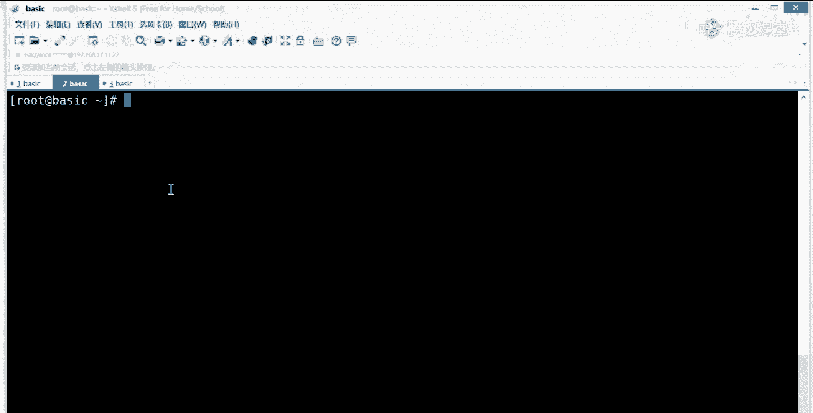

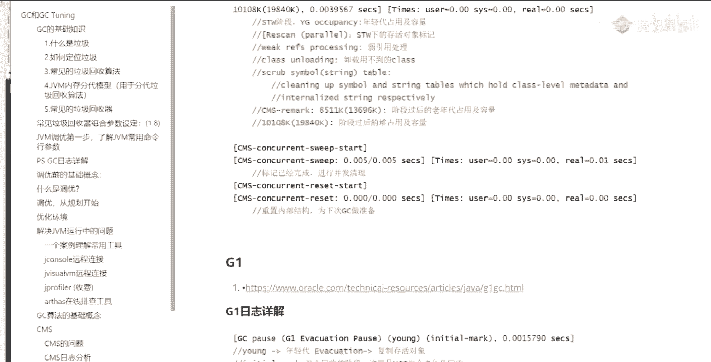

ok，j mac啊，昨天没给大家讲的这个命令叫什么呢，叫j map，好看这里啊，在这儿在这儿啊。

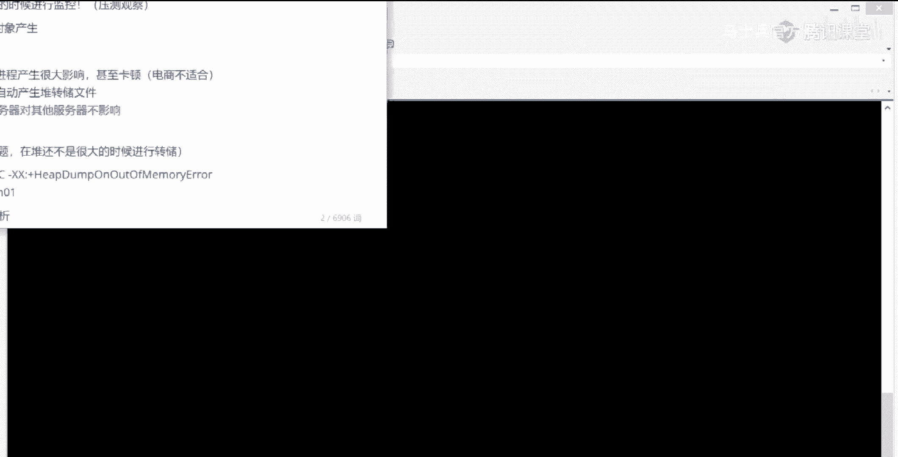

就这些命令呢我不建议大家都背过。

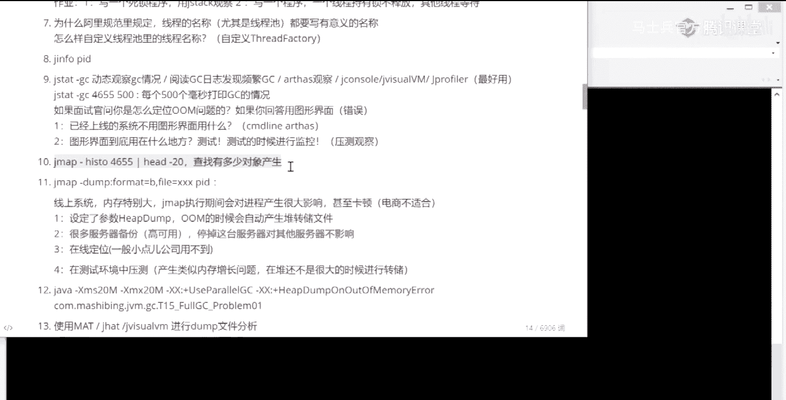

你手边有一条小的那个呃手册放旁边就可以了，你用多了呢，其实面试官问你，你一定能说出这个命令的名字来，但是参数你不一定记得住，这个事很正常，你要把参数都记住的话，反正这事儿就不对了，说明你背过来看这里啊。

分析哈，procedure啊，或者叫project或者叫program，或者叫什么嗯，就是分析内存用的来，j map这个命令呢，它会干一件什么事，他会干这么一件事，他会直接进去进到那个那个。

那个正在跑这个内存里面，帮你去把那个里面那些对象，一个人又给你揪出来做一个分析，这个很牛，这些零命令之前我首先得知道它的进程id号gp 2310，嗯history gram生成一个分析图，2310回撤。

当然这个，呃就就就就那它的内容太长了，所以我们给它加一个限制符，head杠20，我把前20行给打出来，ok同学们，你们仔细看，这里列出来的是什么呢。

这里列出来的就是在这个这个m里面有哪些个类所产生了多少个对象，好比如说有这么一个冷知数组，这个是数组，你不去管它，它本身只占用了344个对象，呃，我们来看这里。

在这里呢有一个scared future test，你看到了吗，好它产生多少个对象呢，14万多，而我们的abstract cute chier，这是我们的所产生了28万个，big decimal。

是我们的cut info那个类里面的成员变量产生了14万个，下面呢都一样的，14万多个最主要的类型在哪呢，其实在这儿看到了吗，cut info居然cut info在里面有，14万个对象，大家记住这个数。

目前是14万，来再执行一遍，你你会发现它已经变20万了，看到了吗，再执行一遍，你会发现它已经变21万了，嗯同学们看出问题来了吗，来get到问题，同学给老师扣一问题在哪里啊，对有一个对象在不断的充电。

这样你是不是就把它揪出来了，同学们只增加不减少，对不对，唉当然我告诉你，你只是把这个对象给揪出来之后还没完事儿，你得去查你这个程序的bug到底在哪里产生的，一直没有释放，对啊没错啊。

就是这个程序的问题在哪里呢。

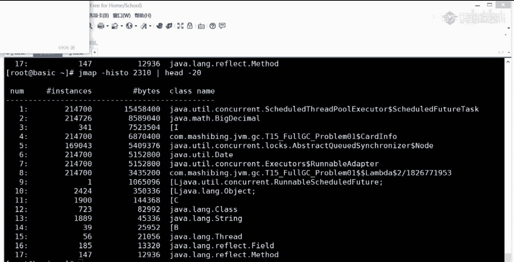

图的问题在哪里，如果你没有学过线程池这个问题，你还是找不出来，所以暂时我就先给你扔在那儿好吧，你自己去查，当然你要听过老师讲的多线程高并发这个书上的内容，这个这个你，很容易一眼就看出来了。

但你要没没学过这个问题，你找你也得找半天了。

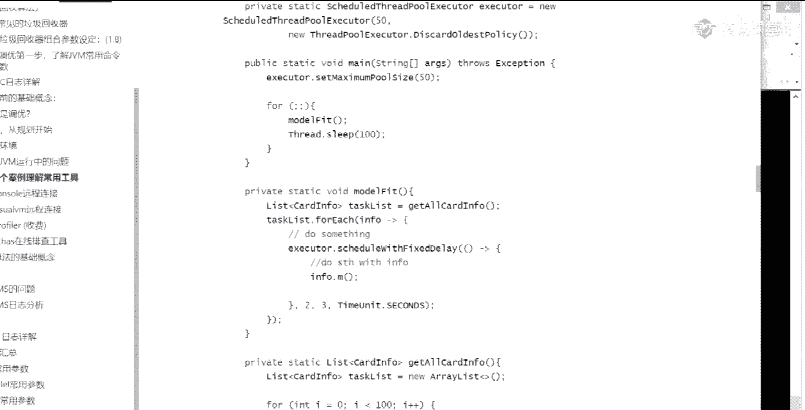

嗯，我还是那句话，昨天呢也跟大家说过这些问题了，就是另外一个问题，用这种方式呢，目前看起来并不是特别难，其实oom问题我跟你讲这个问题不难，不是很难，他的步骤也是死的，知道吧。

就是你运行起来这map一下，然后看看哪个对象占的最多诶，接下来就把这个对象呢，跟到你的代码里面看看哪里在不断的产生这个对象就行了，找你的代码的bug去已经定位出来了，这个不难。

但实际上呢呃你想找这个bug出来，也没有，你远远没有你想的那么容易，有一些业务逻辑的写得非常的复杂，所以在这个时候呢，呃bgm问题，这就是一个相对一个死的步骤了，我们来稍微回顾一下，其实相当简单啊。

别人说你你这个你们原来产生过om问题，你在简历里说，那为什么问你，你你怎么对它进行定位的呀，唉你就说你就别说你用了什么，那个那个自己的那个，java自带的那些命令，你就直接说我用了iph，用了一些命令。

然后呢我还用了什么，我还用了gmap这个命令，j map不是ars自带的os，没有这个命令，只有这个命令，它的功能没有实现，其他命令全实现了，所以用了这个就ok了，找出来哪些对象呢，在不断的占内存。

然后呢我回去回过头去找bug啊，我发现bug到底出在哪，是有一个现成的东西，线程池的东西没写，对好了，搞定，这是最简单的，最初级的，还有这个流程清楚的同学给老师扣一，那，现在的问题就又来了。

我跟你说这map这个命令，如果面试官要问到你的话，这里面坑也特别多，首先第一点，我现在堆特别小，200兆，我只剩一个j max，他花的时间很短，如果你们家堆100个g，你一个g卖不上去。

这哥们儿里面就暂停了，听懂了吗，好我再说一遍，如果你们家堆特别大，你一个j map命令直接扑上去的话，你们家这堆就直接暂停了，对j map会把你的现在的进程给你停掉，这个事儿一般是不被允许的。

所以你这个命令你如果说你用过这办法命令，你还得要好好的，把这事给圆过去好，怎么圆呢。

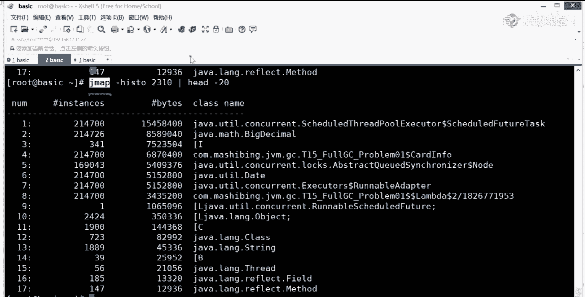

有好多种方式啊，这种细节老师都帮你想好了好吧，看这里啊，有四种说法，你自己挑一种灰度，对灰度也可以，你看比如说你你有很多台服务器做了高可用了，你停掉这台服务器，对其他服务器不影响，这个牛不牛，这可以吧。

唉这个可以，当然这map还能干一件事，就是直接把内存全导出来，其实它直接就是堆转出好吧，对当你说了这句话之后，a面试官一想，我靠这哥们儿可以啊，不仅懂这边的调优哎，他还在用过高可用的这样的环境啊。

做个集群嗯，可以给他讲个2000块钱，涨个2000块钱没问题啊，好看这里或者是什么，或者呢你执行了这么一个东西，设定了一个参数叫黑单on out of the memory，一般的情况。

任何的这种实际当中的运行环境，这个参数一般都要设记住了，在你实际运行一个你的应用程序的时候啊，这个参数一般都要设这个参数叫什么，看这里叫hdmp on out of memory error。

就是如果一旦产生了out of my memory error，之后呢它会直接产生一个内存转储文件，内存转储文件的意思就是说这个jvm里的堆里面的内存，原封不动的给你存到一个硬盘上，放到一个文件里以后。

你就可以拿着这个文件直接来做分析了，关于怎么分析内存转储文件这件事，网上一堆一堆又一堆的内容特别多，有讲mit的，有讲jvo vm的，有讲，当然这个讲的很少，heap alysis to，大家听我说。

你们觉得有必要给你们弄一个对文件，让你们看看吗，有必要吗，好那就弄一个，但是啊记住实际当中不是这么干的啊。

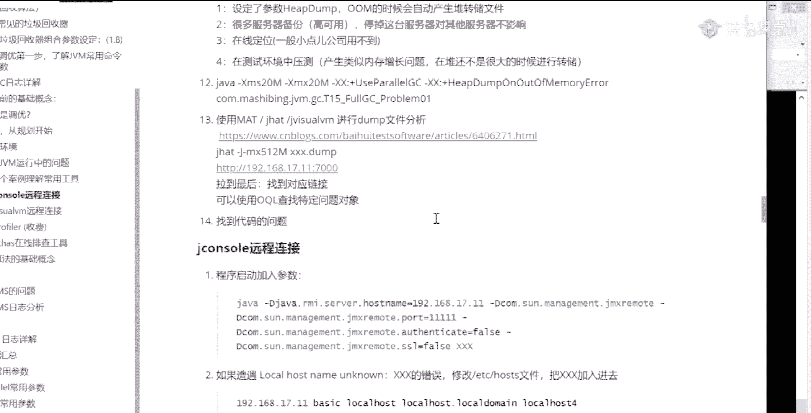

一定要听清楚，虽然可以弄一个，虽然说往上挖，把那堆车弄出来，传转出来给你弄出来，可是这个事儿你定要圆过去才可以，要理解这一点呃，生成堆转储文件呢有好多命令都可以生成啊。

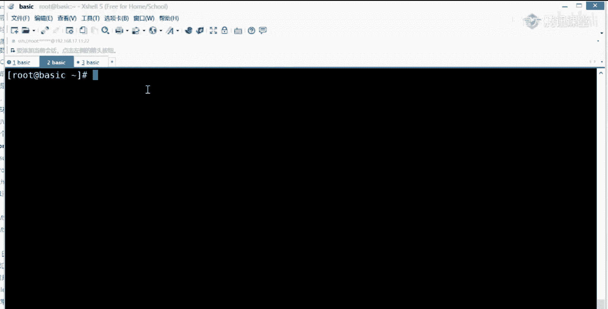

比较简单，这个你就你就记就行了，就g map gdp for mgb five，等于什么p i d就完了，就特别简单，一个gmap命令就生成。

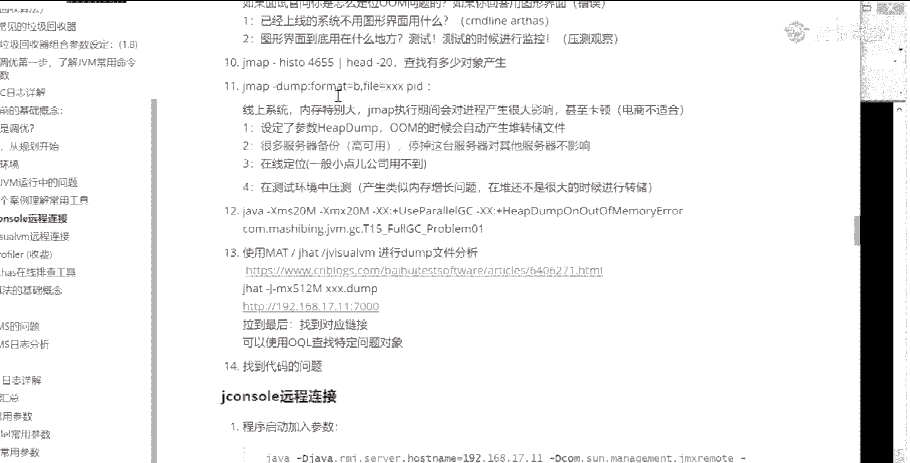

那呃除了它可以生成之外，office也可以直接生成，搬到我们的那个哦，没有来挂上，我们用os中轴好吧，我在这里啊啊，来阿萨，这里面有一个命令，你一看就明白这个命令叫啥，hit them。

就是把那堆诶你给我导出来，导成一个文件里，get down，要看他用法，he弹刚刚live什么什么什么，ok就这么用，我就不敲了，可以吗，太简单了，因为所以他不会因此for dc吗，会的。

他会把那个没用的先给你收掉，要不然的话你导出来的东西太多了，看这里，hdmp刚刚live活着的对象，转储到哪个文件里面去，tm目录下面的dmb。hp h process这个文件，这个命令会暂停线程吗。

会的会的，莫急啊，我一会给你讲这个命令呢，它背后的意思让你圆过去这件事儿，好吧好，这个命令很简单，我就不敲了，可以吧，同学们，它生成了之后，我还得从linux上下载下来，下载下来之后呢。

哎我下载到windows上，下载windows上之后呢，我在用jvo vm版打开。

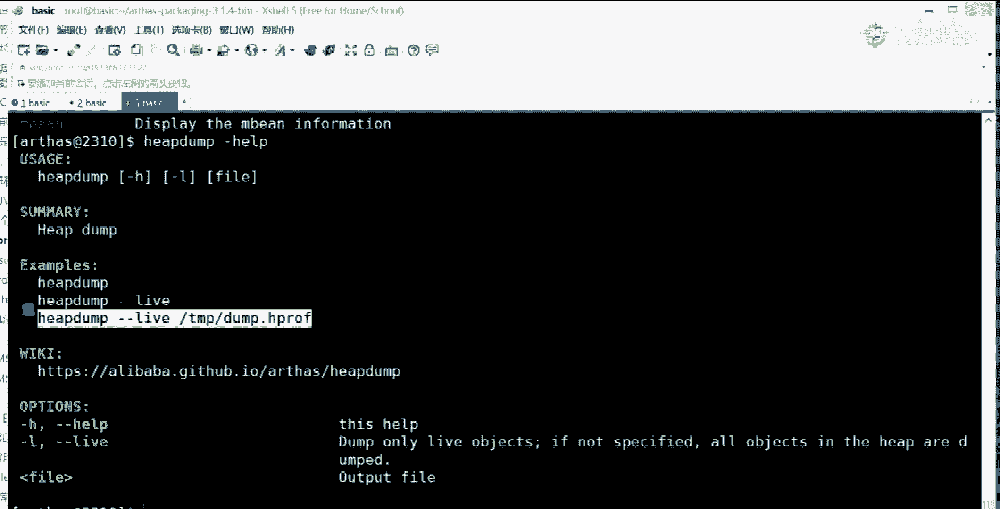

对这是运维的必备课程的，很简单一件事情啊，主要是太太简单了啊，那也就是说你把这个jvo vm打开，我现在假设你已经从你的linux服务器上已经把这个文件给下，载下来了，这样这个假设大家能接受吧。

能接受同学给老师扣一啊，然后呢你就把这个文件打开来分析就可以了，文件，装入，找到下载下来的文件，找找忘了下载到哪了，就原来下载过的啊，呃work，because it。

在你组成原理操作系统好像是这里面是有一个的啊，找那个什么呢，找那个呃堆的dmp文件好，这里有一个叫tm。h process这个文件的后缀名啊，其实你用哪个都可以，用什么都可以，后缀名没有，你也可以。

选中打开好，这个时候呢他就会把这个整个堆转储文件给打开，我这个堆特别小，所以打开起来特别容易，我再跟你说一遍，一个堆特别大，这个文件就在我的机器上分析起来，一天可能都分析不完，我们曾经有一个小伙伴儿。

嗯是什么vip的学员，他是那个鸡肉，昨天我我我聊过我，我跟大家聊过，他一个对帧数文件下来，他们平分f g c，他们的办法就是重启一一直不停的重启，后来他们受不了了，说必须得把这事给解决了，然后我就说呢。

等他那个宕机之后，你一定要把那个当铺文件给我拿下来，结果呢他就把大剑拿下来了，那个弹幕文件多大了十个g，然后我教他怎么怎么样进行分析，然后呢第二天我再问他分析完了没有，他说还没执行完呢，哈哈，所以。

这段文件特别大，个的时候，你是很难很难做对他所分析的啊，我看这里呃，这是生成了一个概要吧，这就不多说了啊，好看这个lay这个图你就会发现已经从这就能看出来它的big dino，它的实力数特别大，特别多。

大小呢占了多少的内存，在这里都有显示date有多少个实例，16万个什么eagger lamba表达式，cut infer一堆，所以只要这个图一出现，你就会知道哦，哪些个类占的实在是太多了。

这个分析就很容易分析了，但文件不能限制大小吗，但文件是你的内存的堆内存里边全部给你导出来，那你堆内存多大，你当文件就得多大呀，但是我说的是那个堆内存里面占了多大吗，实例数它最好玩的，还有一个什么呢。

还有一个这个q l控制台，哎这是很好玩的一件事情，就是你完全可以通过类似于一条sql语句的东西去来查询这些个实力，我想想那个命令还记不记得你，比如说我的。

我要查里边的各种各样的string类型的那些实例，每个实例都都什么样子给我拿出来，select nbm，再挖点儿，慢点儿，spring s看是不是这样子写的啊，唉对看到了吗。

就是那个哎把你的这个string类型的各个实力全给你救出来，它是位于哪个类里面的好，这个实例里面是一个什么情况，它里面的那个属性是什么，值是什么，你怀疑哪个实力不对，你就点进去看。

这是你有了堆专属文件的一个好处，就是你可以用更先进的工具图形化的这一类的诶，来看它里边的内容。

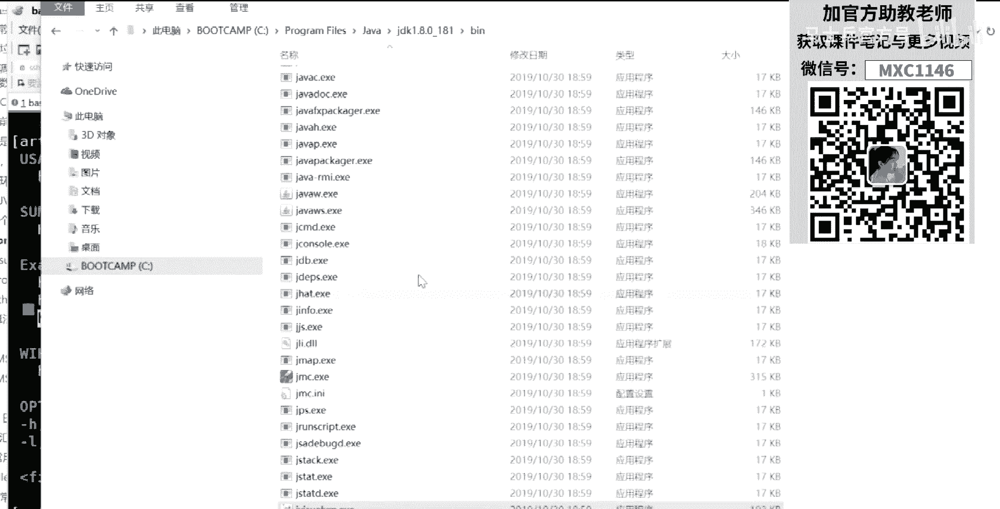

好了，这专程文件怎么分析，大概的一个过程该到了吧，网上很多讲那个用mt的啊，那个没什么没什么先进的，我不知道为什么有很多人用mt啊，不知道为啥比jvm不比这vo vm也没有强到哪去。

其实最好的工具是叫做j profiler，不过这哥们儿收费的好像还挺贵的，所以我不太清楚网上为什么很多人讲mt啊，你可以完全可以不用，好那好，现在的问题就来了。

我到底能不能够随时的就把这个堆可以导出一个，导成一个文件导出来，在生产环境里头能不能这么干，绝大多数情况下是不被允许的，除非你们说你们整个的服务器是可以被暂停的，如果是那样的话不行。

是其他情况肯定都不行啊，你不能说淘宝这边在对外卖货呢，这边订单还在跑着呢，你直接一个j map或者一个hipdp，直接就把那个堆给干暂停了，你这边有整个暂停了，暂停在干嘛，不停的往外倒数据。

十个g32 个g，刚才有同学是19个g多少，多长时间，半个小时以上，这事儿你能这么干吗，所以你要跟面试官讲说。

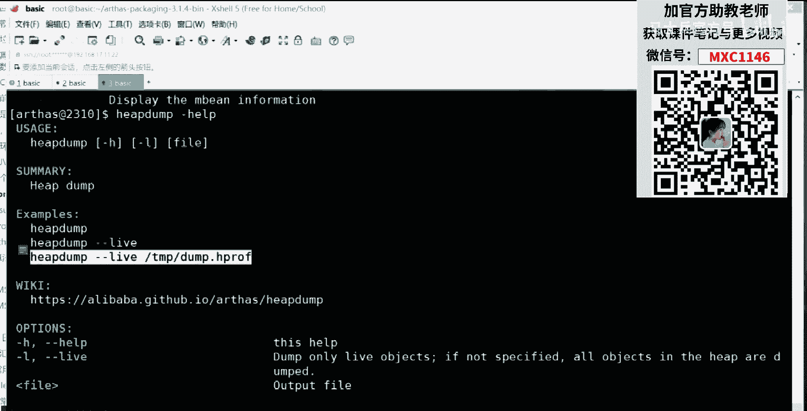

我是把这个堆专属文件给导出来的，大哥你一定要圆过去，怎么圆过去啊，有几个说法可以说，最专业的是很多服务器做备份的是高可用的，你听到这台服务器对其他服务器是不影响的啊，这时候呢你需要架构的知识。

需要了解高考用的这种配置好，接下来设定了he dump on out of memory error，就我刚才说了那个东西是什么呢，那个东西是一旦产生了om之后，会自动产生对转头文件好。

这个可以说就是它确实产生om了，但是我告诉你，这个说法呢并不是非常的专业，中小公司你可以这么聊，大公司，你说oom了才会产生对专属文件，别扯所有的都有监控，他都监控到你内存在不断增长了。

马上就会告诉你有问题了，你这个时候还等他o o m呀，不是很专业，但是可以说，因为，多有，内存增长，就会破掉，但是中小型公司可以说你们中小型公司没有监控啊，没关系，o o m了之后，他才他才报警了。

这个可以，这个没有问题，我看这里在线定位，推荐大家用office进行在线定位，你怀疑哪个类，哪个哪个程序有问题了，去观察他方法的执行情况，去观察它整个那个类的各种各样的一些信息，去观察它的代码。

还有什么你在测试环境中压测，这个也可以说，你说呢你观察到了它的om，就是它内存在不断增长，但是我没有定位出来在哪，我们生产环境中又又不能够随便停，我这时候怎么办呢，我把同样的程序部署到一个服务器上。

然后呢我在测试环境中对它进行压测，压测之中发现它的内存确实在不断增长，这个时候我可以把它导出来，这是没问题了，好了，今天在听的有面试官吗，用什么做颜色，jmeter run runner。

面试官可以撤了啊，拜拜，好几种说法都可以聊好吧。

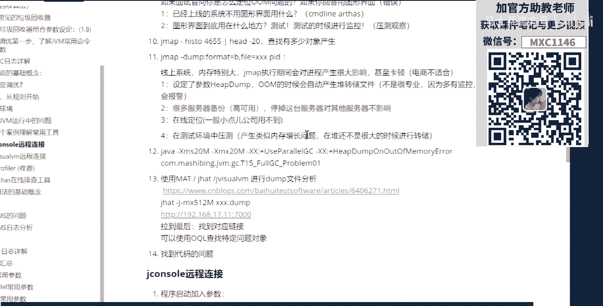

至少你让面试官知道啊，你去了解这个命令，那么大家听我说，在你生产环境之中，你怀疑一个代码有问题的时候看这里，又死了，先把屁股掉，p2310 ，好再跑下来，我们再把othy，好在过了之后呢，还有一个命令。

这个命令呢它是ars的王炸，很牛啊，这个命令超牛，这个命令是什么呢，这个命令就叫做j a d，第2j a d啊，你看看这描述是什么东西呢，叫the compleclass，这个很简单。

就是来给他干嘛的呢，做反编译，cad呢其实原来是一个工具的名称啊，他后来用了这个名字了，所以原来那个g a d呢是一个也是一个反编译工具，现在呢其实大家应该都知道啊，就是java自带都有反编译。

jav杠p就可以啊，java p就可以呃，它为什么在自带一个反编译的功能呢，这是为什么呢，我们先来看这个反编译功能是干嘛的，呃比如说我们还是，要么名称啊等等类的名称把拿下来复制，然后呢。

后面跟我们类的名称粘贴回车，诶你会发现他干了一件什么事呢，他把这个代码全给你列出来了，看到了吧，那有同学就会说了，说大哥你在搞笑呢，这代码我自己都有啊，我还用它在g a d在那列出来好，你说是不是啊。

同学们来有这个问题，同学给老师扣二，凡是扣二的都是在小p公司工作了，做的都是小p项目，为什么呢，因为大项目你一般用不上，大项目没大项目才能用得上啊，sorry，大项目才能用得上哎这是什么意思呢，同学们。

你们想想看，作为一个超级大型的项目来说，你部署到生产环境的话，你本身就会有好多好多的程序，好多程序员拿着好多的程序网上部署，而且呢我告诉你，你写的程序很可能被其他人所依赖。

也许你在这个把自己的新版本扔上去之后，结果呢其他人在网上那个什么的时候，get get get往上往上传的时候，他很可能直接把你原来那个那个老老的版本，把你现在这个版本就覆盖成老的了，push的时候啊。

对所以你，版本follow了，版本不对了，那么你现在运行的到底叫的是哪个版本啊，这时候怎么办，好用这个命令来观察你到底是哪个版本，git覆盖对大家听听懂这个意思了吗，尤其是做中小型公司小p项目的同学。

所以这个命令还是很牛的。

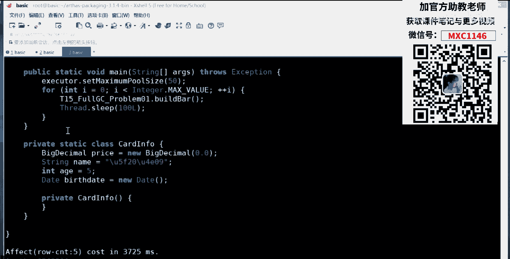

那我跟你讲啊，这个g的覆盖代码这件事是经常发生的。

gto是杠f嘛，是吧嗯，一个一个f管你乱七八糟的，直接就给你干掉再说，还有这个代码里头不写注释的这种，给你查一个新闻，看能不能找出来。

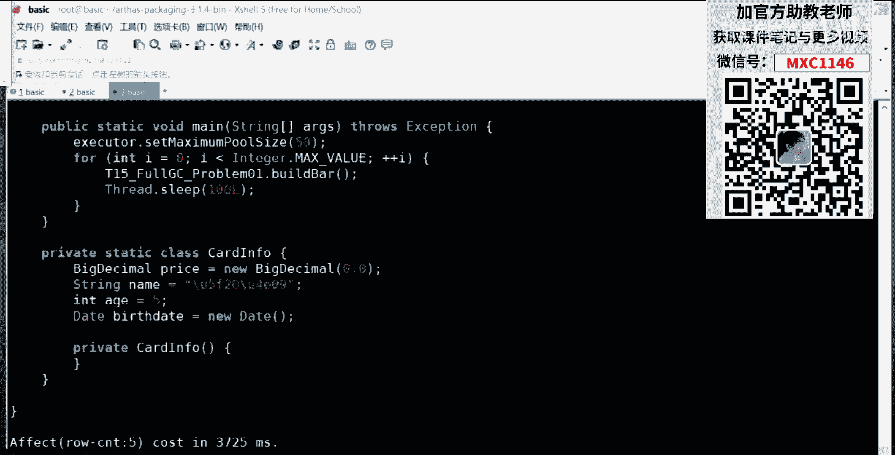

好玩的呢，突然想起来了啊，你咋回事，美国成员枪杀同事，来自己看看，一名成员拿一把伴奏手枪，周平四门，四名同学开火。

是因为这个程序员不写注释，不遵循驼峰规则，括号换行还天天的gto，是gf激怒了行凶者。

哈哈哈，不知道真的假的啊，就聊天聊着玩哈，应该应该是假的，开玩笑的，哈哈哈，ok ok ok好知道这两种回事就行了啊，嗯嗯同时连锁定都没有是吗，没事中国没枪，ok好不多说了，好回来回来回来回来。

所以这个命令是直接可以直a d，但是只有这个命令的话，我告诉你还不算牛，你这你你们自己想想看，我就算查出来这个代码，这个代码其中有bug，我能怎么办呀，他已经上线了，哎同学们，你们平时你们自己写个项目。

然后部署到生产环境之后，里边确实有bug了，你们怎么办，你告诉我你们怎么办，你是不是把这个代码本地改好，重新编译好，编译好之后呢，再布置上去，是这样的吗，同学们没错，打补丁哎，重新上，换下去，回滚对。

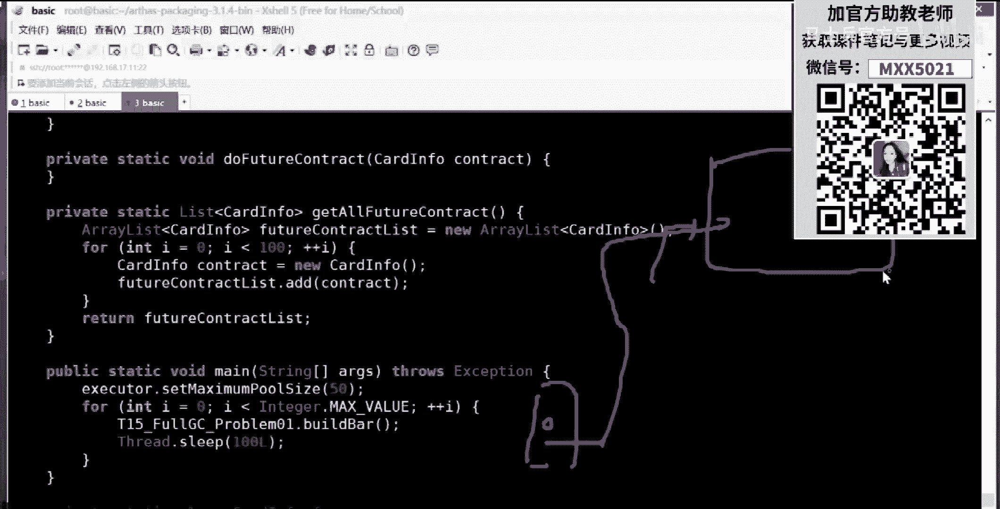