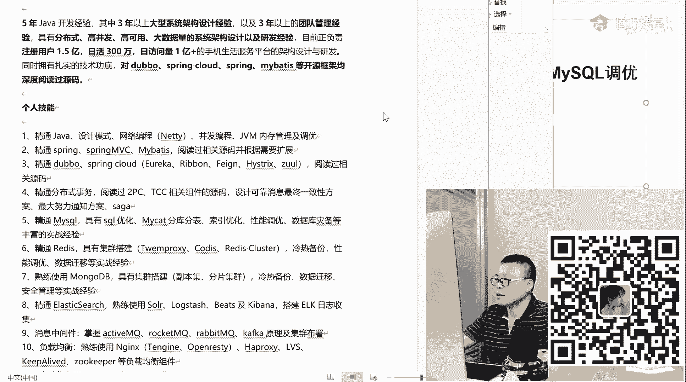
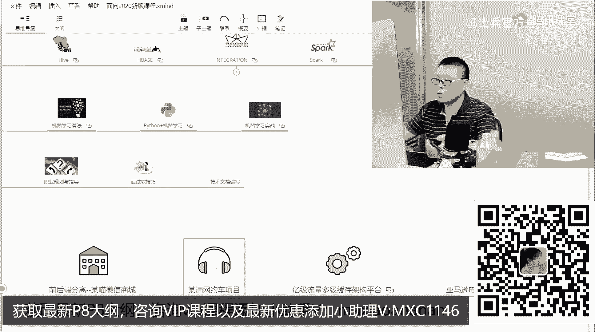
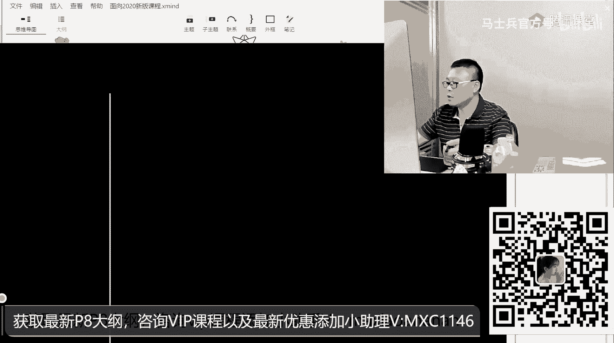
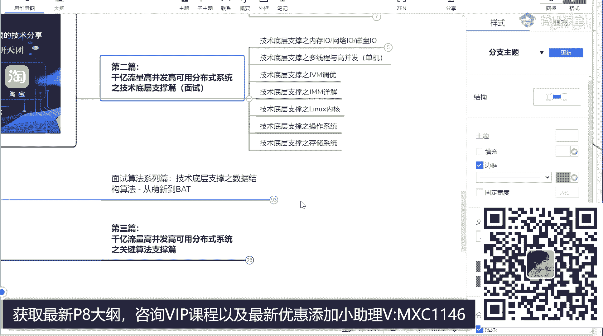
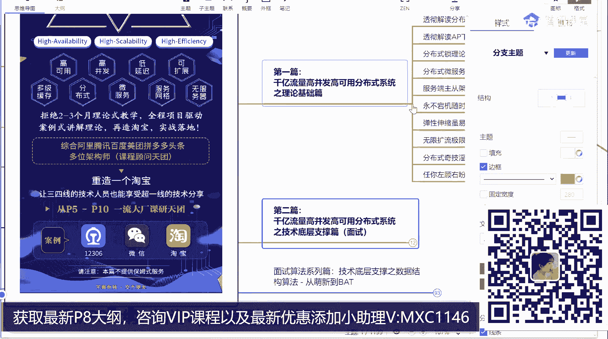
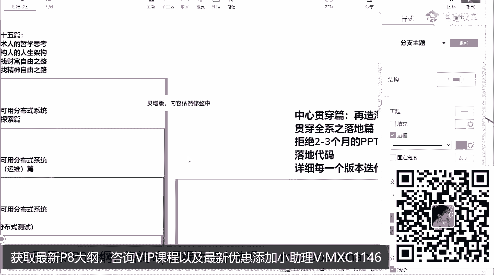
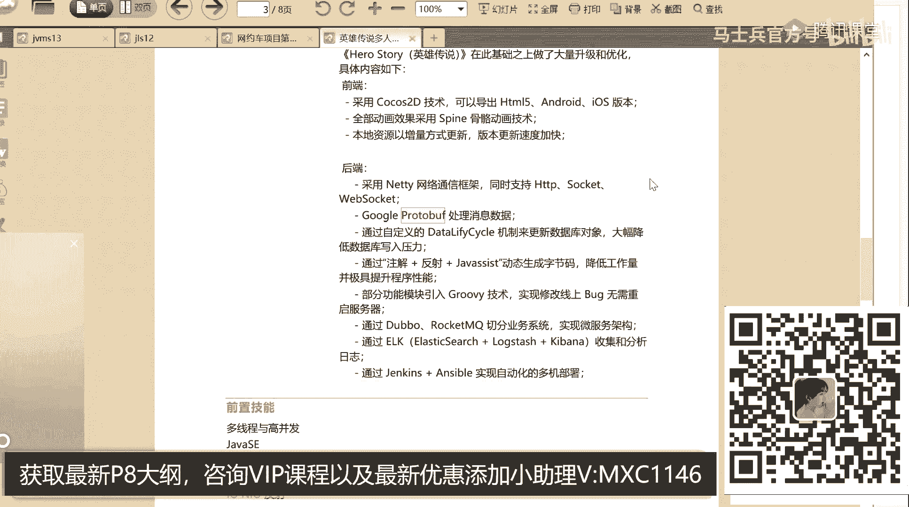

# 【马士兵教育】MCA架构师课程 主讲老师：马士兵 - P20：职业迷茫：年薪120万的java架构师简历是什么样的？需要精通哪些技术 - 马士兵官方号 - BV1mu411r78p

这是第一点，第二一点啊，我们指导简历，首先指导的实际上是你的心里，哈哈哈，问你个最简单例子，有的人的水平是十，但是他写简历只敢写成八，为什么，因为他害怕被人怼，他写成八之后面十家他成九件。

但是有的人水平就是六，他也敢写成八面十家，九家不成就成了一家，各位小伙伴们，我想问你，这哥们儿原来2万的水平，最后拿了3万，这哥们原来4万的水平，最后拿了3万来，你告诉我，本来他俩应该正常差2万。

最后拿了一样的钱，谁赚了，谁撞的呀，我这么讲，你能不能get。get到点东西啊，同学们从此转了嗯，所以其实有很多东西他不知道你真实水平的时候，只能控制你简历来，这是这个简历呢，当然拿薪水比较高。

你不用拿那么高，作为应届生来说，你可以考虑强度稍微低一些，你就不用写那么多，精通了，理解心理压力就不用那么重了，这只是一个模板，你可以摘出其中一部分来，这个简历呢是拿了60万年薪。

这是比较年轻人写的简历，既然说到简历了，有没有同学想看看比较老拉的写法呢，有没有老辣的写法，打开看一眼看在哪儿呢啊，嗯，好看这个这哥们儿是一大专大专生，5年经验，32岁了。

他明显就跟那个年轻人的写法就是不一样的，27岁从运维转过来的，看他的写法，这个简历我先告诉你最后拿了多少钱，35x15进的是融360互联网的金融公司，9000股的股票，大概他自己跟我说，算下来的话。

60~70万年薪差不多两嗯，黄老师20多岁拿676 16六七十万，但是你们不要跟他比啊，他这个呢是属于好长时间不出一个的那种，这个是比较正常的，32岁拿了六七十万年薪，这个算是比较正常，尤其是他大专啊。

能拿到这个薪水不错，最关键是呢他这个简历啊写法上非常的漂亮，你们仔细读一下这个简历，阿里大概有四五个部门都灭他了，不过对方没编进去啊，灭灭灭了，灭了别的，5年的一线开发管理经验，负责项目日活300万。

注册人数1。3亿，其实这个项目啊不是很给力，嗯这个呢叫做上天，就是你有架构的部分，对于构建高音高吞吐，低延迟分布式架构有丰富经验，架构部分，这两项都叫做比较给力的项目架构部分，这是什么，底层知识。

一般我称之为入地，就是上天部分，入地部分数据结构与算法设计模式，这你不用担心啊，老师两三天就能让你具备丰富的gm条经验，大概有10~20个案例让你跟面试官聊，今天有面试官，我就不跟你多说了，这是。

他就写了五条，他跟那个刚才那种写法就又不一样了，其实5年经验呢是可以做的，有多牛，你们想看看更牛逼的简历吗，想看吗，5年的5年左右经验的，再打开一个，这个是超牛，这个多数人是达不到的，但是通过他。

你就应该知道你的目标在哪里，我觉得再看这个简历，我先说这个简历的薪水拿了多少，这个简历呢比较特殊，这个简历呢在阿里拿了是120万年薪的，p78 80万的底薪加40万股票，4年拿完100 160万。

他应该是160万的股票，44年拿完啊，每年40万呃，当然它有一些成熟期，一些什么特殊的特殊的限制，这个我们就不多说了，大概120万年薪左右，5年java经验，3年以上大型架构系统。

分布式高可用高并发大数据量，double spring，cloud，spring，my bex源码，所以我觉得你通过阅读别人简历的时候，同学们你们知道吗，你们就知道什么东西，哪个方向现在比较值钱。

这也是我们做培训的人，整天在研究的课程里，我们主要交什么，交最值钱的内容，为什么要给大家上架构的课，因为这东西值钱，为什么要给大家讲底层，因为这东西会面值钱，看他这个人技能，我告诉你。

很多人对待自己的简历真的跟屎一样，随随便便写两句上去扔给面试官，就说我想当个高薪，你搁那扯淡呢，同学们，你们知道吗，同样的一个项目就是他字斟句酌的比较认真的人，写出来的简历就和那种纯粹的那种咋说呢。

混混事的那种简历就完全不一样，我跟你说一个最简单的理由，就算你同同样的都做过订单，订单系统，有的人就写一个在简历上写啥，我做过订单管理，做过库存管理，做过商品管理，做过啊，客服客服，客服中心等等。

就这么一列完了，那有的人就会这么说，我做过订单系统，在这个订单系统里头，我了解了to pc three pc tcc相关的分布式事务的处理方案，我设计了可靠性相关消息的最终一致性方案。

我了解了三个人它的这种分布式事务的架构，我聊我，我最终采用的是一个最大努力，通知方案来解决的这个分布式事务的问题，同学们，你们仔细分析一下，面试官更喜欢看到的是哪种，所以我不知道有多少人。

你们的简历里头还在在那写一堆的业务逻辑的逻辑，有多少人有吧，应该，有的是赶紧改好吧。

嗯既然说到这儿啊，说了说了，大专生有多少，这都还给老师扣个一课程有效期，公司活着，课程就有效，公司死了，课程就完蛋，对啊，所以我们要收一定的学费，就是保持一个正向的现金流来嗯，给大家请到更牛逼的老师啊。

嗯，759是大专生的发展啊，呃我想给大家大专生的第一个建议是合适的时间提提学历啊，为什么要提学历，我觉得不用我说，你应该能理解，这是大专生能够接受的企业范围，本科这么多，统招本科这么多。

研究生这么多更多等等，所以你在合适的时间请你提学历呃，然后还有一点大专生啊，在你技术变得越来越硬的时候，你的学历的影响就会慢慢降低，所以你一定要把自己的技术变硬，我觉得这一点特别特别重要好吧。

那么还有一个以前呢有不少同学听说过这个这个说法，叫叫这个说法，叫什么呢，叫技术搞不动了，按管理，来听说过这个说法，同学老师扣个一有吗，好听我说啊，这个说法大错而特错，谁要听这个，谁就入坑了。

这个坑坑坑坑的人坑多了，有的人呢30岁左右就直接干嘛了，直接就就就就直接转了管理了，凡是这样的，到最后你会发现招的人招招人的人，人家招过来的人比你的薪水都高，凡是很早转管理，最后全废了。

所以各位同学别这么干了，千万千万别这么干好吗，听我说，我告诉你技术，要走要，加管理要做要注意老师，我说的是加二，并不是转，我说的是家，并不是转，请大家给我记住这个词儿，我觉得我一个一个字就能提醒你了。

技术要硬，管理要硬，叫两条腿走路，你的路才能越走越宽，嗯嗯别的废话不用你多说，我还给你打开一些简历吧，也是大专的所有大专生人，认真听你看完这个简历，对你以后的发展应该是有深刻的认识。

有同学说老师你扯淡的就是硕士生吧，好仔细听这个简历呢往外投的时候40开外了，知道吧，不仅是大专还是大龄，他的呢就基本上都没有什么那个什么描述了，你懂吗，都没有那个那个技技能的一些描述，什么精通。

什么熟悉什么，他都不会那么写，个人的优势直接列出来，里边内容我就不不一一说了，往下看看他的教育经历，主要看这扬州大学第一专业热加工工艺设备大专好吧。

第二个业绩的你应用好下面这个你不用看下面这个叫简历技巧，这个老师都教给你，所有入学的同学，第一步需要看的就是老师的简历指导课，这个都是简历技巧，很容易get到，不去管它，坚持了10年多。

一直在走技术道路，走得很硬，合肥工大mba加上管理的认可好，这份简历多少钱呢，上海的架构是80~130k的月薪，你自己去算，大概100万~160万年薪，可能有同学会说，老师40多岁有人会给吗。

有一定的机会好吧，有一定的机会，我不能说这种机会特别多，因为这个岗位一定是初级的岗位最多，中级的岗位，稍稍高级的岗位越来越少，这是肯定是倒金字塔的，但是它有一定的机会，我们我们我们去年做了很多内推。

我们晋级的一个内推，这有点小啊，比方说龙湖地产的，就有一些甲方企业特别特别喜欢那种技术和管理两条腿都硬的，那么这个这个岗位是年薪150万以上，要求你是8年以上工作经验，工作经验少了还真不行。

管理技术两条腿，第二个岗位是这个第一个leader下面的小的leader，年薪120，公会力量到位，所以在座的诸位啊，我不知道有多少同学是大龄的大龄同学，如果你意识到你的路越走越窄的时候。

同学们你们要好，大概第一次登录腾讯课堂呃，然后呢半年内我们得到了内部的第一名呃，同时呢我们也拿到了同一课堂，唯一的唯一的站在用户角度考虑的这样一个奖项，就是腾讯课堂最受欢迎奖，java领域就我们一家呃。

为什么会说大家比较欢迎，因为很简单，我们讲的比较深，比较细比较长，最开始呢我们也跟别人一样，大概呢提供八个月左右的课，每每每个每周三三节课，后来讲着讲着我就觉得我去讲不讲不爽啊，你懂吗。

我想讲的内容非常非常的多，非常非常的细，那么时间肯定不够用啊，太不够用，了怎么办呢，我就进行了拓展，直接把八个月可拓展到1年半到2年，拓展到1年半到2年之后，虽然讲上去讲内容比较多，比较爽了。

但是呢有同学说老师我没有项目经验怎么办，我们就直接拖了八个项目出来，免费的，前面全是免费的，后来有了项目之后，学生说，老师你们以后课程升级我还能听吗，免费升级目前是这样，这个后遗症比较多。

我们后面会把它去掉，目前是免费升级，所以免费升级呢是我需要你买入一张卡，目前是88块钱，这张卡是什么意思呢，我们以后所有的公司只要，活着会员牵扯到的我们我们技术的升级会给大家免费。

那今年给大家免费升了什么呢，你们可能想不到，今年给大家第一个免费升的是左程云，左老师的算法课，左老师算法哥在其他地儿买下来，大概要六七千块钱，在咱们这儿免费直接给你升了，这是第一个。

我们称之为p8 架构师，当然p8 的我一会儿专门讲给你听好吧，这个有一点市场的夸大啊，但是别人也这么叫，我们没办法，也只能这么叫，呃除了这个之外呢，我们进行了服务上的升级。

是有一对一的职业规划的指导和面试指导，我目标呢是不想做课程中的第二名呃，我还是那句话啊，就是说别人广告可能打的比我们小可以，但是质量上不打算做，不需要你来报任何课，所以到现在为止。

我们可不会成为一个什么东东呢，成了一个巨无霸，看这里，我今天给大家讲的内容，是属于多线程高并发啊，就是这其中一个小模块中的我点进去了，点进去就看到了点诶，多线程高并发这里面的一部分好吧。

就是讲srt的原理，讲lol的原理啊，这讲的是两块啊，其他的都没讲给大家听啊，自选啊，reaction log sam for safety，ma safety barrier，各种同步容器啊。

各种线程池啊，gmh怎么样去做这种这种微微微微微微观的一个一个一个性能测试啊，啊强软弱虚的类型思维logo啊等等，disruption的用法等等，呃这个呢是总而言之，这其中的每一块啊。

其中的每一块拿出来都是一堆啊，比如这vm拿出来还一堆，我就不给，大家一打开看了就这么说，别人你看到的不管线上线下讲到的内容，咱们这全有别人没有的，咱们这有没有啊，也有举个最简单例子，比如说这个东西。

比如分析源码这块儿，王老师现在呢给大家讲的hosport源码分析，其他人讲吗，基本不讲，linux内核源码分析，其他人讲吗，基本不讲好，这是第一次有人讲，就是我们呃为什么要讲这个。

很多同学可能觉得比较奇怪，老师我一做java的，我没事搞什么类的内核，为什么，why，我就想让你们挣更多钱，其实就这么简单，黄老师去阿里面试的时候，阿里p9 注意啊，不是给他p9 的职级。

是阿里p9 出来问他的问题，linux内核源码0x80 的调用过程，黄老师是怎么答的呢，只见黄老师那个左手从左屁兜啪抽一张，纸是吧，右手从右屁兜啪抽一支笔，然后把这个过程详细地画了出来，软中断的过程。

ax寄存器存的是调用号，bx cx dx si bi存的是参数返回值，存在哪个计算器里好，把这个纸把这个过程给详细地画了出来，因此p9 之后就再也没有问他技术问题，他当时学校里的时候23岁多。

所以呢最后给了他，你知道吗，没有，那怎么办呢，给了他一个p6 的职级，但是直接给了他的是p7 的薪水，嗯我就想呢各位能慢慢地达到黄老师的水平好吧，即便是我相信这句话，就是你学东西的时候呢。

一定要比跳比较难的，学难的才值钱，高度是100，你学一半儿你也有50万年薪，高度是30，你全学了也就30万年薪，这是知识点，除了知识点之外呢，我们有一堆的项目，这个项目呢适合应届生的，适合初级程序员的。

适合从传统项目转成互联网的，比如说网约车，这个就是常老师入职阿里的时候给他带来很大帮助的这个项目呃。

关于这项目啊，各位小同学们如果有意愿的话，你们可以去找我们的。

谁要呢，你打开来看一下，所以这个项目啊我们每个项目都有自己的白皮书，这项目里头有多少节课，每节课讲的什么内容，这个项目主要叫什么，spring cloud，从入门到落地呃，讲到基本都讲到源码级。

就是这里讲的所有东西都给你讲的源码级好吧，讲的非常深入的地方啊，都能给你讲到类似内核源码的话，那么其他源码的都不太不太是问题啊，嗯然后这个项目设计出来。

主要是让大家呢能够从原来的c r u d的传统状态，转到这个分分布式微服务啊，这样的一个项目在落地呃，除了这个项目之外呢，我们还有一个第一版的比较给力的项目，就是一级流量多级缓存的架构。

这是一些架构上的设计理论呃，通过这个架构的话呢，你会了解怎么样进行那种这么说吧，就是京东和淘宝啊，秒杀啊，12306啊，就这类的项目该怎么进行设计，从简单的cp定理开始，到资源怎么隔离，服务怎么限流。

到底怎么扩容到各种服务，怎么降级到分布式事务的相关的内容，到流量网关啊，各种网关吧，网关怎么设计到多级的缓存该怎么做，怎么落地，那么到呃高可用高并发这块你该怎么进行设计和落地，啊这是最关键是落地。

然后呢在阿里云上面部署一个电商的消停业的开发市场，呃，这也是非常给力的一个项目了，然后呢所以最后我们课程就形成了一个巨无霸，形成了一个酒吧，先带回去，我相信我讲到这儿呢，会有同学会有疑问了。

说老师这么多，我学得完吗，这么多我该怎么学呀，来有没有同学有这样疑问的，这周期太长了啊，学会了就老了，对对对对对，你全学会就老了嗯有这个疑问的话，听我讲给你听，这节课到目前为止，好好听啊。

老师的设计跟其他的地方全部一样，这可到目前为止，这个呢其实大概能带你到p6 ，顶多带你到p7 的水平好吧，我告诉你今年过的p8 的，如果你想听我一会讲给你听，今天过的算法的课，如果你想听我讲，你听好。

我的目标呢是把我们自己这里设计成为一个大学，进来的什么水平的人，我们会给你设计不同的路线，比如说有多少人是为了掌心跳槽，我会给你设计出来一个路线，先学这个再学这个，再学这个，加上两个项目，3~6个月。

先让你掌心跳槽，拿下来之后慢慢再学其他的做，进一步加强，不知道大家能不能get到老师的这个思路，学叫学无止境，如果说你学东西有个尽头，我跟你说这个东西就不值钱了，只有这样，你每年才能够不断地产生竞争力。

为什么有的人能够达到百万年薪，为什么你只能达到个102000 10万的，就是说如果你想短期内跳槽涨薪的，我给你设计一条路线，如果你是应届生，想进大厂的，我给你设计一条路线。

如果你是比如说你想在原公司里继续发展，但是我想要整体了解架构知识的，我告诉你你应该怎么学好吧，这个大体，的思路，不知道大家get到了没有，下面大家想听一听我们新升级的内容吗。

今年新兴新升级的我其实我讲完新升级内容之后呢，你呢应该至至少你知识体系上会有很多很多的拓展老师，就算讲广告也都是干货告诉你啊，这是我们今年新升级的内容，直播还是录播，凡是能直播的，永远建议跟直播。

但是课程体系太大，并不能保证说我讲完第一版之后，你刚进来，你想听的那个课正在直播，这一点大家能理解吗，那么如果是这样的话，你就先把原来的上一版听完，赶上直播，听直播赶不上直播，先把原来的那个听完。

那现在呢我们正在直播什么内容呢，spring cloud全家桶，好看这里这是我们最新升级的架构师的课啊，这个课是什么意思呢，其实就相当于在我们原来的m个知识点加上n个项目的里面，帮你又设计了一条路线。

这条路线是成为一个比较高级的架构师，呃其实阿里的p8 是不能够培养的好吧，多数都是从内部阿里p7 升上去的，你要理解这一点呃，关于这个架构师课呢，如果你们了解过网上的一些架构师的课程。

我觉得大多数人可能会了解过呃，其实大致也理解就是讲了很多很多的理论，很多很多呢都是p p t架构师啊，两三个月的课，每周两三次，大概嗯便宜的收你2万，贵的收你3万，知道吧，有的还分p7 p82 个。

我告诉你老师这个课是最实惠的，我们设计整个课的时候呢，目标是设计比较牛逼的课，其实这个学费上很多很多，我我我我我是拿来请请老师了啊，我们老师的水平你也看到了，超过我的应该不多，如果我们说了老师水分。

第二估计没有人敢说第一这个批发架构师的课呢，我主要讲什么内容呢，其实呢我会讲了一堆的理论，关于分布式的，关于架构师的一些大面积上的啊，但是这里面都不重要，这些都不重要，很多课也都讲很多，别人家也都讲。

我告诉你最重要的是这好这是什么内容，我是想告诉你要把整个理论落地，因为这个市面上太多太多，了不落地的架构师课程了太多了，所以我们的重点是在这儿落地，这个落地通过什么来落地。

通过一个再造淘宝的项目来进行落地，详解每一个版本的迭代，听过老师课，你应该你应该知道啊，一个版本迭代，这个更会好，这个落地怎么落地呢，当然首先从the boss开始，代码规范，从分布式id中心开始。

到配置中心到索集群，到分布式集群，到缓存到用户中心等等等等，业务上一点点来迭代，5月大概5月15号左右，第一节课开始呃，网约车的项目，五一过后就开始，所以这里最重要的是是是什么呢，是落地。

那么这个落地怎么做呢，我们计划之中应该是有100个的，200个节点才能完整的给你再造一个淘宝出来，通过这个落地项目，直接把下面的技术内容全串起来，那这个技术内容分了好多篇，给大家简单介绍一下哪些片呢。

第一个是理论的基础，分布式事务，高可用，高扩展，高性能怎么设计成互联网三高密等怎么做，第二个呢是支持面试的，就是p7 ，你要面试会面对这些内容，大家注意啊，你错了，去阿里问问就知道全面底层内容。

几个图就能给你画完，所以好多好多面的全是底层内容，所以这里技术底层开始jvm linux内核操作系统，存储系统。

依然是支持面试，我先把这关一下啊。

这样大家都看得比较清楚，依然是支持面试，左程云左老师的，从萌新到bat的算法课，从萌新到bat的算法课单独出来，现在我们现在正在讲的是基础班，基础班里头呢大概是讲的这些个算法比较简单的，基础的数据结构。

基础算法基础完成完成之后就是高频的刷题班，想进b a t吗，好参加高频这种题目的训练营好吧，上头条第三面就灭了i u的算法，l iu算法，从那个开始我就下决心为大家找到比较牛逼，的算法老师。

所以请罗老师过来，其实啊我告诉你，除了这个升级之外，我们还有google的老师在这儿啊，我刚才没有说，主要怕吓到你们，好这位小伙是在美国的谷歌上班，来给大家讲解的google的面试真题的专场。

当然这个只能是录播，直播不了，左老师呢，现在每周末都在进行直播，当然除了这种面试的算法之外，关于分布式的特殊的算法都会给大家讲，然后各种沙丁算法，各种的分布式存储算法，好，为什么，why，没错啊。

我看有同学真的知道这是什么，推荐系统，推荐系统，没错没有推荐系统的淘宝，它是没有灵魂的，当然这是第一版，第一版里头我们会推荐系统来帮你落地嗯，但是我告诉你啊，其实作为一个淘宝来说，除了以后推荐系统之外。

和ai相关的还有什么呀，机器人客服你们知道吗，机器人客服这个我们打算在第二版里头升级，对你来说是免费的吗，第二版里头实现好吧，对机器人客服，机器人问答，然后呢前面是关于面试的这些内容，后面是什么呢。

第五篇里头我们讲什么，讲分布式，分布式系统的总体设计，这是从这是开始总体的这种大面上的设计了，这单面设计呢其实比较简单的，单体的微服务，微服务到多级缓存，多级缓存到超大型的这种分布式啊。

呃这里面的内容呢我就不给大家一看了，总而言之呢理论性的东西比较多，要想落地的话，我们淘宝里面的落地呢主要是用微服务和service mesh来落地，听清楚主要用这第一版，主要用这两个来落地。

主要是微服务和service nature，为什么呢，因为现在比最火的流程最多，大家用的最多的是微服务，但是service mesh在我们判断会很快干掉它，所以我们用这两个来。

落地来帮助你跳槽的时候拿到更好的薪水，更好的经验，好讲完这个之后，大家知道作为一个分布式的架构来说，入口端是哪儿啊，物理的入口端肯定是dns，cdn基础的负载均衡，endx内测，好在这个之外。

我们决定加一篇番外篇，这篇番外篇就是专门讲engines，为什么要讲它，因为它太重要了，一个engines，一个re大，你学p h p，你觉得那个那个java啊，学python。

听我说这两个东西请你认真研究，一个是index，一个是一个是redis，这两个是架构师手里的利器，架构师手里的王牌，这俩哥们儿玩好了之后，能解决你架构的很大一部分的问题，好吧，好看这里。

然后呢我们开始设计分布式的核心服务啊，就是网关层怎么设计，我们分布式分布式的系统，不就是说网关层业务业务逻辑层有可能是用service mesh实现，有可能用那个microservice实现吗。

数据访问层持久化层bi的加成，bbbi模型，我们主要是推荐系统，然后是单独把微服务拿出来，目前现在正在直播的是这篇，现在一明老师现在正在直播的这篇微服务全栈，微服务全栈是讲的微服务全家桶。

我们的spring cloud奈奈奈飞和spring cloud，阿里巴巴都讲到，好吧，单独一篇是service mesh的落地，service mesh目前用的最多的常老师讲给大家听。

这个课目前网上也不多，我们应该是非常靠前就讲给大家听了啊，嗯如果说一个作为一个一个架构师来说，我们是站在架构整个架构师角度来理解整个大面上的系统结构，那么你如果不了解数据治理，你肯定也没戏。

所以第九篇是专门和数据相关的，大数据的存储，大数据的实时处理，大数据的流式处理，大数据的批处理好吧，好当有了数据之后，那么我就可以对它进行人工智能加成了，这一篇主要是落落地，我们的推荐系统。

从各种的召回策略，从用户画像啊，从基础的算法，大家不用不用害怕，大家听我说，就这个配件系统的话，不是你想象的那么难学，你也可以把它放到后面慢慢学，也不是说一下你就全把整个内容全全消化掉。

后面还有三篇是主要服务保障的，服务保障呢离开离部绝对离不了性能测试，绝对离不了c c d的支持，绝对离离不了韵梅，所以这三篇我就不单独打开了，那么后面还有两篇呢是比，较虚的内容就不一介绍了。

大家对于这个呃我们还有一些细节在调整啊。

还有一些细节在调整呃，大家对于这个这个这个呃课程的话呢。

如果说对对对这篇这篇大纲有需求的话。

好吧嗯我觉得我们给的课呢应该都是比较实在的课啊，嗯，这个这个课程大家觉得大家觉得值多少钱，有哪些课已经讲完的，有一些是已经讲完的啊，比如说我讲过，我一会儿讲，我一会告诉你啊，哎呀我告诉你啊。

就很多那个ppt架构师的课，人家就报2万，我们现在是多少钱呢，你现在多少钱啊，问问，这不是你想比如说短期跳槽涨薪又怎么做，其实啊呃这块非常的简单，我告诉你，我前前后后啊。

我们老师大概一对一的指导过2000左右的学生，按照去年来讲，就是去年2019年到2020年的整个面试过程，jvm多线程课前我敲过一遍了，看过你的，重新看一遍设计模式，zookeeper。

注意是mysql调优，不是mysql入门，大家千万记住是mysql调优，并不是入门，好吧好，六项基本原则加两个内容，网约车一批流量，两个项目，我们去年用这条6+2的路线。

让n多人在很短的时间内把薪水涨上来。

光说没用，看案例，自己总结了一些案例，嗯，这这哥们儿这哥们是我们比较早的一个学员，这局玩特别好玩啊，这个小学就我我老师这个案例全部都支持被被调，知道吗，全部都支持背调啊，你那你那个想见这位学生啊。

我聊个天儿啊什么的都没问题啊，诶这个学校特别好玩，他跟我工作在同一个楼，我们都是在那个马迭尔乔的华龙大厦，这个也支持各位小伙伴想过来找老师聊聊天儿的，随时疫情过去之后随时过来，好吧，就沿着一条路线走。

花了两个月拿了年薪30万的o，他原来年薪是20 20万，20万出头，后来拿了两个年薪30万的offer，还有像这小伙儿，这小伙比较比较特殊啊，这家伙是报了三天涨了2000，为什么会这样呢。

是因为他比较着急找工作，我们帮他润色了一下简历，这是我们的服务之一，就是润色了一下简历，就直接涨了2000，所以其实你们想想老师的课值还是不值，你就知道了呃，哪怕你只涨了2000块钱，1年你也涨2万多。

而且以后的升级课程对你来说还是免费的，我觉得你应该找不着比咱们这儿更加实在的课程啊，不信你随便找，所以你听到今天老师的广告是你的幸运，不然的话你可能真的会花两三万去报那种ppt架构师的课，太坑了。

像google啊，其实呢给大家录制google课程算法的，就是这位学员听懂了吗，就是我们有好多牛逼的学员，然后呢这位呢是呃帮咱们录制了一些就是进入怎么怎么怎么怎么google。

怎么进google一些专业的这种算法课，像这个这个小伙伴是在三四线的城市，它是在福州学了一个月，涨了4k就是你按照老师说的路线走就可以，我建议每个人入学之后的第一件事儿，先涨薪水，把学费赚回来。

先花3~6个月时间把薪水涨上去，把学费赚回来，听懂了吗，拿过来之后再继续沿着老师的路线慢慢学下去，对于，我们的成员来说，我们的目标宗旨是让一部分程序员先成为架构师，他是我学了一个多月，涨了4k多。

已经很满意了，嗯这个这个这个是一个女同学啊，他原来是8k多，现在涨了18，涨到18k，当然他是属于那个三四线五六线的城市啊，还有的呢像是薪水高一些的，你比如说这个毕业啊，毕业毕业了八个月啊。

拿到了百度的社招的offer，然后呢像还有比较比较典型的，这哥们也不要典型啊，这哥们儿是就听了老师的jvm，就听了老师的多线程，然后就听了李老师的mysql，就直接入职华为了啊。

刚听完这vm多线程mysql就面了华为就成功了，面试官问的都是老师讲过的是吧，呃他的年薪呢不是特别高啊，他转原来的年薪太低，大家也知道你下一个下一步找到薪水，跟你原来薪水是有关系的，就涨涨的不多。

涨了涨到40万也可以了，从30涨到40，涨了30%可以了好吧，起码你赚回老师这点学费了，是不是跟玩儿似的了，所以老师的学费是很容易，我们收上来给大家请牛逼的老师，把这个学费成倍的一辈子成一，1年乘五倍。

10年乘50倍的赚回来，最重要，这就是我们所设计的课程，不知道大家听清楚了没有，今天晚上的秒杀价格依然是4月份的价格，原因是我告诉你啊，5月5月4号开始，腾讯以腾腾讯一上班，我们价格立马涨。

本来5月1号就要找腾讯，没操作完，太讨厌了，这里还是4月份4月底的价格，11980好吧，有兴趣的进群，秒杀结束就算了啊，我觉得呢短期跳槽涨薪的可以按照这个来走，但是我应该是不同的人，也会有不同的需求呃。

下面我想花点时间呢跟跟大家聊聊呢，比较干比较干的一些一些内容，比如说我想问大家一句，有没有是应届生想进大厂的，有没有有的话给老师扣个一，进大厂有没有懂吗，刚毕业1年的都想啊，我们先说应届生。

然后我们再说社招生，大家听我说啊，应届生进大厂，沿着这条路线选7+1+1好，这是什么意思呢，就是除了下面这六项之外，我见你一定还要加一项，就是算了呃，想进大厂，可以说大厂对于这块的面试越来越多，特别多。

你如果把这块拿下的话，甚至你上面的六项内容可以不用的，不用掌握的特别详细都可以，现在啊你看啊，就就拿去年去年的面试来说，呃这个这个这个这个面试的题呢是那个字节跳动问题啊，其实他到最后他死是死在了三面上。

三面的一个算法题上，你如果看他这个题的话，你就会发现全都是非常底层的内容和算法，没有别的好吧，像那个我们去年总结的，百度的题啊，七面进到阿里那边，这些题如果你看的话，全是底层内容。

所所以线程池动态代理设计模式嘛，jvm ok全是这一类的，所以我们就给大家总结了这条路线，沿着这条路线走，就ok这条路线啊，前面这六项学的最快的同学，他是脱产脱产干的，干了15天就干完了就15天。

当然下面这两项比较难，一般来说呢我对于应届生来说，不需要大家掌握这项，不需要大家把上面这七项是七项，基本，原则，那么中间这个一是什么，对于应届生来说，你认真听，中间这个一是网络，好这个不是那么的重要。

有一些大厂特别愿意考我们这个网络是怎么交付给大家的呢，nt的越狱好，我这个nt的运用是怎么交付给大家的呢，通过项目驱动交付给大家的哪个项目呢，这个项目，这老师已经帮大家设计好了，知道吧。

这项目是什么项目，网游后端就是我们那个海宁老师带给大家的网页后端项目好，这个项目为什么特别适合大家，大家不要认为这个项目特别特别特别呃简单啊，其实他也是比较难的，你要理解那些理解a p p。

理解socket，理解protobuf，理解反射，javis，理解groovy，理解double rock m q e l k jackenzo，才可以，为什么这个项目特别适合应届生。

因为你的简历上应届生来说，应届生工程项目经验基本为零，所以被死磕占了，一般呢对于应届生项目不是那么的重要，但是这个是一个加分项目，而且这个项目写到简历上会非常可信，你说你在学校里写了一个游戏。

后端的项目比较可信，远远比你写一个商城要可信的多，所以这个老师都帮你设计好了，那么最后一个一是什么呀，最后一个e我们的简历指导，不客气的说，多数应届生写的简历跟屎一样，想看看牛逼点的简历吗。

想看的同学给老师扣一，到时候都说这个项目就基金，咱们才有多少人啊，几百人而已，你知道全国去年有多少多少毕业生吗，700多万还是800多万，你在这，你用几百个人里头在这脱颖而出，你不要叫英雄传说。

你能不能叫别的游戏后端呀，不冷啊，卑微嗯，不看就可以撤了啊，好不好。

