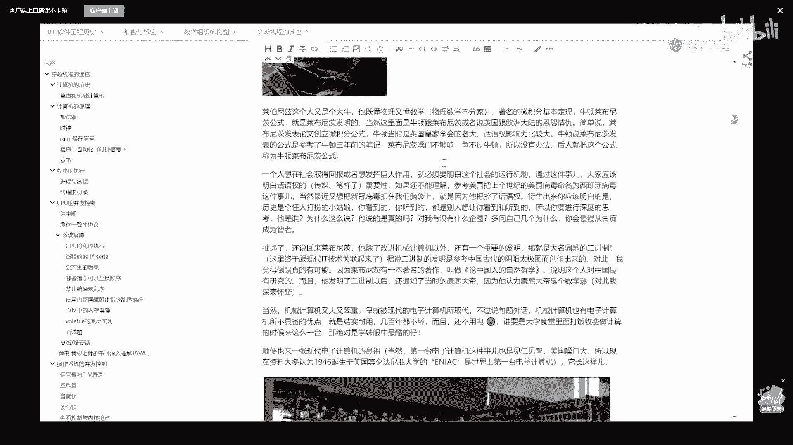
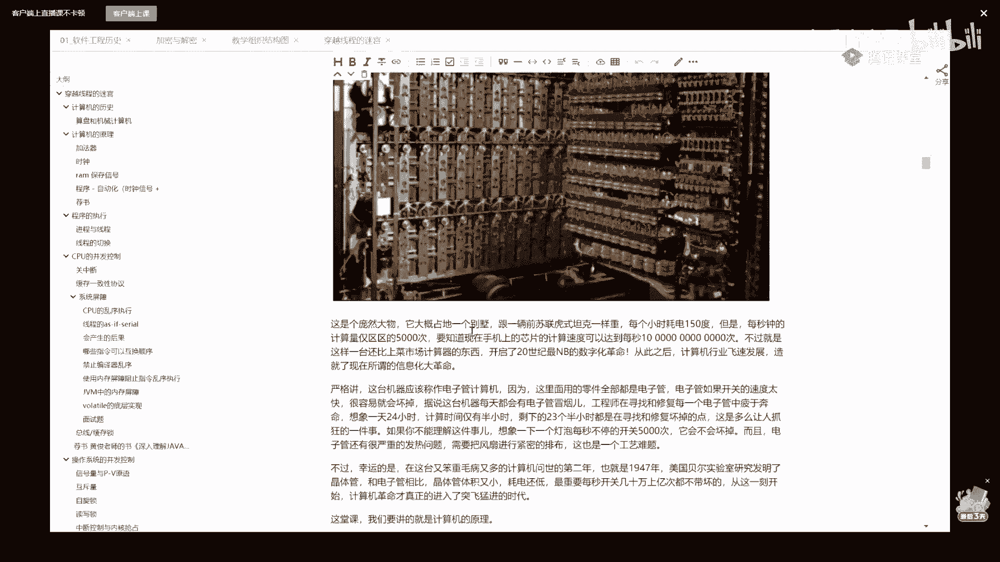

# 【马士兵教育】MCA架构师课程 主讲老师：马士兵 - P21：多线程与高并发：1.计算机的历史 - 马士兵官方号 - BV1mu411r78p

别的我就不多做介绍了，呃我们开始今天的课，首先跟大家说呃，这个训练营呢也是我在今年最后一次讲纯现成的训练营了，呃为什么是这样啊，因为这个训练营呢我也讲过好长时间了。

后面的呢也就逐步的把这个训练营的内容呢会做更进一步的更新，这是今年最后一次讲了，呃希望大家伙珍惜，当然我后面还会讲其他的训练营，讲线程呢讲了好长好长时间了，呃讲到因为现场这件事啊确实挺重要。

呃尤其是你在去面试的时候，在进大厂的时候啊，在做各种各样的这种嗯，和别人去交流的时候，就关于这件县城这件事呢问的是特别特别多，那么县城的我们的课程里呢也讲了三季了，后面我想更的就是第四季了。

呃这三季的内容呢其实还是挺深入的，足以涵盖呃大厂的90%以上的这种面试的内容，呃，但是呢有很多人呢对于现场的透彻理解还不是很到位，所以在我第四季里面呢，我是打算从最根儿上啊，从最根儿上给大家讲。

现场的内容有的时候呢其实大家伙对于现场的理解不到位的时候，是因为他不懂硬件，不懂硬件，基本上就不同软件，所以呢我在后面讲的时候会从cpu的电路原理这块开始，呃，今天呢就尝试从这里开始。

这也是一个小小的尝试啊，讲的不好的话呢，大家伙多担待啊，可以开始的话，我们就开始好吧，呃给老师扣个一可，好，那么这次讲呢我会，嗯嗯，呃这次讲呢我会先从计算机的历史啊，简单跟大家伙慢慢聊，还是那句话。

你听我的，听我讲课呢，咱那会儿聊聊天，然后呃慢慢听着就成了我们简单聊一聊计算机历史，聊着玩，公开课呢大家伙呢也不要说太给自己太大压力，说我一堂公开课我就要拿到一个什么样的程度，达到一个什么样的程度。

学到多多多牛逼的知识，知识呢肯定是要学的时间来积累，所以公开课呢我们轻松一点啊，嗯，这个我们聊聊几次你简单的历史啊，那个以前有那种，尤其是现在最近一个阶段，这个好多的好多小伙伴呢。

他的民族感自豪感特别爆棚，还有说他是把把算盘当成计算机的起源，这个可以这么说，为什么呢，因为那个后面我会讲啊，有有比较牛逼的计算机的鼻祖，它的0001的来源啊，就是零一这个来源它是来源于中国。

号称是来源于中国的阴阳八卦，好吧，就是这八卦图，长长长这样的八卦图是吧，哎他是说灵灵感是来源于这儿，但是说计算机来源于算盘，我觉得这事儿其实是有点夸张的，不太靠谱，这东西历史这玩意呢是仁者见仁。

智者见智啊，我就写着玩，你可以不同意，非要追求计算机鼻祖的话，实际上最早开始的时候呢是一个机械计算机的发展历史，就是17世纪的欧洲啊，大量的工业模具需要计算，那这时候怎么就做计算呢，欧洲那时候没有算盘。

所以就催生了很多科学家自己发明的计算器，这个计算器呢它会长这样。

待会儿可以可以可以看一眼，它实际上是纯机械计算机。

好吧，长这模样啊，但是图我是随便找的。

别的抓过来，的实际当中呢可能比这个要简单一些或者更复杂一些。

但是很牛逼的，它这东西是纯机械的，就是摇齿轮就可以了。

这边齿轮摇进去，那边齿轮输出结果嗯，最早的发明人呢它叫做帕斯卡啊，我不知道多数人应该听说过这个人的名字叫帕斯卡。

就是我们平时所说的压强单位啊，怕不怕千帕等等，这些是我们的压强的单位，如果说这个你不知道你学计算机的小伙伴应该知道这门语言。

这门语言叫什么，passport好了。

这门语言就是为了计算这哥们，他是机械计算机的发明者，possible学过这门语言，能给，老师扣个一来很古老的一门语言，有没有有没有同学学过或者听过的sugar嗯，呃一般来说比较新的这些小伙伴啊。

就是比较年轻的小伙伴是没有听说过这个名字的，passgo呢是很早很早的一个计算机科学计算语言啊，我上学那会儿是学过pass pascal语言的。

后来呢这个机械计算机已经发明之后呢。

经过了五历代的这种改进啊，就是改进的特别牛叉啊。

其中有一个的改进者，我觉得值得说，这哥们儿叫什么呢，这哥们儿叫莱布尼茨，这样啊，我把这个图看看是不是能给大家放大一些。

不太好，不太容易，放一会儿再说。

这哥们儿是叫莱布尼茨，这哥们儿就更牛叉了，多数的同学应该都学过微积分，微积分应该都学过呃，著名的牛顿莱布尼茨公式，好莱布尼茨是谁说的，就是他其实很多历史上的东西说起来比较好玩儿，严格来讲。

牛顿来不及此公式很，有可能，但是历史就还是那句话，就历史是胜利者书写的，那个历史上很很有可能只有莱布尼茨一个人发明了这个公式，这个公式发明之后呢，当时牛顿这人呢，他是英国皇家学院的皇家数学院。

应该是他这时候呢权力比较大，话语权比较大，比较牛逼，他就想着把这个发明给抢过来，后来牛顿呢就发表了一篇文章，就说莱布尼茨的这个公式是抄了牛顿以前的手写的一个笔记。

莱布尼斯说我没有抄，牛顿说你又抄了，那个时候牛顿的话语权非常大。

后来莱布尼茨争不过他。

因此呢后面莱文尼茨发表的这篇论文就被牛顿抢走了一半，结果后来这个公式就叫做牛顿莱布尼茨公式，这个咱们聊着玩儿呃，我不知道大家了不了解话语权这件事，那个当今世界话语权最大的是谁，米国嘛。

那个他想把他想把新冠命名称命名成什么名字啊，这个大家知道吧，当然那是英国是抢人家的，抢人家的成果，美国是要干嘛，是要把一个差的东西强加给强加给我们是吧，我们当然是不能同意的。

当然历史上有一个病毒叫西班牙流感啊，不知道大家听说过没有，你看到这个名字的时候，你一定会认为这个是西班牙那边流行起来的，但实际上是这样吗，no是当时的美军，驻扎在西班牙的美军内部开始流行。

但是西班牙的话语权肯定是干不过米国的，所以最后这个流感居然被命名为叫西班牙流感。

当然我们现在还在争是吧。

这个不说了啊，我们说回来来了一次。

这哥们儿呢改进了计算机，机械计算机之外啊。

它还有一个非常非常重要的发明，这个发明就是大名鼎鼎的二进制。

好这里呢终于跟计算机扯上关系了，其实呢从历史来讲。

二进制是首先发明，然后才诞生了现代的计算机。

当然莱布尼茨啊，他是在一本著作里头确确实实说明了他的二进制是来源于中国的。

在中国的这个阴阴阳八卦，而且呢莱布尼斯这个人确实对中国有所了解。

他有一本书叫做论中国人的自然哲学。

这里面，就提到了阴阳八卦，然后呢他当时发明了二进制之后呢，因为他当时的那个生活的年代正好跟康熙的年代是一个年代。

呵呵挺好玩的是吧，讲了点古老的东西，零这个012进制发明之后啊。

到1946年的时候才诞生了现代的这种，我们说现代意义上的计算机呃。

这个就这个意义上的计算机呢是这种电子管计算机。

就是二极管三极，你可以理解为灯泡一类的好吧，如果你不能理解它的物理原理的话。

没关系，你就理解为什么灯泡一类的嗯，那么他的名字叫anniac啊。

现在都认为是诞生于美国的。

比起法尼亚大学，就这玩意儿呢当时呢是一个特别特别笨重的东西。

它大概呢占地是要跟一个别墅那么大。

但是呢他每个小时耗电，150度，但是每秒钟的计算量是多少次呢。

5000次好，这是什么概念，目前我们手机上的芯片的计算速度可以达到你自己数零的吧。

达到这么多次。

就这么大一家伙呃，不过呢由于它是刚刚诞生嘛。

后来经过一系列的改进才诞生了现在的我们的手机的芯片，当时的这玩意儿啊。

它的计算速度甚至比不了我们现在的菜市场上的计算器。

不过计算机飞速发展啊，那会儿的计算机呢叫做电子管，电子管呢就是你可以认为它的这个通一下电，灭一下电，通一下电，灭一下电，而且有事儿没事儿的老坏。

后来呢从发明了这种晶体管之后，就是归一归为为为为原料的这个晶体管发明了之后，我们现在的阶段你才经真正地进入到了突飞猛进的时代。

