# 系列 1：P22：多线程与高并发：2.计算机原理 - 马士兵官方号 - BV1mu411r78p

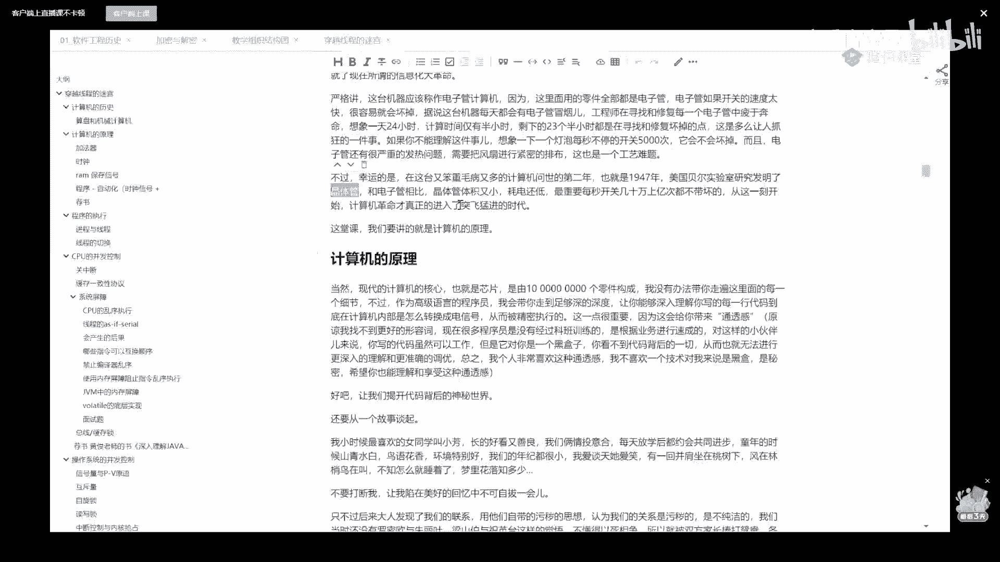

我我在下面这个里面呢会简单跟大家讲，就是现在这种晶体管计算机的基本的原理呃。

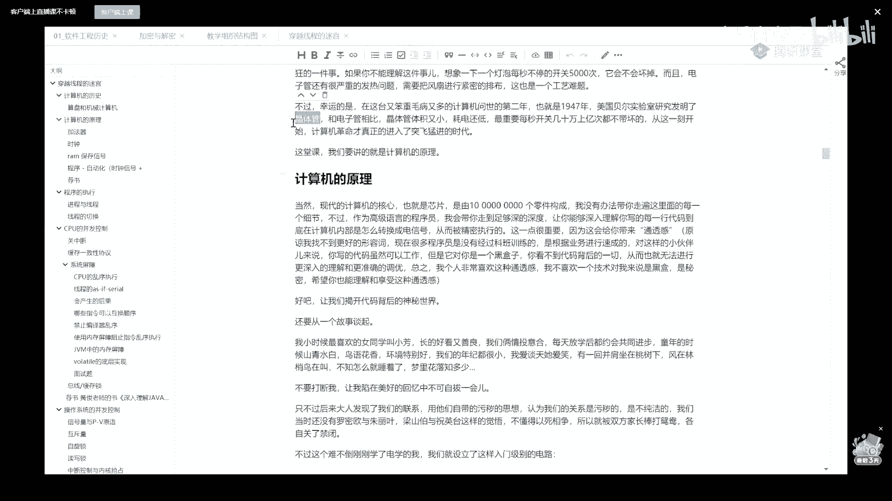

有不少计算机系的同学啊，其实呢你们在学课本上也学过。

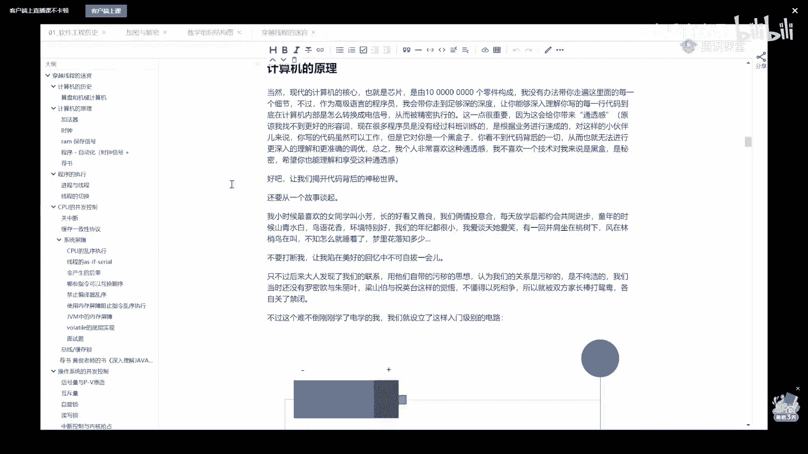

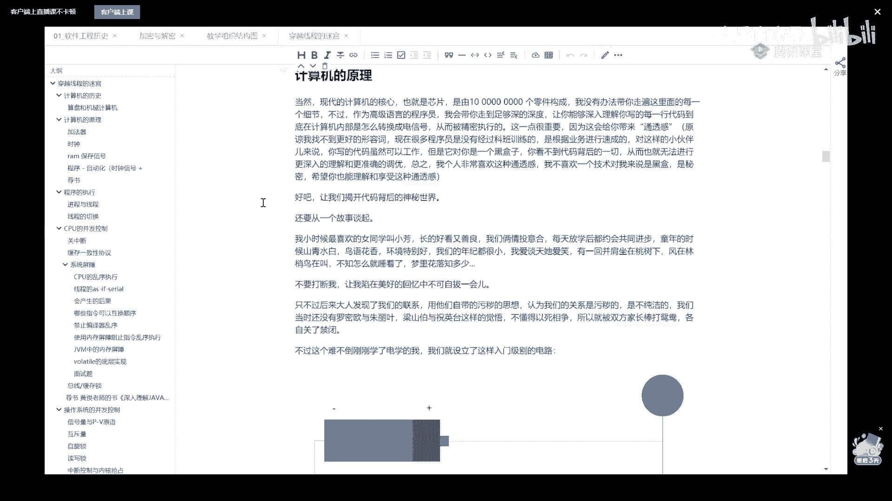

待会儿稍等啊，因为我我的这个水确实喝多了，主要是要养好这个嗓子，给大家讲课，那个心灵老师能不能过来一下呃，跟大家伙儿先简单聊一会儿，小天天我我我我我去排空一下膀胱好吗，好允许的同学给大家给老师扣个一。

不允许的同学，你给老师扣7564x6564的开立方，把最后结果告诉我啊，答对了我就不去了，没有一个答对的。

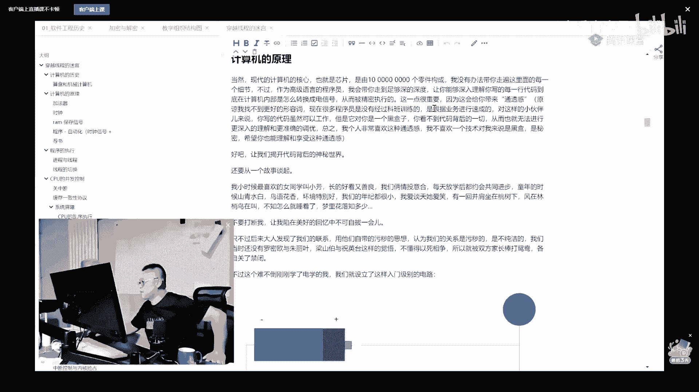

看来必须去啊，今天今天那个学生老师必须得尝尝露面，这个没没有办法啊，比较特殊对啊，快去。

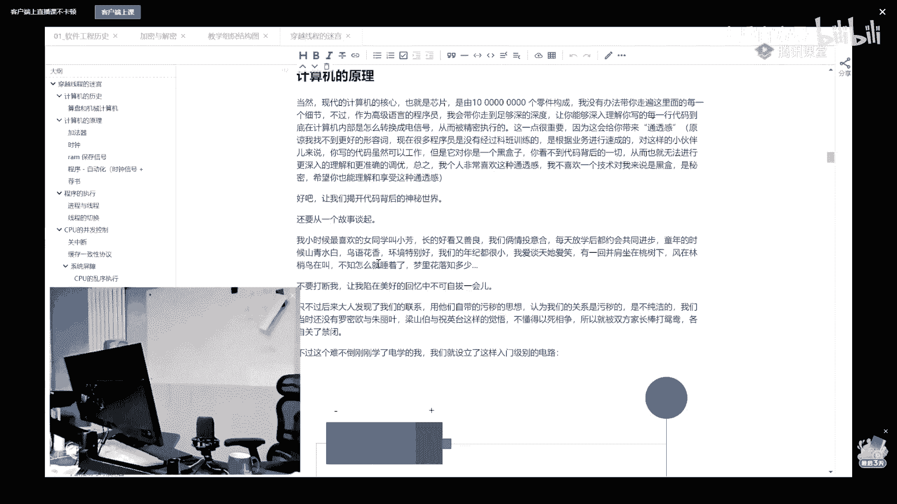

哈喽哈喽哎呀。

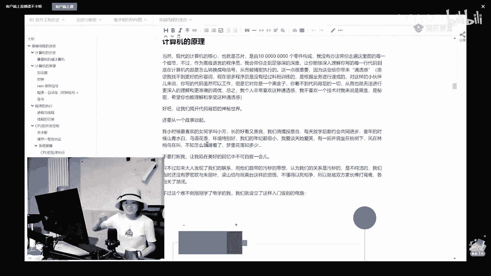

哪个摄像头在哪儿，哦，不好意思哈，我先把我撤掉，哎呀马老师这鼠标怎么用，讲到哪儿了，然后大家有什么问题吗，啊今天马老师的资料可以扫一下二维码，这个二维码在哪儿呢，稍等稍等，不要着急啊，大家看一下。

然后这个这个里面有一个成员，里面有一些诶，有一些咨询老师需要马老师的资料的，可以去这个里面找一下，咨询老师，要一下这个资料，诶成员在哪呢，稍等稍等啊，这个还不太清楚，唉呀呀唉呀呀，我是马老师啊。

马老师已经结婚了，小孩都有了呃，大家需要你们加班，有工资吗，这个必须要这个必须有工资的啊，这个课有录播吗啊是这样子的啊，咱们今天晚上是听课听直播课，听完直播课之后呢，去找你们的咨询老师。

就当时你们怎么报名的，怎么来到这个直播间的，肯定是有一个小姐姐带你们来的，对不对，然后你们去找那个咨询老师，所有的笔记资料，还有回放都可以通过他们找到。

多线程的所有的笔记资料都可以找到他们心理老师都能都是你，们大事对对对，还有这个小豆，都是我们的咨询老师，都可以去找他们，马老师嗓子不太舒服啊，大家担待一下，讲的课还是没啥问题哦，所有的小姐姐。

目前除了我之外，其他所有的咨询老师都是单身，有任何的问题呢，你们都可以去找他笔记资料，说好来欢迎一下马老师啊，给你这个仿佛听见了掌声。

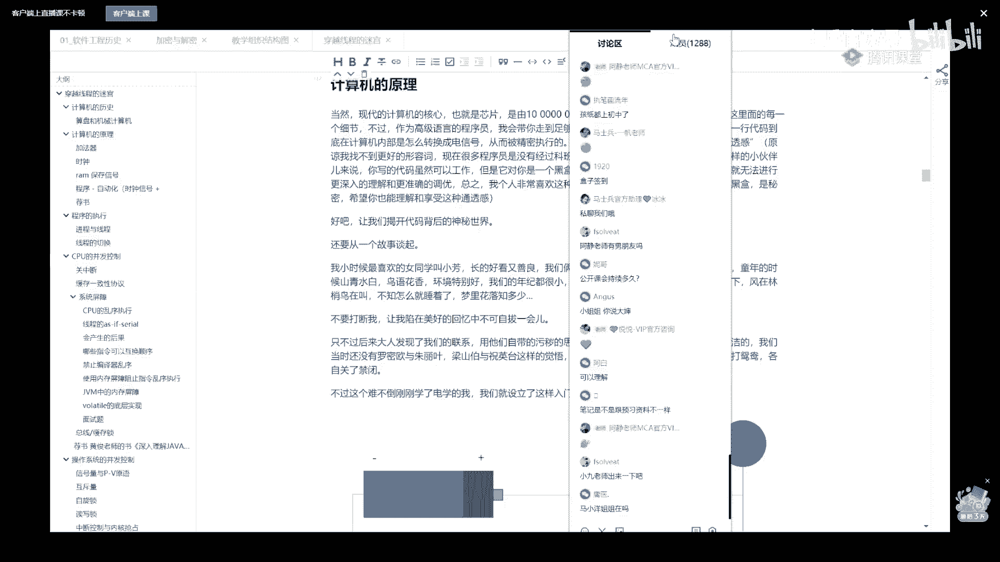

唉心刘老师居然没露脸吗。

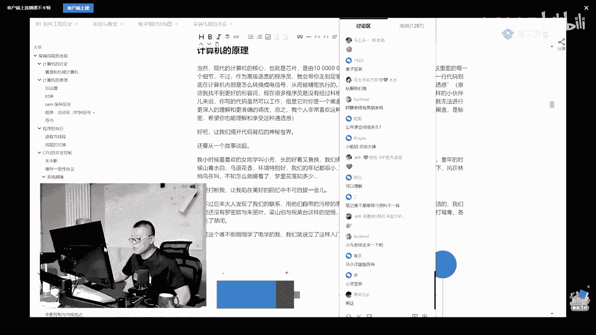

太过分了啊，这不好意思。

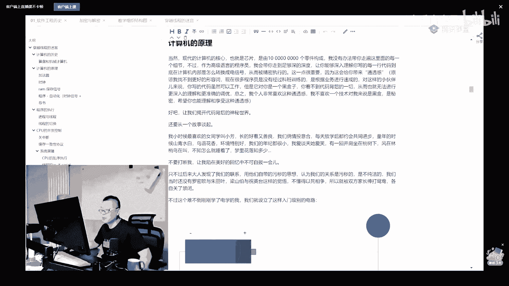

今天有可能会多去几趟厕所啊，非常的抱歉嗯，听我说，就是这就是这个这个这个厕所去玩，最最重要的感觉是什么，爽对吧，那个，人生中的四大爽你们知道吗，多喝枸杞的，枸杞是不能喝的，枸杞得泡水。

然后喝水不能喝枸杞，人生中的四大爽叫做久旱逢甘雨，他乡遇故知，膀胱排空时是开玩笑啊，呃我还是那句话，你今天嗓子比较疼，我说话会速度会慢一些啊，那个希望大家会儿能够体谅好，不说了啊，我们继续讲。

我们讲我们讲到了说这个计算机呢它到底的原理长什么样，要想理解这个原理呢，其实你要学好多东西，深刻的原理，你要学好多东西，药学，如果你还想了解二极管，三极管的原理，那么你就必须得去了解物理学。

但是呢我们今天要讲这玩意儿，我肯定就讲的没完了，我们还是要讲现成的，会快速的加到，拉到县城这里呃，但是呢我会快速的带你简单的过一遍，一个cpu的原理到底长什么样，你就记住这一点。

县城和cpu是永远离不开的，这哥俩就是一对，一般来讲一个cpu对应一个线程，现在cpu有些比较牛叉的叫超线程，一个cpu有可能对应两个线程，四个线程，你就记住任何跟你聊线程的时候。

脑子里就浮现出cpu的概念来就行了，好认真听，嗓子不太好，大家认真听看这里现代计算机的核心是芯片，这个芯片呢到目前为止是由10亿个做个零件构成，你可以这么来理解，我肯定没有办法，但你却说。

是设计一款芯片，你也看不懂，也没有这个意义，但是呢我也不希望一个芯片对你来说是个黑盒。

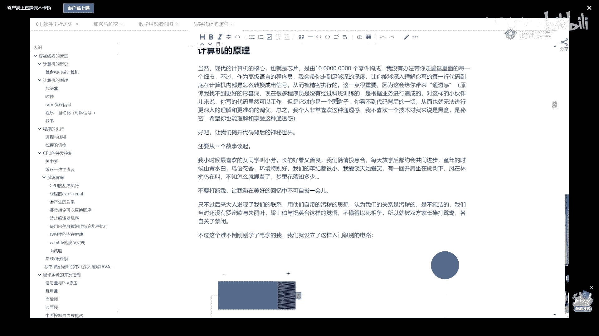

你是里边儿，你什么都不懂也是不合适的，简单带大家了解一个芯片背后的故事，呃这里呢我写了一个小小的故事啊，你们自己去读一读吧，我就在这就不就不重复了啊，小时候最喜欢的同学叫什么呀，叫小芳嘛，村里有个姑娘。

村里有个姑娘叫小芳，是真的好看又善良，后来呢人们不许我跟小芳联系，那这时候怎么办，这时候呢由于有二进制的存在，我刚才说了，莱布尼茨发明了二进制，我们可以跟小方怎么通通话呢，我在可以设计一个电路。

拉根电线，把灯泡放到小方家，我来控制这个灯泡的亮和灭，然后我们自己约定好一个语言，我就可以跟小芳来通话了，比方说我b上打开，我们就发明了自己的灯泡语言啊，两两下连着量放量和灭绝灭和量等灭灭等于我。

我只要连我只要给他八个信号，我就可以给他说一句话，叫放学等我，ok在这里面呢，我相信大家，伙都能看得懂，如果量我们用一来表示灭，我们用零来表示一，一就等于方是吧啊。

一零等于说也就是说我是可以通过二进制来给小芳来传信号的，而且这个信号的复杂程度呢，你会发现呢它和我们的信号宽度是有关系的，呃如果我们拿中文来举例子的话，这是两位信号对吧啊，用用用用两两下来代表一个字儿。

那最多我们能代表几个字儿啊，二的二次方是四个字儿，那如果说我想表示更多的信息怎么办，简单没关系，我们只要加那个信号的宽度就可以了啊，我们每次发三个信号代表一个字儿，那我这时候就能代表多少。

2~3次方是吧，同学们好，假如你想交流的更加复杂呢，更加复杂怎么办，再加信号宽度，比方说我如果想用一个新号来能够代表所有的汉字，同学们，你们想想我们大概需要多多宽的宽度呢，多宽的宽度非常的简单。

你就要知道我们有多少汉字就行了，整个康熙字典差不多是47000个，1600个汉字已经足够了，所以你自己算一下二的多少次方，你自己算好吧，基本上二的16次方已经足够代表我们所有的汉字呃。

这里头呢其实就是最基本的一个概念就出来了，这个概念是什么东西呢，这个概念叫做编码，编码这玩意儿是特别好玩的一件事情，那个呃在你要说在这种编码里，我用111啊来代表放这个字儿。

我是不是自己还可以发明另外一种编码，在另外一种编码里，我用000来代表放这个字儿，可以不可以可以的，那我就想问你了，如果说我用这种编码对我的信息，最后给它编成了二进制，111110。

但是呢我用这种编码来去解析这些信息，能解析出来吗，能不能不能，比如说编码是个什么东西，编码实际上是一张表，在这张表里面存着这样的二进制，代表的是哪个数字，或者说哪，一个文字在另外一张表里面。

如果你用这张表进行的编码叫in code，用另外一张表来进行解码，这边代表的是别的，它能解开吗，解不开他解，当然它解开之后是什么呀，就是著名的乱码，所以当你的程序里头如果出现了乱码的话。

这根上的结果是在这里，你编码的码表和那个解码的码表，它不是一个我今天讲的东西呢，我从简单到复杂慢慢讲，有一些水平比较高的，你就照顾照顾咱们水平稍差的好吧，那当你理解了这件事之后，就说我们编码的宽度。

实际上跟跟你能表示的信息的这种这种呃复杂程度它是可以成正比的，好吧，我呢有了我们自己的编码的码表之后呢，开始设计我们的下一个电路是吧，就这个电路太简单了啊，那个如果往复杂里考虑的话。

我们就有了越来越复杂的电路，比如说这个电路，大家听我说，我下面呢给大家采用的这些个图都是我的一个学生，在他自己的公众号里啊，我征求了他的同意之后，给大家拿过来的，他做了一些动图，我觉得挺好的。

我拿过来拿过来用了啊，这个是他同意了的，没有关系，那个你看啊，如果你稍微学一点电路的话，你应该知道，如果这个东西啊是我们要求的一个结果，这两个东西呢是我们的两个开关，那只有两个开关连起来。

这个东西才能亮对吧，那如果你只要有一个开关断着这个东西就是断的，这时候呢实际上就有了一个什么概念呢，就是有一个输入和输出的概念了啊，你比如说我这里是连着的，就表示我这里输入的是一个一。

我这里断开的就表示我这里输出的是一个零，输入的是一个零，那么这个呢我们可以看成是它的输出，这时候我们就会有这，样的一张表输入如果是零输出，如果是零，最后输出是什么，输入零输入一输了什么。

这个这个数是什么，好听我说就这个东西呢，你也不用仔细去计算它了，这个东西就是我们的微运算，也就是说我们的电路啊，实际上是可以完成我们编程语言里面的位运算的，可以用这样的符号来表示呃，如果你学过数字电路。

那么你就会知道这个东西一般我们称之为叫什么东西呢，叫门，要么是吧叫门电路就是非常简单的做微运算的电路，一般我们称之为叫门电路好，这里就就它就是数字电路的知识，没有关系，你现在先不用管它。

因为今天主要讲的还是县城，这个我学了看着就脑壳疼啊，今天我们讲的不是数字电路啊，那个呃当然啊除了上面的这种电路之外呢，其实也也有这样的电路，就是原来这两个是串联的，现在改成并联的。

他只要有一个通了灯泡就亮了对吧，那么你也可以做这样的一张表出来，那么o同样的我们换另外一种画法来表示这个电路啊，这是另外的门电路呃，当然还有更复杂一些的门电路，它除了可以做与运算，可以做或运算。

还可以做异或电路，还可以做或非电路呃，那么在这些电路的，基础之上，同学们，我不知道你们发现了没有，其实呢它就可以开始做运算了，做做什么运算呢，做一个二进制的加法运算了，如果用这个电路。

你就完全可以做二进制的加法运算了，一我们设计一个比较复杂的电路，这边输入一边输入零好，我们最后得到的结果让它通了，ok这不就是加法运算吗，对吧，我讲到这儿呢，我中间其实省略了很多东西。

如果你想理解加法运算这件事儿好，这个电路是用来做加法运算的，它是异或电路和雨，就是异或门和与门，异或电路和与与电路的一个综合性的运用，就是简单电路连到一起的时候，就可以做成一个复杂的电路。

就可以做什么呢，就可以做一个二进制的简单的加法器，二进制简单加法器这件事儿它需要有两个输出，为什么有两个呢，你理解这样一件事，你看啊，我们说1+12进制的最后的结果，这里是零，这里是一。

你就会发现呢它有一个加和的输出，还有一个什么呀，还有一个近卫的输出，所以它有两个输出好了，这个东西就是一个加法器的存在，呃听我说，我在这儿呢给大家推荐一本书。

如果大家伙儿想简单理解计算机的电路是一步一步怎么走，成现在的这样的一个结果的，推荐大家这本书稍等给大家拿一下，计算机的说呢层出不穷，有一些经典的书啊，叫做经久不衰，这本书我推荐就叫做编码。

当然还是挺复杂的，如果你看完那本书之后，其实还是挺复杂的，当然那本书看完你还可以用手工自己做个计算机都都可以的，简单的计算机从呃这个，加法来说，加法器来说就是上面的看到这个东西叫一个半加器。

为什么叫半加器呢，是因为啊你你你两个的输入来说，你你的这个加和输出，有可能和这里的原来的另外一个一个一个加和的输入，还要做加法啊才可以，所以它叫半加七，就是半加七。

到最后呢几个电路的组合成才会组合成一个全加器，这是一位的全加器啊，注意这只能算是一位，好多个全加器的串联就会变成多少位的加法运算。

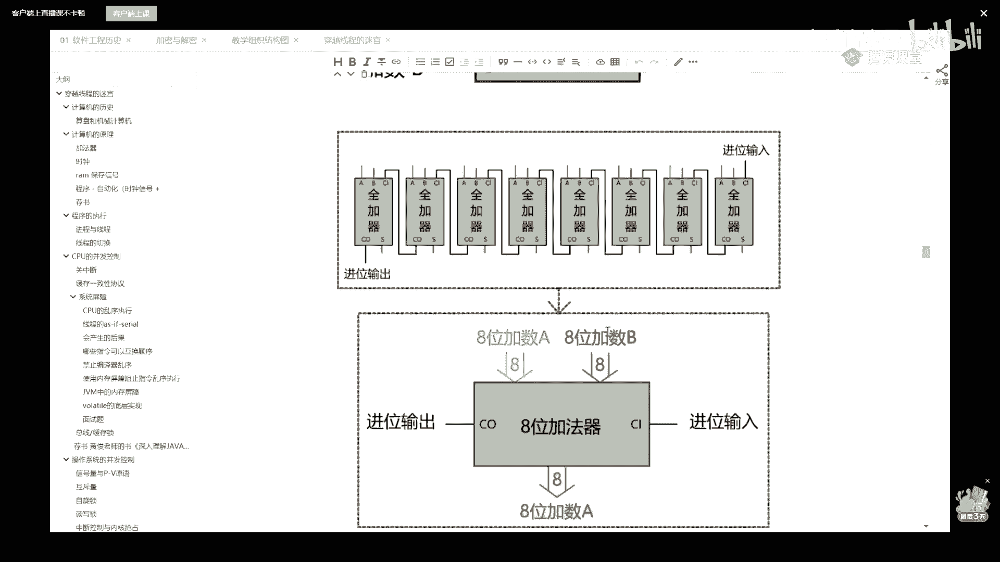

比方说全加器还全部用这种电路来串联起来，就会做成加法器，只要有了加法器，我们就有了cpu最核心的部分，cpu用来干什么的，还记得吗，用来做计算的，cpu最核心的部分用来做计算的，只要有加法器的存在。

cpu就可以做计算了，好cpu有好几部分构成最核心的部分，我们叫它a l u，全称呢叫arithmetic数学logic逻辑unit，叫数学算术逻辑单元，a arithmetic logic unit。

听我说有同学可能会说了，老师那除了加法运算之外，我们还有别的运算呀，我们要减法运算呀，减法运算可以变成加法运算，加负的就行了，我们有乘法运算呀，乘法运算可以变成多次相加，我们有除法运算呀。

除法运算我们可以变成多次相减，对不对，所以只要有加法去存在，记住一个cpu就已经出来了，我讲到现在能跟上的，给老师扣个一，这不是剧组讲的吗，对说的很对啊。

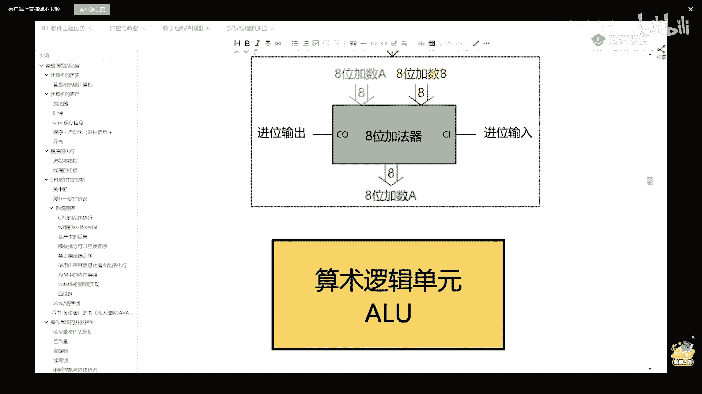

我就是简单扫扫盲，因为有很多人呢它是没有这个基础的概念。

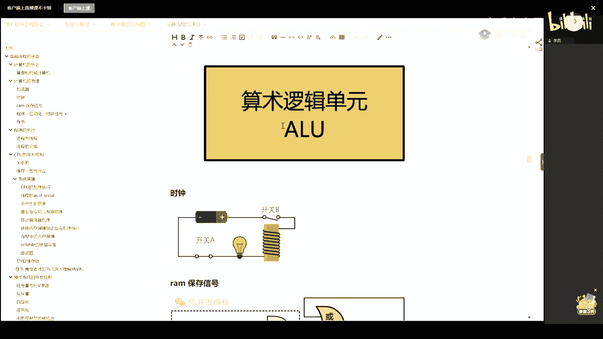

所以他理解不了多线程的一些东西啊，那么有了这个加法器的存在之后呢，同学们，你们想想看这个加法器这玩意儿呢，你有一个输入八位的好，另外一个八位的输入两个一加，那最后一个输出是谁呢，输出在哪里。

输出我们可以放在这里，但是我每次只能计算一遍，你发现没有，如果你用电路来做计算的话，我把这个开关给它合上，把这个开关关给它打开，把这个开关合上好，最后我只能算一遍，我算一遍之后，我如果再加一个数呢。

不好意思，我又得重新输入一遍，太麻烦了，这个时候呢有另外一个电路就诞生了。

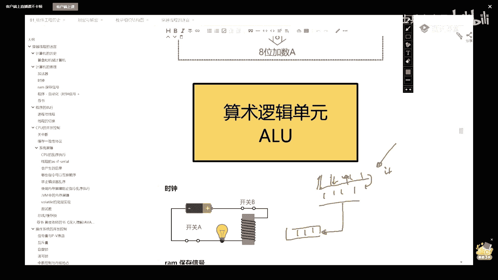

这个电路叫什么，呢这个电路叫时钟电路，时钟电路特别好玩的一件事情呢，它是不停的开关呃，如果大家伙学过电磁什么左手的左旋定律，右旋定律啊，不知道你那个高考初中初中还是高中来着学的，就是线圈一通电。

它就有磁性了，他就把这个开关给拉下来了，线圈一断电没有磁性，这个开关就上去了，所以你会发现就做成一个特别好玩的电路，叫时钟电路，使用电路什么意思，就是他不停的开关开关开关开关开关好这个东西呢。

它就会产生一个不停顿的，就不能叫不停顿的，就是通电断电，通电断电，如，果我们能设计一个电路是通电，它计算一次再通一次电，它又往下一步计算一次，再通一电一次电，它又往下一步计算机一次。

这个时候我们就产生自动化的电路了，你发现没有自动化电路就诞生了，你想象一下，因为里面他说的确实比较复杂好，也就是说这个玩意儿是驱动着我们整个cpu来做一步一步运算的核心，ok那么如果他的速度够快。

我们的cpu的速度计算速度是不是就够快，是不是这样的，所以我们所说的主频计算主频啊，我们这cpu的主频是多少，和这个玩意儿息息相关，虽然它不是说嗯完全跟这个相等的，但是跟这个玩意儿是相关的，听懂了吧。

你看啊，赵成挺说了一句话，我觉得挺挺那个什么的，挺挺挺有代表性的，跟大家交代一下，赵成景说能研究出这个的人的脑子是怎么长长的，你好好听，赵正廷，没有任何一个人一步到位能够得到现有的计算机cpu。

中间呢很可能一个人发明了二进制，另外一个人呢发明了二进制的一个电路，其他的人呢又把这个电路做了综合，然后呢做成一个完整模块之后，其他人又把这个模块做了一些综合，它是一步一步迭代出来的。

你不要想着说我们一步到位的好吧，咱们咱们现在学东西为什么累呢，是因为呢我们的课本里面会尝试着一步到位的告诉你，现在经过了成千上万人迭代之后的智慧，你好好想想，你能不累吗，有了这些个电路之后呢，还不够。

为什么为什么还不够呢，是因为你们想想看，如果我们做三个数的加法，01+1+12，我们一般是呃不不能用一二啊，1+10那个这两位做完之后啊，这两个格的中间结果一定得存储起来，听懂了吧，你不能存储的话。

你怎么样跟下一位来做计算呢。

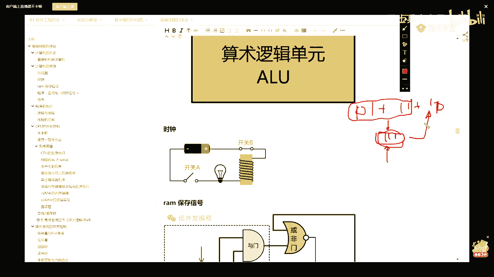

所以我们还缺一个电路，这个电路是什么，这个电路就是著名的存储电路，好了，想去研究就研究它，这个电路就是著名的用来做存储的电路，这个电路的特点就是你在前面的输入，最后的输出会保存在这里。

不管你输出的是零还是一，就是你下一次再通电的时候，它这个边的输出它不会变，它会存储下来，ok这个呢有了这个玩意儿，我们就可以做什么的呢，用来做存储了，当然大家应该知道我们做存储的呃，最核心的点是什么。

最核心的这个这个这个这个模块是什么内存吗，有时候我们中间至至少我们可以把中间结构给存储下来了，有了这几个电路之后，经过复杂的芯片设计，我就直接告诉你，最后我们的cpu就诞生了。

这个一般我们称之为叫锁存器，它每次就这个电路这个复杂电路只能锁一位，我们把锁存器串联起来。

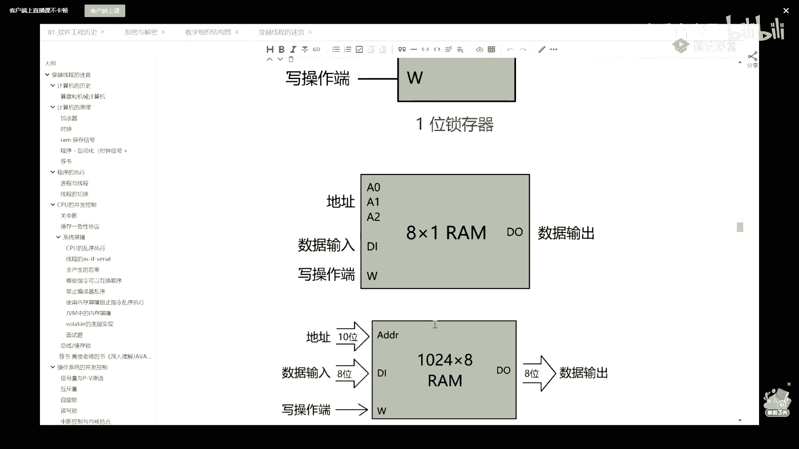

我们就能锁八位，我们把好多储存器串联起来。

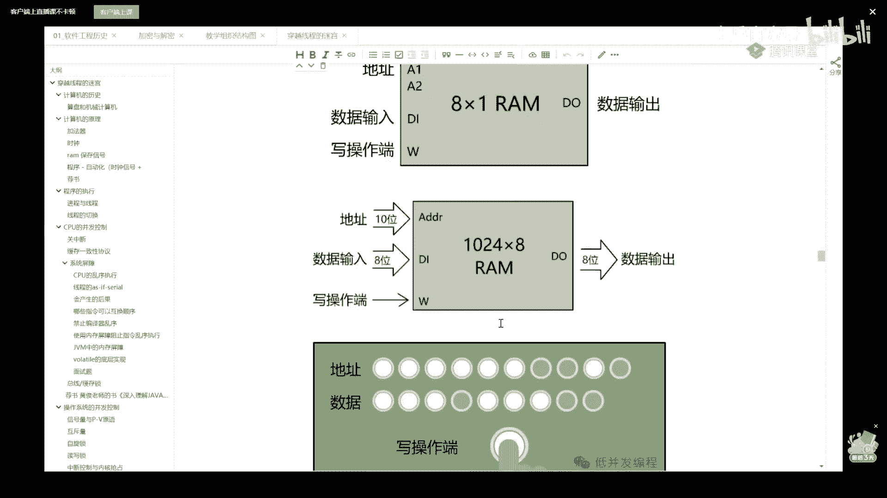

我们就得到一条内存，同学们，这个时候你就开始可以开始琢磨了。

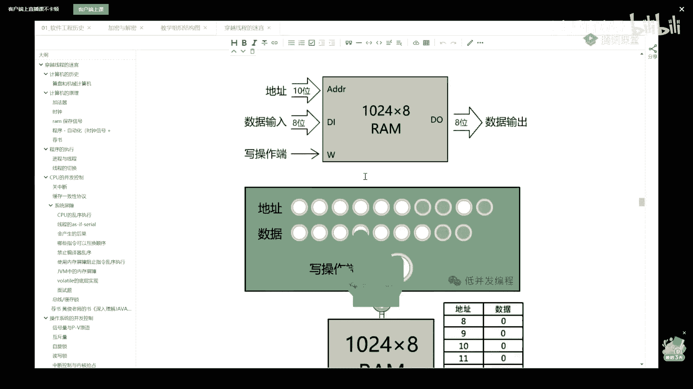

琢磨什么呢，一个一台，真正的计算机到底长什么样了，就是我们把我们的计算机里面，这是我们的锁存器，也就是我们的内存，在我们的内存里面，每一个内存都有它的地址，同学们，你们想想，作为内存来讲。

你总得记录着它，说我往哪个地方存了一位什么东西，对不对，我们所谓的编程就出现了，我们的程序会写成什么样子的呢，在某一些地址写一些数据进去，在另外的地址里面写一些指令进去好，这个指令有可能是加法。

有可能是减法，有可能乘法，有可能是除法，然后我们cpu怎么做计算的，cpu是我如果想往这个地址写的时候，我就把这个地址指定指定，这是地址指定指指定地址的电路，然后这里头呢是个数据。

我一按写操作就写过来了，当然我cpu还可以干嘛，指定一个地址来这里是读操作，我就把它读到cpu里了，比如说我们的现在等等，这个这个，就可以变成这样的一个结构，cpu和所存的东西构成了，这里是做计算。

这里是做存储诶，构成了一个很好的一个组合，我们的程序好啊，我们说简单做两个加法，一个数存在这一个数存在这，然后把这个加的指令放在这里，然后我们做计算的时候怎么做呢，cp从这里首先读出来哦。

这是一条加法指令，然后根据我们的格式要要求加法指令，前面两个数是用来做加法的，两个数好，我把第一个读过来，第二个读过来，通过电路做一次加法运算，再通过这样的一个方式写到后面这个地址里面去搞，定。

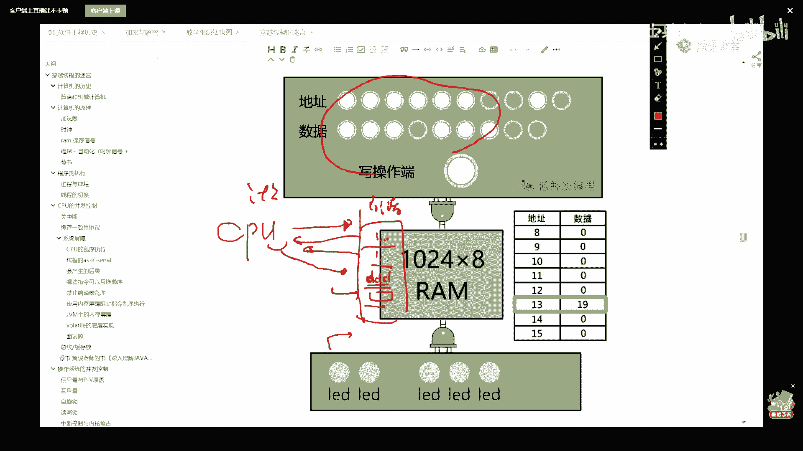

我不知道讲到这儿啊，大家对于嗯我们呃cpu的一个简单的计算。

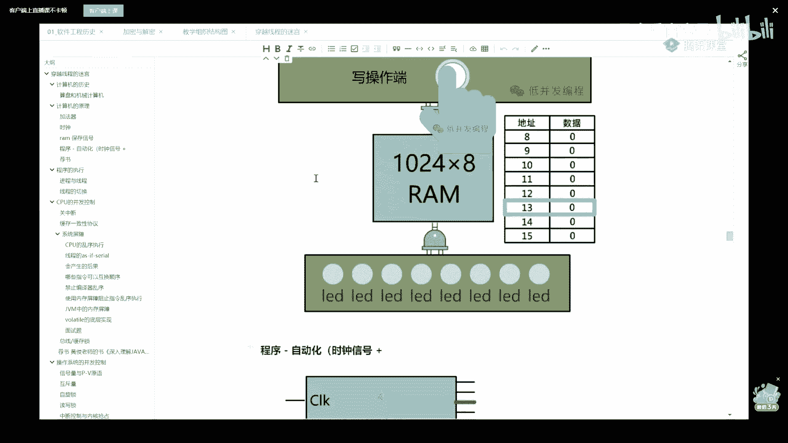

一个简单的模型，是不是脑子里头有一个小小的印象了。

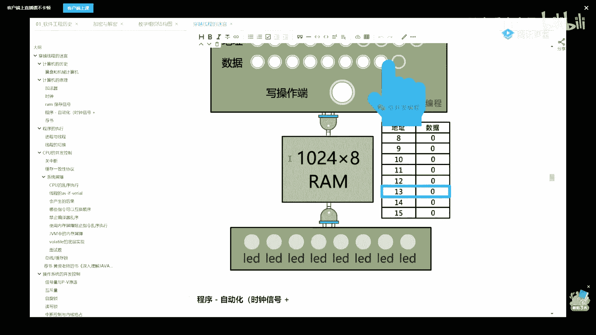

能有印象，能给老师扣个一当，盯着那个手指啊。

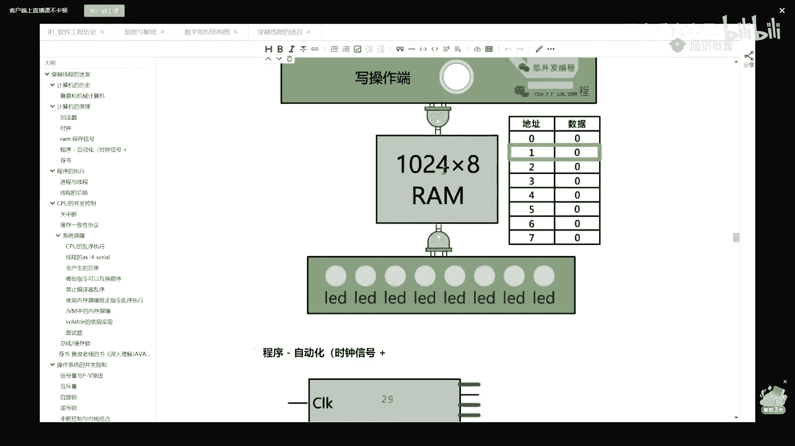

我把它凑过去啊，有点懵，有点懵，没关系啊，听我说那个我呢后面会再给大家做一个简单的总结，k好好听我说，后面我会在我们自己的课程里面呢，呃把这部分内容给大家加上，给大家把这些基础的东西都给大家扫完。

扫了盲，让你把基础打得牢牢的，基础不牢地动山摇，我们回想一下我们前面讲的几种电路，有一种时钟电路在这里不停的来回的输输入断开，输入断开驱动着我们不停地往前走，它驱动一次，我们做一次计算驱动。

第二次我们就拿第二个第二个指令驱动，第三次我们就拿第三个指令，这样的话呢我们的程序就可以做成自动化的了，由于呢我们的程序可以存储在我们的内存里面。

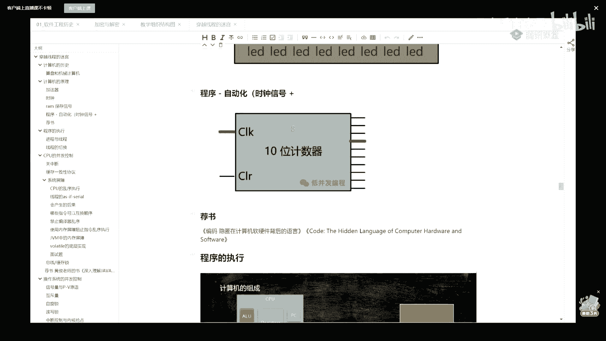