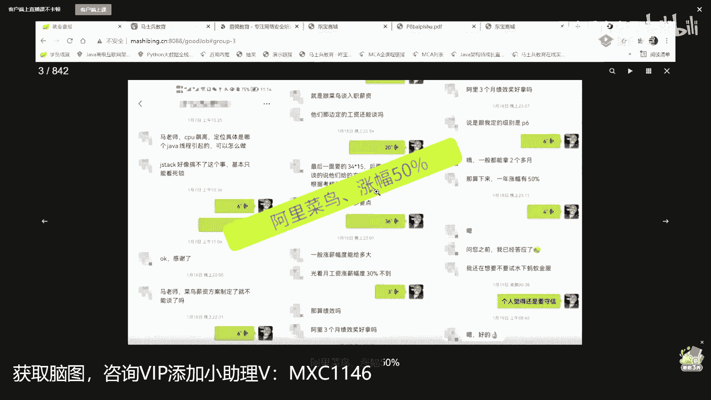

# 【马士兵教育】MCA架构师课程 主讲老师：马士兵 - P26：多线程与高并发：6.课程答疑 - 马士兵官方号 - BV1mu411r78p

11点钟我们结束，我留一点时间，也是我们月末了呃，做一点小小的广告，大概15分钟不会超过这个时间，我首先介绍简单介绍我们课，我想介绍这个课呢，是想通过这样的方式来介绍。

通过我们整个机构的历史的方式呃，我们我们自己的机构呢，大概是在2019年登录腾讯课堂，当时呢我们做了现有知识模块里面的，这部分内容呢你们可以去自己去读，多线程的部分呃，内存的部分，漂游的部分。

操作系统的部分，网络原理的部分呃，底层的一些东西，还有呢架构相关的一些东西，各种消息的中间件，还有能源码相关的为服务相关的优化，相关的侧开相关的5g相关的数学，相关的软性的知识。

这部分呢我把它简简称为知识点课程，就是每一部分可能它是一个完整的知识点，你可以认为什么是什么，卡夫卡克哎，各种的rabbit q，它是一个完整的知识点，这个大家能理解吧，这是19年我们上的课，这个课呢。

当时我们的目标呢是，让咱们大多数的程序员，要拿到30~50万，绝大多数通过这个课是可以是可以到的，呃但是呢就是说把握性不太高，为什么不太高呢，因为有很多人说说老师，我们知识点确实学了，但是呢我没有项目。

大家找个工作应该会了解，没有项目的情况下，你的简历很苍白，只写知识点的话，写不出技术水平来，所以呢在20年的时候，20年的前半年，我们整个课程体系做了项目的更新，项目呢我就不一谈了，网游的最近也可有。

有有一个小伙伴靠这个就进了腾讯啊，然后呢嗯何佳芸的入门级的项目微妙的嗯，网约车的啊，一级一流量的嗯，推荐系统的啊，流式计算的啊，以及中台中台这个我们打算换掉了，因为中台这个概念在阿里都快被逼引起了。

然后呢呃我们举一个小例子啊，就是拿网约车来讲，网约车呢目前是已经讲到了第四版，第四版应该讲完了，现在正在讲的是第五版的内容，嗯，这每一版主要是什么呢，用的不同的技术层面，呃。

第二版的时候我们当时用的是spring cloud奈飞呃，就是奈菲那套ring cloud微服务相关的东西，第三版的时候呢我们讲的是spring cloud，阿里巴巴国内用的比较多的啊。

就是阿里巴巴相关的，sorry，第三第三版的时候是按耐飞的，更进一步的详细的解释，以及里面的什么多些这个分布式事物啊，嗯这个这个这个各种的网关怎么怎么做，怎么做呀，各种发布怎么做啊，滚动啊。

这是第二版的一个增强版，然后呢呃第四版的时候是spring cloud，阿里巴巴也是国内最现在最流行的呃，目前我们讲的是第五版，第五版是什么呢，就是第二代微服务，它全称呢是叫做service mesh。

叫服务网格，它的落地呢落地的名字叫is steel，这个你听说过也好，没听过也好，不用担心，因为这里呢是老师带着你往前走的，呃，就是我们帮你找最流行的东西，你不用管，这两个的结合就是知识点结合上项目。

这两块知识的结合，大概基本上非常有把握的，可以让你到30~50万，好了，那么在这个基础之上呢，有些小伙伴就又不高兴了，说那个老师，我本来我现在就拿30万了，诶，今天有来的，有没有拿30万以上年薪的。

给老师扣个一，有没有报名，美版都能看吗，是的嗯，应该有啊，因为现在30万以上年薪了，就是不不太难达到了啊，不用客气，也没有人认识你啊，在30万年薪以上，我们又做了一门更深入的课呃，这个课呢叫做架构师。

全称呢叫m c a级架构师，这个课的目标是什么呢，这课的目标是构建互联网，三高相关的架构知识呃，这个呢叫做high availability，高考应用，high scalability，一块叫高并发。

一块叫低延迟，两块相辅相成，这全称叫高兴的，我们怎么样才能达到这种互联网级别的，三高架构呢，我们的双11也好，018也好，流量呢非常的大呃，12306，好那这时候我怎么怎么能撑得住呢。

好就这个架构该怎么做出来，在整个围绕这个架构的体系，我们大概做了1234567，大概14篇左右的理论课，在这嗓子关系。

我真我我我我我真就不想给你打开了，好吧，你如果感兴趣的话呢，ok，那么在这个基础之上，市面上n多的机构讲这个东西啊，不管他能不能讲，能不能落地，反正人家也讲呃，在这14篇理论的这个这个内容上呢。

很多人呢觉得自己就掌握架构了，其实不是，为什么，不是呢，因为我呢是从线下教小白开始呃，来给大家讲课的，我最希望的架构师是叫做能落地的架构师，是就是你只会画图，落不了地这事儿肯定是不合适的。

能落地的架构师，那什么样才能叫能落地的架构师，就是我们做了这样一个项目，这个项目呢叫东宝商城啊，啊这个东现在我们改名了，不叫这个咚咚咚咚锵咚了啊，现在叫，那个黄老师带队来完成，东宝商城的全方位的落地。

那么这个落地呢，就是你要从搭建分布式的d生中心，搭建分布式的配置中心，索集群事务集群啊，就各种集群搭好之后，注册中心监控mq的集群，es taning，mysql存储集群，在各种的集群的基础之上。

再来进行实际当中的代码落地呃，在目前我们这个项目已经部署到了公网，是大家是可以访问的，我找一下访问文档，我找一下访问文档啊，呃目前还没有给他配域名，目前是一个ip地址，不过没有关系。

大家挑这个ip是可以访问的，并且它是可以做到弹性的扩缩容，比如说我们现在的并发量的支撑呢，100个没关系，你如果想来1万个程序，什么都不用动，只需要在云端做扩展就可以了，呃到目前为止。

我们大概部署了五台物理机，大概应该是有七八十个逻辑节点，这个我我我这么讲，大家能听懂吗，因为有些基础确实比较弱的人啊，不知道大家能不能听得懂，嗯现在应该有数据的只有手机，应该是应该只有手机。

应该是有数据的，只有手机啊，我加入购物车。

登录一下。

叫什么，我说我跟我说，这是不是已经有了，好不掩饰了，因为这个，已经假如不购车了，我们去结算，买了两台是吧，呃做在线的支付还是快递在线支付啊，尽量提交，我选支付宝啊，支付宝来支付呃。

那个支付宝呢主要是有沙箱的存在，所以他那个服务呢一直不是很很到位，嗯，你要愿意扫个码的话，你就可以做支付了，那就算了，我就我就不做这个支付过程嗯，就是怎么说呢，我们这里的这个东西呢。

不是为了给大家展现前端，而是为了给大家展现后端呃，大家伙呢也可以在夺宝商城的嗯。

在首页的地方呃，可以直接选我们的白皮书，你可以就可以直接下载了啊，小伙伴们呃，我们后面呢还是想把整个的项目呢，大概今今年想给他做得，非常非常非常的完善，把各种层面的东西都给大家考虑到，都坐在这里。

怎么说呢，以前呢好多同学呢说，老师我我是真的很想跟完这个项目，因为更完这个项目的效果大概是，百万年薪左右这样一个水平，为为什么这么说啊，嗯看一个小小小的案例，这是我原来一个学生。

他当时呢是嗯花了90万，花了90万，那个进腾讯拿了90万年薪，那么腾讯呢问他的问题是这个问题，是这个问题，你感兴趣你可以做一做设计，就这个设计做完，那你离腾讯的90万年薪就近了一步，你明白吗。

呃那么这个东西呢，实际上它集成了集中了互联网的三高，30秒抢1亿用户数3000万，我们说并发百万吧，可以说百万到千万之间，高并发连续抢只能抢成功一次，资源评估，这个跟秒杀非常的类似。

对不对，这是他做的一个设计，这个呢我们形成了专门的一个课程，叫架构设计，那么我们这个项目呢是叫做集架构，设计和架构落地之大成者，以前呢我们在没有更完，我们自己的知识点之前，我们这个项目呢。

也是很少有同学能赶得上直播，在这里跟大家说一下，8月1号第二个版本直播课，这个项目的落地过程，8月1号落地开始呃，你放心，你跟完这个项目一定叫做物有所值，他会是以一个项目为中心。

redis那个知识点这方面，调一那个知识点相关的算法，那个知识点ai推荐那个知识点，分布式微服务，那个知识点秒杀，这些是我们原来讲过的课程内容能听懂吗，这个是我们核心中的核心，好了。

我觉得我整体的课程的内容，我就大概介绍完了，可以这么说，就是按照薪水来讲，305000 100150，我同学说了嗯，老师这个课程的价格是多少啊，今天的活动点，应该是12000多块钱。

那么有同学说老师说第一我没有这么多钱，没有关系，分期24期，一个月500块钱左右，老师那个我我还是没有那么多钱分期，另外一种分析方式，前四个月一分钱不用掏，老师我还是没有那么多钱买迷你版。

我把薪水先涨到30万再说，再往后再补后面部分，但是如果买迷你版再补，就会比这个价格更高一些，我个人是推荐一次到位，腾讯课堂上大多数跟我们讲类似课的，大多数只有这这两部分，甚至这两部分都不到。

很少有人有这部分的听懂了吗，我建议你一次到位就行了，有同学说，老师我学到一定程度是一个什么样的水平，我觉得废话呢，我也不太想跟，在这个网址上大概有接近1000个学生的，我们学完这课部分。

学完课程之后的内容，你可以一个一个一个挨着牌的看都可以，有最近的，有以前的，找出一个我们任何一个造假的来，1万块钱一赔一好吧，我直接赔，直接赔给你，这个呢可能是最近比较多的，我们可以看几个典型。

怎么说这个两个offer，这是应该是最呃。

是在年年年底那会儿，因为他当时要求说老师你要公布我的信息，麻烦你过半年我说可以，他在阿里拿的是60万年薪，阿里拿在京东拿的是70万，最后呢是选了京东，他说感谢马老师，在马老师这学了很多东西。

你们今天晚上来，我虽然讲的慢，你们应该也会也会有所收获，所以我们课程的量比较大，主要是因为呢我们确实讲的比较细，我们想讲的比较深入的内容，比较细致的内容，即便讲到这儿，我个人其实还不太满意。

所以在我们的很多的内容，目前也在动态增加，什么叫动态增加，就是说当我们感觉到感觉到，学员应该还要掌握这个知识的时候，把这个课程给加入，当然我加入新的内容的同学说，老师那还要还要不要单独收费。

需要老师怎么样单独收费呢，每年一块钱，学费是这个数，这个学费顶1年，那第2年再升了，升升了内容怎么办，给我们一块钱，你再学1年，第3年呢再给我们一块儿，写在合同里是没有问题的，呃这个大家能能听懂吗。

没问题吧，课程是没有有效期，它不是说没有有效期，有效期是1年，但是我们你后面还想继续学，我们那个更新的内容怎么办，因为我们内容经常更新的，每个月都会更新，说一下那什么吧，说一下最近的我们的更新吧。

打算呢还没有讲到更新，感觉今天是有点点累啊，我没关系啊，我们慢慢聊啊，大家只要不嫌我慢就行，今天的节奏怎么样，今天今今天那个推荐有更新啊，最近呢大概有这么几个更新。

第一个呢叫做金九银十的面试突击，每年有两个跳槽的高峰期，也是非常优秀的，涨薪的时间，一个叫做34月份，一个叫做90月份，想进一线大厂算法你是避不开的，互联网三高项目的直播课，这以前呢从来没有说。

专门把这个课程拿过来做直播，8月1号开始，嗯还有一个比较牛逼的课，是我们最近更新的，要更新的bat bat w w是什么微博，因为我们这个老师他是在微博，孙老师原来在京东，现在在微博。

他会给我们分享这样一门课，叫做大厂项目的bug处理经验课，这个是很牛逼的一门课，是绝对值得听的，以前我们买我们课程的学员，要不要再单独交费，要不要要不要有怎么调一块钱，听懂了吗，这四个课全部对对。

今天报名的小伙伴不用单独干别的，第一原来mca课不涨价的情况，万一后我们会稍微涨涨点小价格，没办法，我们把整个内容从腾讯课堂，全部搬到我们自己平台，但是带来我们成本会巨量增加，一个流量费。

一个空间费云云云，空间的好，今天晚上在老师这儿依然是这样的，这四个不单独升一分钱，还有以后的升级依然是一块钱，好了能get到这一点，同学老师可以，所以有没有有效期有1年，但是呢后面的像类似于这样的升级。

还会多的是记住了吧，因为我们升级的内容，从是从原来的那个很小版本，一直升到了现在，2019年报名的学生，到现在为止，依然可以听我们现在的更新的内容，没有单独收过一分钱啊，最近的倒计时的两天指的是什么呢。

是有一个内容要没有了，就是这个腾讯课堂，8月的7月份的活动平台，满减是700块钱，到8月份你想要都没有呃，我这么说啊，就是今天你麦克，很可能比前面的学员还便宜，比后面的学员也便宜，为什么。

因为这个优惠不是我们给的，是腾讯给的，过这个月你想找我要，他一定没有我们三榜第一的奖学金，每个榜第一奖100，三，榜第一三百，这里头有一个有一个1000块的优惠啊，至于其他的我就在这儿就不接受好吧。

化妆美容呢我大概都介绍完了吧，嗯案例呢可以看，我每次我老师啊，我直接跟你说，我每天最喜欢看到的就是这些，知道吗，关注我们，那明天再见，这个呢是从呃进，这是阿里菜鸟到阿里菜鸟，它大概涨了50%。

这是当时找我咨询那个jvm课程的时候，就调优的课，跟菜鸟谈那个入职的工资啊，34x15的一个薪水，你自己算50万年薪左右嗯，这是国美offer涨薪涨了三倍，这是我们班主任老师在跟他沟通啊。

入职了还可以三倍哈哈，他原来是8k现在是23x14，这哪值三倍，这个是老师指导之后，校招，入职阿里金子翻了倍了，就是说有的时候呢你看上去好像呃，这1万多1万块钱，但是呢其实你收回这1万多块钱呢。

叫做分分钟，还有一个我还是那句话呃，一个人来讲，他一定要不断地拓展自己的认知，我们能带给你的是20多位老师，你拿大腿想一想，你也也会比同龄人走得快得多，这个是虾皮85万年薪的，这个是两个月呢。

大概涨了百分之多少，你自己算吧，我也不知道啊，这是火币网offer翻了倍的，这是14x14的，涨了5k的啊，这个是四个月涨了30%的。

这个网址是对外公开的，呃你们自己去找好不好，嗯，呃有很多相关的大专生，这是自考大专的对日项目转过来的，这个是自考大专业性水平翻了倍的，这个是网络大专，14k涨到25的，这个是大专非科班薪水翻了倍的。

呃这个是沈阳的大专，66。5~14啊，在沈阳那边还可以啦，a哪去了，啊这是不在，呃在面试申通的时候，接没接到阿里的电话啊，不然就进阿里了，也比较倒霉，属于这是大专学历呢，收到了很多大厂的offer。

从没工资到就业的啊，呃不展开了，好了我我觉得我要说的就说到这儿呃，大家伙呢现在还有15分钟啊，对今天晚上的内容基础课嗯，对我们课程的，对我们那个那个那个那个活动的内容，你都可以跟老师聊一聊，好不好。

那就聊着玩儿，我是知无不言，言无不尽，不做夸大，也不会谦虚，想找比我们更牛逼的课，你应该是找不到的，还有女学员的对嗯，女学挺多的啊，这是非科班的女学员，5年的，找几个女学员的吧，就是你可以自己搜一搜。

我没法打开来看一看，因为很多人呢你的情况很可能是一样的。

这是女生两个月17~24了。

这是女生跳槽，就是涨了10k的。

就一个月10k啊，就一个月就涨1万了，不是说那个好多个月啊，这是25岁女生年薪30万offer的，这个不清晰的呢是原来接的啊，就去年或者前年的时候清晰一些。

都是啊，今年或者去年下半年啊，这是刚才那个结果了啊，四个月薪水就直接翻到48万了，这一点不夸张啊，我还是那句话，你通知老师，这里要找到一个假信息的一个p的老师，直接赔你，把学费赔给你啊，就是还你学费。

再赔你学费就懂了吗，我觉得他说的挺好玩的，好多知识融会贯通，这是对的啊，这个也挺挺典型的，因为这个这个这个姑娘呢是呃原来在外企，后来想再跳一他薪水，它主太凶了，你知道吗，他平时不努力嗯。

老爸老老公孩子热炕头呃，这个又重新回到行业，拿了外企的offer，还涨了薪水，而且最最关键还涨信他原来是33k，现在涨到45k。

呃呃二本的女生，小公司跳到滴滴的，年年年薪涨了13万，这是你1万的投入，这个是45岁的女生，在多伦多涨了50%，这是一个女同学，滴滴和小米2个近60万年薪的offer啊，嗯我不一一找了，好不好。

不要等着我们涨完，涨完价格，然后呢，煮完了，然后才想起来这件事，那你就亏大了，而且腾讯的这种奖学金啊，也不是说月月有的，1年可能只有一次，金九银十开始了吗，金九银19 10月份才开始啊。

但是我们现在对金九银十的突击班，已经开始准备了，明白了，这图标也是很好玩的啊，我们每一个课开的时候，并不是说我们拍脑门儿开都是有它的道理，是多年经验的总结，就是突击，为什么要突击啊，为什么要突击。

同学们是因为有些同学着急找工作，他来不及呢，把知识掌握的比较嗯扎实，那这时候怎么办呢，短期有没有办法安利，就是学员们的各种需求，促成了我们所有的这个课程，呃这是重点，只是个突击涨薪40%。

这哥们儿是报名报了七天。

学了四节面试突击课，直接收获了亨特加offer。

不是盖的啊，很很牛逼的突击课本科生嗯，这里有个链接练错了啊，哎咱们小姐姐把这个链接跟我，把那个告一下，报告报告一下啊，这个标题跟那个图片没有对上啊，他本来是本科生啊，突击了一周，涨了10k的。

就是没有对上，嗯这个是专科生。

31岁，然后两个月的面试，突击多个offer就搞定了。

什么叫突击，你想短期就想涨薪吗，突击班是不是挺好。

mc课是一个很神奇的课，就是我们在搭建自己平台的时候，我们不是搭建了自己的平台吗，我们的主打歌叫m c a，就mc课是一个很神奇的课，呃我这么跟大家说啊。

在我们整个体系课堂里面，嗯这是实战课，这是体系课，呃，可以这么说啊，就是在我们整个体系课堂里面，很多的课程都是从mc可以衍生出来的，比方说网络安全啊，这个是通过我们那个原mc可衍生出来的呃，目前嗯。

我很很可能要在后面把它给单独出来啊，对你现在购买的话，运维了呃，go on就是我们mc课，数据结构与算法的呃，前端的ai的智能物联网，嵌入式物联网测试的，然后云原生的游戏开发的啊，呃e的啊。

那个呃dba的就是说我们很多很多的课呢，其实是从mc克眼上开来，就是mc课是个，什么东西，我把它定义为程序员的人才成长课，我再说一遍，这个东西叫人才成长，就是我个人建议你扎扎实实。

以每年一块钱跟着老师把mc慢慢学完。

你会真正的体会到，别人那百万年薪是怎么达到的，从最开始的提问的智慧怎么问问题开始，教你一步一步一步一步跟着老师慢慢走，有一部分知识点的课是录播课呃，我们的项目的课是直播课o，播出很科学的一个的讲课方式。

就是讲课的效果，就是现在你看到，你去别的地儿可能就不坑，有的人可能挨过口，老师这里来，老师这里的还没有任何说，认为老师这里有坑的，听懂了吗，老师你的课太多了，能不能给我一条清晰的线路，说对了。

课不多就不能做到因材施教了，所以在这里像那种短期的内容，老师可以帮你定制路线，你可以从哪一节，哪一节，哪一节并行学，然后再汇总到哪一节，然后用几个月时间，完成一个什么样的目标啊，一个大体的演示嗯。

这就是我们现在的课，只有这样才能达到现在的这个效果，直播课会给代码吗，呃代码是公开的，当然可以给，我们是准备把它做成开源课的。

你重点体会的，其实啊今天我们顺着我们，我我今天的内容讲可以吗，今天我给大家呢也留了一些东西，比方说c a s是一个什么样的东西，我今天呢就给你讲到了，先这个这个叫，呃对这个缓存行的一致性嘛。

实际上呢保证它的可见性，这件事还是比较复杂，呃明天呢我跟你讲可见性和有序性可以吗，在后面讲多线程的赢呢，我就不再讲这个底层的内容了，其实底层内容挺好玩的，但是后面我想讲一些什么东西呢。

讲一些大厂的面试题呃，最近大厂的面试题呢又开始作妖呃，各种各样的面试题都出现了，如果你们想去领一些大厂的一些，面试题的资料，也可以去找一下我们小姐姐领，呃，我们到目前为止应该是讲解了。

大概是300左右的题，已经讲完的，预备讲的是接近1000到呃，会做那个题库，说哪道题不会了，在我们库里搜一搜，好了就到这吧，好不好，你们去骚扰骚扰小姐姐，骚扰骚扰小姐姐，给你放音乐，放点小小的音乐啊。

放身上下，我的膝盖，这么跟你说，如果你还比较年轻，做老师关门弟子，就是如果你要比你还比较年轻，想做老师关门弟子的话，其实你水平还没到东北人嘛，呃河北人，那个我最近有想收一些关门弟子的计划。

就是这些关门弟子呢，我想第一个呢要把它送进大厂，第二个呢打开它的人声空间，就这个东西还是挺难的，嗯，打开你人生空间的需要，打开你的格局和思想呃，呃，我直接这么跟你说，我大概1年我大概要读100本书。

就是我在教学管理给大家讲课，在这个之余，我大概会读完100本书，如果你们年轻的时候啊，你到老师这个年龄，你会发现你的人生很广阔，什么35岁，什么中年危机不存在的，第二个呢我我我我自己报课程。

我直接这份工就这么跟你说，基本上几10万是有的，就是你到最后你会发现，你这辈子做的最值钱的投资是叫做投资，你自己好吧，你会发现呢你去做别的投资可能会亏嗯，可能会亏得一塌糊涂，但是你花在你自己身上的钱。

十倍百倍的赚回来，负责任地向你讲，咳咳咳咳，半小桥菩提下策马，纵向后，灰黑的烟，三叶的秋吹落了3月天，风满楼游荡在心间，走啊喝点水，下下聊着玩啊，我慢慢说啊，对，嗯当然我看书也特别快，这个是练出来的。

这个最开始看书也慢，后来我慢慢发现了书的一些规律，对有时间我慢慢讲给你们听，就特好玩，其实有很大多数的书呢，是不不值得你去仔仔细细的阅读的，诶你们想听老师给你们推荐几本书嘛，想听的你给老师扣个一好不好。

有想听的，我看有多少人啊，还在，训练营的人少了一些，公开课的人还是还是有一些啊，想推想听推荐人文的，还是想听推荐技术的呀，人文是吧嗯技术好吧，这边人文这边技术呃，推荐技术的话呢其实比较简单。

我我我我我给你看，我们上vip的时候给大家推荐的几本，嗯这是原来曾经给大家推荐的几本，几本书啊，嗯有一个编码是吧，深入理解计算机系统啊，如果有语言的话，推荐这两门c和java版。

当然嗯如果你跟老师学的话，那你就不用去再看这个书，是因为呢呃在科普o c e，java数据结构与算法，算法和算法导论，这个算法导论有点太难了，还有这个计算机程序设计的艺术，我不建议看呃。

像数据结构和算法这边你什么都不要想，就跟我们的算法直播课啊，就跟我们算法课呃，算法课老师叫左成云，这个有同学听说过的吗，如果不知道的话呢，百度搜一下，中国讲算法最好的老师，没有之一。

不说话是是去百度了吗，destiny destiny，destiny，嗯嗯嗯，嗯嗯嗯嗯嗯，嗯还有活人在听老师讲课吗，没有的话，我就我就下了啊，有是吗，多大必须都有嗯，看看黄老师简历。

还有一些这个内核系统，还有tcp ip，这些都是非常经典的书，但是你像什么什么java，什么快学30天，那什么这个速成那个速成你别看了，也没什么意思啊，马老师是不是在用传说中的机械键盘啊，师弟老师。

什么轴的，我忘了，1000 1200多，用起来很爽的你值得拥有，舍得买吗，如果你自己买嗯，买个1500左右的键盘，你们舍得买吗，是的，那岂不是要做到三回事嗯，不舍得就穷吗，我有十把键盘嗯。

小小你是那个小小小富婆是吧，其实啊，这个也很简单，多多挣钱，一句话呃，如果你理解不了，更深入的说什么宽广的结局啦，宽广的格局了，什么更高的层次了，你理解不了，这个没有关系，多挣钱总能理解吧。

就是别的不敢说让你多挣点钱，老师是最有把握的，知道吧，就课程别的不敢承诺，说承诺说你跟老师学完之后，涨薪这件事基本是百分百向你承诺，就多挣点钱，总是没问题啊，看看黄老师简历，可以啊，带你看一下。

找几个典型的简历给你，你们想想看哪个黄老师是24岁，年薪60万的时候，搭档是仅阿里是60万金的，金美团是85万，小股票一共是百万多，29岁年薪120万的，32岁的60万的大专，44岁大专的百万的。

想看哪个，呃算法工程师适合报名m c a嘛，算法工程师，你是ai算法吗，ai算法报我们ai课，ai课也是全网最全的和最深的，推荐系统哎呀，推荐系统谈不上算法工程师啊，你不要不要把自己叫算法工程师。

推荐系统的叫做，但是你得看你推荐确实是研究，推荐算法的吗，保ai如果你研究ai，如果你研究工程的到mc就是推荐系统，算法工程，听懂了吗，推荐系统工程mc，专门研究推荐系统算法的保ai课好吧。

20 24岁那个是吧，ok，多数不具备这个水平了，你30可能应该也没有。

黄老师24岁的水平，纯技术，一点没改啊，黄老师的原封不动的拿，拿阿里60万年薪的时候呢，后面的一些咱就不看了，好吧，呃课程里全有放心，就是我给你展示了任何的简历，他敢写的东西放心，咱们课程里全有。

只不过你是要用多长时间，以什么样的代价把它拿到手啊，这个也看看29年薪120万的，想看的扣一有十个扣一我就看，少于十个就不看了，三个四个五个六个差不多了。

仔细看这个简历啊，最值钱的是在这儿具有分布式高并发，高可用大数据量的系统架构，设计及研发经验，拿到年薪120万，这里占了80万，这里占了40万，看一眼课程里头关于源码的部分，四人源码。

呃林老师大概讲spring源码的话呢，两个半小时，两个小时分钟，一共讲了呃34节课，然后每节课的话呢，差不多两个到三个小时之间，差不多80个小时左右，好好想清楚这是一个什么体量。

就是说为什么读了我们的源码，可以达到p7 水平，是因为源码讲完呃，基本上你就可以做到可以定制spring了，注意是定制开发啊，不是拿它来用，不是用它，而是开发的，没法好论文转账开发呃，我建议你读博。

不然的话呢你在企业竞争力不强，听懂了吗，嗯如果不读博的话呢，转java开发是可以的，呃建议你跟我们ai的老师学，这是一个方向，艾老师主讲老师姓卢，卢经，原来腾讯ai主管北大的博士后。

爱奇艺的team leader，我给你找的老师没有一个是菜的，好同学，那个不敢跟郝老师学，其实郝老师的一两句话，会顶蔡老师的一堆话，承认就好，跟点牛逼的人啊，跟对人的话，选择比努力更重要，哈哈哈。

ai可能有哪些啊，另外课，我们看一眼啊，稍等，为什么我每次都是把这个iot的给忘了，嗯稍等片哥了，大概来看看了，那我找不到最新的了啊，看一下老版本吧，这个呢是a i和i o t的一个结合。

就是a i全称叫a i o t，呃ai的部分，然后呢呃语言的部分，然后i o t的部分呃项目的实战啊，大概大概有一个40多个项目左右吧，呃我简单跟你说吧，大概涵盖了这些内容啊，就是，第三呢是那个llp。

nlp呢，就是基本上涵盖了推荐广告，搜索推广搜三部分，那么量化量化交易量化呃，cv部分，加起来也就是a i o t的部分要多，要一下那个嗯，要一下那个白皮书就可以了啊，好了好了，真的不跟大家聊了。

嗓子有点受不了了，see you tomorrow，see you tomorrow。

