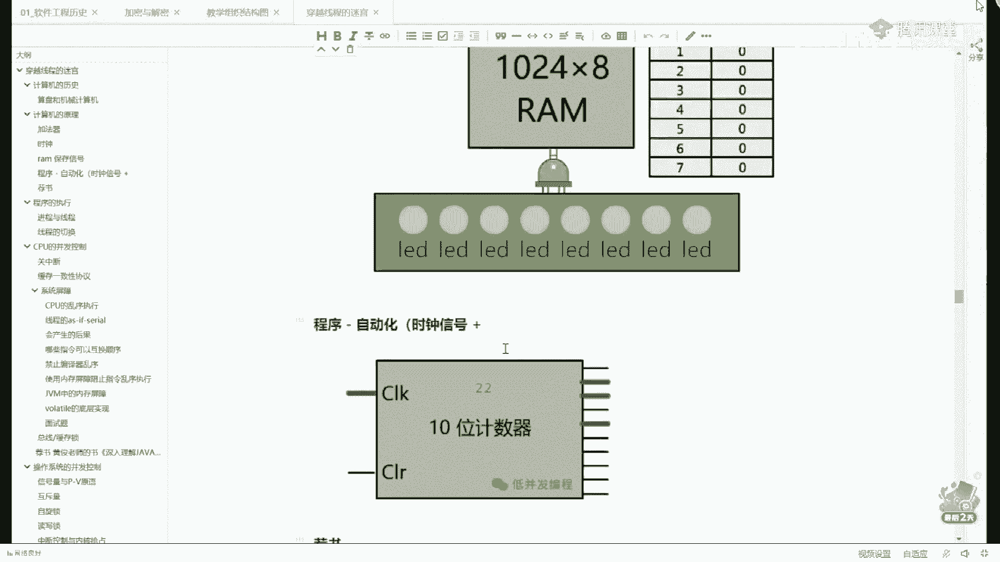
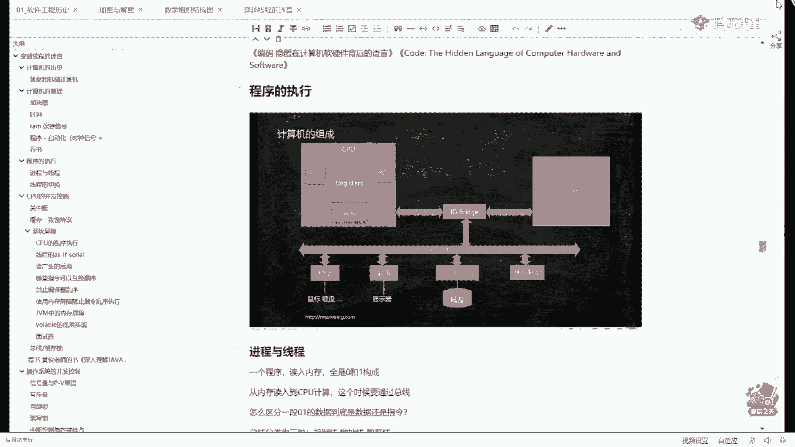
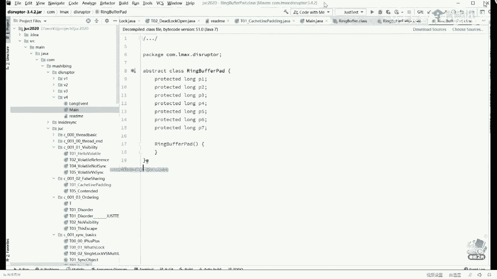
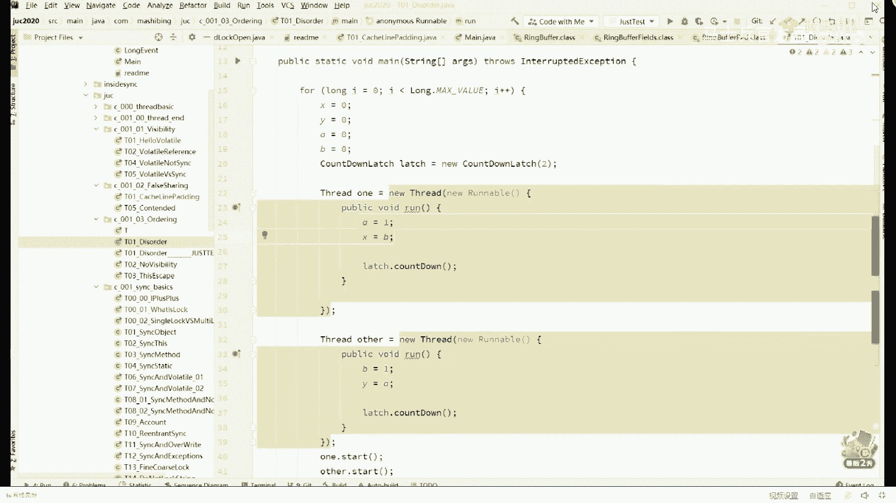
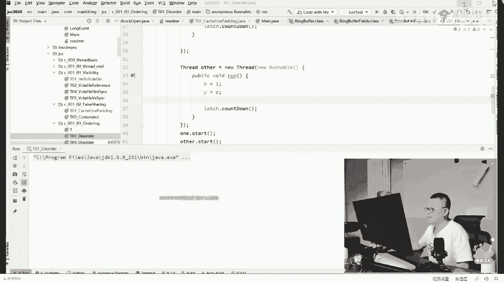
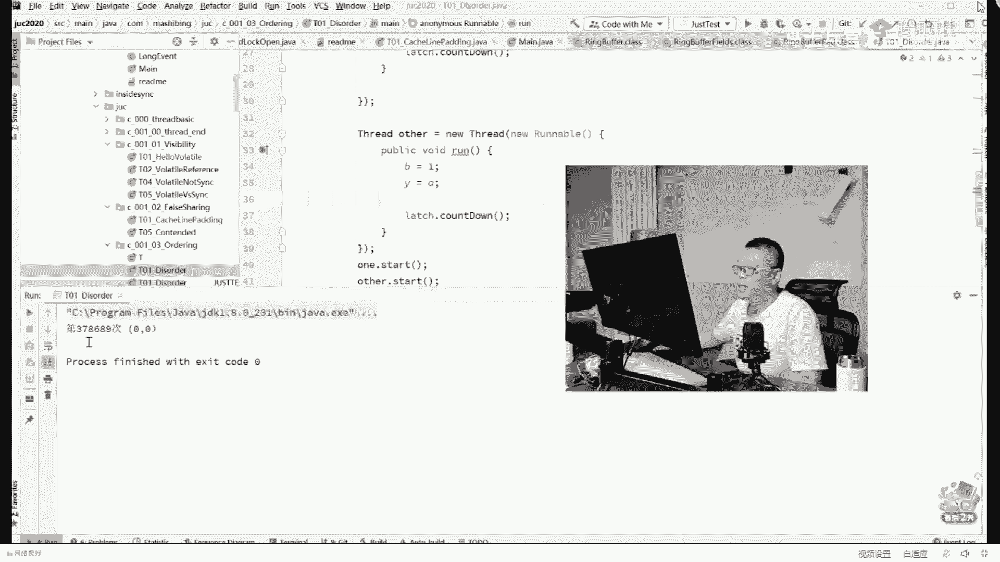
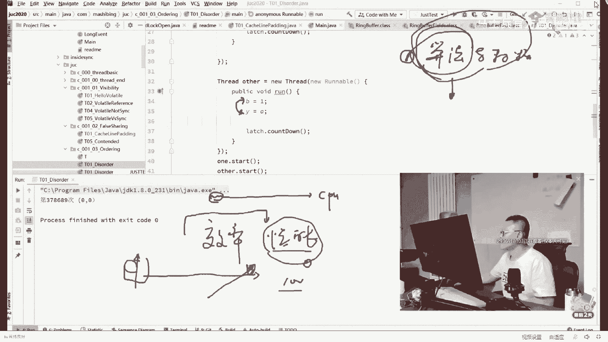
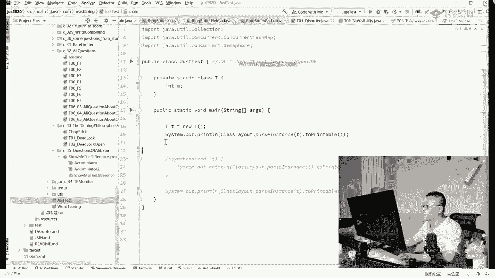
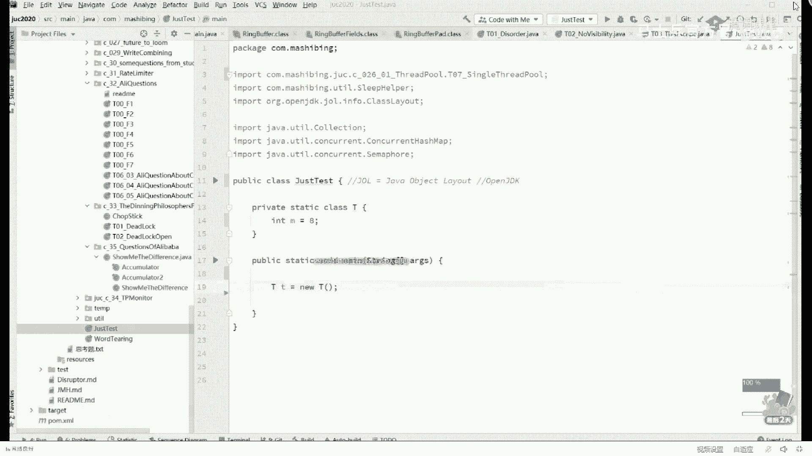

# 系列 1：P27：多线程与高并发：7.现代CPU架构给多线程编程带来了哪些挑战？ - 马士兵官方号 - BV1mu411r78p

昨天呢我们讲了一些硬件级别的东西啊。

就硬件级别的东西呃，也讲了很好玩的一些东西，就是我们的嗯缓存行，缓存行的对齐啊，这方面的内容呃，有同学说昨天老师我没来，没有关系啊，听我说今天的内容呢跟昨天没事儿啊。

没有直接的联系，你呢接着来认真的听啊，你今天照样是有巨大的收获呃我们先看这样的一张图，这个图呢我昨天展示过呃，今天呢继续，我们在作为复习也好啊，作为新人来说呢，我们给大家做一个简要的介绍也好。

呃回想一下啊，就是说呃什么样的东西呢叫一个程序对吧，昨天我们讲了好几个概念啊，什么东西什么东西叫一个程序，一个程序呢就是我们写好了，编译好了，诶，他没事的时候呢，可执行文件静静的放在哪儿啊。

放在我们的硬盘上，就我们磁盘，然后这个程序要想运行怎么办，双击咣当一下放到内存里好，放到内存里之后，它概念换了这个概念叫什么叫进程等一个程序是，不是可以起好几个进程，你起两个qq就相当于两个qq的进程。

对不对，那好呃，这个进程呢还只是一个静态的概念，他还没有开始执行，开始执行的时候怎么办，找到我们的进程里面的入口函数，没找到他的第一条指令是吧，然后开始执行好这个东西叫做主线程。

最开始的时候只有一个县城，那么在中间我们可能会以各种语言启动各种各样的多个线程，好，整个程序才真正的开始运行起来，呃昨天我们讲我们说一个程序里面装的是什么东西，两个非常重要的概念，第一个呢叫指令。

第二个叫什么，第二个叫数据，我们说一个程序的执行啊，相当的简单，cpu呢会首先从内存里头把对应的指令拿到一个计算器，这个计算器的名字叫什么呢，叫program counter，记不住也没关系。

就是首先把指令拿过来，发现这条指令还需要数据怎么办，把数据再读过来，读到哪里去，寄存器，然后呢运算单元开始对计算器里面的数据做计算，做完计算之后做存储，存储好了之后再写回到我们的内存里面去。

这就是整个计算过程啊，不难比较简单，但是昨天我讲了一个非常重要的概念，我说啊我说cpu的速度，它要比内存的速度要快得多，快多少呢，大概是100比一的关系，就是说这哥们儿跑了100步，这哥们儿才跑了一步。

他的速度非常非常非常的快，呃所以呢我们说我们所谓的啊，说我们平时所说的这个高性能，我们说怎么样才能把我的程序呢做的性能特别好，高性能这个高性能的核心是什么呢，最底上的核心。

最底层的核心叫做充分利用计算机的计算资源，什么意思啊，别让cpu闲着，我们用那个粗话说，就是别让cpu闲着，你好好的让他干事儿去好，我们现在从微观的角度，同学们，你们好好想一下。

假如说我们现在有两条指令，我们的第一条指令呢是去内存里面取一个数据或者存一个数据，这是第一条指令，那么大概需要100个时间，单位好，我第二条指令是什么呢，在自己寄存器的内部做一个加法操作。

比如说他增一个一啊，加加操作，这是第二条指令，那么当然你就想了，同学们，你们想想看，第一条指令是取内存的数据，需要100个时间单位，这个在本地操作，它很可能只需要一个时间单位好，这是两条指令，是连接的。

是已经编译好的，是上下的关系，比如说我们写程序的时候写了第一条语句，如果说你理解不了底层的质量，没关系，你写了第一个语句a等于一啊，第二个语句b等于b等三啊等等，那这个时候呢同学们你们想想看。

在微观执行的时候，这两条指令在执行的过程之中，它会造成效率上的损失，为什么呢，因为我第一条指令执行完，得等着这个数据拿回来，100个时，间单位cpu在这段时间干嘛啥事也干不了，只能等着他拿回来。

然后才做下面这个操作，那么有没有一个办法，既然上面这条指令执行的时间比较长，我能不能把下面这条指令先执行完呀，我们说我们想喝喝杯茶啊，我们先烧水泡茶好，烧水的过程之中，我能不能先把碗茶杯给洗好了。

我不用说等着烧水完了之后，我再把洗碗洗茶杯，这可以不可以听懂这个意思了吗，如果是你设计cpu的话，你会怎么做，那大腿想想也知道，在他取第一条指令的过程之中，干脆我把第二条指令给他执行了，不就完了吗。

听懂了吗，哎这个是可以的，虽然说这事儿是可以的啊，好听我说。

看这里啊，嗯嗯那个虽然说这个事儿是可以的，但是呢它在宏观上会表现出来一个什么现象呢，就是你的第一条指令还没有执行完的时候，你的第二条指令已经执行完了，听懂了吗，比如说作为上上层的一个成员来说，呃。

你会发现一个特别好玩的现象，就是说你的第一条指令还没有弄完，你的第二条指令已经执行完了，ok这种是有可能的好吧，有同学说这是什么意思，我们看一个特别好玩的程序啊，拿代码说事儿，你就看懂了，大家看这里啊。

他这样一个小程序，这个小程序是特别经典的一些程序，小程序不是我发明的，我先说一下啊，我不能把这个功劳据为己有，这个小程序是国外的某一个程序员，那他原来是用c语言写的，后来我只要换成java语言而已。

那么在张眼里面呢，我们我们先不说这个小程序干嘛，我们先看这小程序是做了一件什么事，大家看啊，在这个小程序里面呢，我做了一个循环，这个循环的次数非常的长，你可以认为它不断的循环就行了，然后在这个循环里面。

每次启动的时候有四个值，这个小程有点复杂啊，大家认真听，别走神儿，这个小程序呢一共有四个值，这四个值呢分别是x y a b拥有四个值，最开始的时候这四个值全是零，然后每一次循环呢我会起两个线程。

这是第一个，这是第二个，在这两个县城里面，他们执行的语句也很简单，两条语句a等于一，x等于b b等于一，y等于a，仔细看这就比较好玩了，我们同时同学们，你们想想看，你们想想一件事情。

就是说呃我们现在是两个线程，两个线程的执行过程呢，很可能是一个交叉并行的操作，什么叫交叉并行，就说我这个县城执行一小会儿被暂停，被拿走，被调度出去换另外一个线程执行，另外一个线程执行。

执行一小会儿再换另外一个线程执行，所以它是交叉并行的关系好，我们现在假设时间上啊，我们都在一个微观上想，那这个时候呢如果说县城是交叉并行的执行的话，那在微观上有可能是这样的执行。

就是这几条语句的执行顺序有可能是什么样子的呢，先是执行这种情况，a等于1x等于b然后呢再执行b等于一，y等于a是吧，同学们，这是没问题的啊，当然还有可能有各种各样其他的情况呃。

为了这些情况呢，我干脆我记得我做了一张表啊，主要是这个东西理解起来有点困难，所以我干脆给大家做了一张表好，关于这张表呢，我们先把这边给糊住，先不看这边我们先看这个排列和组合，同学们，你们想想看。

就是在我们时间执行的可能性上，我们有可能是这样的，a等于一，x等于b，b等于一，y等于a当然也有可能是b等于一，y等于a，a等于x等于一，也有可能是先执行的a等于一，又执行的b等于一。

再执行的x等于b在直线y等a好，也有可能是a等于一，然后第二个线程执行完了，再把最后这句x等b执行，就是你排列组合排列组合组合来组合去，最简单的啊，我给大家把这个给大家组合完成，全部都给大家列出来。

你会发现呢大概有这么几种情况，我讲到这儿还能跟上的，给老师扣一，能跟上啊，没有走神的啊，大家还在吧，应该ok好，我们计算一下各种情况的可能性的前提之下，就是最后的x值会是几，然后y值会是几。

我已经给大家计算完了，你就不用做计算了，好吧好，这个x的值01x y的值1011111111，你就不用算了，就是你发现组合来组合区域，它一定不会出现某一种情况，哪种情况呢，不会出现这种情况，x等于零。

y等于零，听明白这意思了吧，好那么会不会出现这种情况呢，这个程序我先让他跑起来，这个程序呢只要出现x等于零和y等于零的情况，我们就让它停止，如果他不出现，就让它循环，我们先让他跑起来走，你别着急。

主要是因为呢这种情况出现的可能性确实是非常的小，这事儿得慢慢等，我记得我有一次等了十分钟，所以说这事儿呢看运气，我应该刚开始就运行起来。

然后大家伙就别说能看见结果了啊，虽然是的，别急不急，而且在某种cpu的情况下，你甚至等不到这个结果，但这件事是存在的，我们在它出现之前，我们先琢磨一件事儿。

就是在什么情况下才会出现x等于零和y等于零的情况，在什么情况下才会出现这样好，我告诉你，只有这种情况，就是我们第一个线程的x等于b先执行，因为前面已经b赋值为零了，a也复制为零了，首先x等于b先执行。

a等于一呢后执行，与此同时，另外一个线程y等a先执行，b等于一后执行，只有这两种情况同时出现，什么叫两种情况同时出现，就是你会发现这两句话换了个顺序执行，这两句话与此同时也换了个顺序执行，嗯听懂了吧。

好在这种情况下，o我们才会得到x等于零，y等于零的情况，这种情况，所以发生的可能性确实比较小，因为它需要两个县城里面的同时换顺序好，我们来看看看看有没有结果了，好一共我们循环了378689次之后。

我们出现了零零的情况，好这个小程序至少可以证明一点，就是我们看到的顺序未必是cpu执行的顺序来能得到这个结论的，给老师扣个一能跟上的好吧，就是我们看到的顺序未必是真正执行的顺序好，现在问题来了。

为什么会这样呢，为什么cpu要换顺序执行啊，其实我刚开始就讲过了，是因为cpu在有的时候他换这个顺序，主要是为了提高效率，主要就是为了提高性能，我们讲性能这件事呢，可以贯穿你整个系统的从始到终呃。

性能这件事从最微小的一两句话，可以贯穿到你整个的一个庞大的100个节点以上的系统的结构，它都会关关系到性能呃，我呢后面计划会开一个专专题，就是专讲性能，从最根儿上的一直讲到我们说呃，数万台机。

器的集群应该怎么样去提升这个性能，其实我跟你讲，当你弄明白了微观之后，你会发现宏观的很多东西也就明白了，如果计算机我们说根儿上的东西有两个东西的话，其实第一个东西就是算法，与数据结构。

我就直接这么跟你说，所有的其他的东西可以都是都是从这里衍生而来的，当你去学习操作系统，当你去学习网络的一些拥塞算法，当你去学习呃各种各样的熔断的，降级的，限流的这些个算法的时候。

你突然间发现你有了这门课为基础的话，你学习把学其他的学起来的话，那真是可以说就是那个事本事本事半功倍啊。

嗯慢慢的呢就是怎么学通这件事其实是很重要的，就是融会贯通，你才能够以无招胜有招，不然的话你学的东西都是刻板和死板，好了，呃到这儿呢你呃会发，现我先下去证明了一点。

就是他确确实实呢是顺序是是是是有有有可能会发生错乱的，但有同学可能就会说老师错乱就错乱吧，有什么关系吗，跟我有半毛钱关系吗，你认真听，慢慢听我们讲经典的一些面试题，大家看这个题。

这题呢是来源于嗯对有刚才有小伙伴说他在读并翻那本书哈，这是这是那本书上的一道题，好我们来看这道题，这道题是个什么东西，你仔细看它是模拟了一个实际当中比较常见的一个情形。

这个情形是当我准备好了某个东西之后，我们就开始干某件事，什么意，思比如说当我准备好了手指，我们就开始上厕所，当我准备好了，我当我长到18岁啊，我们就开始谈恋爱，o模拟这么一件事，如果我们有一个数值。

这个数值number number这东西最开始的值是几是零，对不对，它一个默认值是零吗，好最开始的时候零的时候我还没有ready，i没有准备好，ok然后呢我有一个读这个读这个number的县城。

这个县城啊就reader thread，extends thread，然后呢在这个县城里面是well，not really啊，只要这个ready还没有准备好，我呢我就不进行下去，我就在这里循环等着他。

那什么时候我们说把这个number呢用这，个number呢好，什么时候你告诉我，你准备好了，我把这number值打印出来，ok然后在我的主线程里，我首先让这个独线程启动是吧，我启动完成之后呢。

我把number设定为42啊，我42岁之后我开始谈恋爱，然后我再把ready设为true，好我们理想的情况是，当我们这个number为42的时候啊，我们这个reader线程可以正确的读到这个值嗯。

能看懂这个意思吧，来看看明白的老师扣个一，那现在问问题，问你的是这个程序有没有毛病，有没有，sure有当然有呃，没毛病，我能问你吗，这程序有两大毛病，我们不说第一个我们先说第二个。

第二个就是我们讲的顺序问题，我想问你有没有可能性，这两句话换了个顺序，有没有太有了，我如果这两句话换了顺序执行，你打印的那只会是几，比方说我ready等于true，跑到前面执行了number。

还没有来得及，射程42，我这值是不是就有可能直接打印出零来了，那你是不是就这就不是你想要的结果了，最起码对不对，所以这东西它有问题好吧，这个是相对简单的一道面试题比较复杂，一道面试题是什么呢，是这道题。

你仔细看这道题，我们来看看这道题，这道题呢我们有一个类这个类呃，我们可以继续吗，可以继续吗，啊别的语言都一样，就说我只是拿java语言给你讲东西而已，所有的语言都逃脱不了这个规律啊，应该可以继续啊。

过来我们往这儿看这个小程序呢，它有一个成员变量，成员变量的名字叫number，number的值为八，好了，现在的问题看这里，在我们的主线程里面，我们new了它的构造方法。

在它的构造方法里面呢启动了一个线程，这个线程干了一件事，把这个number值打印出来，好了，仔细读这个小程序，好好思考，为什么这个小程序有问题啊，我也不问你有没有问题了，有问题为什么。

y如果你读过这本书，这本书呢叫做prefective，你知道吧，也是相对比较有名的一本书，那么其中有一条著名的原则，不要在构造方法里面启动线程，就是你可以在这个构造方法里头把它new出来，把它设定好。

但是一定要单独写一个方法，比如叫start，在这个里面单独启动，好了，同学们仔细看原因是什么，这里面的东西呢就比较复杂了，呃我呢，要要要解释明白这个问题呢，我们做一个先做一个小小的实验。

我们先做一小小的实验。

把我自己拖出去，我们拿这个t举例子啊，不管它叫什么，这类名叫什么，无所谓嗯，在这个t里面，比方说还有一个in等于八啊，这么一操作呃，听我说我们平时看到的这个操作t小t等于6t。

ok这个操作内部它会分成哪些个步骤呢，我们跑一下看看先走，你，程序非常的简单，但是呢大家都知道一个java语言，它编译完成之后呢是一个class文件。

那么这个class文件呢就相当于java虚拟机的汇编语言，就相当于java虚拟机内部可以直接执行的指令呃。

