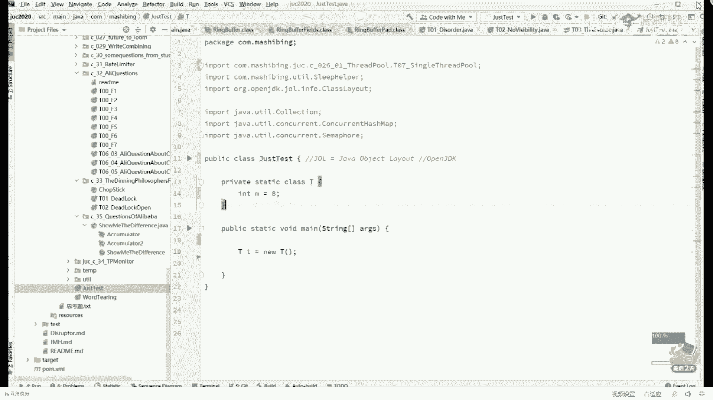
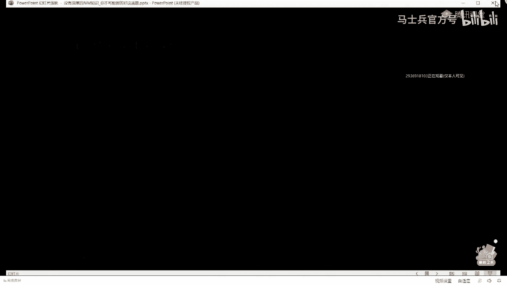
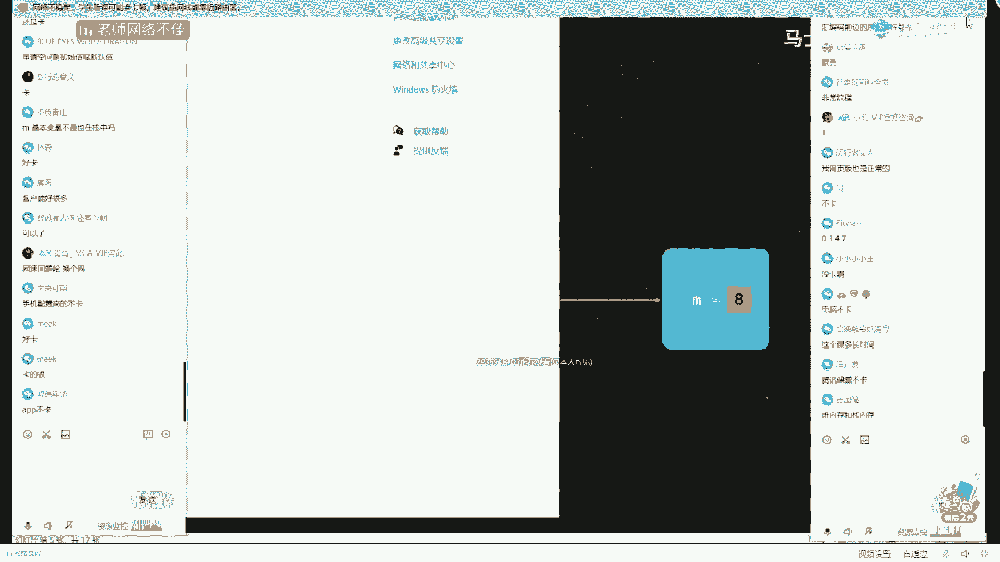

# 【马士兵教育】MCA架构师课程 主讲老师：马士兵 - P28：多线程与高并发：8.三级缓存架构造成的可见性问题如何解决？ - 马士兵官方号 - BV1mu411r78p

嗯你们想想让我告诉你那本书吗，稍等啊，顺带着给大家推荐一本书吧，books，这本书呢叫做，好它的全称叫做java virtual machine specification，当然不同的这个版本你选择呃。

具体不同的版本就可以了，嗯这本书是，呃这么跟大家说是，嗯那个oracle呢自己官方网站上，你随便可以下载的好吧，java并发编程的艺术咋样，你不用听啊，你我我就直接这么告诉你。

市面上所有的数加起来也没有老师讲的课深入和全面，往这儿看这些东西啊，如果你学过汇编语言，它就相当于是java语言里面的汇编，它我们所有的class的文件到最终它会解析成为呃。

一个一个的这样的一条一条的汇编指令，我讲到这儿应该能跟上吧，虽然你没有学过汇编啊，相当于它是一个呃直接操作硬件的语言，java虚拟机，虚拟机它也是一台机器，像这个这些语言是，可以直接操作硬件的语言。

我们直接写这种语言的代码，是不是可以，当然可以嗯，java也有这样的框架，但是呢学起来不方便，所以我们才用java语言写完了之后编译成为这种语言，好吧，他有这么多非常的多啊，大概是有255条指令o。

呃在这255条指令的前提之下，呃，像这样一条语句，它会有多少条质量构成呢，我们可以通过一个插件来观察它，这个插件呢view这插件的名字呢叫j class library，好吧呃当然你也可以，它自带的。

他也自带一个插件叫呃，是by code啊，这个也可以，但是这个呢格式不太好看，所以我换一个插件来用，这个插件呢叫做j class lab，你自己去下载，当我们打开这个插件之后，我们找到其中的方法部分。

找到其中的main方法，好在这个main方法里面，我们打开它的co，在这里大家伙看到的好吧，ok看这里啊，在这里，大家伙看到的就是汇编指令，这条汇编指令呢其中的关键部分并不多，关键部分大概是这三条牛。

invoke special以及a store，最关键是这三点，呃我呢简单给大家解释这几条到底是什么意思，这个主要是我有一个内部类，所以它多产生了一条啊，这个不用管它嗯。

在这儿呢我把这三条语句呢放在了ppt上。

小迷弟做了一个动画，我们还是用动画来演示。

哦看这里就这个小t，你能不能把这个小t它的创建过程到底什么样，嗯，我会带你把所有的语言全串起来，你慢慢跟着老师走就行了，它产生的三部分代码分别是这三部分，一是new，一是invoke special。

一是a store，其他这两条我不给你解释了啊，不展开，我在这y m课里专门讲了常用的这些汇编指令，但在这就不展开了，他第一条指令呢其实特别简单，叫做申请一块内存，再说一遍，申请一块内存。

那么申请一块内存是什么意思呀，同学们，你们想想看，我们要new一个对象出来，我们是不是得在内存里头申请一块空间呀，在座有多少位同学，凡是学过c语言或者学过c加加的呃，你给老师扣个一，我认识一下有没有。

ok ok好，学过也好，没学过也好，都没有关系，任何语言啊，他首先要做的一件事儿叫做管理内存，这件事是所有语言里面都要干的事，java语言呢它管理层简单，为什么交给垃圾收集器了，c和c加加需要手工管理。

手工管理是什么意思呢，就是我分配了这块空间，我现在需要一块地啊，我们说内存是一个大操场，我现在需要在操场上的某一块地铺一块毯子来吃饭，好，你有一块毯子突出出来，我尿完尿完这块毯子，我得想着把这毯子收走。

我得让别人继续能用这块空间，如果忘了收这个，我们就称之为内存泄漏，如果我泄露的越来越多，光掉毯子永远不回收，内存会把整个操场占满，这个一般我们称之为内存，out of memory是吧，内存溢出啊。

叫out out memory，ok叫内存溢出，当然还有一种情况也不行，什么情况呢，就是我不小心回收了两次，因为我的程序写起来的时候会非常麻烦的，我行程序写起来各种的判断，各种的if语句，各种的分支。

好，在不小心的情况下，我有可能删掉它两次，同学们，你们想想，如果删掉一块内存两次会产生什么，你把别人的内存给干掉了，能理解吗，我删掉一次之后，别人别的程序诶，这块空间可以用了，诶。

我放张床在床上谈会儿恋爱吧，这是可以的，结果呢你的程序非常暴力的把这个床给删除了，你猜猜看会发生什么，当我们想找那两个谈恋爱人的时候，突然间发现没人了，不知道去哪儿了，不知道被谁删的。

所以自己手工管理内存是c和c加加程序员的噩梦，有同学说我写c程序从来没有做过噩梦了，因为你写的简单哦，嗯，在呃这个的基础之上呢，就是给大家做一下小小的扩展好吧，就是java呢你不用去管。

你只管没你那块毯子，这块毯子什么时候回收，有专人帮你回收，这个专人就叫做垃圾回收器，叫garbage collector，我们先不管它都是第一件事呢，我们是要一定要在操场上申请一块空间的。

好现在的问题来了，当我们申请完这块空间里的空间之后啊，申请完这块毯子，毯子下面盖着东西，里边是有数据的，因为在内存里头申请一块空间，那这块内存里的装的是什么东西呢，我们用了一块t t对象。

它里面装的是什么，那，大腿想想应该知道里边一定有个小m，你说对不对，它有个成员变量，所以这个小m在里边，我想问你的是，如果你是在c或者c加的情况下，当我们申请这块空间出来之后。

这个空间里的小m的值是几呢，小m值会是几，这个大家了不了解，ok a3 个九说random，零，你们两个说的都没说对，你们两个都没说对，听我说这个m的质量会使原来的遗留值就是c和c加加，他追求效率。

你只你说这块空间归你了，没问题，我就给你做个标记就可以了，从这头开始到这里结束，这块空间属于t对象，至于中间里边装了什么乱七八糟的残羹，冷炙别人的剩饭，我不管，那是上一个程序留下的值，好讲到这儿。

我想问大家一个非常刻薄的问题，如果说正好上个程序在这里头记录的是他自己的一个password来，你告诉我他会发生什么情况，同学们，你们想想看你，你可以窃取它吗，可以吗，可以不可以，当然可以。

这个呢就是安全问题，所以我们平时所说，我们说java程序是安全的，为什么其中有一个体现就在于这就是java里面呢，当我们有一个t出来的时候，它里面的成员变量全都-0或者负控制，哈哈听明白了吧。

ok这就是它会把不仅申请完这块空间，还会把这个空间呢顺带的给你做一个初始化，把那些残羹冷炙全给你清走好了，那就是说看这条汇编码就理解了，当我们new一个对象的时候，本它里面会有一个值，这个值会是技能。

会是一个默认值，注意它不是八，他是技能，它是这是java自，带的功效，所以说java当时推出的时候说我们是一种安全的语言，除了呃其他的一些安全层面的东西之外啊，我告诉你这个也是其中之一。

嗯就是我我给大家讲东西，我是喜欢不是太看重某种语言专有的一些功能，而是说把这个东西给大家串起来，那你会慢慢的理解啊，计算机这个东西呢其实也没那么难，像它的简单也是啊好看这里呃。

但是呢由于我们给他做了一个初始值，这个初始值是嘛，是不是不是八呀，那他什么时候才会变成八呢，执行到这条指令的时候，这条指令呢叫invoke special，嗯，我，们翻译一下啊。

invoke叫调用的意思，special叫特殊特殊调用，说在这里呢我们调用了一个方法啊，调了一个函数，这个函数的名字是什么呀，它的函数名字叫initialize，你拿大腿给我想想，你说它调用了什么方法。

我说java语言里面，如果你给一个class呃，你往里头没有给它定构造方法，它是不是默认有一个构造方法，对不对，参数为空的构造方法，ok好了，他就调了那个构造方法好，只有在这个构造方法执行完成之后。

白m的值才会设为八，这时候才会变成八好，那下面这句话，但是你注意啊，因为我们在方法里面，我们说有一个局部变量啊，小t你的may方法里面有个小t局部变量，说一个方法在程序执行的时候呢，它是有一个站存在的。

这个叫县城站呃，占空间呢其中有一块是属于这个main方法，main方法里面有个小题，这个能听懂吗，哈哈哈，这个要是听不懂的，就大致理解就行了，就是说一个程序在运行的时候嗯。

我们说java程序虚拟机呢是基于那个站来运行，每一个县城都有自己的县城站，县城里面的每一个方法都有自己的，战争它的全称叫frame，嗯，叫stack frame，stack frame。

这原来在这里就没讲过这事儿，你一个方法调另外一个方法，他就起一个战争，一个一个方法结束了战争弹出去，这是整个程序的执行过程，好在这个支撑的时候呢，我们说它的局部变量小t放在哪，放在这个站里面。

那个小t t等于6t，我们把这部分执行完了，你得把这个把这个线把这个值得给到这个小t啊，这个小t是什么呀，这是个引用或者指针嘛，是不是，所以这条指令a store它的意思是什么呢，它的意思是建立关联。

这里的小t才会真正地指向，了这个对象，呃委员长这句话呢我其实解释了很长时间了，我们再稍微复习一下，当我们看到这句话的时候，首先看右半边new题，它会有这么几条指令构成。

首先申请一块空间里边的成员变量赋值为默认值负为零，接下来调用构造方法，这时候才会赋值为初始值为八，然后a store这条语句执行完，他才会建立关联来，同学们一卡一卡，像vcd受潮似的，呃。

换一个那什么吧，是不是换个换个换个刷新一下啊，刷刷一下，或者是呃换客户端来看，都在看吗，难道是我这个我这个网速的问题吗，待会都卡吗，我等待一，会儿就一小会儿好了是吧，刚才卡，好了好了好了吗。

我们可以继续吗，嗯我们可以继续吗，卡卡西老师啊，没事啊，卡的时候呢，我先等大家回家会好不好，屏幕不动了还是卡呃，客户端不卡对，大家伙可以用客户端或者用手机。

或者用那个那个那个那个那个那个那个pc端的那个客户端呃，其实用浏览器，网络不稳定，那个查一下哪位同学是不是在上传或者下载啊，稍等啊。

他先不着急，换换app好了，现在好一点，可以吗，sorry啊我呢，这是这个是我的问题啊，电脑客户端不卡对嗯，内存溢出了没有啊，这个跟内存溢出没有关系，什么情况，喂稍等一下啊，我把这些多余的乱七八糟的。

什么活动的程序全给他干掉，说明了网络不可靠，good，哈喽哈喽，现在好一点吗，嗯好多了是吧，好不错，这个是我的问题啊，i m i m valley，valley sli，呃口袋很重啊。

sorry sorry啊，我们继续啊，这个这个主要是我的问题啊，这个问题主要是什么呢，呃是因为我不小心连的是无线网，呃，我现在换我的那个网线，网线直连又卡了，我勒个去，这不应该啊。

呃楼上楼下的查一下所有的机器，谁在上传下载的都给我停掉，来咱们小姐姐去楼上楼下去看谁在上传下载的，全都给我听到，稍等啊，破音警告嗯，走起来一点都不卡呃，这边的小伙伴好像确实比较卡。

从现在丢包的情况来看的确实比较卡，登录游戏看谁在小看谁在看小电影，对，holy shit，好像还有那么一点点，呃大家稍等一下，我，确实卡了嗯，怎么会这样子呢，嗯大家稍等啊，这就给你看，听见没事嗯。

不是是公开课，这边我就这么说，关羽根本没有卡吗，大家伙把那个在上公开课的，咱们的小姐姐们也也清一清一波下来，性能，cpu 7%才性能应该没有问题啊，没有卡啊，现在嗯这个我也考公，这明显卡我能看到卡嗯。

对豆瓣比较严重，好了，同学们，我们再试一下啊，嗯嗯，把第二件关了就不卡了，应该跟那个没关系啊，嗯那个现在可以了吗，好一点吗，嗯嗯画个图可以了是吧，还是不对，靠近路由器，暴露就是嗯，内存64，我才16。

不是你们在看啥啊，我的天，3970w s线程撕裂者啊啊应该好了，我已经看见他不带丢包了，嗯应该好了啊，sorry，这不是我现在没查清楚网络的情况，我为了找我们岳维的老师给查一下啊，好了好。

