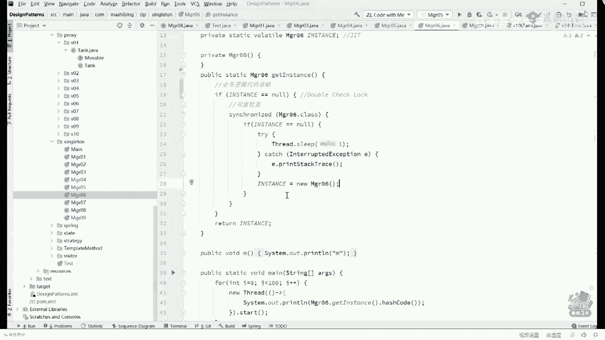
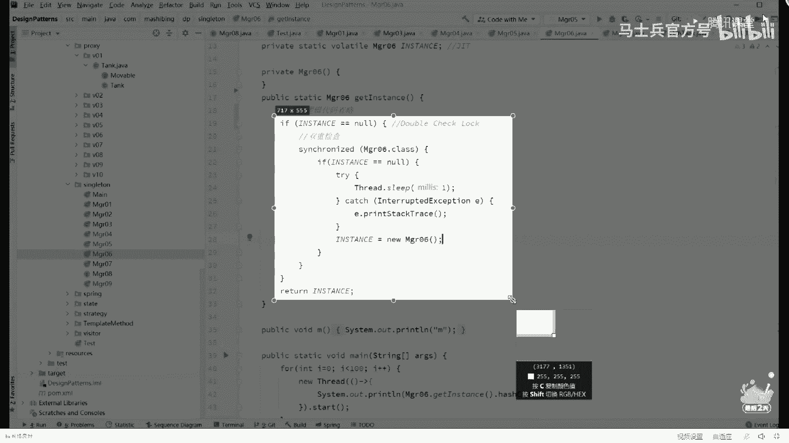
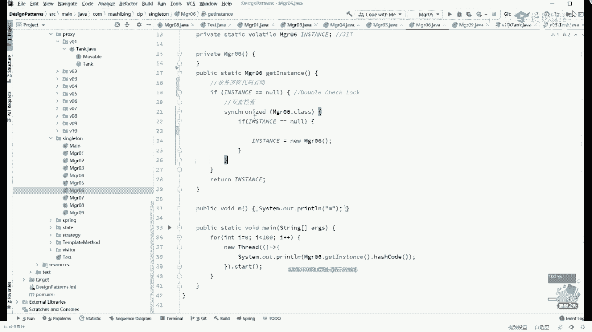
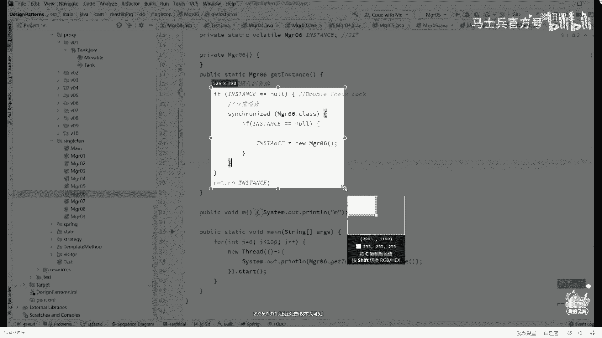

# 系列 1：P29：多线程与高并发：9.内存屏障是如何解决代码乱序性问题的？ - 马士兵官方号 - BV1mu411r78p

我们稍稍回顾一下，中间被一段小插曲给打断了，好大家看这里啊，我们再稍微回顾一下，就是一个对象的创建过程到底什么样呢，呃首先你有一个对象出来，占一块空间，这块空间它里面的成员变量是一个默认值，它为零。

调用完构造方法才设置为初始值，它为八，调完a store才建立关联，一定给我记着这个顺序好，当你理解了这个顺序之后呢，我们再来看看这段小程序它到底有什么问题，呃这个小程序是一个著名的小程序。

它的全称呢叫this，叫类似溢出问题，我觉得这是逃逸问题，这是什么意思呢，同学们，你们想想看这是个什么东西啊，this is是个指针，它指向谁，指向我自己，对不对，指向当前对象啊，你可以理解为什么呢。

可以理解为在我们的看这里好，在我们的main方法里面，除了这个小t之外，还有一个叫this is的东西，它这个this也是指向这个对象的，好吧，是这么一个东西啊，那好同学们，你们呃思考一个问题。

翻回头来呢看着小程序在这小程序里边儿，我们说呃，这是主线程，这是我们构造方法的线程，好同学们，你们想想看，有没有可能发生一种情况，什么情况呢，就是，我这个this指针啊是上来就有好。

有没有可能发生一种什么情况呢，就是当我的对象呢用了一半，用了一半的时候，我这个this已经指向它了，只有我构造方法完成之后，知道吧，构造方法调用完了这个八才会才会才会变成八。

那有没有可能这种情况说我this指向这里的时候，他还没有变成八的时候，我就直接把它打印了，能听懂吗，这个过程不知道大家听懂听明白没有，就是由于我对象的创建过程是由好几步构成，在他还没有初始化完成的时候。

这个this就已经溢出了，this就已经逃逸了，从哪逃逸出去了，从我们的构造方法里头就已经暴露出去了，虽然说你看上去是在我构造方法里写了一个程序，写了一个线程，但实际上这个县城你记住了。

县城这玩意儿是不是在我们主线程之外执行的，他执行的时候很可能这个对象只初始化了一半好了，这就是revise一出问题啊，this逃逸逃逸问题呃，这个问题呢我刚才说了，如果大，家会有兴趣去读这本书。

如果你懒得读，听老师讲课，老师我讲一门课，会把市面上所有的书全看完，我讲这vm实际上十几本书我全看一遍，讲多线程也是一样的，呃，逃脱不了我们多线程讲的内容，放心吧，这是类似溢出的问题，就是他出了一半。

他就拿手拿去用了，当我讲到this is溢出的时候，这个还不是特别严重的问题，我们讲讲过我讲过很多遍的一道题，我由于好同学应该也是没有听过的，我再给你讲一遍，快速的给你讲一遍，仔细听，你认真听，嗯。

下面这个问题是美团问的一道问题，这个问，题呢他就更深刻看这里这个我需要打开我另外的一个项目，这个项目叫做design patter，关于design patterns，应该有同学知道什么意思吧。

看这个著名的项目呢叫做设计模式是吧，设计模式一共有多少种，就非常牛逼的一本书，这不是我在呃还在工作那会儿啊，大概四五十年前看的一本书，到现在为止经久不衰呃，一共嗯嗯ok cancel呃。

一共呢大概有23种设计模式啊，后来好多人在那抄来抄去，说这种模式，这种模式，但实际上所有的模式没逃脱这23种呃，23种设计模式我大概讲了23种，这其，中有一个著名的也是最简单的模式。

这个模式呢被称之为singleton，叫单例，我们把这个单例模式给大家找出来，讲一讲丹利丹利跑哪去了，在这它的全称叫single lion，叫丹利呃，有同学可能不知道什么叫丹利，我做一个非常简短的解释。

就是当我们有一个类存在的时候，一般的情况下我想你有多少个对象，就new多少个讲究，第二个再丢第二个，在某些特定的情况下，我只用它一个对象，我不允许他new好多个，比如说一个类的对象，你能够写一种程序。

保障它只有一个对象存在，不会有多个对象存在，好这种的写法，这种的模式被我们称之为叫单立单例模式呢，你平时可能写那个程序的时候呃，用过spring的，小伙伴应该知道spring框架吗。

他会帮我们要接管我们的对象的诞生，这个对象的诞生的话，默认是什么什么什么样的啊，单利的对不对，有什么有什么情况要用单例，情况非常多啊，比如说我们说数据库的管理者。

我们有一类叫嗯database manager，对他miss manager，你有必要弄好多个吗，没必要，然后再给你举个通俗点的例子，你有一个类叫wife，来大哥，你的wife。

你能允许别人给你弄好多个吗，这肯定不行，如果你是girl girlfriend l g b t是吧，那你你可以，你有好多girlfriend boyfriend啊，呃transgender等等。

但是呢wife你不可以，你好多个只能有一个only one，单利好，我们就不探讨这个道德和伦理上的问题，我们探讨技术上的问题，从技术角度讲呢，你要想实现一个单位最简单的写法。

就是这种这个写法是最经典也是最简单，没有什么特殊要求，你就用这种写法，不要跟我玩什么，其他有九种写法一类的啊，回字有四种写法，虽然我为了课程的完整性，我给大家讲了九种。

但是呢实际当中能用就用这一种最简单最方便，最能保证它的完整性好，这种单例呢它叫做恶汉式啊，什么意思，看这里上来二话不说，我自己先new个对象，自己先溜一个出来，还有这个对象的叫instance啊。

好然然后我把构造方法设定成为private，我说private别人不许用，只需我自己用，那别人不能new，我有我已经先溜了个单位，别人想怎么用呢，给他提供一个静态方法。

这静态方法呢叫来get instance，平时你们看到的各种的管理类啊，manager get instance啊，还有呢什么呃呃像什么一些加密算法。

那说get get get get instance啊，反正你见，到这样的这种名字的基本都是单例，我们直接拿这个单位就拿出来用，然后呢当作为我们这个类的用户来说。

不管你调用多少次的get instance，你放心，您老人家拿的永远是同一个程序，我就不演示了，我讲到这儿，单例的基本概念和基本写法能跟上的，给老师扣个一，ok good good，好呃。

那么我讲到这里之后呢，但是这个写法呢有人会吹毛求疵，他说你这个单位还没有在用到的时候，就是我还没有用的时候啊，我写不写，我都没方法，我的说法还没有用它的时候，你二话不说，先new一个。

如果你这个单位特别占内存，你这个写法是有毛病的，能不能等我用的时候，什么叫等等，用的时候不要用这个方法的时候，你再把它给我初始化了，可以不可以可以的，所以就诞生了第二种叫懒汉式，懒的，他特别懒。

刚开始不把他初始化，什么时候需要我的wife啊，在调查get wife，ok先判，断外服等空吗，如果等空，你有一个如果不等空，直接拿来用好，当你看到这里的时候，这种就叫懒汉式写法也非常的简单。

用的时候先判断，但是当我们写到这儿，对于多线程，因为今天我们讲的是线程，对于多线程敏感的同学，现在一定有点感觉了，你说在多线程访问这个方法的情况下，它能够保证你只有一个对象产生吗，当然不会是吧。

呃为了暴露出来多线程的情况，我在判断之后呢加了一个睡眠，这个比较简单，我就不解释了，那么在这里我弄了一个线程呃，100个线程i等于零，a小于100，用了100个线程。

每个线程都调用了get instance方法打印它的hash code，如果说所有对象都是一个它的hash code一定是同一个等，它会是这样吗，明显不会，845结尾，109结尾，287结尾多了去油呃。

我觉得不用我解释吧，应该非常的简单，第一个线程来了，判断等空吗，等空暂停，第二个线程来了，判断等空吗，依然为空，继续留一个，第一个线程继续用六，第二个。

所以完全可以有可能扭出好多好多个来呃既然这种写法是有毛病的，没关系啊，枷锁对呀，上锁嘛，对不对，当然当你看到这个关键字呃，面试的重灾区，这个关键字是重中之重，面试的重中之重，特别重的一个重灾区呃。

这关键字我大概花了四小时给大家讲完，但是在这儿不展开，你好好听，我告诉你，我我我讲这个关键字并不是给java讲的，而是给所有语言讲的，这个东西呢叫上所上锁，这件事比较复杂，上锁这件事，首先你得有一把锁。

然后上完锁之后呢，你还得干干一干一些事，简单说简单说你要关上厕所的门，在上面加一把锁，然后在厕所里面扑哧扑哧干完事，然后你还要从厕所出来，再把这把锁打开，其他的县城才能进来，能听懂吗，这应该能理解啊。

不然的话两个人一块进去就是屁股怼屁股，互相之间摞着这东西啊，不可想象啊，你就会破坏人家的数据一致性，可以ok当然一般的情况下啊，数据如果产生分叉的情况，如果产生分叉，一般是穿了丁字裤的原因，开个玩笑啊。

开个玩笑，开个玩笑啊，好好好，那我们说回来啊，呃看这里呃，这里呢是synchronized，这个synchronized呢非常的简单啊，就是get instance，呃在get essence的时候。

等于是我要执行下面这一大段代码的时候，其他的线程是不可以，其他的执行这个方法的线程是不可以进来的，只有等我把这个分叉的事搞搞搞定了之后啊，其他的人才能执行这段代码，是这个意思。

但是呢它会产生一种什么情形啊，这种情形是嗯是这样的，如果你的这个方法它非常的复杂，呃，你有没有必要说我在上锁的情况下去执行这些呢，实际上没有必要，你读东西也不改任何东西啊，你是没有必要的，这个。

等于什么呢，等于我们的锁的力度太粗了，什么意思呢，就是我们锁定的代码太多了，大家知道你在里边蹲的时间越长，你占别人的，别人进不来的可能性就越大，效率就越低，所以我们能不能够说只需要锁的时候上锁。

不需要锁的时候就不上锁，这个可以吗，能做到吗，你当然可以啊，完全可以做得到，那就是这种写法吗，就这种写法唉，我首先把业务代码给他让过去，然后呢判断if instance等空哥们儿，如果你为空的话。

上锁不为空，不上锁，不为不为空，指定拿来用了，上锁你有对象，ok然后如果不会控，制直接能用好，那现在问题是这种写法能不能解决数据一致性问题，会不会产生多个对象，有没有问题，当然当然有问题啊。

当然有问题嗯，我们先跑一下看看结果，你明显看到他好多个不同的对象对吧，三二结尾，264结尾是吧，很多很多287结尾，285结尾好，为什么会这样呢，我们明明上了锁呀，这就是多线程程序不好写的地方。

就是你要小心翼翼地判断哪些代码我要上锁，哪些代码不要上锁，需要小心翼地进行进行判断，第一个线程执行到这里的时候，if instance等空好，等空吗，等空没问题。

上左第一个线程暂停还没有继续往下运行的时候，第二线程来了，判断能空吗，依然为空，没问题啊，第二线程继续运行，第二线程这么运行的上锁锁定，然后new对象new出来，然后这里呢是解锁过程，把锁解开。

然后方法返回好，第一个线程继续第一个线程继续运行的时候，注意第二个线程已经把锁给释放了，那第一个县城能够上锁吗，那当然可以，所以第一个县城又上锁成功，又new了，第二个对象，听明白这意思了吧。

所以这里头是有问题的，那有这个问题之后，怎么解决这个问题呢，好用这种写法，这种写法呢是第一上来先判断哥们儿，你如果等空上锁，上完锁之后，我再判断一次，哥们儿，你是不是上完锁之后，你依然为空。

你依然留有我的记忆，你依然为空，如果你依然为空，把它尿出来，如果说中间上锁的过程已经被别人虐完了，那我就直接拿来用了，好的，你听明白这件事儿之后，看这里看这里，我们回顾一下刚才那种情景，第一个线程来了。

判断等空没问题，等空，然后第一个线程暂停，第二线程来了，判断等空吗，等空第二线程继续在第二线程继续的过程之中上锁没问题，判断依然等空没问题，然后new一个对象出来解锁没问题好第一个线程我们会继续上锁。

能成功，因为第二个线程已经解锁了，但是当它执行到这句话的时候，判断是不是还没空，发现已经不为空，因为这边已经用完了吗，所以他就不会再尿第二次了好了，这种写法呢就是比较经典的写法。

这种写法全称叫做double check，lock，简称d c l叫double check lock，这是一个check检查，这是一个check检查，中间加了加了一个。

上锁的过程主要double check lock，这是巨经典巨经典的写法，如果说这个写法你没有听说过，今天你就要把它背过，在很多很多的开源软件里面，有大量的这种用法，叫双重检查锁，双重调研所，是的啊。

呃当然双重校验锁这里面有两个问题，两个问题，好第一个问题是什么呢，第一个问题是很多同学会问，为什么外面这层检查还需要我是不需要他的，严格意义上来讲，我上锁直接上来上锁不就行了吗。

一线程过来上锁发现为空又出来，第二线程上来上锁，发现为空，不扭了，不为空了，不扭了，不就搞定了吗，能能能听能听懂我的意思吧，就是我们为什么还需要第一第一重检查，原因是什么，原因是效率性的。

就性能这个词是体现一个程序员是高级程序员还是初级程序员，最根本的一个指标，优秀的程序员总会追求非常就是使劲的压榨cpu，使劲的压榨你的整个系统，能让它达到最好的性能，比较差的程序员呢。

那就是随随便便写完完成就行了啊，我搞不定特别好的算法，我就可以拿一个大的list，把数据全都给他装上啊，内存内存让他买吗，买买买多了就行，嗯，呃看这里，这里主要是性能的问题，如果有外面这层判断。

那么一旦有一个线程已经把它弄成功的话，其他县城只要经过这次判断，不需要竞争所的过程就可以来判断出来我要不要继续运行了，能听懂吗，就是我第二线第一个显示已经用完了，我只要判断不为空了。

上锁的过程我是不需要的，但是你如果没有外层判断，所有的人二话不说上来全都要抢一把锁，强索这件事是句号，资源的是要经过操作系统的操作或者ca的操作，不管什么操作都特别耗资源，所以有了外面这层判断。

你的效率提高好多，有1万个县城很可能，有9999个县城就不需要任何的抢手操作，提高效率用的，但是第二个问题是，这种写法有没有什么毛病。

有毛病吗，有同学说看上去很完美啊。

难道这种写法还会有毛病，这样我们把这个这个sleep这事儿吧，sleep的破事呢，这都行，那个c开盘，如果代码稍微调一调的原因呢，主要是我抓取起来，让大家伙能读得更加的明确一些啊，我看这段代码啊。

直接删了吧，不要这系列了。

看这里啊，就是我把多余的代码都给你删掉。

我就看这么一小段，相当简单代码，有同学说了，老师这段代码居然还会有毛病，我直接告诉你，是的确实是有毛病的，这个毛病呢它比较的隐蔽。

讲给你听。