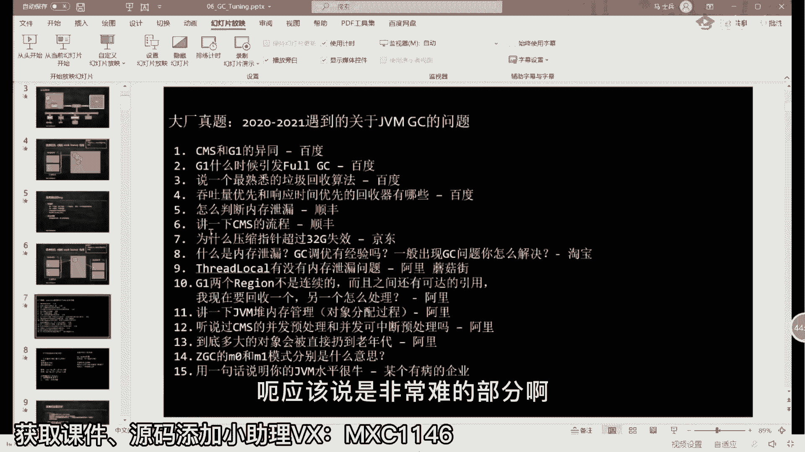
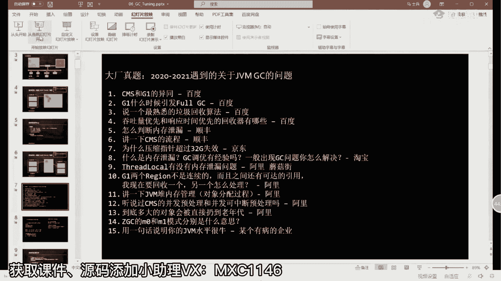
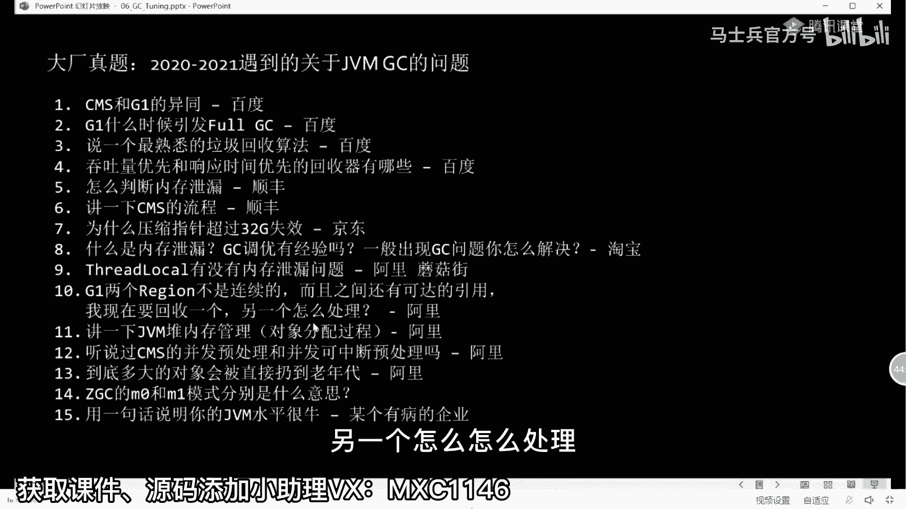
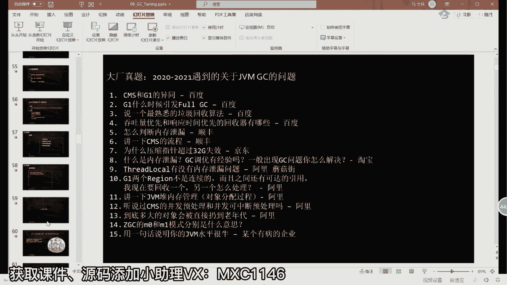

# 【马士兵教育】MCA架构师课程 主讲老师：马士兵 - P2：JVM瞬间涨薪3K的操作：2.三色标记-并发垃圾回收算法 - 马士兵官方号 - BV1mu411r78p

一个对象产生，它首先是要进入到伊甸园区域的，然后呢经过一次垃圾回收，他没有被回收掉，好进入survivor 1，再经过一次垃圾回收，又没有回收掉，进进入svip 2，再经过垃圾回收，没有回收掉。

又回到swim 1，如果还没回收掉，又回到svip 2，那么当它长到一定年龄之后，进入老年代，这个过程大家能看懂吧，嗯，看明白老师扣个一来嗯，可以介绍一下复制年龄，复制年龄不同的垃圾回收器。

它的年龄默认值是不一样的，你可以设啊，这个年龄没关系的，你可以呃，jvm调优的时候可以对它进行调整，这个随你随你来定好吧，好了呃，当然还有一个更复杂的动画，我在这就不演示了。

主要跟我们讲今天讲的主题呢关系并不大，这里面主要讲了栈上分配啊，形成本地分配的内容，好呃我们回到呃垃圾回收器，那么通过这来看的话呢，我们的不同的垃圾回收器，它工作在不同的分带上。

那么在这个分带你看上去比较复杂，但是我告诉你啊，其实这个分带的垃圾回收器呢，是比较简单的，我呢从这个最古老的垃圾回收期serial开始，然后给你介绍，整个分带的这六种垃圾回收器啊，很快就能给你介绍完。

比较简单，你往这儿看好，大家听我说这个拉丁回收器啊，你看他的名字叫最早的啊，最古老的，从一点开始就有的就是它叫serial，这个呢叫serial old，好，这是什么意思呢，看这里。

那么这个我是原封不动的，摘自oracle所出的官方文档，siri到底是什么东西，他说i stop the world coping collector。

which uses a single gic threat，这是什么意思，你认真听就行了，他说stop the world，stop the world，简称叫s t w这词你给我记住。

stop the world，世界停止，把这词给我记住啊，这词什么意思，简称s t w，就是说当我垃圾收回收期开始干活的时候，所有的业务线程全都停止，这是你，这是你女朋友，这是你男朋友。

你们仨在房间里扔各种各样的小线团儿，这个叫业务逻辑，叫业务线程好，当你扔了一大堆的小线团，触发了我垃圾回收器开始工，作的时候你的妈妈进来来，你们仨给我停到墙角，给我站着去。

这时候叫stop the world，业务线程全部停止，垃圾回收器开始干活，把这些小线头帮你整理一遍，从你根儿上开始给你捋捋捋捋，捋到的所有的小球球全部有用，全部没有捋到的，全部帮你清掉空间。

又被重新的清理了一遍，你们仨就可以继续玩了啊，继续造你的小人儿，ok继续产生你的新对象好吧，在伊甸园区好，当又过了一段时间之后，又又满了又满了，怎么办，好了停止你妈妈又进来停止，该我干活。

ok这个呢就叫做stop the world，好了，这是我，们整个java程序所产生卡顿的巨大原因，就是有的时候你这条程序跑一段时间之后，你发现诶他很卡，跟那那个嘎吱嘎吱响，然后跟他做运算，它在干嘛呢。

大量的垃圾回收过程呃，这个呢对于网站的影响，就是有的时候呢，这个网站呢，他的对于用户的反馈不是很友好啊，你点了一个按钮之后，等半天它才有反馈好了，这东西呢叫做卡顿，ok同学们听我说。

这个s d w的时间是我们调优的，特别关键的一点，就是大多数的人所谓的对于jvm调优，它是不关注吞吐量的，它往往关注的就是s t w的时间，你一定要短，一定要及时的给我的用户做一个反馈。

这块大家能理解吧，唉能理解黑老师课文一来，这是s t w的概念，手机的垃圾回收世界原理嘛差不多类似吧，嗯这糟糕的例子，what这么形象的例子还糟糕好，大家看这里啊。

他说的也serve the world coping collector啊，使用的是那个拷贝算法是吧，which is uses a single dies thread，这块也比较关键。

就是它是使用单线程，简单说就一个人来帮你做清理呃，这个所以呢当你看这张图的时候啊，这张图呢，凡是你看到的这两个垃圾回收器，之间有连线的，看到了吧，都是互相之间可以配合使用的啊。

serial跟c m pin和serial old都可以，但是啊真正实际当中配对的时候，往往就是上下配对，就是这样的serial pico呃，old，那么parallel它配parallel old。

那么p6 呢p cms就这三种配对，很少有其他互相交叉配的好吧，这三种配对最古老的就是他，他刚才你也看到了，它是a serial吗，serial单线程的，这是最古老的，因为那会儿的内存啊特别小啊。

就跟你说你们家这房子十个平方，你妈妈进来三条，这两扫帚就基本上把它给清理完了，所以这个s t w的时间不会很长，但是随着你们家家庭条件变得越来越好，现在已经变成了200个平方了。

内存已经变成好好几百兆了，他一个人还能忙得过来吗，一个人忙不过来，那这时候怎么办，呀你拿大腿想想，无非就是多加几个县城是吧，同学们好了，后面就是多加几个线程的概念，这个就叫做parallel啊。

叫并行的，那么这个呃算法呢叫parallel scavenge，它说of the world coping collector，依然是copy算法，which uses multiple，就是多线程的。

但是我想问你啊，这个线程数量能不能无限制的增增加下去，垃圾回收的线程能不能无限制的往下增加，啊，你们家现在已经变成特别特别大了，说我能不能把爸爸妈妈，爷爷奶奶姥姥爷，全村的人一块儿过来。

所有人上就能够效率能提升吗，不行未必，因为大家学过底层原理的，应该都知道呃，线程之间呢是有切换的概念的，你的线程数量越多，那么需要切换的时间，需要切换所占用的资源就越多。

它不是说你不是一个线性增长的概念是吧，所以这个线程不能无限制的增，这个增加下去啊，这是不行的呃，在你最开始有个几十兆几百兆的时候，这个多线程的p p s p o，这个parallel的方式是可以接受的。

但是如果你们家现在是一个天安门广场，这么大个儿，现在你们家那是一天安门广场的大个儿啊，好几万个平方，你你请全村人来也没用，它的效率依然很低，那这个s t w的时间依然是超级的长，听懂了吧，那好嗯。

前面我讲的这两种啊，实际上都比较简单，单线程的多线程的就这么简单啊，单线程工作的年轻代，单线程工作的老年代，单线程多线程工作的年轻代，多线程工作老年代好，大家听我说，虽然说他看上去比较简单。

但是在你们实际当中生产环境里面，我告诉你jdk一点八默认的就这哥俩，我们简称它，ps加po默认就这哥俩1。8默认，好听我说呃，我不知道有多少同学，现在呢已经是超越1。8了，在生产环境之中超越1。8的。

有没有有的话扣扣个一，我认识一下，old的区不是老不是不是拷贝斯11版本，你们生产环境之中，这也可以，15了，都11了，哦，不错，ps可比对生产环境用的11，11是收费的呀，大哥家里集团11是收费的。

你们知道吗，1。8我们还是一点吧，对现在一点半应该是最多的，1。6有点狠了，对这这还有还有还有一点还有1。6的啊，有点意思，open dk 11哦，ok好的嗯，open jdk 11这个就可以理解了。

用的不是oracle的那个一只板，ok呃，所以呢现在啊对于这边的调优的人来说，呃，如果是1。8p s加p o，如果不够用了啊，我告诉你第一步的调优会回头，我慢慢跟你说啊。

因为呢呃后面我们要讲的这个g one，就是他，这哥哥这哥哥呢现在是1。7就有，但是不太完善，但是我告诉你啊，1。8，如果当你发现你的p s加p o，不管事儿的时候，当然你可以尝试。

这哥俩也可以直接切到g one，大家听明白了吧，而到1。9之后呢，默认就是g one，ok那么当你到达呃11应该z dc就有了啊，呃当然这个ip我们就不管不管它了，它是一个测试用的，ok一点点说呃。

我们刚才说过说这个单线程不够了，用多线程，多线程如果也不够了，这个卡顿的时间会非常的长，我该怎么办，ok我告诉你，现在呃牛逼的牛逼的哥们儿开始出现，这个牛逼的哥们儿呢，就是他，好了这个牛逼的哥们儿。

就是他，当然它的全称呢叫cms全称，整个英文的全称叫什么呢，叫这个名字啊，在这儿看它叫做a concurrent markk，刚才我们讲的是叫做什么叫parallel，还记得吧。

叫并行叫parallel啊，它叫并行啊，这个叫什么叫并发，并行和并发的区别到底到底在哪里呢，好听我说，我们只需要解释一件事情就可以了，就是当你看到我们的垃圾回收线程，和我们的正在工作的这个线程。

同时开始运行的时候，ok了，这个就叫并发，从cms往后全是并发操作，同学们，我们琢磨一下，就是我们产生卡顿的最根本的原因是什么，不就是说当我们我需要停止，我们整个业务线程，我才能进行垃圾回收，对不对。

但是如果说我垃圾回收呃，我业务线程在运行的时候啊，我不需要停止，我的业务线程不需要停止，不需要停止，我同时就能进行垃圾回收，简单说呢，就是你们哥仨在里边儿扔小线团儿玩儿，玩儿的时候呢，爸爸妈妈一块进来。

然后呢帮你直接帮你清理这些小箭头，你一边玩我一边清，一边玩，我一边清，同学们琢磨琢磨，当我的新的请求进来的时候，我还需要停止吗，其实我不需要，为什么，因为我的业务线程一直在运行呢，对不对，好了。

这个呢就叫做并发，从cms往后全是并发，当然呃关于并发概念，我就讲到这儿，这个比较简单，这个大家都应该应该应该能听懂啊，什么是并发的概念，但是问题就在于，同学们，你们好好想想。

这里面会产生很多很多的麻烦事，我不知道大家发现没有，你现在闭上眼睛，想象一个空间，你和你女朋友两个人在里面扔小仙团玩啊，你要带带你男朋友带不带随你，然后呢你们一边扔，注意这些小线团之间的。

互相之间呢会产生各种各样的关联，你只想我，我只想你，你连着我连着你，我连着你的断开了啊，我连着你的断开了，又连上了等等，产生各种各样的关联，那在这个产生关联的过程之中，居然旁边有人呢。

能帮你把这些小线条给你整理出来，好好想象一下这个过程乱不乱，需不需要把这个算法给整得特别明白，刚清理完又扔了，哈哈，小线头是啥，小线头就是一个一个的对象了，比方说你new了一个对象，就产生一个小线团。

这个对象呢，又它有一个属性指向了另外一个对象，哎那又是又是一个小线团，好这个过程比较复杂，但是我们细心细心细心下来啊，我们来分析它会产生哪些问题，我们好好琢磨一下，同学们。

你们想想看他们会产生什么样的问题呢，非常有可能是产生这样的问题，你们好好想一下，我顺着我刚刚呃我嘴跟上这个对象啊，这个mamain方法里面那个对象就是我自己，我女朋友，我男朋友好。

然后呢我找到这个对象了，这哥们儿不是垃圾，就是我标记他一下，这哥们儿不是垃圾诶，我又找一个哎，这哥们儿也不是垃圾，我标记他一下，但是呢由于我的业务线程不停在运行，也许我把它标记成为不是垃圾。

我已经标记不是垃圾了，但是我下一步业务线程呢，直接把这根线给断了，它就又变成垃圾了，想一下是不是会产生这个，这块大家能不能理解对，刚刚标记完又没引用了，同学们认真听，其实关于在大厂里面啊。

关于问的这些个所有的关于jvm的算法，就是jvm的问题，像那些个什么问你参数的呀，问你实际当中的场景的呀，那些都比较简单，我今天给大家讲的呢，是整个问题留到最难的部分，嗯，应该说是非常难的部分啊。

但是呃关于这块的话呢，呃你跟着老师好好听啊。

我后面用动画给你演示，你一定是能够把它消化掉的，呃现在呢，这是咱们21年左右，从20年开始到21年，遇到的一些新的问题啊，这是关于jvm的一系列的问题，呃，什么时候引发for dc最熟悉的就会说算法。

你不能说那个拷贝算法是吧，那个太简单了啊，呃怎么判断内存的泄漏是吧，讲一下cms的流程，g one的region不是连续的，只见有可达的引用，回收一个另一个怎么怎么处理啊等等等等。

我告诉你，这些个拳头，今天给我讲的这个内容息息相关，我们再回顾一下刚才的比较复杂的问题。

好同学们听我说，我把这块清掉，用于画图，好我们假设这个篮筐就是你们家这块空间，好在这块空间里面呢，你你女朋友，你男朋友就是我们may方法里面最根儿上，这些对象不断的扔小线团，扔小线团，扔小线团。

new对象，这个对象的属性啊，这个对象的成员变量又指向另外一个对象，这个对象成员变量又指向另外一个对象，这个大家能理解，对不对，好现在呢我的垃圾回收线程开始工作，这个是我的垃圾回收线程。

他在顺着根儿上往下捋，注意啊，县城这玩意儿是你运行一会儿，我运行一会儿，你运行一会儿，我运行一会儿，或者说我垃，圾回收线程呢在这颗cpu里运行，你的业务线程在另外一颗cpu里运行，也就意味着。

我这两个线程都可能去访问同一个对象，好我刚才讲的这段儿能跟上那老师口译来，我再说一遍，我呢在这里是两个县城，一个是业务线程，一个是垃圾回收线程，是可以访问同一个对象的，这是没有问题的。

好作为垃圾回收线程来说，它是这么工作的，它是有一个垃圾回收线程，然后睡在根上，开始往下捋捋捋捋，捋到这里了，注意它有可能就暂停回去了，放到等待队列里等着了，什么时候当他回来的时候，他会，从这里继续往下。

它不会从根儿上从头开始，那么大家你想象一下，当我们有一个垃圾回收线程，把这个标记为有用了是吧，这已经标记为有用了啊，这哥们儿有用，因为从根儿上捋捋捋到这儿了，但是轮到业务线程运行的时候。

我完全可以把这部分给给干掉的，有同学以前啊，他不理解说为什么这部分能干掉，比方说这个对象叫a，这个对象叫b那原来是这样的，a里面有个成员变量，比方说a点，它有一个成员变量叫小m等于b，这是没问题的。

对不对，那好把它干掉，怎么干掉a点小m等，于空就干掉了，它就不再指向任何东西了，这个引用就没有了好吧，那等他没有了之后，我已经把它标记成有用了，那我垃圾回收的时候，是不是就不会把它给清掉呀，等我标完了。

说这哥们儿还是有用的，因为我下次再回来的时候，垃圾回收回，现在再回来时，一定是从这儿开始好，这哥们儿有用，我就不会把它给清掉了，听懂了吗，来这会儿能听明白的，同学给老师扣个扣个一。

那这个东西呢呃这种这种这个这个毛病啊，这个这个小毛病啊，其实呢关系不是特别大，根儿上下来说我标记他有用，然后下来之后他又没用了，无无所谓，为什么呢，无非就是这一次垃圾清理的过程，没有把它清掉。

但是当我的垃圾器，这个这个下一次再清理的时候，你放心，这里已经断了，这哥们儿一定会被清掉，好这个东西呢，一般我们把它称之为叫浮动垃圾，什么叫浮动垃圾呢，唉简单说就是我这次呢标记完的。

但是我这次没没没清掉，他是真正的垃圾，但是被我当成有用的了，这个没关，系的他就是个浮动垃圾，下次干掉，所以这个问题没关系，不是很重要，不复杂，但是真正比较恶心的是另外一个问题，好听我讲。

那么另外一个问题是什么问题呢，就是看这里啊，另外一个问题是这个问题，当我们找到这个有用的了，还有一个呢是没有用的，这哥们儿是垃圾的，但是正当我准备把这个垃圾回收的时候，突然之间一个一根线连过来。

把它给连上了，能不能听懂，我再说一遍，我再说一遍，这是最复杂的，最恶心的好，我顺着跟上对象开始往下找，找找找找找找啊，这哥这哥几个都不是垃圾，那就意味着什么呢，就意味着剩下的有一哥们，他是垃圾好。

我已经标记它是垃圾了，我现在要把它清掉，那我怎么清啊，我正要垃圾回收线程刚要轻的时候，我的业务线程，给建了个连，给建立了个连接，这块大家能听明白吗，如果说这个建立了连接之后，这就完蛋了。

你就把那个有用的给干掉了，当你意味着去通过这个引用去访问他的时，候，就变成空值了，空指针错来，这块大家能听明白的，给老师扣一好，怎么建立连接对吧，下面我给你讲怎么建立连接，咋能突然找到没有引用的对象。

听我说这个是算法所带来的问题啊，大家看这里就行了，呃我刚才给大家伙讲过一个很核心的概念，就是我们整个标记的过程，它是分成好多个阶段的，整个标记过程，不是说一个线程光机一下就能给你标完。

是我一个县城标了一半，然后回来我要继续的，那这个算法是什么算法呢，这算法呢就是著名的三色标记算法啊，就这个算法呃，我能给大家解释这个三色标记算法，那个这个三色标记算法呢，我再说一遍。

它的核心在于就这个前提，你一定要记住它的，核心在于什么呢，它的核心在于我标记整个图谱，比方说这是我们整个的图谱啊，这里有一堆没有用的垃圾，我标记整个图谱的过程是分成好多步骤的。

是我第一个县城工作一小会儿，我第二线程回来继续，我第一个县城回来再继续，才能把整个图谱全部标完，那这个标记的过程，我们采用的算法叫做三色标记，这是很著名的很经典的算法，我们所学习的java语言。

我们所学习的go语言啊，go on用的算法全是这个，基本上现在很多虚拟机用的算法全是这个，那三色标记算法是怎么算的，同学，们听我说我们怎么去记录，有一些对象已经被我标记完了，我下次回来要从哪个对象开始。

它是用三种颜色来替代，这三种颜色指的是什么呢，在最开始的时候，我们所有的对象全是白色，所以白色是什么东西呢，白色是我们没有找到过的对象，从来没有从来没有接触到过的对象，好吧，这就是白色对象好。

还有一种对象呢，是我已经接触过这个对象了，但是我还没有来得及去标记他的孩子，这种呢叫灰色对象，还有一种是什么呢，还有一种是我已经把这个对象给标完了，找到他了，而且找到，了他所有的孩子好了。

这个呢叫黑色对象，同学们，你们想象一下这三次标记就是什么意思呢，当我从根儿上开始找啊，这是我的歌对象，从根上开始找诶，找到这儿了，还没有来得及找他的孩子的时候。

