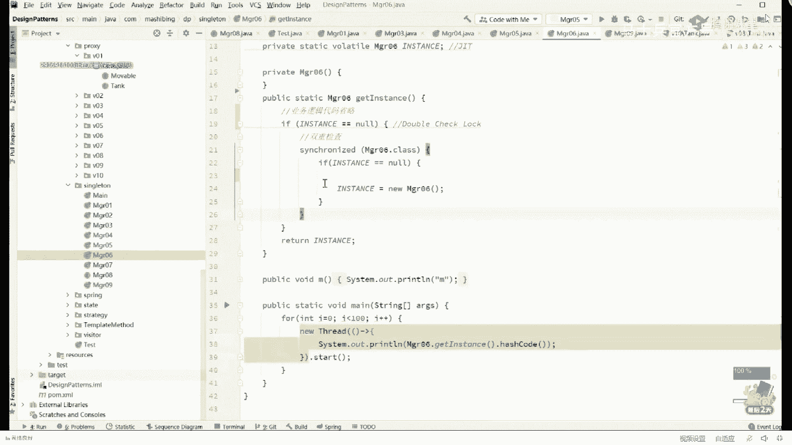
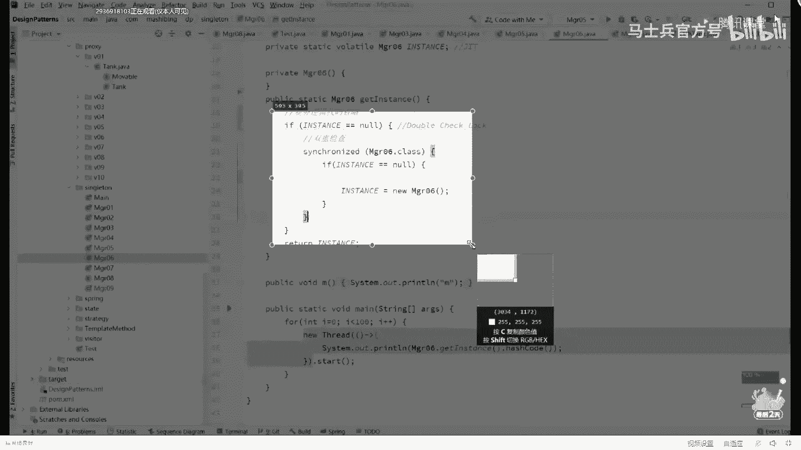

# 【马士兵教育】MCA架构师课程 主讲老师：马士兵 - P30：多线程与高并发：10.DCL单例（Double Check Lock）到底需不需要volatile - 马士兵官方号 - BV1mu411r78p

你抓那个代码吗。

知道啊，那代码抓过来。

嗯，嗯，好我把代码先贴到这儿，有同学可能就会说，我考这么简单的代码居然会有毛病，是的这段代码有毛病，毛病在于哪，你仔细判断呃，看这里啊，我们假设这个instance就是我们的小t啊。

它里面有个成员变量啊，我们叫它m等八，这个无所谓啊，大家应该记得我们对象的创建过程，稍微回顾一下，然后好几步是吧，好现在呢我们假设假设第一个县城来了，第一个线程来了之后呢，它会判断t是不是等空。

t等空吗，最开始是等空的，没有问题，上锁上锁成功没有问题，判断依然为空，没有问题，确实依然为，空好，当我们执行到这句话的时候，instance等于new new对象，new t对象。

当我们执行到这句话的时候，同学们，你们想想看，执行到这句话的时候还记得吗，另一个对象有几步，过程三步，ok，当我们执行到了第一步，new执行到这里的时候，我们的成员变量是默认值是零，我也我前面还讲过。

质量是可以换顺序的，记得吧，质量是可以换顺序的好，那在这个过程之中，指令到底怎么换顺序，如果不幸发生了下面这两句话，换顺序，大家还记得两句话的意思吗。

in works special的意思是把这个m等零变成m等八，a store的意思是t和这个对象建立关联，假如在这个时候线程暂停，然后呢发生了指令重排序，嗯，行程不暂停啊，就是发生了指令的重排序。

指令重排的时候呢，把这个a4 多少挪前面去了，也就是说这时候这个t它指向了一个初始化了一半的对象，来这个能get到的老师口音，到这里的时候，它指向了一个初始化一半的对象，当我们，看到了这个情况的话。

好记住，初始化了一半的时候，正好执行到这里的时候，我第一个线程暂停了，同学们，你们想想看，第一个线程暂停是不是有可能第二线程来了，第二个线程来了，是不是也执行这第一句话呀，他执行这句话的时候。

会判断if t等空来，你告诉我这个t目前视为空吗，是不是为空，不会空，他只不过是指向了初始化了一半的对象，但是他一定不懂空，哦我看有同学比较着急，说老师能不能讲一些线程池的这样啊，今天无论多晚，嗯。

我一定给你至少讲一道线程池相关的题可以吗，线程池呢是一个特别体系化的东西，呃如果你也想听听老师的那个关于线程池的讲解的话，要一些以前的视频好不好，我们把这个结束掉o呃县城是面试的超级重灾区。

也是你拿到高薪的很关键的一个点，呃可以这么说，在你整个生涯里面，不管你什么语言，县城这件事是你躲不过去的一道坎儿，像java语言呢除，了县城之外，还有一个很重要的东西呢，就是虚拟机。

这个也是你躲不过去的一道坎，那么对于我们开发业务业务的人来说，还有一些卡是什么呢，数据库嗯，你知道我们就是作为我来讲，但是大家可能了解我的人。

可能知道作为我们的我我我我来设计这个mc客户来把控整个的走向，呃，mc为什么是不断的扩展各种知识内容。

一个数据库从mysql开始到mango到hbase到click house the ocean base，就是一个数据库呢，就会给你扩展好多，原因是什么，就是不想让你在机上有短板呃。

但是如果从初初级程序员角度讲，其，实呢你只需要抓三个特别大的重点，第一个呢就是多线程，第二个呢虚拟机，第三个呢数据库的调优，这个是你面试的时候的强力的加分项啊，你记得我说的话好，我们继续讲。

就是当你执行到这里的时候，我们需要回顾一下第一个线程来了，初始化了一半的时候发生了指令重排，导致我们这个引用就指向了一个初始化了一半的对象，初始化一半对象的时候正好到这里，第二个线程来了，县城来的。

判断他等空吗，不等空不等空，是不是就直接拿来用了，那他是不是就用了那个初始化了一，半的对象，你的男朋友是不是就穿了，只穿了条上衣就出去了，就他穿了一半的衣裳，他就出去见人了，这合适吗，不合适，听懂了吗。

嗯来这块能跟上的，给老师扣个一，好，为啥不为空诶，为什么会有同学问这个问题，a ba be该是基础稍弱的小伙伴啊，你看这里的t已经指向一个对象了，一个引用通过它可以找到一个对象，你说他能为空吗。

天啊这个这个引用为空是什么意思呀，他引用为空不就是说通过它找不到任何对象，是不是也有引用地址了，明白吧，嗯嗯，对啊这个实例化问题实际真的会出现吗，目前只存在于面试之中呃，但理论上是会出现问题的。

那么这个理论出现问题的可能性是有的明白吗，就是问我们我们讲程序这件事呢，叫做一定要精确，你不能因为说它出现的概率很低，100万次里头只出现一次，你就是可以忽略它，这是不行的。

这个在java高版本已经解决了对但是它本质上这个问题存在，java高版本解决，指的是oracle的jvm的实现，hot bot这个版本解决了。

但是你能保证你自己看从开源下载下来的其他这vm的版本解决了吗，你不能保证这一点，所以还是要精确精确再精确o我说清楚了吧，嗯，半初始化是m有值是零，不是八对你说的很对啊，好了嗯。

当你理解了这个最根本的问题之后，我还是那句话，就是你平时调bug最简单的bug叫语法bug，一个语法直接告诉你哪行编译不通过，哈哈你语法没写对，最简单的当然语法有复杂的，c加加语法比较复杂。

rust语言语法比c加加语言还复杂，所以这个语言虽然说它有各种的优势，但是目前看起来发展性还不是太好，嗯不过没关系，想了解这门语言老师mc课里头有想了解的去了解，那个呃拿第一第一种bug最简单的语法吧。

第二种叫什么，第二种叫运行期的异常，语义上的有bug对吧，呃运行期异常这个也很简单，原因是什么呢，它会直接告诉你是哪行出的什么样的异常，调试起来比较简单，第三个呢叫语义上啊，你本来应该输出是三。

结果你永远输出是四，说明你中间的计算逻辑有问题，只要这个结果稳定没有问题，最恶心最难调的bug叫做时而对，时而不对，遇到过吗，运行一个月只有某一秒是错的，其他时间都对，这种的叫恶心死你。

因为调bug这件事一定要保证重现，你如果不能重现，你这bug叫没法调，你bug不能重现，你只能采取一种方式，就是记录无比详细的日志，然后去查询当时发生bug时候的日志，看看能不能推导出来，咳咳咳，我说。

上的还不是太好啊，sorry嗯嗯对对没错，sorry啊，我记炸了对，就是多线程遇到的对，所以多线程的bug是多线程的bug是最难调的，最难最难调的。

这就是为什么rust语言看rust的语言永远不存在多线程问题，这就是这个语言的牛逼之所在，偏生支持高并发，但是放心您老人家，只要这程序写出来，编译通过，就一定不会有多线程问题啊，就这么牛称。

好了不在这儿展开了，展开起来就没边了，我不可能通过短短的两个小时保奖十好几个小时的课，20几个小时的课全给你讲完啊，虽然你们非常想这样，但是sorry赚不到，慢慢来看这里。

当你理解了指令重排序以及它造成的严重后果，这件事，我相信你就开始应该开始问问题了啊，那个首先我觉得大多数的第一个问题应该得这么问吧，随便哪两条指令都能重排吗，随便两条指令随便重排吗，是不是，当然不是。

显然不是吗，你的第一条啊，我们说不说指令就说语句了，你的第一条语句是a等于一，第二条指令是a加加大哥，这两条能换顺序吗，能换吗，肯定不行，你的第一个操作是sleep together。

那你的第二个操作是be pregnant，你肯定不能换顺序，换了顺序，那就不是你的人了，是不是，逻辑是不对的，所以呃什么样的指令可以换叫做记住我给你记住我跟你说的名词，你看的都是不对的。

记住我跟你说的名词叫做保持现成的数据一致性，呃就是保持一个线程数据的最终一致性，好这句话什么意思，就是说两条指令a等于一，b等于二，你换过去换过来，随便你换啊，你c等于三，你随便你仨仨人爱怎么换怎么换。

不管你采取什么样的东西，当我整个线程结束之后，我再说一遍，当我整个线程结束之后，无论怎么样换顺序，最后这个线程对于内存所影响的结果是一样的，叫做保持现成的最终一致性，只要你保证成这样。

其他的还没有任何其他限制，这块大家能理解吗，有同学说了，说老师您中间这俩能随便换吗，可以的，java的虚拟机的规范并没有规定说这俩不可以换，我说的这个刚才讲的这个啊是是怎么说，是一个嗯。

我刚才讲的这个呢是一个最呃最底层的问题，就是从我们最底层的汇编语言的角度讲，你只要保证整个县城的最终一致性，就是你里边的语句，您老人家随便换好吧，除了他自己定好的规则之外，当然如果随便换的话。

会出各种各样的问题，我们我们现在站在不是站在不是站在最终那个操作系统，windows linux，不是站在这个角度讲啊，我们现在开始讲什么呢，开始聊这个jvm这事就是jvm里面的j vm。

记住它是一个规范啊，它并不是一个具体的实现，jvm规范里头会规定规定什么呢，它会规定说哪些，语句不可以换顺序，只要你符合这个规定，你的这vm就就就就就呃就是符合这个规范的哪些语句不可以或者顺序。

那么在jvm规范里头规定了哪些语句不可以换顺序呢，好这个东西呢，按这理所布局了，sorry，呃搜一下我找一下我那ppt啊，算了，不给大家展开了，你们也可以也可以也可以上网去查啊。

就是说哪些语句是不可以换顺序。