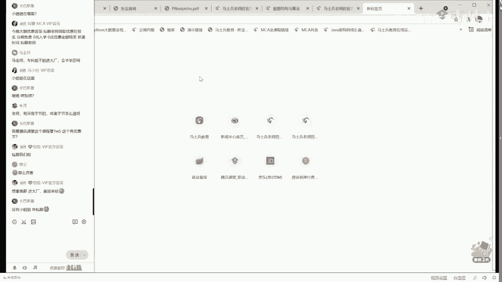

# 【马士兵教育】MCA架构师课程 主讲老师：马士兵 - P32：多线程与高并发：12.课程答疑 - 马士兵官方号 - BV1mu411r78p

做广告了呃，我今天呢快速过，我只想说一定月底在月底的时候，我们一般都会有课程的升级，课程升级呢嗯从今年来看。

我们已经升级升过七次了，这个升级的过程呢，如果你愿意的话，我也可以给你展，稍微展示一下，大概今年到到现在为止，我们升级了九次了啊，一共生了七个月，生了九次课，面试突击，线上招聘，大厂算法app上线。

二点升级，金九银十的突击呃，这次呢是叫做大厂的共研课，这个什么意思，如果我们已经和京东，京东独家协议，我们和京东共研课程嗯，还有呢8月1号开始的，也就是说后天开始的互联网三高项目课嗯。

我们的袁京东的老师，孙老师现在在微博给大家讲的大厂的生产事故和bug bug的处理课呃，我就直接告诉你马老师这里的很多课，你看其他机构是根本看不到和听不到的。

那个，简单说一下跟京东的合作吧，呃我们现在跟京东的合作是一个什么程度，就是说京东那边会有专门的顾问来出来来，我我我比方说我们要讲一个讲一个三高的项目啊，讲一个京东的商城啊，像这一类的啊。

这是我们已经开发完的啊，像这一类的，就是说它背后到底是怎么实现的o呃用到的是是什么样的相关的技术，京东那边都会给出对应的这样的一个一个一个一个答案啊，就是你直接学就是大厂的，大家愿意的话。

可以访问一下这个ip呃，因为现在还没有专门给他申请域名，所以现在只有一个ip，12470111231，然后在这个小海马这里可以直接下载白皮书呃，这个项目呢嗯我就不下载了，迅雷起来讨厌这个项目呢。

这个这个白皮书呢它比较厚啊，就不给大家打印了，这白皮书是应该是100 100表示六页嗯，从课程介绍到信计的知识点呃，到项目的目标，到需求的分析，到项目的设计嗯，还有一个重点，异常的日志数据库怎么设计。

release的规范该怎么做，gate怎么提交。

工程结构是什么样子，安全的规律到底什么样，呃，大家伙呢，如果你因为我今天给大家讲的实际上是很微观的内容，但是我还是那句话，我希望大家伙最后成为一个架构师，是作为一个宏观的把控者。

就是整个项目你可以站在一个leader的角度手里，还管一批人啊，你做那个最主要的东西来把这事儿做完好，这个项目呢采用的技术架构，我也想给大家伙交代一下啊，这是够浪语言，我觉得这不展开了，这个技术架构呢。

大概是这样的，第一会有分布式的i d生成中心，分布式的配置中心，分布式的锁集群，分布式的事务集群，缓存集群，网关集群，注册中心监控集群，mq的集群，e s集群事务调度，mysql的集群。

这就是数据这块呃，怎么说呢，大厂的规范，市面上有很多很多关于架构师的课，有的人抄袭我们的，有的人嗯打着大厂的名义，然后讲的多数都叫做p p t架构师，就是你想落地这件事儿，对于那些刚入门的小伙伴。

听单体版，一步一步的分层，一步一步的分布式，一步一步的每一个节点做到微服务，再给他监控，可以称入上百万上亿的流量，到底是怎么做到的，不好意思，老师这里就是完全落地，落地这件事比你想的重要的多。

画图谁都会落地就懵逼，这种人多了去了，没基础能不能学啊，可以的，没基础就是先学第一个版本，第一个版本是叫做单体版，好吧，在单体板掌握的基础之上再来学对应这个版啊，但如果只有一个项目说这个课是不是深度高。

不是在这个项目的指导之，下会讲高并发分布式的理论，cp定理啦，base啦，这些我就不念了，第二个底层技术的支撑，io克，高并发的单机jvm调优gmm linux内核操作系统相关面试题常问的嗯。

算法课我在开始的时候已经给大家讲过，在这不展开算法课的内容了，然后关键算法的支撑，泰克索斯zab raft gossip，这些都是分布式的算法啊，令牌桶啊，a e s r s6 加密的。

然后线性回归逻辑回归kn，在这个的基础之上呢，再来讲中间件的原理，剖析spring spring mvc的源码课嘛，my balance tomcat源码呃。

通看源码我们有可能是下一步要更新的一个重点呃，如果待会先看一眼，我看一眼，我们头看原版应该是排排上了嗯，就是现在不断的在更新之中啊，搜索一下，呃从tok是什么。

到这d b c这d i e g a b等等等等，就是关于tom cat的所有周期的一个内容，嗯我预计会有，预计会有差不多180多节课呃。

我讲到这儿可能有同学，可能有同学会害怕，你们会害怕吗，就是你会看到老师这边的一个治学态度，在其他机构那里看到了一门课，他们开源码很可能是两三个小时就完事儿了，这个不好意思。

在老师这里呢很可能会给你抛到极其细致的程度，呃凡是会害怕的小伙伴，一般来说呢会有一个心理，就是他其实是一个想速成的心理，我不知道同学们有没有这个心理，他的心里是这样想的。

说那个老师能不能给我个简单的东西，我就赶快进了大厂长了，心，呃是这样的心理吧，我我我我能说错吗，我说错了吗，advantl呃，说那个tk和数据库优先，哪个学哪个精，哪个学校先学数据库。

一般我都是建议先学应用再学原理，同学们记住这一点，我害怕是因为无知啊，没有对人伤情，是这样的，听我说速成这件事，老师有办法不急，就说这个课的精华就在于我们是集合了速成，集合了精通，真正的从入门到精通的。

有同学说了，老师我读一门通不开的原文，或者读一门我们已经讲完的80个小时左右的spring有什么好处，很简单，一门课让你干到p7 ，以前有些小伙伴就靠spring源码，一堂课一门课直接拿了p7 的薪水。

p7 金水是多少，你们知道吗，平均得多少，70万~120万，70万~120了，那当然有个特别水的p7 ，有的文档类的p7 ，文档里的p7 的话有可能是50万左右啊，四五十万那种是比较水的了嗯。

如果你想理解就是说p5 是什么，p6 是什么，p7 是什么呃，去访问这个网页啊，叫m c a。i html，我们的网站那个就是屁股来说呢，它一般是定义成为20万~40万左右的一个薪水。

注意有些同学虽然你现在刚就业，拿个1万多的形式，你很可能是到不了阿里所要求的p5 水平的，知道吧，皮肤水平也是要求一定的数据结构的，也是要求一定的算法的基础的源码啊。

你比如说像什么jdk自己的那些个代码，这一类的源码实际上也是需要你掌握的啊，软件测，试基本的技术像保障的工具啊，那么这就不说了，那到p6 这个级别是什么级别呢，40万~60万的级别嗯，独当一面是吧。

它叫独当一面，当然这里面要求就会更多一些了，他会要求你了解各种各样的设计方案了，通信和调用各种缓存的中间件，消息中间件，搜索中心存储中间的四大中间件啊，各位邀请你了解分布式锁，分布式事务。

各种的分布式的配置，注册与发现网关与路由负载均衡，断路器分布的消息断路，链路追踪预警全新控制，当你到这里的时候呢，你可以非常有把握的拿下，40万~60万呃，我也练了很多东西呢，它是有一定的投机取巧的。

我一会儿教你投机取巧的办法，我们先聊正常的，你应该走的扎扎实实走的路线，我们再来聊你投机取巧的办法好不好，可以吗，路绥远行则将至，你不要想着我拿一个很好的薪水，50万~100万的薪水是很容易。

不讲多线程了，小乔啊，今天真的是讲不完，我不跟他跟你说了吗，这段远程我也讲过了，小乔啊，那么嗯这博士是我啊，我就不在这儿念了，就是说麻烦我我我我我我我大家呢先建立起来一个想法，就是你想多赚点钱。

想成为一个人才，想在你的公司里头担大梁，你首先要建立的实际上是要扎扎实实地提升自己，先建立好这个思想之后，我再来教你怎么投机取巧，有办法啊，到p7 是一个什么水平呢，大概年薪是50万~70万。

但是它有800~1200的股票，阿里股票呢现在应该还算是比较值钱，算下来差不多是70万~120万之间，哎我说到这，你们想看看100多万的简历吗，这是p8 了，p8 呢呃p8 基本上只有我给大家讲啊。

就说这个这个年限就你就很难突破啊，空降的p8 比较少，但是老师会教你的，我能带你到p8 水平，p8 叫做格局啊，它不是一个纯技术的概念啊，这个扯的有点远了啊，我们再来把这个技术点基本看完吧。

核心的服务的设计，微服务的全站嗯，service mesh的理论和落地，别人没有问题，早就有了数据治理，人工智能的加成c c d呃，我就不在这1111给大家讲完了好吧，那么嗯，老师你属于p多少。

嗯嗯p 13，因为马云是p 14，我肯定是不如人家的，但是p 13总是要吧，嗯嗯那个，嗯有同学说老师6p 13，那我就开个玩笑了，大言不惭一下，反正我也不会去阿里，嗯想看看比较牛逼，120万的简历吗。

昨天也给大家看过一点点，这里，马老师原来在哪里高，就最早清华念书，后来基本没有，咱就是做过很多企业，我就不一一说了，后来基本是在创业，我从29岁开始就没间断过创业，看这里，这是那个120万左右。

这个是拿了p71 120万年薪，这是确确确实实拿的，你可以自己读一下，这是技术手段，因为以前上学堂吗，山学堂是我创办的啊，后来我转让转让完之后呢，做了很多其他的行业呃，早再后来还是比较喜欢教育。

从19年开始踏踏实实做线上教育。

海量数据就是你想去做什么，各种行业，想去提升格局，想去让你就是说，赚出你超越你认知的这个钱来，踏实踏实跟老师走就行好吧，呃看这里啊，就说这个小伙伴呢，目前这个情况我也告诉大家一下。

这小伙伴是目前为止我们最牛逼的一个学生了，我想跟跟他应该是一个意识亦友的关系，愿意的话你可以截个图，这个是他从企业离开之后，然后给大家的一个小小的建议，我建议你可以可以解一下，没有关系。

现在公司给了5000万的股票，他们已经套现离开公司了，扎扎实实的5000万现金已经到手，嗯怎么说呢，就是说当你一个人到了一定的技术层面之后，除了技术之外，还要有认知格局，这个层面多少岁啊。

这个学生目前因为今年应该是31岁，老师讲一下二线城市涨薪都是什么跨度，二线城市，举一个二线城市西安吧，你搜一下，刚才我看有个小伙伴在那里聊西呃，这是跟我学的西安的，五个月涨了5000，进了华为。

其实涨5000不太难，进华为比较难啊，这个是学了三个月，涨了10k，带了团队嗯，这小伙面试频道这件事是他自己说的啊，他说老板坐标西安，去年做生意赔了几10万，现在面试基本平衡。

老师说过管理应用技术用年龄就不是问题，我现在十分认可这句话，好多时候你的认知不到位，老师说的很多东西你可能听不进去，就直接跟你一点，所谓的35岁危机，所谓的40多岁我该怎么混，我直接就告诉你。

如果在这段时间你像老师一样不断的不间断的提升自己的话，这些个简直都是不是问题啊。

老师有，武汉只能算二线吧，武汉我找找啊，武汉的情况，武汉应该每个城市都会有那么一点点的那个，我们其实啊你对于二线城市来讲呢，你你你你想都不用想，你琢磨琢磨这一件事就行了。

呃就是老师的课程设计是什么样的一个设计，这个可面对的一线城市超一流公司来进行设计啊，哪怕你学个50%别多了，我觉得在二线拿前5%的薪资总是没问题的，好吧，平仓啊，你要学个78%成，基本平摊。

呃呃差多值都有它的理想结果啊，原薪资是13k直接入职武汉阿里，可以吧，马老师，我阿里的hr面了，应该是p6 ，我目前13k那边会不会压压薪资啊，没关系，教你怎么跟hr谈吗，老师让你学啥，你学啥。

让你怎么学怎么学，让你粗的掌握你粗的掌握，让你细的掌握，你细的掌握，帮你定制一条从浩瀚的学海里头知识的海洋里面，帮你定制一条独一无二的属于你的路线好，什么叫捷径，这个就叫捷径，知识的海洋呢。

你学起来总是没完没了，但是放心，老师会带给你做一条定制的专门属于你的路线。

你说老师我想一个月涨薪好，一个月让你涨薪，老师我想三个月涨3000行不行，ok没问题，老师我想半年大体的知识学到手，我能不能跳大厂来，老师我想1年把所有知识全掌握行不行，挨着牌的学。

来看几个武汉的例子吧。

这就叫捷径，13~20，原来也是13啊，最近太忙了，涨了一些7k34 个月，从13~20继续学冲大成，突击了40年12k武汉跳北京啊，这是武汉跳到北京了，武汉8k到15。

这个太简单了，应届毕业生武汉14k啊，这个基本上关于武汉的吧，年薪40万啊，这个是我印象很深刻的，他当时应该是2年没工作了，学到后半夜，最后复出拿了40万年薪啊，就是说第一你要肯干，第二你要找对人。

跟对人找对路，南京的郑州的郑州那个别找了，我还是那句话，你就记住老师这话不坑你，不蒙你，老师这样的课不用你学完百分之五六十左右，像郑州这一类的，你基本上就平衡啊，没有小姐姐咋私聊。

忘了忘了把小姐姐给你是吗，截屏实力二维码，宁波的搜一下很重要，主要有些好多二线城市的，我也没不知道有没有记录啊，宁波我不知道有没有记录，宁波没有记录啊，宁波无锡吧，无锡是跟牛魔差不多，感觉都无锡有记录。

这是江苏无锡十到14位同时跳到市里，感觉很少，很多人都嫌贵。

其实是说我们的课程规啊，呃但是呢他说我也是怎么怎么怎么样啊。

我在无锡江苏，但是呢呃他当时学完他那那那关键的话还给还给打了，说我学完之后是特别直的啊，这是无锡年经验是8k两个月就实现翻倍了啊，那个三个月啊，三个月实现了翻倍，其实差不多两个月，老马着实牛逼。

曹老师也牛逼，说实话这课太值了。

每次都是跪着看啊，能说清楚我们课程的价值了吗，好月末的月末的最后，也是我这个赢的最后一天，全国应该说最值钱的课，没有之一，走过路过，别错过，今天错你，你这辈子要是来，其实大多数人后悔都是来晚了啊。

金九银十是你冲刺的最好的时间，7月份的腾讯满减三榜第一的奖学金，我们是腾讯课堂唯一的三榜第一，腾讯课堂有几10万的学员，我们是三榜全是第一受灾地区的补贴学生的啊，你是在校的学生的，是这样的。

我不知道大家有没有任何认识到老师的课值钱，或者说它涵盖的东西比较多的，原因是在于我们确确实实实在不断的升级，你能听懂吗，就是我们会跟上课程里头就是现实之中达成的一些个需要，我们为什么和京东共研科呀。

你们知道吗，京东现在至少有三个部门追在我屁股后头，要人老师，你那有人吗，能不能给我送几个，那有人吗，能不能给我送几个，但是不好意思，好多学生啊，有些可能没准备好，另外一些现在我觉得真的挺有趣的。

不去我自己选啊，京东原来薪水稍低嘛，大城里面京东新水烧低，最近涨了，跟大厂的合作就是应该是相当的到位，在这儿也稍微的展示一下，好吧，再次一点点，我们有一个美推来着啊，呃当然这个是去年的一个情况。

因为这个我们跟字节啊，京东啊早就建立了很好的一个合作，我们字节的直线距离2百米，京东的直线距离差不多2km左右，也就2千米吧，那个所以呢它里边有我的好多学生啊，所以建立起的联系呢就会建立的比较多。

呃字节呢字节什么业务最牛逼，直播吧，字节跳动直播平台的研发负责人，看到老师的课就觉得有不错的学员推给我，直接安排面试啊，这是他自己跳动的工牌，嗯，怎么说呢，呃我个人我从来不喜欢吹。

给大家伙吹内推这件事主要的原因，我认为内推这件事是建立在你的技术过硬的前提之下，你的技术不过硬，我是不会推你的技术，不过硬推你进去砸我们自己的牌子，能理解吗，能理解的，给老师扣个一来。

大家不要把内推看得太重，内推叫做插个队，有好多人在那面，但是我们推你进去啊，你可以查提前插一个队，明白吗，提前面试里，但是他会一会因为我们内推你而降低人家的标准吗，会不会绝对不会啊。

所以内推的第一条规则叫做建立起来，你真正牛逼的知，识体系，这才是你不管去哪儿，响当当，光明磊落，站得起来啊，飞得起来的最根本的东西，其他的那个说说的简单点都是都是建立在这个基础之上。

才能够有其他的软环境的玩玩法，当然你说老师有没有说快速的办法，有，如果你想看快速的，比三个月六个月都要快的那种，这是一个半月，他说他说了，最后最后最后说了，说我们的面试突击班是神克废话，金三银四。

我们一个面试突击帮了多少人就业，就报名一个月嘛，一个多月的事儿做完了，现在距离金九银11个多月，我希望你走过路过，千万别错过，1~90月份再想跳槽的时候是比较难了，你就得等明年的金三银四了啊。

入学一个月，面试突击直接涨薪，涨了70%，仔细看啊，原封不动的聊天记录，突击40天就突击了40天，感觉面试突击的劲儿用完了，问到的比较深的东西还暂时没学到呢，慢慢学嘛。

老师的课是要从基础的带你带到百万年薪的，你能够说简简单单的几十天能全学完吗，你不要有这样的想法啊，不要对这个对自己这种那什么太过太太太要求太过了啊，这是内部掌心啊，他就是学完了之后，他没跳，内部涨薪。

10%，既有广度又有深度。

这是咱的评价，既有广度又有深度，几乎不用买什么书了，互联网技术一网打尽，好了还是那句话。

7月30号了，我训练营的最后一天，呃在8月份呢我们有一个小小的涨价，为什么要涨价，原因也很简单，他会占用腾讯课堂那边的资源，我说句实在话，不如我们自建的平台做得好。

在我们自建平台我只需要给你定好路线之后。

你按照路线学，也可以按照普世性的从头到尾的慢慢学。

也可以，啊这个需要登录了vip，中间遇到问题，直接点问题就可以提问，提问的时候工作的时间半小时以内就会有人响应，你保驾护航，有同学说，没有关系，可以的，聊会儿小天，其实在这儿我就只想问大家一句话。

想不想今年年底的时候多带点年终奖回去，1万多块钱的课确实比其他的车比其他人稍微贵那么一点点，因为我们大概每课时是五块钱，因为我们的课实在课程量比其他人大的多，我一个课讲课的老师接近20位，人家只有三位。

我一个课给大家讲的课时接近3000小时，人家只有400小时，不要看这个，不要看那个多，比较课程内容多，比较师资力量，这才是核心中的核心，30多岁还能长薪多少，大专学历，你现在心率多少。

在哪个城市这件事呢。

他每个人和每个人的情况肯定是不一样的，郑州你搜搜看有没有郑州的好不好，你其实特别简单，你就这么多找一下，看看郑州那边给的薪水比较高的有哪些，好像只有一个郑州的记录下来了嗯，郑州哪儿去了。

8k现在年薪是28万，还是马老师练课程好。

原来是15k涨到23，一个月23000，郑州这边主要得看那个人家给多少啊，因为我不可能了解每一个城市能给你的薪资到底是多少，这件事我是不掌握的，呃承诺大家一句话来老师这上课，你什么都不用带。

就带一个东西过来，把人带过来，差时照着学完，说找不到新的老师，钱原封不动，一分钱不收退给你，整心对我们这个课是叫做顺手的事儿。

难的听我说，比较难的是什么呢，比较难的是进当成这是比较难的，大厂能不能进跟我，我直接告诉你大厂的课，他面的东西不会超出我们讲的东西，课程怎么购买，十个秒杀的名额去要啊，别错过，还是那句话嗯，拿阿里来说。

这里大概有40个关于阿里的记录，呃，这个是阿里和京东的两个offer，这是阿里菜鸟进阿里菜鸟涨了50%呃，这个是入入了阿里，薪资翻了倍，那么这是三个月直冲阿里薪资翻了三倍啊，嗯就是跟曹老师在聊天吗。

阿里的p6 ，兄弟们保持自己的梦想，就我还是那句话，你自己生而有异，为什么要选择匍匐前行，拉开跟你周边人的差距，你具备这个实力，好吧嗯嗯，你过来老师就带你飞啊，你说20位老师带不动你，除非你是头猪了。

就，这是阿里的京东的话呢，39个记录，你不涨，不给你点点，别人看了，你要愿意的话，这个网址是公开的，里面没有任何一个说说我们自己人跟那p的记录一个都没有，如果你找到学费1万多块钱退给你。

再赔给你同样的学费，呃京东的字节的吧，字节有九条记录，字节确实稍微难难进一些啊，蚂蚁字节两个超年薪50万的offer，嗯嗯，跟老师的课最好的时间点大一，因为老师可以在大2l大三的时候，4号的时间点。

大三再次一点，大四快毕业，再次1。1~3年，再次1。3到五，我告诉你老师带你就会比较费劲，但是呢也能带动，44岁的大龄女程玉儿，可以吧，打零是不大零吧，38岁的大龄程玉儿，68万年薪翻倍了，我说感觉。

但是他他这个还挺谦虚，但是感觉我好菜，面试官虐的体无完肤啊，居然技术不让人事了，因为他自己觉得好菜，但经过我们的培训之后啊，其实已经在别人的眼里已经算是比较牛逼了。

35连续两次跳涨，5k连跳两次，嗯还是那句话啊，同学们，你们如果就只是想找个薪水，小小的薪水，你就扎实来，这可坑不了你，你也一定会很快的收复老师的这个学费回去，一块钱每年，哈哈哈哈。

你现在报名学的是2021~2022年这个学年，那么2022年到了2023年，给我们一块钱免费继续学，注意不是重复的东西，是升级的内容，老师可以介绍一下vip课程吗，哦你是说vip课程的具体内容是吧。

可以的，呃mc的内容比较多啊，我每次会稍微偷那么一点点懒啊，呃整个内容呢是由四大块构成，刚才我介绍了顶级的架构师这块，其实我还没有介绍完啊，因为每一个打开的话内容会更多一些，就是内容会非常的多。

但是我就直接这么跟你说，别人涵盖的，你从任何其他机构看到了，说老师人家有个机构讲的东西，你这没有，老师要是短时间内给你补不上去退费，所以不用我说内容了吧，就是你凡是在其他任何做架构师培训机构看到的内容。

如果这里没有的，我一定会给你补上，不会单独收费，我这么说能接受吗，能接受，给老师扣个，一来，现在的课程内容呢也是说一点一点的升级升到现在的啊，也不是说刚开始就是两三千个小时的课，不是这样的。

我们那个vip啊，没有gpa的内容，大哥这pa现在不怎么用了，另外呢spring data是在里面，你可能还没有学到，帅帅啊，这个呢是知识点的课程啊，对那个高并发呀，这mma调优啊，操作系统啊。

然后中间件呀，e r k啊，什么事物啊等等等等等啊啊还多配啊，have啊，不说了好，除了这个之外呢，项目课，项目课从简单到复杂，九大项目帮助你能够说在你的简历里头啊，写出很多很多的关于项目的内容呃。

举个小丽的网约车项目。

这是曹老师经呃，曹老师就是原来他在阿里工作，在拿阿里的工作的流程，带大家讲的一个网约车项目，算一说它它所所所带来的效果吧，好不好，就网约车这一毕业应届生平均网约车21k的offer，21000，刚毕啊。

小白我一说15000。

网约车找工作5k原来是25，涨到30，就靠这一个项目而已，传统项目网约车找工作，企业家家留人啊，就是不想让你走吗，因为你学了互联网比较牛逼的项目了，所以呢加价没问题啊，课程是永久可看吗，踏雪飞鸿啊。

我刚才解释半天，你还是没听懂，mc有k8 s吗，废话这必须有啊，放心你一定有可能是永久可看吗，我刚才解释半天，你还是没听懂呃，课程你享有的权限，1年，但是只要我们课程再再升级，每年你要给我们一块钱。

你才可以看，你要是乐意，我先给你交20块钱呢，先给你先给你续20年，陈红听明白了吗，多线程jvm呃，关于设计的很多内容啊，软性的很多东西嗯，因为我呃就是说以我们课程量来讲呢，不可能一个人把它全讲完。

呃每一个内容我基本上都是要找到对应的优秀的老师，嗯，左老师刚才给你看到过了，来讲算法来讲，国内超过他的很少呃，讲项目来讲巴里的呃，曹老师是在阿里啊，他做过10年，说我做项目很牛逼。

但是阿里最近是怎么做的，其实我并不是并不如他，你能理解吗，呃黄老师在离开美团的时候，当时已经拿到85万的年薪，就是以他这种水平来给大家带整个项目的架构，你放心一点问题没有啊，嗯京东的孙老师给大家讲什么。

在你实际工作制之中，大厂所遇见了哪些个线上的bug，并且他是怎么记录和调试的，很宝贵的这种经验，你面试的时候，如果能跟面试官聊这些东西，你想想看面试官会怎么看，你琢磨琢磨，看看你的感觉是不是我靠。

赶紧来，不是他带你飞，而是你带他飞啊，为啥子这没说吗，是什么意思，这个没听懂啊，拥抱生活，35了还能从零基础开始学吗，呃我建议你35学另外的课，不要学这个课了，就嗯陈老师讲的课真的好，是的啊。

听听看就知道，不是说只有我讲课，大家伙能接受其他老师讲课，你听听看就知道啊，没有差的老师，老师这没有差的老师，明白吗，就是你你你到其他地儿报课呀，或者什么也好，你可能会有坑，可能会怎么说。

就是可能会可能会啊，所以说被坑过或通过坑呃，可能前面吹的挺牛逼，后面不怎么样等等等等，都是有可能这种情况，老师这里是没有的，啊，腾讯的三榜第一的，他不是说是个人就能够拿三榜第一一类的。

这是我们这个课程的评价，叫做mc的架构师课，2643条评量百分之百的好评很深，受益很深，一种全新的授课模式，不脱离实际，即学即用，不会出现完全理论，是应用的时候无法下手，什么叫p p t架构师。

国内讲ppt架构师的太多了太多了，一个ppt架构时刻卖2万 15000，我有时候觉得，说句大言不惭的话，你交那个钱啊，真的挺亏的，用12000多块钱买一个完整的m c a，差不多你以后不用再花钱了。

感觉带你贷到百万年薪的水平，但是有很多人呢就是愿意花个六七千，或者花个15000，或者花个2万买一个，每个星期差不多三次授课，你就你就这么想啊，一周上三次课，一次两个小时，他是多长时间呢。

一个月是24个小时，那么12个月呢200多个小时，1年上200多个小时，你要上完我们这课8年，你要这么上课的话，别这么伤，让老师带你用更快速的更有效率的方法，你两个月先把薪水涨起来，你会慢慢的补充它。

不香吗，韩大数据方面内容吗，那你真是问到人了，今天晚上报名还含有一期大数据的课，这个大数据的课，那也不是水货，8月就没了，我就直接告诉你啊，老师就可以把钱退你了，我只想告诉你，你捡到便宜了而已。

那么这个大数据到什么程度，你如果有了解过2万块钱的那种大数据的课很好，就是那些其他的不看了，我们只看课程内容，这是关于大数据项目的部分，实时数仓什么的课程呢，有这么多个阶段。

前置知识中间件hdspark flink数仓体系收藏是比较多的啊，我们会建立killing to do lifi click house cattle，maxwell phoenix等技术集群的管理。

数据库，数据导数据的治理，呃，怎么说呢，如果说就这个大数据这块，我们一定是要对外单独销售的啊，后面再想要没了，薅羊毛尽快趁早，别在这浪费浪费啊，平时上课几点到几点呃，8月1号开始的直播课。

8月1号开始的直播课是八点到十点，那个录播课你就不用管了，基本上每天都有更新，然后呢我们每个月的更新的内容会告诉你哪些课程给更新了，有的官方也是这么着算大厂了，但是它属于接近大厂的一种岗位，什么意思呢。

呃每年华为在社交的时候，大多数都是从欧d来，华为其他从公开社招，除非项目比较急的情况下才会产生，不然的话多数从欧弟来，所以它是属于进大厂之前的一个跳板吧，啊啊老师学完vip后端课程，本科毕业可以拿多少。

你是刚毕业吗，第一刚毕业的时候呢，不太建议太关注薪水，但是你老师的课程来说，15000左右总是没问题的，听懂了吗，这是最保守的啊，卖白菜的钱，其实说到这儿呢，呃我们当时创立这个机构的时候。

就是说大家伙儿也都不是什么特别缺钱的人，那个能不能够说你最性价比最高的东西，最核心的把这个优优质的内容给到大家，呃，我个人呢是有一点情怀的，我是希望咱们中国人充满各种各样的人才，就成才这件事。

成才这件事呢，第一你首先成为技术人才，然后呢才能成为更优秀的综合型人才，这个才是目标，所以你先别着急，现在我只是带你成为技，术人才技术人才带你就已经到很高的高度了，想成为更好的更多的人才，跟着老师。

你扎实走，你放心，坑不了你啊，那个成才这件事来说呢，是我们一个出行，也是我们做这个平台的关键，所以从老师请老师，就是从我这儿请老师的角度，不计成本，我跟你说，你曹老师原来在阿里什么水平百万。

黄老师原来在美美团的时候出来就80万年薪加股票，以那个卢老师，卢老师是北大的博士后，我把他请过来教你，你觉得他教不教不起你吗，带不了你吗，有同学说老师那有有没有跟我们接地气一点。

的那个那个学历差一点的老师啊，有当我们民歌也是，他也是大专毕业生，但是不耽误，他已经创业好多次，卖过好多家公司，现在早就财务自由了，怎么说呢，就是各种各样的人，最后啊你想成才的话，如果说你想成才这条路。

说离了，让自己提升，让自己精进，让自己向上生长，你觉得可能吗，一批牛逼的人带着你扎实来，老师m c a具体说一下，全称就叫m c a，就这些p5 p6 p7 p8 ，全程就叫mc，刚才也说过不少了。

我不展开了行吗，嗯自己去读一下不好吗，嗯，mc是什么的缩写，mc的全称呢叫做，换一个好写的，马士兵，certified architect，yes，是我们认证的架构师，你不要跟我吹什么牛逼。

说是腾讯认证，京东认证没没写啊。

我们认证的这个架构是是全网最牛逼的架构师，没有之一，嗯分期可以分多少期，这个好像应该是24吧，最多是分24期，就一个月500块钱左右，啊462信用卡到24对嗯，有没有手把手教的，怎么着。

手把手把一行一行带你敲代码还不够，手把手吗，哈哈就是从一个非常空白的文档，手把手的带你一行一行敲代码，这个不叫能力，这就是手把手吗，有几种办法，第一种，正常时间段向我们的问答平台提问。

半小时以内必有响应，第一种跟我们的老师直接在群里问，但是这种问题建议是呃，职业相关的问题会更好啊，技术问题在这里反馈会非常的及时，职业问题在这里会非常的及时，ok呃特别隐私的那种，加老师单独微信私聊。

好，说说你的条件，一般来说如果想入门的话，年年轻一些，年纪别太大就可以了，所有课程都有录播，直播时间赶不上，当然了，所有的课都有录播，无限次回放，强调一下，12点还有一个小时，我跟你所说的这些优惠。

你就这辈子再也拿不着了，就只能单独付费了，老师这里呢如果只是向你传授一些知识，我也懒得就收你钱了，就是以前啊有有有有的人拿老师的这个视频啊，或者什么的，都没收过费，无所谓。

老师这里是苦口婆心的指导你一步一步的达到一个比较牛逼的水平，你会看到每一个聊天里面，实际上是都有我们这的老师在群里头进行一步一步的指导的，明白吧，如果是你要愿意了解了解林老师。

你就会发现他后半夜还在给学生解答问题，了解了解曹老师，你就会发现在每一个地方，他会带你教你一步一步手把手的教你怎么进阿里，能把高中生带进阿里，你想想他是什么水平，8年经验有点迷茫。

谁能指导一下油条回答我几个问题啊，人数不多了，你可以回答我这几个问题，我就可以多跟你说几句，人多的时候不敢放这放这个ppt，因为人都放这个ppt上，消息就刷不过来了啊，尤其是在嗓子不太好的情况下。

咳咳我咳咳，稍等，是很早以前啊，给跟那个同学们做规划的时候用的一个模板，你可以试试，就是说你想让老师带你，你总得告诉我你真实的一个情况呃，你要告诉我你在哪个城市，你今年多少岁，你工作多少年了。

你现在薪水多少，你是哪个大学的，是什么专业，是专科还是本科，你的目标是什么，当那这个小伙是7月20号报名，就是去年7月20号报名，金九银十，他要突破20日，10月20号跳槽达到25。

选个老师说进行一对一的把脉，这个vip呢都有啊，你不vip，如果你是vip，就不用在公开课上问了，专门找老师，老师专门有老师帮你把脉，现在公开课的说白嫖老师一把，可以的，没有问题。

但是你要给我按照这个模板来，在一段里头把这些话全敲完，不要分好多段好吗，多大算年龄比较大，你是说刚入门吧，就说你零基础丁点关丁点丁点儿，那什么都没有吗，30，3~35应该算是比较大了。

25 零基础你扎实来啊，这25 零基础太简单了吧，20突破到35家，难度大不大，对你来说可能难度大，对我来说难度不大，简单指点指点你估计就到了，你看这人跟我聊天，刚学完se确实讲的确实好。

s e你听的是珊珊老师讲的是吧，非常的细致啊，蓝色有两个版本，第一个版本叫快速版，第二个版本叫扎实慢速版，可以走快速，也可以走扎实啊，专科呢专科没问题的，专科你要是想提个薪水，那是真的不难。

就是你任何人，你别管你什么学历，你说让你长长的薪水，他真的跟玩的似的，专科做一下，专科这件事啊，他他是真的不难啊，就是掌心这件事是真的真真心不难，31岁两个月的面试突击，多加offer。

这个没谈涨薪水的事，他肯定也涨了啊，半个月专科学历涨了6k，深圳的11000的月薪，这应该是原来没工作啊，南京的专科8k到15，应届专科七天的面试突击12，这是应届专科的学历。

四个年薪40万的offer，这个就是有经有工作经验了，专科学历三个月失业到月薪25，好几个高分，不知道怎么选，怎么着，这块怎么样无所谓啊，这还不全。

还有大专大专生呃，面申通的时候，阿里给打电话，没接到八个电话，一个都没接着，倒霉没进阿里，要不然就进了大专学历，多个大厂offer，专科啊，是这样的啊，寻求掌心，你这是老来老师这儿学课讲不了心。

老师把钱退你拍胸，不是向你承诺这一点，就是说专科我们的目标是嗯带你进大厂了，但是我现在不想说这事，因为啊专科带进带进大厂这件事真的挺难挺难的，我们可以把它定为目标，你就想你最后你没有进大厂。

你说我照着进大厂学的，我没有进城，我整个薪水是不应该跟玩似的，告诉我一下是不是，有清华的学员没，唉，你自己搜去吧，小伟啊，等老让我帮你搜，没没没记录，但是肯定有啊，我的小师弟，我记得很清楚。

因为他有时候图片上写的东西呢，它是搜不着的，只能是文字，文字总结不到位的话，清华的北大的，北邮的，取法乎上得乎中，取法乎中得乎下yes，成交也没问题啊，嗯你定位你定位是涨薪，我就告诉你问题肯定不大。

定位进大厂，这个我们要好好宠，这是真的，嗯嗯老师本科毕业建议去哪个城市成交，没问题没问题啊，成交算什么问题，软工考研学有用吗，软工考研考研有用吗，是吧嗯，总比没有，总比不考强，就这个意思。

现在看到网站网址是什么，出去看，真实的学历，初中自考的专科，那不还是专科学历吗，5年经验，基础不扎实，嗯这课用来干嘛的，不就是让你把把基础砸，这是吗，杂技术本身不难，算法加底层。

其实就就就把这基础砸深了，啃下来就行啊，定位找心呀，你就扎实来啊，我刚才小姐姐提醒我，40分钟，40分钟优惠结束，今年以及以后的年，你也就再看不到这些优惠了，嗯嗯，呃我们聊天聊一会儿，聊到11点半。

十分钟好不好，需要账号登录吗，必须vip才能访问吗，哎呦你敲一下吧，你能不能自己敲一下，当然不需要，我没事啊，这个东西还要你登录访问，没没有这个必要啊，没有什么藏着掖着的好吧，吹牛逼啊，真是东西的。

我跟你说有有有有有多少个课程，你是从网上网站上都能看得到的，这是我们的学员的一个记录课程的东西的话，在这个平台里面呢，你可以点这个按最高级架构师点进去，但是不急，因为这些课还没有完全上。

还没有完全上上去，目前是95门课，但是我还是那句话，一门课很可能是八九十个小时，就短一些的二三十个小时，但是呢嗯，还是那句话，就是说这些个课呢它是不断的在更新和迭代，只要缺了哪个课啊。

你说那个说别地儿有老师，你这没有能不能帮我们跟上，不要再收费，完全没问题啊，而且比别人差了都不行，说人家讲的挺好，我们这讲的不好，必须重奖，这是我对我们团队下的铁的指令，啊截止前端线工资低。

现在转成java需两小时，半月20加这个五杀难吗，告诉我一下你现在的其他的情况，你把这些都得告诉我啊，我才能告诉你，难还是不难，有把握还是没把握啊，多敲几个字儿嗯，moses moses，moses。

moses，咳咳，hello moses，30岁大专前端3年5月20家，明年34月份嗯，能交流真是费劲，1年34月份还是大专，你你你你自己是看不出来你缺哪些信息是吗，工作几年了哦，大专3年，sorry。

对不起，是我的问题，向你道歉，3年啊，目标是20加，你今年是拿多少多少月薪，多少月薪，你现在是拿多少月薪，告诉我一下月薪8k哪个城市啊，就这种地，你就多说两句，他会死人吗，我的天。

这么这么好的模板都不能照抄吗，品种听我说啊，那个你想一步到位拿20家有没有办法放心，有保护性有多强，我预计百分之七八十左右，你能达到20，那个怎么拿，我直接告诉你路线，第一你做过前端有什么好处。

你会了解业务，也就是说当你在简历上写项目的时候，你会了解这个业务，就是你有的写这个很重要，所谓30岁的成员，如果别人问你做过什么项目，你要写不出来，你就别玩了，所以这个非常的重要。

这是你写这段需要注意的东西，第二大概用我预计应该是用一个月到两个月左右时间，把零基础内容拿下，零基础内容呢差不多是这样子的，jva入门呃，数据库mysql前端不用，你学了后端的内容。

那个s s m这a b c加上spring boot一个入门级的小项目，这个项目叫何家园，正常你应该在1~2个月左右把何佳芸囫囵吞枣的拿下，我不需要你精细的拿下，就是你大体能够开发出来。

到这儿你会知道后端是什么东西，长什么样，做后端的人都在干什么，你会你就会了解了，但到了这一步之后，第三一步，这一步你大概要也要花1~2个月时间，你们这1~2个月你做什么。

spring cloud就是分布式微服务，就啃这个我刚才讲的这些什么底层啊，系统啊，你都不要给我啃，就直接给我啃spring cloud，把这个啃完之后做一个小小的面试的一个突击过程。

然后把我说的三门的最底层的东西背一遍搞定，20k月薪拿到，29 5年半26，玉溪师院信管本科34+9月份啊，路线有，但这个成功的概率你要降低，他刚才成功概率80%，你这成功率估计60%左右呃。

到9月份你正常的应该还有，我建议你到10月份啊，就是金九银十嘛，那你90月份应该这么来定，你差不多还有两个月左右时间好，这两个月怎么安排我，我现在只能给你安排错误的原因是什么，我没看到你简历。

我不知道你会什么，不会什么，我现在假设你会s s m，你会基础的spring cloud，在你会这两个的前提之下，这两个月主要主攻什么，面试的重灾区一共有六项，然后再加一个一级流量。

这个e级流量用来解决什么问题，架构方面的三高设计，把这个问题解决之后，你的薪资就可以打开上升空间了，26怎么打开，就是你年薪50万这件事，也就是月薪4万左右之前怎么打开，一级流量，靠高并发打开。

炙热秋水，我说清楚了吧，然后再把那个给盖了啊，油条是5年c o d 18 k大哥该涨了，你要再不涨，你就废了，掌握部分spring可巩固基础，多久可以拿高薪。

你现在c r u d我现在还只掌握了一点点spring cloud，我建议你最好的办法是应该定位在明年的34月份，这里面呢我跟你说，给学生定详细路线，需要参考的维度比较多。

其中有一个重要的维度是要仔仔细细看你简历的，因为我通过你简历我看出来你到底会什么，不会什么长处在哪儿，短板在哪，到什么程度，缺哪缺哪些东西，还有一个很重要的点，就是你跳槽跳了多少次了。

你下次应该规划在什么时间跳，不是说越快越好，现在进大厂往往有什么呀，第1年龄卡着，第253原则就有好多时候啊，你的目标要根据你的简历和你跳槽的经历来，像油条这种，我也不知道你原来跳多少次，但我建议你。

你你这种的应该是到明年的34月份，因为有半年左右时间，老师可以让你扎扎实实的把我们课程里头的四条重点路线，都掌握的差不多，词条装点软件，底层也都是经常面试问的，你差不多半年左右拿下的话，到什么水平。

p7 ，当然这个并不是说你现在18k你就直接一把能跳到50万年薪，80万年薪，很多人会看你以前的工作经验，会看你的学历，在这些个加上这些判断的基础之上，我就大致能判断出来你可以拿到一个什么样的薪水。

够专业吗，就是你有目标啊，你提老师肯定能给你找出路线来，只要他能行得通，本科30，西安时期一般性掌握大概能到多少，如果你还留在西安的话，西安的顶级薪水你拿就是了，我说的西安的顶级薪水。

就是说西安最高能给到多少，你就拿多少，因为我现在不掌握西安到底最高能给多少啊，刚才我给你看西安的记录的时候，你也看到了，进华为可能能拿25，但是你要是嗯顶级薪水都不高的话，那那那就我也没招啊。

但是我能保证你在干什么，你肯定在你们你们团队里头，那一定就是个leader，就一定是那个特别牛逼的那个啊，大40月份秋招做过spring boot小项目，可以知道项目这个不够大啊。

小伙帅帅你你你你这个吧，把你的简历好给我看，我才会告诉你，你作为大四你应该具备什么，听我说那个看你的目标是什么啊，如果说你只是说你要想当时想进枪杀大厂，你插什么，拿1万多薪水，你差什么，拿2万多薪水。

你差什么，就这个我告诉你就是了啊，但是你你这么点信息，我实在没法跟你说什么，作为应届生啊，劝你一句话呃，我希望你能听进去，第一份薪水重就是第一份工作，重要的不是薪水，薪水多少，无所谓的，薪水2000。

你倒找他2000，如果能让你进字节，你就相信我，你以后的职业规划，职业生涯根就起飞了，这叫起飞，别人是在地上爬，找个小厂子干2年，跳一个中厂子干2年，岁数大了走下坡路，这叫爬，你在第一份薪水里头。

如果能干到大厂去，你这叫职业生涯起飞，了解过有大厂背景和没大厂背景的区别吗，我们说你这辈子差出1000万来，很正常一件事情啊，每个人每人情况不一样，西安274年12科大信息本科09年十，年薪30。

年薪30的话应该是月薪25，你这个呀我还是那句话，你好好听，认真听，西安的顶级薪水，我保证让你到，就是你现在12吗，西安顶级能给到25，就一定能让你达到25，最保守最保守的，你说让你达到20。

总是跟玩儿似的，我就告诉你啊，太太太那啥了，最近西安的小伙怎么这么多，刚才我给大家看那个西安的案例的时候，你们你们都看到了吗，阿里的p6 嘛，你到时候西安那边只要有招去就是了。

像你这种的大学也够经验也够年龄，又正好你要在北京，我要送不送不，你把你送不进大城，我都要都都可以说把把把这把这个学费退给你，知道吗，也就是你在西安而已，西安大厂相对少而已啊，记住，老师开这个机构也好。

或者我们几个老师做这个课程也好，我们的目标其中有一个很朴素的需求，我们想让你成才，南京开发5年时期语言不是java，c sharp a p，玩java能用到吗，你这辈子可能会废掉，我不知道你年龄多大。

但是你5年应该28 九岁左右，抬起头来给我看路，你已经走上岔路了，再往前冲掉悬崖里了，c上我能干嘛，去了点net你觉得服务器做大型服务的有用点，net懂不，csf现在能干的叫做游戏前端脚本语言能理解吗。

pp您老人家还玩呢，go语言出来，杀了一波c语言，杀了一波java，菲律宾基本全给干趴下了，还在这玩呢，大哥你现在不是说学架构的事，赶紧给我换语言哦，换体系晚了，你就废，你不信你就等着太多了。

我遇到的太多了，32了，想起来点net开始转了那个35 六了，甚至40了，突然间想起来，卧槽我这个语言怎么他妈上不去了，天花板到了啊，走错路了啊，还有其他人吗，如果没有的话，坑不了你啊。

现在是11点半半小时，那个还有还有其他人再跟大家伙聊一会儿，如果没有其他人，我就准备下播了，成都的32岁3年11k西南科大测绘本科，目标许什么小，这是什么意思，目标是啥，老张，写全了写全了，账号不急啊。

你要是因为今天现在人也不太多了，没关系啊，只要你愿意跟老师聊，我跟你聊到底，今天写全了，把这给我写全了啊，那你扎实来就行了，这有这有什么呀，这个太简单了，你对薪资没有要求，我帮你定个薪资吧。

成都32岁3年，西南科大的测绘吗，你现在11k对不对，扎实跟老师来，明年34月份，如果不能让你翻倍，把这话给我记下来，给我截图，或者是那个给我那个录音，32岁3年，明年34月份，我让你学啥，你学啥。

我不让你学啥，你不要给我学生，你如果明年翻不了倍，在成都啊，老师退你钱，一分钱不收，7年24，南京java 11 k还在这混呢，你你你可真行，你可真是心大啊，32 三岁在很多北京来讲呢。

四五十万年薪很正常的啊，你还在成都这混呢，我的天我也是醉了，coffee，来来来来来，能看懂这个这个这个这个这个那啥嘛，这个这个这个这个模板怎么这么费劲呢，跟大家说多少遍了，写全了，不要跟我分。

你看直i也是给我分好好几条，我还得给你攒起来，那么有点同同理心行吗，每天买了课程，每天上多长时间呃，到那个呃周末的时候你要翻倍，至少翻倍啊，兄弟们，我就问你一句话，就是你这辈子想变强，要不要投入时间。

你要老想着躺着就能赚东西，那你就不要找我了，去找别人去啊，我能给你提供的就是我教你正确的路，一定不会让你走弯路，我教你证据，老牛逼的师父，我一定不让特别差的师傅带你。

5年武汉4年java 10 k本科选用20，那个哪个本科哪个学校的给我写出来，真费劲，跟你们聊天，凡是不不全都不跟你们聊了，5年java宁波13k哎呦，我的祖宗账号，东北你就告诉我你是哪个学校的。

他能死吗，30 73，年薪70javp h p，终于出现了一个新的，稍微高一些了啊，那个薪资薪资高的怎么涨涨心我我先把这个薪资高的解决掉，就是薪资高这件事怎么找心啊，他比较费劲呃。

我先说还是要仔要仔细看你简历，才能知道你在哪些点上要突破才行，薪资高呢，年龄也大，这时候不太容易整，那么这时候怎么办呢，怎么做，哦看几个高薪的好吧，我记得120万年薪的有有有有几位啊。

嗯这个是120万年薪的，嗯这个是年薪70万涨到120万的啊，这是带leader的啊，嗯那个嗯90万年薪进腾讯的啊，这个也是好，拿这个来举例子，70万年薪怎么往上涨，尤其是年龄已经接近40了。

怎么做做这件事，这是你的核心，就这四个字叫架构设计，我说清楚了吗，好除了这个之外，还有哪个，通过120万年薪的那个简历，你会看出来第一位最重要的是叫架构设计，分布式系统架构，海量数据架构。

高并发系统架构高可用架构好，除了这个分布式高并发高可用大数据量的系统设计，交流经验以及研发，那么还有什么呢，记住还能体现你技术价值的，在这儿开源框架，深度阅读过源码。

什么叫深度spring源码课老师这样的，你听完恭喜你，你可以到定制spring的水平。

通看源码，你听完虽然很长，恭喜你脾气多少水平，这是你需要攻的两个非常大的重要的方向啊，因为他心思远超大家，所以多说两句，南京37年24，南京工程通信本科目标30~35，南京有这个薪水能达到吧。

只要能达到，老师要是让你打不着钱，可以就推你了，我记得南京啊，30~35的薪水呢应该是少数的厂子可以提供的，如果没记错的话，14~24啊，这是南京本地南京的专科学生的，南京南京。

呃这个应该大体符合三个月，南京18~30年薪是到40万。

嗯问了这些东西啊，呃河马这个当时应该是和河马河马升仙。

他当时进的是阿里系的吗，呃上海回南京新水不降反增啊，这个就是新水的问题嗯，我还是那句话啊，就是南京呢我们把它称之为叫二线城市啊，我不把它称之为叫三四线，南京是二线城市，只要你有这样的薪水能提供。

就以你的学历来说，以你的工作经验来说，一定要送你到嗯，国科大的硕士，深圳的国企，30 29岁应该跳大长安石，留着过桥时间，这是一个选择问题，这不是说技术水平问题呃，首先我建议你的第一点。

不管你做出什么样的选择，请你保持进步，老师这句话总是能听进去吧，你在国企就不需要进步了吗，你一定一定是需要进步的，ok其次29岁来讲，我29岁是属于初期创业的，你29岁如果想熬，你还得熬30多年。

看你自己，你要愿意熬扎实熬，想多挣钱，我教你怎么做副业，但是呢我个人给你一个小小的建议啊，叫做骑驴找马，别虐待那头驴，其实两码怎么找，在你29岁的这个前提的基础之上，使劲给我学互联网相关的技术。

你在深圳，比如说你你现在年薪30万，如果有一家互联网公司能够接受你，60万愿出来吗，能不能愿意吗，这时候再做决定，所以随你啊，29，上海西安航空学院电气专科4年17k想涨薪涨多少呀，我29岁不。

我帮你找吧，电气的专科4年17k粗粗的粗粗的，估计啊，就是明年34月份涨到25总是不成问题，小case啊，详细的估计得看简历，看你看完你简历再说好吧，愿意，但是感觉干不了几年呀。

我老觉着你们20多岁的在国企的人混的吧，就跟那个老年人似的，你知道吗，我举过多少次的例子，任正非44岁才创业，董明珠40多岁，褚时健，70多岁，邓老爷子，70多岁，44岁，刚才那个大龄的女生才进的外企。

哎呦我的妈呀，干不了几年是要干嘛，你是要去去怎么着去死吗，如果是这样的想法，你就扎实在国企熬着，当你熬到50多岁，五六十岁的时候呢，他也是一个很不错的选择，你体会不到那种被裁员的感觉。

也体会不到那种呃职业有危机的感觉，反正混嘛总是能混到退休的，也是可以的啊，不是不可以啊，我不是在讽刺你或者干嘛，这是两种不同的路线选择，出来选择更好的薪水。

选择拼选择的是一条带有冒险性的各种可能性的人生，在国企混着是也能望到头呢，但是非常安稳的另外一种人生，你选什么，这是选的问题，多读点书，选不出来的时候多读书，我1年读的书100本。

当你选不出什么来的时候，多读点书，活出自己，活出自己，活出心花怒放的人生，叫什么来着，他那个名字我给忘了，活着就是活法，干法向上生长，去读，所有的东西都在书里可以找到答案，不要在那里混日子，不要瞎了。

打游戏，不是做不出感觉吗，听从自己内心的召唤，听从自己的内心，就叫做你这辈子有使命感，违背自己的内心，就叫做出卖灵魂，随你好，二本就不能到20k吗，我靠你们想看个二本的牛逼的简历吗，昨天已经看过了。

偷偷摸摸告诉你，黄俊黄老师二本，曹鹏飞，曹老师二本，活出生命的意义，对活出生命的意义啊，看书比较多，曾国藩，李鸿章，苏东坡，孔子圣经，佛陀去读书，人呢有一种东西呢叫达克效应。

就是一般人我说的直白一点叫做一般人傻，它实际上自己是意识不到的，就是说一般人得需要一定的水平才能意识到自己很差很傻，我现在认为我自己也是很差很傻的，得到一定水平才能意识到，那么怎么才能到这个水平。

去经济，你会才会慢慢的走向这个level，长沙冲25，长安卓25有点费劲啊，正常主要拿25的，你可以去那个每日优先是吧，嗯应该是有可能长沙其他的那个厂子吧，给的薪水流没有不是那么的高，嗯。

黄老师的简历是吧，真的，20~24岁拿了阿里60万的年薪，啊，我这声明的意义是的，mr李安的吗，刚刚看到你的信息，南京26c加加3年17岁，中北大学我们班图22，22应该是很容易很不不不难的。

就是你你这个你这个很特殊啊，那个梅森林你还在吗，在的话给我打个招呼，不在我就不说了，6年6k 15文件信息专业目标15，我告诉你啊，就你这个半年一定让你到福建，福州吧，应该是你不要写福建。

我靠福建太太太大了，就是福建，你随便找吗，那你去厦门啊，你半年我要到这，你到不了15k一分钱不收，拿拿拿钱回拿回去啊，福州没问题的啊，福州到15还是不是很难的，老师怎么看待自学自学这件事呢。

是一定能够学成的，只不过你花的时间太长，你能理解吗，我今天给你讲内容，我如果不给你讲透彻的讲，你自己看书，你一个月能大家全全输透了，我都我都很佩服你，这么跟你说，其实就是老师们帮你是干嘛节省时间。

如果你认为你的时间很不值钱，恭喜你落入到了穷人思维，一般的穷人的思维是花时间赚钱，富人的思维叫花钱买时间，买完这个时间，花钱买经验，把别人经验很快的搞搞定，你会发现你的level又搞了，能挣的钱更多了。

这时候你的一个小时就比你原来一个小时要多值钱太多太多，不知道大家能不能理解，这是一种认知上的偏差，mr里不在了，还有玩c加加的吗，玩c加加可以多跟你聊两句，宁波35年13。

铜陵街设计师目标一二十九二十倍以上呃，然后应该是问题不大啊，但是我觉得18总是问题不大，宁波呢还是那句话，我现在不太不太掌握他最高薪水能给到多少啊，如果能给到比较到位的话，小case啊，不是应用层的。

夜好漫长，你还在吗，在跟我打个招呼，在我就跟你说，不在就不说了，28周岁机械，亲爱的是吧，嗯依然告诉我你用什么语言做底层开发，不系统时候编程有机会吗。

半年左右让你入行一线城市拿个15000左右的薪水总是没问题，那就看你自己的需求了，c加加时间应该到什么什么什么什么水平，这个c加这件事呢得看你做哪个方向啊，夜好漫长，你要告诉我你是用哪种语言呃。

如果是做c的，做c加加的，做汇编的，做嵌入式的呃，这门课呢就是c和c加加相关的，稍等我来帮你打开，咳咳咳，我告诉你，我现在给你介绍的这门课的牛逼程度不亚于我们mc，你要找到英文的课，更牛逼的。

适合c和c加加的，你随便找啊，这个课的全称呢叫做a i o t，c语言的知识，社交和算法，linux的程序，linux网络编程，数据库的编程，c加加的软件开发。

嵌入式传感器的音视频方面的5g物联网应用的开发，嵌入式linux系统的移植和驱动的开发，大概会有40个左右的项目，从推荐系统以图搜图，智能的聊天机器人，计算机的视觉，医疗搜索输入法，传染病的预测。

计算机的视觉和电商，百度飞桨短视频领域的标签知识图谱，交通标志的识别，自动化的驾驶，驾驶员表情的识别，物流仓储的w m s多媒体的播放器，网游的服务器，s t m32 的智能小车。

自动化的去嗯找到移动的轨迹，好，简单说，因为他有算法部分，所以讲了一些牌子啊，但是这个不难。

要是要这个要这个模板，不然要要要这个大纲吧，好吧呃，就是作为一个语言来讲，你c也好，c加加也好，想达到一个特别牛逼的程度，想赚更多钱，建议你挂ai好吧，把ai挂上，我还是那句话，唯一的要求，我让你学啥。

你学啥，我不让你学的，你你给我放一边去，他一定是不重要的啊，最后四分钟不聊了吧，就到这吧，就是老师也这么疼的嗓子，跟大家伙聊了这么半天，小伙们，你将面临的是你改变人生的机会，come on。

see you tomorrow。