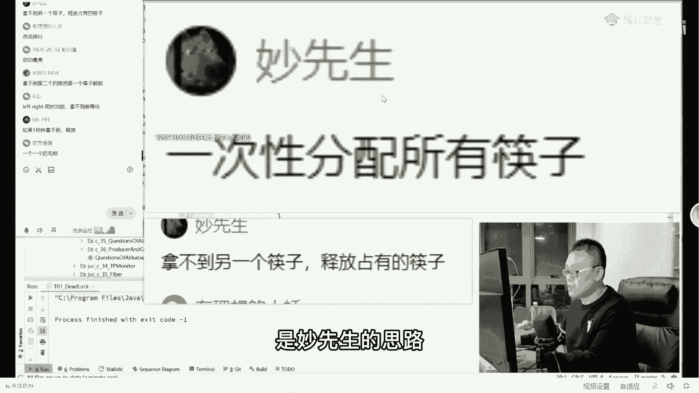

# 【马士兵教育】MCA架构师课程 主讲老师：马士兵 - P33：深入多线程与高并发：1.经典老炮折学家就餐问题，绞尽脑汁 - 马士兵官方号 - BV1mu411r78p

今天呢我们主要分享三个问题，第一个问题呢是关于交替输出的问题，县城的交替输出问题，第二个问题呢是关于哲学家的就餐问题，这个呢是，应届生里面刚毕业的时候最喜欢考的问题，那么第三个问题呢。

我们分享一个来自于阿里的这种分布式的事务问题，好吧，分布式物好，我们一道题一道题慢慢说呃，首先聊点，要不我们首先要简单的吧，先聊应届生的题好不好，这个应届生的问题呢就是著名的哲学家就餐问题。

来听说过这道题的，给老师扣个一，啊我看有同学说concurrent up map说的很对啊，挺不错的，can carry map，对嗯，我觉得大多数人应该听过没没听说过，没听说过的呢，有没有没听说过的。

没听说过，扣个二出来了没有，ok ok哈哈哈，来我们来分享一下，先分享这道题啊，这题是呃历史上著名的经典问题啊，拿哲学家开涮的就是哲学家就餐问题，这个哲学家就餐问题嗯当然你也可以换成别的啊，什么科学家。

程序员就餐问题，反正那种脑筋比较轴的，凡是那种脑筋比较轴的，你都可以放在这儿啊，比方说alex一嗯，alex 2 ex 3等等啊，都都可以好不好，凡是脑筋比较轴的，你全部都可以放在这儿，那是什么意思呢。

这里面有一个呃假设，这个假设是这样来做的，就是五个人围坐在桌子旁边，然后每个人呢想吃中间的，这个菜，但是呢只有拿到两根筷子，同时拿到两根筷子，你才能加这个菜，那总共有几根筷子呢，总共只有五根筷子。

大家看这个筷子和人的排布好不好，看，这个筷子和人的排布就是他左手一根，右手一根，左手一根，右手一根，但是你就会发现呢，这个时候如果想拿到两根筷子的话，就是你左手也得抓住这根筷子，右手也得抓住这根筷子。

你才能抓得住，但是如果说你看啊，如果说你左手这根筷子被人被你被你被这哥们儿，他的右手已经给抓住了，那么你怎么办呢，你就只能等，这是关于锁的问题，这个大家能听懂吗，好那这个时候呢就会发生呃非常好玩的问题。

比如说每个人都优先的先抓住右手边这根筷子，我再说一遍，任何一个人都抓住右手边那个筷子，然后呢再去争取左边那根筷子，但这个时候就非常容易发生著名的问题，就是死锁，这哥们儿抓住右手边的。

这哥们儿先抓住右手边的，他抓住了右手边，他抓住了右手边，他抓住了右手边，好，由于等到两，个筷子才能够吃饭，所以他每个人抓住右手边之后呢，他还需要去争取左手边那个，那他这你这哥们儿拿个拿这哥们来说。

他右手抓住了他左手边那个去抢的时候不行啊，这哥们儿他抓着呢，那就等这哥们儿释放吧，就等这哥们儿释放，那么他什么时候会释放啊，他得吃完饭，他是不是他怎么样才能吃完饭呢，他得拿着左手边这个筷子才能吃上饭。

那左边这个筷子就等着这哥们儿来释放，那这哥们怎么释放啊，他得等着啊，这根筷子，那这哥们儿怎么释放，得等这根这哥们怎么失望得等这，根这哥们儿呢，他得等这个就形成了一个闭环，形成了一个锁。

最后每个人因为不知谦让的这些个哲学家，他们每个人都抓不到同不能重拾，都要两根筷子，最后怎么办，全饿死了啊，这就是著名的哲学家就餐问题，好问题是第一个，首先写程序对它进行模拟，那我想问大家一句。

写程序对它进行模拟，你在脑子里模拟一下，你怎么想，当然你可以设一个数组，五个哲学家设一个数组快字，这个是面向过程的思路，那对于面向对象的兄弟们来说，我觉得你应该能够想到的，优先级这跟优先级没有关系啊。

对于面向对象的思路，我觉得第一个你应该能想到的，当然这就涉及到一点点这种呃设计上的问题了，首先你应该建立各种各样的类和对象，先不要考虑具体算法的问题，所以我说你应该先建立这样的一个类。

这个类呢叫chopstick，叫筷子，这个没问题吧，同学们，首先你要建立一个类叫筷子是吧，那第二个类你应该你应该能想到了吧，叫第二类是什么，第二类当然就是哲学家philoser。

所以在这里呢我就用筷子和哲学家来进行模拟，当然作为每个哲学家来说，每一个人呢就是一个单独的县城，所以我偷个懒，让哲学家本身从县城继承，所以本身它就是个县城，好，我有五根筷子。

那我从零一直到四new出来好，我讲到这里能跟上吗，能跟上给老师扣个一循环链表，怎么还有循环链表啊，这跟循环链表没关系啊，好接下来我们有了筷子之后呢，我们构建这个哲学家，我们给每个哲学家呢给它起个名字。

从p01 直到p4 ，然后呢我们给每每个哲学家呀，给他一个编号好吧，给他一个索引号，从零一直到四，然后每一个哲学家由于要拿到两根筷子，他才能够吃饭，所以在构建哲学家的时候。

指定他可以他需要拿到哪两根儿才能吃饭，cs 0 cs一这时候就会发生交叉了，你看这个cs一第一个哲学家要拿到，那第二个直接也要拿到cs 2呢这个也要拿到下面这个也拿到cs呢，前四筷子，最后一根呢又循环。

回来所以这就形成了一个环，当然我们思考一下啊，就是呃作为一个线程来讲，这只是它的构造构造方法，我只是指定我要拿到哪两根，拿拿到哪两根之后，我才能够开始吃饭，当然我在内部做一个对这两根做一个区分。

一个是我左手边的left，一个是我右手边的right，好讲到这儿，面向对象没有思路的，我觉得你要初步建立起来面向对象的思路，讲到这儿应该能跟上，对不对，讲到这问题不大的，来给老师扣个一，有什么问题的话。

你直接提将面试题呢会比较复杂一些，主要这个每个人呢是参差，不齐水平啊，所以我尽量的从简单往复杂里慢慢地照顾，大家好，我们构建好了之后呢，下面你就想我这个线程怎么运行啊。

线程运行的时候是不是我首先得拿到左边这个筷子，所以我synchronized left，我把左边这个筷子锁定，然后为了能够正确的模拟思索出来，所以呢我在这儿让他睡个一点几个一啊，一秒多钟啊，一两秒钟。

然后再去拿右边那根儿，注意死锁产生的根源就在于你有多把锁，嗯，如果你只有一把锁的话呢，基本上不太会产生思索，那种死锁呢往往是阻塞造成的，它并不是唉我们在这里，我要我我拥有一把锁，等另外一把锁造成的好。

大家注意看，我首先拿左边，等右边所有的人都拿左边，等右边，等到了之后，哎我们说第几号车，哲学家已经吃完好，这是第一个最简单的小程序，我们跑一下，当然你拿大腿想一想，他也一定会锁在这里，所有的人都拿左边。

都等右边，而右边那个又是下一个人的左边，所以他拿不着好了，下面我们就来思考怎么解决这个问题，好这是第一步，模拟模拟思索，这是他第一问，第二问是什么，第二问就是怎么样解决这个问题，来给大家几十秒钟。

你稍微思考思考，你说这帮哲学家们怎么能让他不产生思索呢，好好好好琢磨琢磨，一次性分配所有筷子，有道理啊，我觉得那个这个兄弟呢提了第一个思路啊，看这个妙先生，大家听我说啊，这是很重要的一个思路。

哈哈改成串行。

拿不到另外一个筷子，释放所有筷子，这个肯定不行啊，一个人让一下。

你估具体程序怎么写呀，我看有几个思路啊，一个一个的吃，关键是程序怎么写，你这个官方提醒说的一个一个的吃，是妙先生的思路。

其实就是一次性分配所有快乐。

哈哈，还有这个是什么，我看啊，设置在等最大等待时间考一下啊。

设置最大等待时间到了。

释放锁好，还有吗。

释放left right，同时加锁，拿不到就等待。

好还有吗，错开释放时间，最后一个释放你怎么错开，好啦好啦好啦好啦，大家伙的思路呢呃千奇百怪，我们先说这种特别不靠谱的，首先第一个叫left right，同时加锁，拿不到就等待大哥怎么同时加锁。

好如果你把两根筷子设定成为一个完整对象，那就相当于这两个对象共同拥有同一根筷子，这是1号块，这是2号块，这是3号快，二三是一个对象，一二是一个对象，你想把它当成一把锁，把它当成一把锁，我理解你的意思。

但是你写写看这事儿根本完成不了，没法干，因为我们说的是这个2号，就是大家伙儿，这俩哥们儿还得去抢这个2号，明白吗，最后呢后边还得抢这个3号，后边呢还得抢这个4号，后边还得抢这个1号，所以它依然会成环。

所以这个思路绝对不行，好这块听明白的，给老师，扣个一第一个思路我给他否了，这个肯定是不行的啊，不信你自己写下去，第二个叫设置最大等待时间到了是放缩，我想问你，你设多大，你怎么你你你你怎么做。

你说我射五秒钟，那他五秒钟同时释放，又同时抓住了，你怎么办，凡是用时间来考虑线程同步问题的，基本上全是错的，我给你说个结论以后，你要是别人问你线程同步的一些问题，你跟这考虑时间基本就是错的。

凡是这么考虑，全部对，好这个也是考虑时间，我释放了，我可能做到也非常有可能同时释放又同时开始抓，时间是不行的，拿不到另一根筷子，释放占有的筷子，我拿不到了，怎么释放，我拿的时候我得排队啊。

我排队才能拿到啊，现在我还没有拿到的时候，我怎么释放，我想问你，当你不拥有的时候，你怎么释放，你说，杨幂不是你的女朋友，你怎么跟他分手，我想问问你，王力宏不是你男朋友，你怎么跟他分手。

来这块儿能听明白吗，你拿不到的时候，你释放个屁啊，你都不占有他，什么叫释放，你还轮得到你释放吗，小时候你的房子是什么，把筷子收集起来，排好排队去一次取两只，那个就不叫编号了，这个筷子是有编号的。

你那是随机取两根儿，两回事儿，好妙先生，这个思路是对的，一次分配所有会计就是它的死锁的根源在于我取一根，等另一根，取一根，等另一根，最后形成一个环，干脆呢我把所有拍的12345综合起来，当成一把大锁。

大锁好，第一个哲学家拿到一和二吃完了，释放所有，在第二个再来，第三个再来，这样的话呢我们就不去拥有两个锁，而是拥有一把锁，听懂了吧，这是第一种，但是我想，问大家这种思路有没有问题，有没有问题。

太占用资源了，对啊，你本来只需要锁定两根筷子就可以了，结果1万个哲学家，你你锁了1万根筷子，你效率是不是很低，当然很低好了，所以这些思路全部对啊，好我们说正确思路吧，不然我这个下面的题没法讲了就好。

懒得怼你了，好听我说这个正确的思路非常的简单，只需要有一个人是一个左撇子就可以了，就是在所有的人都去换一下这个思路啊，看这里这思路非常的简单呃，只需要其中的某一个特殊的人，比这哥们儿。

别人都是抓住右手边，抓住右手边，抓住右手边，抓住右手边，抓住右手边，等左手边，他呢他先抓左手边，他去等右手边儿，听懂了吗，这时候你就会看这哥们抓住右手边，由于这哥们儿不抓他的右手，所以这根筷子是空的。

所以他能同时抓住两根，所以他就吃完了，它就解锁了，他解锁了，他也就解了，他解了，他已经解了，他也解了，他也解了，最后呢他也解了，所以只要在中间放一个左撇子就可以了，来这个思路大概能听明白的。

给老师扣个一看，这题怎么写啊，这题怎么写，写起来是很简单啊，就这样写就可以了啊，这样if index等于零，如果他是0号人物，先加左手，synchronized the left，等待右手。

那如果是别的呢，先加右手，等待左手，只要有一个左撇子就可以了，我们跑一下看，10234搞定，哈哈哈，好嘞，但是这个思路你好好琢磨一下他有没有问题，有没有不足之处，琢磨琢磨，问题很大是吧。

对啊其实是有问题的，你琢磨琢磨为什么有问题啊，如果是这样一个思路，这哥们儿只有他是左撇子，其他都是右撇子，那么最后呢是大家伙顺着这个圈整个就解开了，这是没有问题，但是效率不够高，主要是效率问题。

效率不够高，效率不高在哪呢，你想想看，每次只能有一个人在这吃，但实际上呢你想想这哥们儿，我拿这两根筷子跟这哥们儿，我拿这两根筷子，他们两个是不冲突的，他们两个完全可以同时吃，其他人等着就行了。

所以有没有提升效率的办法，有没有唉，很简单了，应该能想到了，对不对，只需要做一件事儿就行了，奇数的是左撇子，奇数是左撇子，偶数是右撇子就行了，好了搞定，知道比较简单的小问题，现在有把握答出来的。

给老师扣个，一来没问题吧，嗯ok好good好，这道题咱们就过了啊，20分钟开开胃呃，下面我们来聊进一步的问题，这个小问题呢就牵扯的知识面就比较多，需要大家伙呃，现成的知识要比较扎实。

这个小问题就是著名的好多人都考过的，也许你遇到过的。

