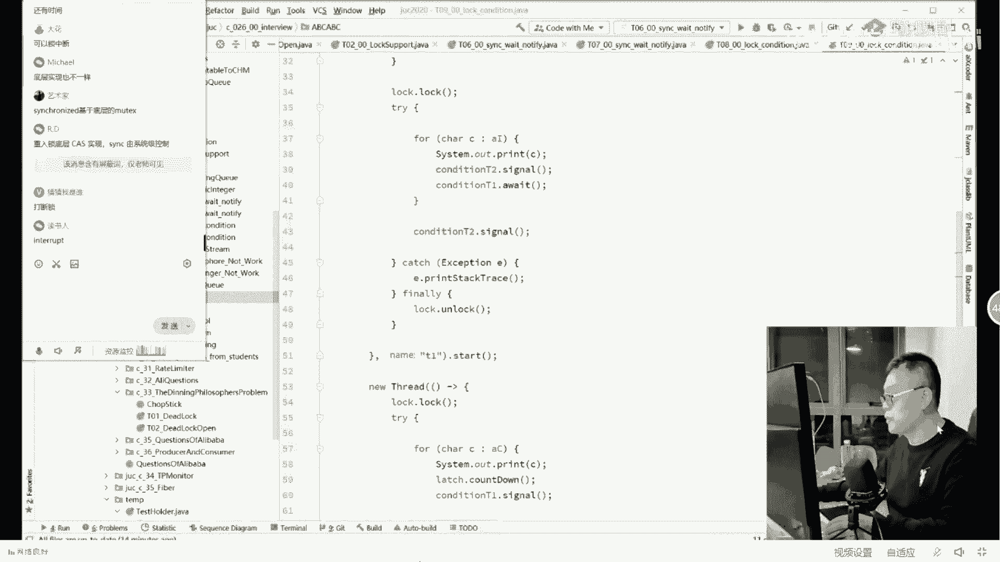
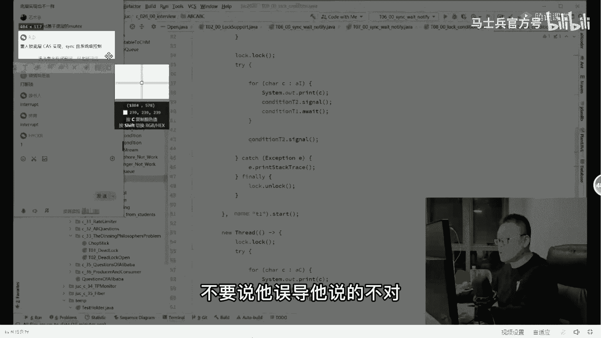
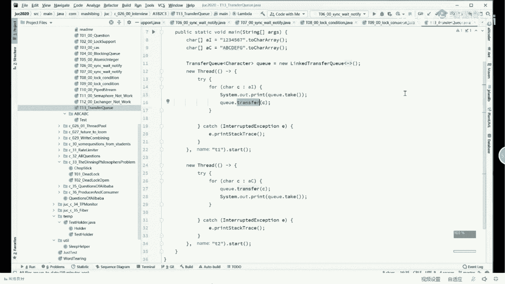

# 【马士兵教育】MCA架构师课程 主讲老师：马士兵 - P34：深入多线程与高并发：2.华为经典的线程交替问题，血流成河 - 马士兵官方号 - BV1mu411r78p

那什么叫交替输出问题呢，看这里现成的交替输出，好看这里啊，这是sorry a t p，看这里这道面试题就是两个线程啊，一个是输出字母的，一个是输出数字的输出字母的输出数字的交替进行输出。

1a2 b3 c4 d一直到26z，具体过程就是这样的，第一个线程先输出a然后b a1 b2 c3 d4 ，必须得是交替的输出，中间不能出现数字的连续，不能出现字母的连续，好吧，增加优先级。

凡是听我说啊，凡是关于线程问题，我直接给你说结论吧，唉呀就是你们回答多线程问题的时候，你记着老师的这个结论给你敲出来，凡是从时间角度，比方说我等多长时间，然后呢另外一个线程去做同步或者是优先级角度。

考虑解题思路的基本全部都，所以以后把这种时间角度，还有优先级角度考虑去解决多线程问题的思路，从你脑子里干脆给扔出去，听懂了吧，ok不错啊，知道这道题，这道题有好多种解法啊，我来给大家呢呃先讲几种啊。

这道题首先说呢大概有120 30种甚至是200多种解法，但是呢我给大家呢讲那么比较典型的几种，好不好，好听我说，那么第一种解法呢就是最经典的叫lock support，这个是最经典最经典的。

非常非常的简单，大家看这里，这是第一个线程t1 thread t一等空，第二等空，然后呢我们构建两个数组用来做输出，当然我在这儿呢就不构建到26个字母了，太多了。

就1234567a b c d e f g就可以了，这两个数组，然后我第一个线程，开始做输出，第二个线程开始做输出，那那么怎么让他们进行交替呢，怎么让他们进行互相之间的通知呢，看这里这样来做。

第一个线程chac ai先打印，第一个线程打印完成之后呢，叫醒t2 ，把第二个线程叫醒，说该你了，接下来第一个线程去阻塞，也就是去睡去，不能不能就睡觉去阻塞，让自己休息，这是第一个县城。

那第二线程干嘛呢，第二个线程是先阻塞，先让自己休息，等着对方叫醒，醒了之后再打印，打印完叫醒t一非常简单，但有同学可能听不太懂啊，听不太懂的，你可能是没用过log ort，这个没有关系，看这里就行了。

为了让大家看清楚，为大家做了一个小小的动画，这是第一个线程，打印1234567，第二线，程的a b c d e f g他是这样的，思路是这样的，首先第二线程上来先park park，意思是什么呢。

让自己先休息，注意任何线程休息了之后，别人只能等着别人叫醒他，他自己是叫不醒自己的，这个是现成的呃，同步的最基本的思路啊，就是所有讲关于线程的问题，从操作系统最底层的角度讲，全是这样的一个线程。

如果去阻塞了，记住必须等别人把他叫醒，没有人说自己把自己叫醒了，你们能在睡梦中把自己叫醒吗，不可能啊，就说你已经是阻塞状态了，就得等着别人叫醒，所以上来先阻塞，等谁啊，等着第一个线程叫醒它。

那第一个线程下来先干嘛呢，他先打印print 1，先把一打印出来，打印出来一之后呢，注意把第二个线程叫醒，唤醒它，然后自己去阻塞，也就自己去休息，当然休息也得等着t2 把它叫醒。

t2 什么时候把他叫醒了，这时候t t2 已经醒了，醒了之后呢，打印a然后再叫醒第一个再去休息，看懂这个过程了吧，来明白这个过程的，给老师扣一是不是很简单，这是最简单最简单的实现。

当然这里面有一些小小的问题，不知道大家是不是考虑到了，你好好思考这个问题，首先第一个问题是说这两句话能不能换，我能不能先去阻塞，然后再叫醒t2 可以不可以可以，哈哈哈哈，这是绝对不可以的，大哥你就记住。

凡是叫叫完这句话之后，这个县城就在这停了，就得等着别人把他叫醒了之后，那我问你，你在这停住了之后，你还能去叫醒t2 吧，你永远叫不醒了，所以这个事儿啊就变成了我先把自己给打死，然后再去打死敌人。

这事儿是不可能发生的啊，所以一定注意这个顺序，这是第一个，那第二个呢还有一种可能性，我不知道大家有没有思考过，比如说我们按照时间顺序来讲，理想情况下t2 是先park，这是没有问题的，先休息。

可是假如t2 还没，来得及休息的时候，t一打印了，完了之后诶，叫醒t2 ，这件事已经去做，已经已经执行完了，而且自己去阻塞了，去休息了，这个时候t2 才开始运行来，同学们。

你们告诉我这个时候p2 能够做执行吗，这时候行不行，有没有可能说俩俩人俩人都都死在那儿，输出不了了，有没有可能有可能吗，哈哈，好凡是认为有可能的说明你不了解park和rpk他的底层的原理，大家听我说。

一般的一般的情况下，按照以前的我们所说的weight，等待线程去阻塞了，然后他得先wait再去notify，他绝对不可能说先去notify，这件事是不可能发生的，这哥俩一定是有先后顺序的。

一定是先weight才notify，但是park和on park是不一样的，你完全可以先on park再去park，那有同学会说了。

如果说unpack和pk他们在执行的时候先执行了on park会是什么情况呢，他这个事比较好玩，他跟那个weight notify不太一样，on park呢只是在这个县城的内部做了个标记，原来。

这个标题是零，现在呢我把这个零改成一，然后后面在pk的时候检查一下，说这个数值是一的话，我就不挂了，我就继续往下运行了，然后呢我把它变成零，也就是说它只是内部的一个标记的意思，听听懂了吗，同学们。

如果这个不行的话，你不能这个还认为他有可能是两个都休息的话，那说明你没有理解on park和park的含义，帕克on pk最好用的，只不过这个pak on pak是jdk比较新的版本之后才增加的。

因此这道题比较经典，很老的题，他在那个时候考的并不是这个啊，下面我们讲一点关经典方面的，啊就是原来非常经典的这种解法，好不好，好，原来非常经典的解法长什么样呢，其实他长这个样。

他最开始就是wait notify，呃，这是最经典的解法，这道题原来叫填空题啊，它是让你填这个地方填东ty法，还是填weight好，我们来琢磨一下这件事怎么来完成，这是第一个线程。

我第一个线程呢搞定一把锁好，我讲到这儿了，大家注意相当于什么呢，相当于这样来写的，依然呢我们看这个动画好吧，这是自旋锁，我们让过自旋锁啊。

我们看这个比较经典的synchronized the way note版，大家看这里就说这俩这哥俩呢一定是要看同一个信号的，你不能看两个信号，看同一个信号，同一个信号是什么意思呀，我第一个线程抬头一看。

这个信号轮到我了，我来打印这个信号，如果给定的是轮到对方了，对方去打印，我打印一个更新一下信号，告诉对方，对方打印一个更新一下信号，告诉我好，那这个怎么做呢，就是你把中间的这个信号当成一把锁来运用。

首先优先运用这把锁，把它当成一把锁，拥有这把锁，我再打印，打印完了之后，释放这把锁，释放给对方就可以了，这就是一个茅坑，这边有七个男生，这边有七个王力宏，好嘞，这样的话呢就是这七个男生美人儿进去释放锁。

然后轮到王力宏进去好吧，大概就是这么一个意思，接下来具体是这样的，持有这把锁打印，然后叫醒对方，注意，这个时候一定要要让这边去休息，叫醒他，叫醒完之后呢，自己去休息，wait，然后这边几人已经醒了。

怎么办，打印叫醒对方，自己去休息，这样来交替执行，来这块能看懂的，给老师扣个一没问，题吧，那具体的程序怎么写呢，程序写法当然就是这么写了，首先我持有这把锁的时候，我去打印，打印完只要打印一个字符出来。

我写notify，就是叫醒对方，wait，让出所自己去休息好，还是那句话，这个地方一定要注意顺序，先叫醒再休息，因为你要是写反了程序就死在这了，两个都去休息了，全睡着了，哨兵没有了，好，按理来说呀。

这个题啊写到这儿就已经完成了，这个县城也是我打印，先叫醒再休息，完事儿了，就这么简单，但是呢当你运行这个程序的时候，我们来瞅一眼，他没问题啊，打印出来没有问题，但现在问题是你看见了没有。

这个程序没有停止琢磨琢磨为什么，琢磨琢磨为什么，对你想嘛，a叫醒休息，b叫醒休息，a叫醒休息，b叫醒休息，到最后的时候，无论如何，总有a或b一方自己去休息了，然后与此同时，另外一方已经执行完了。

他也没有叫醒对方，所以怎么办，在整个打印完成之后，务必要加一个叫notify，务必要加一个叫notify，如果我先结束了，叫醒对方，如果对方先结束了呢，叫醒我跑一下。

看这样的话顺利结束好讲到这里能听懂这个写法的，给老师扣个一，没问题吧，但现在有一个很棘手的问题，咳咳什么问题呢，你们琢磨一下啊，现在我要求的是先输出一，但是如果咱们这种写法的话，有没有可能先输出a。

第二个先执行了，是不是就先输出a了，第一个先执行的话，是不是就先输出一了，对吧，现在老师先输出一啊，当然你执行好多遍，有可能先输出的是a，实际上它是有可能先输出a的。

那我怎么样才能保证它先输出的一定是一，而不是a怎么办，好好好我我我因为同学们的这个基础稍弱，我来看看同学们的一些小问题，首先和平号的问题是说notify是睡眠的意思，怎么会结束呢，我不理解。

来你查一下notify啥意思，大哥weight是休息，sleep是睡眠，notify是叫醒，二进来就加个weight，大哥，如果二进来加个weight，二进来先wait，同学们。

你们琢磨琢磨琢磨这个小小小小小图标，说的啊，二进来先wait，可不可以上来先wait，最后那个note粉什么意思，我不解释过了吗，如果你最后那个不写的话，程序不能正常结束呀，join大哥。

所有的同学记住了，我应该再加一下，关于线程的问题，凡是线程同步的面试题，凡是从时间角度或者优先级就考了，基本全部对，凡是从john考虑的，99。99%的不对，除非人家考证。

你先弄明白john是什么意思再说好不好，先暂停，先去wait，上来先wait，那我问你，你先让哪个weight呢，先让这个weight啊，其实也可以，但是你先得上锁呀，上来你先上锁，锁定之后wait。

然后这个线程上来先去notify一下是吧，然后再wait啊，理论是能达到的，确实可以可以写写看啊，你们自己下去写写看，当然还有一种玩法呢，就是使用condoleo呃，顺带讲给大家听。

也认识一下con lash就行了，另外一种玩法是门栓，比方说这个线程我想让他上来，先wait怎么办，try let there await，先让他门栓把自己给拴住，而另外一个县城呢。

我打印完第一个字母之后，let the coundown，把这个门出给放下来好吧，这个，也可以，关于门栓需要我解释一下吗，挺挺简单的一个同步同步锁，同步工具，它就是个相当于这个门上面上了一个拴。

所有的县城走在这儿是过不去的，因为门上面插着门栓呢，怎么样才能过去呢，另外一个县城把这个门栓给他放下来，这个县城就过去了，听明白了吧，嗯clibarrier celebra，跟你杀鸡用牛刀。

你用什么cliberry啊，哦俗人说主线程休眠一秒二启动，合着我刚才跟大家伙敲了半天字，你你你就是没往耳朵里灌，你还是咱们vip呢，大哥怎么听课呢，来给我读一遍下去，给我默写300遍。

凡是关于现成的面试题，如果建成同步的面试题，凡是从时间角度或者优先级角度或者join考虑全不对，大哥听懂了吗，那你等这一秒你不浪费吗，我程序本来两个毫秒就执行完的事情，想啥呢，好了，当然，看这里。

关于这个wait notif呃，它是有一些小问题的，wait notify的问题在于哪呢，你认真听，这是那把锁，然后这个weight到底是什么意思，你你一定要理解啊，这个weight到底什么意思。

那weight的意思就是，进入这把锁所关联的那个等待队列，也就是说它有一个排队的地儿，我上厕所过来了，厕所里面有人怎么办，我到旁边一个排队的地儿去排队排排坐吃果果，等什么时候轮到我了，我再去上厕所。

所以这把锁附带的有一个等待队列，但是呢这个等待队列呢是所有的关于这把锁的线程都可以让自己进去，不管他是进来大号小号或者是王力宏等等等等，其他的各种操作骚操作你都可以进去，那举个最简单的例子。

我想叫醒某某些，叫醒某些特定人群，我怎么办，我没办法，我做不到，再举个简，单例子生产者著名的生产者消费者问题，这个呢是那个容器一堆的生产者往里头生产东西，一堆的消费者呢从里边往外拿东西。

然后必须对锁进行同步，因为你生产满了之后，你的生产者都得去进行休息，等待进入队列，等待消费者呢消费者消费空了都得进入队列等待，那我生产者生产满了，我想叫醒特定的那些个消费者，县城里边那些生产者。

我不想叫醒啊，先叫醒小号呢，大号的不叫醒能不能做到，可以吗，好我告诉你，notify这事儿做不到，notify的意思是说让线程调度器去选一个线程出来，他选谁，这事你管不着。

能不能理解别人说我这个如果说t一和t2 全进去了，t3 想叫醒其中的某一个是叫不醒的，它只能是随，不能说是随机的啊，就是按照特定算法去叫醒其中的一个，但是它叫醒哪个你控制不了，当然除了notic之外。

还有另外一种叫notify哦，这个方法那地方or是什么意思呢，novo的意思是说叫醒等待队列里面的所有县城，你们出来之后呢，去去抢那把锁，谁抢着算谁的。

但是你想想看有没有叫他会不会叫醒那些我不想叫醒的呀，当然有可能啊，这这是生产者，这是生产者，这是消费者，这是生产者，我能说哦，所有的人全全叫醒了，我不想叫醒生产者，只想邀请其中的某一部分能不能做到呢。

我告诉你，notify和notifall这件事是做不到的，这是一种传传统的关于所控制的，它的呃欠缺的地方，所以java里面ju c里面提供了新的锁控制这个锁能，是替代原来的老锁的。

替代那个synchronized那把锁的这把锁呢叫lock，最常用的替代synchronize里巴索的，它的全名叫reenterlock，叫可重入锁，那可重入锁里面有一个非常经典的用法。

就是condition，lock，condition，好呃，你可能搞不明白这个condition到底是什么意思，大家听我说这个condition的意思就是队列，某种条件它叫做某种条件下叫醒某些人。

他就是个队列，好，我来解释这个程序，大家看这里，这是这把锁，然后呢我有一个condition t，一有一个condition t，二，大家听我说，凡是有两个condition，意味着你有两个队列。

这是第一个队列，这是第二个队列，这个时候我在让当前线程去进入等待队列的时候，我可以选，我可以挑，我是进入这边这个队列呢，还是进入这边这个队列，听懂了吧，就一个澡堂子，大家伙都脱光光，在里边去洗澡。

你是男人，你当然要进入男人队列，你是女人，进入女人队列，我们假设规定我们轮着洗，男的女的男的一个女的一个，那我男的洗完了之后，我叫醒谁呢，我不会叫醒，notify old的。

我会叫醒对方队列的那个那个那个里面来这块能听明白的，给老师扣个一，大家都用手机在看吗，看不看不清，所以大家注意看啊，就是说如果我们想精确地控制，我们有两个队列，那么在这个队列里面呢，来反正手机看不清的。

我稍微给你放大一点，这回应该能看清了吧，听我说我打印完成之后，注意叫醒第二个队列里面的，我自己去第一个队列休息，哈哈这样我就能精确地控制我去哪个队列休息，我叫醒哪个队列的人好，当我讲到这里的时候。

我觉着另外的一道题你可以考虑怎么去做了，这道题也是一个经典的问题，这道题是abc循环十遍，输出三个线程，第一个线程只输出a，第二个线程只输出b，第三个线程只输出c每人十次，但是必须是交替的。

a b c a b c a b c a b c好了，同学们，琢磨一下，给大家几十秒钟，michael说三个对联说的很对啊，用三个condition说的太对了没错，三个condition轻松搞定。

大家听见了吧，这个你们自己去做吧，好不好，这个关于a b c的问题你们自己去做，我在这就不给你们看看程序了啊，那好呃，我我讲完了这个比较经典的，然后讲完了比较比较比较比较这个这个稍微的新潮一点点的好。

大家听我说啊，呃有一个经典的面试题，他是这么说的，他问他说synchronized和reentrant lock，reentrance log，它们的区别是什么区别。

来同学们今天讲这个vip的课程都会讲到吗，这不废话吗，一定会讲到，好好听，我说琢磨一下区别是什么，这是经典问题啊，讲点男的，为什么不能讲点女的，首先第一点retry logo，我给大家简单讲讲啊。

retrilogo可以多个队列，我已经说过了吧，然后schnet只有一个队列，ok reaction log可以做公平锁，听懂了吧，synchronized，只有非公平，没有公平可言。

ok reentry log，还可以干嘛呢，try lock尝试上锁，上不了锁去干别的，就像刚才你说的，try去踹那个筷子，try不了的话，做出一定的考虑，做出一定的处理，try lock。

但是synchront只能上来就死，等傻傻等待，等不到就死在那，底层实现全是一样的，不要跟我聊不一样啊，聊不一样的，你是不了解底层，try lo，那么第四个区别呢，刚才猜猜我是谁，说的很对。

锁可以被打断，可以被就是我在锁的过程之中，我可以让别人打断，我打折我的腿，我就醒了，这个叫look interrupt，他可以做这种这个操作，就是reentry log，但是simple net可以吗。

不可以，等着你打不断他，你不能把它打断，除非你把整个县城给他q掉，interrupt，yes，你是打断不了的，这是think和，咱们的reaction的区别。

呃至于bd说的这个不要说他误导他说的不对。

bd说的这个事是不对的啊，bd你好好去那个研究底层去重入锁底层cs实现，其实不是think，由系统及控制，首先think也是由它其中的某一个所升级过程也是cs实现的，所以本质上他们两个没有太多区别。

重锁的底层的cs实现最终依然是硬件级别lock指令实现的，汇编源的lock指令实现的，think也是啊，没有区别，它们最终到底的时候实际上都是没区别，michael说是unsafe还是不对，算了。

你们如果对于所非常底层的问题有需求，月底来我关于锁的专门的训练营，今天咱们讲的主要还是形容同步的问题啊，这个就没有办法给大家再往深里挖了，好了，我们就讲到这儿嗯。

在这儿呢我也给大家讲一点那个好玩点好玩点的吧，因为这里面呢还是有好多好多处理方式的，用pipe dream，用blocking cue，用c a s，用atomic integer，这些都可以去实现。

但是我在这儿呢教大家使用一个特别好玩的队列，用队列去实现，用同步队列，那同步队列怎么去实现呢，同步队列里面呢有好多好多的队列，我今天讲一个比较好玩的队列，这个队列呢叫做transfer q，好听。

我说transfer q最大特点是它的容量，为零，有同学说了啊，容量为零还能叫队列呢，没错是的，完全可以，这个transfq它是用来交换的场所，它不能够把一个东西存在里面。

但这transfer cure是怎么做的呢，transfer cure就是类似于我们我不知道等会有没有看过电视，电视在北方内蒙古那边，然后去那个老老的那个年代，我们去买卖牲口，说咱哥俩呢。

我认为我这牲口1000块钱，你觉得我要还个价800块钱，那怎么还价啊，拿一个套筒，你的手伸进去，你的手也伸进去，两人的手在里面跟这儿不知道白吃啥，具体什么什么手语我也不太清楚，就是总而言之，我递给你。

你接收了好了，这个套筒的作用就结束了，我们的transq类似于这个套筒，好吧，好看这里这是什么意思呢，这么来做呃，我们来做一个transfer，q等于你有一个link transfq。

然后呢在这transer q里面呢，system。out，q。take，我take从里边拿一个字符出来，我就把它打印出来，然后呢q。transfer，我再往里头第一个字符进去。

而另外一个线程呢是先递一个字符，再去拿一个打印出来，注意这两个方法，take和transfer它都是阻塞的，这是什么意思，就是说如果我take不到我的程序是不会往下继续执行的。

如果我transfer过去了，但是没有人从我手里拿走，我的程序也不会继续往下执行，所以它就类似于是这样的一个交，换场所，我第二个线程必须得把这个c拿出来打印出来，否则我第一个线程不会继续往下执行。

我第二个线程也不会继续往下执行，必须拿到，必须送出去，也就是说这两个线程必须得成对，生产者往里扔一个，一定得必须被消费掉，我的生产者才会继续，不然的话我就不继续，我就在这傻等着好。

这个东西呢被我们称之为叫transfer kill，可以想象，我把这个一递给你，你帮我打印出来，这边是我再把这个a d给你，你帮我打印出来，所以他们两个巧妙的做了个，交换你打印我的，我打印你的。

好这个挺明白的。

