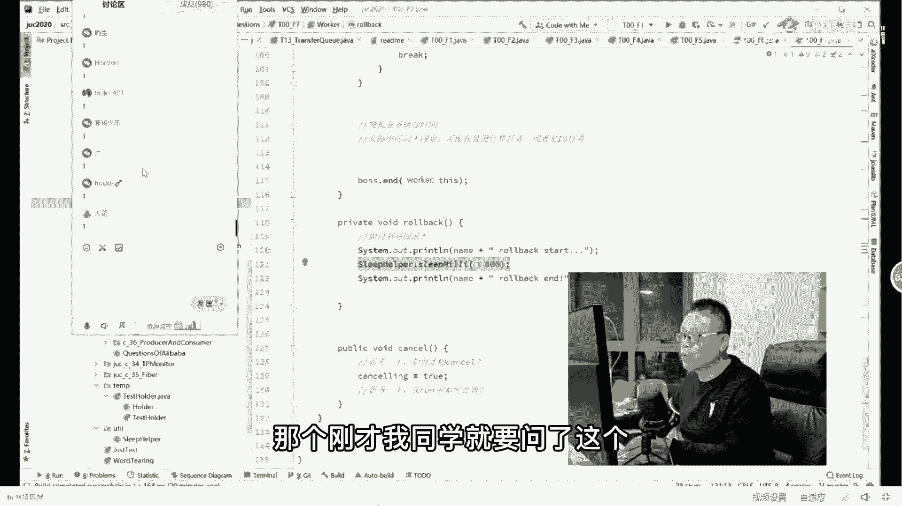
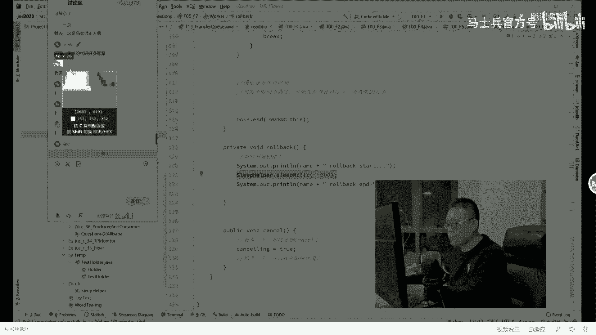
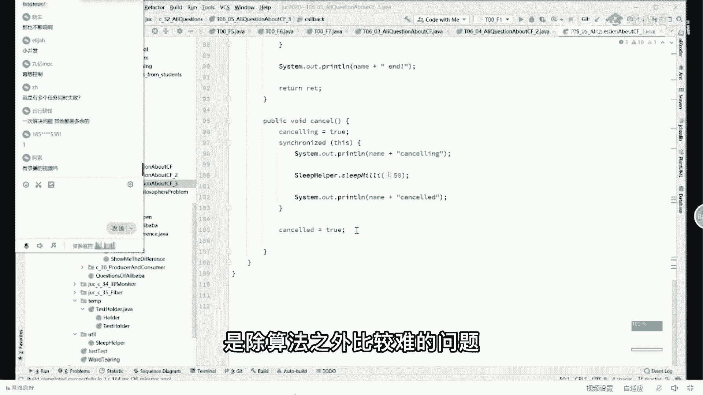

# 【马士兵教育】MCA架构师课程 主讲老师：马士兵 - P35：深入多线程与高并发：3.异步线程事务咋回滚问题，尸横遍野 - 马士兵官方号 - BV1mu411r78p

我们来看另外一个小问题，这个小问题是相对比较难的，多数人是写不出来的，巴黎的问题，他是让你现场写一个解决这样一个问题，什么问题呢，就是我有一个很大的任务，这个任务啊可以分成。

a b c3 个步骤同时进行，就是a b c3 个步骤同时进行，你就拿大腿想一想，多线程嘛，在同时进行的情况下呢，如果有一个任务被取消掉了，或者遇到错误了，然后所有的都应该结束，要求高效完成。

它的要求主要是高效好吧，如果说你说所有的那个那个，但凡是遇到错误了，等着别人全完成了之后再完再结束，那是不对的，所以这是一个严格来讲呢，它是一个分布式事物的问题，就说有一个事物，有一个事物。

这个这一段放到a级上去执行，这段放到b这段放到c，其中有一个是半截单的子事务没有完成，那整个事务取消掉好了，这个是事物的问题，举个通俗通俗一点的例子，我们现在要吃火锅，我有试过有好多步骤。

第一我要去用锅做开水，第二我要准备洗菜买菜，第三我要去请王力宏，第四呢我要去请徐若瑄，好，有一个人去锅烧水了，有一个人去买菜了，有一个人去请王力宏了，有一个人去请徐若瑄了。

ok然后其中去请徐若瑄的这个人，很快就到他那了，然后说徐若瑄已经出去了，已经被pg one约走了，所以这时候怎么办，整个任务全取消，即便是你还在飞机上去找找王力宏的，飞机上来取消，你在烧水取消停掉好了。

这个意思啊，来提听题目，听懂的，扣个一没有问题吧，嗯，怀孕，你是一个非常坏心的人，好当你听懂了这件事情之后啊，我们来考考虑考虑这个题怎么写，现在你脑子里过一过这个题目应该怎么写，多线程是没问题的。

对不对，监听某个标记，监听哪个标记啊，什么叫监听某个标记啊，这个考点在哪儿，就让你写出来，考点就是让你写出来，你写吗，你怎么写吗，好看这里我最简单最简单，一步一步带大家写，大家大家往这看。

the cyclic barrier，搞不定的，compleable future可以搞定，cyclic barrier搞不定的啊，你不信你去试就行了，好往这儿看呃，假设我们有三个任务。

t1 t2 t3 ，然后呢我们假设这是每一个任务，它的正常执行完结束之后，他应该是三秒钟，四秒钟，当然，为了模拟这个任务，我假设t1 t2 ，这两个任务都能正常执行完，所以他后面传这个。

true的意思是说让它正常执行完，那么传force的意思是说，让它执行到一秒的时候报个错，这样我们来演示整个回滚的过程好吧，然后t1 t2 t3 start，当然对于我的任务来说，name它的名字。

具体执行的时间，执行成功还是没成功好，这里是模拟整个的业务执行时间，实际时间是不固定的，他的时间可以是在计算任务，或者是计算io或者等待i o，但是实际时间是不固定的，我们是模拟嘛。

所以我给它一个固定时间，三秒四秒，一秒三秒四秒的成功执行完一秒的，到一秒之后就结束了，来这块能听明白的给老师扣一，所以我这个第一个最简单的写法啊，就是这样子的，第一个任务执行三秒，第二个任务执行四秒。

第三个任务执行一秒，但是他执行执行失败了，t1 t2 ，t3 结束，我们跑一下，看扫你首先第三秒钟之后t3 结束，然后t一结束，然后t2 结束，好呃当然同学们你们琢磨看一下，如果程序写成这个样子。

阿里肯定是不会让我进去的，对不对，为什么，因为你我不知道大家会发现没有，这个你的程序的正常的结束啊，取决于你最长的这个时间段，比方说我这里要填十秒，我们整个程序啊要想结束t2 这块。

就得等他十秒才能结束，你不信，你就等着，但是按照我们题目的要求，为什么，你说是不是，所以一秒就该结束，那怎么办，来同学们告诉我一下，想想怎么办，这没有打断其他县城sleep helper。

没有见过这个类，没事，这个类是我自己写的，你就认为他是个sleep就行了啊，就是每次你写sleep不得写try catch吗，就这个意思啊，不要纠结这玩意儿，所以我们第二个呢得是让它正常的结束，对不对。

那我正常结束的话，你们琢磨一下，我是不是得由t3 来通知大家，说我已经废了，现在我要通知各位，你们呢要需要结束掉，是这个意思吧，好，所以在这儿呢，我们给每一个任务，给他指定一个执行的结果，大家注意看。

我们看第二个版本的玩法，就是我是给大家分成一个一个版本写，如果不给你分版本，我告诉你，你很可能一次性的写不到最后那个版本，好吧好，既然是这样的话，我就需要有某一个东西来告诉我，这个县城是正常成功了。

还是没，成功它的状态还是说还没结束呢，所以我在这儿做了一个enumeration啊，做了一个枚举类型，这个枚举类型主要指代的是每一个线程，它的状态它一共有三个状态，第一个状态是not end。

也就是说现在正在运行之中，第二个状态呢是success，正常运行结束，第三个状态是failed，运行失败了，我为什么要做这件事情，因为我需要知道这个县城他执行失败了，我需要知道他的状态，如果执行失败了。

通知所有的线程结束，那我怎么做呢，我这样来做，首先我把所有的线程全装到一个list里面，然后让所有的线程启动，启动完成之后呢，我就启动一个监视程序，for循环，一直不停的监测它。

如果有某一个线程get result，它的result是failed了，整个县城失败，整个程序结束，system exit，零来，这块儿能看明白的，给老师扣个一，我觉得这是很多小白的玩法。

但是我想告诉你的是，这个玩法是绝对不能够被允许的，为什么想想为什么可见性，这跟可见性没有半毛钱关系，首先这是一个盲等待，就这个意思，盲等待，什么叫盲能耐呀，就是他自己一直在这不停的循环，不停的循环。

那不停的循环就代表着什么呢，我不停的消耗cpu，我有事没事就跟着消耗cpu，这是效率上的降低，这是肯定是不被允许的是吧，第二一个，你看这个这部分的处理，这部分system exit，零大哥。

这什么意思啊，粗暴地干掉一切线程，有一个人去找徐若瑄了，一，秒钟之后失败了，找王力宏，那哥们还在飞机上，把飞机给我打下来干掉，这边正烧火呢，把锅给我踢飞，完全有可能是不一致的状态，我打开了半截文件。

你直接就退出了，这个文件还没有close，我建立了一个连接，对方还得等着我说话，我还没说呢，直接连个拜拜都没说就close了，这能能不能被允许啊，绝对不行，所以这里面牵扯到两个问题。

第一个不要进行盲等待，不要进行监视，这件事情只有没有办法的时候，才要进行监视，第二个优雅的退出来，这块能听懂的，给老师扣个一，好嘞，那我们怎么怎么处理这个问题呢，这个问题怎么处理呢。

我们来看第三章的写法好吧，今天来的今天来没白来吧，有收获吧，应该最起码认识了好多新的累是吧，另外呢考虑问题的时候呢，也需要考虑的比较呃，到位和全面和精确啊，好我们来看下面这个玩法，这个玩法主要怎么做呢。

大家看这里，首先我们解决盲等待的问题，这次呢我们不要进行盲等，待，我们进行通知，既然你这个县城是非正常结束，那就让你这个线由你这个县城来通知，其他的线程听懂了吧，所以我们这么来做。

嗯每一个线程在运行的时候，加一个最终的处理方法叫boss。end，boss。end的意思是说我这个线程正常，我这个线程结束了，对其他人作出处理，听明白了吧，boss。end这个boss又是谁呢。

boss就是我们的最大那个管理员等于new boss，我们每一个worker都拥有一个boss的引用，我这边结束了，我这边结束了，我这边结束了，然后boss。end的时候怎么怎么去结束。

如果某一个线程结束了，线程结束之后呢，我在end里面的处理方法就是说，如果他failed了，那我准备退出，这样就解决了盲等待的问题，你看他有没有进行盲等待，没有我们处理，我们仔细考虑一下这个模型。

原来是这仨哥们儿去干事儿了，去监视这仨，知道吧，转圈转圈转圈转圈儿，现在不是这样了，现在的处理方式是，这哥们儿在这睡觉，等着大哥，你在这儿等着吧，不着急，如果中间有任何一个结束了。

不管是正常结束还是非正常结束，正常结束非正常结束，都会告诉这哥们儿一声，说哥们儿，我我完成了报告，我已经完成，我要检查一下你的后果，你最终的结果是执行成功了还是失败了，如果你失败了，我需要让别人也停止。

如果你成功了，我不做任何操作，来这个模型，大家听明白了，等于老师扣一，是吧嗯嗯，那我再问你一个问题啊，其实我中间呃给大家忽略了一个步骤，但是我觉得这个步骤，你应该是能够想得到的。

比如说我我我我可不可不可不可以，什么意思呢，我这个第一个县城要是真正要失败了，我就通知第二个，然后就自己再通知第三个，可以不可以，我的同学里头，可以吗，琢磨一下，给大家十秒钟，我去拿瓶水了，就在这。

可以吗，当然也可以，但是我想问你，它的区别点在哪，责任链，这跟责任链有什么关系啊，效率不不不，这跟效率也没有关系，因为无论如何，你都要通知其他人的，对在于可扩展，同学们，你们好好考虑一下。

这里有一大堆的县城，然后我这个县城要是非正常结束，我得通知所有其他人，然后假如说我又添加了一个任务，我得改我这个代码你能听懂吗，我这个代码我得进行修改，我得加上对这个人的处理。

然后其他的以前所有的线程都得加上，对这哥们儿的处理，所以我当我添加新的功能点的时候，我这个设计就是有问题的，不好扩展，这叫做没有scalability，没有弹性，你这个设计，那同学们换。

然后我只需要跟他打交道，告诉他就可以了，我想扩展的时候就只要改改这个代码，有必要的话改一下这个代码就ok，其他的任何一个不用改，来这块听明白的老师口音，当然这里面有好多好多种设计模式了。

这叫什么什么什么设计模式啊，我们可以把它称之为叫observer，那我原来是一个乱哄哄，互相之间都有处理的状态，这这这叫什么模式，调停者是吧，好我在这儿就就就不在这展开了啊，门面是对外的。

meditor，这是对内的啊，好了，真正设计模式的话呢，我还是要建议你听听我设计模式的课呃，关于设计模式，这部分老师我也是花了大力气的，23种设计模式，外带mvc是吧，全部的这里面比较比较难的。

比较麻烦的是代理，代理的话，我写了十个版本，有十个版本，你才真真正正的理解了，到底什么样叫动态代理啊，好嘞就到这儿，我们讲到这儿呢，大概解决了这种盲等待的问题，但是我们还需要解决一个问题。

就是我们要让我们的县城应该正常结束，各位大哥不能够说，二话不说，system exit 0，直接砍断，砍断腿的这种接触方式，这是不行的，那这时候怎么办，优雅的推出对大家记住，我讲到这儿啊。

再给大家告诉大家一个多线程题的原则，现成优雅的结束一般不用，interrupt，当然肯定不能用，stop，肯定不能用，kill是吧，reserve，resume这些东西都是不能用的，因为本身它是有毛病。

这两个是已经废了，而interrupt一般不用这个呢，我说它是一般，它并不是说呃不能用，一般不用，但是我们现在这个面试题不用就不行，原因是什么呢，原因是你你你要想稍微优雅一点，你可以用它。

当然有更优雅的解决方式啊，所有的兄弟们，大家听我说，县城要想优雅的结束，应该都是正常退出，interrupt可以用，但是你听他的名字嘛叫打断呃，当然你可以用这个名字来做正常的处理啊，但一般不用它。

尽量做正常退出，只有正常退出，解决不了的时候，考虑用它，好大家看这个看这个小程序，下面我要解释退出的问题，那怎么退出呢，好我们依然是在and这里，同学们，你们要注意一点，就是当我的某一个县城要是结束了。

我并不是说把其他县城的腿打断，而是要让他取消cancel，各位同学，我想问你，cancel这个操作它是长什么样呢，取消吗，长什么样，注意每种不同的任务，不同任务不同的cancel方法，这点大家能理解吧。

坐飞机去找王力宏的，你应该坐飞机回来，烧水的，应该把水再给我晾凉，洗菜的应该把菜再给我收好，所以每一种任务它是有不同的cancel方式的，跑步去的，再跑回来，我往数据库里插了五条记录。

如果我收到了cancel操作应该怎么做，应该做的是把那五条记录再删掉，所以每种cancel每种都不一样，那如果你写一个通用框架的话，你能够把这个cancel给写死吗，肯定不可以。

所以每一个worker有他自己的cancel方式，我这样讲大家能听懂吗，所以每个worker里面除了正常的run，它还有一种方式叫cancel，比方说我拷文件呢，不知道大家有没有遇到过a盘。

c盘拷到d盘一个大文件，考到一半的时候，整个的考呢进度条走到这儿了，我点cancel，他怎么办，他是不是得把d盘，已经考到的数据给它废掉，是不是啊，同学们，好了，所以每个线程都得写好自己的cancel。

那现在问题是自己的cancel怎么写呢，留一个接口是吧，好看，这里我们来简单聊一聊这个cancel怎么写，这个cancel的处理相对来说比较复杂，因为cancel本身，cancel本身啊。

它中间也是不能出错的，不能出错，比方说你往数据库里插了五条记录，12345，然后呢，你在删这五条记录的时候，同学们，你们好好考虑一下，你删除这五条记录的时候，你只删了三条，还有两条没有删完。

你这个程序报错了，exception，那你咋办，能不能理解，所以这个cancel没有那么好写，所以我在这里是这样来做的，我说canceling等于true，让我cancel的时候。

我就canceling等于true，就设一个标志位，我设好这个标志位之后呢，具体怎么处理呢，每种程序有每种程序不同的处理方式，那怎么处理呢，往后看，这个时候我在run方法里面，我就得这样来处理了。

我在这儿假设的是一个io密集型的任务，嗯就是我这个任务啊时间非常的长，那假如说啊你听我说我这任务时间非常长，嗯假如说我就是拿考文件来说来说这事儿，同学们，你们我不知道你们有没有见过这样的程序。

就是拷贝一个文件，它时间处理得非常的长，然后在处理的过程中，你点这个cancel，你点半天呢，它没反应，有没有遇到过，原因是什么，原因是处理文件的这个现场是后台的，然后你前面的ui线程你点完了之后。

它需要通知这个线程去处理，但是如果说这个线程啊，它中间呢就是在干嘛呢，就是二话不说i o密集跟着拷文件，你怎么打断他呀，你打断不了他，你最好让他主动去打断，所以我做出了一个主动打断的方式。

就是每隔一小段时间，我去检查一下这个can这个这个呃标志位，每隔一小段时间我检查一下，如果说cancelling，说明有人要求我停止，还有一种方式呢，就是要求我停止，我不一定马上停，我现在正打针呢。

疫苗打了一半了，你要求我停止，直接把针给我掰折了吗，肯定不行，你很可能把这一管打完，然后再把针撤掉，所以我需要做出我针对有业务逻辑的处理，我判断一下，如果你是cancel，roll back。

我需要做回滚，与此同时，我们的标志位制成cancel的，表示任务已经取消，by cancelling，置为false，打印结束，所以这里头又引出来下一个叫rowback，叫回滚。

好讲到这儿琢磨一下怎么书写这个回滚，来看看讲到这里有没有谁有疑问的，怎么书写这个回滚啊，回本这件事情啊，就是每种是每种不同的方式，好吧，就是你每一个县城有每一个县城，不同的回滚回滚的方式。

那roll back到底怎么写呢，我在这里只能模拟了，因为这个robc不同的事物是不同的，回过比如说我的整体这个大失误，他要求第一个事物是关于数据库的，那么你差五条就得给我删五条。

那么第二个事物是关于文件拷贝的，你这个文件拷贝完了，就得给我给我把它删掉，第三个呢是关于mq里面往里头发消息的，好，你发了，你发进去几条消息，然后再给我发几条取消掉的消息，这叫rob。

好了同学们这块大家能听明白，给老师扣个一，所以你说这道题很容易写吗，其实不是很容易好，那个刚才有同学就要问了。

这个说这个问题问的很对啊，就说rowback出错了怎么办。

好同学们，如果是在roll back的过程中出错了怎么办，我刚才说过了吗，差了五条，结果你删五条，删到三条，后面两条没删掉，琢磨一下，给我给我点答案，按你们的想法应该怎么办，robc，抛异常查日志。

exit 0从事从事，不提交好听我说啊，首先发出总任务的这个人一定有一个呃，最大等待时间，max with time，假如你这个在特定的这个时间内，那就说明任务失败，就处理你的任务失败的过程，失败了。

那就一定是抛异常了，这个时候你一定是记日志发告警，必须人工处理了，没有人工这个处理不了了，听懂了吗，拿那个数据库的来说，你删不掉了，说明里边有脏数据了，可能不是删除，可能是修改，对不对。

你这时候必须人工处理，报警，把运维程玉儿从睡梦中叫醒，让他们赶紧过来处理，好了同学们嗯，我就讲到这里好不好，当然呃我们呢讲一点儿先进的处理方案，对补偿任务先进的处理方案，呃。

这个处理方案呢比较简单的是呢，可以使用现成的这个compleable future，当然有同学呢应该是不太明白，这个complete theater是什么东西呢，我就没办法给你展开了。

可以使用异步任务这个线程池，completely future，supply，i think，supply，i think的意思是说，用纯异步的方式去调用第一个任务，第一个任务如果有了结果之后。

对这个结果进行处理，then except，这是它的结果，结果的处理使用call back来进行处理，这就是我们call back的处理过程，当然，写到最后的话呢。

如果用complete the future的话，大概是这么写啊，就是我的每一个任务都交给我的线程池，然后让他去异步运行，有了结果之后，用kbc处理这个结果，处理这个结果的时候。

判断这个结果如果是fail，那么让所有的任务全部cancel，那任务cancel的过程是怎么怎么cancel的呢，任务cancel的过程是synchronized this，然后让他去那个任务结束啊。

最后把cancel设为true就好了，呃这里面为什么上把锁其实不上锁呢，关系也不太大，主要是不要有什么呢，两个县城同时发出了，让我们所有人都cancel掉的，明白明白我意思吗。

所以上锁的过程主要是这样的，你比方说有你有1万个任务发出去，其中有可能有100个全部失败了，这100个呢如果说你不加这把锁的话，很有可能你这个cancel的过程是同步执行，好多粉哈哈，不知道这么说。

大家能不能理解啊，好这个使用completely future，那也不影响，是不影响，但是你没必要让它回滚，你你回滚一次就行了，你如果这样的话，你让他回滚了100次，这是没有意义的。

只要他回滚完成一次之后就不要再继续了，就是这个意思好吧，所以你要加一把锁进来，就是有多个任务同时失败，对是的，这是有，这是有可能的，对不对，工作线程在执行耗时的任务怎么做，隔一段时间检验标识。

你就到一个时间点检查一下，最简单的是每隔多长时间检查一下，复杂一点的呢，就是说你到某一个中间点上，说我拷贝完一个文件之后检查一下，这些都可以啊，对一次解决问题，其他都是多余的，是的，密等控制，yes。

嗯，好了嗯，当然你要真正写这么一个框架的话，那你需要需要去阅读什么呢，阅读c它的代码，这个的话呢咱们曹老师在讲其他的时候，也带大家读过这方面的代码，嗯我们手工写一个c，它显然是在公开课上也好。

肯定是完不成的啊，这先不去管它了，就嗯今天讲的这三道题呢，我基本上就讲完了，嗯，大家看看关于这三道题还有什么，谁有疑问的没有，大厂的面试题呢，这个是除算法之外比较难的问题，有多线程的问题。

