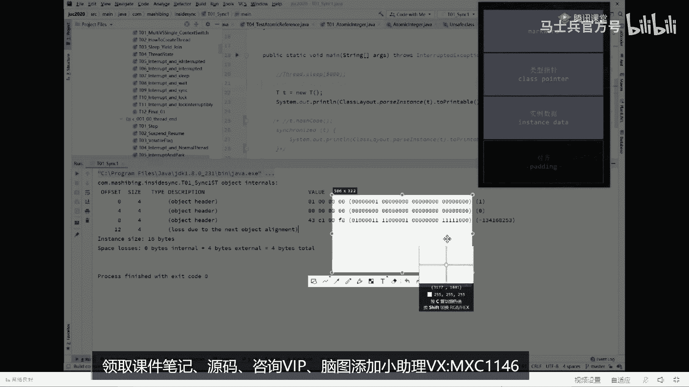

# 【马士兵教育】MCA架构师课程 主讲老师：马士兵 - P36：美团面试JVM七连问：1.对象在内存中的存储布局？ - 马士兵官方号 - BV1mu411r78p

关于职业vm的一系列的问题，这类问题呢比较难非常的难，如果你没有听过或者没有接触过，基本你打出的可能性呢很低，看这里现在的大厂的很多问题，他会他会追着你一问到底。

嗯还有很多同学说我现在开始问那个源码级的内容了，对这个很很正常也很正常啊，嗯源码的课呢我们讲的也非常的多了，深入的级别呢会讲到linux内核的源码，那么软一点的，你像jdk的一些个源码呢。

肯定是要讲到的a q s了啊等等这些啊，不废话呃，我们来看这个关于这位m的原来问的这几个问题，这个，问题是什么呢，它实际上就围绕着这句话来完成，就这么简单的一句话，这句话大家伙一看都能知道是什么意思。

但是围绕这句话所诞生的七个问题，你就未必能回答的出来，看这里他是这么来问，他说第一个请你解释一下对象的创建过程，对象的创建过程不就是你扭出这个对象来，中间执行的有哪些过程好。

第二个呢叫做d c l l d c l要不要加volatile，这里是关于指令重排序的问题，同时也涉及到多线程的问题啊，同步的问题，那么第三个问题呢是在对象在内存中的存储布局到底长，什么样什么意思。

我们弄出这个对象来的时候，它在内存里面到底长什么样好，当你明白对象在内存中存储布局的时候，第一个对象该怎么定位，是直接是间接，第六一个呢是对象怎么分配，第七个呢是在内存中占有多少个字节呃。

后来又他们内部在问问题的时候又加了两个更加深入一点的问题啊，第八个问题叫做为什么hobt就不使用c加加对象来代表java对象，当然这个东西就涉及到一些，hosp的源码了会稍微更难一些，c加加。

大家都知道hosport是c加加写的，不知为什么不用c加加对象，直接来代表着对象呢，而是要采用那种oop class 2元模型，我先跟大家说一下。

hosport里面采用的是这种模型来代表着我对象叫op class，oop class 2元模型好，第九个问题，第九个问题是class对象到底是在堆啊，还是在方法区，关于这九个问题。

有多少同学能够感觉到答不出来的，你给老师扣个二，我来认识一下，好我今天呢给大家把这些问题讲清楚，由于内容比较多，大家认真听，我预计，我不一定是按照顺序来啊，我预计我在9。50左右会讲完第一波，9。

50~10。15左右，我会做一波广告，10。15啊，到十点半左右会跟大家回答一点问题，十点半之后呢，我会把剩下的问题给大家close掉，这是我们今天晚上的安排，大概11点我们下课好，现在开始看这里。

我我先把这个题啊，这样啊，我先把这题先来给大家伙儿复制一下，一会儿呢我们边看着题，我们先来回答问题啊，我们先看第一个问题，第一个问题我先回答回答大家伙，这个问题就是对象在内存中的存储布局，到底长什么样。

呃这个呢我就不卖关子了，我们直接呢来看啊，就是new出一个对象来的时候，这个对象在内存中的存储布局到底长什么样，注意看一个普通对象，new一个对象，平时我们嗯这个课程里都这么讲，说你有一个对象来的时候。

这个对象呢是往堆里头这么一扔啊，换一个方块表示一个对象，但实际上大家都知道一个对象来说就是一连串的010101好，这些零一里面每一个东西到底代表的什么意思，他问的是这个东西，认真听。

作为一个普通对象来讲，可以说它分成四部分，这，四部分，第一部分叫mark word，第二部分叫类型指针，也叫class pointer好，第三一部分叫instant data，第四部分呢叫对齐。

为了让大家深刻的认识这个东西，来听我说，我把这部分抓下来，我们来写一个程序来认知它，看这里，呃这程序呢需要用到一个小小的类库，这个类库的全称叫j o l j o l呢，我在这里就不多做解释了啊。

jo的这个类库非常的简单，你百度1下，花五分钟就能了解它怎么用，它的全称叫java object layout，object layout，layout，布局的意思，java对象的布局。

通过这样一个类库，我可以很简单的很直接的了解到一个java的对象，在它内部到底是怎么表示的，好看这里，我先把多余的乱七八糟代码给他家伙删掉，先不管它好，现在呢我们有一个非常简单的class class。

叫t哈哈，什么都没有，就叫t那好当我们另一个t对象出来的时候，它的内存布局到底长什么样，一句话就可以搞定它，怎么把它搞定呢，这样来做，class lay out，这是我们g o l类库里面用到的一个类。

class lout，点pass instance静态方法，解析对象，解析哪个对象呢，解析t这个对象，two principal转转成可以打印的字符串类型，那么呃我们先把这小程序跑一下啊。

就是我new了一个t对象，下面这句话呢对他进行了t对象进，行了一个分析输出，就这个意思很简单，往下看，好了看这里，对照我们刚才这张图啊啊对照我们刚才这张图放在这个位置，对于刚才张图来说。

这里头的010101。

这就是我们弄出来那个对象的真正的内容啊，这个这个就是我们new出来一个对象里面，在内存里面的0101的布局，当然每八位代表一个字节，每八位代表一个字节，那么大家可以数一下。

说这个对象呢哎到底是呃占了多少个字节呢。

如果按零一来看的话，就12341行，四个三行，一共12个字节，但是呢我们对着我们整个的刚才我们所说的这个对象的布局，第一部分呢叫mark word，请大家记住mark word呢占八个字节。

这里头是八字节，这个好，第二个呢叫类型指针，类型指针指的是诶，我new出来这个对象到底是属于哪个类，你可以认为这里有一个指针，它会指向谁，指向t。class，因为我们用的是t对象吗，这不ut吗。

用的t就行，所以呢通过这个指针可以找到这个class，这个占多少呢，这个占四个字节好，第三一部分叫实例数据，实例数据指的是什么呢，t这个对象的它的成员变量，比方说它内部有一个小m好。

这小m扔哪扔在了这里好，第四一部分要对齐，对齐什么概念，整个对象的大小不能被八整除，补齐能被八整除，就这个意思好，我们按这个规律来看，现在的这个输出，看大家是不是能看懂了，首先我刚才说过。

mark word站log自己八个字节对吧，从第二个到第四个字节，从第四个到第四个字节啊，往后再说，四个一共八个字节，这里对应的迈克尔的好，下面这四个字节对应的什么东西呢。

对应的是class pointer，还有同学说没有实例数据对，因为t类型它没有成员变量好，最后叫对齐，因为这里是八个，这里是四个加起来12个不能被，八整除，所以最后又补了四个字节。

所以一共加起来这个对象的大小是instant size，16个字节啊，这会能跟上的，给老师扣个一，因为我觉得比较简单，怕同学们有的认为比较复杂的啊，可以是吧，good不错。

那有同学说老师那那那那我要是那个我要往里头装点，装点那个成员变量呢，来温暖这一句，如果按照我们刚才的这个说法，我要我要我要往里头装这么一个成员变量，int m来告诉我一下整个对象到底占多少个字节。

算一下，那为什么是16呢，啊有时候16，有时候四，有说24的，我们先再跑一遍，run，好看，这里一共还是16个字节，唉为什么呢，前面的12个字节不变，分别是八个字节的mark word。

加四个字节的class pointer，最后呢我们有一个int类型的变量，int类型占多少个字节呢，占四个字节是吧，所以最后加起来16个字节，由于已经被能够被八整除了，所以没有补齐了，一共这么多好。

我再问大家一句，如果我这么写long，来告诉我整个对象有多少个字节要看大家能答对吗，long是占八个字节对，16加八二十四个对吧，这个是没问题的，打一下，我怎么没太懂，你哪没懂啊。

我总觉得讲的算比较简单了，来告诉我这个这个对象再来一遍多少个字节呢，布尔类型，好跑一下，看我们看多少个字节，布尔类型比较有意思啊，我看他怎么做的好，大家看这里啊，这个布尔类型占了多少个字节啊。

占了一个字节，所以最后给你补了七个字节，补到八个，所以四个字节加四个字节，一共八个字节的mark word，一共四个字节的class pointer，一共四个字节的m，八个字节的long。

一个字节的布尔补齐七个字节，最后加起来32个字节k，而这个4s等于hello，北京好，告诉我多少个字节，32 32，32，32，嗯，不对吧，那我走长点，一共多少个资金，有没有别的答案，往下看。

好看这里一共是32个字节，这时候你注意看这个布尔类型，直接补补到int类型，所以补三个字节，最后这个string类型是一个四个字节的对象，为什么，因为这里不要认为当我们又是一个替对象来的时候。

这个东西是存在t的对象的内部，它是在哪里呀，这个s本身是一个地址，是一个指针对吧，它是放在这儿的，但是呢这个字符串是通过这个指针指过来的啊，指到这里好了，到现在为止。

我觉得给你讲完这个呢，我们再来看呃，美团问的问题啊，来看第七题，第七题能答出来了吗，orient order，new orient内，存中占多少个字节，多少个说出来，16个对。

然后对象在内存中存储布局到底长什么样。

好把这个图给我背过就行了，八字节的mark word没有什么王八的屁股规定，只要是64位的虚拟机，它的mark word永远都是八字节，64位，glass pointer叫类型指针，默认是压缩。

它是四字节，不压缩是八字节实例数据里边你装多少算多少，反正不管你是内部棋还是外部棋，最终都得给我补齐，成被八整除，我知道大家伙还有一些细节的疑问，但是如果你给你解答这些疑问，我就给你讲不了。

剩下的问题你们是要答疑，还是要往剩下的讲，我建议我先往下讲，学东西，学框架和脉络，把框架和脉络搞定之后，再去搞这些细节，不识庐山真面目，只缘身在此山中，如果你研究一座庐山上来。

先去研究山顶上某棵树下面的蚂蚁窝，我告诉你，你跟那个庐山的整体脉络就再也没有关系了，你在你的硬盘上存了很多细碎化的知识片，但是你从来没有建立起来过知识体系，我们呢就是自己不仅是讲求给大家伙儿讲知识知识。

这玩意儿比较简单，同时呢给大家做一对一的规划，所以到现在为止，直接告诉大家，我们课程在不仅是在学生的认可了，现在是呃业界也开始认可我们的课程，这是我们最近啊刚刚8月三日，他是去年8月31号报的名。

因为他中间好多事，中间没学球球报个喜，刚面了京东哪个部门，当场直接过，面试官问我从哪学的，ok就这么直接，然后多线程里回答的比较好，直接就过了，知道吧，下周刚通过，还没有具体的嗯，还是那句话，听我的。

不要听你的，效率为什么低，因为你没听我的，我们先讲脉络，总而言之，这玩意儿它是一个死东西，这玩意儿呢如果你是64位的机器，这个mark word就是64位，如果你是一个32位的，咱们的呃jdk。

那么这里就是32位啊，这是一般的那个建对象的时候啊，做这种呃运行时对象的时候经常使用的一种技巧，看这里在这里呢呃第二部分呢叫类型指针，类型指针比较简单，我在这里就不展开了。

面试的重灾区，实际上在mark word这里，它的种灾区在这儿，听我说对象头这两部分，这两部分叫对象头，mark word加上class funter，这个叫对象头，所以当你看到呃。

我们这个对象布局的时候，他在前面12个字节里标了它叫object header，叫对象头，加上四个字节的class pointer，class pointer，指向class的对象，这个不说了。

这里是面试重灾区，我直接说答案，这东西没什么可说，背过就完了，第一个叫锁信息，第二个叫还是cold，有同学说老师我能不能看到，可以的，没问题，我跟你讲的东西都能让你看到。

看这里我们同样是我们同样是这个t对象，把它里面的成员变量给它注掉，就不展开了，一个小小的t对象，在它刚刚扭出来的时候，它的布局到底长什么样，刚才我们看过了啊，看这里刚刚溜出来这个t对象。

它的布局它布局是这样的，好我们说锁信息为什么是有锁信息，大家都知道啊，在jdk里面的java里面，我们想给某把某个对象当成一把锁来使用，怎么做，就这么来做，synchronize的t就是把这个对象当。

成一把锁，我锁定这个对象之后才可以执行里边的内容，好我这内容里面是什么呢，再把这个题的信息输出一遍，注意这时候t v是上了锁的，为了做一个对比起见，我可以把这个锁释放了之后再做一个对比。

第一个是刚刚扭出来的，第二个是上了锁的，第三个是是所释放之后的，我们来比较一下，看看哪里发生了变化，走你，仔细看，这是刚刚new出来的时候，我们主要看这个零和一的地方就可以了，往这儿看。

你会发现它第一个字节就是就是所有都是零，最后一个是1000001哦，但是比较一下，当我们给他上了锁之后，你发现它什么长什么样啊，能看懂吗，这里明显发生了变化，好听我说这里面记录了什么呢。

这里面记录的就是关于锁的信息，所有的信息就记录在这里，我还可以告诉你，这里头你看的零零，那么它就是一把轻量级锁，轻量级，所以就是自旋锁啊，所有一个升级的过程要看就看这两位嗯，这个细节呢比较多。

要要讲的话，两个小时开外去了，先把这个略过锁释放之后，你会发现ok准备对象又恢复了原来很自然的一个状态，所以平时我们讲的时候，给某某个对象来上把锁，到底是什么概念呢。

其实就是修改了对象的mac word，如果你要愿意的话，你比如说我们把这个锁的信息先给他做掉，我们打开这个还是code，只要你对它调用了任任意一次，还是code这里面的布局也会产生变化，我们跑一下。

看这里，这是刚刚new出来的状态，这是调用了hash code的状态，所以这里面hash code的信息已经被我们记录在了脑脑袋上面，所以呢由于一个对象的hash code用的特别多。

因此我们调用一个对象的hash code之后，再下次再调用的时候，都不是说重新再计算，而是直接在脑袋上拿出来就可以了，效率这就是它效率高的地方，这个对象到底是什么颜色的，这个对象到底是什么颜色。

我同学说老师这对象还分颜色，没错，垃圾回收算法叫什么叫三色标记，这个对象到底什么颜色记录在哪，记录在我们的mark word里面呃，如果你听过老师的关于三次标记的课。

那么你就会知道这两堂课实际上是有着有机的关联。

