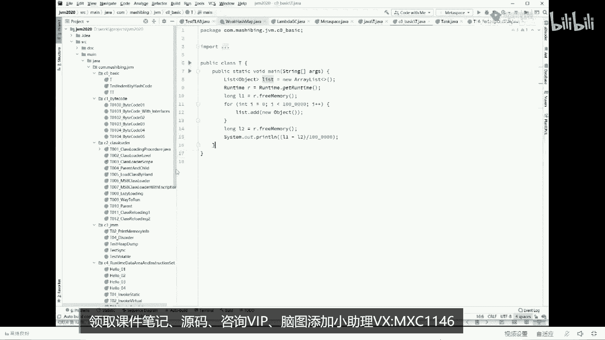
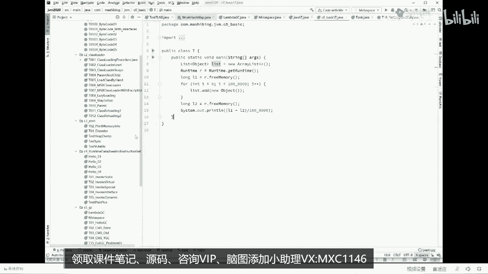
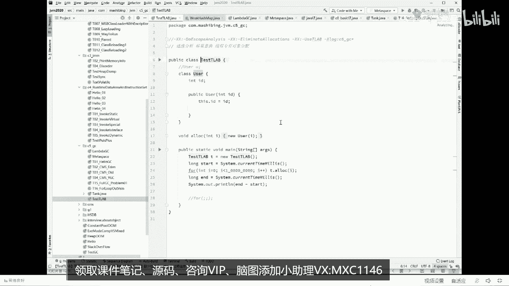
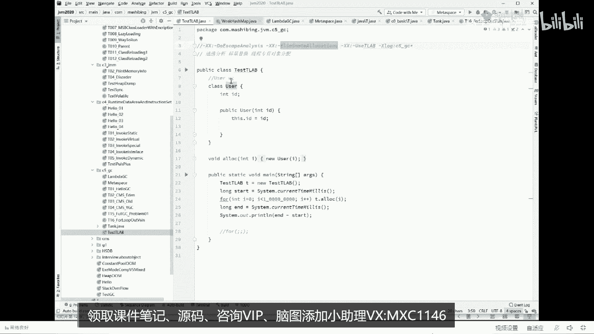
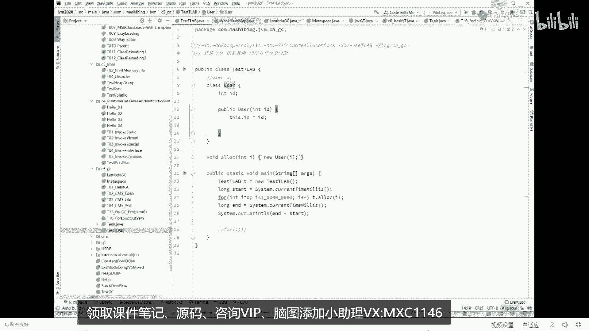
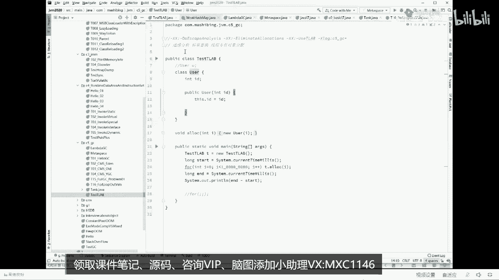
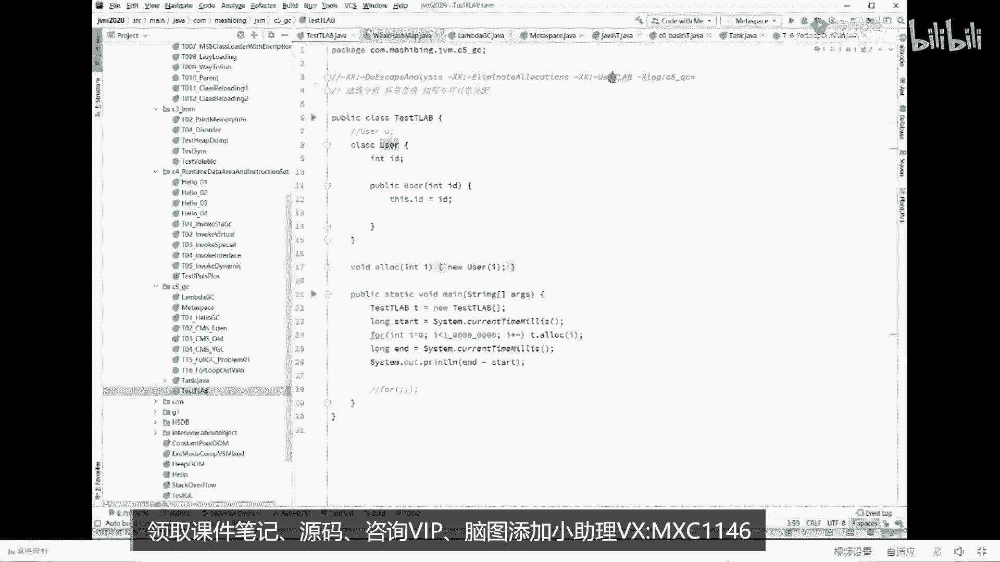

# 【马士兵教育】MCA架构师课程 主讲老师：马士兵 - P38：美团面试JVM七连问：3.对象在内存中如何分配？ - 马士兵官方号 - BV1mu411r78p

好了能听明白的，如果还没听明白，我给你一个动画看，仔细看一个对象从出生到消亡的过程，它到底长什么样，new一个对象最开始产生放在站上，当然这个先略过，这是一个细节，这个先略过，它会首先进入到伊甸园区。

进入到伊甸园区之后呢，如果他还活着，复制到s1 ，如果下次还活着，经历一次拉圾回收之后，还活着复制到s2 ，还活着又复制回来，还活着又复制回来，一直到年龄够了，进入到老年代为止。

当然老年代他又被回收掉了，那说明什么，他就被被干掉了，就结束了，从出生到消亡，大概是这么一个过程好，这会儿还能跟上呢，给老师扣个一啊，可以可以继续的，所以下面呢我就给大家伙补一点这个知识啊。

下面我来讲对象怎么分配的过程，这个过程是这样的，仔细听认真听，当你刚刚开始new一个对象的时候，首先会尝试在栈上分配，有同学说了，老师一直一直您讲的就是在堆上分配啊，你去问哪个线下的老师，你随便学。

他说的那一对象一定是往堆上分，对是的，但是很不幸的是，如果你能被大厂问道，你就必须把这个过程给说出来，没有一个对象的时候，首先会尝试往站上分配，有同学可能就会说大哥还能往站上分配，这是什么概念。

这是一个站站里面通常有方法的调用过程，好这是一个main方法，关于main方法的局部变量全往这儿扔，能听懂吗，比如说我在main里面声明了一个变量，int类型m等于八好。

这是放在main方法里面的一条语句，这个东西叫main方法的局部变量，它局部变量放在站里面，所以这个小m等于八就扔在这儿，接下来第二个，如果这个main方法调用了另外一个方法。

第二个方法叫m main方法执行到这儿了，还没开始继续执行的时候，去调用了另外一个方法，这个方法进入到这里面好，这是这个方法自己局部变量的空间，这个一般我们称之为叫战争，叫stack frame。

好不管他这个方法又调用了第三个方法，没关系啊，再进仔细听，当我们明白了这个过程之后，一个方法一旦结束了，你比方说这是m方法，这是n方法，m调用了n n结束了，回到了m继续往m往下执行了。

同学们告诉我一下这个里面怎么处理呢，这里面有操作系统，直接来帮我们管理，直接把它往外一弹，什么叫往外一弹，占顶指针往下一挪，这块空间就废了，好了这个叫做这，大家明白了什么叫做战的或者叫战争的概念之后。

你会发现呢，如果用战争来看管理对象，这里面对象呢放在这里有一个什么好处啊，好处就在于，只要这个战争一结束，扳机往外一弹，我们的对象自然而然就结束了，我需要垃圾回收来参与吗，不需要效率高高太高了。

垃圾回收这个玩意儿是一个咱们系统里面的线程，知道吧，需要这个线程定期的或者找时间来运行，你才能够把这个对象给回收掉，但是如果你的对象放在站里面，你会发现不需要他参与，直接往外一弹结。

束所以当你一个对象可以分别在站着的时候，有什么好处呢，好处就在于网站上一分配，再往外一谈，唉整个对象分配结束，那这块能听懂的，给老师扣个一，当然当你们用了这件事之后，你一定会问。

那为什么不是所有对象全都分配在站上啊，有这个疑问吗，肯定有这个疑问，为什么不是所有对象全部分别在站上，听我说沾上这东西，其实呢，是因为什么呢，沾上这东西，可能他有朋友，我看看他重新跟他说，热热一热。

默认不管他啊，就是说战胜这东西，第一个占的空间比较小，默认是256k，知道吗，就这么大个，所以经常我们遇到stack overflow叫占一出，如果你对象全分在上面被移除了。

还有一个有些对象不能往站上分，为什么，比如说给你举个最简单的例子，这是一个战争，它里面有个引用用到了这里面的一个对象，你这玩意儿能随便弹吗，你往外一弹的话，你好好琢磨琢磨。

我这里面的引用是不是就空指针错了，你弹完了，我找不着那对象了，不就空指针了，所以这里面呢栈上分配是需要有两个标准的，第一个标准的叫做逃逸分析，逃逸分析的意思就是说我看你有没有逃出我整个方法的执行范围。

比方说你for循环里面别人谁也没用到的对象，你可以往站上分，完全没有问题，但是如果这对象被别的方法里面的引用给用到了，或者被堆里面的某个引用给用到了，那你完蛋绝对不可能往这上分配的。

因为你这一谈别的引用就完蛋了，就用不用用不了你了，所以这叫逃逸分析，看看你的生存有没有逃出我们整个的方法范围好，第二个叫标量，替换我就不解释了，只能用最基础的数据类型才能够能够替代的对象。

才能够完成这上面分配，你说特别复杂的，有些引用类型放在上面，不好意思，这上面不能分好，不废话了，了解这个过程就可以来，可以继续的给老师扣个一，好对象怎么分配，这是第，这是第一个第一个过程好。

第二个过程是怎么样的，如果在站上分配不下，就看这个对象是不是个够大，如果是一个特别大的类型，我告诉你直接进入老年代，old old的区域，老年代，当然老年代的话是需要经过负d c叫做全量回收啊。

负几岁之后才会被回收回收掉，还有同学马上就会问老师，这个个够够不够大，是什么意思，多大是大，听我说这位m调优里面你完全可以用一个参数来控制，叫max genuine threshold。

我在这就不展开了，那现在真的有对象在这样分配吗，这不是废话吗，我给你讲半天了，我就给你讲，再加上分配吗，其实我是可以向你证明的，我只是懒得给你证明了而已啊。

战场分配。

老鸟愿意把这小程序拿走，而且呢把这些个参数都给我打开或者关闭，仔细实验一下，你就会知道哦，确实有战场分配这个概念不展开了好吧。

可以不展开吗，可以同学给老师扣一，我们继续不，可以同学给老师扣7652。63的开根号，最后得到的结果值，ok大家伙都觉得都可以。

那我们继续，哈哈哈哈哈，开个玩笑啊，看你们有没有在认真听课，我看这里他因为因为因为这东西呢细节太多，它有好几个参数，像他必须要把他的战役战役出给它关掉的话。

怎么做呢，就是逃逸分析的关掉，做逃逸分析，你必须得把这个参数给它关掉，还有一个呢必须关掉标量替换，还有一个呢必须得关掉u t r a b a thread。

local education buffer，这个我一会讲给你听，ok看这里啊，接下来我刚才说它个儿够大，直接就进入到老年代了，那它不大不小，又不能在站上分配，这种分配在哪。

这时候才会正式的进入到我们刚才讲的那个过程，进入到哪儿去呢，进入到了伊甸园区，伊甸区啊，回想我刚才给你讲那张图，但是有同学马上说说老师怎么前面还有一步啊，对这部叫做尝试在县城本地分配，什么意思。

这tr ab的全称，它是这几个单词的缩写，thread线程local本地，cation分配啊，buffer缓冲区叫县城本地分配缓冲就叫请跟我读，跟着我读。

the location buffer要读出那种英国流氓音了啊，reallocation buff买logo allegation版本，阿三的口音也可以，我看不开玩笑了，就是县城本地分配。

这到底是什么意思，认真听，如果说我们呃一个程序开始之后，好多个线程开始往那个伊甸园区开始分配对象，注意是好多个线程，那么大家想一下，你如果想分配好这个对象的话，必须得做线程同步，大家伙都看上这个位置了。

谁抢到算谁的，各个县城之间的同步必须得做好，做到位才可以，这点很容易理解，但是如果上来就给先生做同步，这个效率一定高不了，所以呢他在前面加了这么一步优化，这个优化指的是什么呢，什么意思。

这是a线程的空间，这是b线程的空间，a线程要分配对象的时候，优先往自己兜里装，b线程优先往自己兜里装，不会先用公共区域，先在自己的卧室啊，往往往往往里装，只有卧室不够使了，再去那个客厅里面去抢抢位置。

所以说你自己往我自己兜里装，你还需要线程同步，吗不需要，所以这个效率就又变高了，ok这个东西呢叫three local election buffer，如果大家感兴趣，gm调优里面这块区域也可以调。

但是这块区域本身就分配在伊甸园区，所以我们说对象在这块区域，不管你开没开启slogo啊，最终都是在一甸园区进行了分配啊，这块能跟上的可以继续的给老师扣一咳咳，这个yn代表啥，这个y叫yes。

这个n叫no，我们在这个伊甸园区为了伊甸园区之后，回想我们刚才执行的过程，那就会说清楚一点，被清掉了，那就直接结束了，如果没有被清掉会怎么样啊，回想一下是不是进入到我们的s一去了。

s一区又经过一次垃圾回收，如果被清掉了，那就又结束了，如果没有被清掉，就看你的年龄多大，如果年龄够了，是不是又进入到老年代了，如果年龄不够，会进入到s2 区，如此的循环往复，好抓图对象怎么分配的过程。

我用一张动画给大家画出来了，动画我画了两个小时给大家演，示完五分钟，讲一门好课，比较辛苦的，不是那么的容易，这张图啊，现在美团的大概有几个问题，我们现在能回答了，朝烟第七个问题，你可以回答了。

object o等于new object，内存中占占多少个字节呢，16个对象怎么分配呢，唉首先在站，然后在县城本地e甸园区o的区域中间呢，有s1 s0 s一互相之间的复制过程，对象怎么定位呢。

直接和间接两种方式主要是体现在垃圾回收的区别上，mark word class pointer啊，synchron，还有一个还是go的信息，对不对，四部分，mark word class。

pointer，instant，data和ping到现在为止，34567减完了，09：06，速度还可以吗，如果说那个时间充足的话呢，我会给你讲里面的好多好多细节，但时间不充裕，有些细节我先错过。

比如说class pointer，本质上这玩意儿呢，虽然说你你你你你认为啊，class pointer，这玩意儿啊，虽然说你认为呃它是一个一个一个四个字节，但实际上呢这里面有开启压缩和不开启压缩的区别。

这里面还有超过32g内存之后自动失效的区别，这里面比较复杂，我就不展开了，而不管怎么样，听我说，起码34567，我能打出大概来了，对不对，下面我们来聊一和二，每次讲一和二比较头疼。

所以我们要留足充裕的时间来给大家讲一和二，好可以继续的来给老师扣个一啊，该进广告了没有啊，我没有想打广告的，我们讲第一题和第二题，第一题和第二题是最复杂的，我尝试讲给你听。

第一题呢叫做解释对象的创建过程，什么叫对象的创建过程，这东西呢讲起来呢并不是并不难，我直接告诉你，我我先给你讲结论啊，认真听对象的创建过程什么样的，其实对象创建过程比较简单。

就object o等于new object，他首先往这块空间里头，你有一个对象出来是吧，刚才我们说过这个对象里面内存布局了。

