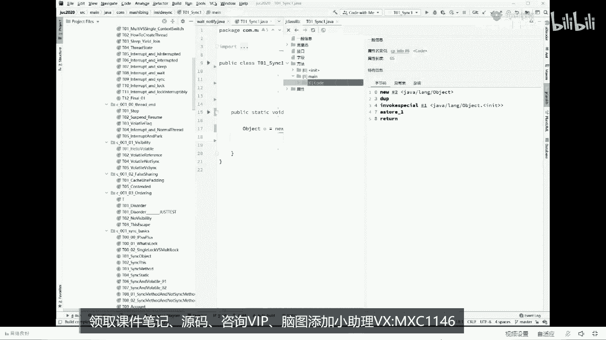
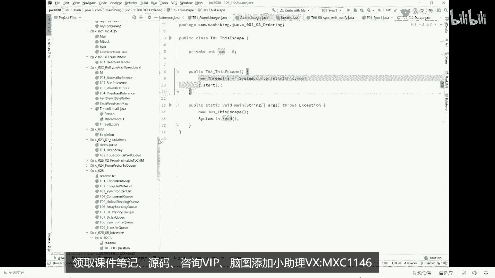
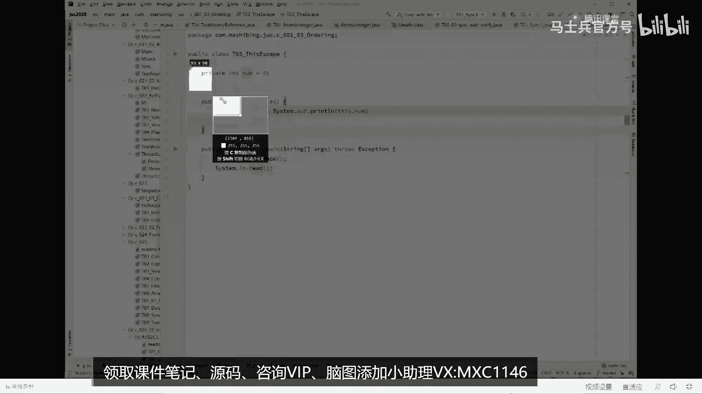
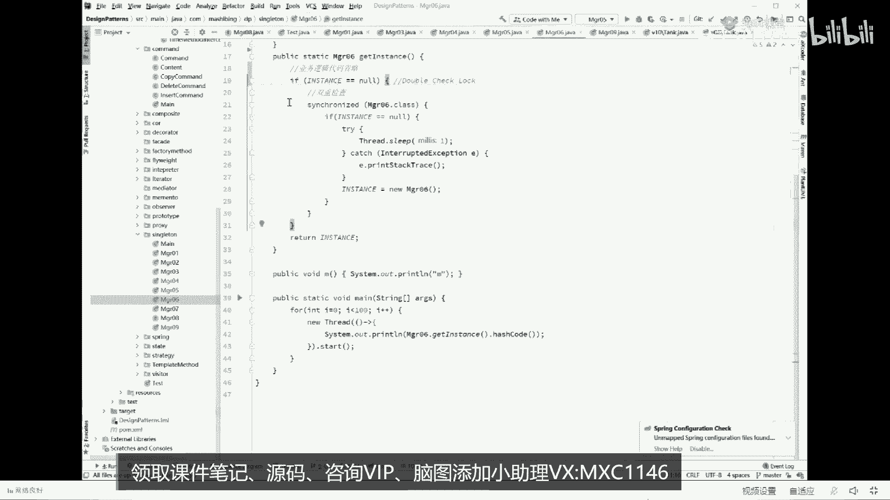
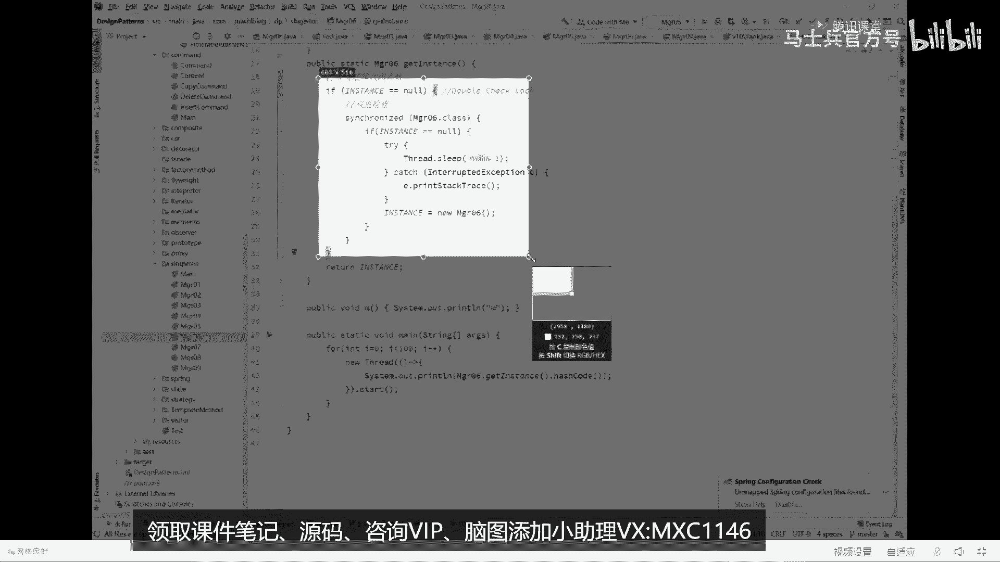
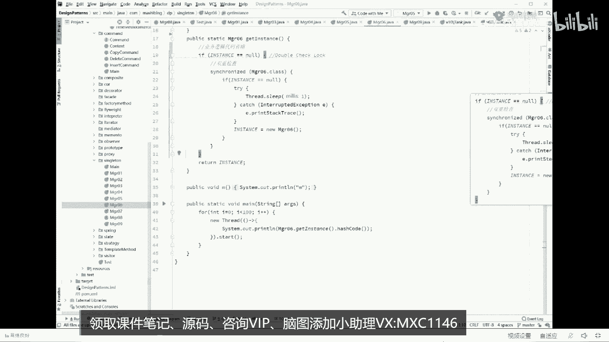

# 【马士兵教育】MCA架构师课程 主讲老师：马士兵 - P39：美团面试JVM七连问：4.对象的创建过程 - 马士兵官方号 - BV1mu411r78p

你听我说对象的创建过程实际上它是分成三部分三步构成，如果大家会想了解一个对象的创建过程到底是哪三步，你做一个小小的操作，这个操作这么来做，这是刚才我们这个小t对象删掉，我们就执行一句话。

t小t等于new t，其他什么都不执行，跑一下的小程序，然后接下来我们去观察这个小程序所生成的字节码，这是什么意思，就是java语言的汇编代码，class字节码它到底长什么样。

我们来看怎么看view show by code，看它的生成的字节码，或者是使用一个插件，这个插件呢叫j class library，我喜欢用，这个插件。

这个插件叫robo with the class library，大家来看，他会帮你把你整个生成的class文件全部帮你分析一遍，生成的方法里面，main方法在它里面的代码到底长啥样，就在这儿。

这里面有个static class里面什么的，稍微复杂了一些，这样我把代码呢再写的再简化一些，看这里，因为这里头有一个interrupted deception，我把代码写的再简单一些，就这么简单。

object o等于new，object跑一下，好我们再来看它生成字节码，view是by code with这个class li，方法main方法code，你看一眼它生成的字节码。

生成这个字节码呢大概是有方便手机的，大概是由五个五个指令构成，这第一条指令叫new new指令，六指令是个什么概念，我先跟大家说，new就是new一个对象，那就是分配一块空间，你会发现它掉了一个对象。

这个对象呢就是java object，所以他new的是这个对象，第二条指令叫duplicate，我今天不想给大家讲java汇编码，这是在我这边破里专门讲的，先把这块儿给大家略过，这块比较复杂。

我先把它略过，第四第二步第二步叫什么，第二步叫invoke，special invoke调用special特殊叫特殊调，用特殊调用了一个方法，哪个方法呢，1号1号方法是哪个object的。

initialize方法就是它的构造方法，你调用一个对象肯定要调成构造方法，对不对，好第第三步叫做a store，a store的意思叫建立关联，我一会给你解释好。

这条指令呢叫return return就不管了，所以最核心的指令有三条，分别是new inbox special和a store，来这会儿能跟上的，给老师扣个一。

我下面向你解释这三条指令到底是个什么样的概念，我看这里。

我们解释对象的创建过程，刚才我说了new这条指令啊，就是内存里头申请一块空间，但是大家知道如果一个对象里面有成员变量的话，它的成员变量一定是要占空间的，比方说我们有这样一个class t。

它内部有一个成员变量是小m，我想问你当执行到这条指令的时候，这个小m的值是几是八吗，讲到这儿呢，有一些语言的历史，我稍微给你们展开一点点，老师我呢从最开始的时候，我们讲这个语言里面的怎么说。

就是讲这个讲这个讲这个呃，c加加语言啊，所以还是讲c加，后来讲汇编，讲c然后一直讲到java，讲了很多很多种语言，原来在那个华中科大就是左老师的母校啊，曾经讲c加加的时候，同学们都跟他震撼。

我靠原来c加加还能这么讲，认真听c加加语言呢，它也能new对象，这个大家知道c语言其实也能new对象，无非就是分配一块内存，把那个内存里面好好来组织一下就可以，但是听我说，我想问大家一句话。

如果在c加加里面，或者在c里面，当我们new出一个对象来的时候，它里面有个成员变量小m我想问你这个m的值最开始是几个，大家能知道吗，如果在c加加里面new出来一个对象，int类型的这个小m的值会是几。

怎么这么多说零的呀，这都是没学过，有没有学过c加加的，跟我说一个说零的，明显是没学过的，没学过c的，这东西叫做遗留止，遗留指能听懂吗，什么意思，什么叫遗留之啊，遗留职的意思就很简单。

就是上次有一个程序在这里面用过了一个数值，注意我们说这块区域又可用了，它只是做个在这里做个标记，说这块区域又可以用了，分配一个对象，往这一分配的话，上次留下的里面的是值是几。

这个m就是几上次用完啥这东西就是啥，所以这是遗留之，ok你前男友的吻深深的印在了你的嘴唇上，所以你的新男友印在了你前男友的，怎么这么乱啊，不说了啊，就是总而言之呢，它中间没有一个renew的过程。

ok它就是一个有一个遗留值在这里，所以遗留值就会诞生一些安全性的问题，为什么会有安全性问题，比方说这个地儿正好是个密码，你上来之后，你m等于几等于你的新程序可以直接访问这块内存，直接拿密码了。

我的天大家都知道那个汇编啊，c啊都能做什么东西呢，做逆向对不对，逆向怎么做，就是分析里面的，现在正，在跑的那个值到底是多少，直接给他改过来，正是由于这些安全性的问题，java是怎么做的呢。

java是这么做的，当我们列出来任何一块内存之后，它里面有个成员变量都给他复成默认值，所以像int类型的默认值零，波尔类型的默认值false，引用类型的默认值空o所以当我们new出来一个对象的时候。

它里面的成员变量注意是默认值是几是零，它并不是等于八的，来这块能听懂的，给老师扣个一，对他先清理了一下，等于你交了个新女朋友，他实际上把自己renew了一下，把自己遗留。

她前男友遗留的各种各样的问题呢都从身上清理了一遍，能听懂吗，所以你得到的是一个崭新的女朋友或者男朋友，开了个玩笑好不说了，所以java比较安全，大概就这个意思好。

那中间这个inbox special只有调用完构造方法之后，这个值才会被我们复制成为八，原来是零，后来它就变成八好，第三步叫a store，我来解释，看这里，第一步。

当我们执行到new new这一步指令的时候，它里面的值，执行到invoke special的时候，这个值才会变成八，那下面那个a store的意思很简单，这个小t和我们这个对象建立关联。

所以对象的创建过程有三步构成，第一步申请空间设默认值，第二步调构造方法，设初始值，第三步建立关联，很简单，所以第一题也特别简单，这是解释对象的创建过程，半出的这个题非常的简单，但是第二题就超级难。

每次讲这个题呢都都比较费劲，但是也没有办法不讲，既然承诺给大家讲，给大家听好听，我说要讲清楚第二个问题，我们先来聊一个触及灵魂的问题啊，想找个成员，需要掌握的底层知识啊，一边啊。

稍等啊，我还是得要ppt给大家演示，不然的话会比较费劲啊，听我说啊，我们现在先问大家一个小小的问题，这个问题是这样的，他说程序是真的按照顺序执行的，这是什么意思，认真听，比如说我们现在有两条指令啊。

或者有两条语句吧，说x等于x加加，或者是x等于一，y等于一，这两条指令啊，这两这两条语句到底是一定是程序真正执行的时候，是一定是先执行它，在执行它吗，一定是先执行他在执行他吗，我先说结论，结论叫做未必。

结论叫未必不一定，什么意思，就是在你程序真正开始执行两条指令的时候，很有可能是后面你写的指令先执行前面写的指令后执行，我们先我们先我们先记住这个结论，然后我们再来讲为什么原因呢，其实很简单。

我稍微给你解释一下，你就明白，比如说啊我们的cpu执行指令的时候，它的速度非常快，它是内存访问速度的100倍，如果我们现在有两条指令，第一条指令呢是去内存里面取的数据。

第二条指令就是cpu内部的一个加加操作，某个寄存器加了个一，那大家你想一下，如果说我们，强制按照cpu按照这两条语句的顺序执行，强制按照他按照顺序，那是不是会造成这么一个现象。

当我的cpu执行这条指令的时候，我发了一条指令给内存，我就得等着内存大概100个时间单位之后，就我cp就在那歇着，你懂吗，等100个时间单位等你回来了之后，我才能继续执行，第二条，这个大家能听懂吗。

就好比说我们那烧个水，想泡个茶，我烧完水，我必须等得等得等水开了，我才能去拿茶叶，洗茶壶，洗茶杯泡茶，所以cpu怎么能容忍这样的浪费呢，所以一般来说它是可以进行优化的，怎么进行优化呀。

软件优化优化的办法就是我烧水的时候，我同事就开始洗茶杯，洗茶碗不就得了嘛，所以我在发出这条指令，等这条指令还没有回来的时候，我就开始执行下面的指令，下面的指令挂机先执行完，等什么时候这条指令回来了。

我们再继续往下执行，唉这块能听明白的，给老师扣一，所以在你真正开始执行程序的时候，有可能是诶后面写的程序先执行前面写的程序后执行啊，有同学说能不能证明时间关，系我就不给你证明了，我告诉你。

我写成这个程序完全可以证明出来，vip呢我专门给大家写了证明，在这我就不单独写了，因为这个过程呢也相对复杂的解释半天，因为后面还有很多事要做，所以我们先跟大家说说清楚这件事，程序不一定是按照顺序执行。

当然有的同学呢可能会说了，说老师这事儿不对呀，你想想看，像这样的两条语句能随便换顺序吗，我想问问能换吗，这肯定不能换，这换了顺序，比方说原来的x值为零，就换了顺序，最后的结果是不对的，你现在等于x加加。

最后结果是二，你先按x加加，最后x等于最后结果是一，这能对吗，这不行，所以大家认真听我讲，程序什么时候能够乱序，最终的一条规则叫做保持，只要保持最终一致性就可以，什么意思，注意这里指的是单线程乱序。

单纯乱序的意思是，只要在一个县城里面，这两条语句随便换，不管你怎么换，换到最后最终的结果是一样的，最终的结果我们内存里面是不是这块x等于一，这块这块y等于一，无论你怎么换，无所谓吗，x等于零。

y等于y等于2。5，随，便换对不对，所以前面两条语句叫做没有产生依赖，你就可以随便换，唉别的语言也一样，对没错，来待会儿能听明白的，给老师扣个一，所以说程序不一定是按照顺序执行的。

那到底呃什么样的东西可以换顺序呢，反正保持最终一致性就可以，那如果我讲了这个问题之后啊，我想问大家一个小小的问题，这是一道面试题，也是一道面试题，比这道面试题稍微容易一些，我看看能不能打得出来，看这里。

来看这道题。

为了方便手机，等我把它复制一下，放大。

是个体贴的男人啊，仔细看，来看这小程序，我们有一个类啊，这个类呢叫t03 ，然后呢呃它有一个成员变量number等八，然后呃在我们new t03 的时候呢，启动一个线程。

这个线程呢是打印this number，让它启动，接下来呃我们在main方法里面new了这个对象，诶，你可以想一下，我new完这个对象之后，一个线程启动，然后打印这个南门等八。

来告诉我一下这个程序有没有什么问题，有没有bug存在，有bug吗，好这个程序呢叫做著名的this溢出问题，它叫做this escape这个单词，这两个单词this escape叫this e出问题。

这个就是这句话是什么意思，为什么会产生这种问题，你仔细听啊，同学们，你们回想一下，我们new一个对象是由三步构成，记得吗，new一个对象的时候，这里我们new了个对象，第一步呢是溜了a6 了一半。

刚刚申请完空间，这里面的number值是几啊，是零好，我假设我刚刚用了一半的时候，我另外一个线程启动了，另外一个线程启动了，我是不是就能读到这个中间状态啊，这个大家能能理解吗。

我这对象我过了方法还没执行完呢，我这县城是不是就已经启动完了，我现程启动完了之后，ok我是不是就读到这个中间状态了，所以你读的时候，这个this is number是有可能输出为零的。

虽然你做实验很难做出来，但是从理论上来讲，这个this只构建了一半，你就把它拿出去用了，这个叫this溢出问题来，这个问题听懂的，给老师扣个一，这个面试题相对简单。

但是美团的这道题呢实际上是相对非常复杂的一道一道题，我们翻回头来再来看美团这道题，美团这道题呢它是这么来问的，他说d cl要不要加volati呃，我我先问大家，dcl用我解释吗。

估计得解释dcl要不要加快脚，excel d cl是一种编程模型，用的特别特别多，需要解释的给老师扣，二，不需要解释的扣一，看这里啊，我们来解释d c l，这就打开我另外一门课叫设计模式。

design patter，设计模式，那我们来看这个设计模式，这门课里面我讲了一个单例模式嗯，首先解释什么叫单例，这个我就不问了，因为有同学真不明白什么叫单立减，最快速的解释。

单例呢就是保障某一个类的对象只能扭出一个来，最简单的实现方式是这种，比如说我们有一个对象major 01，然后呢我我只能允许你有manor 01的一个对象，不允许有多个对象，那我可以上来二话不说。

我先把自己的一个对象给弄出来，major 01，instance等于new major 01，同时把构造方法设成private，别人永远谁也弄不了，只有我自己能new，那当然了，我这60来个对象之后。

别人怎么用啊，我提供一个方法，这个方法叫get instance，然后呢return你在后面用的时候，不管你调用了多少次，这个方法你拿到的永远是同一个对象，来这小程序简单读一下。

读明白这个程序的基础之上，我们继续往下探讨，这个东西呢叫做单例模式，这种实践的方式叫做恶寒式的单例，上来二话不说，非常饿，二话不说，先把它尿了再说，这是你的老婆，你的老公husband，husband。

从法律上来讲，即即便你有一个class叫husband，但是法律上来讲，你只能有一个husband，有且只有一个，不然你就犯罪了，你重，婚罪，但是呢如果呃如果这个class叫做boyfriend。

就是你的男朋友，那你理论上你可以有多个，虽然说法这是法律上起码不会治你罪，所以有的时候我们是需要单例模式，就是你从语法上来直接给它规定好，就是他就只有这一个only one，就这意思好了。

呃当你理解了这件事之后呢，这个单例模式比较简单，但是呢这个单例模式的写法上会稍微有一些麻烦的地方，有人挑毛病，毛病在于哪呢，同学们，你们想想我有没有husband，有没有wife，二话不说。

先new一个出来对吧，我我我，我先先先先溜一个出来，但是我还没用上呢，我还用不着husband呢，我还用不着wife，你给我扭出来，不是占空间，占地儿，我还得养他，还得给他吃饭，累不累。

我能不能什么时候我想用的时候，我直接调get instance的时候，就表示我想用了，我想使用这个对象了，你再给我扭出来啊，这个简单对不对，这个写法特别简单。

就是我们的get instance方法里面判断一下嘛，如果instance等空，然后给你扭出来，那是那意思就是说如果你不为空，说明已经溜过一遍了，就不要再用第二遍，直接return就可以了。

这种的叫做懒汉式，当你听明白这件事之后，懒汉式也有它的问题，问题在哪呢，在于多线程访问的时候，你很可能拿到的不是同一份husband，什么意思，同学们，你们仔细想一下，现在有100个线程。

我们同时调用get instance输出它的hash code，它会是一样的吗，不会往下看就知道了，游戏中间我sleep了呃，一个毫秒，让他让这个程序呢把这个问题暴露的更加快啊，看这里。

你看这个hash code明显好多个嘛，对不对，好多个完全不一样的，所以呢在多线程访问的情况下，你这种写法是有问题的，来这块能get到的，给老师扣个一，保证不了能力，对没错，嗯好当你保证不了能力之后啊。

你该怎么做，解决方案应该是非常的简单，上锁不就完了吗，直接二话不说，在这个方法之上上把锁，synchron，这太简单了是吧，上把锁你放心，上把锁就代表着什么。

上把锁代表的是只有我一个线程执行完整的代码的时候，另外一个线程才可以开始这段代码，你知道吗，就是原来的那种并发已经变成了序列化了，所以你想想看啊，你第一个线程执行完了，同步好了，无论如何。

第二个线程再来访问的时候，这个instance一定不会空了，所以呢他拿到的永远是你弄好的，那个对象只要有你new一个就可以了，当然这是上锁，我就我就不给大家看结论了，这个肯定没问题好。

当你上完锁之后带来的问题马上又出现了，这个问题是什么呢，这个问题在于，假如说你这个代码里面有一些业务逻辑，那么这些又逻辑跟你这把锁实际上关系不大啊，从数据库里读一些数据展现出来。

你说跟上把跟这把锁有关系有多大呢，不大，你的锁的力度或者锁的范围过宽了，这个一般我们称之为critical section，叫做过宽了啊，叫做临界区过宽，这个连接给我关了，就代表你效率肯定低嘛，对不对。

你执行一段代码，你上锁的代码你肯定是执行的越快越好，你加了很多不必要的逻辑，太浪费了，那这时候怎么办怎么办呀，同学们，简单把所有的力度变细就可以了，怎么怎么变细，怎么做，很简单嘛，把业务代码放过去。

哥们儿，我就不锁你了啊，你这个互相之间同时访问没有问题，上来判断，if instance等空，唉，如果你为空上上完所有对象出来，那么如果不为空，直接拿来用啊，很简单，来这块能跟上的，给老师扣一。

我讲的速度还算是挺快的，good不错，队长说明你这个基础还可以啊，凑合我我我们继续聊，我想问大家一个问题，这段代码有没有毛病，那能不能够保证最后的数据一致性，可以吗，来看结论，找一下。

在这里我们最后看看他最后输出的结果是有多少个对象，你会看到啊，你会很明显的看到拿到的绝不只是同一个对象啊，中间有三二结尾的，也有264结尾，为什么会这样呢，我上了锁为什么不行呢，其实很简单。

问题出在这儿，我们简单思考一下，一个线程过来的时候，判断instance等空等空吗，等空没问题，一个线程先暂停，第二线程过来的时候，判断instance等空等空吗，等空好，第二线程开始上锁，锁定没问题。

因为没人跟他抢，锁定完了之后，new对象这个对象已经弄出来了成功，然后，是所释放，把锁释放掉，好到这个时候，第一个线程继续运行，注意第一个线程已经判断完了，第一个线程申请上锁，能锁定吗。

可以为什么第二个线程已经把锁释放了，锁定又new了第二个对象，所以已经列出来两个了，因此你拿到的未必就是同一个，这个问题主要出在哪儿呢，主要出在这里，好了，终于诞生了这种写法。

这种写法就是著名的dc l的写法，我们来看这个d c l的写法和上一段代码区别在哪，很简单，当我们一个线程判断完它等空之后上锁，上完锁之后再判断一遍是不是依然为，空你交了你女朋友了。

你判断了你确认了他没有和前男友藕断丝连，好在你结婚的时候再判断一遍有没有藕断丝连，然后再决定领结婚证，就这个意思啊，好了呃，上完锁之后再判断一遍，避免有有其他的线程，已经在这个时间段之内上完锁。

已经把它弄出来，ok这个东西的全称呢叫做double check lock，double check，双重检查锁，为什么要双重检查，这里检查了一遍，是不是等空，这里检查了一遍，是不是等空中间加了一把锁。

所以叫双重检查锁，double jack log，ok这就是dcl的由来，而这段代码理解一下。

我们把这个代码呢，复制一下，方便手机端，我稍微放大理解形成的代码，这段代码就是著名的double check log，很多的开源软件都用它，很多开源开源软件都用的啊，所以呢，呃这个这个以后提tcl。

你就直接脑子里浮现双重检查就可以了，当你明白了这件事之后，我们来看这个下面的这个这个这个程序，我相信呢关于双重检查呢，呃这个同学们会有一些小小的疑问啊，有什么可能会说会这么说，这个以前的同学提过说。

老师啊，这玩意儿有什么用啊，你直接把他删了不就完了吗，外面这层检查有屁用屁用没有，你上来二话不说上锁，然后再判断它是不是等空不就ok了吗，搞定干嘛要外面再判断一下需不需要来思考一下，给大家十秒钟时间。

你好好思考，如果我们把外面那行给删掉之后，会产生什么样的不利的影响，有没有一定有，为什么，同学们你们琢磨一下，如果说啊你是我们假设说1万个线程，现在1万个线程来访问这段代码，那第一个县城已经上完所了。

然后第二个线程上完锁，第一个县城上网所new出对象来了，第二个线程再来访问这个对象的时候，它就已经不为空了，如果说外面这段代码没有这1万个线程，所有的线程，1万个线程。

所有线程都得上一遍锁才能拿到这个对象来用，但是如果外面这个检查有，你会发现只要有一个线程已经把它给弄出来了，那么其他线程只需要做一个简单的判断，这个简单判断呢大概是需要几个纳，秒的时间就可以。

但是你上锁的话，这个消耗的资源就太大了，所以你发现如果有外面这个写法，外面这层检查1万个县城里，只要有一个线程上一把锁就可以，如果没有外面那层建成1万个县城，所有县城上1万遍所，效率不就变低了吗。

这块能听懂，对不对，这个问题比较容易解决，而我们说最难的问题，难的问题在于这段代码有没有什么毛病，你为什么毛病，毛病在这儿仔细听，认真听，我呢还是得把这个代码复制过来，然后。

我看这里，对象过程分三步构成六个对象，这默认值，然后调构造方法是初始值啊。