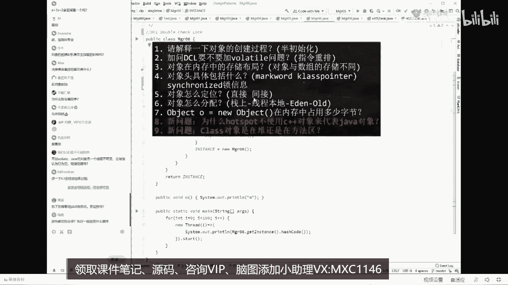

# 系列 1：P40：美团面试JVM七连问：5.加问：DCL单例（Double Check Lock）到底需不需要volatile - 马士兵官方号 - BV1mu411r78p

好看这里我们来看这小程序，再看这段代码，在这段代码开始执行的情况下，假如我们现在有两个线程，第一个线程判断为空，没问题，上锁没问题，判断依然为空，没问题，接下来有对象。

接下来我们假设第一个线程已经执行到哪步了呢，已经执行到这步了，这是第一个线程执行的步骤，已经执行到这儿了，回想一下啊，我们new一个对象的时候是三步构成，还记得吧。

这三部分别是new invoke special和a store，好，接下来，接下来第一个线程来了，thread一执行到这句话了，执行到这句话之后，new对象new了一半。

刚刚new了一半6t这里的m值为零，本来是正常值为八，然后呢调构造方法建立关联，结果正在这个时候发生了指令重排序，刚才我说过两条指令之间是可以互相换顺序的，哪两条指令换了顺序呢。

四和七这两条指令换了顺序，指令重排好，再看一遍第一线程过来的时候，六到了一半发生了指令重排序，发生指令重排序，会把a store调到前面了，a store调到前面是什么意思。

t直接指向这个初始化了一半的对，象来这块能跟上的，给老师扣一，啊那么大，你想一下t指相了一半的对象，指向了一半的对象，好正好在这个时候，第二个线程，第二线程也是执行这段代码。

它上来之后先判断它是不是等空，诶，你告诉我，你看这个内存的图，它现在等空吗，懂不懂空t等空吗，不等空，不等空的话，后面还执行吗，不执行是不是拿到这个t就直接拿来用了。

你的男朋友刚穿了一半衣服就出来见人了，不好意思，这个值只拿到了m等于零，你本来正常是应该m等于八的，如果这记录的是一个很简单的一个呃，比如说是那个双11的期间，这里记录的100万单。

然后突然之间的不是一访问，有一个线程访问到的是零反弹，来再来看一遍，仔细看第一个建成new对象啊，判断为空，上锁依然为空，所以开始扭扭了一半，发生指令重排，结果这个t指向了一个半数，第二个线程来了。

先判断吗，判断它是不是等功，一判断不等于空了，直接拿来用，结果第二个线程就用到了初始化了一半的对象，所以这个县城是有问题的，来大家听明白这件事的同学给老师扣一，但这个bug非常的隐蔽，有同学可能会说了。

老师你讲的这事儿不对呀，你synchronized是什么概念，synchronized的可是做了内存同步的，我的天，你做内存同步，你居然说能让我看到了另一半的对象，你不扯淡吗。

有没有同学有这个有这个疑问，synchronized的本质上是一个什么概念啊，它比较复杂，其实本质它的执行比较复杂，就是synchronnet做完的一个东西呢，必须得是内存的，最后最终同步完了之后。

另外一个线程才能看见，我再说一遍，打开我们的那个刚才那段代码，我再说一遍，synchronize什么概念，schronize的概念就是说我下面必须都得执行完了，我把里边的内存呢做好同步了。

我这内存状态改完了，我才会释放锁，其他的线程才能访问到里面的内容，我已经遛完了，你怎么能访问到我中间状态，你不扯淡吗，能听懂我的我的问题吗，来这块能听明白的，给老师扣个一，就是问题在这儿。

现在的问题就在于第一synchronized的执行的线程内部能不能重排序，第二synchronized的中间状态会不会被别的变现成独到，好听，我说我们先回答第一个问题。

synchronized执行到内部的时候，它内部的指令能不能重排序，这件事超级简单，我刚才讲了，能不能重排，取决于你是不是能保证最终一致性，如果能保证最终一致性，随便你排，同学们。

你们琢磨我这个先建立关联，还是说先给他初始化，最终的结果是不一样的呀，所以中间的这几条指令，您老人家随便换，没事儿，所以synchronnet内部重排序是没问题的，认真听好吧。

这里有很多那个别地儿说说法都是有问都不对啊，完全能重排，第二个single内部的中间状态会不会被别的线程读，到会，如果另外的线程执行的是同一段synchronized代码，它一定会读不到。

必须得等一个线程执行完，另外一个线程才能读到，但是很不幸的是，我想问你的第一个线程执行到了schnet里边代码，第二个线程执行的是哪个代码啊，它是在新出来的内部还是外部没有锁定的代码，能听懂吗。

一个执行的是被锁定的代码，一个执行的是没有锁定的代码，我告诉你这两个互不冲突，你里边执行的任何状态，外面都能读到这个东西，就是大家伙都是并发执行的，好了两个问题我就解答完了，就是取决于一内一外的概念。

这个东西呢我我vip课上给大家做个实验的啊，绝对是能向大家证明这一点好了。

现在已经是09：44，我说过我9。50会打广告五分钟，当然还有两大问题啊，就是这两大问题比较复杂，hosport为什么不使用c加加class，到底是对还是方法区，我一会儿给大家讲。

这里面尤其是第二个问题，尤其是第九个问题呃，最近被问到的，你想答得很全的，不容易，ok 5分钟我答一下刚才我这个问题的答疑。

看看有没有明白了，明白了是吧，嗯什么兵法之影，刚才声音有点小，没听清，大哥，你把你的声音放大啊，其他人都能听清，没听清你那边的声音放大好不好，小岳岳比心对，最大的，因为我这边一放大，它会有杂音。

你知道吧，我给你增益一下试试，五分钟答疑，刚才我提的我讲的这些有疑问的地方，你随便问，你把老师问到了，老师这课就可以送你任何问题，关于这位m呢，您老人家随便问好讲讲怎么讲，我刚才故意略过这个结果呢。

你非得非得让老师把这个事给你调出来是吧，听我说要不要加爆了条，必须要加wallet。

什么概念，就是你你在double check里面，double check里面，你要定义这个呃呃呃这个这个代理对象的时候必须要加volatile，为什么要加volt，原因是volt能保障你两方面的作用。

第一个呢叫保持线程之间的可见性，第二个呢叫禁止指令重排序，能听懂吗，叫禁止重排序，就是您老人家那两条指令，不就是刚才换了顺序的问题吗，产生了问题没关系啊，我可以给你禁掉，就禁止重排序。

所以必须要java，当然我怎么是禁止怎么禁止的。

这个东西要讲到内存屏障，今天的时间肯定是讲不完的。

忘了在哪看，说这里可以八有优化，有什么优化，都有哪些指令执行的，一般什么顺序指令，java大概是200多条，执行的什么顺序，一共有八条规则叫不可以冒犯这八条规则，只要不犯这八条规则，其他指令随便排序。

这八条规则我就不给你背了，但是这东西你不需要背过，因为它也比较简单，比方说你new出县城来之后才能执行这种规则，类似于这种的，能听懂吗，你放心，这八条规则里面从来。

没有哪条规定说我new了一半的对象不能赋值，所以刚才我讲的指令重排序是完全没问题，x等于一，x等于会丢掉第一个吗，什么叫丢掉第一个，你说说你x等于x等于肯定会丢掉第一个。

这条规则叫八条happens before原则，如果有兴趣可以百度1下，或者找咱们的vip听老师给你讲，为了给你们讲这个课，我可以这么跟你说，为了给你讲这么这个课嗯，基本上我市面上所有关于这版本的书啊。

基本上那个不是写jvm的人都不读的，人，全给你讲，全全部读完，所以关于这位m您老人家随便了，我跟你讲的这m课呢叫做总结了十几本书，外加上各种问题，外加上jm虚拟机规范给你总结出来的。

j d k8 针对这完美体优化，那多了太多了，这没法说了，就优化太多，因为你们这个优化什么叫jm优化，你看你问的这个问题吧，你说的那个为了中国人民过上那个美好的日子，你说这玩意儿怎么跟你说。

听我说有哪些优化，有些优化是需要你自己做的，元旦老人什么叫做jvm调优，能不能理解jvm调优这件事，就是jvm里面有好多参数，你需要进行调整，调整到你g m的自由状态，j v m的调有呃。

这个参数有700多个参数，这边的参数本身有700多，个常见的调优的大概是有五六十个左右，50~60个，需要你进行组合使用才能调优，我要跟你讲这玩意儿，你说我能给你讲完吗，起码今天讲完。

面试的时候经常这么的优化调整，你问他具体的，你说哪方面的，你比如说执行层面的，还有这种git，就是那个及及及及时编译，还有呃这种c one级别的优化和c to级别的优化，dk 18完美要用沐风。

你问的这个问题是。

美团的这个第九题哦还不太一样，但是也差不了太多，你问的这个问题基本上是每天的第九题，就是class对象是对象的方法去，实际上本质上跟你这有点类似啊，最终一致性判定表述的对它变音器的优化。

