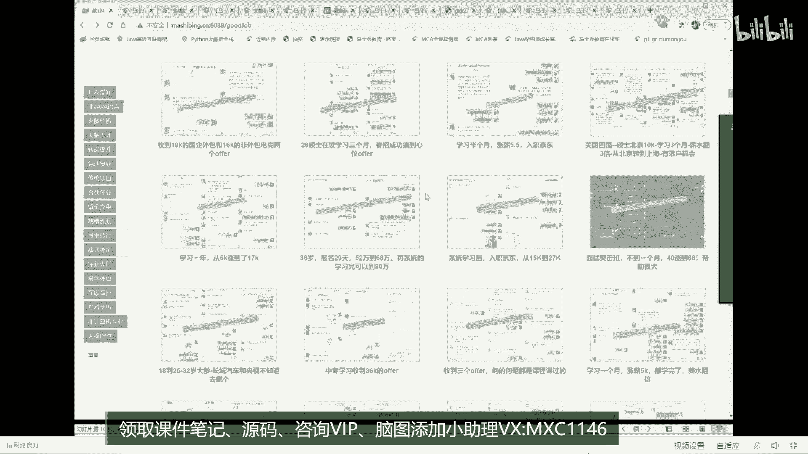

# 系列 1：P41：美团面试JVM七连问：6.马士兵老师Java高级架构师职业规划 - 马士兵官方号 - BV1mu411r78p

好了不废话了，现在是09：50，我说过09：50，我要做一波广告，很快20分钟左右，我给你做完，今天我讲的课程，大概是我们整体课程的小小的一部分，讲这个课，我们前前后后20多位老师，到目前为止。

我们讲了2400个小时的课，就这么狠，这个2400个小时是什么概念，2400个小时，腾讯课堂让随便找任何的机构，基本上没人超过400小时，我们课程2400小时，所以我们课程定价会比其他的类似的这种课程。

定价要稍微贵那么一点点，贵的也不多，是因为我们课程量要比别人大得多得多，多得太多，全网最深最广的课程，从2019年我们登录腾讯课堂，只用了半年，做到腾讯课堂的第一名，在2019年的过程，我们只讲了。

也就是说你想跳槽涨薪，三五个月，涨点薪水，我告诉你，2019年的课都已经足以让你应付了19年的课，你像我今天给大家讲的jvm实际上是gmm gmm多线程高并方案啊，这一部分这种的案例是案例呃。

就是案例式的这种实战化指导调优，这个呢就是你刚才讲的优化的问题，好吧，那么操作系统的原理，网络的原理设计模式等等，我就不给你展开了，当然分布式的东西vs keep live的消息中间件。

四个四大消息中间件，分布式分布式事务单点登录啊，分任务调度等等，还有呢resuper源码的nt rpc a rainbow，docker k8 s mysql的优化，fd fs。

open stic团队的项目的合作，海量的数据就是大数据相关的内容，还有职业的提示软技能，别人课程大概一周直播33434个，一次两小时，基本上大家伙想涨个薪水贼easy。

超级easy呃后来随着我们整个课程体系的发展，有学员会说老师我只有掌握了高中知识体知识体系，但是呢我还没有做过一些比较牛逼的项目，原来一直做c r u d，但是我想进互联网，我们有互联网级别的这种项目。

我怎么办好，我们补了另外一条线，这条项目线呢叫做项目线或者叫项目库，项目库，目前完成的九个项目，从比较简单的大学生级别的项目到比较复杂的我们大厂级别的项目，曹老师，我刚才说过了。

他是作为阿里的一线开发人员，在阿里做了很长时间，按照阿里的标准来开发对应的项目，这个项目呢叫网约车项目，关于这个网约车项目呢，我就在这里呢，嗯如果大家有兴趣可以找去找我们要我们网约车项目的白皮书。

听我说，我们任何一个项目都有对应的白皮书存在，我们任何一个方向也都有对应的特别细节的东西给你描述出来，关于这个项目从怎么去拆分啊，怎么从需求到最终怎么去落地，怎么说，蓝绿发布怎么做，滚动发布怎么做。

实战的这种网关路由怎么做，限流怎么做，这降级啊怎么做，怎么做，报警怎么做，观察第三版呢我们使用的是spring cloud奈飞，第四版呢我们使用spring clou。

阿里巴巴第五版我们使用的是第二代微服务，也就是著名的service mesh服务网格，那么第六版纯音原声就go浪加上k8 s，目前go on的课程也在更新这个里面，那好这一个项目的效果是什么。

不跟你做任何的吹牛逼，就直接给你看效果就行了，搜一下。

我只是说的这一个效果啊，这是传统项目通过网约车找的工作。

遇到企业加价留人，就是那个企业不放了，直接给它加价啊。

然后应届毕业生网约车项目21k的offer，哥们就是一个大专的，如果没记错，应该是一个大专的应届毕业生，那天超老师专门说过这事，项目呢由于超级超级重要啊，只是没技术工作。

技术小白，网约车15k小白，第一次网约车项目薪资涨5k不用干别的，仅仅这一个项目啊，让你长个心都已经足够足够了，尤其是那些c r u d的天天crud，做传统行业业务知识的。

更不用说后面的一级流量的这种项目啊，好加了这些项目之后可以这么说，基本上30万~50万通过这个拿到的概率就很高了，在后面的我们整整2020年的1年一直在讲的一门课，叫做mc的架构师。

这门课是我们整个课程体系的一个提升和补充，这门课呢主要是从实战的角度给大家带到一个架构师的视角，什么叫做实战的角度，再带到架构师的视角，我相信有的同学呢应该是嗯遇到过那种那种ppt架构师给你画个图啊。

前面是防火墙，后面呢有一大堆的k8 s，然后还有一堆的mysql的分部分表，接下来有一堆的那个中间的缓存中间件，但是很不幸我告诉你，你看那个图看了特别爽，看完之后呢觉得自己很爽，但是看完之后想落地没有。

不过在这里在我们真正的教务师课程里面，在这个项目里面，我们会从基本的这种分布式的架构开始，带你来帮你做架构师，搭建最基础的服务，分布式的爱迪生中心配置中心，索集群，事务集群，缓存集群。

网关集群注册中心监，控集群mq的集群，es的集群，分布式任务调度集群，pen的集群，mysql的服务集群，我告诉你一个真正的那种成亿级流量的，超级高并发的这样的一个互联网项目，到底是有多少个集群构成。

任何的一块他都可以动态的扩展，在这里会有咱们专门的老师在带你进行落地，所以这叫落地版的牛逼效果时，我们为什么说，我们帮腾讯建立了整个的t4 到t9 级别的一个课程的标准体系，但是我告诉你啊。

t9 级别在咱们这儿不算什么的，因为我们的课程对标到t 11是问题不大的，对于腾讯来说，当然除了这个实际落地之外，我们还有对应的理论品，理论片，分布式系统的理论基础，从派克从cp定理到base啊。

到各种的高可用的方案，高扩展的方案，高性能的方案到技术的底层的支撑，这个技术底层的支撑呢主要就是一些原理和源码，i o端中高并发，jvm gm ux内核操作系统技术底层的支撑。

为了应付应付咱们建构师的面试，好到算法课，算法课目前为止是可以单独购买的，算法课是我们左程云左老师这一门课400个小时，超过腾讯课堂大多数的其他机构整体的课时，这个算法课从，你最萌新的小白的算法。

开始带你一直逐步地走到我们的进大厂的这种算法，如果想了解细节，我建议你可以到到我们的网站上去访问啊。

在整体算法课里面，从那个最基本的算法概念开始啊，一直讲到什么二叉树递归，快速排序等等，这算是你你你搞完这个之后呢，就正常的，你你你学了一遍计算机系的那个算法与数据结构这门课，但是这门课不算完。

会帮你透彻的整个体系建立算法的概念，亦或相关的基础的数据结构，规定相关的堆，相关的前缀数，二叉树贪心并查集图，暴力城市到动态递归，好到这里的时候，恭喜你，国内的大厂阿里京东叫你开门没问题。

但是你想进国际大厂以及那些个比较看重算法的，比如字节，继续往后学单挑战矩阵b p f p l p r t算法，k m p mineh，莫里斯便利相对少数ac自动机对数器有虚表，卡特兰数四边形不等技巧。

后缀数动态规划，猜中web信息简化，大厂刷题班绳子问题有效，括号子问题，概率调整问题，矩形最大程度问题，放零食方法的问题，二代数问题，ru内存算法，这个可以说是必问的，也是最简单的。

l i u b i l l fu要简单的多，非常不重复，子串o就不一一念了，到立刻最受欢迎100题，以及今年大厂出现的新面这个汇总，这个呢只是我们整个课程体系中的这么一小块儿了，好除了这个之外。

分布式关键算法的支撑，派克索斯zab rap gossip，一直到线性回归，逻辑回归kn为什么要讲这些推荐系统，必须要有没有推荐系统的淘宝网，你能想象吗，底层原理的剖析源码级别的课去随便找。

能超过我们李老师讲的spring源码的，几乎没有，88小时帮你透彻理解spring源码，一把给你干到p7 ，为什么，因为直接给你讲到的就是spring定制化开发这个级别了。

spring vz买alex tom cat，spring boot，spring cloud m q e r k ney houseboard，redis，lindsey和mico等等。

这方面的源码课，我就不一一念了，好吧，基本上就是各种的服务架构的演进，从单体架构到微服务架构，从微服务架构到多级缓存，到分布式，到service mesh，到sevice，到大众台，ok。

在这我就不多说了，那么基础设施的建设就是网络相关的dns s的cd n的基础设施的解决，负载温度异地多活啊，h b d n s的实战等等，番外篇主要讲的是linux。

linux呢由于它内容非常非常的多啊，这个就不一一展开了，核心服务的设计，这里主要讲的什么呢，网关层怎么做，其实说白了就是网关层怎么做，然后呢又有逻辑层怎么设计，缓存层怎么设计，高可用怎么设计这种服务。

智力层怎么设计等等，那微服务的全站主要讲的是spring cloud到奈飞啊，spring cloud奈飞到阿里巴巴到持续集成到它的一些高。

级使用咱们阿里的老师带你讲这个spring cloud的阿里巴巴，这肯定是没有任何问题的啊，然后第二代的微服务snh基本上没有人讲这门课啊，我们是从19年就开始开始讲这门课呃，怎么说呢。

就是这些个叫什么金丝雀部署a b测试，回头发布啊等等，我这么跟你说啊，就是我们对于前沿性吧，我这块想超过我们的其实也不多好讲，大数据的全站从这个呃数据的存储啊，到批批处理，到流式处理，到实时计算。

到数据库，数据库，数据库，数据导啊，深度框架的这种分析啊，离线的分析源码的分析嗯，好，吧不说了，什么离线数仓啊等等，说句这里，好到service mesh的落地实践到我们的人工智能的加成这块。

主要叫做推荐系统到服务质量的保障，csd啊，到测试到运维到我们的一些虚的东西，学的东西呢主要是留给更高级别的人听，你真到了p8 p9 级别。

这些东西也是可以给你加到你的你的你的value的课程内容比较多。

假如说从一个嗯简单一点的角度来跟大家讲一下，因为我们课程体系呢呃相对庞大一些。

我从简单一点的角度来向大家尝试解释，这个课程体系大概是一个什么样子的。

可以这么说，这么来理解整个mc的课程体系大概是分成p5 就业课。

p6 讲新课，p7 的架构和p8 的精英课，源码大师课，is stel的服务网格，可这个呢掌心来说。

那肯定是小case了，我就就就就就就就就不能说了，为什么我们讲新的架构设计是给你举个例子，所以，好这哥们儿是90万年薪概念。

腾讯，你仔细看，这是我们学生里面，你看看腾讯面的什么问题啊，架构设计看了吗，我们专门的3月冲刺班里专门讲了这个架构的设计。

这个钱90万值90万，实战落地的项目可从整个项目课来讲，九大项目今年我预计会扩充到20个项目左右以后，你说你简历上没有项目科学，没关系啊，来咱们这另一个就可以了，就业指导，我们3月的冲刺班，3月冲刺班。

4月突击版，这两个班到底有多牛逼。

还是那句话，实践来说话，大家注意，这是一些同学的聊天记录，我们做了一些那个隐私化的隐藏，但是我需要告诉你的是，你随便去找任何人做掉，对你说我们有任何ps的地方，你随便找你找出任何一个假的来。

我们十倍学费赔给你好吧，全部的利拒绝造假，我知道有很多人能去拿这玩意造假，但是咱们这儿真没有看这里，我就说这个这个这个这个土地班这事儿吧，看了吗，一个月突击涨薪70%，一个月时间一个突击就可以了。

突击40年12k武汉跳北京突击课帮助真的很难，阿丁老师，我们先拿了一个22x14的offer，暂时没有进到大厂，感觉面试突击的劲儿用完了，问的比较深的东西暂时没学到，因为他就干了40天。

就干了一个突击课，你懂吗，其他的什么都没干啊，算满意吧。

突击课真的帮助了很多，这里面呢一共有19条。

我呢就不在这里给你一开了，传统企业突击一点。

五个月涨薪4k ok，好了，特色就业指导课单元的面试冲刺课，这个一般我们称之为叫突击班e的搜索的专家课，ai基础前端课，算法的小白进阶大厂，立刻听我说，叫一次付费，持续更新。

那么除了这个一次付费持续更新的课程之外，我还送你100赠送一期单独拆分的go on的全程的就业课，测试开发的系列课。

大数据就业的系列课，python游戏前端游戏，后端成员英语和数学日常的软件能系列赠送一期一期已经足够，不要把我们赠送的一节课当成一个特别特别那种，怎么说特别水的那种东西。

有时候在老师这儿的赠送甚至会超过一个机构的差不多，总体的课作为go on来讲，也是好吧好了呃，我对于我们整体课程的介绍，我就介绍完了呃，不知道大家听清楚没有，我说过我有20~25分钟左右的一个广告时间。

差不多时间快用完了，我的广告也快介绍完了，这么跟大家说。

我刚才说了，由于我们跟腾讯这边要做那个认证，为增加了很多成本，因为腾讯要请人在腾讯内部帮你做认证，这个成本是很大的，所以呢涨价1000块钱，目标在即，大概今天还是原来的价格，从明天开始涨到涨100。

从明后天开始涨200，你信你就等着看，你试试看就知道，所以对课程有兴趣，今天晚上的送大家20个原价购买的名额，好吧，剩11个，收完为止，请大家呢找到咱们的小姐姐，加到小姐姐之后领优惠券。

在现在的14980的基础之上再减掉2500，2500块钱能听懂吗，最后的成交价12480，今晚剩11个名额，还是那句话，课程牛不牛逼，我不希望呢就是各种的细节让我说的太多。

因为细节上的东西你有很多地方可以去查，第一个我刚才讲的这个x方的图，第二个我们自己的网站，关于数据结构呢你自己去查，第三一个我们自己网站里头有关于mc的介绍，你也可以去查mc内部。

我们给大家伙简单的列举了在我们mc内部讲的关于p5 的知识，像这些知识呢你都可以自己查看，看自己对比到底是一个什么级别，其实这块呢列的不是非常的科学，因为在大厂来讲，p5 和p6 往往是一个职级。

所以你不要认为说你掌握这个预算p5 ，实际上你也需要掌握一定的p6 的知识，p5 和p6 是一个值，给它怎么划分的，应届生你就算p6 水平定级也是p5 ，好在p5 的基础之上，有3年级工作经验。

基本上就到p6 了，那么所以p5 和p6 再强调一下，是一个质地，叫两，个密不可分，所以你想让自己定位在p5 级别，你也p6 的这个内容，你也必须要掌握基础素质素养，高并发的方案，高可用方案。

高扩展的方案，通信和调用缓存中间件，消息中间件，搜索中间件，存储中间件，分布式锁事务，分布式的配置，注册与发现网关路由服务调用负载均衡登录器，分布式的消息链路追踪预警和监控权限控制。

分布式的其他专题安全问题，大数据分析算法能力的深入到这儿，你基本上到p5 级别，想到p7 继续往下看，在这儿呢我就不一一的给你给给给给大家介绍了，咱们的网站上去问。

如果你想了解某一个体系，比方说老师我就想了解go浪，你能不能给我介绍一下，找我们了解需要白皮书，每一个内容我们介绍的都比较细致，但是我要从头给你介绍这玩意儿呢。

我估计有两小时才能把我们整个课程体系给你介绍完。

没关系，我给你打开这个白皮书看看就可以了，这是我们算法和数据结构的，这里目标是混合全能型的人才培养啊，那没有做好目录，不管他那么，进去了就会收器啊。

bbc搜一下白皮书。

挑一个吧。

嗯这最近打开的我来看一下go浪的课吧，嗯在整个go on的第一第一版的课程里面，送大家在这一版里面不够基础，开始到go的各种model，go land的各种优化，主流的外部框架的对比。

这个框架的源码的解读，这框架的入门restful api啊，到那个呃，这这里主要是go web了，然后在go web的基础之上，这是go web的基础之上，项目的单体的应用。

项目的这种go的微服务的应用啊，怎么去这个docker k8 s promi普罗米修斯，然后结合起来做狗微服务的应用，到讲什么呢，到我们的呃呃k8 s的源码的解读，解读到这个深度就是一期go浪的课呢。

基本上也能让你达到go浪专家的水平，所以不要把老师这现在还暂时还送你的课。

你还能薅羊毛的课当成一个可有可无的东西，因为我呢呃是站在一个架构师的角度来帮大家设计课程，一个架构师来讲，如果只局限在说，我就会一种语言。

而不是说能够灵活地运用整个结构啊，什么样的语言该做哪块。

什么样的语言该做哪块，到这种程度的话，你的薪水实际上是高不了太多的，所以想追求那种比较高的薪水，照咱们这来做，照着我给你安排的路线来做好吧，有没有课程的内容呢。

我大概就介绍完了，然后呢别的呢我就不想多说，只看课程效果就可以，我在这里有很多有可能会问我说老师你这这么多的课，我什么时候才能学完呀，同学们听我说，我想问你一句，你从小你从八岁开始开始上小学。

从六岁开始上小学，到现在为止，知识你学完了吗，没有完，想追求一个自己的终身的发展，保持自己的竞争力，现在是一个知识非常爆炸的时代，我那天去通通去听那个腾讯的呃，这个会议啊，咱里面有一个。

他说了这么一句话，我觉得真的挺对的，他说现在这个知识啊，你昨天学完了，今天早上起来很有可能已经被淘汰了，就是这样的所有流程化的中，这个指指这个流程化的东西，就是总而言之，甚至你现在连保持都保持不住。

所以我到现在呢我也没有说想跟大家伙什么事情都做完了，没必要做完，跟着老师扎扎实实地学，我们呢对于你的短期的需求，会做那种定制化的一对一规划，什么意思，你说老师我就想一个月，我想找点薪水。

你能不能告诉我一条路线，根据我的这个自身情况，我又想一个月涨薪，老师你能不能帮我。

有的是入学一个月涨薪70%的，报名一个月，传统企业干净小米了，薪资还翻了倍了，知道吧，老师现在先到哪哪上班，恭喜与美日优先，这怎么还有这怎么还有这种人家每日优先，后天还要过来做招聘呢。

这个咱们小姐姐注意一下，这个这个还是给人家引掉比较合适啊，特别感谢我们已经推推广我们之间的同事和小伙伴了，你想想看，如果说我们课程不好，他会推荐给他的同事和小伙伴吗，我这边面钱给的也不多，然后恶搞恶搞。

但是虽然钱不多，相比之前的工资也翻倍了，你说他得多，凡尔赛，他跟我那说钱不多，但是呢比原来的工资还翻倍了一个月，知道吧，这就是我们课程的水平，offer谁给的offer是这个另外一个人给的offer。

是这个加7万股票综合考虑，所以选了小米给。

就是你想多长时间干到一个什么内容，干到一个什么水平，老师帮你设计一条路径，这条路径给你设计完了之后，你就会少走好多好多弯路，这是我们所能提供的最大的价值之所在，a大家能认可吗，是不是有任何一个行业。

如果有一个牛逼的人带你，是不是得好得得得省好多弯路，能认可的，给老师扣个一，这件事情很难很难被认可吗，对没错，就是各个人的需求情况来给我帮你制定这件事儿啊，还有啊这个你像应届生滴滴的offer。

年薪29万，这是硬件啊，你像那个嗯t3 荣耀的offer，25到年薪的35万，你像这个是45岁的一个女生，涨薪50%，老师真的超级给力，呃这么跟大家说啊，就是海外的留学生学我们课程其实也不少，也很多。

他们会过来，为什么选我们课，因为这个真的不管你是在海外还是在国内，给大家伙的帮助真心比较大，呃最近阿里的收购的那个东南亚的电商也在找我们做内推啊，说你们有没有学生，能不能帮我们推一些。

听我说所有海外的想回过来来就业的，来我们学完直接给你推阿里，当然这是阿里收购的一家企业，东南亚的电商给的薪资比阿里本部给的还高，迫切急需人才。

这个算是比较差的了，这个没办法，因为他这个学历的问题，当地20万美元的offer，当这个人家是在北美了，昨天我拿到第一个offer了，前来还愿哪家的offer，没说啊，这个就给给你盖了而已。

给他咋样满意吗，感觉还挺多的，200k我甚至还没有呃，还没面过过那些大厂一次就过了，算一下，想签就签，牛逼的人才会有更多的选择，1月份报的名。

4月进阿里，这就是我们课程的速度和，这就是为什么很多企业愿意来我们现场做招聘，你知道吗。

再跟大家说一下，24号今天报名，明天老师帮你改简历。

24号也就是后天参与我们的4月份的内推招聘会，4月份参与内推内推招聘会的企业，这么多2021年042020210424的招聘会，现场招聘的企业，京东的一堆，百度的一堆，阿里的一堆，这是大厂的。

当然也有外企的for works，有高有低，我们挑选企业的话呢，也是涵盖咱们学员的那个各种各样的一些特定的情况，不废话了，我的广告就做完了，下面答疑时间，十点半，我会继续把剩下的技术讲完。

各种各种就不用买了，然后我就不给大家做广告了啊，还有六个名额，还是那句话，就是我们呃是真心会涨价，想薅羊猫鸟抓点紧。

就我们这课我跟你说，卖2万都不觉得多。

你就这么想啊，就是400个人家那都不到400个小时，两三百小时的课就卖你6000多块钱，不信你去看啊，多希望你多做比较，我们是2400小时。

目前还在中间，我不想给你拆分了做，你要想买也可以拆分着买，所以随你啊，呃算法是可以单独售出的，出售的大数据就业也是可以单独出售的，到目前为止，这两个已经拆分了，5月份过后。

行我就大概介绍完了，我这广告打的怎么这么没激情啊，mc是啥意思，mc的全称叫马士兵，certified architect，叫马士兵认证架构师，看来主要对手这是这是谁，没看懂，没有对手。

我们的课程没有对手，任何人只是说把我们当成假想的对手而已，但是本质上差不多，希望多做比较就行了，o，马老师需要学一下直播带货的小姐，你教教我，现在是10：21啊，收完为止。

哈哈好吧，对课程有疑问的，对那个对课程有疑问的，对技术有疑问的啊，大家随便问啊，这技术能问到老师的，算你牛逼，对课程能问到老师的，当然你也问不到，哈哈哈，我等听最后两道题，十分钟以后啊，八分钟以后。

十点半我们准时开始啊，下周一面美团。

希望八人都到了，好运啊，我就我就想多说两句，结果还不如打开物料，第一个就是说我们的课程是受到厂商的认可，这一点大家能理解吗，这小伙伴直接面面京东的时候，面试官问从哪学的，就直接说的嘛，我说知道挺有名。

杜远程回答的比较好，当场知道吗，当场直接过的o估计没准面试官也是我们学生，这个有可能呃，所以呢在我们的内推里面，其实有好多厂子呢就直接找到了那个阿里的是最多的，因为我们阿里的老师比较多。

就通过他们往里往里推，成功率都会比较高，你像字节的话呢，就差不多离我们直线距离5百米，这个也是内推的渠道也是非常通畅的。

这是去年4月份的时候，就是我是字节跳动直播平台的研发负责人，看到课程资料就觉得应该有不错的学费退给我，直接安排面试，这是他负责全球所有的，直播平台研发负责人牛逼吗，核心部门我们已经有同学进去了。

这是他的一个工牌，就不展示名字了，在字节的你可以去问一下是不是后缀，是不是叫什么涛啊，就是说我再给你说一遍，内推一线大厂的渠道非常通畅呃，如果是说这种你你的目标不是什么一线大厂，其实我们帮你改完简历。

直接拿去投，效果就已经足够好，不需要你学多长时间，业余的时间，周一到周五，我希望啊我个人希望是你能学到两个小时，像周末的话，我希望你能够每天六个小时，你不需要很长时间的关键，然后你每天一个小时。

你就稍微延长一点嘛，关系不大，其实我觉得我们课程最我我最自豪的一点是什么呢，是短期就比较给力，我不需要像线下的跟着脱产学，五个月，八个月，九个月，一花钱就是三五万，再加上吃饭，甚至都到好好多好多钱花好。

多好多时间你还挣不了钱，线上你看到了吗，一个月薪水翻倍了，o那个，拿了58万年薪，这哥哥呢是传统项目到三家互联网大厂的offer，不知道该怎么选，三家offer日期的硬件的等等等等。

永旺三家offer都将近年薪百万o，报名一个月，传统企业进小米，还是那句话，你记住这一点，老师教你的路线叫做最短路径，叫做捷径，叫做每个人根据不同的情况走的一条捷径，你像嗯说一最简单的吧。

就去年我们一个一个过时的路径叫做6+2啊，这个你看到了吗，6+2干了一半，薪水到六呃，6。5~16。2呢是我们2019年推的一条路线，这个路线叫什么，叫做六个基础课加两个项目叫6+2。

其实呢你如果你想追求比较短的3+1，如果你想特殊的一个情况，你在在在在校大学生6+1，说你大三的7+1+1就是每个人每个不同的路径呃，从一些个我们过去的总结的经验来看，大概呢粗粗的我们画成了18条路径。

这18条路径你可以对号入座，大概是这些大学生等非经济专业的专科的，海归的，冲刺的，外企的，转行的，跳槽的，镀金的，大龄的，非java语言的等等，有的是三家a da，有的是四加油的什么。

还有根据你个人的最终的实际情况，需要了解到你的背景，才可以帮你定制比较科学化的路线，这就是为什么能够有的人呢他的他的他的效率特别特别高，一个月涨薪入职京东，你说这钱花的值不值，你自己琢磨吧。

涨到最低最低的哪怕就45k一年也6万，学费1万多块钱而已，应届毕业生字节跳动，成都5k到10k薪水翻倍，还是那句话，我希，望你们报老师的课是出于效果，而不是听老师说广告打的多花哨。

打花哨这事呢还真还真还真不好不好做，我有时候觉得罗永浩直播带货啊，感觉也没啥呀，发现真的自己要带货的话还是挺费劲的，c sharp转java大概需要多久，如果你是做点是学俄罗斯ring cloud。

干净用油涨了50%。

长点神他不香吗，别卡有的棋不卡，这东西呢你不能叫一个而论。

有的人人家就在乎必须得1米7以上的，你1米65的就别考虑那些就完了吗，天底下我也不说那么多，非得选他们家吊死吗，看学历，大专负债50代职大专生职业第二春，当然这个是这个这个跟学历关系并不大。

它主要是负债，大专生错过阿里入职申通，申通也不错，二线大厂嗯，干满1年再充一些吗，为什么错过了阿里，阿里打了两次，打了八个电话，他都在面，申通正好没接着，这就是天意，这个没办法，你这属于倒霉。

不然真的进阿里了，大专生嘛，大专学历，多家大厂的offer，感谢我们的课程，接触了不少东西，按照周老师讲法，就是认知偏差是吧，经过三周面试，到目前为止收到了不少的offer。

真是想不到大专学历的我也不再只是那些中小型公司。

看我去面试，艾琳大专没工资到就业，薪资翻一倍，刚才那个21k应届生大专毕业，如果你听过那天我们的直播课，这个应届生的这位同学远程还给咱们学生专门讲了，他是怎么拿到这个offer的，同学们是这样的。

学历呢是你短期内改变不了的东西，所以提能力让别人降低啊，企业看来呢来降低你的学历对你的影响，截下屏，然后那个微信打开扫一扫，打开你的图片就可以了，c语言讲什么语言都行，你这还停留在语言呢。

你这个呀我跟你说，你这境界呢就是不涨，我那个教过很多人关于境界的问题，就是你这个人呢能挣多少钱，达到什么样的一个成就，跟你的眼界那绝对是正相关的，你眼界到了，你才有资格享受这个回报，还局限在语言上的。

我再跟你说一遍，boss直聘关于北京的所有的职位的调查，薪资排名第一的叫架构师，排名第二的叫ai算法工程师，这两个是你们将来赚钱的追求，追求薪水，你比方说像这种年薪百万的这种奔着这两个方向走。

有可能会达到，如果不是这样的，你打不着达不到你c语言再牛逼，你给我找一个做c语言的，说普通的一个就是正常的，有一定的比例的人能达到年薪百万吗，记住架构师呢它本身不局限在什么语言。

你说拿一个这种互联网的流行的这种高并发的架构来讲，它前端呢一般我们就称之为叫网络接入层，然后后面呢是我们api的接口层，后面是我们微服务层，在微服务里面呢，我们就中间有什么呃。

这个监控要控制这个降级限流熔断等等，服务治理层，然后呢中间有缓存层，下面有大数据的存储层，数据库层，每一块都可以做扩展，每一块都有n多的产品做扩展，当你了解了这些玩意儿之后。

实际上呢你说这个语言到底是拿go来做的，还是p h p还是java，它重要吗，真的没那么重要，真正牛逼的架构是叫做能把这些架构采用合适的东西给搭出来，这个叫架构式，那这会儿能听明白的。

老师扣个一就这么跟你说，呃其实go语言做这样的架构也可以，java语言也可以，p p也可以，我不知道你了不了解呃，那个我记得阿里有一个特别牛逼的人，从国外facebook挖过来的，他只会一种语言。

就是菲律宾，但是在阿里研究什么东西，所以对他们这种人来说，为为为什么我们课程里讲很多的基础的内容，讲算法，讲计算机的底层知识，你说它跟语言有关系吗，关系其实真的不大，但是为什么要要讲这些基础不牢。

地动山摇，你能站多高走多远，要看你的基础有多牢靠，所以他跟语言没有关系并不大，我们虽然叫java。

以java为主，是这个，你像武汉跳北京40天涨了12k。

那薪水虽然不算很高，涨薪幅度很高的，比如说啊我们说我们说这种涨新的，就就就不说龙湖地产15x12~20x10吧，你说涨了多少。

你自己算吧，36万，原来18万张，360000等于是那个翻了一倍吗，我说找点那个绝对值高的好吧，不不不，找这个这个这个这个绝对值不高的，因为绝对值不高，让你涨个薪水，那真的跟玩儿似的。

你说你1万块钱让你涨到15000，我跟你说，我给你改改简历，给你三天时间，你就到了一点，不夸张。

但是比较难的，实际上你像这种的29天52万，涨到68万，干到80万，等我都学完了游戏，把算法学一遍，拿到80以上应该没什么问题，我们学生就是这么自信，老师教的太好是吧，原来年薪25，现在给51万。

他们公司涨近30%，这算是非常特殊，给他分配了，你们这技术教的太好，也是麻烦事，因为他担心cover不了吗，这是突击一周的面试突击课，20年的毕业生涨了4k，你说我帮你改改简历，让你从1万涨到2万。

涨到15000，你说真的很难吗，反正就看效果，小试牛刀，两个40万的offer，年薪60万的offer。

年薪120万的offer，刚才那年薪90万的我，你总说这是比较高的，有高有低，每个人情况不一样，跟自己比，今年我赚年薪15万，明年我赚年薪20，你就想想，只有他的标题带了牛逼俩字。

其他的都没带，迄今为止最牛逼的学生公司，给了5000万的股票，已经套现，全国游了一圈儿，离职了，然后进了腾讯。

这是他呢给到大家伙的一个小小的建议啊，我在这就不给他展开一一念了，怎么说呢，机遇加努力改变你自己的命运，不要在那天天煮青蛙，在那儿天天打游戏了，这么跟你说，你还停留在让自己不进步。

指望着说我跟这玩个几年，后面呢还能拿到你现有的这种这种待遇，恐怕都不容易好吧，凑个整吧，现在是22：38，不小心时间超了，我们22：40，我给大家讲剩下的两个问题啊，5000万直接财富自由，是的。

每年的理财收入接近500万，他亲口跟我说的嘛，啊想看看他的简历吗，还有两分钟有没有有有没有人想看他中间的某个阶段的一个简历，扣一把衣服扣起来，我看到满屏一，我才会给大家看这个简历。

在我们简历模板里面有一个29岁，年薪120万的简历模板，就是他的，在这个简历里面不需要你聊太多，分布式高并发高可用大数据量的系统设计经验及研发经验，我就直接告诉你，这是整个简历里最值钱的部分。

个人技能不一样了，我们课程里头全涵盖，放心老师的课，让你怼到120万以上，没有任何问题，当然在你没有学完学一部分的情况下，你说从二三十万说我涨点钱啊，涨个百分之三十五十的，那真的很轻松，ok，就到这吧。

已经2。40了，我们讲完剩下的一点点技术内容，怎么还往还带往回吐的呀，是不是有人有人往上增加了，应该是有人弄了之后没付款啊，你签完要抓紧付款啊，我估计是这样的，你的那个优惠券没有领，听懂了吧。

领完优惠券会在这个价格的基础之上再有相应便宜，便宜2000多块钱，还有一个呢需要大家了解的是，需要跟大家说清楚的事呢，现在有一个叫做零元入学的政策，就是你前面如果说你你你你你本身经经济经济比较紧张。

前面六个月不用你付钱，要3月让你把薪水涨上来，甚至你，才开始交第一笔钱。

嗯我们聊完最后遗留的两个问题啊，看这里呃，这么大家说呃，第八个问题和第九个问题呢会相对复杂，这块呢你仔细听，认真听，能听懂就听，听不懂的你就直接帮你打开一个思路就可以了。

看这个思路叫做为什么不使用c加加对象，直接表示java对象，我直接告诉大家答案，这个答案是这样的，c加加对象和java对象的主要区别，这块由于很多人没接触过企业家，我直接说结论能听懂就听听不懂。

就算是因为c加加对象里自带了一个叫做virtual table的东西，这个东西呢叫虚函数表，来学过c加加的人，能不能告诉我这东西是什么东西啊，这东西是实现c加加多肽的关键。

本质上java实现也是通过这玩意儿来实现的，只不过java里面把这个虚函数表挪到了class文件里面，好有没有理解这个虚函数表的，有的话给老师扣个一，有吗了解虚函数表的，嗯rin rin rin嗯。

不懂是吧，不懂就算了啊，总之可以这么说，c加加n的对象里面比java对象多了一个东西，所以如果还采用这种来做这件事的话，那么java对象里面他的它的大小会膨胀的比较大，java追求的叫做紧凑紧凑。

你懂吗，就是它编译出来的class文件，它会非常的紧凑，会追求字节呢相对的比较小，因为原来java设计师在网络上进行传输，那会儿带宽没有闲的这么宽，所以在c加加里面，在java里面设计了两种两种东西。

把这个虚函数表从对象里头挪走，虚数表挪哪去了，挪到了class文件里面，所以，叫做oop class 2元模型，不懂就算了啊，这个问题相对复杂一些，难一些，好，我们来看这个问题。

就是第九个问题叫class，这个实力究竟是在method area还是在hip里面，对java的实例方法都是虚方法没错，所以它的class里面全是虚方法，这个问题这个问题如果说呃一个中小厂在问你的时候。

你就直接class文件肯定是在methoda的，这个不用说了，肯定是在这儿的，但是我告诉你，在一个hosport的实现里面，比方说我们new了一个大o对象，这个对象本身是在class，是在堆里面。

这个对象指向的class文件，它会位于我们的方法去，这个方法就叫method area，但是注意的是，这里的引用指向的是一个c加加里面的一个对象，在这个对象里面又有一个引用。

这个引用指向的是堆里面的关于o。class，所以严格来讲，o。class是位于堆里面，为什么放堆里方便反射调用，方便反射，所以来讲class文件的信息由两部分构成，第一部分是c加加的内容。

这是关于这个class的一些原原数据的信息，第二部分呢是关于呃可以用来做反射的older class的内容，这部分内容放在堆里，这部分内容放在method area里面，好同学们来这块儿能听懂的。

能get到的，给老师扣个一，已经报名了，我升职加薪之路就靠你了，老师你来就是了，老师要让你升不了职，加不了薪，你任何人都不可能让你做到这一点了，就，好了，当然这里面还有一个没get，他哪没get。

你得问出来，我这几个名词你哪没明白，什么地方没明白，比方说我们常见的这种jvm的内存溢出，jvm内存溢出叫做out memory，而这些对外m内存溢出，实际上这里面的对象变多了，内存里面装不下了。

还有一种内存溢出比较特殊，这种内存溢出呢叫做mt space的溢出，有没有听说过permanent generation，永久区的溢出，好这两种东西，messaga，还是用jvm，你随便问问导老师。

算你厉害，就是哪儿没哪儿有疑问，你得你得你得你得说出来冲出来，这么不给面子吗，我这啊抢完了是吧，我确认一遍，我还说呢，这么不给面子吗，口干舌燥的十几个名额，讲不完，有点过分了，ok，什么是放射。

不是放射式反射，我有一个问题，我抢到了，但是我舍友没有抢到，怎么办，那就明天涨100块钱要呗，还有优惠吗，导致内装载三过程加载链接初始化和今天的第一行对应一下嘛，完全可以加载链接初始化。

我vip讲那个jvm的第一堂课就讲了，跟这个是一一对应的，对象创建过程你还记得吗，就是它的成员变量呀，它的成员变量中间有一个半初始化状态，对不对，类的加载过程叫做它的静态变量。

有一个半初始化状态能听懂吗，我一句话就给你解释了啊，静态变量半出手状态，一对一定制化，p8 p9 的课程强加密，我们是采用了国内一家另外一家那个专业专门做加密的，这个加密平台比较特殊。

第一绑定你的计算机，第二绑定你的人脸，就是你看我们课需要打开摄像头，让摄像头看见是你这个人在看，而不是别人，第三一对一的定制化，第四企业过来直接内推招聘课程的含义啊，t4 是什么级别。

t4 很便宜的一个级别，大概20万左右的年薪，第四大概就这样一个级别，老师咱们有内推吗，有必须有，没有听明白，能说小心点吧，老师什么地方没听明白，你说有啥问题你直接问啊，类装载的三个过程。

就是我刚才跟你说了吗，你有一个对象，他有个成员变量小m我这有个为零的状态，对不对，如果这个小m是静态的static类加载的时候，它中间有一个为零的状态，类加载完成之后，它才会变成初始化的值。

就这意思就是一个静态变量和非静态变量的区别，t4 对比p7 不是你不要千万别误导t4 ，离p7 远着呢，内推走哪推推给hr，现场内推推给直接的项目的负责人，腾讯跟阿里系的不一样。

对啊腾讯大概t4 差不多就相当于阿里的p4 左右，p4 到p5 ，像t5 到t几t5 到t t t t t左右，差不多相当于是阿里的p5 到p6 减吧，应该这么说，像那个t9 左右的话。

他们要是p6 加p t减这么一个过程，按薪水来说不就完了吗，按薪水来说，按薪水比较，t4 加给了22k22 k20 多万嘛，正常也没有什么太多问题，计时多少钱，百万左右，老师哪些企业算大厂。

在老师我的眼睛里，大概有12 三家大厂，分别是百度阿里，腾讯京东，美团滴滴拼多多，像最近的话，那么华为蚂蚁嗯，比如说还有像国际的大厂，这个微软，facebook，谷歌，亚马逊这些，这里的一线城市。

西安这边，西安这边，你就找西安那边薪水最高的二三线城市，我们课程的百分之五六十对标你们城市所在的前5%的工作岗位，一二。

35岁五个月涨5k进华为，这个还正好卡在年龄的时间点上嗯，西安的，三个月西安找金时可以带团队的28k在西安已经很好了，我不了解28k在你们虽然算算是很好了吧，应该张老师原来是吧。

三个月在西安涨10k老师的课值值吗。

应该还可以吧。

底层细节还需要慢慢消化，去年做生意赔了几10万，现在面试基本平衡，7月底数学西安阿里的p6 ，我没去p6 面，过了阿里的，但是我去不了自身原因出不了手。

不知道他因为什么没跟我说，反正就就是城市来讲呢，不是问题，就是你的应急能到位了，你觉得城市能够限制你的发展吗，是的，先28列对，那就对了嘛，家养老也不错，作为年轻人，我不知道你多大年龄了。

年纪轻轻的就想养老，我也不，我也不知道我，我这这这还能跟你说啥，作为62岁的，我还在一线拼啊，您这个倒好，年纪轻轻的就想着养老了，哎呀妈呀。

苏州微软在等我，苏州微软，我们好像还真有学生进去找找，我忘了就没了，苏州，苏州，希望20~30，25左右吧，然后简历模板看了，感觉人家是很体系化，周四的时候，20号的时候跟我说。

最近周四的时候忘了周四了，每个月差不多两个offer，还是老师特牛逼，简历没写好，面试都能过，苏州小地方大牛没有到一线城市，指评机组合上海回苏州还涨了5k涨了5000，而且是上海回苏州涨了5000。

还给我们推荐推广的过程，对嗯可能比较认可才会推广是吧，这个就比较他薪水比较低啊，所以那个涨涨到11k就太轻松了，其实工资已经涨到7000了。

基础稍弱的，让你整个心就老师这课来说，稍微指点指点就够了，嗯还是那种就是说大家伙平时花钱的时候嗯，反而是跟大家自己息息相关的，能够给你带来更好的职业发展的这样的一个机会，反而就不花钱了。

我也不知道是你们是怎么想的，这里是再重新再重复一遍，这里是二二十多位来自于一线城市，一线大厂的老师嗯，就是我们这什么竞争对手谁，您老人家随便找找出任何一个机构说。

肯为你花20多位一线大厂的老师来为您对一门课的老师，这课就可以送你，面试太难了，你就拿我们面试突击班，面完就是学完，你都不会不会觉得面试太难了，电视太难说明什么呀，基础不足吗，不够吗，简单吗，22：

56：04分钟，我今天的课就讲到这儿了，有什么需要跟老师交流的呢，你抓点紧，哎呀提前面试我就难受，难受就难受，学到了最后面试官对线，哦看看那个还有没有同学跟老师交流的啊。

当然是说老师做了3年java两年的前端，随便找一个java找找感觉，然后找到了之后操作可行吗，不可行，就你这种规划，你还是找找老师给你好好规划，优化这件事呢比你想的重要的多，规划这件事比你想的重要的多。

有的人为什么一辈子混学历挺好的，混半天混不到城区，有的人为什么学历一般般，但是老师帮你规划好，进大厂就相对容易，就是你的需求，你这个你这个基本不可行，什么情况，嗯自学看天赋，没人带，很慢的。

有学历教你们高分学学瑞说的很对啊，选比基普通21120年毕业生，大概年薪大多数，现在是13个行吗，老师了吗，如果成不了二，老师的钱退你了，就是你现在13，我我我认为你现在是在北京，我们拿拿北京来说。

如果说成不了二，然后这钱直接退，你太简单了啊，上去说是美日经济能不能直接录取，有可能，就你这个我就这么跟你说，你20年毕业吗，你跟着老师这课，这课学30岁左右，年薪百万的可能性都是比较大的。

这不是我说学生说的，找找，完了我就跟你说一下你学生原话吧，就是后悔他他挺后悔，如果从毕业开始学，从毕业开始跟着老师走到30岁左右，年薪百万的可能性极大，原画，211的学历对你来说太轻松了啊。

要学历好的也是很重要的一个竞争竞争竞争竞争点，金道长有希望，40岁16年经验，希望很渺小，希望你，我建议你把你的目标定在掌心上，而不是定在进大厂上。

如果你一定掌心，就相对容易得多，39岁大龄程序员薪水翻了将近一倍，奖金大厂，37大龄程序员，不是这个不是那个37的，37 两个月左右，55万，70万，甘地美团达成，他原来拿55万面积。

大概涨了27%，告诉你仅此一例，我为什么说可能性不高，到目前为止啊，除了没告诉过我们的仅此一例，40岁在想进大厂晚了，没学历只求掌心，当场进不去，没学历你不会补学历啊，这还不简单，不是没学历。

也不是说一辈子就没学历啊，简历模板给你看一眼，42岁，44岁的大专生，年薪100万~160万，这是他的月薪，有同学说人家学历是硕士，人家硕士怎么来的，你要知道这一点，知道吗，扬州大学的计算机大专。

南京大学的自考本科，合肥工大的moba，他的第一专业叫热加工工艺设备，第二专业才叫做计算机应用，实际他是不是第二专业，我也不知道这种这这种的，在以前这时候的这种毕业证都无所谓的事，就随便你随便你写。

保持十几年，从大专生冲到年薪百，你以为就你以为那么容易吗，你不拼能行，我现在就想找个好工作，其实你要好好理解什么叫好工作，这件事特别重要，那么什么叫做好工作，好工作的定义并不是说绝对的年年薪值有多高。

他很多时候好工作的定义在于有一个很好的起点，后面有一条比较光明的路线可以伴随你一直往上升，这叫做好工作，一个起点可能非常高，中小厂到一定年龄段之后，马上没人要开始下降，很多人的规划路线是这种。

找到这种路线就对了，第一份工作一般做多久就跳槽合适，看你具体的收入，看你的目标是什么，这个一般来说要具体问题具体分析，能久一点，一定要久一点啊，坚持久一点，就一定要坚持久一点。

小白学代数据还是java好一些，你觉得java跟大数据有冲突是吗，小白不跟你说了，java跟大数据有冲突吗，你好好琢磨解释这件事可真是够累的，我也不知道为什么。

现在很多培训机构把那个java后端跟那个大数据对立起来就学了，这个就不能学那个，那不是扯淡吗，你觉得一个牛逼的架构是不应该懂大数据，是这意思吗，为什么人家29岁，29岁年薪120万。

了解并使用过had the historm大数据相关技术，使用其他技术logo，什么规则引擎之类的，你觉得他只是懂那个一些后端的东西就可以吗，24岁年薪60万的简历模板，那除了懂这些个后端的知识之外。

你觉得他不需要懂什么，adobe hbase，jark，spark have in palace storm，卡夫卡吗，你们得到的很多信息都是错的，张老师给你纠正过来，少走弯路。

16年非计算机硕士西安19javs，不知道该怎么规划，自己先想明白自己想干嘛，想掌心还是想进到西安的某个厂子啊，有的人以前西安的，我记得有印象说我我想轻松一些，进一些什么呃，那个那个国企和甲方的厂子。

有的时候我想冲一冲进华为之类的，每个人情况不一样，而且每个人基础也不一样，就是后面的路该怎么走，哪条是捷径，哪条是最短路径，找老师做详细规划才可以，大场面是有什么套路吗，没什么套路来给你看。

大厂的没问题，百度的三轮技术面问的问题你自己看吧，百度的三轮技术面，你可以找个图问问自己能不能答得出来，美团的三轮技术面问的问题，顺风的两轮技术面，京东的两轮技术面，阿里的七轮面试，问的问题。

阿里漆面的面筋，一面二面三面四面五面六面七面，套路你说套路的话，那就是你的你你的技能有多硬，lg的简历不会有一系列简历可以看一下不，找那个咱们大数据老师周老师来给你来帮你做规划就行了。

我想给你打开了大数据的简历，大数据专门的简历，你这个都是一个模板，你抄模板没有用的，需要根据你自身的情况，老师来帮你批改简历，改好了之后再去投，效果就好多了，老师们的对于简历的理解到什么深度。

看这个案例，只修改简历，月薪涨了3k，啥事都没干，就帮他改了简历，不好意思的说，就是你们的简历呢写的跟那个屎一样，周老师讲的指导的大数据简历。

薪水50%的涨幅，改了简历果然好多了，一把过13x13到手，原来是老家7x12。

修改简历之后，面试第一件就成功25k我就想问你一句话。

你说我帮你改完简历，他不值这1万多块钱，其他的课程你就当送你的就成了改简历送课程，修改完简历两天收获十几个面试邀请。

怎么才能获得在场面试，我要看你硬件够不够，再看你简历值不值，什么时候上这个喜报网就行，我们好多学生，我们喜报都要求我们撤下来，他老说我有点隐私信息，老师怕那个什么什么查，我们有的人那什么比较。

这个想法比较多嘛，也很正常啊，不求大成，只有掌心，那就太简单了，追求整齐，老师这是不二之选，天天投简历就有大厂面试了，这个说法我也是醉了，简历写成跟屎一样，你那个先别说天天投简历，你分分钟投简历。

也没有当场面试你，我也想要高薪，呵呵想想要高薪的来找老师，老师的最牛逼的记录，有一个学生只会html css，十天之内让他搞定工作，经验而已啊，嗯已经是61了，11。11了，今儿就到这儿了。

最后一个问题吧，还有我们同学想找老师有疑问的，放歌是吧，可以想听什么歌，你这么说，我从做这2年的线上培训以来，我们的课程体系呢从短短的200多个小时扩展到2400个小时。

老师呢从两三位老师到现在的20位老师，就怼在这一个课上，从我自己来讲的，那一定是呕心沥血，那么也希望你们能够慢慢的认识到我们课程的价值之所在，如果说是传授知识的话，那也只是简简单单的其中的一小部分。

其实更重要的是老师对你的这块规划嗯，一个最简单最简单路径的教你这么跟你说多了不说，你就省个三个月时间，每个月就算5000块钱涨薪，你省三个月就是1万多了，所以不要这种事上的，千万不要想不开啊。

投资自己最值得的投资，没有之一，同时也想到了今天的名额没有了吧，娇娇你要用就得用明天的名额，今天的名额应该已经没有了，找潇潇问吧，看有没有漏掉，没有交钱的这些，因为有些呢它会往回吐的。

原因是因为领完了之后他没交没没付费啊，不知道这个没有，我刚才说过了，我们会逐步找新法，明天涨100左右，到你到月底涨到1000块钱，差不多就类似了，就是你下一次在哪，就不是12000 400万了。

下次再拿就是12000 500万了，是13000 400万，3年同志了，帮忙问了，3年是大厂最喜欢要的年龄，千万别错过，错过一定后悔，一线大厂最喜欢妖的工作年龄3~5年，明天给同事推荐一下嗯哦。

放他过来听课就行了，现在是11：14，我们今天晚上就到这里喽，有tomorrow。

