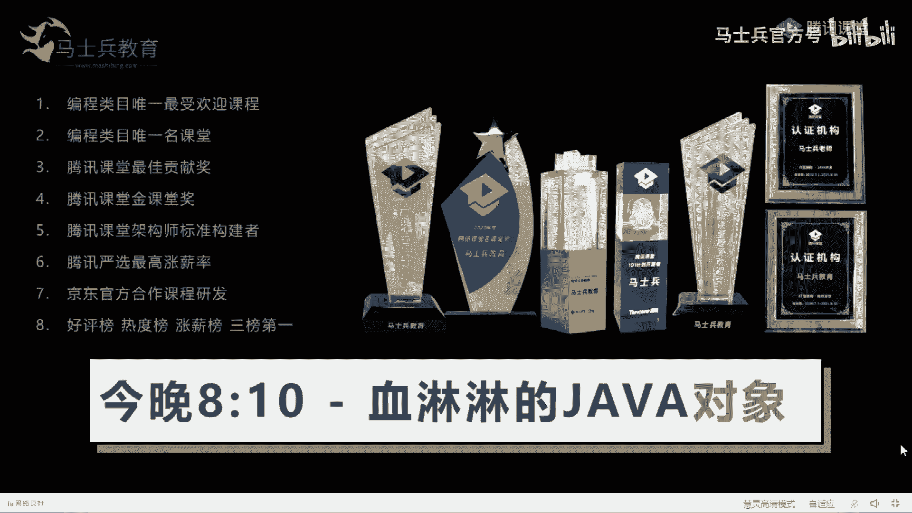
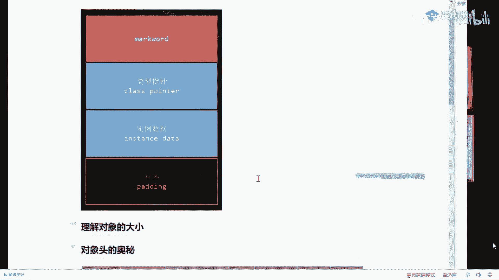
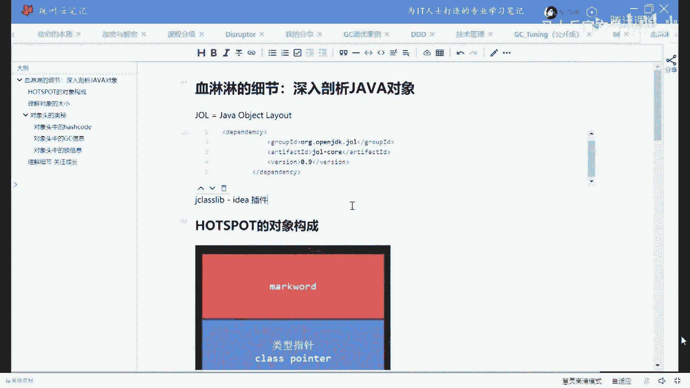
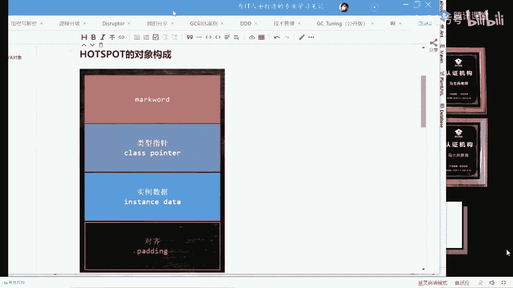
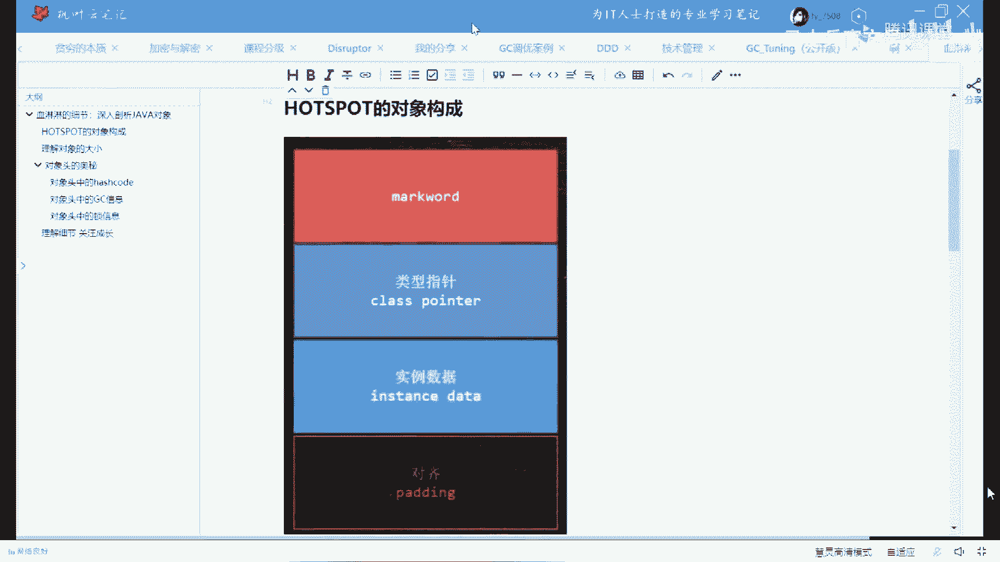

# 【马士兵教育】MCA架构师课程 主讲老师：马士兵 - P42：50w年薪面试题：1.前言 - 马士兵官方号 - BV1mu411r78p

今天晚上要讲的内容啊，我就不在这多废话了，下面我们开始聊这个这个对象的故事啊，嗯当然有同学可能会说，嗯你把我逗乐了，马哥我是驴帝，你脑子被驴踢了是吧，hello，嗯，没有声音吗，应该有吧，好那个。

当然有同学可能会说，这天天写面向对象，面向对象对象不就new一个嘛，它背后还能有什么特殊特殊的故事吗，呃有那么一点点，我将给大家听好，下面我们就开始，嗯开始之前我稍微的做一点小的调查啊。

这个有多少同学现在还是在学校上上学的，你给老师扣个一，我看大概有多少好吗，那其他同学就都是呃参加工作了是吧嗯，呃我倒杯水，哎呀因为最近嗓子不太舒服，所以水是离不了了，好我把我自己拖出去。

然后我把编程窗口挪进来。

ok就放在这，呃今天要讲的小程序呢也超级的简单，所以呢我就原来的这个我就不多做说明了啊，我就直接直接拿手敲就可以了，好大家听我说呃，今天呢是关于讲对象的故事，那么等会儿呢我会在笔记上呢。

把今天讲的关于对象的故事呢都给大家伙儿一点点记到笔记上去。

嗯这里面呢我主要讲这么几个内容，今天晚上呃第一个呢主要跟大家聊呢和sport对象的构成，第二个呢我教大家怎么去理解对象的大小，第三一个呢哎我给大家讲的对象头的奥秘，这是一个面试中的重点的重灾区啊。

第四个，呢我我我跟大家聊一聊呢，就是关注成长这部分好，那么这是我们的枫叶云笔记呃，这个笔记软件呢感觉越来越好用了啊，还挺好的，后面呢我们会持续地用它来做相应的分享啊，好了。

首先呢我简单跟大家聊一下一个对象的构成到底什么样，当然听我说，那么这个时候呢我需要一些工具，我首先呢把这个工具列给大家比较简单，常用的工具呢叫做jl，当然它全称呢叫你知道吧。

object layout啊，java对象布局工具呃，如果你想使用它的话呢，也特别简单，我在这儿给大家复制过来，给大家之后呢，你就可以自己去做实验了，好了，这是他的没有依赖。

ok这个是我们用到的这个工具的，没问的依赖呃，到时候你就加到你的那个那个项目里头去，就可以直接用了，它全称叫j o l，除了这个g o l之外呢，我还用到一个工具呢叫嗯。

这电动啊叫j class library，嗯，诶这个这个这个格式上稍微有点别扭啊，稍等一下，j class library啊，这个工具，这个呢是一个那个idea的插件。

呃所以呢你在idea里面直接直接搜就可以，这个class library呢它是用来观察一个class文件的一些细节，ok我们用到这两个工具啊，大家去下载就可以好，大家听我说。

下面呢我们开始聊第一个问题啊，就是呃在java里面。

