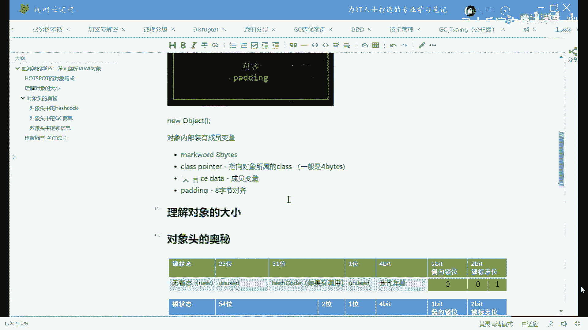

# 【马士兵教育】MCA架构师课程 主讲老师：马士兵 - P43：50w年薪面试题：2：对象头的三大作用你了解吗？ - 马士兵官方号 - BV1mu411r78p

嗯那么它到底长什么样呢，从一个普通对象角度来说呢，普通的对象角度。

他一共有四部分构成，这四部分分别叫mark word，class，pointer，instant state和padding，呃那个大家听我说啊，那么这几部分有同学可能不太理解啊。

就说老师您您这是在讲啥，一个对象，不就是你一个不就这样吗，不就new一个object吗，您那个给我讲说这个对象怎么分成四部分，是什么意思呃，为了照顾一点点，咱们就是基础比较弱的小同学们在听我说。

关于另外一个object，我想大伙应该都了解这一点啊，待会儿应该都了解这一点，就是在一个内存里面，这是我的画笔，在内存里面，当我们new出一个对象来的时候，这个对象他一定会在内存里面占一块空间。

这是没问题的，对不对，这个没问题的，给老师扣一啊，就是我们new出任何一个对象来的时候啊，他一定在内存里占一块空间，当然以前我们聊说这个对象啊，占了个空间，这个空间里头装的什么呀。

这空间里头装的是成员变量，一般我们是以前我们都这么聊啊是吧，我说new出一个对象来的时候呢，原来啊就是这个里面呢我们装的是成员变量，对象内部装有成员变量。

我觉得这个事儿大家是能接受，也很容易理解的呃但是现在问题呢是说除了成员变量之外。

还有没有其他内容，好好听，我说我今天给大家讲的是，当我们就出这个对象来之后，在这个对象的内部，除了成员变量之外，那么它有哪些部分具体来构成，那么它们都有什么用，听我说我今天讲的这堂课呢。

你有很多很多那种常见的一些小小的问题，你原来可能没有思考过或者思考不出来的那种问题，今天就统一给你解决了，好我先下结论，在hot sport这种虚拟机里面。

一个java的对象，它由四部分构成，哪四部分，第一部分我们把它称之为叫mark word。

这部分不好翻译，四部分，mark word，那么这个部分不太好翻译啊，我们把它理解为叫标记字，但这东西是什么意思，别着急，我后面会讲给大家听，那么这部分呢是八个字节，是八个字节，清过记录好。

那么第二部分是什么，第二部分呢叫做class pointer，这部分呢叫指向对象所属的class，这是什么意思，大家都知道我们java程序要想运行的时候，比方说我用到t这个对象了，我new了个t对象。

那么他首先得把t。class放内存里去好，这第二部分呢就是一个指针，这个指针呢会指向t。class。

通过这部分a b一指找到谁去了，t。class好，那么第三部分这部分才是真正的我们装实力的地方，也就是装我们的成员变量的地方，第四部分叫什么叫对齐，对齐的意思是说一定要被八整除，不能被八整除。

就给它补齐。

我先给大家记下来，一点一点给大家解释，instant data，成员变量啊，这是叫真正装成员变量的地方好，那么这部分呢一般是四个字节，这class pointer一般是四个字节啊。

这instance state它肯定不是固定的，你就放心吧，因为你装的成员变量越多，它肯定就呃那这个这个大小就越大是吧，那么第四部分叫padding，padding，什么意思，八字节对齐。

八字结尾结什么意思啊。

比方说我们前面三个部分加起来不能被八整除，我前面三个部分一加，那么它是多少呢，比如说是12个字典，那不能被完整数怎么办，再在这儿补四个四个字点，我不知道我说清楚没有，当然以前有同学问说。

老师为什么要补啊，如果你理解不了这件事呢，你就想象一下集装箱呃，当我们的大小对的比较齐的时候，像集装箱那样，我们装卸货物的效率会提高，假如说我们各个对象大小都对不太齐啊，这个11个那个七个那个七个半啊。

那个七个零一位，我告诉你，这，样的对象，你寻找起来和管理起来，它会非常非常的繁琐和麻烦，不知道我说清楚没有，来这块能跟上，给老师扣个一好吧。

咋签到，你现在就已经签了啊，不记往这儿看。

有同学说了，老师那你怎么能证明这四部分的存在吗，是可以的，我现在没向你证明这四部分的存在。

大家看这里，当我们运用了这个j o l这个工具之后呢，我们随便写个对象，比方说我们就用这个这个class啊，这个t t这个class好，下面我们写t小t等于6t然后呢。

我们怎么运用这个g o l这个工具呢，就java object layout这个工具呢这样来写，那么它有一个静态的live拿来用就可以了，叫class layout，class layout。

点pass instance，pass是解析的意思，instance是对象的意思，解析某个对象，解析哪个对象呢，解析小t这个对象，把它解析完的东西呢，to principle做成可以打印的样子。

然后呢给打印出来，哈哈刚才我应我我我再简单解释一遍，就是用它的class layout的这个类，他的pass instance静态方法，然后呢去解析t把解析出来的结果转成k大印的字符串。

然后再把它打印出来，如果不能理解的话，跑跑起来之后你看结果你就理解了。

好我们来看这个结果，好了，同学们，在这里呢我们就看到了t小t等于6t这个类，它在内存之中的所有的布局呃，如果说你要想看它二进制的一个布局的话，here看到了吗，这里面这里就是这个对象在内存中的每一位。

它到底是什么样子的，当然你这么看的话，你也看不出来它到底是什么意思是吧，我们往前慢慢看好，我刚才说过，我说在一个对象来说，他的有一部分叫mac word，还有印象吧，我这里好像做了一个设置啊。

我得把这个设置打开，不然容易引起，不然容易引起，引起误解啊，重新跑，因为我不小心把那个压缩给他关闭掉了，它默认是压缩的，这个一会我讲给你听，不着急呃，往这看啊，t小t等于6t那么在这儿呢。

这里这里是二进制的内容好，这里是16进制的内容好，这里是什么呢，这里说的是从第零个字节开始，往后数四个字节，那么这部分呢我们把它叫做object header，叫对象头，从第四个字节往后又数四个字节。

又还是对象头，我我刚才说过，我说mark word是多少个字节来着，mark word log字节八个，对不对，所以前面这八个字节好了，这里装的就是mac word，那好我刚，才说过。

我说class pointer是几个字节，四个字节对这四个字节就是class pointer，它通过它可以找到我们谁呢，找到我们t。class，当然这小t内部你看看它有成员变量吗。

所以它成员变量这部分长度为零，但是我们前面三个加起来之后呢，长度是12个字节，能被八整除吗，不能，所以这个时候呢在后面补四个，ok所以这个instance size 16个字节，就是这个对象的大小。

一共是16个字节，好了来这块儿，刚刚我讲的这一小段儿啊，能跟上那个老师扣一好吧，很小很小的一小段儿嗯，怎么还有扣六的呀，666吗，呃当你理解了这件事之后呢，我们来探索一下在这个对象的里边。

它背后的一些小秘密，首先第一点啊，我们来看看作为一个对象来说，它的大小到底是多少啊，坑问了个问题啊，他说为啥是两个mark word大哥，那不是两个，是这两部分加起来是mark word。

一共是八个字节，64位小伙儿，你是不是晕了，嗯，好这种基础的问题不解释了，在美团面试的时候，有一道著名的题，他这么问的，他问他问你，他说呃一个object在内存之中占多少个字节。

我直接告诉你跟这个t是一样的，因为它没有成员变量，那么它就有bug的，mark word，四个四个的class pointer，零个instance data补齐补四个，所以加起来一共是多少呢。

16个字节，你怎么还有说16k的，你知道16k是多少吗，k这个词你是不明白是吗，9296，我没说是16的倍数，我说是八字节的倍数，八字节能理解吗，需要我解释什么叫字节，什么叫we吗。

需要的扣7965x6543的开立方，不需要的扣个一，好既然没有开那个地方的，我们我们就直接往下讲了，啊哈哈开个玩笑，开这里啊，呃在这儿呢我们要稍微的简单的探索一下一个对象呢，到底它到底是多大。

嗯我给大家记两笔笔记啊。

就是理解对象的大小这件事，那么这一个对象到底有多大。

是由什么来决定的呢，他的脑袋是固定的啊，脑袋一共有两部分构成，一个叫mc word，一个叫class pointer，两部分加起来是12个字节，好决定它大小的主要是在于它的成员变量。

那比方说我给你举个例子，我这里写int来告诉我，当这样一个对象new出来的时候，它的大小到底是多少，我看一下答案，还有48的啊，五花八门啊，跑着玩儿，我们来考，我们来看看啊，看结果这个是多少啊。

我刚才说过了，我说前面这12个字节加起来都叫做对象头，对象头部里边有四个字节是谁呢，指向class文件的class pointer，然后前面这个八个字节是什么，这八个字节是什么东西呢。

是mark word，这是固定的好吧，所以你就记住一个对象脑袋上顶着12个字节，在这12字节后面，我们加了一个int类型，int类型，几个字典四个字节，所以12+4=16，能被八整除，还用补吗，不用补。

ok一共16个字节，好了再给大家，这就相当于考你们最基础的内容了啊，来再来一个lol来告诉我，多少个字节，24是吧，嗯这个还用我跑吗啊，这大多数都是24啊，这个是没问题的，为什么。

因为long类型是几个字节呢，八个是吧嗯好那我先跑完吧，这个确认一下啊，四个字节的long，八个字，四个字节的int，八个字节的long好考一个稍微难一点儿的小伙伴们来告诉我这个，哈哈32k。

来我来看一眼，k一共是32个是没错的，那么它内部布局什么样呢，首先12个字节的脑袋不说了，四个的int bag的lo布尔代，相传几个字节，一个字节only one啊，当然他占一位都行。

但是呢java面操作的时候呢，最小是一字节，所以一个字节那好后面要补七个，不然的话不能被八整除好，再来一个男的，好吧来谁能告诉我这个要占多少个字节，32 32还有别的吗，还有64嗯，还有问号。

ok还有40好看这里啊，先看答案，它多少是32个字节，为什么是32个，注意看它就比较好玩儿了，好前面12个字节脑袋也不说了，然后四个字节的int，八个字节的long，一个字节的布尔补三个字节。

为什么补三个，是因为呢我们后面有四个字节的s能看懂吗，我想先问我，有同学可能会说了，老师你这个怎么看也不像四个字节啊，大哥我想问你，如果一个t对象new出来了之后。

这个我们的字符串常量会装在我们t对象里面吗，不会他装谁啊，是不是装个s呀，s会指向我们常量池里面这个常量对不对，所以他就装了个地址，那个地址是多大呢，就是说这个地址四个字节引用类型吗，四字姐够了。

ok好，这块能跟上的老师扣个一，嗯嗯不错，好来再来个终终极难度，看这里boy的m来告诉我，多少个之间，你这是32图a一系统的意思吗，现在都是64位的java的虚拟机都是64位还是32，为什么。

还有40不知道不和你玩了是吧，ok好拜拜，趴一下，依然是32个字典对象，这东西在在一个对象里面会装方法进去吗，不会是吧，注意方法呀，所有的对象共享方法的字节码，所有对象共享，那么这个字节码放哪了。

这东西是放在我们class文件里面的，也就是说当一个对象产生了之后，如果你想对这个对象调用一个方法，它会通过这个class的指针找到对应的class的代码，然后，把这个对象当成this传给这个方法。

然后开始调用，能听懂吗，大学没教过是吧，嗯大学没教过，没关系啊，慢慢慢慢讲给你听吗，再重复一遍，再重复一遍方法，这玩意儿是放哪的，放在class文件里的对吧，我们不可能每个对象都放一个方法的。

那个完全没有必要啊，方法的实现不就一份吗，所以方法编译出来的字节码放哪儿，放到class文件里，这是没问题的，然后我们想对这个方法调用的时候，你比方说我t小t等于new t，然后t。

m我想调用它的时候是怎么调用的过程啊，大家知道这个小t它是，不是有四部分，第二部分是什么东西，是不是指向class的指针，这样的话我们是不是就找到这个class对象了，在这class对象内部。

是不是我们就找到了这个class对象内部的m方法了，然后呢我把这个指针这个对象的this this指向它自己嘛传给这个方法，然后就可以调用了，有同学说已经这么卷了吗，这个不算卷吧。

当然我今天讲的内容比较深入，今天讲内容大概是美团30万~50万年薪的内容，所以你们玩听认真听好吧，呃你练过你可能就拿到这个年薪了好了，class放哪变量名的情况，变量名是那个也放在class文件里的啊。

但是这个变量的内容啊，它的它的里边放的这个值是放在我们对象里边的，对一开始方法去class文件方方法去啊，好了好了，不再不再解释了，我们我们我们再继续啊，对这是java，没错好，我们再继续呃。

当然这个解释呢对于非非计算机专业的学生来说呢，可能就稍微有点深入了，不过我再强调一遍，今天讲的东西面向美团这一类大厂，30万~50万年薪呃，所以呢难一点也是正常的好吧，如果太容易了，你们所有人都拿到了。

不可能，ok好。

