# 【马士兵教育】MCA架构师课程 主讲老师：马士兵 - P44：50w年薪面试题：3：HashCode就记录在对象内部你清楚吗？ - 马士兵官方号 - BV1mu411r78p

的话呢我们就大概知道了，我把这我我把这代码给大家复制一下，放到我们的笔记里，嗯好，好大家需要的话呢去把这个代码复制下来，你自己去做一做实验就ok了，好吧非常的简单呃，这部分呢其实不太难。

就是理解对象的大小，但是在这部分有一点点小小的坑，我想讲给你们听，大家听我说美团的第一个问题啊，他是这么问的，他说object object到底的它的大小是多少，那么我这个实验我不想给你们做了。

你们拿大腿想一想，应该能推得出来object大小是多少，来告诉我16个字典，对没错啊，说的很对，但是听我说，其实呢我们说一个对象的大小呢还不是完全固定的，我想我现在想问你们。

你们现在用到的java虚拟机，它是多少位的java虚拟机问答一个简单的小问题，64对这个东西怎么看呢。

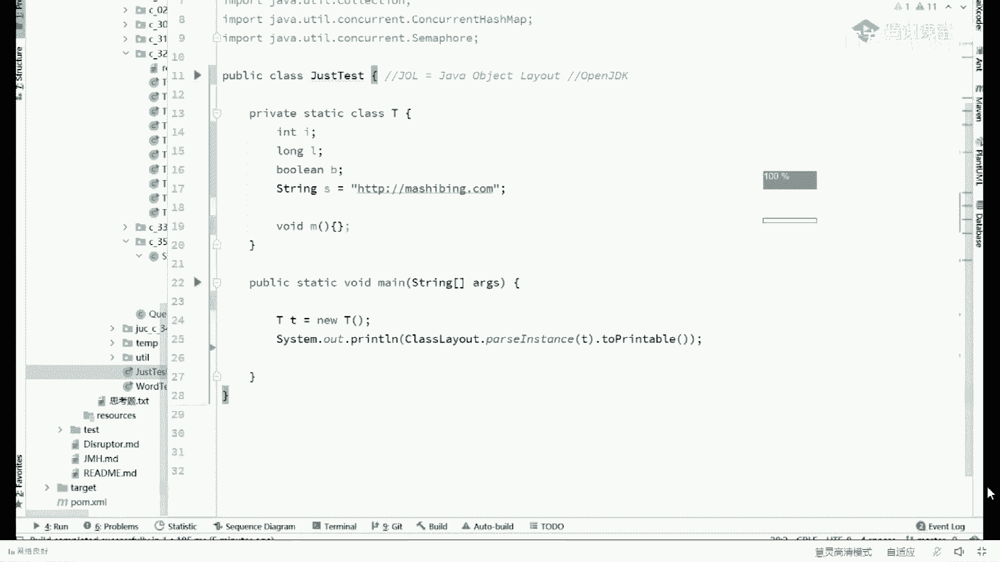

其实非常的简单啊，你你你只要打开一个那个窗口，你敲一个，java version就可以了，他会告诉你我用的这个呢是java hosport，就是虚拟机的名字，然后64位的server server模式。

它是一个64位，那我想问你的是，在一个64位的机器里面，一个指针的长度是多少，我想大家大家了不了解什么是64位的机器啊，就原来咱们从八位机器到16位到32位到64位，64位是什么意思。

64位叫做寻址能力，注意是寻址能力什么意思啊，就是64位的机器能用多长来代表一个地址，能不能听懂，比方说我要用一位来代表一个地址的话，我我能找到几，个地址啊，一个零一个一两个能理解吧。

那我用两位来代表一个地址的话，我能寻址能选几个地址，00011014个，对不对，那以此类推，如果说我们是64位的机器，我们能寻找多大的地址呢，就是我们能找到多大的内存空间呢，就是2~64次方好了。

也就是说大家知道我们所有的变量都放在我们的内存里面，我们要找这个变量的时候，那他一定是得有一个地址告诉你这个变量的地址在哪，那这个地址呢是用64位来进行存储的，那也就意味着我能够管理的内存到底。

是多少呢，二的64次方来这块能get到的，给老师扣个一，这个应该没问题啊，非常基础的计算机的内容，那大家想问你的是呃，原来呢你们可能每个地址的大小，我的老天爷啊，64位，64位，你说每个地址的大小呢。

从零一直到2~64次方减一嘛，我零基础学web的，学web的小伙伴呢，你先补点基础内容，好吧好了，听我说，那么如果是32位机器呢，它当然就是二的32次方，二的三次方是二次方是多少，大家知道吗。

四个g所以在32位机器的时候，不知道大家还有没有印，象你们的内存条的大小最高只能四个g，不可能比4g高，那么后来才突破了四个g，然后呢你们的内存条才变成了a 16个g，64个g等等等，等，好了看这里。

那现在问题就来了，作为一个64位的虚拟机，它的地址的大小应该是多少，当然应该是64位的，64位，几个字典当然应该是八字节，同学们，我们我不知道你们注意到没有，在我们的java对象里面。

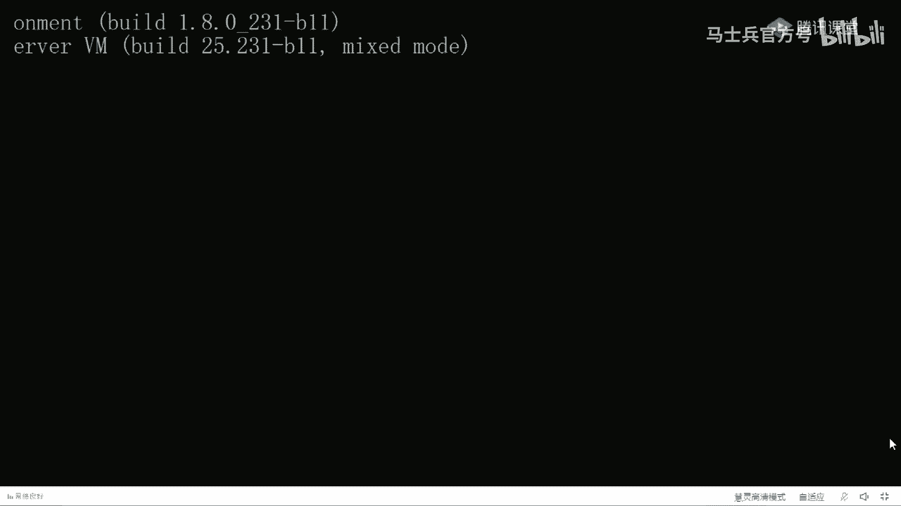

缩小一点，在我们的java对象里面，我们刚才运行的这个结果，这是jav里面的一个地址对吧，还记得这地址大小是多少吗，这个地址大小是四个字节，你不觉得奇怪吗，你应该觉得奇怪好吧，原因是什么。

因为一个64位的虚拟机，您老人家一个引用的大小应该就是八字节，你凭什么是四个字节。

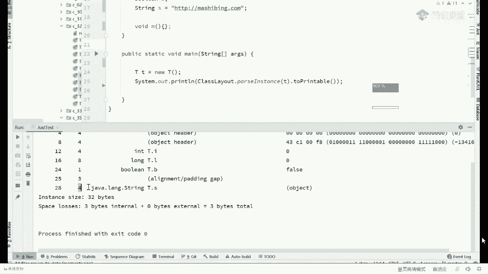

这个呢也很好解释，大家看这里，是因为什么呢，我能在执行这个刚version的时候加一个参数，让他把默认的自带的那些个参数给打印出来，print，on line flags，我加上这个参数啊。

conversion，这参数是什么意思呢，这参数就是说当你运行一个java虚拟机的时候，你把这个java虚拟机默认的一个设置给我打印出来，默认一些自带的参数都打印出来啊。

command line flag回车，好，在这个command line flags里面呢，你会发现呢它这里有一个很好玩的东西。

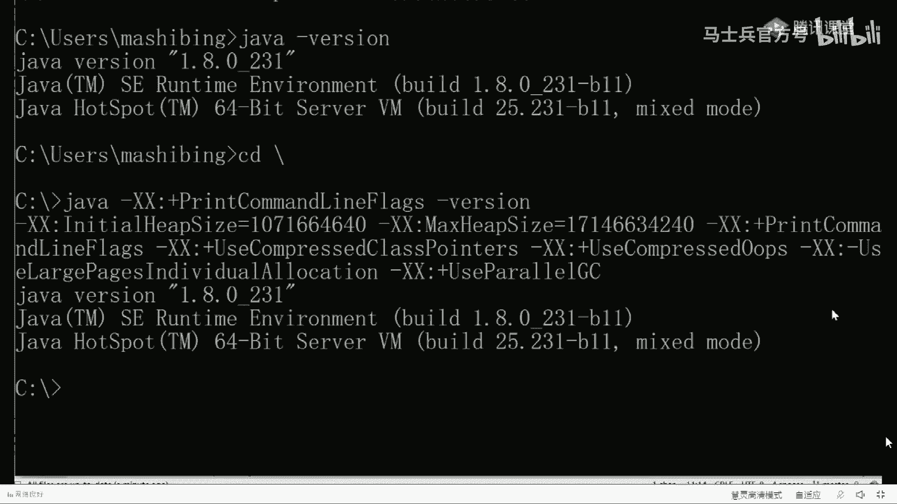

这里把把把把把两个单词给他，那什么了啊，这里有个很好玩的东西，往这儿看，这个这是它自带的一个参数，然后它前面还有一个参数，你读一下读一下，解释一下什么意思。

use使用compress压缩的class pointers，class pointer，诶，刚才我们讲的对象的第二部分指的是什么来着，对象第二部分是不是就是class enter。

所以这里说的特别简单，因为它这里使用的是压缩的类指针嗯，还有同学说什么叫压缩类指针啊，就是原来这个类指针正常应该就是八个字节，因为您老人家是64位的虚拟机，您就应该是八个字节，可是呢由于你默认带了压缩。

所以这里它就变成了四个字节，因为四个字节就够用了，一般四个字节就已经寻址四个g了。

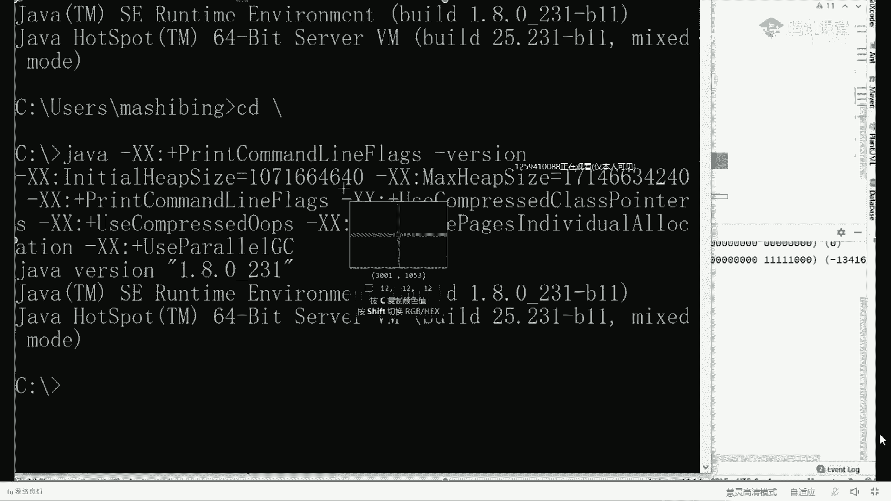

你的程序的大小不会有那么大个儿的。

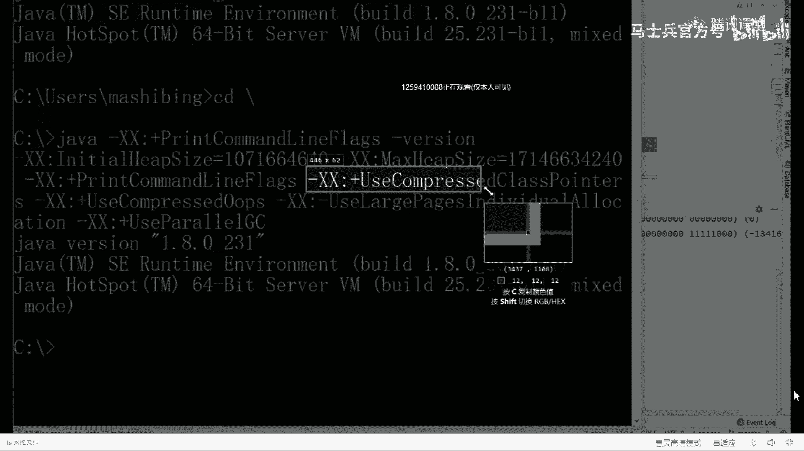

ok好了，那有同学说老师我能把这个压缩也打开吗，完全可以来为你。

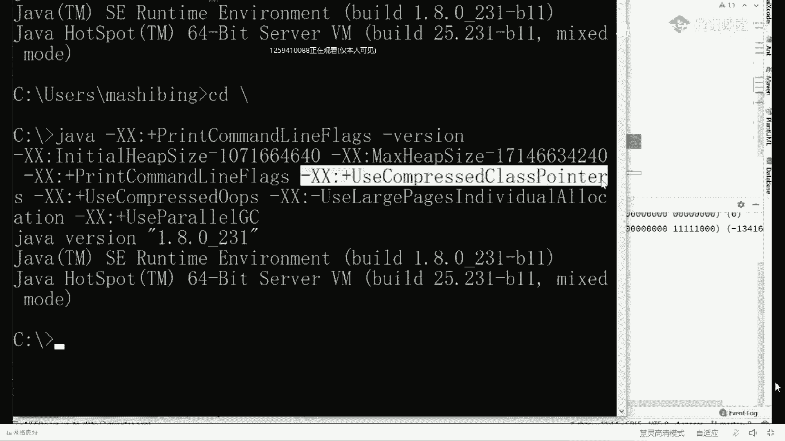

我给你演示一下，嗯好了没有说好，再来run edit，我在运行的时候加上这个参数，跟xx注意这个加号表示打开，减号表示关闭，你注意对比原来的咱们的class pointer是四个字节，对，只有美。

run，edit，刚access点，last point子少了个s啊，sorry，好往这儿看看主要看哪部分，我看这部分你们看还记得吗，原来我们的object header是多少，是不是12个字节。

现在已经变成多少了，变成16个了，发现了没有，object header，object header，object object，现在又多了一个object header的部分。

所以我们整个对象的大小已经变成40个字节了，来这块能get到的，给老师扣个一，嗯嗯，那有同学有同学可能就会问了，说老师我生产环境默认默认要打开吗，当然当然要打开，这个压缩，为什么要压缩。

压缩是因为四个g的空间已经够使了，明白吧，也就是32位的寻址空间已经够了，你干嘛非得要那么大个儿呢，能理解吧，四个g空间已经够了，ok对你运行你这个程序来说，所以他默认就给你压缩了，它省空间啊。

省一半啊，这个是省很大空间，当然有同学说老师这个s为什么还是四个字节呢。

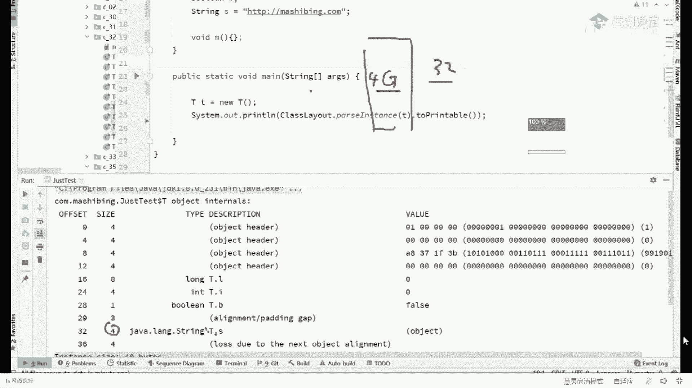

是因为你运行的时候呢，它有两个参数来控制的，这个参数只是控制它的类指针，下面这个参数是真正控制普通对象指针的，好看这里。

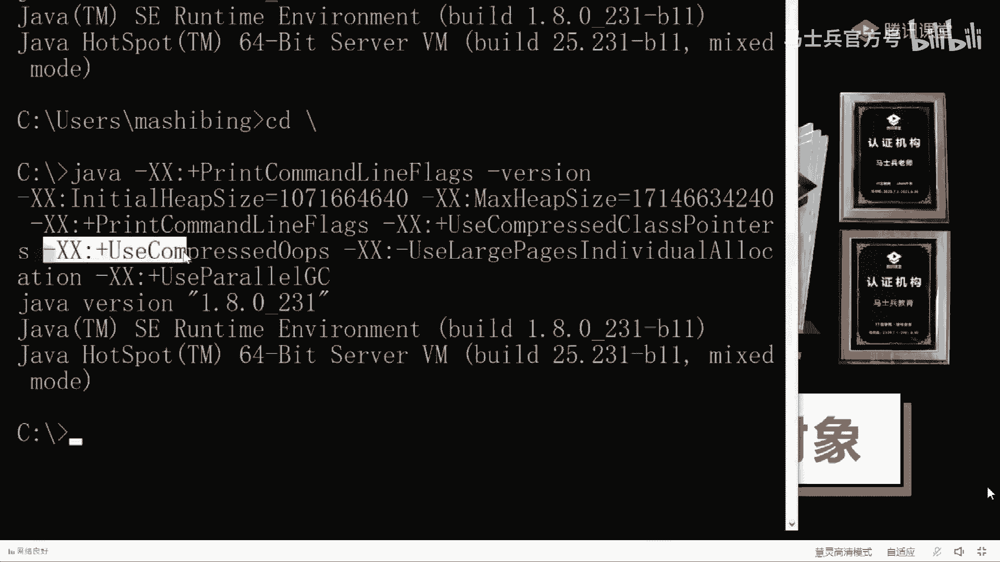

在这儿呢我来把这个也给大家打开，让你再看一眼，你就理解了啊。

好，我再加号改成减号搞定，然后呢我们点run，注意看这时候的string，它的大小会变成多少，好了你看那个t。s变成多少啊，八个字节，叫ordinary。

ordinary object pointers，这里指的什么叫普通对象指针，就是你平时用到哪些指针，平时用到哪些引用，它的一个大小，由这个来控制，当然这里面还有一些血淋淋的细节，我不想再深入了。

再深入，我估计待会可能接受不了了，嗯，它主要是说32个g。

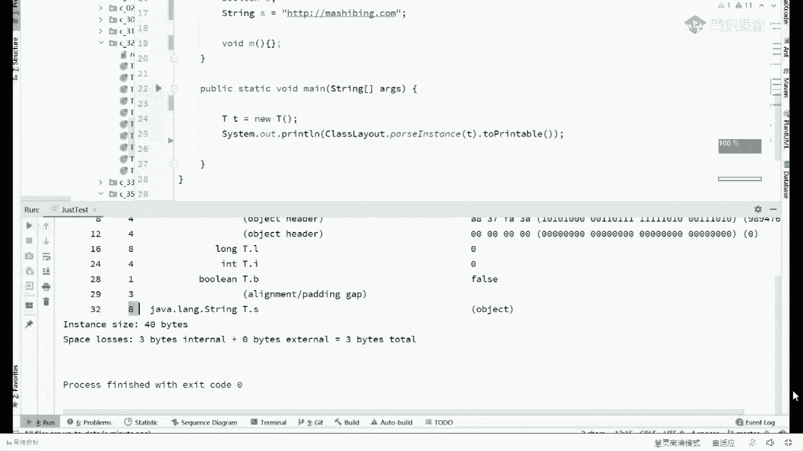

我我30 32个g过后。

他的这个压缩就就失效了，就特别好玩啊。

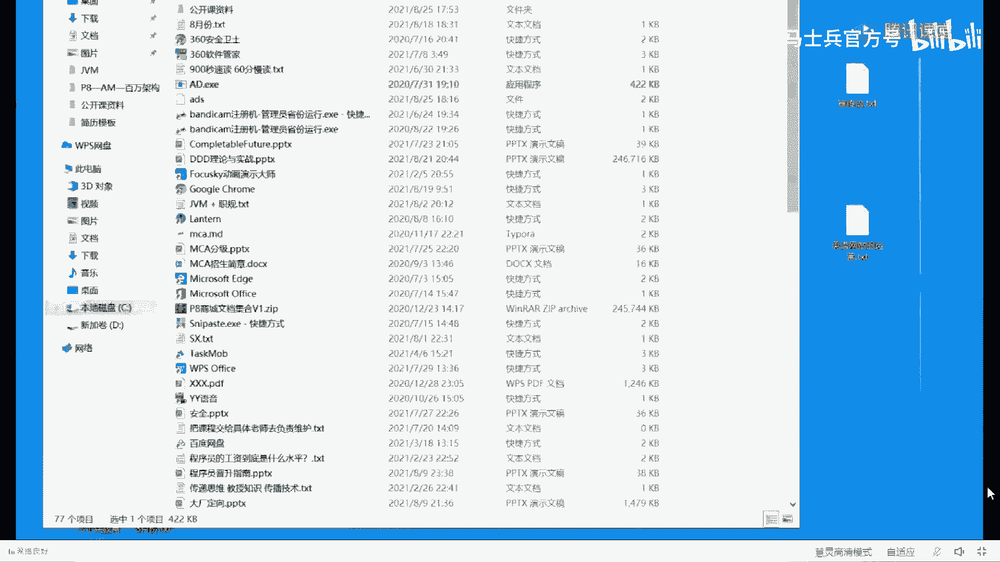

好。

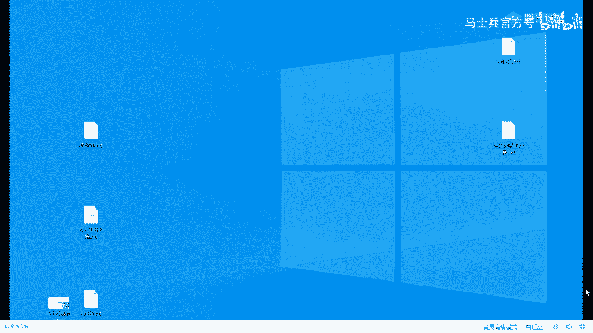

如果32位vm在压缩指针，32个m没有压缩指针好了，我们聊完这些简单的问题之后呢，聊一点复杂的问题，我们聊聊一聊对象头，我我告诉你啊，这个对象头呢是最复杂的地方，也是面试面的最最最最最多的地方。

这个摄像头这玩意儿呢是超级超级呃，难于理解，以及那个那个那个那个特别重要的东西啊，摄像头还记得吗，大家还在，我不知道大家还记不记得，那么第一部分呢我们把它叫做mark word好了，听我说呃。

中面试的重灾区就在这，那么第二部分我们把它叫做，collect pointer，这个东西呢倒是比较简单，这个我们把它放过去看，这里对像头对象头指的是什么东西呢，对象头呢在我们这里呢我们专讲的是马克啊。

大家还记得一个mark word，它大小是多少吗，64位，对不对，好了，我这里我画了一个最简单的图，64位的图在网上你看到这张图，老师画的，在这里面呢详细的给你解释了，在一个64位的对象的脑袋上。

mark word里面到底里面装的什么东西，我先说结论，我先说结论啊，哪三个东西呢，好第一，个它叫做还是扣的，好这是第一个，那么第二个它叫做锁信息，有同学说老师这个东西能验证吗，完全也可以看这里。

我来带你验证，我先把压缩的这个都给它关掉，没用了，咳咳，好来看这里啊，呃我们把这个多余的内容也给他删掉啊，就留一个小t在留一个t啊，留个空的t在这里呃，那么大家看啊，我们t角d等于6t。

我们把他的那个布局给打印出来，你先往这看，好看看这里大家记得哪部分是mc word呢，这部分对这部分是mac word这部分啊，你记得现在这个mark word的表表现，我稍微做一点小小的动作。

你就会发现macd变了，比如说我就我就这么来了一下，t点还是cold，然后呢，我再把它打印出来，咱们上下做一个小小的对比走，你，hello，同学们，你们想知道那个特效是什么吗。

power mode to啊，不说了，看这里我们主要来对比这两个东西的，待会儿不要跟这开始玩特效了，好了，看这里，这是我们没调hash code之前的mark word。

这是我们调用完hash code之后的mark word，你发现你应该发现区别了吧，只要你长了眼睛，对不对，也就是说我们我觉得你至少应该get到一点，就是ok原来一个对象呢还是扣的信息。

一个对象呢还是靠的信息记录在哪里，记录在他的脑袋上，记录在他的mc word上，当我们调用完一次之后，下次再调用一个对象的hash code，一个对象的hash code能随便变化吗，能不能不能。

所以ok这个对象的hash code就记录在了脑袋上，当然这里面还有一个细节，它其实是叫做identity hash code，就是你没有重写之前的那个还是code，如果你把还是cod给重写了。

那不好意思，这玩意儿还是这个identity还是cold啊，ok所以我们这个节目第一个结论就来了，就是说我们的对象脑袋上会记录他的还是code，不是各位各位大哥，你们这是聊啥呢，我想问问。

class pointer肯定变不了的，你们聊啥呢，聊聊聊插件的是吗，好了，我刚才讲的技术的内容能跟上，那老师扣一，我觉得今天年轻人比较多，感觉非常，非常非常的灵动，想法挺多的嗯，98年98年老家伙了。

咱俩同岁啊，96年96年得管你叫哥呀，嗯调用调用一下hash code咋就办了，因为你hash code调用完之后，它的还是cod信息会写在脑袋上，好了好了嗯，还不太信我的，说你不信我，你过来听老师课。

那我讲的技术你也不信了，好看这里啊，91年的，难道娘娘阿姨，你先证明你是女的再说好，这是第一个信息，你会意识到哦，原来还是扣的，这个信息是记录在脑袋上的，我们来聊第二个信息，锁信息，有同学可能就会说了。

说老师这个锁信息是什么，是什么信息，同学们，你们写过量的代码吧，synchronized t来这个应该都用过，对不对，sychronized好，当你用过这个，语句之后啊，我们把它用完。

这个语句呢也给它打印出来好，这里synchronized the te指的什么意思啊，是不是把它当成一把锁，当然我们通俗的说法呢叫锁定这个对象，但是专业的讲法呢就把这把把这个对象当成一把锁。

那为什么要用锁呀，要用锁，主要是为了解决多线程访问数据不一致的问题，什么叫多线程访问数据不一致啊，我给你举个最简单的例子，多线程访问所谓的多线程访问数据不一致啊，这是，好这是这是一个马桶，马桶也姓马。

好马老师讲，马桶前面有一道门儿，那么一个人进去的时候要办事儿，哭哧哭哧在里边办事儿，那么如果你不上锁在计算机的角度呢，就是允许别人进去也同时办事儿，那就是几个白花花的屁股怼在一起，然后一起办事儿。

这个画面太美好，不敢想象，所以这个是成问题的，也是不应该的，如果你想保证在同一个时刻，只有一个人在里面办事儿，你该怎么办，是不是上厕所对上把锁的概念。

当然我们普通理解的上把锁就是我们真的拿一把锁头光机往上一锁，但是在计算机里面，它实际上这把锁是怎么构成的呢，怎么就叫一把锁呢，听我说，简单说呢就是把一个对象当成一把锁。

那把这把什么叫把一个对象当成一把锁呀，我们上下一对比，你就理解了，跑一下看，来我们前后对比，你会发现一个明显的对比，这是最开始的时候一个普通的对象，这是被我们锁定的对象，发现区别了吧。

那我想这就是下一个结论很容易就得出了，就是说我们说一个现成的关于锁的信息啊，一个一个对象的关于锁的信息记录在哪，也记录在他的脑袋的mark word上面，这块没问题吧，嗯很简单，就是说诶如果你想想看啊。

第一第一个线程来了，诶我锁定这个对象了，锁定这个对象了，就是在他脑袋上改了，改了一些东西，那么另外一个县城如果来了。

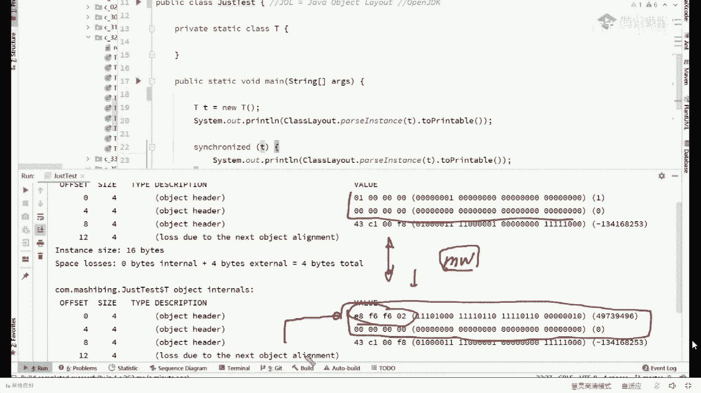